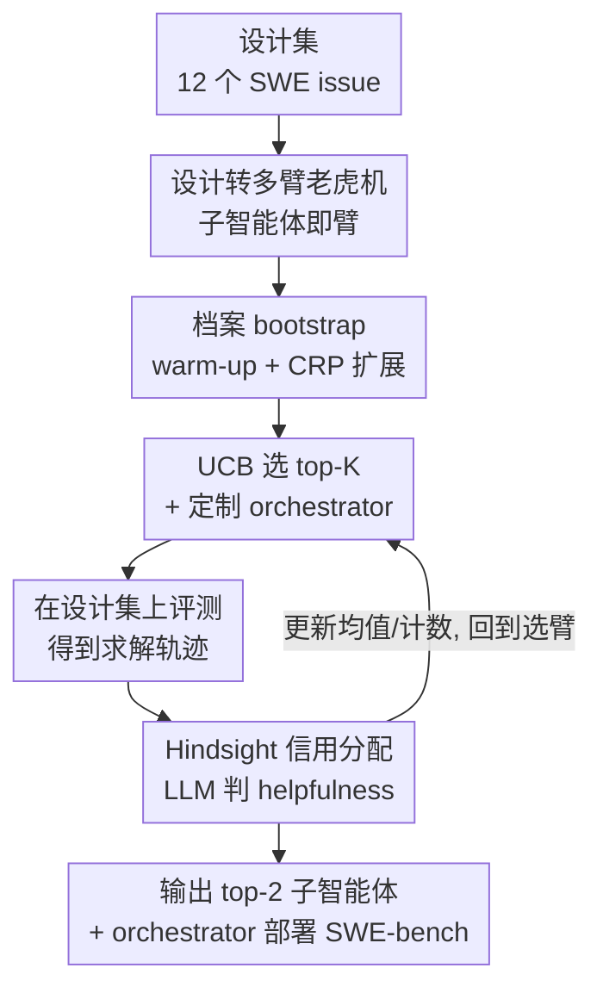

# BOAD: Discovering Hierarchical Software Engineering Agents via Bandit Optimization

**会议**: ICLR2026  
**OpenReview**: [https://openreview.net/forum?id=O6stE173BD](https://openreview.net/forum?id=O6stE173BD)  
**代码**: https://github.com/iamxjy/BOAD-SWE-Agent  
**领域**: LLM Agent / 软件工程  
**关键词**: 软件工程 agent、多臂老虎机、分层多智能体、信用分配、SWE-bench

## 一句话总结
BOAD 把"为软件工程任务设计一套分层多智能体系统"这件事重新表述成多臂老虎机问题——每个候选子智能体是一根臂、奖励是它在团队协作中的"有用度"（helpfulness），再用 UCB 做探索-利用、用中餐馆过程动态扩档案、用 hindsight 信用分配避免"搭便车"，从而在有限评测预算下自动发现"一个 orchestrator + 两个专精子智能体"的结构；在 SWE-bench-Verified 上 36B 模型拿到 53.2%，在更偏分布外的 SWE-bench-Live 上以 20.0% 一度位列排行榜第二，超过 GPT-4o、Claude 3.7 等更大的模型。

## 研究背景与动机
**领域现状**：LLM 在自然语言推理和代码生成上进步显著，但解决真实世界的软件工程（SWE）问题——长程、需要在大代码库里导航、对分布外 issue 鲁棒——仍然很难。当下主流的 SWE agent 几乎都是"单 agent 在一条推理链里"包办全部子任务：读懂 issue、定位文件、改代码、跑测试。

**现有痛点**：这种 monolithic 设计强迫模型在整条链里一直保留无关上下文。比如编辑代码时其实只需要知道改哪一行，却还背着"这个文件当初是怎么被定位出来的"那一堆历史。冗余上下文带来伪相关（spurious correlation），让模型过拟合训练分布，在 SWE-bench-Live 这类更新、更分布外的 issue 上明显掉点。

**核心矛盾**：一个自然的修法是模仿人类工程师——把任务拆给一个 orchestrator 协调若干专精子智能体（定位、编辑、验证）。但难点有二：其一，人工设计的分层往往跟 LLM 的实际行为不对齐，作者实验里手工加 sub-agent 反而比 baseline 掉点；其二，要自动发现有效分层又会遇到组合爆炸（sub-agent 越多、子集越指数级）和信用分配模糊（团队成功不代表每个 sub-agent 都有用，弱者可能"搭便车"）。

**本文目标**：在 SWE 这种"单次评测就很贵"的约束下，自动发现一组有效的 orchestrator–子智能体结构，而不依赖人工指定角色。

**切入角度**：采用自底向上的策略——先单独识别有潜力的子智能体、再把它们组队，把搜索空间从指数级压成线性；信用分配则不看团队最终成败，而用 LLM-as-a-judge 评估每个子智能体在轨迹中的中间贡献。

**核心 idea**：把多智能体设计直接当成多臂老虎机——每根臂是一个候选子智能体、奖励是它的 helpfulness，用成熟的探索-利用算法在有限预算下高效发现强子智能体，这套框架就叫 **B**andit **O**ptimization for **A**gent **D**esign（BOAD）。

## 方法详解

### 整体框架
BOAD 要自动求解的是：找出一组 $K$ 个子智能体 $\Omega=\{\omega_1,\dots,\omega_K\}$ 加一个 orchestrator $\pi$，最大化期望任务奖励 $\max_{\pi,\Omega}\,\mathbb{E}_{x\sim D_{\text{design}},\,\tau\sim\pi}[r(s_T,a_T)]$。直接对 $(\pi,\Omega)$ 做进化/随机搜索不可行，因为每评一个候选都要跑完整的长程多轮轨迹、反复查奖励，太贵。

BOAD 的做法是维护一个候选子智能体**档案** $\Gamma$，把"单个子智能体"而非"子集"当作老虎机的臂。整个流程是一个 $B$ 轮的在线循环：先 bootstrap 出初始档案并对每个子智能体做 warm-up（让它能被 orchestrator 当工具调用）；每一轮以一定概率用中餐馆过程往档案里加一个新子智能体，然后按 UCB 分数选出 top-$K$ 子智能体、为它们定制一个 orchestrator、在设计集上评测得到求解轨迹；再用 hindsight 信用分配给参与的每个子智能体打 helpfulness 分、更新它们的均值与计数，进入下一轮。循环结束后取 helpfulness 最高的两个子智能体配上定制 orchestrator，部署到 SWE-bench。

### 关键设计

**1. 把多智能体设计转化为多臂老虎机：以子智能体为臂**

直接联合搜索 $(\pi,\Omega)$ 的致命问题是组合爆炸——子集 $\Omega$ 的数量随子智能体数指数增长，而每个候选都要跑昂贵的 SWE 评测。BOAD 的破局点是**不把子集当臂、而把档案 $\Gamma$ 里的每个子智能体 $\omega$ 当一根臂**。每轮 $t$ 从 $\Gamma$ 里选 $K$ 个臂组成 $\Omega_t$、实例化一个 orchestrator $\pi_t$、在设计集上评测 $(\pi_t,\Omega_t)$，再把反馈**独立**回传给每个参与的子智能体并更新它的估计 $u_\omega$。因为同一个子智能体会出现在很多不同子集里，一次评测（哪怕整体失败）能同时为多个子集提供信号。这样搜索空间随子智能体数**线性**而非指数增长，信息还能跨子集共享，大幅减少在烂设计上的浪费——这正是把昂贵的 SWE agent 设计搜索变得可行的关键。

**2. 档案的生成、warm-up 与中餐馆过程动态扩展**

光有"臂"还不够，还得保证档案里有可用且持续更新的候选。初始档案 $\Gamma_0$ 由 LLM 按模板提示生成。但生成出来的子智能体未必能被调用：orchestrator 把子智能体当**工具**（沿用 SWE-agent 的 tool-calling 协议），靠解析 docstring 才知道它的功能和必需输入——例如 issue-localizer 需要 issue 摘要作为输入，缺了就没法工作。为此 BOAD 加了一个 **warm-up** 阶段（论文用 $W{=}4$ 轮），用设计集里随机采样的实例迭代地把每个子智能体的 docstring 改写成精确的输入/输出规格，让 orchestrator 能正确集成它。

固定档案还有停滞风险：UCB 一旦锁定几个强子智能体就会反复利用，没机会发现新行为。BOAD 用**中餐馆过程（CRP）**动态扩档案——每轮以概率 $\Pr(\text{new at }t)=\dfrac{\theta}{\theta+|\Gamma_{t-1}|}$ 生成一个与现有都不同的新子智能体（$\theta>0$ 是集中度参数）。档案小的时候频繁加新、档案大了概率自然下降、转向复用已有；$T$ 轮后不同子智能体数量以 $O(\theta\log T)$ 增长，既无界又受控。

**3. UCB 平衡探索与利用，并为团队定制 orchestrator**

选哪些子智能体来评测用经典的 **UCB** 策略：对每个 $\omega$ 跟踪经验均值 $\hat\mu_\omega(t)$ 和被选次数 $n_\omega(t)$，分数为

$$\text{UCB}_\omega(t)=\hat\mu_\omega(t)+\sqrt{\frac{2\ln t}{n_\omega(t)}}.$$

第一项偏好已观测表现好的，第二项给欠采样的子智能体一个"乐观加成"鼓励探索；从未被选过（$n_\omega=0$）时令 UCB$=+\infty$ 强制初始探索。每轮取 UCB 最高的 top-$K$。

但光有好子智能体还不够——orchestrator 也必须适配它的团队。BOAD 比较了两种 orchestrator 提示：一种是只笼统鼓励"去调用子智能体"的通用提示，另一种是由 Claude-4 生成、**显式点名 top-2 子智能体并给出使用计划**的定制提示。消融显示定制版把 Live 成绩从 16.7% 拉到 20.0%，说明子智能体提供了新能力，而 orchestrator 必须被专门化才能有效协调它们。

**4. Hindsight 信用分配：用 helpfulness 取代成功率，消除"搭便车"**

最自然的子智能体打分是"包含它的轨迹成功率" $u_\omega=\frac{1}{|T^t_\omega|}\sum_{\tau\in T^t_\omega}\mathbb{1}\{\tau\text{ 成功}\}$，但这有严重的**搭便车（free-rider）**问题：一个本身没贡献的子智能体，只要常和强子智能体共现，看起来就很有用。

BOAD 换成 **hindsight 信用分配**：只要某个子智能体的动作帮 orchestrator 朝解题方向推进了，就给它信用，哪怕最终整体失败；反之没帮上就罚，与最终成败无关。具体地，对轨迹 $\tau$ 里出现的每个 $\omega$，用一个 LLM judge 读完轨迹给出二元标签 $\ell_\omega(\tau)\in\{0,1\}$（是否判定该子智能体在这条轨迹里有贡献），其表现分定义为

$$u_\omega=\frac{1}{|T^t_\omega|}\sum_{\tau\in T^t_\omega}\ell_\omega(\tau).$$

由于信用直接挂到"被评判的中间贡献"而非二元结果，这个信号比成功率更 informative，也避开了搭便车。消融里它是核心：top-2 配置下 helpfulness 选法 20.0% 远高于成功率选法的 15.3%。

### 损失函数 / 训练策略
BOAD 不训练模型权重，整个流程是一个 outer-loop 的在线设计搜索（Algorithm 1）：预算 $B{=}20$ 轮、每轮选 $K{=}3$ 个子智能体在 12 个设计集 issue 上评测、warm-up $W{=}4$ 轮、CRP 集中度 $\theta$。执行用 Seed-OSS-36B-Instruct（temperature 0，单 H100 节点），候选生成与 helpfulness 评判用 Claude-4。整轮优化约 12 小时（56 核 / 440GB RAM）；论文指出第 10 轮时 top-2 子智能体已与后续收敛结果一致，跑 10 轮不到 7 小时即可。

## 实验关键数据

### 主实验
统一用 Seed-OSS-36B-Instruct + SWE-agent scaffold，对比不同设计方式（Verified 500 题、Live 300 题）：

| 数据集 | Scaffold（Seed-OSS-36B） | Resolved % |
|--------|---------------------------|------------|
| Verified | SWE-agent（baseline） | 49.8 |
| Verified | + 人工子智能体 | 47.4 |
| Verified | + 进化搜索 | 46.0 |
| Verified | **+ BOAD** | **53.2**（剔除 12 设计题后 53.1） |
| Live | SWE-agent（baseline） | 12.3 |
| Live | + 人工子智能体 | 14.0 |
| Live | + 进化搜索 | 17.0 |
| Live | **+ BOAD** | **20.0** |

在 Live 上 BOAD 20.0% 较 baseline 12.3% 相对提升约 63%，一度位列排行榜第二，超过 GPT-4o（10.0）、DeepSeek-V3（13.3）、Claude 3.7 Sonnet（13.7）等更大模型；在 Verified 上 53.2% 也刷新了小模型 SOTA。值得注意：**手工加 sub-agent 反而比 baseline 掉点**，印证"人工角色常与 LLM 行为不对齐"。

token 开销不增反降（Table 2，每题平均）：

| 指标 | Setting | Verified | Live |
|------|---------|----------|------|
| 总 token (M) | SWE-agent | 0.92 | 1.49 |
| 总 token (M) | + BOAD | 0.93 (+0.7%) | 1.13 (-23.8%) |
| 最大输入 token | SWE-agent | 34.6k | 49.0k |
| 最大输入 token | + BOAD | 30.5k (-11.6%) | 36.7k (-25.0%) |

任务分解显著缩短了输入上下文，Live 上总 token 反而少了近四分之一。

### 消融实验
均在 SWE-bench Live 上（Seed-OSS-36B）：

| 研究问题 | 配置 | Live % |
|----------|------|--------|
| 仅 prompt 优化够吗 | w/o sub-agent / w sub-agent | 16.3 / 20.0 |
| 子智能体越多越好吗 | top-1 / 2 / 3 / 4 / 5 | 16.3 / **20.0** / 16.3 / 16.7 / 13.7 |
| 要定制 orchestrator 吗 | 不定制 / 定制 | 16.7 / 20.0 |
| 要扩档案吗 | 不扩 / 扩 | 17.0 / 20.0 |
| 要 hindsight 信用吗 | top-2 成功率 / helpfulness | 15.3 / 20.0 |
| 子智能体能跨模型迁移吗 | Claude 3.7 / +top-2 子智能体 | 13.7 / 16.3 |

### 关键发现
- **子智能体不是越多越好**——恰好 2 个最优（60/300）；1 个无法专精、3~5 个被通信与协调开销拖累（5 个反而掉到 13.7%），小而专的团队最划算。
- **hindsight 信用分配是核心**：换回成功率排序明显掉点（top-3：16.3→11.3，top-2：20.0→15.3），证明解决搭便车对挑出真正有用的子智能体至关重要。
- **自动发现 > 人工设计 / 进化搜索**：进化搜索同等评测量下只有 17.0%，且 Claude API 成本是 BOAD 的两倍多（每轮都要新生成大量子智能体，而 BOAD 跨轮复用）。
- **定性分析**：多 agent 的优势在于 patch 更短更局部、对需要多处修改的 bug 覆盖更全（专门的定位子智能体先彻查再改）；失败模式是"未经校验的子智能体输出被 orchestrator 当 ground truth"，错误向下游传播，缺乏中间自检。

## 亮点与洞察
- 把"agent 架构搜索"形式化成"多臂老虎机 + archive-as-arms"是真正巧妙的一步：搜索复杂度从指数降到线性，且一次评测的信号能跨多个子集共享，这套 reformulation 可迁移到 SWE 之外的任意 agentic 系统设计。
- hindsight + LLM judge 解决 free-rider 是可复用的 trick——当团队奖励稀疏且共享时，用"中间贡献"而非"最终成败"来分摊信用，比朴素成功率信息量大得多。
- "两个子智能体最优"反直觉却有清晰解释（协调开销随团队规模上升），提醒做多 agent 系统时别盲目堆数量。
- 用 CRP 控制档案增长，把"探索新行为"与"复用已知强者"用一个概率自然平衡，省去手调档案大小。

## 局限与展望
- 发现的子智能体只能**部分跨模型迁移**（为特定模型优化），换到 Claude 3.7 时增益缩水。
- 失败模式暴露 orchestrator 会**无条件接受子智能体输出**导致错误传播，缺乏轻量验证（作者建议加 span 交叉核对、不变量测试、双路定位）。
- 只在软件工程域验证；设计集仅 12 个 issue、预算仅 $B{=}20$ 轮，规模偏小，泛化到别的领域待证。
- 依赖 Claude-4 当候选生成器和 helpfulness 评判器，引入对强外部模型的依赖与成本。
- 展望：在大模型上做 evolution、自适应团队规模、加入验证机制，以及把框架扩展到软件工程之外的长程交互任务。

## 相关工作与启发
- **vs 人工分层多智能体 [8;34;14]**：他们手工设计每个子智能体和 orchestrator 的提示、把固定子任务（如 issue 定位）分给预定义角色；本文不预设角色、自动发现 orchestrator–子智能体结构，且实验证明人工角色常与 LLM 行为不对齐。
- **vs 单 agent scaffold 优化 [51]**：只迭代优化单个 agent 的 prompt/工具脚手架；本文针对多 agent 协调这一额外难题（agent 间要动态交互、共享信息）。
- **vs workflow 优化（ADAS [23]、agent 图 [52;56]）**：把多次 LLM 调用编排成预定义 pipeline 或固定执行顺序；而 SWE 任务需要随进展动态、细粒度地协调，本文是 online 决策、执行顺序不预先固定。
- **vs 进化/随机搜索**：同等评测预算下进化搜索 17.0% 低于 BOAD 20.0%，且因每轮要生成大量子智能体，Claude API 成本翻倍；BOAD 靠跨轮复用子智能体大幅省钱。

## 评分
- 新颖性: ⭐⭐⭐⭐⭐ 「多臂老虎机 + 以子智能体为臂 + hindsight 信用分配」的组合把昂贵的 agent 设计搜索做得高效且原创
- 实验充分度: ⭐⭐⭐⭐ 消融覆盖团队规模/信用/扩档案/迁移并含 token 分析，但仅限 SWE 域、设计集偏小
- 写作质量: ⭐⭐⭐⭐ 动机推导清晰、formulation 严谨，算法与消融对应工整
- 价值: ⭐⭐⭐⭐⭐ 36B 模型超过 GPT-4/Claude，框架实用且能迁移到更广的 agentic 系统设计

<!-- RELATED:START -->

## 相关论文

- [\[ICLR 2026\] Ambig-SWE: Interactive Agents to Overcome Underspecificity in Software Engineering](ambig-swe_interactive_agents_to_overcome_underspecificity_in_software_engineerin.md)
- [\[ICLR 2026\] SWE-RM: Execution-Free Feedback for Software Engineering Agents](swe-rm_execution-free_feedback_for_software_engineering_agents.md)
- [\[ICLR 2026\] Process-Level Trajectory Evaluation for Environment Configuration in Software Engineering Agents](process-level_trajectory_evaluation_for_environment_configuration_in_software_en.md)
- [\[ICML 2025\] Training Software Engineering Agents and Verifiers with SWE-Gym](../../ICML2025/code_intelligence/training_software_engineering_agents_and_verifiers_with_swe-gym.md)
- [\[ACL 2026\] EET: Experience-Driven Early Termination for Cost-Efficient Software Engineering Agents](../../ACL2026/code_intelligence/eet_experience-driven_early_termination_for_cost-efficient_software_engineering_.md)

<!-- RELATED:END -->
