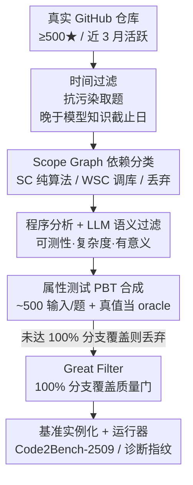

# Code2Bench: Scaling Source and Rigor for Dynamic Benchmark Construction

**会议**: ICLR2026  
**OpenReview**: [https://openreview.net/forum?id=QZmKyAy1VK](https://openreview.net/forum?id=QZmKyAy1VK)  
**代码**: https://code2bench.github.io/  
**领域**: 代码智能 / 评测基准  
**关键词**: 代码生成评测、动态基准、属性测试 PBT、数据污染、依赖分类

## 一句话总结
针对代码生成评测中「题源静态易污染 + 测试浮于表面」两大顽疾，本文提出 **Dual Scaling（双重扩展）** 哲学——一边从真实代码仓库按模型知识截止日期动态取题（扩展题源），一边用属性测试 PBT 配合 100% 分支覆盖的「Great Filter」自动生成高严谨度测试（扩展严谨度）——并实例化为端到端框架 Code2Bench，产出含 Python/Java 原生实例的 Code2Bench-2509 基准，对 10 个主流 LLM 给出细粒度诊断。

## 研究背景与动机
**领域现状**：代码 LLM 的能力评测长期依赖 HumanEval、MBPP 这类「手工题库 + 少量示例测试」的静态基准；后来出现 LiveCodeBench 等「动态/live」基准缓解时效问题，也有 RepoBench、DevEval、EvoCodeBench 这类从真实工程仓库取题、能处理依赖的基准。

**现有痛点**：作者把现状归结为两条相互纠缠的缺陷。其一是**题源静态、易污染**——HumanEval/MBPP 的题目存在多年，几乎必然进了 LLM 的训练语料，于是「评测」退化成「背诵检测」而非泛化能力检测；而动态基准多取材竞赛题，与真实软件工程的复杂度并不对应。其二是**测试浮于表面**——多数基准只用一小撮示例输入做测试，制造了一种「正确的假象」（illusion of correctness），无法暴露区分「能跑的代码」和「能上生产的代码」的那些边界 case 失败。

**核心矛盾**：这两条缺陷的根子在于「题源」和「测试」两个维度都没有被系统性地"做大做严"。仅解决其一不够：把题源换成真实代码会引入大量带依赖、不可测、琐碎的函数，没有严谨测试就无法甄别；只加严测试而题源仍静态，又躲不开污染。Table 1 中现有方法在「动态题源 / 处理依赖 / 严谨测试 / 多语言」四个维度上没有一个能全勾。

**本文目标**：设计一种既抗污染、又能提供深度诊断的基准构建范式，且要可持续扩展（持续注入新题）、可跨语言。

**切入角度**：作者主张一次范式转移——**同时**沿两个轴线"放大"：放大题源（Scaling the Source，从真实仓库动态、持续取题）与放大严谨度（Scaling the Rigor，用属性测试生成深覆盖测试套件）。

**核心 idea**：用「Dual Scaling」哲学把"取真实题 + 自动造严谨测试"做成全自动流水线 Code2Bench，关键技术抓手是 **Scope Graph 依赖分类**（把题分成纯算法 SC / 调库 WSC）和 **100% 分支覆盖质量门**（淘汰弱测试和不可测函数）。

## 方法详解

### 整体框架
Code2Bench 是一条端到端流水线：输入是 GitHub 上真实、活跃维护的开源仓库，输出是版本化的、含 Python/Java 原生实例的可执行基准套件（Code2Bench-2509）。整条流水线由两大支柱串成——**先 Scaling the Source 把"真实且未被训练过"的候选函数捞出来并分类，再 Scaling the Rigor 给每个候选自动造测试、用 100% 分支覆盖的「Great Filter」狠狠筛一遍**，最后把活下来的函数实例化成带测试套件与测试运行器的基准条目。论文披露：约只有 40% 的高质量候选能通过这道严谨门，换来的是"小而精"的基准。

### 关键设计

**1. 时间过滤：用版本时间戳从根上掐断数据污染**

抗污染是整套设计的出发点。作者用一条朴素公理——「模型不可能在它知识截止日之前并不存在的代码上训练过」——把抗污染做成确定性策略：对每个待评模型，流水线只从**晚于该模型官方知识截止日期**创建的 GitHub commit 中抽取函数。Code2Bench-2509 整体取材自 2025 年 5 月至 9 月新提交的代码，晚于所有被评模型的知识截止日。相比"动态 live 基准取竞赛题"，这里取的是真实工程代码，既新鲜又贴近实际软件开发，从机制上保证评的是泛化而非记忆。

**2. Scope Graph 依赖分类：把真实代码切成"纯算法 SC / 调库 WSC"两类技能题**

真实仓库的函数五花八门，必须先按依赖结构归类，才能有针对性地评测不同能力。作者用 **Scope Graph 分析**（一种形式化、跨语言的方法，能精确识别全部外部依赖，比 AST 遍历这类简单方法更可靠）做两步确定性分类：先用 Scope Graph 算出每个函数的未解析引用集合 $D$；再按预定义的允许库集合 $L_{allowed}$ 套规则——若 $D=\varnothing$ 则为 **Self-Contained (SC)**（纯算法、零依赖逻辑，对标 HumanEval 那类核心算法推理），若 $D$ 的依赖全部落在 $L_{allowed}$ 内则为 **Weakly Self-Contained (WSC)**（正确调用常见库的 API 应用，对标 BigCodeBench），否则（如项目内部依赖 Project-Dependent）直接丢弃。这套自动分类让基准能定向考察"算法合成"与"API 应用"两种不同开发者技能，也是后文最关键诊断结论的基础。

**3. 程序分析 + LLM 语义过滤：保证候选可测、非平凡、有意义**

分类之后再加一层自动程序分析来筛质量。可测性上，用控制流图 CFG 分析剔除"没有可验证、依赖输入的输出"的函数（如无 return）；复杂度上，按圈复杂度（Cyclomatic Complexity）过滤，锁定一个兼顾挑战与可解的区间（如 $[2,10]$），既不要太琐碎也不要太难。结构合格还不等于"有意义"，所以最后用 **LLM-as-a-Judge**（确定性解码 + 结构化分类 prompt）做语义过滤，剔除概念上平凡的题，确保留下的是有真正实质内容的问题——附录验证其与人类专家近乎完全一致（Cohen's $\kappa=0.95$）。

**4. PBT 合成 + 100% 分支覆盖「Great Filter」：把测试严谨度做到极致**

这是 Scaling the Rigor 的核心。传统示例测试只对一小撮固定输入做验证，本文改用**属性测试 PBT**：为每个候选函数分析签名（参数类型、类型提示）自动编排测试策略，生成数百到上千个结构化随机输入，覆盖典型值、边界值（空列表、零、min/max）和复杂嵌套结构；要测的核心属性是「与真值实现的功能等价」——对任意 PBT 生成的合法输入 $x$，要求 LLM 生成函数的输出 $f_{LLM}(x)$ 必须等于原始真值函数的输出 $f_{gt}(x)$，**真值函数本身充当完美的测试 oracle**。

但"量大"不等于"严谨"。于是引入流水线最后也最严的一关——「Great Filter」：测试套件合成后，先拿它去跑真值函数 $f_{gt}$ 自己并测分支覆盖，**当且仅当达到 100% 分支覆盖时，该函数及其测试套件才被收进基准**。这道门是双刃过滤器：一方面**淘汰不充分的测试**（覆盖不满，说明输入生成策略不够聪明，没能探到所有逻辑路径）；另一方面**淘汰不可测的函数**（即便策略良好也触不到所有分支，往往意味着函数含针对不可达状态的防御代码、或耦合外部系统的复杂错误处理，不适合做独立函数正确性评测）。这正是候选数据大幅锐减、最终只剩约 40% 的主因——一次"以严谨换数量"的刻意权衡，让每道题都成为可被逐分支验证的非平凡逻辑谜题。

**5. 指令生成 + 实例化运行器：让评测公平、可执行、可复现**

要公平评测，每道题都得配一份清晰无歧义的指令。作者用 GPT-4o（确定性解码）在函数原始 docstring 与签名基础上精炼生成指令，并用回译扰动（back-translation）缓解潜在偏置；指令风格还**随依赖分类自适应**——SC 题用语言原生约定（SC-Python 用 `list`/`dict` 类型的 docstring，SC-Java 用 `List<String>` 的 Javadoc），WSC 题则"库感知"，显式点名所需外部库（如 NumPy）并用目标语言生态的精确惯用类型（如 `numpy.ndarray`）。最后把每道题打包成含「测试套件 + 测试运行器」的可执行实例：测试套件由原生 PBT 引擎（Python 用 Hypothesis、Java 用 jqwik）生成；运行器负责反序列化测试、执行 LLM 代码并与真值输出做严格深比较，且通过"用真值函数替换 LLM 函数跑一遍 dry run、必须全过"来保证测试框架自身正确。这套端到端原生方案保证了评测既严苛又可靠。

## 实验关键数据

### 基准规模与严谨度
Code2Bench-2509 含 SC-Python(217 题)、WSC-Python(194 题)、SC-Java(249 题)三个赛道，取材自 220 个 Python + 189 个 Java 真实仓库（≥500 星、近 3 月有提交、跨 10 个领域分层采样）。

| 维度 | SC-Python | WSC-Python | SC-Java | HumanEval | MBPP |
|------|-----------|-----------|---------|-----------|------|
| 题数 | 217 | 194 | 249 | 164 | 974 |
| 平均代码行数 LoC | 20.6 | 18.3 | 14.1 | 7.3 | 6.5 |
| 平均圈复杂度 CC | 5.3 | 2.6 | 3.6 | 2.8 | 2.3 |
| 每题测试用例数 | ~500 | ~500 | ~500 | ~7.8 | ~3.0 |
| 覆盖保证 | 100% 分支 | 100% 分支 | 100% 分支 | 可变 | 可变 |
| 题源 | 真实代码 | 真实代码 | 真实代码 | 手工 | 众包 |

结构复杂度（CC 5.3 vs HumanEval 2.8）与测试严谨度（~500 用例 + 100% 分支覆盖 vs HumanEval ~7.8）都拉开了数量级。

### 主结果：10 个 LLM 的 Pass@1（%）

| 模型 | SC-Python | WSC-Python | SC-Java |
|------|-----------|-----------|---------|
| Claude-4-sonnet | 40.1 | 38.7 | 47.4 |
| Gemini-2.5-Flash | 37.8 | 36.6 | 45.0 |
| DeepSeek-V3 | 34.4 | 37.6 | 47.8 |
| Qwen3-235b-a22b | 34.6 | 36.6 | 46.6 |
| Mistral-small-3.1 (24B) | 30.4 | 38.7 | 43.4 |
| Qwen3-32b | 31.3 | 34.5 | 43.0 |
| Llama-4-scout | 25.8 | 32.5 | 44.2 |
| Qwen3-8b | 25.1 | 34.0 | 39.0 |
| Gemma-3n-e4b-it | 22.6 | 26.3 | 34.5 |
| Qwen3-1.7b | 14.3 | 16.5 | 17.7 |

即便最强的 Claude-4-sonnet 在 SC-Python 上也只有 40.1%，说明基准整体显著更难。

### 关键发现
- **算法合成 ≠ API 应用**：借助「诊断指纹」（把每个模型的结果分布从 SyntaxErr 到 Perfect 排成谱）发现——SC-Python 上主导失败是 **LogicErr**（第一性原理推理难），到 WSC-Python 该峰消失、**RuntimeErr** 成为主障碍（难在正确调外部 API）。两类题考的是不同技能。
- **语言范式是"性能脚手架"**：SC-Python vs SC-Java 对比下，Java 里 Python 显著的 LogicErr/RuntimeErr 峰被大幅压平，所有模型的 Perfect 占比飙升。作者认为不是模型"天生更擅长 Java"，而是 Java 的**静态类型系统在编译期就剪掉了一大片潜在错误**，相当于性能脚手架——并称这是首个被系统量化的语言生态交互。
- **PBT 戳破"正确的假象"**：定义「Near-Perfect 失败」为通过 ≥98% 测试却最终失败的提交。SC-Python 上平均 **6.94%** 的提交落入此类（DeepSeek-V3、Claude-4-sonnet 约 8%），这些"几乎正确"的解在稀疏测试下会被误判为成功、从而高估模型能力。该比例在 WSC-Python(4.57%)更低、SC-Java(2.25%)最低，与上面的诊断一致——SC-Python 是对"纯逻辑鲁棒性"最严苛的试金石。

## 亮点与洞察
- **把抗污染做成可证明的确定性策略**：用版本控制时间戳 + 模型知识截止日做时间过滤，逻辑干净到无可辩驳——这思路可直接迁移到任何需要抗污染的 LLM 基准（数学、Agent、RAG 都能用"晚于截止日的新数据"取题）。
- **「Great Filter」一石二鸟**：100% 分支覆盖门同时淘汰"弱测试"和"不可测函数"，把"测试质量"和"题目质量"用同一个可量化阈值卡死，比人工挑题客观得多；约 40% 通过率也量化了"严谨的代价"。
- **真值函数当 oracle + PBT**：不需要人工写期望输出，直接拿原始真实函数做参照、PBT 海量造输入做差分测试，这套"自动生成高覆盖测试"的范式可复用到任何有参考实现的代码评测。
- **诊断指纹把"分数"变成"病历"**：从单一 Pass@1 升级到 SyntaxErr→Perfect 的分布谱，能看出模型"怎么错的、错在哪一层"，对定位模型弱点比单一分数有用得多。

## 局限与展望
- **依赖"真值函数可作为完美 oracle"**：对没有唯一正确输出、或带随机性/副作用/IO 的函数，功能等价 oracle 不成立，基准天然偏向纯函数式逻辑题，覆盖不到真实工程里大量有状态/有副作用的代码。
- **Self-Contained 与真实软件工程仍有差距**：为可测性把 Project-Dependent 题全丢了，而真实开发恰恰大量是跨模块、跨文件的项目级依赖；本基准更接近"单函数级"评测，离 repo 级 agentic coding 还有距离。
- **抗污染随时间衰减、需持续维护**：时间过滤依赖"晚于知识截止日"，模型一旦更新截止日，旧版基准就失效，必须不断重新取题，运营成本高。
- **LLM 参与构建引入偏置**：语义过滤用 LLM-as-a-Judge、指令用 GPT-4o 生成，虽有 $\kappa=0.95$ 与回译扰动兜底，但 LLM 的偏好仍可能悄悄影响选题与措辞。

## 相关工作与启发
- **vs HumanEval / MBPP**：它们是手工静态题 + 少量示例测试，易污染、测试浮于表面；本文用真实动态题源 + ~500 用例/100% 分支覆盖，正面解决污染与测试不足。
- **vs EvalPlus**：EvalPlus 是在 HumanEval/MBPP 上用变异测试加严测试，但题源仍静态；本文额外引入"动态取题 + 真实复杂度"两个维度，回答"经典刷题能力能否迁移到真实新代码"。
- **vs LiveCodeBench**：同为动态/抗污染，但 LiveCodeBench 取竞赛题、测试仍较浅；本文取真实工程函数且把测试严谨度拉满，更贴近软件工程。
- **vs RepoBench / DevEval / EvoCodeBench**：都从工程仓库取题、能处理依赖，但缺严谨测试或多语言设计；本文是 Table 1 中唯一在"动态 + 处理依赖 + 严谨测试 + 多语言"四维全勾的基准。

## 评分
- 新颖性: ⭐⭐⭐⭐ Dual Scaling 把"扩题源"与"扩严谨度"统一成自动流水线，时间过滤抗污染与 100% 覆盖 Great Filter 都很扎实，但单点技术（PBT、Scope Graph、LLM-as-Judge）多为组合既有方法。
- 实验充分度: ⭐⭐⭐⭐ 10 个主流模型 × 三赛道 + 诊断指纹 + Near-Perfect 失败分析 + 与 EvalPlus 对比，结论细致；但赛道偏纯函数、缺 repo 级评测。
- 写作质量: ⭐⭐⭐⭐⭐ 痛点→哲学→框架→诊断逻辑清晰，Table 1/2 对比与指纹可视化很有说服力。
- 价值: ⭐⭐⭐⭐⭐ 抗污染取题 + 自动高严谨测试 + 诊断式分析，给下一代代码 LLM 评测提供了可持续、可扩展、可诊断的范式，方法论可迁移性强。

<!-- RELATED:START -->

## 相关论文

- [\[ACL 2025\] DynaCode: A Dynamic Complexity-Aware Code Benchmark for Evaluating Large Language Models in Code Generation](../../ACL2025/code_intelligence/dynacode_a_dynamic_complexity-aware_code_benchmark_for_evaluating_large_language.md)
- [\[ICLR 2026\] ReasoningBank: Scaling Agent Self-Evolving with Reasoning Memory](reasoningbank_scaling_agent_self-evolving_with_reasoning_memory.md)
- [\[ICLR 2026\] Behavioral Embeddings of Programs: A Quasi-Dynamic Approach for Optimization Prediction](behavioral_embeddings_of_programs_a_quasi-dynamic_approach_for_optimization_pred.md)
- [\[ICLR 2026\] CodeSense: a Real-World Benchmark and Dataset for Code Semantic Reasoning](codesense_a_real-world_benchmark_and_dataset_for_code_semantic_reasoning.md)
- [\[ICML 2026\] MEnvAgent: Scalable Polyglot Environment Construction for Verifiable Software Engineering](../../ICML2026/code_intelligence/menvagent_scalable_polyglot_environment_construction_for_verifiable_software_eng.md)

<!-- RELATED:END -->
