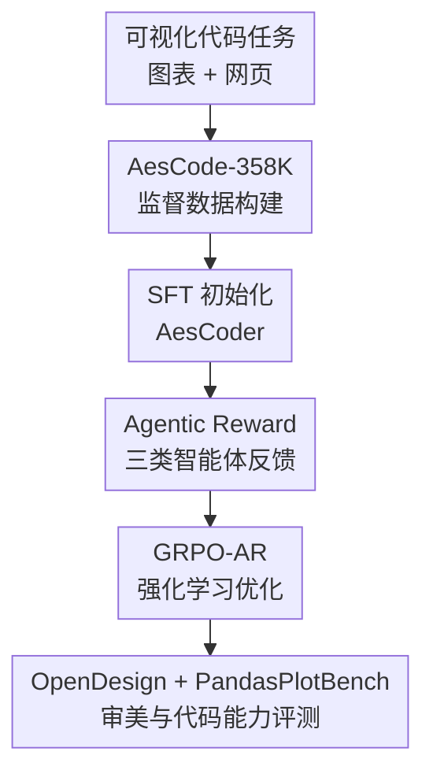

# Code Aesthetics with Agentic Reward Feedback

**会议**: ICLR 2026  
**OpenReview**: [https://openreview.net/forum?id=Q87kwGI6bx](https://openreview.net/forum?id=Q87kwGI6bx)  
**论文**: [Project Page](https://bangx7.github.io/code-aesthetics)  
**代码**: 未公开  
**领域**: 代码智能  
**关键词**: 代码审美、网页生成、可视化代码、智能体奖励、GRPO  

## 一句话总结
本文把网页设计和图表生成这类“结果好不好看也很重要”的编程任务定义为代码审美问题，构建 AesCode-358K 数据集、OpenDesign 评测集和由执行/静态审美/交互审美三类智能体组成的奖励反馈，再用 GRPO-AR 训练出小规模 AesCoder，使 4B 模型在 OpenDesign 上超过 GPT-4o、GPT-4.1 以及多种大规模开源代码模型。

## 研究背景与动机
**领域现状**：代码大模型已经能比较稳定地完成传统编程任务，例如补全函数、修 bug、写算法题或处理软件工程流程。主流训练和评测也围绕这些文本可验证目标展开：代码能否运行、单测是否通过、答案是否与参考输出一致。这套范式在算法代码上很有效，因为结果通常可以被规则或测试用例直接判定。

**现有痛点**：可视化导向的编程任务没有这么简单。让模型写一个网页、画一张图、做一个浏览器小游戏时，语法正确只是底线，真正影响用户体验的是布局是否清楚、配色是否协调、文字是否可读、按钮和控件是否真的能用。传统 reward 只看执行成功，容易奖励“能打开但很丑”或“截图好看但按钮没反应”的代码；只用静态截图打分，又会忽略页面交互和 HTML 结构规范。

**核心矛盾**：代码审美同时横跨文本、视觉和交互三个维度。代码本身是文本，渲染结果是视觉对象，网页还需要用户动作触发状态变化。单一 reward 很难覆盖这三件事，因此模型会沿着 reward 的盲区优化：要么追求表面图像效果而牺牲可执行性，要么只满足语法却没有设计感，要么做出漂亮静态页面但核心交互失效。

**本文目标**：作者希望系统性回答两个问题：第一，LLM 生成的代码是否可以表现出“审美意识”；第二，如果可以，能否通过数据和奖励反馈把这种审美能力显式训练出来。为此，论文需要一套面向代码审美的数据集、一套能自动评估网页审美与交互的 benchmark，以及一种能把多源反馈接入强化学习的训练方法。

**切入角度**：论文选择 Python 图表生成和 HTML 网页设计作为代表任务。前者强调图表清晰度、信息表达和可视化布局，后者同时考验页面结构、视觉风格和离线交互。这个选择比较务实：两类任务都能从代码渲染到可观察结果，既能做监督数据，也能用浏览器、截图、GUI agent 等工具形成自动反馈闭环。

**核心 idea**：用“可执行性检查 + 静态视觉评审 + 交互式网页探索”组成 agentic reward，把代码审美从主观偏好转成可用于 GRPO 的多视角训练信号。

## 方法详解

### 整体框架
本文的完整流程可以分成四段：先构建 AesCode-358K，让模型通过 SFT 学到图表和网页设计的高质量代码模式；再构建 OpenDesign，用真实网页设计案例评估静态与交互审美；随后用三个 reward agent 给模型输出打分；最后把加权 reward 接入 GRPO，训练出 AesCoder-4B 和 AesCoder-7B。整体上，数据集提供“先学会怎么写”，agentic reward 提供“再学会什么更好看、更可用”。

图里的贡献节点和下面的关键设计保持同一条主线：AesCode-358K 解决高质量训练数据不足，Agentic Reward 解决单一 reward 看不见视觉/交互的问题，GRPO-AR 负责把这些反馈变成可优化的策略更新，OpenDesign 则把网页审美评测从人工投票扩展成可复现实验。

### 关键设计
**1. AesCode-358K：把“好看的代码结果”变成可监督学习的语料**

代码审美任务首先卡在数据上：普通代码数据集不保证渲染结果好看，网页数据又常常缺少可控指令和可执行校验。论文把数据拆成两条来源。图表侧从 VisCode-200K 的指令出发，用 Qwen3-Coder-480B-A35B 重新生成 Python 可视化代码，并限制依赖库在 matplotlib、seaborn、plotly 等常用栈内，再用 Jupyter Notebook 运行校验，过滤到 158K 条可执行图表数据。

网页侧则从五类设计场景生成大规模指令：General Website、3D Design、Data Visualization、Game Dev、UI Component。作者先让 GPT-4o 生成种子关键词和网页指令，再用 embedding + t-SNE + K-Means 去重，从 400K 指令里保留 200K 个代表样本；随后分别用 GPT-5 和 Qwen3-Coder-480B 生成 HTML，并通过 Playwright/Selenium 渲染截图，让 GPT-5 选择得分更高的版本。这样得到的数据不是简单“HTML 文本”，而是经过可执行性和视觉质量筛选的设计代码。

**2. Agentic Reward：用三个智能体补齐文本、视觉、交互三种反馈**

传统代码 reward 的盲区在于它只知道“跑没跑过”，不知道“看起来如何”和“用起来如何”。本文把 reward 拆成三个互补智能体。Execution Agent 先从模型原始输出中抽取 HTML，如果找不到代码块就把整个输出当作 HTML，再用 HTMLHint 做基础语法和结构检查；通过给 $s_{exec}=1$，失败给 $s_{exec}=-1$。这个 gate 很重要，因为它防止模型靠一张漂亮但结构非法的页面骗过审美评估。

Static Aesthetics Agent 负责看渲染后的完整页面截图。它用 Playwright 在本地打开 HTML，截取 full-page screenshot，再让 GPT-5 从指令对齐、视觉元素、布局结构三个维度打分。Interactive Aesthetics Agent 则把网页当成可操作环境，基于 WebVoyager 框架和 GPT-4o 规划要点击、输入或操作的元素，并逐步记录每次交互是否产生合理反馈。最终交互得分是 $s_{interact}=\sum_{i=1}^{N}s_i$，只有页面状态按预期变化才记 1 分。三者合起来，reward 不再只奖励“代码文本像样”，而是奖励“代码能运行、页面好看、交互可用”。

**3. GRPO-AR：把多智能体反馈变成可训练的强化学习目标**

在训练上，论文先用 AesCode-358K 做 SFT，再从 WebSight v0.2 中抽取 20K 条与 SFT 数据不重叠的 RL 数据。为了让指令更清楚，作者还用 GPT-4o 对原始 instruction 做改写。进入 GRPO 阶段后，对于每个 prompt $p$，旧策略会采样一组输出 $\{o_1,o_2,\ldots,o_G\}$，每个输出都经过 agentic reward framework 得到总奖励 $r_i$。

总 reward 被写成三项加权：$r=w_{exec}\cdot r_{exec}+w_{static}\cdot r_{static}+w_{interact}\cdot r_{interact}$。论文默认 $w_{exec}=0.1$、$w_{static}=0.8$、$w_{interact}=0.1$，这体现了网页任务里的现实权衡：执行是门槛，静态设计占主要审美质量，交互则提供额外约束。GRPO 使用组内 reward 标准化得到优势 $\hat{A}_{i,t}=\frac{r_i-mean(r)}{std(r)}$，再用 clipped objective 更新策略，同时保留 KL 正则，避免模型偏离参考策略过远。

**4. OpenDesign：用自动化网页审美评测替代难扩展的人工投票**

网页审美缺少类似单测的公开 benchmark。论文提出 OpenDesign，包含 840 个真实网页设计案例，并同时评估静态审美和交互审美。静态部分把模型生成的 HTML 渲染成截图，再由 Static Aesthetics Agent 评分；交互部分让 Interactive Aesthetics Agent 对页面进行离线操作，测试按钮、输入框、游戏控制或组件行为是否符合任务意图。

为了证明 OpenDesign 不是任意 judge 的偏见，作者做了两层验证。第一，OpenDesign 上 10 个主流模型的排名与 Design Arena 排名高度一致，Spearman 相关系数达到 0.98，Kendall 相关系数达到 0.91。第二，在 200 对 HTML 页面的人类/GPT 偏好比较中，GPT-human agreement 为 80.9%，高于 human-human 的 68.7%。这说明该 benchmark 虽然依赖 LLM-as-a-judge，但排序趋势接近大规模人类偏好。

### 一个完整示例
假设用户要求“做一个披萨餐厅网站，突出菜单和在线点单”。普通代码 reward 只会检查 HTML 是否能打开，模型可能生成一个静态菜单页，按钮写着“Order Now”但点击没有任何效果。本文的 reward 会先由 Execution Agent 检查页面是否有合法的 `<!DOCTYPE html>`、唯一 id、viewport、闭合标签等结构；如果失败，后续审美 agent 不触发，直接给负向执行奖励。

如果页面可执行，Static Aesthetics Agent 会看截图：菜单是否突出，文字是否可读，颜色和布局是否像餐厅网站，点单入口是否在视觉层级上足够清晰。Interactive Aesthetics Agent 还会实际点击菜单、点单按钮或输入框，观察页面是否弹出购物车、更新数量、显示订单状态。一个只有漂亮 hero 但点单按钮没反应的页面，会拿到较高静态分但较低交互分；一个布局朴素但交互完整的页面，也会被静态分拉低。模型在 GRPO 中看到的是这种综合反馈，因此会被推向“既能看，又能用”的网页代码。

### 损失函数 / 训练策略
训练分两阶段。Stage I 用 AesCode-358K 对 Qwen3-4B-Instruct-2507 和 Qwen2.5-Coder-7B-Instruct 做 SFT，训练 3 个 epoch，AdamW 优化器，10% linear warmup 后接 cosine decay，最大学习率 $1e^{-5}$，batch size 128，最大序列长度 8K。

Stage II 用 VeRL 实现 GRPO-AR，策略学习率为 $3\times 10^{-6}$，batch size 64，micro batch size 8。每轮 rollout 收集 64 个 prompt，每个 prompt 采样 8 个 response；KL 系数设为 0.001，clip 参数 $\epsilon=0.5$。考虑到 GUI agent 当前成功率有限，训练时每个页面最多评估 3 个交互元素，并要求 agent 优先选择最关键的控件，以降低交互失败噪声对训练的影响。

## 实验关键数据

### 主实验
论文主要在两个方向评测：PandasPlotBench 衡量图表代码生成，OpenDesign 衡量网页静态审美与交互审美。表 1 里的关键结论是，小模型经过 AesCode-358K + GRPO-AR 后，在审美导向任务上能逼近甚至超过更大的通用模型。

| 模型 | 规模 | PandasPlotBench Err.↓ | PandasPlotBench Avg.↑ | OpenDesign Total↑ | InterAes.↑ |
|------|------|----------------------|-----------------------|-------------------|------------|
| GPT-4o | - | 0.09 | 68 | 48.08 | 0.44 |
| GPT-4.1 | - | 0.09 | 69 | 65.79 | 0.74 |
| GPT-5 (minimal) | - | 0.04 | 75 | 81.03 | 1.37 |
| Claude Sonnet 4 | - | 0.04 | 74 | 81.05 | 0.92 |
| Qwen3-Coder-480B-A35B | 480B | 0.05 | 73 | 79.90 | 0.70 |
| DeepSeek-R1-0528 | 685B | 0.08 | 70 | 78.86 | 0.77 |
| Qwen3-4B-Instruct-2507 | 4B | 0.13 | 65 | 73.26 | 0.67 |
| AesCoder-4B | 4B | 0.09 | 70 | 81.92 | 1.04 |
| AesCoder-7B | 7B | 0.09 | 67 | 81.23 | 0.94 |

AesCoder-4B 的 OpenDesign 总分达到 81.92，高于 GPT-5 minimal 的 81.03、Claude Sonnet 4 的 81.05 和 Qwen3-Coder-480B 的 79.90；它在 PandasPlotBench 上也把 4B baseline 的错误率从 0.13 降到 0.09，平均分从 65 提升到 70。AesCoder-7B 的 OpenDesign 总分也达到 81.23，相比 7B baseline 的 46.27 是非常大的提升。

### 消融实验
作者用同样的 Stage II 数据比较了 RFT、DPO、不含 agentic reward 的 GRPO，以及完整 GRPO-AR。这里最重要的对照是：如果只用底层 reward model 对 HTML 做静态打分，不让执行/静态/交互智能体形成完整反馈，效果会明显弱于 GRPO-AR。

| 训练策略 | Align↑ | Aes↑ | Struct↑ | InterAes↑ |
|----------|--------|------|---------|-----------|
| Qwen3-4B baseline | 28.50 | 25.27 | 24.36 | 0.62 |
| Qwen3-4B + RFT | 29.32 | 25.30 | 24.67 | 0.71 |
| Qwen3-4B + DPO | 28.79 | 25.31 | 24.38 | 0.70 |
| Qwen3-4B + GRPO-AR w/o Agentic Reward | 29.16 | 25.20 | 24.67 | 0.71 |
| Qwen3-4B + GRPO-AR | 30.42 | 26.19 | 25.31 | 1.04 |
| Qwen2.5-Coder-7B baseline | 28.85 | 25.23 | 24.37 | 0.70 |
| Qwen2.5-Coder-7B + RFT | 29.73 | 25.35 | 24.85 | 0.75 |
| Qwen2.5-Coder-7B + DPO | 29.75 | 25.33 | 24.87 | 0.71 |
| Qwen2.5-Coder-7B + GRPO-AR | 30.03 | 25.98 | 25.18 | 0.94 |

完整 GRPO-AR 在两个基座上都给出最好的静态和交互分数。对于 Qwen3-4B，InterAes 从 baseline 的 0.62 提升到 1.04，而不含 agentic reward 的 GRPO 只有 0.71；这说明交互智能体不是装饰项，它确实改变了模型优化方向。

### 关键发现
- AesCoder 的收益主要来自“审美任务专门化”。4B 模型在 OpenDesign 上超过 480B/685B 开源模型，并不代表它成为更强的通用代码模型，而是说明数据和 reward 把能力集中推向网页/图表这类视觉代码任务。
- OpenDesign 的可靠性有两组证据支撑：它与 Design Arena 排名相关性很高，并且 GPT judge 与人类偏好的一致率达到 80.9%。这让 LLM-as-a-judge 在本文里更像可扩展代理指标，而不是单纯自评。
- reward 权重实验显示静态和交互之间存在平滑 trade-off：提高 $w_{static}$ 会提升静态分、降低交互分，提高 $w_{interact}$ 则相反。训练曲线没有崩溃，说明 GRPO-AR 的 reward 组合可控。
- 代价也很明显：在 LiveCodeBench、MBPP、MBPP+ 上，AesCoder 相比基座模型出现通用代码能力下降。例如 Qwen3-4B 的 LiveCodeBench 从 32.5 降到 19.0，MBPP 从 86.8 降到 73.5。

## 亮点与洞察
- **把“代码审美”定义成代码智能问题而不是纯视觉问题**：论文没有只评价截图好不好看，而是把源代码可执行性、页面渲染和用户交互放到同一个闭环里。这一点很关键，因为网页代码的质量本来就不是单模态属性。
- **Agentic reward 的设计很贴合任务结构**：Execution Agent 负责底线，Static Aesthetics Agent 负责视觉偏好，Interactive Aesthetics Agent 负责可用性。三者的边界清楚，且能解释为什么普通 reward model 静态打分不够。
- **OpenDesign 的验证比较扎实**：作者没有只声明“我们用 GPT-5 打分”，而是拿 Design Arena 排名和人类偏好做相关性验证，降低了 benchmark 被单一 judge 偏好支配的风险。
- **小模型超过大模型的结果有启发性**：AesCoder-4B 的表现说明，在高度专门的可视化代码任务上，针对性数据和 reward 可能比单纯扩大参数更有效。这对“垂直代码助手”训练很有参考价值。
- **论文诚实报告了 alignment tax**：附录里的通用代码 benchmark 下降提醒读者，审美强化不是免费午餐。模型从 generalist 变成 design-oriented specialist，确实会损失一部分算法代码能力。

## 局限与展望
- 当前 reward 仍然依赖强模型作为 judge。Static Aesthetics Agent 用 GPT-5，Interactive Aesthetics Agent 用 GPT-4o，训练和评测成本都不低；如果迁移到开源 judge 或更便宜的评估器，评分稳定性还需要重新验证。
- 交互评测受 GUI agent 能力限制。论文也承认 web agent 可能被页面元素误导，失败时会给对应交互 0 分。这种 0 分有时代表页面设计差，有时也可能是 agent 操作失败，二者并不总能完全区分。
- OpenDesign 主要覆盖单页离线 HTML。真实前端开发还涉及跨页面导航、后端接口、状态持久化、组件工程化、可访问性和性能优化，这些能力不在当前 benchmark 的中心范围内。
- 审美偏好本身带有文化和平台差异。论文用 Design Arena 和人类标注验证了总体一致性，但“好看”的定义可能随行业、地区、品牌风格变化。后续可以引入可配置审美偏好或行业特定 judge。
- GRPO-AR 带来通用代码能力回退。未来更实用的方向可能是混合训练：在视觉代码 reward 之外加入算法题、单测和软件工程任务的保持项，减少 specialist 对 general coding 的遗忘。

## 相关工作与启发
- **vs 传统代码 RL / unit-test feedback**: RLEF、RLTF、CodeRL 等方法主要用执行结果、单测或过程反馈优化代码正确性，本文则把 reward 扩展到渲染图像和页面交互。它的优势是覆盖了可视化代码任务的真实质量维度，劣势是评估链路更重、更依赖外部模型。
- **vs RLHF / DPO / RFT**: DPO 和 RFT 能利用偏好或筛选样本提升输出质量，但它们通常不显式运行网页、截图、点击控件。本文的实验表明，在网页审美任务上，直接把 agentic reward 接入 GRPO 比只做偏好优化更有效。
- **vs 图像/文本审美评估**: 既有 AIGC aesthetics 工作多评估静态图像或文本排版，本文关注的是“代码生成的可操作视觉产物”。这启发后续研究把审美评估从内容本身扩展到生成过程和可交互状态。
- **vs Design Arena**: Design Arena 依赖社区投票，适合公开榜单但不适合训练循环中的大规模自动反馈。OpenDesign 用 LLM judge 和 GUI agent 近似人类偏好，使审美评估可以批量化、可复现，但也继承了自动 judge 的偏差问题。

## 评分
- 新颖性: ⭐⭐⭐⭐⭐ 首次把代码审美、网页交互评估和强化学习 reward 系统性结合，问题定义和训练闭环都比较新。
- 实验充分度: ⭐⭐⭐⭐ 主实验、消融、人类评估、judge 替换和权重敏感性都覆盖到了，但真实工程级前端任务仍未充分验证。
- 写作质量: ⭐⭐⭐⭐ 论文结构清晰，图 1 把 pipeline 讲得比较完整；不足是部分数据构建细节和 judge prompt 很长，正文读起来略偏系统报告。
- 价值: ⭐⭐⭐⭐⭐ 对代码智能、前端生成、可视化代码和 agentic reward 都有直接启发，尤其适合作为垂直代码模型训练范式参考。

<!-- RELATED:START -->

## 相关论文

- [\[ICLR 2026\] RECODE-H: A Benchmark for Research Code Development with Interactive Human Feedback](recode-h_a_benchmark_for_research_code_development_with_interactive_human_feedba.md)
- [\[ICLR 2026\] SWE-RM: Execution-Free Feedback for Software Engineering Agents](swe-rm_execution-free_feedback_for_software_engineering_agents.md)
- [\[ICLR 2026\] FHE-Coder: Benchmarking Secure Agentic Code Generation for Fully Homomorphic Encryption](fhe-coder_benchmarking_secure_agentic_code_generation_for_fully_homomorphic_encr.md)
- [\[ACL 2026\] QiMeng-PRepair: Precise Code Repair via Edit-Aware Reward Optimization](../../ACL2026/code_intelligence/qimeng-prepair_precise_code_repair_via_edit-aware_reward_optimization.md)
- [\[ICLR 2026\] An Agentic Framework with LLMs for Solving Complex Vehicle Routing Problems](an_agentic_framework_with_llms_for_solving_complex_vehicle_routing_problems.md)

<!-- RELATED:END -->
