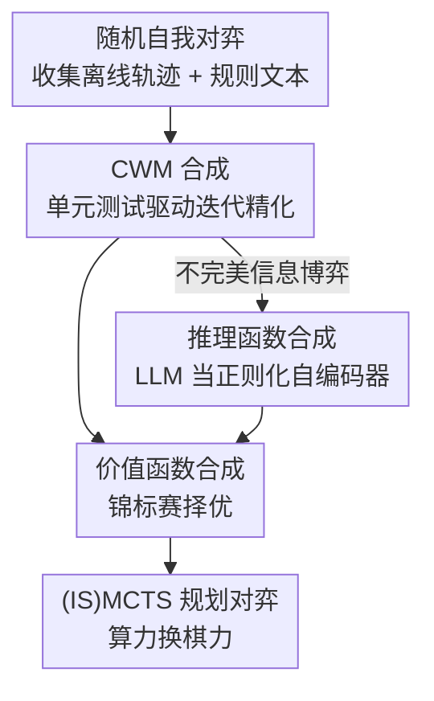

# Code World Models for General Game Playing

**会议**: ICLR 2026  
**OpenReview**: [https://openreview.net/forum?id=1UoB7IWiku](https://openreview.net/forum?id=1UoB7IWiku)  
**代码**: 无（实验基于 OpenSpiel）  
**领域**: 代码智能 / Agent / LLM 推理  
**关键词**: 代码世界模型, 通用博弈, MCTS, 不完美信息博弈, 程序合成

## 一句话总结
不再把 LLM 当成直接出招的"棋手"，而是让它把游戏规则和少量对局轨迹**翻译成一份可执行的 Python 世界模型代码**（含状态转移、合法动作、终局判定，外加价值函数与隐状态推理函数），再把这份代码交给 MCTS / ISMCTS 这类经典规划器去深搜；在 10 个游戏（含 4 个自造的全新游戏）上，9 个游戏打平或战胜 Gemini 2.5 Pro。

## 研究背景与动机
**领域现状**：用 LLM 玩国际象棋、围棋、扑克、桥牌这类经典博弈，主流做法是"LLM 即策略"——把到目前为止的观测/动作轨迹塞进 prompt，让模型每一步直接吐出一个走子。它本质上是在用模型的模式匹配能力当"直觉型棋手"。

**现有痛点**：这种做法有三个硬伤。一是**频繁走非法手**——模型靠脆弱的隐式模式匹配理解规则，经常给出不合法的动作甚至直接超时弃权；二是**策略浅薄**——强博弈需要多步前瞻（System 2 式的深思），而通才 LLM 即便开了"thinking"也缺乏深层战术远见；三是**泛化差**——一旦遇到不在训练集里的全新游戏（OOD），直接当策略用几乎玩不动。

**核心矛盾**：把"理解规则"和"深度搜索"两件事都压在 LLM 一次前向里，两边都做不好。LLM 擅长语义理解但不擅长精确的多步推演；经典规划器（MCTS）擅长把算力转成棋力，但需要一个**可执行、可验证的环境模型**才能跑——而这个模型恰恰是新游戏里缺失的。

**本文目标**：让 LLM 只干它最擅长的"数据→代码翻译"元任务，把深搜交给成熟规划器，从而同时拿到可验证性、策略深度和泛化性；并且要覆盖此前 CWM 工作普遍回避的**部分可观测 + 随机**博弈（如扑克）。

**切入角度**：作者观察到，游戏规则本身就是一份可被代码精确刻画的"世界模型"。与其让 LLM 反复在每一步做脆弱的策略决策，不如让它一次性把规则+轨迹归纳成一份程序——程序可以被单元测试验证、可以被规划器无限次调用，从而把"产生好策略"的负担转移成"产生好模型"的负担。

**核心 idea**：用 LLM 把"自然语言规则 + 随机对局轨迹"归纳合成为一份可执行的 **Code World Model（CWM）**，再用 (IS)MCTS 在这份代码上做深度规划——把算力而非模式匹配变成棋力。

## 方法详解

### 整体框架
面对一个新游戏，agent 的流程是：先用随机策略自我对弈几局，收集包含观测、奖励、合法动作、（开局设定下的）隐状态的轨迹；然后把游戏规则文本 + 这些轨迹喂给 LLM，要求它按 OpenSpiel API 格式合成一份 CWM，并用从轨迹自动生成的单元测试**迭代精化**直到转移准确率达到 1.0 或预算耗尽；对于不完美信息博弈（IIG），额外合成**隐状态推理函数**让 ISMCTS 能采样信念状态，并可选地合成**价值函数**给叶节点估值提速；最后在竞技场里用基于这份合成代码的 (IS)MCTS 策略与对手对弈。关键转变是：LLM 只负责离线产出模型，对弈时由规划器把搜索算力转成棋力，因此算力越多越接近最优。

### 关键设计

**1. CWM 合成与单元测试驱动的迭代精化：把规则归纳成可验证的可执行程序**

直接让 LLM 当策略的根本毛病是输出不可验证、易出非法手。本文把这件事换成"合成一份近似目标游戏的可执行副本"：CWM 是一组确定性函数——状态转移（含终局判定）、给定状态的合法动作、给定状态的观测（IIG 下观测与状态不同）、chance 节点的概率分布、奖励函数；随机性只通过 chance 玩家进入游戏。单次生成往往不对，于是引入**迭代精化**：从每条离线轨迹的每个转移自动生成单元测试，逐项核对 CWM 预测的状态/观测/奖励/动作合法性是否与原轨迹一致、有无执行报错；单元测试是二值的，因此通过率就是**转移准确率（transition accuracy）**，精化到 1.0 或预算耗尽为止，失败测试的 stack trace 会回喂给 LLM 帮助修代码。精化有两种：**Conversation（串行 chat 模式）**把新失败测试追加进对话历史让 LLM 改；**Tree search（树搜索）**沿用 REx 思路维护一棵 CWM 精化树，用 Thompson 采样挑选下一个要改的 CWM（偏好高准确率或被改次数少的），每次调用是带着选中 CWM + 精化指令 + 一条失败测试 stack trace 的全新 prompt。因为树搜索能回溯、在难局里更稳健，全文后续都用它。这样做的好处是规划器可以**算法化地枚举合法动作**，从根上避免非法手——前提是合成模型正确。

**2. IIG 推理函数：把 LLM 当成一个被规则正则化的自编码器**

不完美信息博弈里 ISMCTS 需要在每一步估计隐状态 $s_t$，即从信念状态 $p_M(s_t \mid o^i_{1:t}, a^i_{1:t})$ 采样，但精确推理最坏情况指数代价。本文让 LLM 再合成一段**近似采样后验**的代码，并主推**hidden history inference（隐历史推理）**：由于 CWM 全是确定性函数，隐状态后验可由动作历史后验得到——LLM 合成一个函数采样 $\tilde h_t \sim p_M(h_t \mid o^i_{1:t}, a^i_{1:t})$（含 chance 玩家动作），再用 CWM 执行 $\tilde h_t$ 重建隐状态序列与观测；每个时刻给玩家 $i$ 行动处生成单元测试，核对采样出的观测/动作是否匹配真实证据（$\tilde o^i_t = o^i_t$、$\tilde a^i_t = a^i_t$），从而能对推理函数也做精化。一旦通过全部测试（推理准确率 1.0），采出的 $\tilde h_t$ 落在后验支撑集内、$\tilde s_t$ 必然是 CWM 的合法隐状态——这在游戏中后验支撑极稀疏时已非常有信息量。还有一个更直接但更弱的 **hidden state inference** 变体（直接采 $\tilde s_t$，只验 $\tilde o_t = o_t$），它更简单但无法保证落在后验支撑或构成合法 CWM 状态，因为忽略了相邻状态间的依赖。

这套机制的精彩之处在 **closed deck（闭牌）** 场景：当 agent 只能看到自己的观测、连事后都拿不到隐状态时（如线上玩全新游戏），本文丢掉所有需要隐信息才能验证的单元测试（相邻隐状态间的转移），只保留"观测→隐状态→还原回观测"可验证的测试，再加几局随机对弈确保无执行错。这恰好构成一个**自编码器**：推理函数是编码器（$o^i_{1:t}, a^i_{1:t} \to \tilde h_t$），CWM 是解码器（$\tilde h_t \to$ 观测）；不靠瓶颈或正则项，而是**游戏规则 + OpenSpiel API**（写进 prompt 上下文与单元测试里）充当正则化器，防止学到平凡的隐空间。通过全部测试的有效后验历史还能给出 CWM 似然的下界 $p_M(o^i_{1:t}) \le p_M(\tilde h_t)$（因为测试全过时 $p_M(o^i_{1:T} \mid \tilde h_t) = 1$）。这是此前 CWM 工作（普遍假设全可观或事后可观）没碰过的设定。

**3. 价值函数合成：用锦标赛择优的启发式估值替代随机 rollout**

MCTS/ISMCTS 给新叶节点估值时通常靠随机 rollout，慢且噪声大。本文让 LLM 像合成 CWM 一样合成一个确定性价值函数 $V(s)$ 来估隐状态叶节点的价值，往往更快也可能更准。但与 CWM/推理函数不同，**价值函数没有 ground truth 可比对，因此不做单元测试精化**；改为一次生成多个候选函数，通过**锦标赛（tournament）**对弈选出最好的那个。实验里它在 Gen. tic-tac-toe 和 Bargaining（player 1）上带来明显增益，其余游戏则无明显改变——说明它是按需提速的可选增强，而非必需件。

### 损失函数 / 训练策略
本文不训练神经网络，"训练"指的是 LLM（Gemini 2.5 Pro）的代码合成 + 精化循环。优化信号来自离线轨迹自动生成的单元测试通过率：CWM/推理函数精化到准确率 1.0 或 LLM 调用预算耗尽；价值函数用锦标赛选择。对弈时 (IS)MCTS 固定跑 1,000 次模拟，叶节点用价值函数或 10 次随机 rollout 估值。作者也试过对（部分可观的）CWM 用 PPO 学策略（附录 E）。

## 实验关键数据

### 主实验
评测 10 个游戏（5 完美信息 + 5 不完美信息，各含 2 个自造 OOD 游戏），对手有 Random、用真值代码规划的 GT-(IS)MCTS（性能上界）、以及"LLM 即策略"的 Gemini 2.5 Pro。每个匹配 100 局取平均，CWM 合成重复 5 次并自动拒绝坏样本。

| 设定 | 结论 | 对比 Gemini 2.5 Pro |
|------|------|---------------------|
| 完美信息博弈 | CWM-MCTS 与 GT-MCTS 旗鼓相当（说明合成代码质量高） | **全部 5 个游戏均胜** |
| 不完美信息·开牌 | 除 Hand of war 外均打平或胜 | 9/10 游戏整体打平或胜 |
| 不完美信息·闭牌 | 合成质量下降，但对弈性能未显著退化，仍打平或胜 Gemini | 持续打平或胜 |

### 消融 / 合成准确率

| 游戏 (开牌, 树搜索, 隐历史推理) | 转移准确率(test) | 推理准确率(test) | LLM 调用数 |
|------|------|------|------|
| Bargaining | 0.983 | 1.000 | 23.0 |
| Leduc poker | 0.998 | 1.000 | 4.4 |
| Gin rummy | 0.746 | 0.538 | 500.0 |
| Quadranto (OOD) | 1.000 | 0.986 | 6.0 |
| Hand of war (OOD) | 0.981 | 0.936 | 144.0 |

| 配置 | 关键发现 | 说明 |
|------|---------|------|
| 隐历史 vs 隐状态推理 | 隐历史略优且保证合法 CWM 状态 | 选为 CWM-ISMCTS 默认 |
| 闭牌 Gin rummy 推理准确率 | train 仅 0.055、test 0.095 | 多阶段计分逻辑极难合成 |
| 价值函数消融 | Gen. tic-tac-toe / Bargaining(P1) 明显增益 | 其余游戏无明显变化 |

### 关键发现
- **代码合成质量是天花板**：CWM-MCTS 能与用真值代码的 GT-MCTS 打平，说明 LLM 合成的世界模型几乎与真实规则等价，瓶颈不在规划而在合成正确性。
- **Gin rummy 是最难骨头**：它有敲牌、组牌、算 deadwood、判 undercut 等多阶段计分子程序，LLM 从少量轨迹很难一次性写对（开牌推理准确率仅 ~52%，闭牌训练准确率塌到 ~5.5%），点出 CWM 合成在"复杂多步过程化子程序"上的前沿难点。
- **闭牌反而偶尔更好**：Hand of war 闭牌性能略优于开牌，作者推测是闭牌下 LLM 有自由合成更简单状态空间的余地。
- **算力换棋力**：(IS)MCTS 固定 1,000 次模拟，只要合成件正确，加搜索就稳定逼近最优——这是"LLM 即策略"路线给不了的。

## 亮点与洞察
- **职责重新分工**：把"理解规则"交给 LLM 代码合成、"深度搜索"交给经典规划器，各取所长，避免让一次前向同时扛两件难事——这是整篇最值得迁移的设计哲学。
- **单元测试当编译器反馈**：从轨迹自动生成二值单元测试，让代码合成有了客观、可迭代的优化信号，stack trace 回喂精化，把"对不对"变成可度量的 transition accuracy。
- **正则化自编码器视角处理闭牌**：在拿不到隐状态时，用"规则 + API"而非瓶颈/正则项当正则化器，把 CWM+推理函数组成一个自编码器，是个很漂亮的形式化——它把无监督隐状态学习问题转成了"通过可验证单元测试"的代码问题。
- **泛化靠元任务**：让 LLM 聚焦"数据→代码"翻译这个元任务，使其在自造的 OOD 新游戏上仍能工作，绕开了训练集污染问题。

## 局限与展望
- **受限于合成正确性**：所有可验证性优势都"contingent on the correctness of the synthesized model"，一旦 CWM 合成错（如 Gin rummy），整条链路就崩，规划器在错误世界里深搜反而误导。
- **复杂过程化游戏是硬伤**：多阶段计分/复杂子程序类游戏，LLM 难从少量轨迹写对代码，需要更大调用预算（Gin rummy 用满 500 次仍不行）。
- **开牌假设的现实性**：开牌设定需要离线轨迹里有事后隐状态，虽有合作训练/游戏设计期等合理场景，但并不总成立；闭牌虽被解决但合成质量明显下降。
- **模型上线即冻结**：本文为效率只在开局前一次性学好 CWM，未做对弈中随新数据在线更新模型，复杂游戏里可能错失修正机会。

## 相关工作与启发
- **vs WorldCoder (Tang et al. 2024a)**: 都用 LLM 从轨迹合成 CWM 并存进树、用 Thompson 采样挑选精化对象，但 WorldCoder 用 ReAct 决策；本文换成 (IS)MCTS 深搜，并扩展到多智能体、合成价值函数与推理函数。
- **vs GIF-MCTS (Dainese et al. 2024)**: 同样把合成的 CWM 接 MCTS，本文额外处理部分可观测+随机博弈，并加入隐历史推理与闭牌自编码器范式。
- **vs POMDP Coder (Curtis et al. 2025)**: 都学部分可观 CWM，但 Curtis 假设隐状态事后可观、用确定化信念空间规划；本文进一步攻克"隐状态永不可见"的闭牌场景，并用 ISMCTS/PPO。
- **vs LLM 即策略 (如 Gemini 2.5 Pro)**: 对方每步直接出招，易出非法手、策略浅、OOD 差；本文把 LLM 降级为离线模型生成器，让规划器把算力转成棋力。

## 评分
- 新颖性: ⭐⭐⭐⭐⭐ 首个系统处理部分可观+随机博弈的 CWM 框架，闭牌自编码器范式与推理/价值函数合成都是新东西。
- 实验充分度: ⭐⭐⭐⭐ 10 个游戏含 4 个自造 OOD、开/闭牌全覆盖，并与 GT 上界和强 LLM 对比，唯硬游戏（Gin rummy）暴露明显短板。
- 写作质量: ⭐⭐⭐⭐ 动机清晰、形式化扎实，自编码器与下界推导讲得透。
- 价值: ⭐⭐⭐⭐⭐ 把"LLM 理解 + 经典规划深搜"解耦的范式对通用博弈与更广的代码世界模型方向都有启发。

<!-- RELATED:START -->

## 相关论文

- [\[ICLR 2026\] CodeSense: a Real-World Benchmark and Dataset for Code Semantic Reasoning](codesense_a_real-world_benchmark_and_dataset_for_code_semantic_reasoning.md)
- [\[ICLR 2026\] EDIT-Bench: Evaluating LLM Abilities to Perform Real-World Instructed Code Edits](edit-bench_evaluating_llm_abilities_to_perform_real-world_instructed_code_edits.md)
- [\[ICLR 2026\] DiffuCoder: Understanding and Improving Masked Diffusion Models for Code Generation](diffucoder_understanding_and_improving_masked_diffusion_models_for_code_generati.md)
- [\[ICLR 2026\] CrossPL: Systematic Evaluation of Large Language Models for Cross Programming Language Interoperating Code Generation](crosspl_systematic_evaluation_of_large_language_models_for_cross_programming_lan.md)
- [\[ACL 2026\] ReFEree: Reference-Free and Fine-Grained Method for Evaluating Factual Consistency in Real-World Code Summarization](../../ACL2026/code_intelligence/referee_reference-free_and_fine-grained_method_for_evaluating_factual_consistenc.md)

<!-- RELATED:END -->
