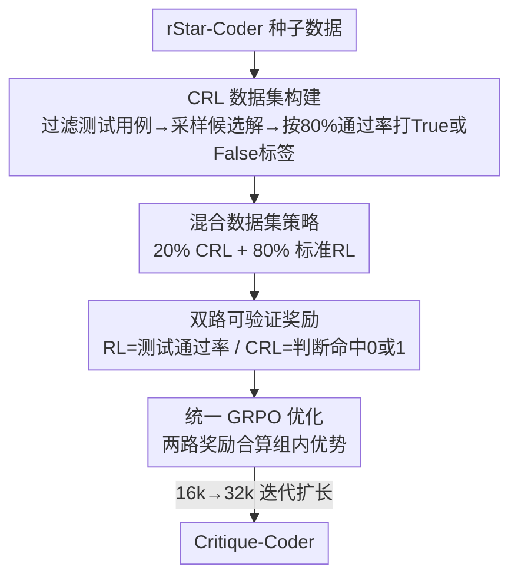

# Critique-Coder: Enhancing Coder Models by Critique Reinforcement Learning

**会议**: ICLR2026  
**OpenReview**: [https://openreview.net/forum?id=tsuxIeLUsz](https://openreview.net/forum?id=tsuxIeLUsz)  
**代码**: [项目页](https://tiger-ai-lab.github.io/Critique-Coder)  
**领域**: 代码智能 / LLM 推理 / 强化学习  
**关键词**: 批判强化学习, 代码生成, GRPO, 可验证奖励, 反思能力

## 一句话总结
本文提出"批判强化学习"（Critique Reinforcement Learning, CRL）——让模型对"问题-解答"对做出 True/False 判断、用判断是否正确作为可验证奖励，并把它和标准代码 RL 按 20%:80% 混合训练，得到的 Critique-Coder 在多个代码基准上一致超过纯 RL，8B 模型 LiveCodeBench(v5) 突破 60，并把批判能力迁移到逻辑推理任务。

## 研究背景与动机
**领域现状**：当前提升代码大模型推理能力的主流范式是"可验证奖励强化学习"（RLVR）：给定题目 $q$，策略采样若干候选解，用测试用例通过率当奖励信号去优化策略（GRPO/PPO）。AceCoder、HardTests、KodCoder、SWE-RL 等都沿这条路，靠规则化测试奖励拿到了明显增益。

**现有痛点**：RLVR 只奖励"把解答生成对"，整个训练过程里模型从来没有被显式要求去"评判一个已有解答对不对"。也就是说，标准 RL 缺少激发模型**批判 / 反思**行为的机制——它学会了写代码，却没专门学会审视代码。

**核心矛盾**：近期一批工作（如 Critique-Fine-Tuning, CFT；Critique-Guided-Distillation, CGD）证明"显式教模型批判"能释放推理能力，但它们走的是**监督模仿**路线——让模型去模仿教师给的批判轨迹（critique traces）。这意味着批判能力的上限被教师数据钉死，且本质上是蒸馏，没有把"批判"纳入可探索、可奖励的强化学习闭环。

**本文目标**：把"批判"做成一个**可验证、可探索的 RL 任务**，让模型在生成解答之外，还能因为"判断正确"而获得奖励；并探究这种批判信号是该替代还是补充标准 RL。

**切入角度**：作者注意到，判断"一个解答是否满足题目要求"天然是一个二分类、有 ground-truth、可自动验证的任务——这正好契合 RLVR 需要的"可验证奖励"。于是可以把批判变成和"通过测试用例"同构的奖励来源，塞进同一个 GRPO 优化里。

**核心 idea**：用"模型自己生成的判断 $c\in\{\text{True},\text{False}\}$ 是否等于标注标签 $c^*$"作为二值奖励（CRL），与标准测试通过率奖励（RL）混合，统一用 GRPO 更新策略——用批判的"反思信号"补 RL 的"解题信号"。

## 方法详解

### 整体框架
Critique-Coder 的训练是一个**双数据源、单一优化器**的混合 RL 框架。它同时喂两类样本：标准 RL 样本（题目 $q$ + 测试用例 $T$）和 CRL 样本（题目-解答对 $[q;s]$ + 标注判断 $c^*$）。对前者，策略采样多个解答、用测试通过率打分；对后者，策略采样多个批判、用判断是否命中 ground-truth 打 0/1 分。两类奖励统一转成 GRPO 的组内优势 $\hat A_{i,t}$ 去更新同一个策略 $\pi_\theta$。整条管线包含四块：构建可验证的 CRL 数据集、设计两路奖励、按 20% 比例混合、配合 16k→32k 迭代扩长训练。



### 关键设计

**1. 批判强化学习（CRL）：把"评判对错"变成可验证奖励**

这一设计直击"标准 RL 不激励反思"的痛点。标准 RLVR 让策略 $\pi_\theta$ 对题目 $q$ 采样 $n$ 个解答并用测试通过率打分，奖励信号只关心"解对不对"。CRL 则换了一个任务面：给定标注数据集 $D=\{([q_k;s_k],c^*_k)\}$，每条样本是一个"题目-解答"对加一个二值真值标签 $c^*\in\{0,1\}$，策略要生成判断 $c$ 来回答"这个解答 $s$ 是否满足题目 $q$ 的要求"。奖励纯粹由判断是否命中真值决定：

$$R_{crl}(c,c^*)=\begin{cases}1,& c=c^*\\0,& \text{otherwise}\end{cases}$$

判断缺失（没解析出 `\conclusion{}` 字段）也记 0。和 CFT 的关键区别在于：CFT 用**教师提供的批判轨迹**做监督模仿，CRL 则只用模型**自己生成的判断**和真值比对来给奖励——它是探索式强化学习，而不是蒸馏，因此不依赖更强的教师，批判能力可以靠 RL 自己长出来。

**2. CRL 数据集构建：靠"弱模型生成 + 测试用例打标"造出可验证的批判数据**

要做 CRL，先得有"题目-解答-真值判断"三元组，且真值必须可靠。作者从 rStar-Coder 的人工种子数据出发，但原始数据每题测试用例过多（常 >100 个）、个别用例极长（>10000 token），会让 RL 训练时验证开销爆炸，于是先**过滤**：丢掉长于 200 token 的用例、每题随机采 30 个，结果平均输入字符数从 96208 降到 40、平均用例数从 87 降到 24，大幅缩短验证时间。接着用 Qwen3-Coder-30B-A3B-Instruct 对每题生成候选解、抽取代码块，再把候选解**在过滤后的测试用例上实跑**，用通过率打 True/False 标签。一个工程细节是：部分用例执行超时会把正确解误判为失败，所以采用 **80% 通过率阈值**——通过率超过 80% 标 True，否则 False，以此放松超时带来的噪声。值得注意的是，打标用的 30B 生成模型 pass@1 只有 32.20%，反而**弱于**带推理的 Qwen3-4B(43.72%)，所以这不是"强教师蒸馏"，纯粹是用可验证的执行结果造可信标签。

**3. 混合数据集策略（20% CRL + 80% RL）：把批判当补充而非替代**

如果只用 CRL 数据训练，模型会被带偏向"评判/分析候选解"的行为，逐渐丧失"端到端把题目解出来"的能力——评测时要的是生成完整解答，纯批判训练会造成**格式漂移**。反过来纯 RL 又完全不接触反思模式。作者因此构建混合数据集，随机把 20% 数据指定为 CRL、其余 80% 为标准 RL，让模型在同一训练过程里既学评判判断、又学直接合成解答。20% 这个比例是消融选出来的最优点：0%（纯 RL）平均 45.7、20% 升到 47.2、50% 回落到 46.2、100%（纯 CRL）反而跌到 44.5（低于基线），尤其在 BigCodeBench-Hard 这类难子集上纯 CRL 掉得最狠。结论很明确——CRL 是 RL 的**互补信号**，不是替代品。

**4. 统一 GRPO 优化 + 迭代扩长：两路奖励合到同一个优势里更新**

两路奖励最终在 GRPO 里融合。GRPO 相比 PPO 用组内相对表现来更新，更稳更高效，目标为

$$J(\theta)=\mathbb{E}\Big[\tfrac{1}{G}\sum_{i=1}^{G}\tfrac{1}{|o_i|}\sum_{t=1}^{|o_i|}\min\big(\rho_{i,t}\hat A_{i,t},\,\text{clip}(\rho_{i,t},1-\epsilon,1+\epsilon)\hat A_{i,t}\big)-\beta D_{KL}(\pi_\theta\|\pi_{ref})\Big]$$

其中策略输入 $x$ 既可能是 RL 的单题 $q$、也可能是 CRL 的对 $[q;s]$，两种模态产出 $R_{rl}$（测试通过率 $K/N$，$K$ 为通过用例数）和 $R_{crl}$（0/1 判断奖励），二者**共同进入同一批的优势估计** $\hat A_{i,t}$。这让 GRPO 更新同时被"执行正确性"和"反思判断"塑形，是它区别于标准 RL 的根本之处。训练上采用 DeepCoder 式两阶段扩长：先把响应长度限 16k、奖励稳定后扩到 32k，让模型先在短上下文长出推理能力再迁到长链；16k 阶段还给 CRL 奖励乘 0.8 系数，防止它相对 RL 信号过于主导。

### 损失函数 / 训练策略
策略从预训练 checkpoint $\pi_{\theta_{init}}$ 初始化，在混合数据上训一个 epoch、按 LiveCodeBench(v5) 作验证集选最优 checkpoint。每步对每条样本采 $G$ 个输出：CRL 样本解析 `\conclusion{}` 里的判断算 0/1 奖励，RL 样本抽 ```` ```[code]``` ```` 代码块跑测试算通过率奖励。关键超参：batch size 128、学习率 1e-6、每 prompt 采 8 个输出；clip 比例非对称（上界 0.3、下界 0.2）以鼓励探索同时稳住熵。

## 实验关键数据

### 主实验
在 Qwen3-4B / 8B（thinking 模式）上训练，对比基线、纯 RL 与 Critique-Coder，覆盖 EvalPlus、BigCodeBench-Instruct、Aider-Polyglot、LiveCodeBench(v5) 四个代码基准。

| 模型 | EvalPlus | BigCodeBench-Full | Aider-Polyglot | LiveCodeBench v5 | AVG |
|------|----------|-------------------|----------------|------------------|-----|
| Qwen3-4B 基线 | 85.2 | 42.0 | 21.8 | 54.2 | 44.8 |
| Qwen3-4B-RL | 84.9 | 40.6 | 23.6 | 56.6 | 45.7 |
| **Critique-Coder-4B** | **86.5** | **43.1** | **24.4** | **59.0** | **47.2** |
| Qwen3-8B 基线 | 85.8 | 44.6 | 28.4 | 57.5 | 48.0 |
| Qwen3-8B-RL | 86.2 | 44.5 | 34.5 | 59.6 | 49.8 |
| **Critique-Coder-8B** | **87.7** | **46.6** | **35.6** | **60.8** | **51.5** |
| DeepCoder-14B（参考） | 85.3 | 38.2 | 18.4 | 60.6 | 44.1 |
| GPT-o1（参考） | 88.6 | 50.4 | 61.7 | 59.5 | 57.7 |

Critique-Coder-4B 相对基线 LiveCodeBench +4.8、甚至反超 8B 基线 +1.5；8B 版在 LiveCodeBench 达 60.8，超过 DeepCoder-14B（仅用其 28% 参数）和 GPT-o1。Aider-Polyglot 上 8B 较基线 +7.2，尽管 CRL 只在 Python 数据上训。

### 消融实验

| CRL 比例 | EvalPlus | BigCodeBench-Hard | Aider-Polyglot | LiveCodeBench v5 | AVG |
|----------|----------|-------------------|----------------|------------------|-----|
| 0%（纯 RL） | 84.9 | 23.0 | 23.6 | 56.6 | 45.7 |
| 50% | 86.5 | 22.3 | 24.0 | 56.0 | 46.2 |
| 100%（纯 CRL） | 85.2 | 17.6 | 21.3 | 56.6 | 44.5 |
| **20%（本文）** | **86.5** | **23.0** | **24.4** | **59.0** | **47.2** |

### 关键发现
- **20% 是甜点比例**：CRL 占比从 0→20% 平均涨到 47.2，再往上收益递减；纯 CRL（100%）反而跌破基线（44.5），尤其 BigCodeBench-Hard 从 23.0 崩到 17.6——过度依赖批判会把模型带偏到"判断导向"，与推理时需要长程解答生成不匹配。
- **批判能力可迁移到非代码推理**：在 BBEH 逻辑推理四子任务上，Critique-Coder-4B 平均较基线 +6.1，Time Arithmetic +8.0、Zebra Puzzles +7.5，说明 CRL 训出的反思能力跨任务可迁移，而非局限于代码。
- **序列式 test-time scaling 有效**：4B 模型放宽推理 token 预算，LiveCodeBench 从 59.0 单调升到 4 轮后 62.0（+3.0），但并行式（多解互评打分）不奏效。
- **CRL 改善了代码质量本身**：CRL+RL 生成的 think 块推理更长、代码注释更多，体现更强的深思与自解释倾向。

## 亮点与洞察
- **把"批判"重铸成 RLVR 任务**：最妙的一点是发现"判断解答对错"天然是二分类 + 有真值 + 可自动验证，正好套进可验证奖励 RL 的框架，从而把原本要靠教师轨迹监督的批判，变成可探索、可奖励的强化学习——这个"任务面切换"思路可迁移到任何"生成 vs 评判"成对的领域。
- **弱模型造标但不蒸馏**：用 pass@1 仅 32% 的 30B 生成候选解、再靠测试用例打可信标签，刻意避免"强教师蒸馏"，证明增益来自 CRL 范式本身而非更强模型的知识转移。
- **批判是补充不是替代**：20%/50%/100% 的清晰单调-回落曲线，把"反思信号过量会挤掉解题能力"这件事量化得很干净，对其他"辅助任务混训"有直接借鉴价值。

## 局限与展望
- **无法做可靠的事后自我批判**：作者诚实承认，CRL 提升的是训练中"生成前的反思"，一旦只给最终答案做并行自评（10 候选 × 64 批判投票），并不能提升性能——这与"LLM 难以在缺少中间推理轨迹时可靠自评/自改"的既有结论一致。
- **只在 Python 上训 CRL**：跨语言能力（Aider-Polyglot）虽有提升但仍落后 GPT-o1，多语言场景缺乏显式优化。
- **标签噪声依赖阈值**：CRL 标签靠 80% 通过率阈值放松超时误判，阈值本身是经验设定，可能在极端难题上引入噪声标签。
- **改进方向**：可探索把 CRL 扩到多语言/SWE 级真实工程任务、用更细粒度（步级）批判奖励替代二值判断，或让自我批判接入中间推理轨迹以打通事后 refine。

## 相关工作与启发
- **vs CFT（Critique-Fine-Tuning）**：本文最相关的对比。CFT 直接优化模型去**模仿**教师的批判推理过程（监督蒸馏），CRL 则鼓励模型**主动探索**并从自己最终判断的对错中学习，把批判推理与强化反馈结合——区别在"模仿 vs 探索"，CRL 不依赖更强教师。
- **vs 标准 RLVR（AceCoder / SWE-RL / DeepCoder）**：它们只用测试通过率奖励解答生成，CRL 在同一 GRPO 框架里加了一路"判断命中"奖励，把缺失的反思激励补上。
- **vs 自我纠错 / 反思（Self-Refine / Reflexion）**：这类方法靠推理时迭代自评自改，但鲁棒性受质疑；CRL 把批判能力**内化进训练**而非推理时拼装，绕开了 LLM 事后自评不可靠的老问题。
- **vs 奖励模型（PRM/ORM）**：奖励模型是外挂的学习型评估器给分指导 RL，CRL 则让策略模型自己同时是"解题者"和"评判者"，无需独立训练评估器。

## 评分
- 新颖性: ⭐⭐⭐⭐⭐ 把"批判"重铸为可验证奖励 RL 任务、与解题 RL 混训，范式简洁且角度新。
- 实验充分度: ⭐⭐⭐⭐ 两规模模型 × 四代码基准 + BBEH 迁移 + 比例消融 + test-time scaling，较全面；多语言与更大模型未覆盖。
- 写作质量: ⭐⭐⭐⭐ 动机推导清晰、消融讲透了"补充非替代"，公式与算法描述完整。
- 价值: ⭐⭐⭐⭐⭐ 仅替换 20% 数据即稳定涨点、8B 反超 14B 与 o1，方法低成本可复用，对代码 RL 与通用推理都有借鉴。

<!-- RELATED:START -->

<div class="related-papers" markdown="1">

## 相关论文

- [\[NeurIPS 2025\] Co-Evolving LLM Coder and Unit Tester via Reinforcement Learning](../../NeurIPS2025/code_intelligence/co-evolving_llm_coder_and_unit_tester_via_reinforcement_learning.md)
- [\[ICLR 2026\] ATGen: Adversarial Reinforcement Learning for Test Case Generation](atgen_adversarial_reinforcement_learning_for_test_case_generation.md)
- [\[ICLR 2026\] Agnostics: Learning to Synthesize Code in Any Programming Language with a Universal Reinforcement Learning Environment](agnostics_learning_to_synthesize_code_in_any_programming_language_with_a_univers.md)
- [\[AAAI 2026\] ReCode: Updating Code API Knowledge with Reinforcement Learning](../../AAAI2026/code_intelligence/recode_updating_code_api_knowledge_with_reinforcement_learning.md)
- [\[ICLR 2026\] WebGen-Agent: Enhancing Interactive Website Generation with Multi-Level Feedback and Step-Level Reinforcement Learning](webgen-agent_enhancing_interactive_website_generation_with_multi-level_feedback_.md)

</div>

<!-- RELATED:END -->
