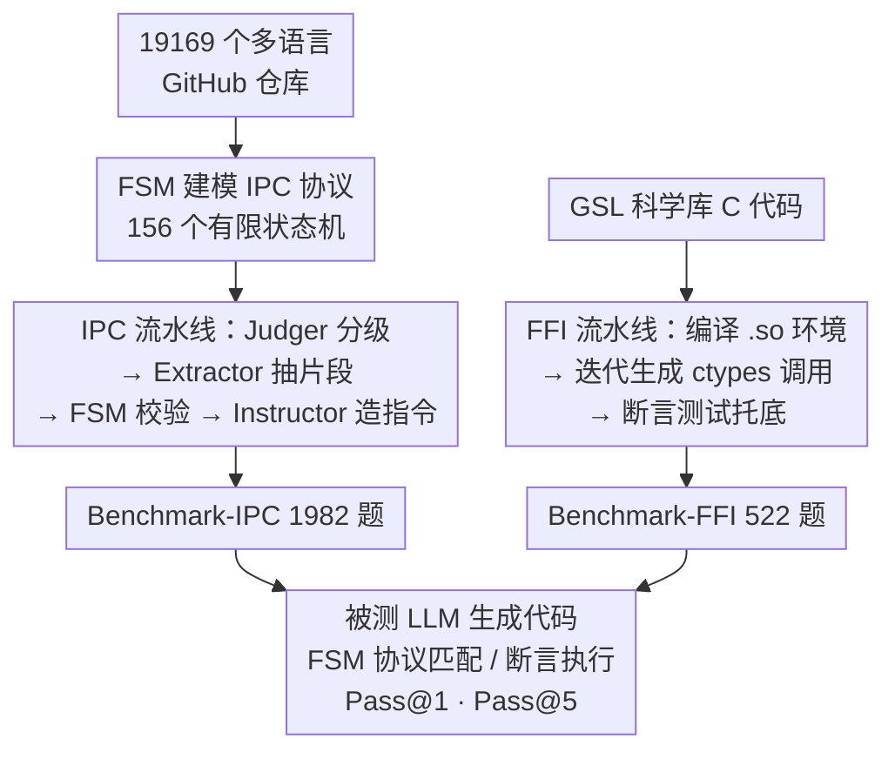

# CrossPL: Systematic Evaluation of Large Language Models for Cross Programming Language Interoperating Code Generation

**会议**: ICLR 2026  
**OpenReview**: [https://openreview.net/forum?id=p4ERSIzHdL](https://openreview.net/forum?id=p4ERSIzHdL)  
**代码**: https://github.com/newxzh/crosspl （有）  
**领域**: 代码智能 / LLM 评测 / Benchmark  
**关键词**: 跨语言互操作、IPC、FFI、有限状态机、代码生成评测

## 一句话总结
CrossPL 是第一个系统评测 LLM「跨编程语言互操作代码」生成能力的 benchmark，用 156 个有限状态机从 1.9 万个多语言 GitHub 仓库里挖出 1982 个 IPC 任务、再用 GSL 库构造 522 个 Python–C FFI 任务，对 20 个主流模型测下来发现：单语言代码生成已经 90%+ Pass@1 的模型，在 FFI 互操作上最好也只有 19.5% Pass@1，暴露出严重短板。

## 研究背景与动机
**领域现状**：评测 LLM 写代码的能力，现有 benchmark（HumanEval、MBPP、ClassEval、SWE-bench 乃至多语言的 HumanEval-X、MultiPL-E、CRUXEVAL-X）几乎全部聚焦在**单一语言内部**的代码生成或翻译。这些任务上 LLM 表现极强，很多模型 Pass@1 已经超过 90%。

**现有痛点**：真实软件系统里超过 80% 都用了两种以上编程语言，靠的是不同语言「各取所长」（C 跑性能、Python 调库写胶水）。但现有多语言 benchmark 只是「把同一道题翻译成 N 种语言、各自孤立地评」，并没有测「两种语言协同工作、互相调用」这件事。换句话说，没人知道 LLM 能不能写对**让 Python 和 C++ 通过 Socket 通信、或让 Python 通过 ctypes 调 C 函数**这类跨语言互操作（Cross-Programming-Language, CPL）代码。

**核心矛盾**：跨语言互操作代码在真实项目里是「稀疏且隐式」的——它零散嵌在大代码库里，边界难界定；而互操作的两种机制——进程间通信（IPC，如 Socket / gRPC / 消息队列）和外部函数接口（FFI，如 ctypes 调 C）——都对协议时序、序列化、函数签名、类型转换、内存布局极度敏感，一点小错就死锁、丢消息或未定义行为。要把这种代码自动采集出来、还能自动判对错，本身就很难。

**本文目标**：分解成两件事——(1) 自动**构造**一个覆盖 IPC + FFI 的 CPL 互操作 benchmark；(2) 设计能**自动判分**的评测协议，量化 20 个 LLM 在跨语言互操作上的真实水平。

**切入角度**：作者注意到 IPC 交互天然是「初始化 → 传数据 → 终止」这种带明确状态和确定迁移的流程，恰好可以用**有限状态机（FSM）**来形式化刻画与校验；而 FFI 难在依赖环境无法复现，于是退一步锁定「Python–C」这一对高价值组合，用自包含、可编译的 GNU 科学库（GSL）当底座来造可执行环境。

**核心 idea**：用「FSM 形式化 IPC 协议 + GSL 受控编译环境托底 FFI + 两条 LLM 流水线自动造题判分」，把原本难以采集、难以执行、难以评判的跨语言互操作代码，变成一个 2534 题、能自动跑分的 benchmark。

## 方法详解

### 整体框架
CrossPL 的整条管线分三块：(1) **从多语言仓库挖掘并建模 IPC 互操作模式**——选仓库、把 IPC 交互抽象成 FSM；(2) **CrossPL-IPC 构造与评测的 LLM 流水线**——用 FSM 在仓库里识别/抽取/校验 IPC 片段，再让 LLM 生成自然语言指令，最后用 FSM 判被测模型生成的代码对不对；(3) **CrossPL-FFI 构造与评测的 LLM 流水线**——以 GSL 的 C 代码为源，在预编译好的 `.so` 环境里迭代生成 Python–C ctypes 调用、用断言测试判对错。最终产出 2534 个任务（IPC 1982 题跨 6 种语言、FFI 522 题 Python–C），统一用 Pass@k 评测。

### 关键设计

**1. 用 156 个有限状态机形式化 IPC 协议：既当采集器又当判分器**

IPC 代码在真实仓库里稀疏且隐式，且机制五花八门（Pipe、TCP、UDP、HTTP、Websocket、gRPC、消息队列），靠人工或模糊匹配采集既慢又容易误判。作者把每种 IPC 技术的交互过程建模成一个 FSM：状态对应协议的关键步骤（如 Socket 的 `Socket()→Bind()→Listen()→Accept()→Send()/Receive()→Close()`），迁移对应步骤间的确定性流转。相比前人 PolyFax 只定义了 8 个粗粒度、状态少、靠模糊匹配（还会错把注释掉的代码也匹配上）的 FSM，本文在通读官方文档和真实多语言项目后设计了 156 个**场景级**细粒度 FSM。这套 FSM 一物两用：在**构造阶段**当静态分析工具，从仓库里精确识别并抽取「最小且逻辑完整」的 IPC 片段；在**评测阶段**当判分器，把被测模型生成的代码与对应 FSM 做协议匹配——因为 FSM 能模块化地表示状态迁移逻辑，所以能精确捕捉到「漏了某个状态」「协议时序错位」这类细微违规，而不只是看代码能否跑通。

**2. CrossPL-IPC 的多角色 LLM 流水线：Judger → Extractor → Instructor 接力**

光有 FSM 还不够，从「FSM 命中的代码实例」到「一道带自然语言指令的题」需要多步处理，单个 LLM 处理长上下文复杂任务容易出错。作者用 DeepSeek-V3 搭了一条分角色流水线：先由 **Judger** 确认这段代码确实实现了 IPC，并判定是函数级还是类级；再交给对应的 **Function-Extractor / Class-Extractor**，在技术专属描述和 one-shot 示例引导下抽出最小完整片段；抽出的片段过一遍 **FSM 校验**，失败就**升温重试、最多 5 次**；通过后交给 **Instructor** 生成自然语言任务描述。每道题最终以结构化 JSON 存元数据（文件路径 $p$、交互类型 $\tau$、技术名 $\theta$、语言 $L$、FSM 标识 $\sigma$、关键步骤 $K$）、代码与指令。作者还随机抽样人工检查指令质量，确认描述准确。评测时把指令喂给被测模型生成代码，再用 FSM 匹配判分。

**3. CrossPL-FFI 锁定 Python–C + GSL 受控环境：让「不可执行」变「可执行」**

FFI 的语言组合空间巨大、且真实场景依赖复杂、无法大规模复现执行环境，这让 FFI benchmark 极难构造。作者做了两个关键取舍：其一，**只做 Python–C**——两者都是最流行的语言，C 给性能和内存控制、Python 给简洁和生态（NumPy/SciPy/PyTorch 等），是最有代表性的高价值组合；其二，C 代码源**选用 GNU 科学库（GSL）**——它自包含、可稳定编译，规避了真实项目的依赖地狱。流水线先用 Autotools+Make 把 GSL 编成共享对象 `.so` 建立运行时环境，再清洗 C 源码、用「初始 FFI prompt + 纠错 prompt」让 LLM 生成 ctypes 封装与候选解，在 `.so` 可用的环境里执行：通过就入库，失败就把报错信息加回 prompt 让模型（DeepSeek-V3）**迭代修正**。规范解里的类名/函数名/参数名会写进题目的 Instruction 字段，被测模型的输出再配上自动生成的断言测试用例来验证正确性。这样就把 FFI 这种「难执行难判分」的任务，变成了可扩展、可复现、可控的自动评测。

**4. 用无偏 Pass@k 统一判分**

两套子集都用 HumanEval 的无偏 Pass@k 指标度量功能正确性：
$$\text{pass@}k := \mathbb{E}_{\text{Problems}}\left[1-\frac{\binom{n-c}{k}}{\binom{n}{k}}\right]$$
其中 $n$ 是采样总数、$c$ 是其中正确的个数、$k$ 是取前 $k$ 个（Pass@5 时 $n=10$）。零样本设定下报 Pass@1（贪心解码、温度 0）和 Pass@5（温度 0.2、top-p 0.95），用宏平均汇总。IPC 任务的「正确」=生成代码能与对应 FSM 协议匹配；FFI 任务的「正确」=在受控环境里通过断言测试。

### 损失函数 / 训练策略
本文是 benchmark + 评测研究，不涉及模型训练。构造侧用 DeepSeek-V3 作为流水线引擎；被测侧覆盖 20 个模型，闭源/大模型走官方 API，LLaMA3-8b / Gemma-7b / CodeLLaMA-7b / CodeGemma-7b 等开源小模型用 Ollama 本地部署在 RTX 3090 上推理。

## 实验关键数据

### 主实验
覆盖 20 个代表性 LLM，回答三个 RQ：IPC 生成（RQ1）、FFI 生成（RQ2）、模型特性影响（RQ3）。

| 子集 / 视角 | 指标 | 最好模型表现 | 最差模型表现 | 对比基线 |
|------|------|------|------|------|
| CrossPL-FFI（Python–C） | Pass@1 | GPT-4o 19.54% | Llama3-8b-instruct 0.77% | 单语言 benchmark 上很多模型 >90% Pass@1 |
| CrossPL-FFI（Python–C） | Pass@5 | GPT-4o 26.46% | Llama3-8b-instruct 3.95% | — |
| CrossPL-IPC（语言视角） | Pass@1 | C++ 上最好 | Go 上最弱 | — |
| CrossPL-IPC（技术视角） | Pass@1 | gRPC 等高层协议最好 | Pipe / HTTP 等低层协议最弱 | — |

**核心反差**：单语言代码生成上 90%+ Pass@1 的模型，到了 CPL 互操作（尤其 FFI）上断崖式下跌到不足 20%，说明跨语言互操作是当前 LLM 一个被严重忽视的能力盲区。

### 消融实验
作者用 Qwen3-4B 替换流水线中各角色，量化「模型规模」对构造质量的贡献：

| 替换配置 | 有效样本变化 | 说明 |
|------|---------|------|
| 替换 Extractor（IPC） | 1982 → 1723（−259） | IPC 抽取对模型能力较敏感 |
| 替换 Instructor（IPC） | 1982 → 1890（−72） | 指令生成是浅推理、少 token，影响较小 |
| 替换 Extractor（FFI） | 522 → 65（骤降） | 高质量 FFI 构造高度依赖强而稳的大模型 |

### 关键发现
- **think 模式只对 FFI 有用**：Qwen3 系列开启 think 模式后，在 FFI 任务上明显涨点（FFI 需要处理外部库链接、类型规约、内存操作等推理密集环节），但在 IPC 任务上几乎无益、有时反而掉点——因为 IPC 靠的是训练语料里已充分覆盖的结构化通信模式，多余的推理步骤帮不上忙。
- **构造侧模型规模分工不同**：IPC 流水线的 Judger/Instructor 只需浅推理，小模型理论可替；但小模型假阳性率高，会沿流水线放大、暴涨无谓的抽取尝试，所以仍偏好强 Judger。FFI 流水线认知负担重（分析低层 C、造题、写参考解、构造断言），强烈受益于大模型。
- **数据泄漏可控**：IPC 样本按创建年份分组（2024–2025 占 69.48%），未见模型在更新样本上系统性更好，时间泄漏小；FFI 设计上让模型只看孤立 C 函数独立生成，prompt 与验证用的 pygsl 代码库词汇重叠仅函数名 0.61%、类名 0.99%，污染可忽略。
- **失败类型**：GPT-4o 在 FFI 上的失败被归为六类——符号解析错误、GSL 运行时错误、Python 层调用错误、NameError/未定义符号、断言/测试失败、内存/崩溃错误，反映模型在低层代码理解与 CPL 领域知识上的根本不足。

## 亮点与洞察
- **FSM 一物两用**：把有限状态机同时当「采集器」和「判分器」，既解决了 IPC 代码稀疏隐式难采集的问题，又给出了比「跑通就算对」更细粒度的协议级判分——能抓到「漏状态/时序错」这类语义违规，这是把领域知识形式化进评测的漂亮做法。
- **「难执行」问题的工程化解法**：FFI 评测最大的拦路虎是依赖与可执行性，作者用「锁定 Python–C + GSL 自包含库 + 预编译 .so 环境 + 断言测试」一套组合拳把它变成可复现、可自动判分的任务，这套思路可迁移到任何「真实环境难复现但需要执行级评测」的代码 benchmark。
- **最有价值的「啊哈」**：单语言 90%+ 与跨语言 <20% 的巨大反差，干净利落地证明了现有 LLM 评测高估了模型的真实工程能力——它们擅长孤立写函数，却不擅长让两种语言正确协作。
- **可迁移的造题范式**：「强模型造题/判分 + 失败信息回灌迭代修正 + 人工抽检」这条 LLM 流水线，可复用到其他需要可执行参考解的 benchmark 自动化构造。

## 局限与展望
- **FFI 只覆盖 Python–C 一对**：虽是最有代表性的组合，但 FFI 语言对空间巨大，结论能否外推到 Java–C、Go–C 等其他组合未知。
- **IPC 评测依赖 FSM 的覆盖与正确性**：156 个 FSM 再细也可能漏掉某些协议变体或合法的非标准实现，FSM 匹配判「对错」可能对「写法正确但状态序列不完全吻合」的代码偏严。
- **GSL 作为 FFI 底座虽稳定但偏数值计算**：可能让 FFI 任务的分布偏向科学计算类，难覆盖系统编程、图形等其他 FFI 场景。
- **构造侧重度依赖 DeepSeek-V3**：流水线质量与该模型能力强绑定，消融也显示换小模型质量骤降，benchmark 的「客观性」一定程度上受造题模型影响。
- **改进方向**：扩展更多 FFI 语言对与 IPC 协议、引入更多自包含底座库、探索针对 CPL 互操作的专门微调或工具增强来真正提升模型能力，而不止于评测。

## 相关工作与启发
- **vs HumanEval / MBPP / ClassEval / SWE-bench**: 它们做单语言（多为 Python）的函数级/类级/仓库级评测，本文做跨语言互操作；前者上模型已 90%+，本文揭示这类成绩掩盖了跨语言协作的严重短板。
- **vs HumanEval-X / MultiPL-E / CRUXEVAL-X / Multi-SWE-bench**: 它们是「多语言」——把同一任务翻译到多种语言、各自孤立地评，或仍在单语言项目内修 bug；CrossPL 是「跨语言互操作」——测两种语言在同一系统里通过 IPC/FFI 真正协同的能力，这是前者完全没覆盖的维度。
- **vs PolyFax**: 同样用 FSM 识别多语言互操作模式，但 PolyFax 只有 8 个粗粒度 FSM、状态少、靠模糊匹配、会误匹配注释代码；本文设计 156 个场景级细粒度 FSM，且把 FSM 从「分类工具」升级为「采集器 + 协议级判分器」。

## 评分
- 新颖性: ⭐⭐⭐⭐⭐ 第一个系统评测 LLM 跨语言互操作（IPC+FFI）代码生成的 benchmark，填补明确空白。
- 实验充分度: ⭐⭐⭐⭐⭐ 20 个模型 × 2534 任务 × 多视角，含消融、数据泄漏、温度敏感性等扎实分析。
- 写作质量: ⭐⭐⭐⭐ 动机与挑战交代清晰，FSM/流水线设计讲得明白；部分构造细节散落附录。
- 价值: ⭐⭐⭐⭐⭐ 揭示「单语言强、跨语言弱」的能力盲区，对评测与后续模型改进都有直接指导意义。

<!-- RELATED:START -->

## 相关论文

- [\[ICLR 2026\] Evolving Graph Structured Programs for Circuit Generation with Large Language Models](evolving_graph_structured_programs_for_circuit_generation_with_large_language_mo.md)
- [\[ACL 2026\] Across Programming Language Silos: A Study on Cross-Lingual Retrieval-Augmented Code Generation](../../ACL2026/code_intelligence/across_programming_language_silos_a_study_on_cross-lingual_retrieval-augmented_c.md)
- [\[AAAI 2026\] SPAN: Benchmarking and Improving Cross-Calendar Temporal Reasoning of Large Language Models](../../AAAI2026/code_intelligence/span_benchmarking_and_improving_cross-calendar_temporal_reasoning_of_large_langu.md)
- [\[ICLR 2026\] LearNAT: Learning NL2SQL with AST-guided Task Decomposition for Large Language Models](learnat_learning_nl2sql_with_ast-guided_task_decomposition_for_large_language_mo.md)
- [\[ICLR 2026\] Agnostics: Learning to Synthesize Code in Any Programming Language with a Universal Reinforcement Learning Environment](agnostics_learning_to_synthesize_code_in_any_programming_language_with_a_univers.md)

<!-- RELATED:END -->
