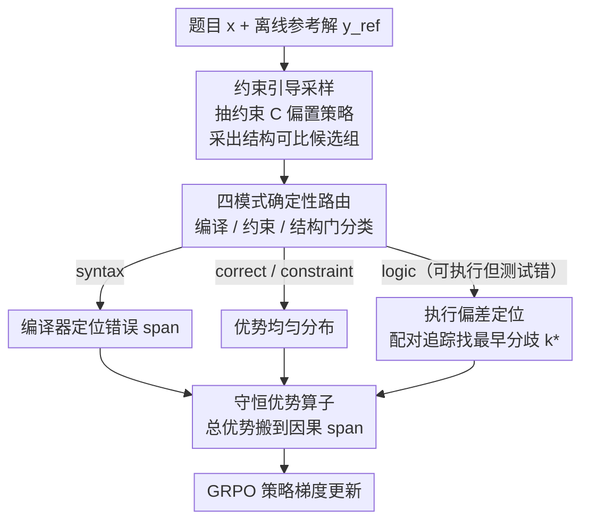

# Execution-Grounded Credit Assignment for GRPO in Code Generation

**会议**: ICLR 2026 Workshop (SPOT)  
**arXiv**: [2603.16158](https://arxiv.org/abs/2603.16158)  
**代码**: 未公开  
**领域**: 代码智能  
**关键词**: GRPO, 代码生成, 信用分配, 强化学习, 执行追踪, RLVR

## 一句话总结

提出 EGCA（Execution-Grounded Credit Assignment），通过执行追踪定位程序中最早的语义偏差位置，将 GRPO 的梯度集中到因果 token span 上，解决代码生成中粗粒度信用分配问题，在 HumanEval 上达到 82.1% pass@1。

## 研究背景与动机

随着代码生成模型能力的提升，现代模型越来越多地产生**语法正确、结构合理、可完整执行**但因细微语义错误而未通过单元测试的代码。传统的基于可验证奖励的强化学习（RLVR）方法如 GRPO 使用单元测试作为奖励信号，但这一信号是**时间粗粒度**的——它作用于整个程序而非导致失败的特定决策。

GRPO 的 group-based 策略梯度将奖励信号均匀分布到所有 token 上，导致"近似正确"的解决方案收到的梯度过于分散，无法纠正局部推理错误。本文的核心论点是：**一旦模型已能可靠产生可执行的结构合理程序，信用分配（而非奖励稀疏性）才是无 critic RL 在代码生成中的主要瓶颈**。

现有工作的局限：
- **RLTF**：丰富了执行反馈但无法定位失败发生的位置
- **StepCoder**：掩蔽未执行 token，但程序完整执行时所有 token 都被执行无法区分
- **TEMPO/P2T**：基于文本分支点的 token 级更新，但文本分歧不一定对应语义失败的因果位置
- **CodeRL+**：加入执行语义对齐辅助目标，但离开了无 critic 范式

## 方法详解

### 整体框架

EGCA 把 GRPO 那一份均摊到全序列的优势，重新汇聚到"真正写错的那几个 token"上，而不引入 critic、辅助损失或学习型验证器。它先用一个离线参考解为每道题抽取算法约束并引导采样，再用确定性门把每个候选程序路由到 syntax / constraint / correct / logic 四种失败模式，最后只对 logic 模式样本沿执行追踪定位最早语义偏差的位置，把优势集中到那段因果 span、掩蔽其余 token。

### 关键设计

**1. 参考解驱动的约束引导采样：让候选程序结构上可比**

信用分配要落到具体 token，前提是候选程序和"正确写法"在结构上能逐步对齐；若两份程序用完全不同的算法骨架，逐状态比较就失去意义。EGCA 为每道题离线策划一个参考解 $y^{\text{ref}}$，它不作模仿目标，只承担提取约束、定义参考执行行为、锚定语义比较三件事。一个 debugger LLM 从 $(x, y^{\text{ref}})$ 抽出算法约束 $\mathcal{C} = \{c_1, \ldots, c_M\}$（允许的数据结构、控制流形式、复杂度目标等），注入采样提示把策略偏置到结构可比的程序上：$y_i \sim \pi_\theta(\cdot \mid x \| \mathcal{C})$。这样采出来的一组程序大多与参考解共享骨架，为后续逐状态对齐铺平道路。

**2. 四种失败模式的确定性路由：不同错误用不同的信用分配方式**

把所有失败一视同仁地均摊优势，正是 GRPO 信用太糊的根源；EGCA 主张按错误类型分而治之。它先解析候选与参考解为 AST、构建归一化 CFG 算结构相似度，得到可比性门 $\mathbb{I}_{\text{cmp}}(y)\in\{0,1\}$，再结合约束满足指示 $\mathbb{I}_\mathcal{C}$ 和单元测试奖励 $\hat{R}$，用一条确定性规则把每个候选归类：$$m(y) = \begin{cases} \text{syntax} & \text{编译/运行时错误} \\ \text{constraint} & \mathbb{I}_\mathcal{C}(y)=0 \lor \mathbb{I}_{\text{cmp}}(y)=0 \\ \text{correct} & \hat{R}(y)=1 \land \mathbb{I}_\mathcal{C}(y)=1 \\ \text{logic} & \text{其他（可执行、满足约束但测试失败）} \end{cases}$$ 整个分类不含任何学习组件，纯靠编译器、约束检查和结构门给出，因此可复现且无教师泄漏；其中真正需要精细信用分配的，正是"近似正确"的 logic 模式。

**3. 执行偏差定位：在 logic 模式里找出最早出错的那一步**

对 logic 模式候选，EGCA 在第一个失败的单元测试输入 $d$ 上同时跑候选和参考解，拿到逐步状态追踪 $\tau(y_i, d) = (S_1, \ldots, S_K)$ 与 $\tau(y^{\text{ref}}, d) = (S_1^{\text{ref}}, \ldots, S_K^{\text{ref}})$，把最早出现语义分歧的边界定义为 $k^* = \min\{k : S_k \neq S_k^{\text{ref}}\}$。debugger LLM 在对齐后的结构与配对追踪上确认 $k^*$ 并映射到对应 token span $\mathcal{T}_{k^*}$——注意它只负责"定位偏差在哪"，不充当正确性判定器，这也是后文 1.5B debugger 能教出 +8.2 点更强学生、从而排除蒸馏的关键。相比之下文本分支点（TEMPO/P2T）只能标出"措辞不同"，而执行偏差直接对应"行为开始走偏"的因果位置。

**4. 守恒的 token 级优势算子：重分布而非放大梯度**

定位之后，EGCA 用一个分段算子把序列级优势 $A_i$ 改写成 token 级 $a_{i,t}$：$$a_{i,t} = \begin{cases} A_i / T_i & m(y_i) = \text{correct/constraint（均匀分布）} \\ \frac{A_i}{|\mathcal{T}_{\text{err}}|} \mathbf{1}[t \in \mathcal{T}_{\text{err}}] & m(y_i) = \text{syntax（编译器定位）} \\ \frac{A_i}{|\mathcal{T}_{k^*}|} \mathbf{1}[t \in \mathcal{T}_{k^*}] & m(y_i) = \text{logic（执行偏差定位）} \end{cases}$$ syntax 用编译器报错位置、logic 用 $\mathcal{T}_{k^*}$ 锚定因果 span，其余 token 优势归零。关键在于无论哪个分支都满足 $\sum_{t=1}^{T_i} a_{i,t} = A_i$：总优势严格守恒，只是从全序列搬到那几个该负责的 token 上，所以 EGCA 改的是梯度的"分布"而非"幅度"，不会破坏 GRPO 的优化稳态。最终目标函数仍是标准的策略梯度形式 $\mathcal{L}(\theta) = -\sum_{i=1}^{G} \sum_{t=1}^{T_i} a_{i,t} \log \pi_\theta(y_{i,t} \mid x, y_{i,<t})$，不含任何教师梯度或模仿项。

### 损失函数 / 训练策略

训练基于 DeepSeek-Coder-Instruct-6.7B，组大小 $G=16$，AdamW 学习率 $5 \times 10^{-7}$，KL 系数 $\beta=0.05$，裁剪范围 $\varepsilon=0.2$，在 8×A100 80GB 上跑 3 个 epoch。由于只有 logic 模式（训练中约占 35% 样本）走完整的执行追踪定位，其余样本沿用标准 GRPO 更新，额外墙钟开销仅 18%。

## 实验关键数据

### 主实验

| 方法 | HumanEval (pass@1) | MBPP (pass@1) |
|------|-------------------|---------------|
| DeepSeek-Coder 6.7B base | 78.6 | 65.4 |
| SFT | 71.9 | 60.3 |
| Vanilla PPO | 78.0 | 65.6 |
| GRPO | 79.0 | 67.4 |
| RLTF | 77.9 | 64.5 |
| StepCoder-mask | 78.7 | 67.0 |
| CodeRL+ | 81.6 | 67.4 |
| **EGCA (Ours)** | **82.1** | **68.9** |

EGCA 相比 GRPO 提升 +3.1 / +1.5，相比 StepCoder +3.4 / +1.9，相比 CodeRL+ +0.5 / +1.5，仅增加 18% 墙钟开销。

### 消融实验

**排除教师泄漏——Debugger 规模消融**：

| Debugger 模型 | 自身 pass@1 | 学生 HumanEval | 学生 MBPP |
|--------------|------------|---------------|----------|
| Qwen2.5-Coder-1.5B | 70.7 | 78.9 | 66.1 |
| Qwen2.5-Coder-7B | 84.8 | 82.1 | 68.9 |
| Claude 4.5 Sonnet | 83.7 | — | 67.8 |

1.5B debugger 训练出的学生**超过 debugger 自身 +8.2 点**，排除知识蒸馏。从 7B 到 Sonnet 4.5 仅额外提升 +1.6，debugger 能力增益饱和。

**蒸馏对照**：

| 方法 | HumanEval | MBPP |
|------|-----------|------|
| Teacher SFT | 60.9 | 58.1 |
| Teacher-critique RL | 76.3 | 66.1 |
| **EGCA** | **82.1** | **68.9** |

### 关键发现

1. **信用分配是瓶颈而非奖励稀疏性**：随机或晚偏差定位退化到均匀基线
2. **软化掩码单调恶化性能**：证实二值掩码优于渐变
3. 训练中约 **35% 样本进入 LOGIC 模式**由 EGCA 处理，其余 65% 使用标准更新
4. **Stage-dependent**：方法面向"近似正确"场景，弱初始化时 localization 触发少

## 亮点与洞察

1. **核心洞察精辟**："对近似正确代码，知道**哪里**出错比知道出错了更有价值"
2. **零额外学习组件**：不引入 critic/辅助损失/学习型验证器，仅改变梯度质量分布
3. **执行语义与 RL 优雅结合**：通过确定性门和执行追踪注入运行时语义信息
4. **实验设计严谨**：三重教师泄漏控制实验令人信服地排除了蒸馏假说
5. **即插即用**：仅 18% 开销，可作为任何 GRPO 训练的后期精炼技术

## 局限与展望

1. **依赖参考解**：限于竞赛编程和有测试的函数合成，开放式生成无法使用
2. **结构比较局限**：多种结构不同的正确方案可能被 comparability gate 排除
3. **规模验证不足**：仅 6.7B 策略，扩展到更大模型和多文件生成待探索
4. **Workshop 论文**：实验规模和 benchmark 覆盖相对有限
5. 可尝试将执行偏差定位推广到数学推理等其他可验证任务

## 相关工作与启发

- **StepCoder** (Dou et al., 2024)：掩蔽未执行 token，最接近工作但无法处理完整执行的程序
- **TEMPO/P2T** (Tran et al., 2025)：文本前缀树推导 token 级更新，但文本分歧 ≠ 语义分歧
- **CodeRL+** (Jiang et al., 2025)：执行语义对齐辅助目标，离开无 critic 范式
- 启发：执行追踪作为信用分配信号可推广到其他领域（数学步骤验证、逻辑推理链）

## 评分

- **新颖性**: ⭐⭐⭐⭐ — 执行追踪 + 信用分配结合新颖，四种失败模式分类设计精巧
- **技术深度**: ⭐⭐⭐⭐ — 归一化信用分配算子有理论美感
- **实验充分性**: ⭐⭐⭐ — 仅 6.7B 模型和两个 benchmark
- **写作质量**: ⭐⭐⭐⭐ — 动机清晰，方法描述精确
- **实用价值**: ⭐⭐⭐⭐ — 即插即用，开销合理
- **综合推荐**: ⭐⭐⭐⭐ (4/5)

<!-- RELATED:START -->

## 相关论文

- [\[ACL 2026\] CodeRL+: Improving Code Generation via Reinforcement with Execution Semantics Alignment](../../ACL2026/code_intelligence/coderl_improving_code_generation_via_reinforcement_with_execution_semantics_alig.md)
- [\[ICML 2026\] BoostAPR: Boosting Automated Program Repair via Execution-Grounded Reinforcement Learning with Dual Reward Models](../../ICML2026/code_intelligence/boostapr_boosting_automated_program_repair_via_execution-grounded_reinforcement_.md)
- [\[ACL 2026\] SolidCoder: Bridging the Mental-Reality Gap in LLM Code Generation through Concrete Execution](../../ACL2026/code_intelligence/solidcoder_bridging_the_mental-reality_gap_in_llm_code_generation_through_concre.md)
- [\[ICML 2025\] Reasoning Through Execution: Unifying Process and Outcome Rewards for Code Generation](../../ICML2025/code_intelligence/reasoning_through_execution_unifying_process_and_outcome_rewards_for_code_genera.md)
- [\[ACL 2026\] MARS2: Scaling Multi-Agent Tree Search via Reinforcement Learning for Code Generation](../../ACL2026/code_intelligence/mars2_scaling_multi-agent_tree_search_via_reinforcement_learning_for_code_genera.md)

<!-- RELATED:END -->
