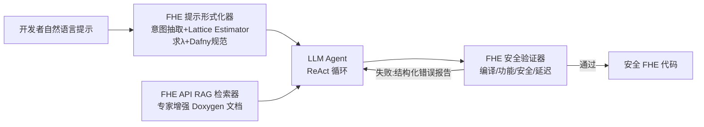

# FHE-Coder: Benchmarking Secure Agentic Code Generation for Fully Homomorphic Encryption

**会议**: ICLR 2026  
**OpenReview**: [https://openreview.net/forum?id=4F1py5vQXm](https://openreview.net/forum?id=4F1py5vQXm)  
**代码/主页**: [https://fhe-coder.github.io](https://fhe-coder.github.io)  
**领域**: 智能体代码生成 / 隐私计算 / 全同态加密  
**关键词**: FHE, TFHE, CKKS, LLM Agent, RAG, 安全验证, Lattice Estimator  

## 一句话总结
针对"LLM 生成的 FHE 代码功能通过却密码学不安全"这一致命盲区，提出三阶段智能体框架 FHE-Coder（提示形式化器 + 专家增强 RAG + 安全验证器）并配套新指标 Pass@1(func sec) 与 10 任务基准，让多种 LLM 在 TFHE/CKKS 上稳定产出可编译、功能正确且可验证安全的同态加密代码。

## 研究背景与动机
**领域现状**：全同态加密（FHE）允许在密文上直接计算，是机密计算的基石，TFHE（布尔门 + 可编程自举）与 CKKS（多项式环上的近似算术）已被 Apple、Microsoft、Zama 等大规模部署。但写一个安全的 FHE 程序需要在 LWE 安全界、噪声增长、参数兼容性之间精细协调，门槛极高，连 FHERMA 竞赛里实现 ReLU/卷积都困难重重。

**现有痛点**：把通用代码生成 agent 直接搬到 FHE 上几乎必然失败——模型对 FHE 程序结构和密码学约束没有概念，频繁幻觉 API 或误用函数破坏同态性；参数配置需要针对方案推理安全级别和噪声预算，标准提示流水线根本不具备这种能力；更关键的是，评测指标 Pass@k 只衡量功能正确性，一段在**明文**上运行的代码也能通过单元测试，却彻底背叛了隐私保护目标。

**核心矛盾**：功能正确 ≠ 密码学安全，而现有"提示到代码"的工作流和 Pass@k 指标都默认这两者等价。作者实验里基线 agent 在几乎所有任务上 Pass@1(func sec) 趋近于零，即"看起来能跑、实则是明文"。

**本文目标**：建立一套系统的方法论 + 基准，让 LLM agent 能从自然语言可靠地生成**可编译、功能正确、可验证安全**的 FHE 代码，并把安全提升为一等评测目标。

**核心 idea**：用三个紧耦合组件分别堵住三类失败模式——把参数选择从"概率猜测"换成**用 Lattice Estimator 数学求解**（提示形式化器），把 API 调用从"关键词匹配"换成**按密码学目的检索专家标注文档**（RAG），把验收从"只测功能"换成**显式做安全检查并迭代反馈**（安全验证器）。

## 方法详解

### 整体框架
FHE-Coder 是一个基于 ReAct 提示的三阶段智能体工作流：开发者的自然语言提示先经**提示形式化器**补全为带安全参数的形式化规范，agent 在生成代码时通过 **API RAG 检索器**获取方案专属的文档与示例，产出的代码交给 **安全验证器**做编译/功能/安全/延迟四级校验，任何一级失败都会生成结构化错误报告回灌给 agent 迭代修正，最多 10 轮直到安全检查通过。

### 关键设计

**1. FHE 提示形式化器：用数学求解替代参数幻觉**　基线 agent 最致命的失败是靠概率生成去"猜"密码学参数，常给出互不兼容的参数或不安全的噪声预算。形式化器把这一步改成**确定性求解**：先用一个 LLM 从用户提示抽取高层意图，再交给 Lattice Estimator（Albrecht 等）根据目标安全级别**精确解出** LWE 参数 $\lambda$（如把模糊的"参数应为 1024"落实成 $n=1024,\ \lambda=128$），而非预测它；随后第二个 LLM 用这套安全配置生成含 Dafny 伪代码的形式化规范，其中的 `ensure` 语句会被翻译成最终 C++ 代码里的 `assert` 检查，强制解满足合法密文结构和中间不变量。对矩阵-向量乘、MLP 这类需要多步推理的组合任务，还引入**结构化分解**：agent 先生成并验证安全原语（如点积），再由"组合器"agent 用这些已验证子程序拼出最终程序。

**2. 专家增强 RAG 检索器：按密码学目的而非关键词检索**　标准检索在 FHE 上几乎完全失效，因为 LLM 没有内在结构去理解严格的密码学 API 和"只在密文上算"的规则。作者离线构建一个人在回路的知识库：把 TFHE 等方案的文档串（docstring）转成 Doxygen 格式，用 `@objective` 这类结构化标签嵌入机器可读的语义说明，从而让 agent 能按"密码学目的"（如"如何做按位 AND"）检索到合规的代码片段，而不是靠模糊关键词匹配，确保选中的 API 遵守噪声与参数规则。检索时 chunk 大小设 600、重叠 120。这套离线准备是一次性的轻量安全步骤，换方案（如 CKKS）只需替换文档语料，跨方案适配近乎即插即用。

**3. FHE 安全验证器：把安全提升为显式验收门**　传统 Pass@k 功能测试只保证代码符合操作意图，但实验显示基线常产出"功能通过却用明文运算"的不安全代码。验证器在编译、功能之外加了一道根植于 LWE 困难性的**安全检查**：严格核验 (i) 仅使用 TFHE/CKKS 同态 API 以杜绝明文泄漏、(ii) 参数配置与 Lattice Estimator 给出的安全值一致、(iii) 所有输入在使用前已加密；任一不满足即判不安全。检测到违规（连同编译/功能/延迟错误）时生成结构化 `Formal Error Report`，驱动自动反馈循环逼迫 agent 收敛到"功能正确且数学上安全"的解。

## 实验关键数据

### 主实验设置
- **基准**：10 个 TFHE 任务，按复杂度分三档——原语（AND/ReLU/加法器/乘法器）、线性代数（向量加/点积/矩阵-向量/矩阵-矩阵乘）、深度学习（MLP/CNN），另含 Softmax/Attention/Transformer 等非线性架构。
- **模型**：开源 Qwen3-Coder-480B、Deepseek-V3.1，闭源 Gemini-2.5-Pro、GPT-5；温度 0.5，经 OpenRouter 访问；每项重复 5 次取均值；RAG 用 text-embedding-3-small。
- **指标**：Pass@k(func)、新提出的 **Pass@1(func sec)**（功能正确**且**密码学安全）、相对专家代码的 Latency。
- **基线**：BAS（单次直接生成）、COT（零样本思维链 + 一个正确范例）。

### 主结果（GPT-5，pass@1(func sec) 对比）

| 方法 | 安全通过率 | 说明 |
|------|-----------|------|
| BAS | ≈ 0.0 | 几乎全部任务安全趋近于零，常生成明文实现 |
| COT | ≈ 0.0 | 加范例仍无法满足密码学协议 |
| FHE-Coder | 近乎满分 | 全基准上一致产出功能正确且可验证安全的代码 |

跨四个 LLM（图 6）结论一致：基线的安全缺陷**与模型无关**，唯有 FHE-Coder 让各模型稳定产出安全代码；性能上限受底座能力影响（GPT-5、Gemini-2.5-Pro 优于 Deepseek、Qwen3）。

### 消融实验（GPT-5，Vector Addition，pass@1(func sec)）

| 配置 | 安全通过率 |
|------|-----------|
| BAS（基线） | ≈ 0.0 |
| + 提示形式化器（FP） | 0.6 |
| + FP + RAG | 0.8 |
| 完整 FHE-Coder（+ 安全验证器） | 1.0 |

### 结构化分解与跨方案
- **复杂组合任务**（图 7）：无 SD 时矩阵-向量乘/CNN 趋近 0，加结构化分解后矩阵-向量乘达 0.70、CNN 达 0.60、MLP 约 0.35（逻辑电路越深越难同时保功能与安全）。
- **非线性架构**：FHE-Coder + SD 在 Softmax、Attention 上对 GPT 达满分，Transformer 约 0.4。
- **CKKS 泛化**（图 9）：基线近零，FHE-Coder + SD 在 Attention 上两模型均满分、Softmax 对 GPT 满分，Transformer 约 0.4。
- **执行耗时**（表 2）：AND 约 10.45 ms、ReLU 约 11.50 ms、MatMul 约 2.54 分钟——验证器本身开销在毫秒级，主要时间来自生成代码的固有 FHE 执行。

### 关键发现
1. 基线 agent 在功能上偶有成功，但安全通过率几乎全为零，**功能正确是安全代码的误导性代理指标**。
2. 三个组件累积互补、缺一不可：形式化器解决参数、RAG 解决 API 幻觉、验证器闭环兜底，三者齐备才到 1.0。
3. 框架收益与模型无关（model-agnostic），但绝对上限仍受底座 LLM 推理能力约束。

## 亮点与洞察
- **指标层面的真问题**：明确指出 Pass@k(func) 在密码学编程里是"假阳性"指标——能跑的明文代码彻底背叛隐私目标，提出 Pass@1(func sec) 把安全纳入一等验收，这是比框架本身更具普适价值的洞察。
- **用确定性工具替代概率猜测**：把 LWE 参数交给 Lattice Estimator 数学求解、用 Dafny `ensure`→C++ `assert` 把规范固化成可检验不变量，是"以形式化约束驯服 LLM 随机性"的好范式。
- **跨方案即插即用**：RAG 与参数估计器都按方案解耦，从 TFHE 迁到 CKKS 只换文档语料，工程上很干净。
- **首个面向安全的 FHE 智能体基准**：填补了 agentic FHE 代码生成既无方法论也无基准的空白。

## 局限与展望
- **上限受底座制约**：Transformer 等深电路上 pass@1(func sec) 仅约 0.4，DSK 在 Softmax 上失败，框架无法突破基础模型固有推理能力。
- **安全检查偏静态规则**：安全验证依赖 API 白名单、参数比对、加密检查三类静态分析，能否覆盖更隐蔽的侧信道/实现级漏洞存疑。
- **基准规模有限**：10 个核心任务 + 少量非线性架构，单方案以 TFHE 为主，CKKS 仅在非线性子集验证，工作负载广度还可扩展。
- **延迟开销不可忽视**：迭代反馈循环（最多 10 轮）+ 功能检查使复杂任务耗时到分钟级，实用部署需权衡。
- **专家标注成本**：RAG 知识库需人在回路对 docstring 做 Doxygen 增强，新方案/新库迁移仍有一次性人工。

## 相关工作与启发
- **FHE 方案**：TFHE（布尔门 + PBS）与 CKKS（多项式环近似算术）是工业最相关的两类，本文方法围绕二者共有的噪声/参数约束设计。
- **LLM 代码生成**：CodeGen / CodeX / CodeT5 在主流语言强，但小众密码库因文档稀疏、API 专门化、数学约束多而困难，正是本文切入点。
- **LLM Agent 与硬件设计**：HLS/RTL 等相邻领域已展示 agent 在逻辑门/结构变换上的推理能力，启发了把电路导向的 FHE 任务交给 agent。
- **启发**：在任何"功能测试无法覆盖深层正确性"的领域（密码学、形式化验证、安全关键系统），都值得借鉴本文"用确定性工具求解 + 显式安全验收门 + 迭代反馈"的三件套，而非单纯堆提示。

## 评分
- **新颖性**: ⭐⭐⭐⭐ 首个把"功能正确 vs 密码学安全"鸿沟显式化的 agentic FHE 框架 + 新指标 + 新基准，问题定义本身很有洞见，组件是已知技术（RAG/ReAct/Lattice Estimator）的巧妙组合。
- **实验充分度**: ⭐⭐⭐⭐ 4 个 LLM × 10+ 任务 × 5 次重复，含消融、结构化分解、跨方案（CKKS）与延迟分析，覆盖较全；但单方案以 TFHE 为主、任务规模偏小。
- **写作质量**: ⭐⭐⭐⭐ 失败模式→组件对应关系清晰，图表逻辑顺畅；个别表述/拼写有瑕疵，部分结果以图为主缺精确数表。
- **价值**: ⭐⭐⭐⭐ 为"安全关键代码生成"提供可复用方法论与评测范式，对降低 FHE 使用门槛、推动机密计算落地有实际意义。

<!-- RELATED:START -->

## 相关论文

- [\[ICLR 2026\] RESCUE: Retrieval Augmented Secure Code Generation](rescue_retrieval_augmented_secure_code_generation.md)
- [\[ICLR 2026\] VERINA: Benchmarking Verifiable Code Generation](verina_benchmarking_verifiable_code_generation.md)
- [\[ICML 2026\] CentaurEval: Benchmarking Human-in-the-Loop Value in Agentic Coding](../../ICML2026/code_intelligence/centaureval_benchmarking_human-in-the-loop_value_in_agentic_coding.md)
- [\[ICLR 2026\] Critique-Coder: Enhancing Coder Models by Critique Reinforcement Learning](critique-coder_enhancing_coder_models_by_critique_reinforcement_learning.md)
- [\[ACL 2026\] DeepGuard: Secure Code Generation via Multi-Layer Semantic Aggregation](../../ACL2026/code_intelligence/deepguard_secure_code_generation_via_multi-layer_semantic_aggregation.md)

<!-- RELATED:END -->
