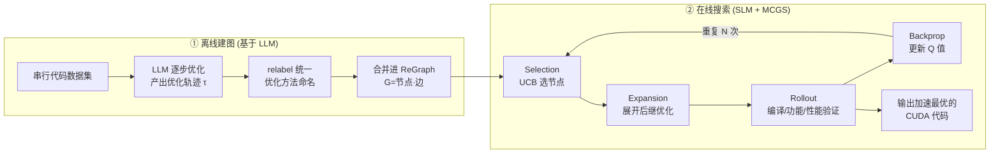

# From Large to Small: Transferring CUDA Optimization Expertise via Reasoning Graph

**会议**: ICLR 2026  
**OpenReview**: [https://openreview.net/forum?id=vqESUhcSOG](https://openreview.net/forum?id=vqESUhcSOG)  
**代码**: [https://github.com/blacknickwield/ReGraphT](https://github.com/blacknickwield/ReGraphT)  
**领域**: 代码智能 / CUDA 代码生成 / 检索增强推理  
**关键词**: CUDA 优化, 小语言模型, 推理图, 蒙特卡洛图搜索, 检索增强生成, 隐私友好部署  

## 一句话总结
ReGraphT 把大模型积累的 CUDA 优化轨迹组织成一张可复用的「推理图」，再用蒙特卡洛图搜索（MCGS）在图上引导小模型逐步选择优化手段，从而在不训练、不上云的前提下让 7B 级小模型逼近 671B 大模型的 CUDA 代码生成性能，平均加速 2.33×。

## 研究背景与动机
**领域现状**：用 LLM 把串行代码自动翻译/优化成高性能 CUDA 代码是近来的热门方向，已有 HPC-Coder 等通过监督微调专门强化 LLM 的并行代码生成能力，也有 EVOR、Repoformer 等用检索增强生成（RAG）注入外部代码知识。

**现有痛点**：把 DeepSeek 这类大模型本地部署算力开销极高；走云端 API 又有代码泄露和隐私风险。这促使大家转向轻量、可本地部署的小语言模型（SLM）。但作者实测发现——在 ParEval 上对 671B 的 DeepSeek-R1 和 7B/14B 代码 SLM 同时做 CoT 提示，SLM 在简单任务上能追平大模型，但在复杂任务上推理步数明显更少、生成代码质量更差。

**核心矛盾**：SLM 有部署优势却缺乏深层多步推理能力；现有两条增强路线都不对症——监督微调对提升多步推理收效有限且泛化差，RAG 只补充上下文知识、并不真正提升推理能力。而 CUDA 优化恰恰需要把并行化、内存合并、共享内存、循环展开、warp 分歧消除、快速数学等多种手段**组合式多步施加**，正是最吃推理的场景。

**本文目标**：在「免训练 + 本地部署 + 隐私友好」的约束下，把大模型的 CUDA 优化推理能力迁移给小模型。

**核心 idea**：**不蒸馏权重、而是蒸馏「推理结构」**——把大模型产出的逐步优化轨迹聚合成一张 CUDA 推理图（节点=优化技术、边=技术间的转移），把 CUDA 优化建模为图上的状态转移，再用蒙特卡洛图搜索为小模型挑选下一步该用什么优化，让小模型「照着图走」就能获得多步推理能力。

## 方法详解

### 整体框架
ReGraphT 分两个阶段：（1）**离线建图**——用大模型对串行代码数据集逐步做 CUDA 优化，收集优化轨迹并合并成一张统一的有向图 ReGraph；（2）**在线搜索**——把小模型的 CUDA 优化建模为在 ReGraph 上的状态转移，用 MCGS 反复 rollout、用编译+功能+性能三重验证打分，搜出一条高加速比的优化路径并产出最终代码。整个过程不更新任何模型参数。

### 关键设计

**1. CUDA 推理图 ReGraph：把零散优化轨迹结构化成可复用知识库**。作者先用 CoT 提示大模型对一段串行代码逐步优化，每一步都要求其给出「所用优化方法 + 优化后代码 + 推理过程」，形成一条优化轨迹 $\tau$。形式上 ReGraph 定义为有向图 $G=(V,E)$，其中节点 $v\in V$ 是一种 CUDA 优化技术（如并行化、内存合并、共享内存、warp 分歧消除、快速数学等），边 $u\in E$ 表示两种优化方法之间的可行转移；图允许存在环（同一类优化可反复出现）。建图从只含初始状态 $v_{init}$ 的空图开始，把每条新轨迹当作一次「状态转移序列」沿初始节点逐步合并：若某步的优化方法已在图中且对应转移边已存在，就把该优化样例追加到这条边上，否则新建边/节点（见 Algorithm 1）。关键的工程细节是 **relabel**——由于大模型措辞随机，同一种优化在不同步可能被叫不同名字，作者让大模型对照已记录的方法清单统一命名，保证同一优化方法在图中只对应一个节点，避免图被「同义异名」撑爆。这样大模型的多步推理经验就被沉淀成一份可被小模型反复检索复用的结构化资产。

**2. 把 CUDA 优化建模为图上状态转移，并用 MCGS 取代指数级枚举**。有了 ReGraph 后，生成代码就是在图上选一条优化路径。最直接的策略是枚举所有可行组合，但即便剪掉不适用的分支，复杂度仍高达 $O(n^k)$（$n$ 为节点数、$k$ 为每节点平均后继数），不可行。作者因此提出**蒙特卡洛图搜索 MCGS**——把 MCTS 搬到固定的图结构上并做三处适配：① **Selection** 用 UCB 在已展开子图上选节点 $\text{P-UCB}(s)=Q(s)+\sqrt{\tfrac{2\ln N(s')}{N(s)}}$，平衡已知收益与探索；② **Expansion** 因为动作空间被 ReGraph 固定为当前状态的后继节点，首次访问某节点时一次性展开其全部后继；③ 关键是处理图中的**环**——标准 MCTS 在树上不会循环，而 ReGraph 有环会导致 rollout 不终止。

**3. 带访问惩罚的 rollout 与分级奖励：兼顾终止性与「编译正确优先、加速比其次」**。针对环带来的不终止问题，rollout 阶段把动作选择改成带正则项的策略 $\pi(a|s)=\arg\max_a[Q(s,a)-\lambda N(s,a)]$（概率 $1-\epsilon$）或随机动作（概率 $\epsilon$），用当前访问计数 $N(s,a)$ 惩罚重复访问，比标准 $\epsilon$-greedy 更好地平衡探索利用，并设置最大步数上限、任一节点优化失败即终止。每一步 rollout 都对优化后代码做**编译验证→功能验证→性能基准测试**，给出分级奖励：

$$
\text{reward}=\begin{cases}-1, & 0\le v_{test}<1\\ \text{speedup}-1, & v_{test}=1,\ \text{speedup}<1\\ \text{speedup}, & v_{test}=1,\ \text{speedup}\ge 1\end{cases}
$$

即：功能测试没全过直接判 $-1$；全过但比串行还慢则给 $\text{speedup}-1$ 的负向信号；全过且加速则直接以加速比为奖励。每个节点都可作为终止态产出最终代码，rollout 的最终奖励取轨迹上观测到的最大奖励，再沿选择路径反向传播更新各节点 Q 值，迭代 N 次后输出加速比最优的代码。这套设计让搜索始终朝「先保证正确、再最大化加速」的方向走。

**4. CUDAEval 基准：按推理复杂度分级，让评测对得上真实难度**。已有基准要么只测功能正确（HumanEval/MBPP），要么 CUDA 实例太少（ParEval 仅 60 题）且不区分难度。作者从 Stack v2 的 21.7K 真实 CUDA 文件中采样 10K，经规则过滤、大模型抽取 kernel、补全依赖、生成对应 CPU 串行代码与 driver，并用编译执行+输出一致性校验，得到 3,126 对高质量 `<C++, CUDA>` 样本。再用 DeepSeek-R1 推出优化轨迹，**按轨迹长度分难度**：1–2 步为 easy、3–5 步为 medium、更长为 hard，得到 1,783/791/552 三档。最终评测集刻意多放难题，含 106 easy + 105 medium + 102 hard 共 313 题，其余用于建 ReGraph。这套「以推理复杂度定义难度」的分级，让基准能细粒度暴露 SLM 在多步推理上的短板。

## 实验关键数据

环境：单卡 A100-80GB + Xeon 8358P，vLLM BF16 推理。指标用 pass@k（正确性）与 speedup@k（相对串行代码的加速比）。

### 主实验（CUDAEval / ParEval，节选）

| 模型 | 方法 | CUDAEval pass@1 | CUDAEval speedup@1 | ParEval pass@1 | ParEval speedup@1 |
|------|------|----------------|--------------------|----------------|-------------------|
| DeepSeek-Coder-V2-Lite | RAG | 68.1 | 7.86 | 48.3 | 5.35 |
| DeepSeek-Coder-V2-Lite | MCTS-RAG | 71.6 | 8.09 | 51.7 | 5.78 |
| DeepSeek-Coder-V2-Lite | **ReGraphT-MCGS** | **75.1** | **14.46** | **55.0** | **10.78** |
| Qwen2.5-Coder-7B | RAG | 66.5 | 7.09 | 45.0 | 5.17 |
| Qwen2.5-Coder-7B | **ReGraphT-MCGS** | **72.2** | **14.31** | 50.0 | **10.02** |
| HPC-Coder-V2 | RAG | 64.8 | 6.44 | 38.3 | 4.51 |
| HPC-Coder-V2 | **ReGraphT-MCGS** | **72.5** | **14.39** | **53.3** | **10.61** |
| DeepSeek-R1 (671B) | CoT | 82.1 | 19.14 | 63.3 | 12.09 |

三个代码 SLM 上 ReGraphT-MCGS 平均 pass@k 达 73.3%，相比 Standard/CoT/RAG 在 pass@1 上分别 +11.0%/+9.0%/+6.8%；speedup@1 至少 ×1.84 优于各基线，把 SLM 的加速比从 6–8× 拉到 14× 量级，显著缩小与 671B 大模型（19×）的差距。

### 消融 / 难度分级（CUDAEval 三档）

| 模型 | 方法 | easy pass | medium pass | hard pass | easy spd | medium spd | hard spd |
|------|------|-----------|-------------|-----------|----------|------------|----------|
| DSCoder-V2-Lite | RAG | 91.5 | 73.3 | 47.1 | 10.13 | 6.98 | 4.82 |
| DSCoder-V2-Lite | ReGraphT | 90.6 | 76.2 | 52.0 | 15.86 | 12.38 | 8.84 |
| DSCoder-V2-Lite | **ReGraphT-MCGS** | 90.6 | **79.0** | **54.9** | **17.82** | **13.79** | **9.69** |

- **MCGS vs 纯 ReGraph**：同样 200 搜索预算下，MCGS 比朴素枚举式 ReGraphT 在 CUDAEval 上平均再 +2.2% pass@n、+1.33 speedup@n，说明图搜索的探索效率更高。
- **难度依赖性**：在 easy 档 ReGraph 相比 RAG/CoT 几乎无优势、偶尔还略低；优势随难度上升而显现，medium/hard 档加速比领先明显——印证它补的正是「多步推理」这块短板。

### 关键发现
- SLM 用 CoT 时推理轨迹长度几乎不随难度变化（推理能力天花板低），而 ReGraphT 在 easy 与 hard 间平均轨迹长度差可达 4.8 步，证明推理图确实把多步推理能力「外挂」给了小模型。
- 生成性能与推理链长度在各难度档上正相关，但存在与难度正相关的阈值，超过阈值后收益趋于饱和。

## 亮点与洞察
- **迁移「推理结构」而非「模型权重」**：把大模型的多步优化经验沉淀成可检索的图，绕开了蒸馏对数据配方的敏感和微调对泛化的损害，全程免训练。
- **图比序列/树更契合 CUDA 优化**：CUDA 优化手段会反复组合、相互依赖，天然带环，用允许环的有向图建模比 CoT 链或 MCTS 树更贴合问题结构。
- **奖励直接挂钩可验证信号**：编译+功能+加速比的分级奖励把「正确优先、性能其次」写进搜索目标，避免生成看似优化实则跑错或更慢的代码。
- **配套基准补位**：CUDAEval 以推理复杂度分级，正好把 SLM 的真实短板暴露出来，比只测功能正确的基准更有区分度。

## 局限与展望
- ReGraph 由大模型轨迹离线构建，图的覆盖面和质量受限于建图所用大模型与代码数据集，新颖优化手段可能缺席。
- 每步 rollout 都要真实编译+运行+benchmark，搜索预算（实验为 200）带来不小的在线开销，论文未充分讨论端到端时延成本。
- 优化方法节点集偏经典 GPU 优化范式，面对算子融合、tensor core 利用等更前沿手段的可扩展性待验证。
- 作者展望把该框架推广到更多需要复杂/长推理的代码生成场景。

## 相关工作与启发
- **微调路线**：HPC-Coder V1/V2 用高质量并行代码数据微调、RLPF 用 RL 对齐性能目标，但对多步推理提升有限、泛化弱——本文的对照与动机来源。
- **RAG 路线**：EVOR、Repoformer 在通用代码生成上有效，但只补上下文不补推理；本文进一步把检索从「相似样例」升级为「图上路径搜索」。
- **搜索增强推理**：RethinkMCTS、MCTS-RAG 把树搜索引入代码生成，本文则针对带环的优化图改造为图搜索（MCGS），是把 MCTS 思想迁到图结构的一次具体实践，对其它「动作可组合、可循环」的程序合成任务有借鉴意义。

## 评分
- 新颖性: ⭐⭐⭐⭐ 「推理图 + 图搜索迁移推理能力」的组合在 CUDA 优化场景上新颖，把 MCTS 适配到带环图并设计分级奖励是有价值的工程创新。
- 实验充分度: ⭐⭐⭐⭐ 覆盖多个 SLM/LLM、两个基准、难度分级与搜索策略消融，对照基线（含 MCTS-RAG/RethinkMCTS）较完整；端到端开销分析略欠。
- 写作质量: ⭐⭐⭐⭐ 动机—方法—基准—实验逻辑顺，算法与奖励公式清晰，图示到位。
- 价值: ⭐⭐⭐⭐ 在隐私友好+本地部署的现实约束下让小模型逼近大模型 CUDA 生成性能，并贡献了分级基准 CUDAEval，对 HPC 代码生成落地有实际意义。

<!-- RELATED:START -->

## 相关论文

- [\[ICLR 2026\] Evolving Graph Structured Programs for Circuit Generation with Large Language Models](evolving_graph_structured_programs_for_circuit_generation_with_large_language_mo.md)
- [\[ICLR 2026\] A Problem-Oriented Perspective and Anchor Verification for Code Optimization](a_problem-oriented_perspective_and_anchor_verification_for_code_optimization.md)
- [\[ACL 2025\] GALLa: Graph Aligned Large Language Models for Improved Source Code Understanding](../../ACL2025/code_intelligence/galla_graph_aligned_large_language_models.md)
- [\[ICLR 2026\] ReasoningBank: Scaling Agent Self-Evolving with Reasoning Memory](reasoningbank_scaling_agent_self-evolving_with_reasoning_memory.md)
- [\[AAAI 2026\] SPAN: Benchmarking and Improving Cross-Calendar Temporal Reasoning of Large Language Models](../../AAAI2026/code_intelligence/span_benchmarking_and_improving_cross-calendar_temporal_reasoning_of_large_langu.md)

<!-- RELATED:END -->
