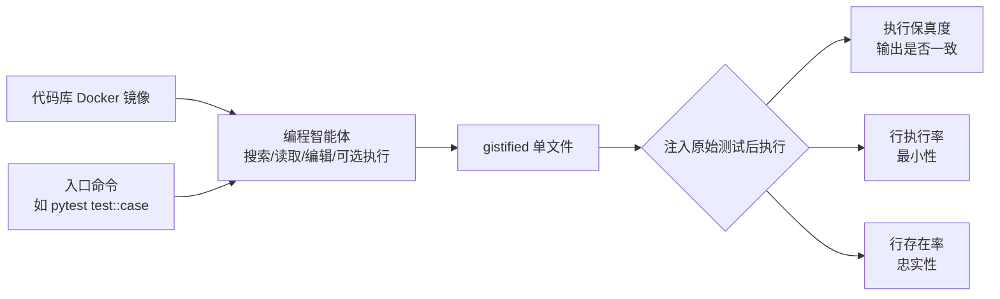

# Gistify: Codebase-Level Understanding via Runtime Execution

**会议**: ICLR 2026  
**OpenReview**: [https://openreview.net/forum?id=nmdDgo4OXC](https://openreview.net/forum?id=nmdDgo4OXC)  
**代码**: [https://github.com/microsoft/gistify](https://github.com/microsoft/gistify)  
**领域**: 代码智能 / 编程智能体评测  
**关键词**: 代码库级理解, 运行时执行, 编程智能体, 自动化评测, 最小可复现文件  

## 一句话总结
提出 GISTIFY 任务——让编程智能体把整个代码库中某条命令的功能压缩成一个**单文件、自包含、最小化、忠实复现运行时行为**的"精华文件"，从而真正考验模型对代码库结构与执行流的理解，并发现当前 SOTA 模型在长执行轨迹上普遍翻车。

## 研究背景与动机
**领域现状**：LLM 越来越多地被部署到大型真实代码库中做调试、智能体式代码生成，要求模型能跨文件、跨模块地推理整个执行流程，而不只是处理孤立片段。

**现有痛点**：主流仓库级基准（SWE-bench、RepoBench）被证明并不真正要求对整条执行轨迹做推理——很多任务可以靠启发式捷径或局部 patch 检索蒙混过关；而且它们依赖 GitHub issue / PR 构造数据，无法泛化到任意（尤其是私有）仓库。

**核心矛盾**：智能体在真实大代码库里的部署需求在涨，但"自动化构造、广泛适用、真正考验整库理解"的评测却严重滞后。

**本文目标**：设计一个轻量、可对**任意有测试套件的仓库**自动构造、且必须沿执行路径推理才能解的挑战性任务。

**核心 idea**：**【运行时复现即理解】** 模仿开发者理解陌生仓库的方式——不是孤立读文件，而是从一个具体入口（如 `pytest` 命令）出发，沿运行时行为追依赖、跟控制流。GISTIFY 把这一实践形式化为：给定代码库 + 入口命令，要求生成一个能独立运行、且输出与原库完全一致的最小自包含文件。

## 方法详解

### 整体框架
GISTIFY 不是一个模型，而是一个**任务 + 评测协议 + 三维度量**。输入是一个装有目标代码库的 Docker 镜像和一个入口命令（如某个测试），智能体在 50 步预算内、128K 上下文约束下，通过搜索/读文件/编辑等工具生成一个 gistified 文件；评测时把原始测试函数注入该文件后执行，程序化比对输出是否一致，杜绝"改测试作弊"。

### 关键设计
**1. 四要求任务定义：把"理解"拆成可验证的属性。** 一个合格的 gistified 文件必须同时满足四点：**自包含**（把所有依赖模块内联进来，能脱离原库独立跑，考验对跨文件关系的理解）；**执行保真**（运行输出与原库一致，逼模型抓动态执行而非静态模式）；**最小化**（只保留实际被执行、对任务必要的代码，剪掉无关函数对象）；**忠实保留**（所有代码必须直接来自原库，不许幻觉编造）。这四点把抽象的"代码库理解"翻译成可程序化打分的硬指标。

**2. 三维度量对齐四要求。** 执行保真度（Execution Fidelity）是二元指标，仅当文件能跑通且输出/错误轨迹与原库一致才记 1：$\mathbf{1}\big[\mathrm{runs}(c,G)\wedge \mathrm{out}(c,G)=\mathrm{out}(c,C)\big]$。行执行率（Line Execution Rate）衡量最小性，即文件里可执行行中真正被执行的比例 $\frac{1}{|L_{\mathrm{exec}}(G)|}\sum_{\ell}\mathbf{1}[\ell\text{ 被执行}]$，越接近 100% 说明越精炼；它只对能跑通的文件计算。行存在率（Line Existence Rate）衡量忠实度，把代码按类/函数/顶层块分组、逐块匹配（并对缩进、多行语句、import 做归一化以避免误匹配），统计有多少行确实来自原库，100% 即零幻觉。

**3. 评测协议防作弊。** 由于生成的文件可能偷偷改测试来骗过比对，协议规定：模型生成 gistified 文件后，**用原库中的原始测试代码替换文件里的测试部分再执行**。这样保证评测衡量的是"功能是否被正确复现"，而非模型重写测试的花招。也正因如此，论文进一步发现"忠实复现测试函数"本身是成功的强先导信号（见实验）。

**4. 难度可控的 GISTIFY-hard 子集。** 任务难度可由执行轨迹复杂度刻画：轨迹长度（执行的函数调用数）与触及的唯一文件数。按这两个轴各取最难的 30 例，得到 57 个 GISTIFY-hard 数据点，性能从 43% 跌到 21%，提供了一条"自动设计更难评测"的可扩展路径。

## 实验关键数据
设置：3 个智能体框架（mini-SWE-agent、SWE-agent、Copilot）× 4 个模型（GPT-5-mini、GPT-5、Claude-3.7-Sonnet、Claude-Sonnet-4），128K 上下文、50 步上限；数据为 5 个 SWE-Bench 仓库（requests/pylint/flask/scikit-learn/seaborn）+ 1 个新仓库 debug-gym，各 25 个测试。

### 主实验表格
执行保真度（无执行工具 / 有执行工具），行存在率与行执行率为两设置均值：

| 框架 | 模型 | 执行保真(wo/w exec) | 行存在率 | 行执行率 |
|------|------|------|------|------|
| mini-SWE-agent | GPT-5-mini | 17.1 / 24.0 | 44.9 | 61.2 |
| mini-SWE-agent | GPT-5 | 51.0 / 54.0 | 56.8 | 83.1 |
| mini-SWE-agent | Claude-4 | 54.0 / 55.3 | 67.0 | 75.7 |
| SWE-agent | Claude-4 | 56.7 / 57.3 | 66.3 | 72.9 |
| Copilot | GPT-5 | 58.7 / 60.7 | 66.9 | 81.4 |
| Copilot | Claude-4 | 58.7 / 61.3 | 69.6 | 80.3 |

最佳模型 Claude-4 在所有框架下也仅约 54–61% 求解率；GPT-5 输出最精炼（行执行率最高）。

### 消融实验表格
SWE-Agent + Claude-4，pylint 50 个测试，分析不同策略/工具：

| 类别 | 设置 | 执行保真 | 行存在率 | 行执行率 | 触顶步数% |
|------|------|------|------|------|------|
| — | Base GISTIFY | 42.0 | 65.0 | 58.3 | 14.6 |
| 提示策略 | Tracing | 48.0 | 75.4 | 62.8 | 0.0 |
| 提示策略 | Reading | 50.0 | 77.6 | 62.6 | 3.9 |
| 全局信息工具 | RepoGraph | 52.0 | 76.1 | 60.1 | 6.0 |
| 全局信息工具 | Tracing（金标轨迹） | 56.0 | 75.1 | 65.1 | 0.0 |
| 执行工具 | Bash | 52.0 | 73.1 | 64.2 | 16.0 |
| 执行工具 | Edit-and-Execute | 56.0 | 74.3 | 64.2 | 10.0 |

### 关键发现
- **测试函数忠实度是成败先导**：Test F1 与执行保真度强相关（corr=0.76, p=0.01）；直接把正确测试体喂进 prompt 后，Test F1 从 68.4 升到 85.3，执行保真度从 42% 升到 60%。
- **执行工具不是银弹**：开/关执行工具大多只带来小幅提升，前沿模型也没涌现出"用 debugger 做运行时分析"的能力；反而**工具更少（Edit-and-Execute）比放开 Bash 表现更好**——开放 Bash 会让模型乱探索、轨迹拉长、触顶步数。
- **金标 Tracing 工具增益最大**（56%），说明全局执行轨迹信息能显著强化运行时推理。
- **错误归因因模型而异**：GPT-5 系列主要错在"缺失测试函数"（76–78%），Claude 系列主要错在 import 错误与 pytest 运行时错误；最强的 Claude-4 反而最常误用 `import requests` 这类本应内联的导入。
- **智能体 > 静态**：即便把所有相关 gold 文件一次性喂给静态 LLM，其执行保真度仍低于智能体——动态多步选文件比一次性灌入更有效；静态模型只在行存在率上最高（因可直接复制输入）。
- **高覆盖测试更难**：轨迹越长、触及文件越多，求解率单调下降，GISTIFY-hard 子集仅 21%。

## 亮点与洞察
- **用"运行时复现"作为理解的可验证代理**：把模糊的"代码库理解"落地成"能不能复现这条命令的运行时行为"，比 QA 式或局部 patch 式基准更难被捷径绕过。
- **自动化、可泛化、零 issue 依赖**：只需仓库 + 测试套件即可对任意（含私有）仓库自动造题，摆脱对 GitHub issue/PR 的依赖。
- **产物本身有用**：gistified 文件把大系统某功能压成紧凑可执行单文件，可服务于下游调试、错误定位、最小实现分享——评测产物即工具。
- **诊断性强**：三维度量 + 错误分类 + 难度轴让人能精确看出"模型卡在哪一步"，而非只给一个总分。

## 局限与展望
- **依赖现有测试套件**：当前入口主要是 pytest 测试，尚未覆盖任意入口；扩展到任意 entrypoint 需处理非确定性执行问题。
- **评测规模**：主实验每库 25 测试、5–6 个仓库，覆盖面有限（虽附录有更大集佐证一致性）。
- **只比对 stdout/stderr 与测试通过性**：对有副作用、随机性或外部 IO 的功能复现尚未深入。
- **未给训练方案**：论文聚焦评测与分析，如何用 GISTIFY 信号训练出更强的运行时推理模型留待后续。

## 相关工作与启发
- **代码库级理解基准**：QA 类（CodeQA 系列）、跨文件代码合成（RepoBench、CrossCodeEval）、自然语言→整库映射等，GISTIFY 的差异在于强制沿完整执行轨迹推理。
- **运行时执行推理**：CRUXEval 等预测执行轨迹/中间状态的工作；GISTIFY 更进一步要求模型不仅追踪执行、还要把代码压缩重组成连贯文件。
- **全局上下文工具**：RepoGraph 等把代码库建成图供检索，本文证实其与金标 tracing 能显著助力。
- **启发**：对编程智能体而言，"能否复现运行时行为"或许是比"能否改对一个 patch"更本质的理解度量；同时"工具越多未必越好"提醒智能体设计要克制工具暴露面。

## 评分
- **新颖性**: ⭐⭐⭐⭐⭐ — "把功能压成最小可复现单文件"作为代码库理解度量是全新且优雅的设定，绕开了既有基准的捷径漏洞。
- **实验充分度**: ⭐⭐⭐⭐ — 3 框架×4 模型×6 仓库的矩阵 + 详尽错误归因 + 策略/工具消融 + 难度轴分析，覆盖较全；规模偏小、入口仅限测试是短板。
- **写作质量**: ⭐⭐⭐⭐ — 任务动机、四要求、三度量、防作弊协议层层递进，公式与表格清晰，结论可操作。
- **价值**: ⭐⭐⭐⭐⭐ — 提供可对任意仓库自动构造的硬基准，且产物本身可用于下游调试/分享，对评测与工程双向有用。

<!-- RELATED:START -->

## 相关论文

- [\[ACL 2026\] Can LLMs Compress (and Decompress)? Evaluating Code Understanding and Execution via Invertibility](../../ACL2026/code_intelligence/can_llms_compress_and_decompress_evaluating_code_understanding_and_execution_via.md)
- [\[ICLR 2026\] WebGen-Agent: Enhancing Interactive Website Generation with Multi-Level Feedback and Step-Level Reinforcement Learning](webgen-agent_enhancing_interactive_website_generation_with_multi-level_feedback_.md)
- [\[ICLR 2026\] SWE-RM: Execution-Free Feedback for Software Engineering Agents](swe-rm_execution-free_feedback_for_software_engineering_agents.md)
- [\[ICLR 2026\] Process-Level Trajectory Evaluation for Environment Configuration in Software Engineering Agents](process-level_trajectory_evaluation_for_environment_configuration_in_software_en.md)
- [\[ICML 2026\] Bridging Functional Correctness and Runtime Efficiency Gaps in LLM-Based Code Translation](../../ICML2026/code_intelligence/bridging_functional_correctness_and_runtime_efficiency_gaps_in_llm-based_code_tr.md)

<!-- RELATED:END -->
