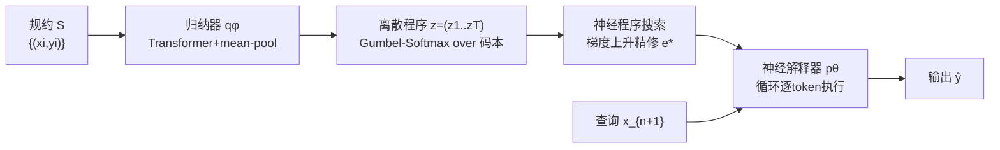

# Gradient-Based Program Synthesis with Neurally Interpreted Languages

**会议**: ICLR 2026  
**OpenReview**: [https://openreview.net/forum?id=NAORIWBaoO](https://openreview.net/forum?id=NAORIWBaoO)  
**代码**: 待确认  
**领域**: 神经符号 / 程序合成 / 组合泛化  
**关键词**: 程序归纳, 神经解释器, 离散潜在空间, Gumbel-Softmax, 测试时梯度搜索, 组合泛化  

## 一句话总结
NLI 让一个编码器-解码器架构端到端地**自己发明一套离散的、类符号的编程语言**，并配一个可微分的循环神经执行器逐 token 解释程序，从而既能像符号方法那样组合泛化，又能用梯度下降在程序空间里搜索，在测试时把归纳器给出的初始程序猜测精修到能解释数据为止。

## 研究背景与动机
**领域现状**：程序归纳长期被困在符号与神经两条路线的取舍里。符号方法（DSL、归纳综合）天然具备组合泛化和数据高效性，少量样例就能学到规律；神经网络则数据驱动、可扩展，但知识全纠缠在权重里，难以在分布外重用。

**现有痛点**：符号路线依赖人手设计领域专用语言（DSL），构建成本高、跨域不可迁移，且搜索空间组合爆炸；神经路线则是单体模型，在组合泛化和分布外（OOD）场景下表现糟糕，即便泛化只需要重组已学过的概念也做不到。已有的潜在程序网络（LPN）虽然能在连续潜在空间做快速测试时适应、抗过拟合，但**组合泛化能力有限**，因为它用一个固定维度的连续嵌入表示整个程序，计算步数被锁死。

**核心矛盾**：如何让模型既保留离散符号语言的可组合、可重用结构，又能享受神经网络端到端可微、梯度可搜索的便利——也就是把"组合性"和"梯度搜索"这两个原本互斥的优点合到一个模型里。

**本文目标**：不再人手写 DSL、也不再学外部的搜索引导函数，而是让模型**直接从输入-输出样例端到端学出自己的领域专用神经语言 + 配套解释器**，并把搜索引导内嵌进这套语言本身。

**核心 idea**：**[离散潜在 + 可微执行]** 把程序表示成一串离散 token 的变长序列（而非单个连续向量），用 Gumbel-Softmax 让离散采样可微，再用一个逐 token 推进的循环神经执行器解释程序——这样既能表达任意长度的程序（步数随 token 长度增长，可解决比训练时更复杂的问题），又能在测试时对 token 的连续松弛做梯度上升搜索。

## 方法详解

### 整体框架
NLI（Neural Language Interpreter）是一个 Latent Adaptation Network：编码器 $q_\phi$ 作为**程序归纳器**，把规约（一组输入-输出样例）映射成一串离散 token 程序 $z=(z_1,\dots,z_T)$；解码器 $p_\theta$ 作为**神经解释器**，逐 token 把查询输入执行成输出。两者全程可微，端到端训练；测试时归纳器先给一个初始程序猜测，再用梯度搜索在 token 的连续松弛空间里精修，直到找到最能解释规约的神经程序。

### 关键设计

**1. 离散 token 程序归纳器：让规约变成一串可重组的"指令"。** 归纳器先用一个 Transformer $h_\phi$ 独立处理每个样例对 $(x_i,y_i)$，得到 $T$ 个 token 嵌入，再对所有样例对在每个 token 位置上做均值池化 $\bar e_t=\frac{1}{|S|}\sum_i e_t^{(i)}$——这一步对样例顺序置换不变（借鉴 Neural Processes），还能让模型适应测试时不同的规约规模。随后每个 $\bar e_t$ 经共享前馈网络 $f_\phi$ 投影成码本上的 logits，并用 Gumbel-Softmax 松弛 $z_t=\mathrm{Softmax}((l_t+g_t)/\tau_e)$ 得到可微的离散近似。码本里有一个专门的 **skip token**，让解释器执行 no-op，从而能表示比固定序列长度 $T$ 更短的程序。训练时把温度 $\tau_e$ 逐步退火到接近零，逼近真离散采样、逼模型用稀疏的码本激活。

**2. 循环神经解释器：逐 token 执行换来变长与组合泛化。** 标准解码器容易过拟合训练时见过的程序长度与结构，NLI 的解释器 $p_\theta$ 改用**递归**：它把查询 $x$ 先嵌成初始隐状态 $s_0$、输出分布初始化为 $x$ 的 one-hot，然后在 $T$ 步里逐位置消费程序 token，用一个共享执行网络 $d$ 反复更新中间状态。第 $t$ 步执行网络从上一步状态 $s_{t-1}$ 和嵌入的潜 token $E_v^\top z_t$ 产出 logits $n_t$，经 Gumbel-Softmax 得候选分布 $\tilde\pi_t$，再用 **skip 门控**更新：$\pi_t=z_{t,\text{skip}}\cdot\pi_{t-1}+(1-z_{t,\text{skip}})\cdot\tilde\pi_t$——skip token 的概率质量决定这一步是"跳过"还是真执行。因为执行器一次只吃一个 token，NLI 的程序步数不被锁死，能把学到的 token 以不同方式、不同长度重组，天然支持变长程序和新组合。

**3. 鼓励重用的编码器正则：逼出紧凑的原语词表。** 重构损失 $L_{\text{recon}}=-\log p_\theta(y\mid x,q_\phi(S))$ 用 leave-one-out 方式（拿 $m-1$ 对归纳、在留出那对上算预测误差）保证潜程序能真正泛化执行而非死记样例对。在此之上加一个编码器正则 $L_{\text{reg}}$，它是"批次内被用到的 unique token 数"的可微近似：对每个 token $k$，$1-\exp(\sum\log(1-q^{(k,j)}_\phi))$ 近似它在批次里至少被用一次的概率，对所有 $k$ 求和即期望 unique token 数。惩罚用太多不同词表项，就逼模型用一小撮已发现的原语重组出新程序，而不是给每个新任务发明一个新 token——这正是组合性的来源。

**4. 测试时神经程序搜索：在 token 松弛空间做带梯度的局部搜索。** 编码器给的快速首猜未必最优（尤其 OOD 程序），于是 NLI 在 token 的**连续松弛空间**（而非离散程序空间）做梯度上升，找使规约似然最大的连续嵌入 $e^*=\arg\max_e \mathbb{E}_{g,h}[\sum_{(x_j,y_j)}\log p_\theta(y_j\mid x_j, z(e,\tau_e,g),\tau_d,h)]$。因为执行全程可微，这等价于在符号空间做局部搜索但带梯度信号。两个温度 $\tau_e,\tau_d$ 在搜索中一起退火：先高温平滑目标、广泛探索，再降温逼出锐利离散的程序；末了用最终软表示直接解码，避免硬采样带来优化-执行的不一致。为避免陷局部极小，从归纳器首猜附近采 $s$ 个高斯起点（$\mu=e_t,\sigma=\sigma_s$）并行跑 $L$ 步梯度上升——既利于探索又高度可并行（可跨多卡）。由于搜索空间被限制在重组一组离散嵌入上，比连续潜在搜索更不易过拟合到不泛化的程序。

## 实验关键数据

### 主实验表格（自建组合泛化套件，ID/OOD 最终准确率）

| Method | Shift-L ID | Shift-L OOD | Shift-P ID | Shift-P OOD | Comp-I ID | Comp-I OOD |
|---|---|---|---|---|---|---|
| In-Context | 1.00 | 0.00 | 1.00 | 0.00 | 1.00 | 0.13 |
| TTT | 1.00 | 0.00 | 1.00 | 0.00 | 0.95 | 0.14 |
| LPN | 1.00 | 0.00 | 1.00 | 0.00 | 1.00 | 0.18 |
| LPN Gradient Search | 1.00 | 0.03 | 1.00 | 0.00 | 1.00 | 0.29 |
| D-LPN | 1.00 | 0.02 | 1.00 | 0.00 | 0.99 | 0.15 |
| D-LPN Gradient Search | 1.00 | 0.01 | 1.00 | 0.00 | 0.99 | 0.20 |
| NLI | 1.00 | 0.00 | 1.00 | 0.00 | 1.00 | 0.17 |
| NLI Prior Search | 1.00 | 0.10 | 1.00 | 0.00 | 1.00 | 0.23 |
| **NLI Gradient Search** | 1.00 | **0.99** | 1.00 | **1.00** | 1.00 | **0.91** |

三个 split 分别测：Shift-L（长度外推，训练 shift 1–5、测 6–10）、Shift-P（原语抽取，训大 shift、测小 shift）、Comp-I（组合隔离，训单原语、测 $f(g(x))$ 组合）。所有模型 ID 都近完美；OOD 上所有 baseline 和 NLI 的非搜索变体几乎全崩，唯有 **NLI + 梯度搜索**在长度外推 99%、原语抽取 100%、新组合 91%。学到的码本显示系统性重用：单步左移恒用 token 231、两步移用 476，8 步移（OOD）由这两块拼出（四个 231 + 两个 476），说明泛化来自重组而非记忆。

### 消融实验（去掉单个组件后的 OOD 准确率，base=97%）

| 去掉的组件 | OOD 准确率 |
|---|---|
| no discrete program | 1% |
| no recurrent execution | 2% |
| no discrete layer | 5% |
| no interpreter gumbel | 5% |
| no skip token | 24% |
| no encoder loss | 66% |
| no inductor gumbel | 76% |
| **Base** | **97%** |

去掉循环执行、归纳器或解释器的离散性，OOD 直接塌到 1–5%——这三者都是组合泛化的命门；去掉 skip token 降到 24%（模型能自学 skip 但专用 token 训练更快更稳）；解释器级 Gumbel 是最大性能驱动（去掉降到 5%），归纳器级 Gumbel 去掉则从 97% 降到 76%；编码器正则只对 Shift-P 这类"需要把原语解出来再组更短程序"的组合有用，对纯长度外推无影响。

### 关键发现
- **测试时计算量正相关**：在 Comp-I 上同时扩展梯度步数（1→400）与并行起点数（1→4096），准确率随两轴单调上升——梯度搜索把测试时算力直接换成泛化。
- **DeepCoder 上对标神经符号方法**：在 1160 万归纳任务上训练，NLI/LPN 仅用输入-输出对、无任何 ground-truth 程序监督，却能与用了程序标注的 ExeDec 竞争，并大幅超过 Latent Programmer 和 Transformer 程序合成。
- **NLI 与 LPN 互补**：NLI 更擅长长度泛化和新概念组合（得益于可变长程序），LPN 更擅长切换概念顺序和扩展新操作——两者学到的潜在结构带不同归纳偏置。
- **Gumbel-Softmax 非必需但更稳**：原则上任何离散采样的平滑松弛（如 VQ-VAE + 直通估计）都可替代，作者选 Gumbel-Softmax 主要图它训练稳定，避开 VQ 的码本坍缩与梯度有偏；代价是需要小心的温度退火，退火太快会严重掉点。

## 亮点与洞察
- **把"语言"本身当成可学习对象**：不再外挂搜索引导函数，而是让模型把引导内嵌进它自学的离散语言里，搜索因此变成对一组可重组原语的梯度局部搜索——这是对"DSL 必须人手设计"这一前提的釜底抽薪。
- **离散 + 可微的统一**：用 Gumbel-Softmax 把"我要离散符号的组合性"和"我要梯度搜索的端到端"两个诉求在同一损失里调和，而且训练用的可微执行器和测试时搜索用的是同一套机制，避免了训练-推理不一致。
- **变长执行是组合泛化的物理基础**：把程序步数从"固定"解放成"随 token 长度增长"，才让模型有能力表达比训练更长更复杂的程序，这也是它能 99% 长度外推、而 LPN 单体嵌入只能 0–3% 的根因。
- **可解释的副产物**：学到的码本是人可读的（231=单步移、476=双步移），让"泛化来自重组而非记忆"这一论断有了直接证据。

## 局限与展望
- **测试时成本高**：梯度搜索 + 多起点并行虽可并行扩展，但相比单次前向的 baseline 推理成本显著更大；为公平作者还做了等算力 baseline 但那会让 baseline ID 退化。
- **基准偏合成/受限**：自建套件是固定长度 20 的序列任务，DeepCoder 也是受限 DSL 的列表操作，离真实世界程序合成（带控制流、递归、副作用）还有距离。
- **数据规模受限**：DeepCoder 原始组合训练集未公开，作者从头生成 1160 万任务（少于原文 6000 万），采样函数代价过高限制了规模上限。
- **Gumbel-Softmax 的温度敏感**：退火调度需要小心，退火太快会严重掉点，稳定性依赖经验性的调度。
- **展望**：把这套"自学语言 + 可微执行 + 梯度搜索"推广到带更丰富控制结构的语言、更大规模真实代码，以及与 LPN 互补的归纳偏置如何融合，都是自然的下一步。

## 相关工作与启发
- **符号程序合成**：Summers、Gulwani 等经典归纳综合与 DSL 方法提供组合泛化与数据高效性，但受限于人手设计 DSL 与组合搜索——NLI 正是要去掉"人手 DSL"这块。
- **Latent Adaptation Networks / LPN**（Macfarlane & Bonnet, 2025）：NLI 同属 LAN 家族，但把 LPN 的单体连续潜在嵌入换成变长离散 token 序列，针对性补上 LPN 的组合泛化短板。
- **离散表示学习**：Gumbel-Softmax（Jang/Maddison 2017）与 VQ-VAE（van den Oord 2017）是让离散采样可微的两条路，本文选前者图稳定性。
- **神经执行器 / 世界模型**：解释器逐 token 解释程序的设计借鉴了条件世界模型（Ha & Schmidhuber 2018）的神经执行思路。
- **神经符号对标方法**：ExeDec、Transformer 程序合成、Latent Programmer 是 DeepCoder 上的强 baseline，它们都用 ground-truth 程序监督，NLI 在无程序监督下与之竞争凸显了纯 PBE 路线的潜力。

## 评分
- **新颖性**: ⭐⭐⭐⭐⭐ 把"模型自学离散语言 + 可微神经执行器 + 测试时梯度程序搜索"三件事统一进一个端到端架构，从根上重构了符号-神经取舍，思路新颖且自洽。
- **实验充分度**: ⭐⭐⭐⭐ 自建套件三类组合泛化 + DeepCoder 对标神经符号方法 + 细致的逐组件消融 + 测试时算力双轴扩展，证据链完整；扣分在基准仍偏合成、数据规模受公开性所限。
- **写作质量**: ⭐⭐⭐⭐ 动机-方法-实验逻辑清晰，算法与公式交代到位，码本可视化让"重组而非记忆"很有说服力；部分符号细节略密集。
- **价值**: ⭐⭐⭐⭐ 给"无 DSL、无程序监督的可组合程序归纳"提供了一条可行且可扩展的新路径，对神经符号、组合泛化与测试时适应都有借鉴意义。

<!-- RELATED:START -->

## 相关论文

- [\[ICLR 2026\] RefineStat: Efficient Exploration for Probabilistic Program Synthesis](refinestat_efficient_exploration_for_probabilistic_program_synthesis.md)
- [\[ICLR 2026\] LLM-Guided Evolutionary Program Synthesis for Quasi-Monte Carlo Design](llm-guided_evolutionary_program_synthesis_for_quasi-monte_carlo_design.md)
- [\[ICLR 2026\] Multi-LCB: Extending LiveCodeBench to Multiple Programming Languages](multi-lcb_extending_livecodebench_to_multiple_programming_languages.md)
- [\[NeurIPS 2025\] Program Synthesis via Test-Time Transduction](../../NeurIPS2025/code_intelligence/program_synthesis_via_test-time_transduction.md)
- [\[ACL 2025\] Program Synthesis Benchmark for Visual Programming in XLogoOnline Environment](../../ACL2025/code_intelligence/program_synthesis_benchmark_for_visual_programming_in_xlogoonline_environment.md)

<!-- RELATED:END -->
