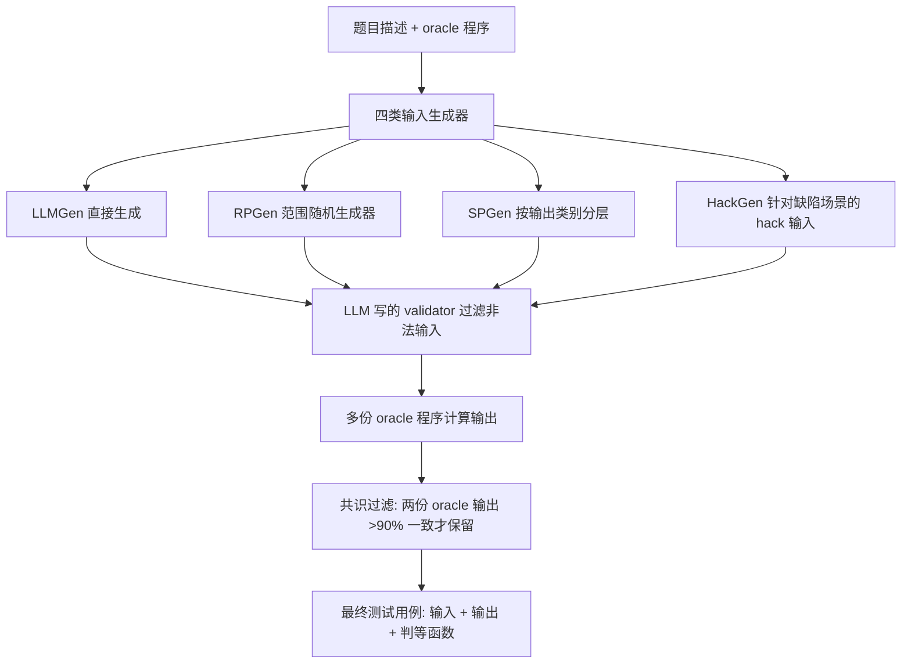

# HARDTESTGEN: A High-Quality RL Verifier Generation Pipeline for LLM Algorithmic Coding

**会议**: ICLR 2026  
**OpenReview**: [https://openreview.net/forum?id=v3SzGCfAXN](https://openreview.net/forum?id=v3SzGCfAXN)  
**代码**: [https://leililab.github.io/HardTests/](https://leililab.github.io/HardTests/)  
**领域**: code_intelligence  
**关键词**: 测试用例合成, 代码验证器, RLVR, 算法竞赛, 后训练  

## 一句话总结
针对算法竞赛代码题，提出 HARDTESTGEN 测试合成流水线——用 LLM 写"生成器程序"而非直接生成测试，配合多 oracle 共识过滤，造出一套精度高 11 个点的高质量测试用例数据集 HARDTESTS（2.66 万题），并证明验证器质量直接决定拒绝采样和 RL 后训练的效果。

## 研究背景与动机

**领域现状**：用结果验证器（outcome verifier）做 RLVR 后训练，是当下提升 LLM 推理/编程能力的主流路线（DeepSeek-R1、o3 都靠它）。在代码领域，验证器通常就是一组测试用例：候选程序通过全部测试就给奖励 1，否则 0。

**现有痛点**：测试用例质量普遍很差，而这个问题被严重低估。论文给的数字触目惊心——APPS 里 60% 通过测试的程序其实是错的，CodeContests 里 46% 通过测试的程序虽语义正确但效率太低过不了人工测试。根源在于现有方法（CodeT、TACO）让 LLM **直接生成测试输入**，而 LLM 很难一次性写出大规模、合法、又能命中边界的输入；同时人工编写的高质量测试是私有的、爬不到。

**核心矛盾**：算法题的"伪装良好的错误解"只有靠精心构造的 edge case 才能识破。论文举了个例子：求树上每个节点到根的路径和，朴素 $\Theta(nd)$ 算法在随机树上因 $E[d]=\Theta(\log n)$ 跑得挺快，但只要把测试构造成一条链（深度 $d=n$），复杂度立刻退化成 $\Theta(n^2)$ 而超时。随机测试根本造不出这种"又大又特殊"的输入。

**本文目标**：自动合成既合法、又全面（覆盖角落case与高耗时case）、还有正确输出的测试，作为代码后训练里可靠的奖励信号。

**核心 idea**：两条洞察撑起整个方法——**洞察一**：测试的合法性由"LLM 写的生成器程序"产出比"LLM 直接产出"更有保障；**洞察二**：不同生成器对被测程序持有不同假设、从不同分布造测试，所以要多种生成器并存。据此建一条统一流水线，合成四类测试输入并用多 oracle 共识算输出。

## 方法详解

### 整体框架

HARDTESTGEN 把"造测试"拆成输入合成与输出计算两段。输入侧用四种互补的生成器分别从不同分布造测试输入，再用一个 LLM 写的验证器函数把非法输入剔掉；输出侧收集多份人工 oracle 程序跑出期望输出，用共识过滤留下可靠用例。前提是题目带 oracle 解（在线竞赛题约 68% 满足），用 GPT-4o 生成全部程序与函数，平均每题 API 成本仅 0.23 美元。

### 关键设计

**1. 四类输入生成器：从生成器程序而非 LLM 本身造输入。** 这是方法的灵魂，对应"洞察一+洞察二"。**LLMGen** 让 LLM 照样例直接写 $n_L=10$ 个小规模输入，用来快速验功能正确性，也是现有方法的代表（消融里记作 HT–L）。**RPGen**（range-based）不让 LLM 写输入而是让它写一个无参 Python 函数 `gen_range_based_input`，按题目的数据类型、范围、约束（如"x-y 坐标构成凸多边形"）返回随机输入，执行 $n_R=20$ 次——把"理解约束"和"造大规模数据"解耦，正是 LLM 直接生成做不到的。**SPGen**（stratified）针对分类型输出（如 Yes/No）：先让 LLM 数出 $m_S$ 个输出类别，再为每个类别写一个只产出该类输出的生成函数，各跑 $n_S=10$ 次得 $m_S\times n_S$ 个输入，专治随机生成下"测试全是 Yes"的类别失衡；它是 RPGen 的分层特例，故两者互斥、每题只用其一。**HackGen** 最具针对性：先让 LLM 描述若干用暴力/经典算法（如 DFS）写的缺陷解，再让它想这些解会在什么场景失败或 TLE，最后为每个失败场景写一个生成函数 `gen_hacking_input_<scenario>`，各跑 $n_H=10$ 次得 $m_H\times n_H$ 个 hack 输入——这是以往方法完全没有的"显式构造 hack case"能力。

**2. 用合成程序而非 LLM 直接判断来校验输入合法性。** 四类生成器产出的输入未必合法，论文不让 LLM 直接判"这个输入对不对"，而是让它写一个 `validate_input(input_str: str) -> bool` 函数，显式检查值类型、范围、数值关系、逻辑约束，再用它把非法输入逐个滤掉。实现上还把 validator 和一份 oracle 解一起塞进四类生成器的 prompt，作者发现这样能提高 LLM 合成出合法输入与合法生成器的概率——本质是把"判断"也程序化，规避 LLM 直接判定的不可靠。

**3. 多 oracle 共识过滤算期望输出。** 有了合法输入还得有正确输出。每题收集最多 $n_{oracle}=8$ 份人工 oracle 程序（按来源可靠性排序），全部跑一遍输入；若两份 oracle 在超过 90% 的输入上输出**语义等价**（而非逐字相同），就认为这份一致性可信，把对应输入与共识输出组成最终用例。等价判断默认用字符串比较，但 25.4% 的题目（输出是集合、可有多种合法操作序列等）需要 LLM 额外生成一个特判函数 `output judging function`，接收输入与两个输出返回布尔值，且该特判函数会一直沿用到后续训练与评测中。

**4. 二分类视角度量测试质量。** 论文把"用测试判候选程序"看成二分类：通过全部测试为正、否则为负，结合在线评测/官方 verdict 给的真值，定义精度与召回——
$$\text{Precision}=\frac{TP}{TP+FP},\quad \text{Recall}=\frac{TP}{TP+FN}$$
高精度意味着"测试更硬"（更少错误程序蒙混过关），高召回意味着"测试更正确"（更少正确程序被误杀）。这个度量既是评估标准，也直接对应 RL 里奖励信号的准确性——假阳性就是错误奖励。

## 实验关键数据

### 主实验：测试质量（1253 题 AtCoder+Codeforces 合并集，对比 TACO / CodeContests）

候选程序来自三个 LLM 与人工提交，下表为平均精度/召回（%）：

| 候选来源 | 方法 | Avg Precision | Avg Recall |
|---|---|---|---|
| Qwen2.5-Coder-7B | TACO | 61.00 | 78.97 |
|  | CodeContests | 51.64 | 85.98 |
|  | **HARDTESTS** | **79.21** | 91.69 |
| Qwen2.5-Coder-14B | TACO | 70.15 | 78.89 |
|  | **HARDTESTS** | **81.54** | 95.35 |
| GPT-4o | TACO | 87.75 | 75.44 |
|  | **HARDTESTS** | **93.22** | 96.47 |
| 人工提交 | TACO | 81.47 | 80.77 |
|  | **HARDTESTS** | 79.08 | 93.03 |

精度平均 +11.22 点、召回平均 +11.03 点；难度越高优势越大——7B 模型在难度 4+ 上 TACO 精度仅 17.83，HARDTESTS 达 55.88（3 倍多）。候选程序越"不聪明"（人工→7B），精度优势越明显，因为低水平程序更容易写出正确但低效的解（LLM 错误程序里 30% 是 TLE，人工只有 14.9%），而 HARDTESTS 更大更杂的测试更能抓低效解。

### 消融实验：四类测试缺一不可

| 配置 | 7B Avg Prec | 7B Avg Recall |
|---|---|---|
| HT–L（仅 LLMGen，≈现有方法） | 42.42 | 92.28 |
| HT–L+R/S（加 RPGen 或 SPGen） | 64.67 | 92.01 |
| HARDTESTS（全部，含 HackGen） | **79.21** | 91.69 |

加上 RPGen/SPGen/HackGen 后精度提升 0.2%~40%，而召回下降始终在 1% 以内——证明各类测试都不可或缺，HackGen 的 hack case 是精度的关键来源。

### 下游：测试质量决定后训练效果（Qwen3-4B，LiveCodeBench-105）

| 拒绝采样 | pass@1 | pass@10 |
|---|---|---|
| Qwen3-4B 基线 | 38.48 | 56.19 |
| + bad 5k（错误轨迹） | 34.00 | 54.92 |
| + random 5k | 32.75 | 57.14 |
| **+ good 5k（HARDTESTS 验证）** | 36.00 | **60.00** |

| RL 训练 | pass@1 | pass@10 |
|---|---|---|
| Qwen3-4B 基线 | 38.48 | 56.19 |
| Qwen3-4B-TACO | 36.95 | 57.14 |
| **Qwen3-4B-HT** | **39.42** | **64.76** |

### 关键发现
- 验证器质量对 RL 和拒绝采样都有显著影响：用 TACO 测试做奖励反而**损害**模型（pass@1 从 38.48 降到 36.95），用 HARDTESTS 才提升（39.42 / 64.76）。
- RL 验证奖励曲线上，HARDTESTS 全程高于 TACO——同样的题，更好的测试给出更可信的奖励。
- 拒绝采样里，用错误轨迹微调掉点最多，随机轨迹更伤 pass@1，证明"挑哪条轨迹"高度依赖好验证器。

## 亮点与洞察
- **"让 LLM 写生成器，而不是写测试"**这个视角转换很本质：把 LLM 不擅长的"造大规模合法数据"交给确定性程序，只让 LLM 做它擅长的"理解约束/想失败场景"，几乎所有设计（RPGen/SPGen/HackGen/validator/judge）都贯彻这一思路。
- HackGen 把"对抗性测试生成"显式化——先想缺陷解再想怎么让它崩——直击算法题验证里最难的 TLE/corner case，这是相对 CodeT/TACO 的真正增量。
- 论文不止造数据集，还系统量化了"测试质量→后训练收益"的因果链，把一个常被忽视的工程细节抬升为研究问题，且给出"坏验证器会主动伤害模型"的反直觉证据。
- 成本可控（0.23 USD/题）且对开源 LLM 也成立，可复制性强。

## 局限与展望
- **强依赖 oracle 解**：整条流水线建立在"题目有人工正确解"上，约 32% 无 oracle 的题被直接过滤；论文自己也把"无 oracle 的测试合成"列为头号未来方向（附录只给了初步想法）。
- **共识过滤可能漏判**：两份 oracle 在 >90% 输入上一致即认可，若多份 oracle 共享同一种 subtle bug，错误输出会被当作共识，精度天花板受 oracle 质量约束。
- **领域局限于无状态算法题**：当前只处理标准 I/O 的 stateless 题，作者提到 stateful 真实编程场景需借助 monad 等手段转换，尚未验证。
- **评测规模偏小**：下游 RL/拒绝采样只在 Qwen3-4B + LiveCodeBench-105（105 题）上验证，更大模型与更大评测集上的结论待补。

## 相关工作与启发
- 与 CodeT、TACO 一脉相承但反其道而行：前者让 LLM 直接生成测试，本文用生成器程序替代，定位为"代码可验证性危机"（Open-R1 提出）的系统性解法。
- 与并行工作 rStar-Coder、HF-Codeforces、CodeContests+、Klear-CodeTest 同期研究竞赛级可靠测试合成，本文差异化在于"测试质量的细致分析 + 一整套后训练因果实验"。
- 对做 RLVR / 代码后训练的人是直接可用的基础设施：HARDTESTS（2.66 万题）可当作高可靠的 RL playground；对做自动化测试、对抗样本生成的研究者，HackGen 的"缺陷解驱动"思路可迁移到更广的程序验证场景。

## 评分
- **新颖性**: ⭐⭐⭐⭐ "让 LLM 写生成器程序而非直接写测试"的视角转换 + 显式 HackGen 对抗测试，方法层有清晰增量，虽与若干并行工作撞题但分析维度独特。
- **实验充分度**: ⭐⭐⭐⭐ 四模型来源 × 多难度的精度/召回评估扎实，消融证明四类测试必要性，下游 RL/拒绝采样补全因果链；扣分在下游评测规模偏小（单模型 105 题）。
- **写作质量**: ⭐⭐⭐⭐ 痛点用具体数字和树路径例子讲得很有画面，方法四类生成器层次清晰，二分类度量与下游实验衔接自然。
- **价值**: ⭐⭐⭐⭐⭐ 开源数据集+流水线直击代码 RLVR 的验证器瓶颈，"坏验证器会主动伤害模型"的结论对后训练社区有即时指导意义。

<!-- RELATED:START -->

## 相关论文

- [\[ICLR 2026\] KV Cache Transform Coding for Compact Storage in LLM Inference](kv_cache_transform_coding_for_compact_storage_in_llm_inference.md)
- [\[ACL 2026\] QAQ: Bidirectional Semantic Coherence for Selecting High-Quality Synthetic Code Instructions](../../ACL2026/code_intelligence/qaq_bidirectional_semantic_coherence_for_selecting_high-quality_synthetic_code_i.md)
- [\[ACL 2026\] CuBridge: An LLM-Based Framework for Understanding and Reconstructing High-Performance Attention Kernels](../../ACL2026/code_intelligence/cubridge_an_llm-based_framework_for_understanding_and_reconstructing_high-perfor.md)
- [\[ICLR 2026\] VisCoder2: Building Multi-Language Visualization Coding Agents](viscoder2_building_multi-language_visualization_coding_agents.md)
- [\[ACL 2026\] SciCoQA: Quality Assurance for Scientific Paper–Code Alignment](../../ACL2026/code_intelligence/scicoqa_quality_assurance_for_scientific_paper--code_alignment.md)

<!-- RELATED:END -->
