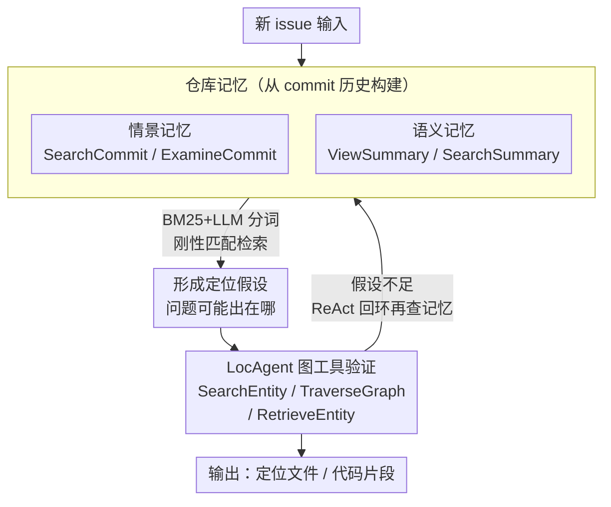

# Improving Code Localization with Repository Memory

**会议**: ICLR 2026  
**arXiv**: [2510.01003](https://arxiv.org/abs/2510.01003)  
**代码**: 无  
**领域**: Software Engineering / LLM Agent  
**关键词**: 代码定位, 仓库记忆, commit历史, 语言代理, SWE-bench

## 一句话总结

通过利用代码仓库的 commit 历史构建情景记忆（过去 commit）和语义记忆（活跃代码功能摘要），增强语言代理的代码定位能力，在 SWE-bench 上取得显著提升。

## 研究背景与动机

代码定位是仓库级软件工程任务（如 bug 修复）的关键第一步，即找到需要修改的文件和代码片段。现有方法，包括检索式（CodeRankEmbed）、过程式（Agentless）和代理式（LocAgent），都存在一个共同局限：它们将每个问题视为全新谜题，从零开始求解，完全没有利用对仓库的先验知识。

相比之下，人类开发者会随时间积累长期仓库记忆——包括对核心模块功能的理解、以及各种 bug 模式与修复位置之间的关联。这种经验积累使开发者能够成为代码库专家。论文通过分析 LocAgent 在 django 仓库上的失败案例来说明这一点：在缺乏仓库知识的情况下，代理需要进行复杂的推理链来追踪数据流和函数调用，最终容易过早停止或推理错误。而有经验的开发者可以利用往期 commit 记忆快速定位相关模块。

本文的核心洞察是：commit 历史是一个丰富但未被充分利用的资源，可以自然地为代理构建仓库记忆。

## 方法详解

### 整体框架

RepoMem 把 commit 历史包装成两类记忆工具，挂进 LocAgent 现成的 ReAct 循环里，让代理在做底层代码图遍历之前先有一层"仓库经验"可查。情景记忆记的是过去解过的具体问题（哪些 commit 改了什么），语义记忆记的是仓库架构层面的常识（哪些文件最活跃、各自负责什么）；代理先用这两类记忆快速形成"问题可能出在哪"的假设，再调 LocAgent 的代码图工具沿依赖关系核实，把"从零推理"变成"先回忆再验证"。记忆的检索全程用 BM25 + LLM 分词器做关键词刚性匹配，而非语义嵌入。

### 关键设计

**1. 情景记忆：把过去的 commit 当作可检索的问题范例**

代理面对一个新 issue 时最缺的，是"这类 bug 以前在哪儿修过"的具体先例。情景记忆从问题创建之前的近 7000 个 commit 里爬取并预处理出一份结构化语料，每条记录包含代码补丁、commit 消息、时间戳和关联的 issue 链接。为防止数据泄漏，构建时会排除那些与测试实例有文本重叠的 issue 及其关联 commit。代理通过两个工具访问它：`SearchCommit(query, top_k)` 用 BM25 检索匹配的历史 commit，返回 commit SHA、消息和修改文件列表；`ExamineCommit(id)` 再按 commit ID 取出完整上下文，包括 diff 补丁和关联 issue 内容。这相当于给代理一个开发者式的"我之前见过类似的"，直接把目光引到历史上反复出问题的模块。

**2. 语义记忆：用开发热点的功能摘要给庞大代码库画地图**

光有过去问题还不够，代理还需要知道仓库本身的结构，否则容易在成千上万个文件里迷路。语义记忆按 commit 频率挑出最常被修改的前 200 个文件——这些"开发热点"往往就是核心模块——再用 LLM 为每个文件生成一段高层功能摘要并缓存。代理可以用 `ViewSummary(file_name)` 直接看某个文件的摘要，或用 `SearchSummary(query, top_k)` 对所有摘要做关键词搜索拿回最相关的（文件, 摘要）对。这层记忆提供的是架构级上下文，把代理的注意力锚定在最活跃、最可能出问题的代码区域。

**3. 与 LocAgent 工具栈协同：高层记忆提假设，底层图分析做验证**

LocAgent 原有三个工具——`SearchEntity`（搜索代码实体）、`TraverseGraph`（多跳图遍历）、`RetrieveEntity`（获取源代码）——擅长精确的结构化分析但不带任何先验。RepoMem 不替换它们，而是把四个记忆工具直接加进同一个动作空间，形成分工：代理先用记忆工具快速形成"问题可能出在哪"的假设，再调 LocAgent 工具沿代码依赖图详细核实。引入记忆后代理对 `TraverseGraph` 和 `RetrieveEntity` 的依赖明显下降，探索从盲目的数据流追踪转向假设驱动的定向验证。

**4. 检索器选刚性匹配而非语义匹配**

记忆能否用对，取决于检索器是否分得清代码里那些"长得像但功能不同"的实体。论文比较了三种方案：BM25 配 LLM 分词器、BM25 配空格分词、以及稠密检索（GritLM-7B）。结果是 BM25 + LLM 分词器最好，稠密检索最差——在 django 子集上前者 Acc@5 达 79.7 而稠密检索只有 65.8。原因是代码词汇有"刚性"：`MigrationWriter` 和 `OperationWriter` 语义上很近，功能上却完全不同，需要的是精确的关键词匹配，而语义嵌入恰恰会把它们混为一谈。LLM 分词器的价值在于能把 `MigrationWriter` 这样的标识符正确切成可匹配的 token，让 BM25 发挥作用。

## 实验关键数据

### 主实验

所有实验使用 GPT-4o (2024-05-13) 作为骨干 LLM。

| 方法 | SWE-bench-verified Acc@1 | Acc@3 | Acc@5 | SWE-bench-live Acc@1 | Acc@3 | Acc@5 |
|------|----------|-------|-------|----------|-------|-------|
| CodeRankEmbed | 29.6 | 45.1 | 54.3 | 26.2 | 44.6 | 52.3 |
| Agentless | 53.3 | 67.8 | 71.4 | 40.0 | 60.0 | 62.3 |
| LocAgent | 64.8 | 70.4 | 71.6 | 59.2 | 60.8 | 63.1 |
| RepoMem (episodic-only) | 67.8 | 72.4 | 74.3 | 60.0 | 61.5 | 64.6 |
| RepoMem (semantic-only) | 65.0 | 71.0 | 72.8 | 56.9 | 61.5 | 63.9 |
| **RepoMem (full)** | **68.6** | **74.5** | **76.5** | **60.8** | **63.9** | **66.2** |

在 SWE-bench-verified 上 Acc@5 提升 4.9%，SWE-bench-live 上提升 3.1%。

### 消融实验

| 配置 | 关键指标 | 说明 |
|------|---------|------|
| 仅情景记忆 | Acc@5=74.3 | 引用历史 commit 带来显著增益 |
| 仅语义记忆 | Acc@5=72.8 | 帮助聚焦活跃代码区域 |
| 两者结合 | Acc@5=76.5 | 互补信息，效果最优 |
| BM25 (LLM分词) | django Acc@5=79.7 | 优于稠密检索的65.8 |

### 关键发现

- **per-repo 分析**: commit 历史越丰富的仓库获益越大（如 sympy 提升 16.7%），历史稀疏的仓库反而可能降低性能（"others" 组降低 13.1%）
- **代理行为转变**: 引入记忆后，代理显著减少对 TraverseGraph 和 RetrieveEntity 的依赖，转向更有针对性的、假设驱动的探索策略
- **成本效率分析**: 平均成本增加，但在 per-example 层面表现为高方差——部分问题因记忆提示直接命中而显著便宜，部分问题因记忆无用而增加开销。额外成本主要集中在 LocAgent 本身失败的困难问题上，说明代理策略性地在困难问题上投入更多资源

## 亮点与洞察

1. **仓生记忆的天然优势**: commit 历史是仓库的自然演化记录，无需额外标注即可构建高质量记忆，这是一个优雅且实用的设计
2. **认知科学的类比**: 情景记忆对应开发者的"过去经验回忆"，语义记忆对应"模块功能理解"，两者协同反映了人类开发者的实际工作模式
3. **稀疏检索 > 稠密检索**: 在代码领域，精确关键词匹配优于语义匹配，这一发现对 RAG 在代码任务中的应用有重要启示
4. **模块化设计**: 记忆工具可以轻松集成到任何基于 ReAct 的代理框架中

## 局限与展望

1. **历史稀疏仓库表现差**: 当仓库 commit 历史有限时，记忆检索可能返回无关信息，反而干扰推理
2. **缺乏自适应记忆使用策略**: 代理目前无法判断何时应该使用记忆、何时应该从头推理，未来可以训练代理根据问题新颖性动态决策
3. **仅在文件级定位上验证**: 未展示在函数级或行级定位上的效果
4. **仅限于 bug 修复场景**: 对其他仓库级任务（如特性开发、重构）的适用性未探索

## 相关工作与启发

- **LocAgent** (Chen et al., 2025): 本文的基础框架，通过异构图表示代码结构和依赖关系
- **Agentless** (Xia et al., 2025): 过程式方法的代表，直接用 LLM 和仓库结构进行定位
- **SWE-Exp** (Chen et al., 2025): 从代理过去成功/失败轨迹中提炼过程性知识，与本文正交（本文从 commit 历史获取记忆）
- **Agent Workflow Memory** (Wang et al., 2025): 更广泛的记忆增强代理研究，本文专注于代码特定场景

## 评分

- 新颖性: ⭐⭐⭐⭐ — commit 历史作为记忆源是自然但新颖的想法
- 实验充分度: ⭐⭐⭐⭐ — 两个基准、多角度分析、per-repo 分析、成本分析
- 写作质量: ⭐⭐⭐⭐⭐ — 动机清晰，案例分析生动，分析深入
- 价值: ⭐⭐⭐⭐ — 对代码代理的实际改进，方法简单有效且易于推广

<!-- RELATED:START -->

## 相关论文

- [\[ACL 2026\] Learning Adaptive Parallel Execution for Efficient Code Localization](../../ACL2026/code_intelligence/learning_adaptive_parallel_execution_for_efficient_code_localization.md)
- [\[ICLR 2026\] ReasoningBank: Scaling Agent Self-Evolving with Reasoning Memory](reasoningbank_scaling_agent_self-evolving_with_reasoning_memory.md)
- [\[ACL 2026\] SWE-QA: Can Language Models Answer Repository-level Code Questions?](../../ACL2026/code_intelligence/swe-qa_can_language_models_answer_repository-level_code_questions.md)
- [\[ACL 2026\] CodeRL+: Improving Code Generation via Reinforcement with Execution Semantics Alignment](../../ACL2026/code_intelligence/coderl_improving_code_generation_via_reinforcement_with_execution_semantics_alig.md)
- [\[ACL 2026\] RepoShapley: Shapley-Enhanced Context Filtering for Repository-Level Code Completion](../../ACL2026/code_intelligence/reposhapley_shapley-enhanced_context_filtering_for_repository-level_code_complet.md)

<!-- RELATED:END -->
