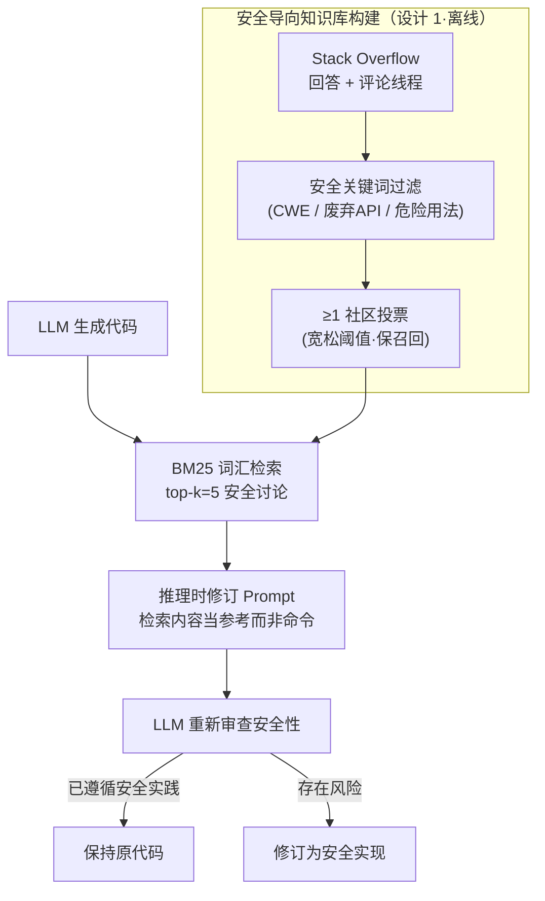

# Inference-Time Safety for Code LLMs via Retrieval-Augmented Revision

**会议**: ICLR 2026  
**arXiv**: [2603.01494](https://arxiv.org/abs/2603.01494)  
**代码**: 无  
**领域**: 代码安全 / 检索增强生成  
**关键词**: code safety, retrieval-augmented generation, inference-time intervention, vulnerability repair, Stack Overflow

## 一句话总结
提出 SOSecure，一种无需重训练的推理时安全机制，通过 BM25 从 Stack Overflow 安全讨论知识库中检索与 LLM 生成代码相关的社区安全警告，引导模型在推理阶段自主修订不安全代码，在三个真实数据集上实现高达 96.7% 的漏洞修复率且零新漏洞引入。

## 研究背景与动机

**领域现状**：LLM 代码生成工具（如 GitHub Copilot、ChatGPT、Cursor 等）已广泛部署于实际开发流程中，显著提升了开发效率。然而这些模型在安全敏感场景下存在严重的可信性问题——训练数据中包含大量过时或不安全的编码模式，模型会不断复现已知的 CWE 漏洞。

**现有痛点**：当前解决代码安全问题的主要途径是微调或重训练，但代价高昂且难以频繁更新。编程语言、库和框架的演化速度极快（如 TensorFlow 频繁废弃不安全 API），静态训练快照无法跟上安全标准的变化。更关键的是，开发者往往对 LLM 生成的代码给予过高信任，直接集成到生产系统中而缺乏充分的安全审查。

**核心矛盾**：LLM 具备生成语法正确、功能完整代码的能力，但缺乏透明的安全推理能力——它无法解释为什么某个模式是不安全的，也无法主动适应新发现的漏洞。而重训练成本与安全知识演化速度之间存在根本矛盾。

**本文目标** (1) 如何在不重训练模型的情况下提升代码生成的安全性？(2) 如何利用持续演化的社区安全知识来弥补模型静态知识的不足？(3) 如何设计一种可解释、可适应的推理时安全干预机制？

**切入角度**：作者观察到 Stack Overflow 社区十多年来积累了丰富的安全讨论——开发者在评论中指出代码为什么不安全、建议更安全的替代方案。这些人类撰写的解释性知识恰好是 LLM 训练数据中缺失的 "why" 层面的安全推理。

**核心 idea**：用 BM25 从 Stack Overflow 安全讨论库中检索与生成代码相似的安全警告，作为推理时上下文引导 LLM 自主修订不安全代码。

## 方法详解

### 整体框架
SOSecure 是一个模型无关的推理时安全层，不需要任何模型训练或微调，要解决的是"模型静态知识跟不上漏洞演化、又不便频繁重训练"这个矛盾。它分**离线**和**在线**两部分：离线先从 Stack Overflow 攒出一个安全导向的知识库（设计 1）；在线时，对一段刚由 LLM 生成的代码，依次做三步——用 BM25 检索出与之相关的社区安全讨论（设计 2）、把这些讨论组织成一个保守的修订 prompt（设计 3）、再让同一个 LLM 在社区反馈的提示下重新审查并自行决定改不改。整个过程对用户透明，检索内容不会被直接注入代码，而是作为"参考建议"供模型推理。

### 关键设计

**1. 安全导向知识库构建：把社区里散落的安全讨论攒成可检索的知识源**

前面提到 LLM 缺的是"为什么不安全"这层解释，而这恰恰散落在 Stack Overflow 十多年的回答和评论里。作者从中筛出明确提及安全问题的回答和评论线程，用一组精心策划的安全关键词过滤——包括已知漏洞引用、废弃功能警告、危险使用模式等。质量控制上只要求回答或至少一条评论获得至少一个社区投票。这个 ≥1 投票的宽松阈值是刻意为之：优先保召回率而非精确率，因为真正判断检索内容是否相关、是否有效的是下游 LLM，它比任何静态过滤器都更擅长这件事，所以这一层只需把候选尽量留全。

**2. 基于 BM25 的社区讨论检索：用词汇匹配抓住安全漏洞里的具体标识符**

给定一段 LLM 刚生成的代码，SOSecure 用 BM25 词汇匹配模型，按代码与知识库中代码片段的词汇相似度检索 top-$k$（默认 $k=5$）个最相似的回答及其评论线程。这里没有用更时髦的稠密向量检索，原因在于安全漏洞往往取决于具体的 API 调用、配置参数或错误消息——例如 `shell=True`、`pickle.loads`、`debug=True`——这些关键标识符在稠密嵌入里容易被语义平滑稀释掉。作者的初步实验也印证了这点：稠密方法在漏洞依赖具体 API 调用时频繁失效，而 BM25 能更一致地匹配到引用相同函数、相同参数的讨论，因此在安全检索这个特定场景下反而更可靠。

**3. 推理时修订 Prompt 构建：把检索到的社区意见当参考而非命令，让模型自己权衡**

检索到的讨论不会被直接塞进代码，而是整合成一个结构化的修订 prompt，要求 LLM 在社区反馈的指引下重新审查自己生成代码的安全性，并自行决定是否修改。这里的关键是 prompt 写得保守：模型被显式允许保持代码不变——当它判断原始实现已经遵循安全实践时就不必动。检索内容被定位成"上下文指导"而不是"强制指令"。这样设计是为了避开过度修正的风险：社区建议可能过时或不完整，硬性套上去反而会改坏，于是把最终判断权交回模型，让它用自身推理去权衡社区意见和当前代码的适用性。这也解释了为什么实验里 SOSecure 始终零新漏洞引入。

### 损失函数 / 训练策略
SOSecure 是一个纯推理时方法，不涉及任何训练或微调。其核心设计理念是作为现有训练时方法和静态分析的互补安全层。

## 实验关键数据

### 主实验

| 数据集 | 方法 | Fix Rate | Introduction Rate | 较Prompt-only提升 |
|--------|------|----------|-------------------|-------------------|
| SALLM | Prompt-only | 49.1% | - | - |
| SALLM | GPT-4+CWE | 58.5% | - | +9.4% |
| SALLM | SOSecure | 71.7% | 0.0% | **+22.6%** |
| LLMSecEval | Prompt-only | 56.5% | - | - |
| LLMSecEval | GPT-4+CWE | 69.6% | - | +13.1% |
| LLMSecEval | SOSecure | 91.3% | 0.0% | **+34.8%** |
| LMSys | Prompt-only | 37.5% | - | - |
| LMSys | GPT-4+CWE | 45.8% | - | +8.3% |
| LMSys | SOSecure | 96.7% | 0.0% | **+59.2%** |

### 消融实验

| 配置 | Fix Rate | Introduction Rate | 说明 |
|------|----------|-------------------|------|
| Prompt-only baseline | 37.5% | 0.0% | 无任何安全干预 |
| GPT-4+CWE (仅漏洞标签) | 45.8% | 0.0% | 提供 CWE 标识但无社区解释 |
| Revision-only (无检索) | 41.2% | 0.0% | 自我审查但无外部上下文 |
| SOSecure ($k=5$) | 96.7% | 0.0% | 完整方法，含社区讨论检索 |

### C 语言代码评估

| 方法 | Fix Rate | Introduction Rate | No Change Rate |
|------|----------|-------------------|----------------|
| Prompt-only | 53.3% | 0.0% | 80.0% |
| GPT-4+CWE | 60.0% | 0.0% | 77.5% |
| SOSecure | 73.3% | 0.0% | 72.5% |

### 关键发现
- **社区讨论是关键**：消融实验表明自我修订（Revision-only）仅带来边际改进（37.5%→41.2%），而加入检索到的社区讨论后 Fix Rate 飙升至 96.7%，说明 SOSecure 的收益来源于社区撰写的安全解释而非简单的自我反思
- **漏洞标签不够**：即使提供了显式的 CWE 标签（GPT-4+CWE），修复率也远低于 SOSecure，表明"知道有漏洞"和"理解为什么不安全以及如何修复"之间存在巨大鸿沟
- **零新漏洞引入**：在所有数据集和配置下，SOSecure 从未引入新的安全漏洞，证明了保守修订策略的有效性
- **跨语言泛化**：在 C 语言代码上同样有效（Fix Rate 从 53.3% 提升至 73.3%），无需语言特定的调优

## 亮点与洞察
- **推理时干预优于训练时修复**：这一设计范式——在代码生成后而非训练阶段介入安全修复——使系统能够随时适应新发现的漏洞，无需重训练。这个思路可迁移到任何需要持续更新知识的代码生成场景
- **社区知识的独特价值**：Stack Overflow 讨论提供的不仅是"什么是安全的"，更重要的是"为什么不安全"。这种因果解释性知识是 LLM 训练数据中稀缺的，也是让模型产生更深层安全推理的关键
- **BM25 优于稠密检索的反直觉发现**：在安全领域，具体的 API 名称和配置参数是关键信号，稠密嵌入反而会稀释这些关键标识符。这个发现可推广到其他依赖精确标识符匹配的检索任务

## 局限与展望
- **依赖静态分析工具评估**：CodeQL 和 Bandit 存在已知的假阳性和假阴性问题，评估结果需谨慎解读
- **知识库覆盖范围有限**：Stack Overflow 的安全讨论可能无法覆盖所有类型的漏洞，尤其是新兴或罕见的安全问题
- **仅评估了 GPT-4**：未在其他 LLM（如开源模型）上验证泛化性
- **检索质量的上限**：BM25 依赖词汇重叠，对于语义等价但用词不同的安全模式可能漏检
- 可考虑结合稠密检索与稀疏检索的混合策略，或引入 CWE 知识图谱来增强检索覆盖率

## 相关工作与启发
- **vs 微调/重训练方法**: 这些方法需要大量安全标注数据且无法适应新漏洞，SOSecure 无需训练即可动态更新知识
- **vs 纯提示工程**: 简单提示模型关注安全性效果极其有限（Fix Rate 仅 37.5%），说明模型需要外部知识来补充安全推理
- **vs RAG for CVE**: 之前的工作使用 CVE 数据库做检索增强，但 Stack Overflow 提供了更丰富的因果解释和修复建议，而非仅仅是漏洞描述

## 评分
- 新颖性: ⭐⭐⭐⭐ 推理时安全干预 + 社区知识检索的组合是新颖的，但各组件相对简单
- 实验充分度: ⭐⭐⭐⭐ 三个数据集覆盖不同场景，消融全面，但缺少多模型对比
- 写作质量: ⭐⭐⭐⭐⭐ 论文结构清晰，动机阐述充分，讨论深入
- 价值: ⭐⭐⭐⭐ 提出了实用的推理时安全层概念，具有工程部署价值

<!-- RELATED:START -->

## 相关论文

- [\[ACL 2026\] Across Programming Language Silos: A Study on Cross-Lingual Retrieval-Augmented Code Generation](../../ACL2026/code_intelligence/across_programming_language_silos_a_study_on_cross-lingual_retrieval-augmented_c.md)
- [\[ICLR 2026\] KV Cache Transform Coding for Compact Storage in LLM Inference](kv_cache_transform_coding_for_compact_storage_in_llm_inference.md)
- [\[ICLR 2026\] IMSE: Intrinsic Mixture of Spectral Experts Fine-tuning for Test-Time Adaptation](imse_intrinsic_mixture_of_spectral_experts_fine-tuning_for_test-time_adaptation.md)
- [\[ACL 2026\] PaT: Planning-after-Trial for Efficient Test-Time Code Generation](../../ACL2026/code_intelligence/pat_planning-after-trial_for_efficient_test-time_code_generation.md)
- [\[ICLR 2026\] AetherCode: Evaluating LLMs' Ability to Win In Premier Programming Competitions](aethercode_evaluating_llms_ability_to_win_in_premier_programming_competitions.md)

<!-- RELATED:END -->
