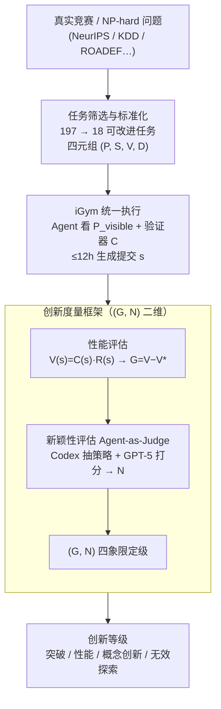

# InnoGym: Benchmarking the Innovation Potential of AI Agents

**会议**: ICLR 2026  
**arXiv**: [2512.01822](https://arxiv.org/abs/2512.01822)  
**代码**: [https://github.com/zjunlp/igym](https://github.com/zjunlp/igym)  
**领域**: 代码智能  
**关键词**: AI agent benchmark, innovation evaluation, performance gain, novelty, improvable tasks

## 一句话总结
提出 InnoGym，第一个系统评估 AI Agent 创新能力的基准和框架，引入 Performance Gain 和 Novelty 两个互补指标，通过 18 个可改进任务发现当前 Agent 具备一定创新性但缺乏将创新转化为可靠性能提升的鲁棒性。

## 研究背景与动机

**领域现状**：现有 LLM 和 Agent 评测基准（如 SWE-Bench、MLE-Bench、HumanEval）主要关注"答案是否正确"——只要通过测试用例或匹配参考答案就算成功。这类基准已经推动了代码生成、数学推理、科学发现等领域的快速进步。MLAgentBench、DSBench、MLGym 等也在 Kaggle 竞赛场景下评估 Agent 的 ML 工程能力，但评价标准仍然是排行榜上的性能得分。

**现有痛点**：然而，这种"正确性至上"的评估范式完全忽视了解题方法的差异。两个 Agent 可能用完全不同的方法得到相同的正确答案，但现有基准无法区分这种方法论层面的差异。此外，在真实的科学和工程问题中，往往没有唯一正确答案，关键在于能否提出更优或更新颖的方案。

**核心矛盾**：智能和创新不仅体现在结果上，更体现在方法上。现有评估框架将"解决问题的能力"等同于"得到正确答案的能力"，无法衡量 Agent 的创造力和方法论创新，而后者恰恰是 AI 驱动科学发现的核心能力。

**本文目标** (1) 如何形式化定义和量化"创新"？(2) 如何构建一个能同时评估性能提升和方法论新颖性的基准？(3) 当前主流 Agent 框架在真实创新任务上的表现如何？(4) 性能与新颖性之间的关系是什么？

**切入角度**：受管理学家 Peter Drucker "创新是创造新绩效维度的变革"的启发，将每个任务形式化为四元组 $(P, S, V, D)$，在此基础上定义 Performance Gain 和 Novelty 两个正交指标，构建二维创新评价空间。同时将任务分为三类（已解决、可改进、探索性），聚焦于有明确改进空间的可改进任务。

**核心 idea**：将创新分解为"做得更好"（Performance Gain）和"做得不同"（Novelty）两个维度，在真实工程/科学问题上评估 Agent 的创新潜力。

## 方法详解

### 整体框架
InnoGym 想回答一个被现有基准回避的问题：当一道题没有唯一正确答案时，怎么衡量一个 Agent 到底有没有"创新"。它把这件事拆成两个互补组件——iBench 负责"出题"（创新评估基准），iGym 负责"考场"（统一执行环境）。整条流水线是这样转的：先从真实竞赛和经典难题里筛出 18 个还有改进空间的可改进任务（Improvable Tasks），每个任务被形式化成四元组 $\mathcal{T} = (P, S, V, D)$（$P$ 问题实例、$S$ 解空间、$V$ 性能度量、$D$ 解间差异的距离函数）；Agent 在 iGym 里答题，只看得到半盲信息 $P_{\text{visible}}$（任务描述、示例、开发数据、环境）和一个验证器 $C$，而评估器 $R$、已知解集 $S_{\text{known}}$、排行榜真值全部隐藏；交卷后沿性能、新颖性两轴打分，最终把这个解定到 $(G, N)$ 二维空间的某个创新等级里。

任务本身来自 2018–2024 年的顶级学术与工业竞赛（NeurIPS Competitions、KDD Cup、ROADEF、GMCM、MLArchSys）以及经典 NP-hard 问题，横跨机器学习、运筹优化、系统设计、数学等多个领域，刻意避免单一学科。

### 关键设计

**1. 任务筛选与标准化流水线：把 197 个候选收敛成 18 个干净可比的任务**

可改进任务的价值在于"有清晰的改进空间"——既不能是早被解透、没空间可改的题，也不能是连人类基线都没有、无从对比的探索题。为此 iBench 走两阶段漏斗：先从公开竞赛收集 197 个候选，第一阶段查资源可用性和算力可行性（数据集、评估器、排行榜、参考解是否齐全），第二阶段验证评估器质量并平衡领域分布，最终留下 18 个。留下来的每个任务还要过标准化增强：任务规范重写、环境打包、验证器构建、解集收集、评估器归一化、数据划分。其中评估器归一化卡得最严——要求归一化后的绝对分数与原始分数的 Pearson 相关 $\geq 0.9$、排序的 Kendall $\tau \geq 0.8$，这样不同任务的分数才能放到同一把尺子上横向比。

**2. 统一执行环境 iGym：让 Agent 之间的差距来自设计而非基础设施**

如果不同 Agent 跑在各自的 SDK 上，性能差异里就混进了工程实现的噪声，没法归因到 Agent 本身。iGym 是 InnoGym 配套的统一执行 SDK，专门补上现有 SDK（OpenHands、AutoGen、LangGraph）在长时运行任务上的短板：异步工具调度器（Async Tool Dispatcher）让 Agent 能并发调用多种工具而不互相阻塞；鲁棒恢复机制保障 12 小时长跑中的断点续跑；统一抽象层让 workflow 模式和 agent 模式的不同框架在同一环境里交互。Agent 在这里只能看到半盲信息 $P_{\text{visible}}$ 和验证器 $C$，看不到真值，这样测出来的差异才能干净地归因到 Agent 的设计本身。

**3. 创新度量框架：用正交的两轴把"创新"量化出来**

现有基准只认结果对不对，于是"调参刷到 SOTA"和"换个全新方法做到差不多"被混为一谈，但这两件事的性质完全不同。受 Peter Drucker"创新是创造新绩效维度的变革"启发，InnoGym 把创新拆成两个互不替代的维度：Performance Gain $G(s) = V(s) - V^*_{\text{known}}$ 衡量解相对于已知最优解的性能提升，回答"做得更好了吗"；Novelty $N(s) = C(s) \cdot \min_{h \in S_{\text{known}}} D(s, h)$ 取新解到所有已知解的最小距离，回答"做得更不一样了吗"（乘上 $C(s)$ 是为了让不可行的解拿不到新颖性分）。其中性能分本身是 $V(s) = C(s) \cdot R(s)$，验证器 $C$ 判不可行就直接归零。两轴一组合，创新就被切成四象限：突破性创新（高 $G$、高 $N$）、性能创新（高 $G$、低 $N$）、概念创新（$G \approx 0$、高 $N$）、无效探索（低 $G$、低 $N$）。论文进一步用复数平面把 $G$ 当模、$N$ 当角，让方向不同但新颖度相同的解能被区分开。

**4. 新颖性评估（Agent-as-Judge）：用语义理解而非代码相似度判断"方法有多不同"**

上面 $N(s)$ 里的距离 $D$ 最难算——方法论上的差异很难用代码 diff 或字符串相似度捕捉，两段长得很像的代码可能思路迥异，反之亦然，所以 $D$ 改用模型来判。具体分两步：先用 Codex 的提取 prompt 把每个解的核心策略抽成结构化表示，剥掉无关的实现细节；再用 GPT-5 沿多个评分维度对 Agent 解与每个参考解打分，取它到所有参考解中的最小距离并归一化。这套 Agent-as-Judge 方案的好处是能跨多种任务类型扩展，不必为每类任务手写相似度规则；代价是评分依赖 GPT-5 的能力，换一个评判模型或版本可能给出不一致的新颖性排名。

### 一个完整示例
以 OAG 任务走一遍评估流程，看一个解怎么从提交变成创新等级。先定好实验设置：每个"任务–Agent–模型"配置最多跑 12 小时、重复 3 次取最佳有效提交，主实验用 DeepSeek-v3.1 作骨干 LLM。MLAB 这个 Agent 在 iGym 里答题、提交方案 $s$，验证器 $C(s)$ 先确认可行（$C=1$），评估器 $R(s)$ 算出性能分 $V(s) = 54.86$。OAG 的排行榜最高分 $V^*_{\text{known}} = 83.45$，于是 Performance Gain $G = 54.86 - 83.45 = -28.59$——比人类最优差了一截；为便于跨任务比较，再报归一化 Ratio $= G / V^* = -0.34$。接着 Codex 把这个解的核心策略抽成结构化表示，GPT-5 拿它和参考解比，得到 Novelty $N = 70.83$（满分 100）。最后这个解落在 $(G, N) = (-28.59, 70.83)$：新颖度很高、但性能为负，正是论文反复强调的典型象限——Agent 想出了不一样的方法，却没能把它转成可靠的性能提升。

## 实验关键数据

### 主实验

| 任务 | 排行榜最高分 | MLAB Gain/Ratio/Novelty | CodeAct Gain/Ratio/Novelty | AIDE Gain/Ratio/Novelty |
|------|------------|------------------------|---------------------------|------------------------|
| BEETL(MI) | 76.33 | -35.66/-0.47/66.67 | 无有效提交 | 无有效提交 |
| BEETL(Sleep) | 69.23 | -14.64/-0.21/62.50 | 无有效提交 | -53.62/-0.77/54.17 |
| Belka | 30.62 | -19.02/-0.62/45.83 | -28.14/-0.92/45.83 | -30.01/-0.98/20.83 |
| CirclePacking | 2.635 | -0.43/-0.16/50.00 | -0.008/-0.003/25.00 | -0.25/-0.09/33.33 |
| OAG | 83.45 | -28.59/-0.34/70.83 | -30.38/-0.36/62.50 | -29.87/-0.36/70.83 |
| **平均** | **57.94** | **-24.32/-0.45/56.55** | **-41.58/-0.69/54.86** | **-42.68/-0.64/46.67** |

### 分析实验（CirclePacking 任务）

| 分析维度 | 关键结果 | 说明 |
|---------|---------|------|
| 基础模型对比 | Gemini-2.5-Pro: 2.49, GPT-5: 2.44, DeepSeek-v3.1: 2.40 | AlphaEvolve 达到 2.65，Agent 是基础模型能力的放大器 |
| 时间预算影响 | G随时间单调递增，N逐渐下降 | 收益递减：方案改进越困难，方法论趋于收敛 |
| 采样温度 | 低温高性能低新颖，高温高新颖低性能 | 0.5-0.75 是最佳平衡区间 |
| 先验知识 | 从 Gemini-2.5-Pro 解出发，AIDE 能持续改进 | 验证了 G 和 N 可以联合刻画创新轨迹 |

### 关键发现
- 没有任何 Agent 在任何任务上超越人类 SOTA，Performance Gain 始终为负，平均 Ratio 在 -0.45 到 -0.69 之间
- MLAB 在性能和新颖性上均领先（平均 Gain -24.32, Novelty 56.55），但在 CDML、PTTALC 等复杂任务上所有 Agent 均无法生成有效提交
- 鲁棒性是瓶颈而非创意：Agent 能产生新颖方法但无法将其转化为可靠的性能提升（如 RCIC 和 TrojanDetection 上高新颖性伴随极低性能）
- CodeAct 在数学优化任务 CirclePacking 上接近 SOTA（Ratio=-0.003），但在其他任务上泛化较差
- 基础模型能力显著影响 Agent 表现：Gemini-2.5-Pro 达到 2.49, GPT-5 达到 2.44，DeepSeek-v3.1 仅 2.40（AlphaEvolve 的 2.65 仍是最高值）
- 时间分析显示收益递减规律：Performance Gain 随时间单调递增但增速放缓，Novelty 随时间下降反映了方法论收敛

## 亮点与洞察
- 将"创新"形式化为 $(G, N)$ 二维空间是一个优雅的设计，提出了突破性/性能/概念创新的清晰分类。复数平面表示法（$G$ 为模、$N$ 为角）进一步增强了可视化能力，能区分具有相同新颖性得分但方法论方向不同的解
- 从 197 个候选任务中系统筛选到 18 个的标准化流程非常严谨，评估器归一化（Pearson/Kendall 检验）确保了跨任务对比的公平性。两阶段筛选策略可作为未来基准构建的参考模板
- "Agent 是基础模型的放大器而非替代品"这一发现对 Agent 系统设计有重要指导意义——应优先投入更强的基础模型而非复杂的 Agent 架构
- 任务分类体系（Solved/Improvable/Exploratory）清晰且有理论支撑，排除已解决和探索性问题聚焦可改进任务的决策有说服力
- CirclePacking 上的温度消融实验揭示了经典的 exploration-exploitation trade-off，0.5-0.75 温度范围的 sweet spot 对实际 Agent 部署有参考价值

## 局限与展望
- 主实验只覆盖 10/18 个任务，且每个配置仅运行 3 次，统计显著性有限
- Novelty 依赖 Agent-as-Judge（GPT-5 评分），可能引入大模型评判偏差，不同评判模型可能得出不一致的新颖性排名
- 缺少对 Agent 失败原因的深入分析（如哪些编程能力/推理能力是瓶颈）——CDML 和 PTTALC 上全部失败但原因不明
- 任务全部来自已有竞赛和经典问题，缺乏原创性的新问题设计，可能存在数据泄露风险（LLM 训练数据可能包含竞赛方案）
- 12 小时时间限制可能不足以让 Agent 完成复杂工程任务，部分任务的人类参赛者投入数周时间
- 只考察了 3 个 Agent 框架，未覆盖更多代表性方案（如 SWE-agent、Devin 等）

## 相关工作与启发
- **vs MLE-Bench**: MLE-Bench 只评估 Kaggle 排名（即 Performance），本文额外引入 Novelty 维度，能区分"调参到 SOTA"和"用新方法到 SOTA"
- **vs InnovatorBench**: InnovatorBench 评估 Agent 能否复现论文创新，但不评估方法的新颖性；InnoGym 同时评估性能和新颖性，且聚焦于可改进的开放问题
- **vs AlphaEvolve**: AlphaEvolve 是具体的创新 Agent 系统（在 CirclePacking 上达到 2.65），InnoGym 是评估框架，两者互补——AlphaEvolve 可以在 InnoGym 上评测
- **vs MLRCBench/MLGym**: 这些基准也针对 ML 工程任务，但只衡量性能不衡量方法创新。InnoGym 的任务来源更多样（还包括运筹、数学等领域）

## 评分
- 新颖性: ⭐⭐⭐⭐⭐ 首个系统化评估 Agent 创新能力的基准，$(G, N)$ 二维框架有理论深度，创新分类学（突破/性能/概念创新）有原创性
- 实验充分度: ⭐⭐⭐ 覆盖 10 个任务、3 个 Agent 框架、3 个基础模型，但运行次数少（每配置 3 次），部分任务无有效提交，统计稳定性不足
- 写作质量: ⭐⭐⭐⭐ 形式化定义清晰严谨，图示（复数平面、解空间树）直观有创意，但 iGym 系统细节放附录导致主文可读性略受影响
- 价值: ⭐⭐⭐⭐ 填补了 Agent 创新评估的空白，对 Agent 社区有重要引导作用，但当前 Agent 普遍表现不佳限制了基准的区分力

<!-- END -->

<!-- RELATED:START -->

## 相关论文

- [\[ACL 2026\] RExBench: Can coding agents autonomously implement AI research extensions?](../../ACL2026/code_intelligence/rexbench_can_coding_agents_autonomously_implement_ai_research_extensions.md)
- [\[ICLR 2026\] VERINA: Benchmarking Verifiable Code Generation](verina_benchmarking_verifiable_code_generation.md)
- [\[ICLR 2026\] The Matthew Effect of AI Programming Assistants: A Hidden Bias in Software Evolution](the_matthew_effect_of_ai_programming_assistants_a_hidden_bias_in_software_evolut.md)
- [\[NeurIPS 2025\] MLR-Bench: Evaluating AI Agents on Open-Ended Machine Learning Research](../../NeurIPS2025/code_intelligence/mlr-bench_evaluating_ai_agents_on_open-ended_machine_learning_research.md)
- [\[ICLR 2026\] FHE-Coder: Benchmarking Secure Agentic Code Generation for Fully Homomorphic Encryption](fhe-coder_benchmarking_secure_agentic_code_generation_for_fully_homomorphic_encr.md)

<!-- RELATED:END -->
