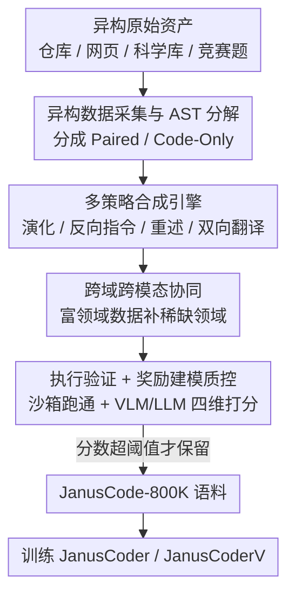

# JanusCoder: Towards a Foundational Visual-Programmatic Interface for Code Intelligence

**会议**: ICLR 2026  
**OpenReview**: [https://openreview.net/forum?id=N4BB09TXad](https://openreview.net/forum?id=N4BB09TXad)  
**代码**: 有（论文宣称开源 Code / Checkpoints / JanusCode-800K，详见 OpenReview 项目页）  
**领域**: 代码智能 / 多模态 / 数据合成  
**关键词**: 视觉-程序接口, 多模态代码, 数据合成, 奖励建模, 统一模型

## 一句话总结
针对"代码 + 视觉"多模态语料稀缺的瓶颈，本文造了一套数据合成工具箱，合成出迄今最大的多模态代码语料 JanusCode-800K，并训出统一模型 JanusCoder / JanusCoderV，用一个模型同时覆盖图表生成、网页 UI、动画、科学演示等文本侧与视觉侧任务，7B–14B 规模即逼近甚至超过 GPT-4o。

## 研究背景与动机

**领域现状**：代码智能正从纯文本源代码，扩展到程序"跑出来的视觉产物"——Matplotlib 图表、可交互 Web UI、3Blue1Brown 式数学动画、科学可视化等。理想的接口应该能让模型在"代码逻辑"和"视觉表达"之间自由互转：看图写代码、按指令改可视化、从零生成可交互前端。

**现有痛点**：当前工作分两条线都各有缺陷。建模层面，主流要么停在"程序辅助理解 / 推理"，要么为每个孤立任务单独训一个专用模型（chart-to-code 一个、WebUI-to-code 一个），既不能跨场景泛化，也难以规模化。数据层面更根本——高质量、多样的多模态代码数据极度稀缺：现有语料内容异质、不同编程语言数据丰度悬殊、自然语言指令风格单一，而代码能产出的视觉形态又千差万别。

**核心矛盾**：要训一个通用的视觉-程序模型，必须有覆盖"图表→交互网页→长动画"全谱系的语料；但造这种语料不仅要大规模采集处理，还要配套的验证环境（计算 / 渲染引擎），更要对"视觉产物是否真的对得上指令"做严格质控——三者缺一不可，工程量巨大，所以一直没人做出来。

**本文目标**：(1) 造一套能自动合成跨领域、跨编程语言多模态代码数据的工具箱；(2) 用它构建迄今最大的多模态代码语料；(3) 训出一个统一接口模型，从文本指令、视觉输入或两者组合都能生成代码。

**切入角度**：作者的关键观察是"不同模态、不同领域之间存在互惠协同（reciprocal synergy）"——R/Matlab 的科学计算逻辑能迁移去合成 Manim/Mathematica 任务，Python 可视化的视觉输出反过来能当 chart-to-code 的训练样本。把这种协同显式利用起来，就能用丰富领域的数据去补稀缺领域（动画、科学演示）的缺口。

**核心 idea**：用"多策略合成 + 跨域协同 + 视觉奖励质控"的数据工具箱批量造高质量多模态代码语料，再用统一模型一锅端掉所有视觉-程序任务，取代"一个任务一个专用模型"的旧范式。

## 方法详解

### 整体框架

JanusCoder 的核心不是某个新网络结构，而是一条**数据生产流水线**：输入是从公开仓库、网页语料、科学知识库、竞赛题等采来的异构原始资产，输出是 80 万条经过执行验证与视觉打分的"指令-代码(-图像)"样本（JanusCode-800K），再拿这批数据微调出统一模型。流水线分三段：先做**数据采集与分类**（含对超长 Manim 脚本的 AST 分解），再用**多策略合成引擎**把种子数据演化扩充成多样的指令-代码对，过程中显式**利用跨域跨模态协同**补稀缺领域；所有新生成代码都要进沙箱**执行验证**，通过后再由 VLM/LLM **奖励建模**按四维打分过滤，只留高分样本。最终语料训出两个模型：JanusCoder（只用文本侧数据，Qwen3-8B/14B 为底座）和 JanusCoderV（用全量语料，Qwen2.5-VL-7B / InternVL3.5-8B 为底座）。

### 关键设计

**1. 异构数据采集与 AST 分解：把杂乱原始资产整理成可学习的单元**

流水线第一步要从极度异质的来源（StackV2、WebCode2M 网页语料、Wolfram Demonstrations、竞赛题等）汇集原料，并统一归成两类：带指令-代码对的 Paired 数据 $(I, C)$（有视觉输出时扩成三元组 $(I, C, V)$），以及只有裸代码的 Code-Only 数据 $C$。难点在 Code-Only 里那些超长复杂文件——比如一个生成 5 分钟数学动画的 Manim 脚本，内部塞了多个独立概念步骤，却是一整块、没法直接拿来学。作者用 AST（抽象语法树）分解：把源码解析成语法树后遍历，识别并切出"语义自洽、可独立运行"的逻辑单元。这一步把"巨石代码"拆成多个可学习的小样本，是后面所有合成策略能跑起来的前提。

**2. 多策略合成引擎：四种互补策略一起扩充指令-代码语料**

光有种子数据不够多也不够多样，作者设计了四种合成策略并行运转。**Guided Evolution（引导演化）**从种子三元组出发，用一个高层概念 $K$（如图表类型、Web 元任务"加个控件"）引导生成更复杂的新指令 $I' = f_{evolve}(I, C, K)$，再让模型据此生成代码 $C'$ 并在执行环境 $E$ 中验证，反馈驱动下一轮迭代——比纯启发式演化更贴合视觉编码任务。**Re-Contextualization（重述）**不造新代码，而是深挖已有代码 $C$ 里指令没说清的隐含逻辑、边界情形，重写出更精确的指令 $I' = f_{recontext}(I, C)$，以极低成本把"指令-代码对齐度"提上去。**Reverse Instruction（反向指令）**针对裸代码：从参考文件采样一段 $C_{sample}$，反推出合理的自然语言指令 $I'' = f_{reverse}(C_{sample})$，再生成代码，从而把 R/Matlab 等科学语言的定理、数据分析代码大批转成指令跟随样本。**Bidirectional Translation（双向翻译）**在语义相近的领域间互译概念意图（如 Manim ↔ Mathematica）：先把源域指令译成目标域指令 $I_B = f_{translate}(I_A)$，再以源码 $C_A$ 当结构模板生成目标码 $C_B$，整个过程完全双向，绕开了"从零写复杂代码"的难题。四种策略分别解决"复杂度不足 / 对齐不够 / 覆盖太窄 / 专门领域稀缺"，组合起来覆盖面远超单一方法。

**3. 跨域跨模态协同：用富领域数据补稀缺领域的缺口**

这是全文最核心的 insight，也是上面策略真正发挥威力的地方：作者不把数据源孤立看待，而是显式在异质领域和模态间传递知识。具体两类协同——跨**领域**：R/Matlab 语料里大量科学计算逻辑，经反向指令和双向翻译，可以泛化去合成 Manim、Mathematica 的稀缺任务；WebDev 的 HTML/SVG 基础数据，可作为生成复杂可交互科学演示的底子。跨**模态**：一个 Python 可视化任务跑出来的图像输出，反手就能当 chart-to-code 任务的视觉输入。这种协同直接缓解了动画、科学演示这类专门领域的数据荒，让语料覆盖面和模型鲁棒性都显著增强——消融实验里"去掉某类非目标域数据导致目标任务掉点"正是它的证据。

**4. 执行验证 + 奖励建模质控：能跑通不等于视觉对得上**

合成出的代码必须先过沙箱：每条新代码 $C'$ 经执行函数 $V' = \text{Exec}(C', E)$ 跑出视觉输出或通过测试用例，跑不通的退回合成引擎重试精炼。但作者强调"可执行性是质量的不充分代理"——程序能通过编译/渲染，视觉产物却可能严重偏离指令。于是再加一层奖励建模：以 VLM 为核心引擎，把指令 $I$、代码 $C$、视觉输出 $V$ 组织成结构化 prompt，引导模型先做任务理解、再沿**任务相关性、任务完成度、代码质量、视觉清晰度**四个维度各打 1–5 分整数，最终分 $S = R(I, C, V)$ 取四项平均，只保留超过阈值的样本；无视觉输出的数据则改用 LLM 评 $(I, C)$ 对。这一层把"看着对"而非仅"跑得通"的样本筛出来，消融显示去掉它会让多模态任务明显掉点。

### 损失函数 / 训练策略
训练即在 JanusCode-800K 上做监督微调：JanusCoder 只用文本侧（text-centric）数据，底座为 Qwen3-8B/14B；JanusCoderV 用全量语料（含视觉侧 triplet），底座为 Qwen2.5-VL-7B-Instruct 与 InternVL3.5-8B。合成阶段的指令与代码统一由 gpt-oss-120b 生成；质控阶段视觉侧用 Qwen2.5-VL-72B-Instruct、文本侧用 Qwen3-235B-A22B 当奖励模型。语料约 50.9% 文本侧、49.1% 视觉侧，刻意做了平衡。

## 实验关键数据

作者另外提出 **DTVBench**（动态定理可视化基准，含 Manim 与 Wolfram Mathematica 两引擎、手工策展 102 个任务），总分定义为 $\text{score} = s_{exec} \cdot (s_{sim} + s_{align} + s_{faith})$，即只有可执行代码才进一步按代码相似度、指令对齐、视觉忠实度打分。共在 7 个基准上评测。

### 主实验

单模态任务（文本→代码）结果：

| 基准 | 指标 | JanusCoder-14B | GPT-4o | Qwen3-14B 底座 |
|--------|------|------|----------|------|
| PandasPlotBench | 错误码率↓(%) | **9.7** | 9.7 | 12.6 |
| ArtifactsBench | Visual / Task | 67 / **86** | 72 / 85 | 65 / 78 |
| DTVBench-Manim | 分数 | 8.41 | 10.60 | 6.63 |

8B/14B 模型错误率均 <10%，ArtifactsBench 上显著超过 GPT-4o（86 vs 85，且 8B 已达 80）。

多模态任务结果（节选 ChartMimic / WebCode2M / InteractScience）：

| 模型 | ChartMimic Direct(Low/High) | WebCode2M Visual | InteractScience Func.(%) |
|------|------|----------|------|
| Qwen2.5-VL-7B 底座 | 58.69 / 40.73 | 73.42 | 8.40 |
| JanusCoderV-7B | **72.77 / 65.73** | 75.78 | **17.73** |
| JanusCoderV-8B | 74.20 / 65.79 | 66.34 | 17.60 |
| GPT-4o | 67.42 / 57.16 | 82.67 | 27.20 |

JanusCoderV 在 chart-to-code 上大幅超过 GPT-4o 与专用 chart MLLM，InteractScience 功能分翻倍于底座（17.73 vs 8.40）；WebCode2M 视觉/结构相似度也较底座提升。

### 消融实验

| 配置 | ChartMimic | InteractScience | WebCode2M | 说明 |
|------|---------|------|------|------|
| JanusCoderV（全量） | 68.74 | 17.73 | 75.78 | 完整模型 |
| w/o Chart2Code | 56.50↓↓ | 16.27↓ | 71.92↓↓ | 去图表数据，ChartMimic 暴跌 |
| w/o Text-centric | 60.73↓ | 12.93↓↓ | 71.82↓↓ | 去文本侧数据，多模态任务也掉 |
| w/o Rewarding | 58.26↓↓ | 17.20↓ | 73.78↓ | 不做奖励过滤，质量明显下降 |

文本侧（JanusCoder）消融同样显示：去 Algorithm 数据令 LcbV6 从 25.14 掉到 17.71，去 Rewarding 令 ArtifactsBench 从 80 掉到 77。

### 关键发现
- **跨模态协同确有迁移效果**：去掉文本侧数据会让纯多模态任务（InteractScience 17.73→12.93）明显掉点，证明非目标域、甚至跨模态的数据能给专门视觉任务提供可迁移的编码能力——这对动画、科学演示等数据荒领域是实用指引。
- **奖励建模不可省**：在训练集规模一致下，去掉奖励过滤普遍掉点，验证"执行通过 ≠ 高质量数据"，视觉对齐必须单独把关。
- **不同底座普遍受益**：换 Qwen2.5-Coder-7B、InternVL3.5-4B 等底座，JanusCode-800K 都带来稳定提升，说明增益来自数据设计而非特定底座。
- **通用编码不退化反增强**：JanusCoder 在 BigCodeBench、LiveCodeBench 等通用基准上同时超过 VisCoder 这类专用可视化模型与 GPT-4o，说明统一训练没牺牲通用代码能力。

## 亮点与洞察
- **把"模态/领域协同"当一等公民显式设计**：不是顺手做数据增强，而是围绕"富领域补稀缺领域、视觉输出反哺 chart-to-code"组织整条流水线，这是统一模型能以小规模逼近 GPT-4o 的根因。
- **四策略各打一个数据病灶**：演化治"复杂度不足"、重述治"指令对齐差"、反向指令治"覆盖太窄"、双向翻译治"专门领域稀缺"，分工清晰、可单独复用到任意数据合成场景。
- **双层质控（执行 + 视觉打分）点破一个常被忽略的坑**：代码能渲染不代表画面对，必须上 VLM 按视觉清晰度等维度打分——这个思路可迁移到任何"代码产出视觉/UI"的数据清洗。
- **AST 分解长动画脚本**：把 5 分钟 Manim 巨石脚本切成自洽逻辑单元，是动画这类长程代码能进入训练的关键工程手段。

## 局限与展望
- DTVBench 的 Faithfulness 维度是"可选的主观分"，动态/交互内容难被 LLM judge 客观评估，评测可靠性受人工主观影响。
- 合成与质控重度依赖大模型（gpt-oss-120b 生成、Qwen 系列当奖励模型），数据质量上限实质受这些外部模型能力约束，奖励阈值等超参也未充分敏感性分析。
- 在 DTVBench-Manim、InteractScience 等最难的动态/科学演示任务上，模型仍明显落后 GPT-4o（如 InteractScience Func. 17.73 vs 27.20），统一模型尚未在所有维度反超商业模型。
- 协同迁移虽被消融证实，但"哪些领域对组合迁移收益最大"缺乏系统量化，实践中仍偏经验。

## 相关工作与启发
- **vs 专用单任务模型（chart-to-code / WebUI-to-code 各训一个）**：他们为孤立目标建专用模型、无法跨场景泛化也难扩展；本文用一个统一接口同时吃文本侧+视觉侧任务，并靠跨任务数据协同让单模型反超专用 MLLM。
- **vs 纯文本驱动的可视化代码生成（Matplotlib/Seaborn 生成、图表编辑等）**：他们只接受文本输入；本文把视觉输入也纳入，支持"看图复刻/按截图改网页"等多模态输入。
- **vs 视觉接地的代码理解/生成（chart understanding、定理可视化、SVG 等）**：他们多锁定单一领域单一模态；本文跨图表、Web UI、动画、符号计算等多域多模态统一建模，是覆盖面上的一次跨越。

## 评分
- 新颖性: ⭐⭐⭐⭐ 统一视觉-程序接口 + 显式跨域协同的数据范式较新，但底层是数据合成 + SFT 的组合拳。
- 实验充分度: ⭐⭐⭐⭐ 7 基准 + 多底座 + 三组消融，覆盖文本/视觉/通用编码，较扎实；最难任务仍逊于 GPT-4o。
- 写作质量: ⭐⭐⭐⭐ 动机—流水线—消融逻辑清晰，图表完整。
- 价值: ⭐⭐⭐⭐⭐ 开源最大多模态代码语料 + 工具箱 + 模型，对社区基建价值高。

<!-- RELATED:START -->

## 相关论文

- [\[ACL 2026\] OmniDiagram: Advancing Unified Diagram Code Generation via Visual Interrogation Reward](../../ACL2026/code_intelligence/omnidiagram_advancing_unified_diagram_code_generation_via_visual_interrogation_r.md)
- [\[ACL 2025\] Program Synthesis Benchmark for Visual Programming in XLogoOnline Environment](../../ACL2025/code_intelligence/program_synthesis_benchmark_for_visual_programming_in_xlogoonline_environment.md)
- [\[AAAI 2026\] TAPA: Training-Free Adaptation of Programmatic Agents via LLM-Guided Program Synthesis in Dynamic Environments](../../AAAI2026/code_intelligence/tapas_are_free_training-free_adaptation_of_programmatic_agen.md)
- [\[ICLR 2026\] VERINA: Benchmarking Verifiable Code Generation](verina_benchmarking_verifiable_code_generation.md)
- [\[ICLR 2026\] Code Aesthetics with Agentic Reward Feedback](code_aesthetics_with_agentic_reward_feedback.md)

<!-- RELATED:END -->
