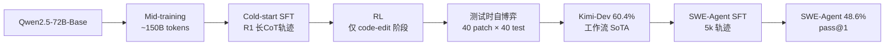

# Kimi-Dev: Agentless Training as Skill Prior for SWE-agents

**会议**: ICLR 2026  
**OpenReview**: [https://openreview.net/forum?id=tYppHuGhxJ](https://openreview.net/forum?id=tYppHuGhxJ)  
**代码**: [https://github.com/MoonshotAI/Kimi-Dev](https://github.com/MoonshotAI/Kimi-Dev)（模型 [Kimi-Dev-72B](https://huggingface.co/moonshotai/Kimi-Dev-72B)）  
**领域**: 代码智能 / SWE 编程智能体  
**关键词**: SWE-bench, Agentless, SWE-Agent, 技能先验, 强化学习, 测试时自博弈  

## 一句话总结
本文提出把 Agentless（工作流式）训练当作 SWE-Agent（多轮交互式）的"技能先验"，用一套 mid-training + cold-start + RL + 测试时自博弈的配方训出开源模型 Kimi-Dev，在 SWE-bench Verified 上取得工作流方案 SoTA 的 60.4%，再用 5k 条轨迹轻量 SFT 即把它升级成 48.6% pass@1 的智能体，与 Claude 3.5 Sonnet 持平。

## 研究背景与动机
- **领域现状**：SWE-bench 已成为衡量 LLM 修真实 GitHub bug 能力的标杆。解决方案分两派——多轮交互的 **SWE-Agent**（自由 plan/act/reflect，上限高、适配好）和固定流水线的 **Agentless**（把任务拆成定位→修复→写测试的单轮可验证子问题，模块化、易上 RLVR）。
- **现有痛点**：两派被普遍视为互斥。Agent 派端到端、奖励稀疏、长程信用分配难、训练易崩溃且对初始化极敏感（从通用预训练模型起步常陷入工具误用或死循环）；Agentless 派探索空间受限、灵活性差、错误只藏在单轮长推理里难以监控。
- **核心矛盾**：要灵活性和性能上限，还是要模块化和训练稳定性？社区把它当成非此即彼的取舍。
- **本文目标**：打破这个二分法，证明 Agentless 训练不该被当作"最终交付物"，而应被重新定位为诱导原子技能的手段。
- **核心idea**：**【技能先验视角】** Agentless 训练能诱导出**定位、代码编辑、自反思/验证**等原子技能先验，这些先验可以从非智能体工作流迁移到智能体框架，让后续 SWE-Agent 训练既更稳定又更省数据——两种范式不是互斥，而是构建可迁移编程智能体的互补阶段。

## 方法详解

### 整体框架
Kimi-Dev 的训练分两大阶段：先用 **Agentless 训练配方**把一个 72B base 模型打造成强工作流模型（BugFixer + TestWriter 双角色，经 mid-training → cold-start → RL → 测试时自博弈），拿到 SWE-bench Verified 60.4%；再把这个模型当"先验"，用 5k 条公开 SWE-Agent 轨迹做轻量 SFT，技能迁移到多轮智能体框架，得到 48.6% pass@1。

### 关键设计

**1. BugFixer 与 TestWriter 双角色框架：把 issue 解决拆成两类可验证技能。** 作者把 GitHub issue 解决抽象成两个协作角色：**BugFixer** 产出修复 bug 的 patch，**TestWriter** 产出能复现 bug 的单元测试（高质量测试应在修复前失败、修复后通过）。两个角色都依赖同样两个核心技能——**文件定位**（找出与 bug/测试相关的具体文件）和**代码编辑**（实施必要修改）。这一拆解把模糊的"解 issue"变成可单独优化、可执行验证的原子技能，为后续每个训练阶段提供了清晰的优化目标。

**2. Mid-training 与 cold-start：先灌知识、再点燃长推理。** 以 Qwen2.5-72B-Base 为起点，用约 150B token 做 mid-training，数据由三部分构成——约 50B 来自自然 diff patch 的 Agentless 格式数据、约 20B 精选 PR commit 包、约 20B 带推理与智能体交互模式的合成数据（训练时上采样 4 倍），并严格做数据去污以排除 SWE-bench Verified 测试集涉及的仓库。随后用 SWE-Gym 与 SWE-bench-extra 上由 DeepSeek-R1 扮演 BugFixer/TestWriter 生成的长 CoT 轨迹做 cold-start SFT，激活模型的问题分析、方法草拟、自我精炼与替代方案探索能力。实验显示 mid-training 的 token 量（50B→100B→150B）与性能单调正相关。

**3. 仅针对 code-edit 的结果导向 RL：三个关键设计稳住训练。** 由于 mid-training 后定位已足够强，RL 只聚焦代码编辑阶段，并用初始模型的多次定位 rollout 来多样化 prompt。算法沿用 Kimi k1.5 的 REINFORCE 式策略梯度，类似 GRPO 用多 rollout 平均奖励作 baseline 归一化回报，并强调三点：(i) **纯结果奖励**——只用环境执行结果作 0/1 原始奖励，不加格式/过程信号，BugFixer 的 patch 通过全部 ground-truth 单测才给正奖励，TestWriter 则需满足"无修复时测试失败 AND 应用修复后测试通过"；(ii) **自适应 prompt 选择**——先丢弃 pass@16=0 的 prompt（初始 1200 题）扩大有效 batch，再用课程学习，每 100 步重新引入 500 道之前被排除、但 RL 下有改善的题以逐步提难度；(iii) **正例强化**——后期性能趋于平台时，把近期 RL 迭代的正样本并入当前 batch，强化成功模式、加速收敛。整套训练跑在基于 Kubernetes、支持 1 万+ 并发实例的沙箱基础设施上。

**4. 测试时自博弈：用执行反馈把 BugFixer 与 TestWriter 配对打分。** 测试时为每个实例独立生成 40 个候选 patch（第一个贪婪解码、其余 39 个温度 1.0）和 40 个测试，先过滤掉无法在原仓库引发失败的无效测试。设有效测试集为 $T$、patch 集为 $B$，对每对 $(b_i, t_j)$ 在 $t_j$ 修改的测试文件上跑两次（先不打 $b_i$、再打 $b_i$），统计 fail-to-pass 数 $FP(i,j)$、pass-to-pass 数 $PP(i,j)$ 以及第一次运行的失败/通过数 $F(j)$、$P(j)$，给每个 $b_i$ 打分：
$$S_i = \frac{\sum_j FP(i,j)}{\sum_j F(j)} + \frac{\sum_j PP(i,j)}{\sum_j P(j)}$$
第一项刻画 $b_i$ 在复现测试下的表现（修好该修的），第二项刻画其在回归测试下的表现（没改坏不该改的），取最高分 $b_i$ 作最终答案。该机制让 BugFixer 与 TestWriter 互相验证，仅 3×3 配对就已超过 40 个 BugFixer patch 的多数投票。

## 实验关键数据

### 主实验：Agentless 框架下 SWE-bench Verified
标准 40-patch / 40-test 设置：

| 模型 | 参数量 | Resolve Rate (%) |
|------|--------|------------------|
| Llama3-SWE-RL | 70B | 41.0 |
| OpenAI-o1 | - | 48.9 |
| DeepSeek-R1-0120 | 671B | 49.2 |
| Claude 3.5 Sonnet (241022) | - | 50.8 |
| DeepSeek-R1-0528 | 671B | 57.6 |
| SWE-SWISS | 32B | 58.2 |
| **Kimi-Dev (Ours)** | **72B** | **60.4** |

72B 的 Kimi-Dev 以远小于 R1（671B）的规模拿下开源工作流 SoTA。

### 智能体框架下 SWE-bench Verified（端到端，单次尝试）

| 模型 | 框架 | 参数量 | Pass Rate (%) |
|------|------|--------|---------------|
| Claude 3.5 Sonnet (241022) | SWE-Agent | - | 49.0 |
| SWE-agent-LM | SWE-Agent | 32B | 40.2 |
| DeepSWE | OpenHands | 32B | 42.2 |
| **Kimi-Dev (SFTed)** | **SWE-Agent** | **72B** | **48.6** |

仅用 5k 公开轨迹 SFT、无需更多真实环境轨迹或多轮智能体 RL，就追平 Claude 3.5 Sonnet（49%）。其 pass@10=74.0% 还超过 Agentless 下的 pass@30=73.8%，印证智能体框架上限更高。

### 关键发现
- **技能先验确有迁移**：把 Base / MT / SFT / RL 四个模型当先验做 SWE-Agent SFT，RL 先验在几乎所有数据量下最优——RL 先验只需 $2^{23}$ token 就达到 Base 先验吃满 $1.5\times2^{28}$ token 的最佳 pass@1，**数据效率约提升两个数量级**。
- **长 CoT → 长多轮交互**：RL 先验微调后能在 70 轮以上继续取得进展，而 SFT/MT/Base 分别在约 70/60/50 轮就收益递减；反思技能也随训练阶段增强（Stage-3 截断点的解决数从 Base 的 484 升到 RL 的 605，反思增量从 +94 升到 +113）。
- **测试时自博弈可扩展**：patch-test 对从 1×1 增到 40×40，性能从 48.0% 升到 60.4%，且始终超过仅 BugFixer 多数投票；但仍低于用 ground-truth 测试的 pass@N，说明 TestWriter 仍有提升空间。
- **跨规模有效**：RL scaling 曲线在 Qwen2.5-14B 上同样成立，验证配方对不同尺寸模型通用。

## 亮点与洞察
- **范式重构**：最大贡献不是某个 trick，而是把 Agentless 与 SWE-Agent 从"互斥取舍"重新定义为"互补阶段"——Agentless 训练是诱导技能先验的脚手架，而非终点。这一视角具有方法论意义。
- **数据效率的硬证据**：RL 先验比 Base 先验省约两个数量级 SFT token，给出了"好先验=快适配"的可量化证据，呼应了 meta-learning 中 few-shot 适配的直觉。
- **纯结果奖励的工程纪律**：坚持只用执行结果做 0/1 奖励、不掺格式/过程信号，配合自适应课程与正例强化，体现了可验证奖励 RL 的稳健工程实践。
- **全开源**：72B 模型权重、代码、配方细节均开放，对社区复现与后续研究价值高。

## 局限与展望
- **TestWriter 是瓶颈**：自博弈性能始终低于 ground-truth 测试的 pass@N，RL 中还偶发因复现覆盖不足导致的假阳性，作者把 case study 和改进留给未来。
- **依赖强教师与重基础设施**：cold-start 轨迹由 DeepSeek-R1 生成、轨迹标注用 Kimi-K2，沙箱需支持万级并发，复现门槛高。
- **智能体侧只做了 SFT**：48.6% 仅来自轻量 SFT，尚未叠加多轮智能体 RL 或测试时扩展，智能体框架的真实上限还未被推满。
- **泛化验证有限**：虽提到能泛化到 SWE-bench-live 与 Multilingual，但正文主要围绕 SWE-bench Verified，跨语言/跨场景的系统评估仍不充分。

## 相关工作与启发
- **Agentless 谱系**（Agentless、SWE-RL、SWE-SWISS）：本文继承其定位→修复→测试的工作流拆解，但用执行式奖励替代文本相似度奖励，并引入两阶段 TestWriter 更好捕捉仓库上下文。
- **SWE-Agent / OpenHands**：提供了被迁移的目标框架，本文证明 Agentless 先验能显著降低其训练的数据与稳定性成本。
- **RL 算法**（Kimi k1.5、GRPO、REINFORCE）：采用简化的多 rollout 归一化策略梯度。
- **启发**：把"先用易训练的结构化子任务诱导技能、再迁移到难训练的端到端框架"作为通用配方，可能推广到其他长程智能体任务（如 GUI agent、科研 agent），凡是端到端 RL 信用分配困难的场景都值得借鉴这种"技能先验脚手架"思路。

## 评分
- **新颖性**: ⭐⭐⭐⭐ 不是堆 trick，而是用扎实实验重构了 Agentless 与 Agent 两大范式的关系，"技能先验"框架有概念贡献。
- **实验充分度**: ⭐⭐⭐⭐ 双框架主实验 + 四先验对照 + 轮数/反思/数据效率消融 + 跨规模验证，证据链完整；扣分在跨语言泛化未充分展开。
- **写作质量**: ⭐⭐⭐⭐ 动机叙事清晰，公式与图表支撑到位，配方各阶段交代明确。
- **价值**: ⭐⭐⭐⭐⭐ 全开源 72B SoTA 模型 + 可迁移的训练方法论，对工业界与学界都有直接复用价值。

<!-- RELATED:START -->

## 相关论文

- [\[ICLR 2026\] Ambig-SWE: Interactive Agents to Overcome Underspecificity in Software Engineering](ambig-swe_interactive_agents_to_overcome_underspecificity_in_software_engineerin.md)
- [\[ICML 2025\] Training Software Engineering Agents and Verifiers with SWE-Gym](../../ICML2025/code_intelligence/training_software_engineering_agents_and_verifiers_with_swe-gym.md)
- [\[ICLR 2026\] SWE-RM: Execution-Free Feedback for Software Engineering Agents](swe-rm_execution-free_feedback_for_software_engineering_agents.md)
- [\[ICML 2026\] HE-SNR: Uncovering Latent Logic via Entropy for Guiding Mid-Training on SWE-bench](../../ICML2026/code_intelligence/he-snr_uncovering_latent_logic_via_entropy_for_guiding_mid-training_on_swe-bench.md)
- [\[ACL 2025\] UTBoost: Rigorous Evaluation of Coding Agents on SWE-Bench](../../ACL2025/code_intelligence/utboost_rigorous_evaluation_of_coding_agents_on_swe-bench.md)

<!-- RELATED:END -->
