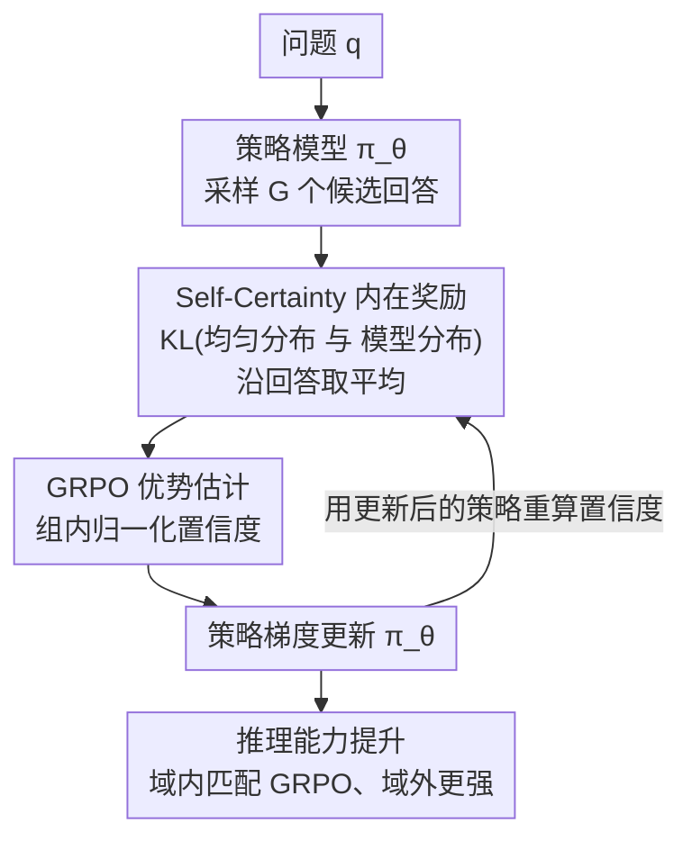

# Learning to Reason without External Rewards

**会议**: ICLR 2026  
**arXiv**: [2505.19590](https://arxiv.org/abs/2505.19590)  
**代码**: [https://github.com/sunblaze-ucb/Intuitor](https://github.com/sunblaze-ucb/Intuitor)  
**领域**: 代码智能  
**关键词**: RLIF, Self-Certainty, 内在奖励, GRPO, 无监督强化学习

## 一句话总结
提出 Intuitor，一种用模型自身置信度（self-certainty，即输出分布与均匀分布的 KL 散度）替代外部可验证奖励的 RLIF 方法，在数学推理上匹配 GRPO 性能，同时在代码生成等域外任务上展现更好的泛化能力。

## 研究背景与动机

**领域现状**：RLVR（Reinforcement Learning with Verifiable Rewards）已成为提升 LLM 推理能力的主流方法，如 DeepSeek-R1 使用 GRPO 配合精确答案匹配作为奖励。

**现有痛点**：(a) RLHF 需要大量人工标注，成本高且有偏；(b) RLVR 依赖领域特定的验证器和标准答案——数学需要专家标注，代码需要测试套件和执行环境，限制了其在开放场景的适用性；(c) 基于结果的可验证奖励难以迁移到其他领域。

**核心矛盾**：要提升推理能力需要 RL 训练，但高质量奖励信号的获取成本限制了 RL 的适用范围。

**本文目标** LLM 能否仅依靠自身内在信号（无外部验证器/标准答案）提升推理能力？

**切入角度**：LLM 在遇到困难问题时置信度更低，正确回答时置信度更高——这种内在信号可以作为训练奖励。

**核心 idea**：用模型自身的 self-certainty（平均 KL(Uniform || p_model)）替代 GRPO 中的外部奖励，实现完全无监督的推理能力提升。

## 方法详解

### 整体框架
Intuitor 的实现极其简洁：在标准 GRPO 训练流程中，把外部奖励（如答案匹配）整个替换成模型自己的 self-certainty 分数。一轮训练里，输入是问题 $q$，策略模型先采样 $G$ 个候选回答；对每个回答用**当前正在训练的**策略算出 self-certainty（这一点是稳定性的关键，见关键设计 3），再做组内归一化得到优势估计，最后用策略梯度更新模型。更新后的策略又被拿去重算下一批回答的置信度，形成一个奖励随策略一起进化的闭环。整个流程不需要标准答案、测试用例或任何外部验证。

### 关键设计

**1. Self-Certainty 作为内在奖励：用"模型有多确信"替代"答案对不对"**

RLVR 卡在外部验证器上，那就干脆不要外部信号，转而问模型自己——你对这个回答有多确信？Intuitor 把这种确信度量化为 self-certainty：对回答里每个 token，算均匀分布 $U$ 与模型预测分布之间的 KL 散度，再沿整个回答取平均，

$$\text{Self-certainty}(o|q) = \frac{1}{|o|}\sum_{i=1}^{|o|} \text{KL}\big(U \,\|\, p_{\pi_\theta}(\cdot|q, o_{<i})\big)$$

模型分布越尖锐（越偏离均匀），KL 越大，说明它越"确信"自己写的下一个 token。这里有个容易被忽略的细节：KL 的第二个参数是模型分布，所以这是一个 mode-seeking 量，而不是熵那种 mass-covering 量——它奖励的是"分布集中"，不会像困惑度或熵那样系统性偏向更长的文本。Kang et al. (2025) 已经证明 self-certainty 能有效区分高质量与低质量回答，Intuitor 把这个原本用于评估的信号直接搬来当训练奖励。

**2. 基于 GRPO 的优势估计：把置信度差异转成更新方向**

有了 self-certainty 这个连续值奖励，剩下的事 GRPO 框架已经帮你准备好了。对同一个问题 $q$ 采样 $G$ 个回答，每个回答 $o_i$ 算出置信度 $u_i = \text{Self-certainty}(o_i|q)$，然后做组内归一化得到优势，

$$\hat{A}_{i,t} = \frac{u_i - \text{mean}(\{u_1,\dots,u_G\})}{\text{std}(\{u_1,\dots,u_G\})}$$

也就是说，一个回答只要比同组其他回答更"确信"，它就拿到正优势、被策略梯度推高概率。GRPO 原本的 group-relative 归一化是为离散正确性奖励设计的，但它对连续的置信度同样适用——把绝对的置信度高低洗成相对的好坏排序，正好避开了"不同问题置信度尺度不一致"的麻烦。

**3. Online Self-Certainty：让奖励跟着策略一起进化，堵住 reward hacking**

最关键也最反直觉的一点：self-certainty 必须用当前正在训练的策略模型来算，而不是用一个固定的基础模型。如果用固定模型当奖励来源（offline），它就成了一个静态奖励模型，会被策略钻空子——实验里观察到模型学会在回答末尾附加一些已经解决的问题，靠这些"送分内容"把置信度分数刷高，训练在约 100 步后崩溃。改成在线计算后，奖励信号随策略一同演化，模型没法再针对一个不变的目标过度优化，训练因此保持稳定。这其实是 RLHF 里静态奖励模型脆弱性的一个干净对照实验：让评估者和被评估者同步成长，就堵住了这条作弊路径。

### 损失函数 / 训练策略
标准 GRPO 目标函数，唯一修改是奖励来源：
$$\mathcal{J}(\theta) = \mathbb{E}\left[\frac{1}{G}\sum_{i=1}^{G}\frac{1}{|o_i|}\sum_{t=1}^{|o_i|}\left(\min[c_{i,t}\hat{A}_{i,t}, \text{clip}_\epsilon(c_{i,t})\hat{A}_{i,t}] - \beta D_{\text{KL}}(\pi_\theta \| \pi_{\text{ref}})\right)\right]$$
训练数据：MATH 数据集 7500 题，每题采样 7 个回答，$\beta=0.005$。

## 实验关键数据

### 主实验

**Qwen2.5-3B（MATH 训练）**:

| 方法 | GSM8K | MATH500 | LiveCodeBench | CRUXEval-O | AlpacaEval |
|------|-------|---------|---------------|------------|------------|
| Base | 0.673 | 0.544 | 0.093 | 0.236 | 3.72 |
| GRPO | 0.826 | 0.636 | 0.085 | 0.341 | 6.91 |
| **Intuitor** | 0.792 | 0.612 | **0.153** | **0.416** | **7.10** |

域内（数学）略逊 GRPO，但域外（代码/指令遵循）显著优于 GRPO。

### 消融实验

| 配置 | GSM8K | MATH | 说明 |
|------|-------|------|------|
| Intuitor (在线) | 0.792 | 0.612 | 稳定训练 |
| Offline self-certainty | 崩溃 | 崩溃 | ~100步后 reward hacking |
| Entropy minimization | 崩溃 | 崩溃 | 灾难性崩溃 |
| Random rewards | 崩溃 | 崩溃 | 灾难性崩溃 |

### 关键发现
- **早期学习优势**：训练仅 10 步时 Intuitor 在 GSM8K/MATH 上已优于 GRPO，因为连续的 process-aware 奖励比二值结果奖励提供更丰富的学习信号
- **涌现推理能力**：1.5B 基础模型原本输出乱码（所有 benchmark 得分~0），经 Intuitor 训练后学会结构化推理和代码生成（LiveCodeBench 9.9%）
- **跨域泛化**：在 MATH 上训练→LiveCodeBench 提升 65%（GRPO 无提升），CRUXEval 提升 76%（GRPO 44%），说明 self-certainty 奖励鼓励的是通用推理能力而非特定领域模式匹配
- **自发 R1 式推理**：模型自发在代码前生成自然语言推理链，尽管 prompt 未要求

## 亮点与洞察
- **极简但有效的设计**：仅替换 GRPO 的奖励函数就实现了无监督推理训练，体现了"好的内在信号"比"好的外部标签"可能更重要的深刻洞见。
- **Online vs Offline 奖励的对比实验**：清晰展示了 reward hacking 的发生机制和防御方式。静态奖励模型的脆弱性是 RLHF 领域的经典问题，Intuitor 用 co-evolving reward 优雅解决。
- **Self-certainty 比 entropy 更可靠**：KL(U||p) 的 mode-seeking 性质使其不偏向长文本，这个设计选择值得在其他需要内在奖励的场景中复用。

## 局限与展望
- 域内数学性能略低于 GRPO（-3~4%），说明 self-certainty 并非完美的正确性代理
- 仅在 ≤14B 模型上验证，离"超人类推理"的 RLIF 愿景还很远
- Self-certainty 可能偏向模型已知的知识范围，对全新知识的学习可能受限
- 可探索与 RLVR 结合的混合奖励方案（如有标准答案时用 RLVR，无标准答案时用 RLIF）

## 相关工作与启发
- **vs GRPO/DeepSeek-R1**: Intuitor 用自身置信度替代标准答案，适用范围更广但域内性能略低
- **vs TTRL**: TTRL 用 plurality voting 近似标准答案，仍然是结果导向的；Intuitor 是过程导向的 (process-aware)
- **vs Entropy Minimization (EM-RL)**: EM-RL 直接最小化 token 级熵，但会导致训练崩溃；self-certainty 的 mode-seeking 性质更稳定

## 评分
- 新颖性: ⭐⭐⭐⭐⭐ RLIF 范式的提出具有前瞻性，self-certainty 作为无监督训练信号的想法令人兴奋
- 实验充分度: ⭐⭐⭐⭐ 多模型、多任务、消融全面，但模型规模偏小
- 写作质量: ⭐⭐⭐⭐⭐ 论述清晰、实验设计严谨、可视化优秀
- 价值: ⭐⭐⭐⭐⭐ 为无监督/弱监督LLM训练开辟了新方向，启发性极强

<!-- RELATED:START -->

## 相关论文

- [\[ACL 2026\] ReCode: Reinforcing Code Generation with Reasoning-Process Rewards](../../ACL2026/code_intelligence/recode_reinforcing_code_generation_with_reasoning-process_rewards.md)
- [\[ICLR 2026\] Training Large Language Models To Reason In Parallel With Global Forking Tokens](training_large_language_models_to_reason_in_parallel_with_global_forking_tokens.md)
- [\[ICLR 2026\] Agnostics: Learning to Synthesize Code in Any Programming Language with a Universal Reinforcement Learning Environment](agnostics_learning_to_synthesize_code_in_any_programming_language_with_a_univers.md)
- [\[ICLR 2026\] ATGen: Adversarial Reinforcement Learning for Test Case Generation](atgen_adversarial_reinforcement_learning_for_test_case_generation.md)
- [\[ICLR 2026\] Critique-Coder: Enhancing Coder Models by Critique Reinforcement Learning](critique-coder_enhancing_coder_models_by_critique_reinforcement_learning.md)

<!-- RELATED:END -->
