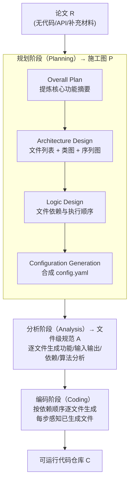

# Paper2Code: Automating Code Generation from Scientific Papers in Machine Learning

**会议**: ICLR 2026  
**arXiv**: [2504.17192](https://arxiv.org/abs/2504.17192)  
**代码**: [github.com/going-doer/Paper2Code](https://github.com/going-doer/Paper2Code)  
**领域**: 代码智能  
**关键词**: 论文转代码, 多智能体框架, 仓库级代码生成, 科学可复现性, LLM

## 一句话总结

提出 PaperCoder——一个多智能体 LLM 框架，通过规划（Planning）、分析（Analysis）、生成（Coding）三阶段流水线，将机器学习论文自动转化为可运行的代码仓库，其中 88% 的生成仓库被论文作者评为最佳，且在 PaperBench 基准上大幅超越基线。

## 研究背景与动机

1. 可复现性是科学进步的核心，但顶会论文的代码可用率仅约 19.5%（2024 年），研究者常需从论文逆向工程方法和实验结果，极为耗时。
2. LLM 已展现出卓越的科学文档理解和高质量代码生成能力，但现有科学工作流自动化方法（如 ideation、实验改进）通常依赖预先存在的代码实现。
3. 仓库级代码生成远比单文件代码生成复杂，需要架构设计、模块结构和跨文件依赖的协调。
4. 论文的写作目的是向人传达思想，包含高层动机、叙事等内容，从软件工程角度看是嘈杂、松散和模糊的。
5. 现有多智能体代码生成框架（ChatDev、MetaGPT）采用自底向上策略，从短需求描述出发逐步扩展，不适合处理长篇科学文档。
6. 核心挑战：仅从论文（无代码、API 或补充材料）出发，能否生成忠实的代码实现？

## 方法详解

### 整体框架

论文的写作目的是把思想讲给人听，从软件工程角度看是松散、模糊、缺少可执行结构的；而像 ChatDev、MetaGPT 这类多智能体框架走的是自底向上路线，从一句短需求逐步扩展，面对一篇完整论文很容易迷失。PaperCoder 反其道而行，模拟一个人类开发者拿到论文后的真实工作流：先通读全文做规划，再逐文件做分析，最后才动手写代码。整套系统拆成三个串联阶段，前一阶段的输出作为后一阶段的输入，让非结构化的论文 $R$ 逐步收敛到可运行的仓库 $C$：

$$\text{Planning: } P = M_{\text{plan}}(R), \quad \text{Analysis: } A = M_{\text{analysis}}(R, P), \quad \text{Coding: } C = M_{\text{code}}(R, P, A)$$

### 关键设计

**1. 规划阶段（Planning）：把整篇论文先拆成一份可执行的施工图**

直接让 LLM 从论文一把生成整个仓库，等于跳过了人类开发者最关键的"先想清楚再动手"。规划阶段用四个顺序子组件，把模糊的论文内容逐级收敛成实现级抽象。先是 **Overall Plan**，提炼出模型组件、训练目标、数据处理、评估协议这些核心功能的高层摘要，相当于先读懂论文到底要做什么；接着 **Architecture Design** 定义仓库级架构，产出文件列表、刻画静态结构的类图和刻画动态交互的序列图；然后 **Logic Design** 指定文件之间的依赖关系和执行顺序——这一步看似琐碎，却是后续编码不出错的前提，因为只有先确定"B 依赖 A 的模块"才能保证生成时先 A 后 B；最后 **Configuration Generation** 合成一份 `config.yaml`，把超参数、模型设置、运行时选项集中起来，方便研究者后续直接改实验配置。

**2. 分析阶段（Analysis）：在写每个文件之前，先把它该干什么逐字想明白**

规划给出了文件清单，但每个文件具体怎么实现仍是空白。分析阶段对规划中识别出的每个文件 $f_i$ 单独生成一份文件级分析 $a_i$，内容覆盖这个文件的功能目标、输入输出行为、文件内与文件间的依赖关系，以及从论文正文反推出来的算法规范。等于在编码前先为每个文件写好一份详细需求说明，把论文里散落各处的细节归拢到对应文件上。

**3. 编码阶段（Coding）：按依赖顺序逐文件生成，每一步都看得见仓库的当前状态**

有了规划的施工图和每个文件的分析，编码阶段才动手写代码。它严格按 Logic Design 给出的执行顺序逐个生成文件，且第 $i$ 个文件的生成不是孤立的——它同时拿到原始论文 $R$、整体规划 $P$、自己的文件信息 $f_i$ 和分析 $a_i$，以及前面所有已生成文件 $\{c_1, ..., c_{i-1}\}$：

$$c_i = \text{LLM}(\mathcal{T}_{\text{code}}(R, P, f_i, a_i, \{c_1, ..., c_{i-1}\}))$$

这样每写一个新文件，模型都充分感知到已有的依赖和仓库的当前状态，跨文件调用才能对得上，避免自底向上方法常见的"后写的代码和先写的接口对不齐"。

### 损失函数/训练策略

- 非训练框架，基于提示工程的多智能体系统
- 默认使用 o3-mini-high 作为骨干 LLM
- 支持 Self-Refine 验证-精炼步骤，可进一步提升各阶段输出质量
- 评估：reference-based（有作者代码时）+ reference-free（无代码时）+ human evaluation（论文一作打分）

## 实验关键数据

### 主实验

**Paper2CodeBench（90 篇论文，ICLR/ICML/NeurIPS 2024）**：

| 方法 | Ref-Based (ICLR) | Ref-Based (ICML) | Ref-Based (NeurIPS) | Ref-Free (ICLR) | Ref-Free (ICML) | Ref-Free (NeurIPS) |
|------|---------|---------|---------|---------|---------|---------|
| ChatDev | 2.70 | 2.97 | 2.96 | 4.00 | 4.12 | 4.01 |
| MetaGPT | 2.48 | 2.75 | 2.95 | 3.52 | 3.63 | 3.59 |
| Paper (one-shot) | 3.08 | 3.28 | 3.22 | 4.15 | 4.30 | 4.08 |
| **PaperCoder** | **3.68** | **3.72** | **3.83** | **4.73** | **4.73** | **4.77** |
| Oracle (作者代码) | N/A | N/A | N/A | 4.84 | 4.80 | 4.83 |

**PaperBench Code-Dev（20 篇 ICML 2024）**：

| 方法 | Replication Score (o3-mini) | Replication Score (Claude 3.5) |
|------|---------|---------|
| BasicAgent | 5.1% | 35.4% |
| IterativeAgent | 16.4% | 27.5% |
| **PaperCoder** | **45.14%** | **51.14%** |

### 消融实验

| 组件累积 | Ref-Based | Ref-Free |
|----------|-----------|----------|
| Paper only | 3.28 | 4.30 |
| + Overall Plan | 3.40 | 4.34 |
| + Arch. Design | 3.13 (↓) | 4.07 (↓) |
| + Logic Design | 3.60 | 4.50 |
| + Config File | 3.66 | 4.45 |
| + Analysis (Full) | **3.72** | **4.73** |

### 关键发现

1. **PaperCoder 接近作者水平**：Ref-Free 评分（~4.74）与 Oracle（~4.82）无统计显著差异。
2. **自顶向下策略的优势**：先系统分析全文再生成代码，优于 ChatDev/MetaGPT 的自底向上扩展策略。
3. **Logic Design 是关键转折点**：单独加入 Architecture Design 反而降分（无执行顺序导致混乱），但加入 Logic Design 后性能大幅回升。
4. **人类评估一致性**：88% 的 PaperCoder 生成仓库被一作评为最佳，92% 表示"确实有帮助"。
5. **可执行性**：平均仅需修改 0.81% 的代码行即可成功执行。

## 亮点与洞察

1. 定义并系统化了"论文到代码"这一新任务，构建了完整的评估体系（Paper2CodeBench）。
2. 三阶段流水线设计精巧——模拟人类开发者的 Plan → Analyze → Code 工作流，每阶段由专门智能体执行。
3. 评估框架全面：reference-based + reference-free + 论文一作人类评估三位一体，且验证了 model-based 与 human evaluation 的高相关性（r=0.79）。
4. Self-Refine 实验表明早期规划输出的精炼可传导至下游编码质量提升（Config File 提升幅度最大 +1.00）。

## 局限与展望

1. 强依赖骨干 LLM 能力——开源模型（DS-Coder、Qwen-Coder）性能显著低于 o3-mini-high，实用性受限于 API 成本。
2. 数据处理覆盖率最低——论文通常对数据格式、预处理步骤描述不足，是生成错误的主要来源。
3. 仅评估 ML 领域论文，对其他科学领域（物理、生物）的泛化性未知。
4. 评估指标以 LLM 判断为主，虽与人类评分相关性高但仍非完全替代。

## 相关工作与启发

- **ChatDev / MetaGPT**：多智能体代码开发框架，自底向上策略，不适合处理长篇论文输入。
- **PaperBench (Starace et al.)**：并发工作，提供带人类标注 rubric 的评估基准（20 篇 ICML 论文），侧重评估而非方法。
- **Self-Refine (Madaan et al.)**：验证-精炼范式，被整合到 PaperCoder 的规划和分析阶段。
- 启发：论文到代码的自动化可大幅加速科学可复现性，但需要"先理解全局再编码"的自顶向下方法论。

## 评分

- ⭐ 新颖性: 4/5 — 新任务定义（Paper2Code）+ 结构化三阶段框架 + 完整评估体系
- ⭐ 实验充分度: 4.5/5 — 90 篇论文自动评估 + 21 篇人类评估 + PaperBench 外部验证 + 丰富消融
- ⭐ 写作质量: 4.5/5 — 论文结构清晰，形式化准确，图表质量高
- ⭐ 价值: 4.5/5 — 直接解决 ML 社区的可复现性痛点，代码已开源，具有广泛影响力

<!-- RELATED:START -->

## 相关论文

- [\[ICLR 2026\] ShieldedCode: Learning Robust Representations for Virtual Machine Protected Code](shieldedcode_learning_robust_representations_for_virtual_machine_protected_code.md)
- [\[ACL 2026\] SciCoQA: Quality Assurance for Scientific Paper–Code Alignment](../../ACL2026/code_intelligence/scicoqa_quality_assurance_for_scientific_paper--code_alignment.md)
- [\[ICLR 2026\] Agnostics: Learning to Synthesize Code in Any Programming Language with a Universal Reinforcement Learning Environment](agnostics_learning_to_synthesize_code_in_any_programming_language_with_a_univers.md)
- [\[ICLR 2026\] The Natural Geometry of Code: Hyperbolic Representation Learning for Program Reasoning](the_natural_geometry_of_code_hyperbolic_representation_learning_for_program_reas.md)
- [\[ICLR 2026\] WebGen-Agent: Enhancing Interactive Website Generation with Multi-Level Feedback and Step-Level Reinforcement Learning](webgen-agent_enhancing_interactive_website_generation_with_multi-level_feedback_.md)

<!-- RELATED:END -->
