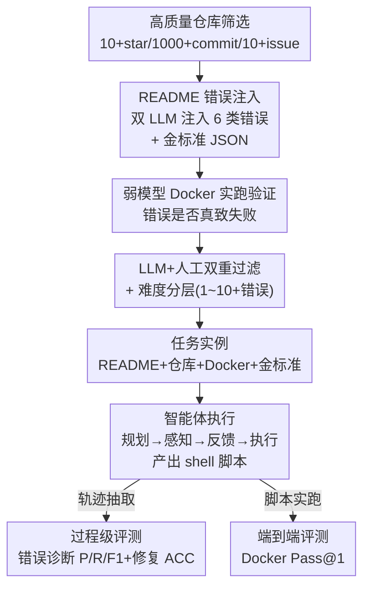

# Process-Level Trajectory Evaluation for Environment Configuration in Software Engineering Agents

**会议**: ICLR 2026  
**OpenReview**: [https://openreview.net/forum?id=Q8qgloDKUO](https://openreview.net/forum?id=Q8qgloDKUO)  
**代码**: https://github.com/TencentYoutuResearch/EnConda-Bench  
**领域**: 代码智能 / SWE Agent / 评测基准  
**关键词**: 环境配置, 过程级评测, 软件工程智能体, README 错误注入, 自动化数据构建

## 一句话总结
针对 SWE 智能体"装环境"这个最基础却最易卡壳的环节，本文提出 EnConda-Bench：通过往正确 README 里注入 6 类真实错误来自动造题，把传统只看"最后能不能 build/test 通过"的黑盒评测，拆解成对智能体**规划—感知—反馈—执行**四类能力的过程级诊断，发现当前智能体"能找到错却改不对错"是性能瓶颈。

## 研究背景与动机
**领域现状**：以 OpenHands、SWE-Agent 为代表的代码智能体在 SWE-bench 这类任务上已能改 bug、提 PR。但在真正动手改代码之前，必须先把仓库的运行环境配好——装依赖、对版本、跑通测试——这是整条流水线最基础也最容易翻车的第一步，无论对人类工程师还是 LLM 都很折磨。

**现有痛点**：现有的环境配置基准（INSTALLAMATIC、ExecutionAgent、EnvBench、SetupBench 等）几乎只看一个**端到端的二元结果**：build + test 到底过没过。这种粗粒度评测有两个硬伤。其一，它说不清智能体到底**卡在哪一步、缺哪种能力**——是没规划好步骤，还是定位不到错误，还是定位到了却改不对，从一个"Pass/Fail"里完全看不出来。其二，高质量、可复现的仓库本身稀缺，人工标注错误成本极高，导致这类基准规模都很小（几十到几百条），难以支撑大规模训练和评测。

**核心矛盾**：环境配置是一个**多阶段、长轨迹**的过程，但评测信号却被压缩成轨迹末端的一个布尔值，过程中的能力维度被完全淹没。而想直接从长轨迹里抠出"规划段""反馈段"来单独评，又极度依赖模型自身、几乎无法稳定切分。

**本文目标**：(1) 把端到端评测拆成沿配置轨迹的过程级评测，分别考察规划、感知、反馈、执行四类能力；(2) 设计一套自动化造题流水线，低成本规模化地产出高质量任务实例。

**切入角度**：作者观察到人类工程师配环境的真实模式是——**先照着 README 走，遇到报错再定位、再修**。受此启发，与其去切分难以拆解的长轨迹，不如**反过来主动制造可控的错误**：拿一份原本正确的 README，往里注入错误命令或误导步骤，逼智能体在执行中去定位并修复。这样每个错误的类型、位置、正确改法都是已知的金标准，过程级评测自然就有了锚点。

**核心 idea**：用"在正确 README 上注入已知错误"代替"从长轨迹里抽取能力片段"，把不可观测的过程能力变成可逐项打分的诊断任务。

## 方法详解

### 整体框架
EnConda-Bench 由两条主线构成：一条是**自动化数据构建流水线**（造题），一条是**双轨评测套件**（评测）。造题这边，从 GitHub 按硬指标筛出高质量仓库，用两个强 LLM 把仓库 README 改写、注入 2 个错误并标注金标准 JSON，再用一个**弱模型**在 Docker 里实跑来验证错误是否真的会让配置失败，最后经 LLM + 人工双重过滤留下有效实例，并通过拆分/合并错误把难度从 1 到 10+ 错误分层。评测这边，每个实例给智能体一份（被污染的）README、仓库信息和 Docker 基础镜像，智能体规划步骤、感知错误、反馈修复、最终产出一份 shell 配置脚本；评测同时打两类分：**过程级**（错误类型/描述/修复建议对不对，用 P/R/F1 + LLM judge）和**端到端**（脚本在 Docker 里实跑能否 build 通过并跑过测试，Pass@1）。

### 关键设计

**1. 过程级轨迹评测：把"装没装好"拆成四类能力的诊断**

针对"端到端二元结果说不清缺什么能力"这个痛点，本文把智能体配环境的轨迹显式对应到四类能力：**规划**（planning，给定任务拆出合理的配置步骤序列）、**感知**（perception，准确定位错误成因，如版本不兼容、缺依赖）、**反馈**（feedback，分析错误并形成修复策略）、**执行**（action，把修复落成可运行命令并最终跑通）。评测时从智能体轨迹里抽出三样东西——错误类型判断、错误描述、修复命令，以及最终 shell 脚本——分别对应感知、反馈、规划+执行。这样一次评测能同时回答"哪类能力弱、哪类错误更难被发现"，而不是只给一个 Pass 率。正是这种拆解，让作者发现了"能定位错误但反馈转不成有效修复"这一全局瓶颈。

**2. README 错误注入的任务范式：把正确 README 当作金标准反向造题**

针对"长轨迹无法稳定切分能力片段、且高质量仓库稀缺"的痛点，作者不去切分轨迹，而是把每份可正常执行的 README 视为 ground truth，往里**注入错误**。他们定义 6 类规范化错误：依赖安装错误(E1)、命令用法/语法错误(E2)、文件路径或缺失文件错误(E4)、逻辑顺序错误(E6)、版本兼容错误(E7)、其他杂项(E8)。注入时要求**最小编辑**——只改必要的几行，避免大改破坏 README 完整性。这样每条样本天然带有"错误标签 + 具体描述 + 正确改法"三件套，过程级评测因此有了精确锚点；而且造题可规模化（从 323 个仓库产出 1772 份含错 README），彻底绕开了"逐条人工标注"的瓶颈。

**3. 自动化数据构建流水线：强模型造题、弱模型把关、双重过滤保真**

针对"LLM 造的错误可能不真实、或根本不会致失败"的风险，作者设计了一条四步流水线，并刻意做了一个反直觉的选择。仓库先按硬指标筛（≥10 star、>1000 commit、>10 closed issue）并复用已有基准里经人工核验的仓库。错误注入用 claude-4-sonnet 和 gemini-2.5-pro 两个强模型，每份 README 注入 2 个错误。**验证环节故意用弱模型 gpt-4.1-mini** 在 Docker 里实跑：一个注入错误算"有效"当且仅当照着含错 README 配会失败、而修复后该步骤能走通——之所以不用强模型，是因为强模型会"偷偷自动修错"，跑出的脚本偏离含错 README，反而验不出错误的有效性。最后用 gpt-4.1-mini 按预设标准做 LLM 过滤、再人工复核，二者一致率达 98.5%。最终保留 1230 份有效含错 README，再通过拆分/合并错误构造 1–10+ 错误的难度梯度，得到 4201 份 README、9471 个错误。

**4. 双轨评测套件：过程级诊断 + Docker 端到端可执行性**

针对"只看 Pass 率掩盖能力差异"的问题，评测套件同时跑两条线。**过程级**：因为一份 README 可能含多个错误，把智能体预测的错误类型/描述与金标准集合比对，报 precision/recall/F1；再把每条预测的错误描述和修复对到金标准答案，用 GPT-4.1-mini 当 judge 评一致性与准确率（描述 ACC、修复 ACC）。**端到端**：脚本在固定 commit 的 Docker 容器里实跑，只有成功 build 环境、测试文件正确执行、进程正常退出三者全满足才记为 Pass@1。两条线合起来，既能看智能体"想得对不对"，也能看它"做得成不成"，并暴露二者之间的落差。

### 一个例子：一条 Ajenti 实例怎么走完全程
以仓库 ajenti 的一条实例为例：注入的错误是命令用法错误——README 写成 `pip install -r requirements.txt --update-all`，而 `--update-all` 根本不是合法 pip 参数。金标准 JSON 标注 error_type 为"Command Usage or Syntax Error"，候选修复给出 `pip install -r requirements.txt` 等，golden_answer 锁定为前者。智能体执行时需要：(1) 感知——判断出这是命令语法错误并描述清楚 `--update-all` 非法；(2) 反馈——给出正确的修复命令；(3) 执行——产出一份完整的 bash 脚本（含系统包更新、依赖安装等）。评测时一边把它的"错误类型判断 + 错误描述判断"和金标准比对算过程级分，一边把 shell 脚本丢进 Docker 实跑看是否 Success。智能体往往能在第一步把错误类型判对，却在最后一步把脚本跑挂——这正是基准想暴露的"感知强、执行弱"。

## 实验关键数据

### 主实验
作者在四个基座 LLM（GPT-4.1、Claude-4-sonnet、Gemini2.5-Pro、DeepSeek-V3，外加 GPT-5-Codex）× 三类框架（Zero-Shot / 代码智能体 OpenHands、SWE-Agent / 环境配置智能体 INSTALLAMATIC、Repo2Run）上评测。核心指标：错误类型 Pre./Rec./F1、修复描述 ACC、修复建议 ACC、端到端 Pass@1。

| 框架 | LLM | 类型 F1 | 描述 ACC | 修复 ACC | Pass@1 |
|------|-----|---------|---------|---------|--------|
| Zero-Shot | GPT-4.1 | 48.8 | 39.6 | 18.2 | 1.5 |
| Zero-Shot | Claude-4 | 50.8 | 45.1 | 28.5 | 3.1 |
| Code Agent (OpenHands) | DeepSeek-V3 | 58.7 | 51.9 | 33.8 | 9.1 |
| Code Agent (SWE-Agent) | GPT-5-Codex | 66.4 | 58.7 | 41.2 | 11.5 |
| Env Agent (Repo2Run) | Claude-4 | 60.6 | 52.2 | 47.3 | 22.9 |

关键趋势：Zero-Shot LLM **召回高但精度低**（GPT-4.1 Rec. 90.6 vs Pre. 33.4），即"广撒网式"地乱报错误，修复建议弱、端到端几乎全挂（Pass@1 仅 1.5）。代码智能体显著改善感知与反馈（OpenHands+DeepSeek-V3 F1 58.7、描述 ACC 51.9），但修复 ACC 33.8、Pass@1 9.1，执行仍弱。环境配置智能体端到端收益最大（Repo2Run+Claude-4 Pass@1 22.9），印证"环境探查感知 + 失败处理反馈"的价值。但贯穿全表的现象是：**描述 ACC > 修复 ACC > Pass@1** 三级递减——智能体能描述错误，却越往"真正改对并跑通"越掉，把正确反馈转成稳健执行动作是核心瓶颈。

### 数据质量与基准对比

| 对比项 | EnConda-Bench | 既有基准 |
|--------|---------------|---------|
| 实例数 | 4,201 | 40~994 |
| 评测粒度 | 过程级 + 端到端 | 仅端到端 |
| 难度均分(1-5) | 3.95 | 3.78~4.08（真实仓库） |
| 错误真实性盲测 | 被判"真实"54.7% | 真实错误被判"真实"58.0% |

难度盲测里，专家给 EnConda-Bench 采样 100 条打的均分 3.95，与真实仓库基准（3.78~4.08）几乎重合；把 50 条生成错误和 50 条 GitHub 真实错误混在一起让 3 位工程师盲判，生成错误被误判为"真实"的比例 54.7%，与真实错误自身被认出的 58.0% 统计上相当——说明合成错误几乎以假乱真。

### 关键发现
- **能找错但改不对**是全局瓶颈：描述准确率到修复准确率、再到 Pass@1 逐级断崖，说明感知/反馈到执行动作之间存在系统性鸿沟。
- **错误类型预测偏保守且爱用兜底类**：多数模型预测总数超过金标准（过度报错），且大量样本被塞进"其他(E8)"这一兜底类，导致 E8 的 F1 极低、真实类型召回被压低；DeepSeek-V3 则几乎不预测 E6（逻辑顺序错误），属于该类的欠检测。
- **错误类型间有系统性难度差异**：命令语法错误(E2)更易检测，而文件路径错误(E4)依赖对整个仓库的系统级理解和与环境的交互，明显更难。
- **多花 token 不一定更对**：错误描述准确率随输出 token 增加大体上升，但 Pass@1 不随 token 增加而稳定提升（如 Zero-Shot Claude-4 用了 3 倍 token 也没换来对应回报），说明"想得多"≠"做得成"。

## 亮点与洞察
- **反向造题的巧思**：与其和"长轨迹难切分"硬碰，不如把正确 README 当金标准注入已知错误——一举同时解决了"过程级评测缺锚点"和"高质量数据稀缺"两个老大难，这个视角的反转是全文最"啊哈"的地方。
- **弱模型当验证器**是反直觉但正确的工程决策：强模型会偷偷自动修错，反而验不出注入错误是否有效，因此故意用 gpt-4.1-mini 实跑把关。这个 trick 可迁移到任何"需要验证注入扰动是否真生效"的数据构建场景。
- **把能力维度显式化**的评测设计：规划/感知/反馈/执行四分法 + 描述 ACC/修复 ACC/Pass@1 三级指标，让"瓶颈在哪"从模糊直觉变成可量化结论，对后续做环境配置智能体的训练目标设计很有指导性。
- 难度分层（1–10+ 错误）和最小编辑约束，使基准既有梯度又保持 README 真实性，可直接产出训练轨迹用于后训练甚至预训练。

## 局限与展望
- 错误由 LLM 注入，虽然盲测显示难以与真实错误区分，但终究是"人造扰动"，可能仍系统性偏离真实世界长尾故障（如罕见平台异构、隐蔽的系统包冲突）。
- 修复建议与一致性判断依赖 GPT-4.1-mini 当 judge，评测信号本身带 LLM 偏差；E8 兜底类的 F1 失真也部分源于类型边界与判分方式。
- 当前主要是**评测基准**，虽然提到能产出后训练/预训练轨迹数据，但没有给出"用这些轨迹训练后智能体执行能力是否真的提升"的闭环实验。
- 难度仅以"注入错误个数"分层，未必等同于真实配置任务的认知难度（一个隐蔽的版本错误可能比 5 个显眼依赖错误更难）。
- 改进思路：把过程级反馈信号直接做成 reward（如对"找对错却改错"施加针对性惩罚），用强化学习专门补"反馈→执行"这一段短板。

## 相关工作与启发
- **vs INSTALLAMATIC / ExecutionAgent / EnvBench / SetupBench**：这些基准只看端到端 build/test 成功，实例规模 40~994，且无法定位失败阶段；本文 4201 实例并首次提供过程级（错误检测与修复）+ 端到端双轨评测，能指出"缺哪种能力"而非只给 Pass 率。
- **vs Repo2Run（环境配置智能体）**：Repo2Run 用双环境架构 + 失败回滚机制专注"把环境配通"，是被评测的强 baseline（端到端最好）；本文不造智能体而造**评测与造题框架**，反过来诊断包括 Repo2Run 在内所有智能体的过程能力短板。
- **启发**：把"端到端黑盒指标"拆成"沿轨迹的能力维度诊断"这一思路，可迁移到任何长流程智能体评测（如 GUI agent、科研 agent）——只要能在正确流程上注入可控扰动并标注金标准，就能把不可观测的中间能力变成可逐项打分的诊断任务。

## 评分
- 新颖性: ⭐⭐⭐⭐⭐ 反向注入造题 + 过程级四能力诊断，切入角度新且解决了真实痛点
- 实验充分度: ⭐⭐⭐⭐ 覆盖多 LLM × 多框架，含难度/真实性/效率多维分析，但缺"用轨迹训练后提升"的闭环
- 写作质量: ⭐⭐⭐⭐ 动机链条清晰，任务定义与流水线讲得明白
- 价值: ⭐⭐⭐⭐⭐ 给 SWE 智能体"配环境"这一卡脖子环节提供了可诊断、可规模化的基准，落地价值高

<!-- RELATED:START -->

## 相关论文

- [\[ICLR 2026\] SWE-RM: Execution-Free Feedback for Software Engineering Agents](swe-rm_execution-free_feedback_for_software_engineering_agents.md)
- [\[ICLR 2026\] Ambig-SWE: Interactive Agents to Overcome Underspecificity in Software Engineering](ambig-swe_interactive_agents_to_overcome_underspecificity_in_software_engineerin.md)
- [\[ICML 2026\] MEnvAgent: Scalable Polyglot Environment Construction for Verifiable Software Engineering](../../ICML2026/code_intelligence/menvagent_scalable_polyglot_environment_construction_for_verifiable_software_eng.md)
- [\[ICLR 2026\] BOAD: Discovering Hierarchical Software Engineering Agents via Bandit Optimization](boad_discovering_hierarchical_software_engineering_agents_via_bandit_optimizatio.md)
- [\[NeurIPS 2025\] SWE-rebench: An Automated Pipeline for Task Collection and Decontaminated Evaluation of Software Engineering Agents](../../NeurIPS2025/code_intelligence/swe-rebench_an_automated_pipeline_for_task_collection_and_decontaminated_evaluat.md)

<!-- RELATED:END -->
