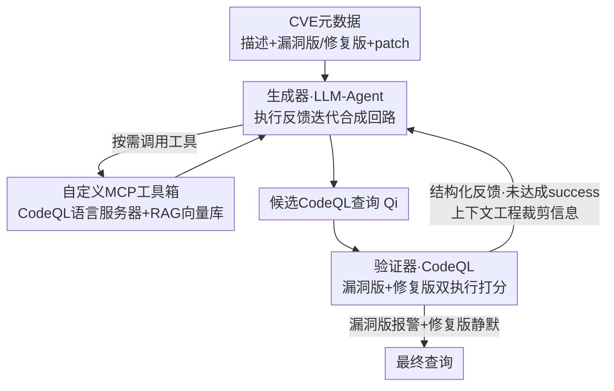

# QLCoder: A Query Synthesizer For Static Analysis of Security Vulnerabilities

**会议**: ICLR 2026  
**OpenReview**: [https://openreview.net/forum?id=J91IKwJrqv](https://openreview.net/forum?id=J91IKwJrqv)  
**代码**: https://github.com/neuralprogram/qlcoder  
**领域**: 代码智能 / Agent / 程序静态分析  
**关键词**: CodeQL、漏洞检测、查询合成、Agentic、MCP、执行反馈

## 一句话总结
QLCoder 把一个 LLM-Agent 嵌进「生成候选查询 → CodeQL 执行打分 → 按反馈修补」的迭代回路里，并用自定义 MCP 工具箱（CodeQL 语言服务器保语法 + RAG 向量库保语义）约束它的推理，从 CVE 元数据自动合成出能"在漏洞版本报警、在修复版本静默"的 CodeQL 查询；在 176 个真实 Java CVE 上成功率 53.4%，F1 0.70，远超直接用 Claude Code（10%）和 IRIS/CodeQL 现成查询套件（F1 0.048 / 0.073）。

## 研究背景与动机

**领域现状**：静态分析（CodeQL、Semgrep、Infer）是工业界检测安全漏洞的主流手段——它们提供领域专用查询语言，让人把"漏洞代码模式"写成查询，然后在抽象语法树等代码结构表示上执行，从而发现潜在漏洞。其中 CodeQL 的查询语言表达力最强，能刻画跨过程（inter-procedural）的复杂漏洞模式。

**现有痛点**：现成查询套件的覆盖率和精度都很差，而扩写它们即便对专家也很难——要同时懂一门冷门查询语言的语法、懂程序分析概念、懂安全知识。写错的查询要么误报一堆、要么漏掉真 bug。与此同时，CVE 数据库里其实躺着大量富信息：漏洞的自然语言描述、受影响仓库的"漏洞版/修复版"快照、修复 patch——但这些资源在"自动构造静态分析查询"这件事上几乎没被利用。

**核心矛盾**：从 CVE 自动合成查询有几个紧耦合的难点。其一，CodeQL 语法低资源、表达力强又持续演化，谓词名、限定符、AST 导航上的小错就会产出"语法合法但语义无用"的查询。其二，source / sink / sanitizer 往往散落在不同文件、靠 lambda、工厂模式等非平凡的跨过程流连接，CodeQL 默认数据流分析会留下需要手写 taint step 补的缺口。其三，成功的判据很苛刻——查询不仅要能编译，还必须在漏洞版本里找到一条穿过 patch 区域的数据流路径，同时在修复版本里对该漏洞保持沉默。

**本文目标**：给定漏洞版本 $P_{vuln}$、修复版本 $P_{fixed}$ 和 CVE 文本描述，自动合成一个 CodeQL 查询 $Q$，满足良构性、漏洞检测、修复判别三条要求。

**切入角度**：朴素地让 LLM 一把生成查询会产出畸形语法、幻觉出已废弃的构造、或漏掉细微模式。作者的观察是——查询的"对不对"本来就有一个可执行的客观裁判（在两个版本上跑一遍），所以应该把 LLM 放进一个带执行反馈的合成回路里，并用结构化工具约束它的语法与语义推理，而不是靠它一次猜对。

**核心 idea**：用"执行反馈迭代回路 + 自定义 MCP 工具箱（LSP 保语法、RAG 保语义）+ 上下文工程"三件套，把通用编码 Agent（Claude Code）改造成专门的漏洞查询合成器。

## 方法详解

### 整体框架
QLCoder 运行在一个"仓库感知"的迭代精化回路里。输入是一条 CVE 的元数据（漏洞描述 + 漏洞版/修复版仓库 + 从 patch commit 自动切出的 patch）；输出是一个 CodeQL 路径查询。每一轮里：**生成器**（LLM-Agent）提出一个候选查询，**验证器**（基于 CodeQL）在漏洞版和修复版上各执行一遍并打分，生成器再读反馈做有针对性的修补。当验证器判定查询"成功"（漏洞版报警、修复版静默）时回路终止并返回该查询；否则跑满预设的迭代上限 $N=10$ 即失败。生成器内部还有一个最多 $M=50$ 轮的对话子回路，每轮要么做内部推理、要么以 JSON 形式发起一次工具调用，工具都通过自定义 MCP 服务器暴露——一个 RAG 向量库（语义检索）和一个 CodeQL 语言服务器（语法引导）。

### 关键设计

**1. 执行反馈驱动的迭代合成回路：让客观裁判逼 Agent 收敛**

针对"LLM 一把生成的查询大概率畸形或语义跑偏"这个痛点，QLCoder 不追求一次猜对，而是把合成形式化成一个带终止判据的迭代过程。问题被刻画成 taint 分析：查询 $Q$ 在代码图 $G$ 上求值得到一组数据流路径 $\Pi = [\![Q]\!](G)$，每条路径 $\pi=\langle v_1,\dots,v_k\rangle$ 从 source 走到 sink。成功判据有三条——良构性（语法合法、可在目标 CodeQL 基础设施上执行）、漏洞检测（$\exists \pi \in [\![Q]\!](G_{vuln})$ 使 $\pi \cap \Delta V \neq \emptyset$，即漏洞版里有路径穿过 patch 修改的节点集 $\Delta V$）、修复判别（$\forall \pi \in [\![Q]\!](G_{fixed}),\ \pi \cap \Delta V = \emptyset$，即修复版里没有路径还穿过 patch 区域）。验证器从 CVE 元数据里的 patch commit hash 自动切出漏洞版和修复版，编译并执行候选查询，回传一份结构化报告：编译结果、两版本上的匹配计数、recall/coverage 统计、具体反例 trace 与命中位置、以及一组按优先级排好的下一步建议（如"加限定符""合成 sanitizer 检查""扩展 taint step"，由模板程序化生成）。这个"执行→打分→反例→建议"的闭环把抽象的"对不对"翻译成 Agent 能直接消化的修补指令，这正是它能从 Claude Code 裸跑的 10% 成功率拉到 53.4% 的关键。

**2. 自定义 MCP 工具箱：LSP 管语法、RAG 管语义，按需取信息**

针对"CodeQL 语法脆弱 + 关键节点散落跨文件"两个痛点，QLCoder 设计了两台 MCP 服务器，把约束信息以"按需检索"的方式喂给 Agent，而不是塞满 prompt。**CodeQL 语言服务器** 这一侧，作者自己写了 CodeQL Language Server 客户端和 MCP 封装，把 `complete(file, loc, char)`、`diagnostics(file)`、`definition(file, loc, char)` 等调用转发给底层 CodeQL 进程并返回 JSON——补全帮 Agent 填查询模板、发现正确的 API/AST 名字，诊断则暴露编译/linter 错误（如未知谓词名）来引导修补，且专门保证目标 CodeQL 版本的语法有效性，从根上压住"off-by-name"和版本错配。**RAG 向量库** 这一侧用 ChromaDB 存放大体量参考语料：漏洞分析笔记与 diff、CWE 定义、同版本 CodeQL API 文档、精选 CodeQL 样例查询、以及从目标仓库 patch 文件里抽出的小段 AST 片段（作者手工过滤掉与该 CVE 无关的非 Java/二进制文件后再抽 AST）。语料可达数万条，但 Agent 每次只发紧凑检索查询、拿回排序后的少量片段——样例查询启发整体结构、AST 片段提示精确的语法导航、漏洞 writeup 帮它区分 buggy 与 patched 行为。这种"demand-driven lookup"让 Agent 拿到高质量信息而不污染主 prompt。

**3. 上下文工程：把信息喂得"刚刚好"，避免上下文腐烂**

针对"信息给多了 LLM 反而被搞糊涂、成本爆炸"这个隐性痛点，作者把"该给 Agent 看什么、什么时候看"本身当成一个设计问题（称为 Context Engineering），并通过一系列消去实验得出的取舍来落地。首轮 prompt 里给一个查询骨架做参考；后续轮里 prompt 只装合成目标摘要、上一版候选查询 $Q_{i-1}$、以及验证器反馈（强调成功判据、上一轮的具体反例、可调用工具清单）。几个关键裁剪都来自"试过但无效"的反面经验：放开让 Agent 随意 compile-and-run 会被它滥用（编译和全量执行很贵），所以对话期间只暴露轻量 diagnostics、把完整编译执行推迟到每轮结尾；允许 web search 会污染上下文又烧钱，于是砍掉；给一大堆异构工具会让 Agent 选择困难，于是工具箱保持小而精；跨轮保留完整对话历史会引发上下文腐烂、prompt 越滚越大，于是历史只在单轮内本地保留、轮间不携带。消融数据印证了这些取舍的分量——见下表 LSP 与文档检索一旦移除，成功率断崖式下跌。

## 实验关键数据

### 主实验
评测基准为 CWE-Bench-Java：176 个 CVE、111 个 Java 项目、42 类 CWE，项目规模 0.01–1.5 MLOC，并特意纳入 65 个 2025 年（模型训练截止后）的 CVE，目标 CodeQL 版本 2.22.2（2025 年 7 月）。主框架基于 Claude Code + Claude Sonnet 4。

| 方法 | Recall (%) | Avg Precision | Avg F1 |
|------|-----------|---------------|--------|
| CodeQL（现成套件） | 20.0 | 0.055 | 0.073 |
| IRIS（LLM 辅助分析器） | 35.4 | 0.031 | 0.048 |
| **QLCoder** | **80.0** | **0.672** | **0.700** |

QLCoder 在 176 个 CVE 上整体成功率 53.4%（编译成功率 100%）。CodeQL 的查询太宽泛（按 CWE 粗分类），IRIS 只生成 source/sink 谓词、不生成 sanitizer 和 taint step 谓词——这正是两者 precision 极低的原因。按 CWE 看，反序列化（CWE-502）成功率最高 66.7%、平均精度 0.853，路径遍历（CWE-022，48 个样本）成功率 64.6%。训练截止前后对比：Pre-2025 成功率 57.7%、2025+ 仍有 46.2%，说明性能不是靠"背过"训练数据。

### 消融实验（20 个 CVE）

| 变体 | 成功率 | Recall | Avg Precision | Avg F1 |
|------|--------|--------|---------------|--------|
| QLCoder（完整） | 55% | 80% | 0.67 | 0.69 |
| w/o LSP | 25% (−30%) | 55% | 0.32 | 0.36 |
| w/o Doc/Ref（RAG 文档） | 20% (−35%) | 55% | 0.32 | 0.36 |
| w/o AST 缓存 | 25% (−30%) | 80% (±0%) | 0.41 | 0.47 |
| Claude Code（无任何工具） | 10% (−45%) | 55% | 0.33 | 0.36 |

### 关键发现
- **LSP 与文档检索是命门**：去掉它们成功率从 55% 掉到 25%/20%，而去掉 AST 缓存 recall 完全不变（仍 80%）、只是成功率与精度受损——说明语法引导和语义文档比仓库 AST 片段更关键。
- **裸 Agent 会"召回高、判别差"**：Claude Code 无工具时 recall 仍有 55%，却几乎合不出"在修复版静默"的查询（成功率仅 10%），印证修复判别这条判据才是真难点。
- **可迁移到其他 Agent**：QLCoder 这套 MCP 配置能套到别的编码 Agent 上。在 20 个 2025 CVE 上，Codex+GPT-5 medium 用了 QLCoder 后编译率 0%→55%、成功率 0%→20%；Gemini CLI + Gemini 2.5 Pro 编译率 35%→75%。
- **成本与早停**：平均每个查询合成耗时 3712 秒、约 2.90 美元、输出 token 约 43k；在 <3000 秒内合成完的查询成功率约 97%，可据此设早停策略。
- **能挖新 bug**：用一个 QLCoder 合成的查询做 variant analysis，在 2 个不同仓库报出了 2 个此前未知的 bug。

## 亮点与洞察
- **把"对不对"交给可执行裁判**：漏洞查询天然有客观判据（两个版本各跑一遍），作者顺势把它做成迭代回路的终止条件，比让 LLM 一把猜对靠谱得多——这是"可验证任务用执行反馈"思路在程序分析上的一次干净落地。
- **MCP 当"约束接口"而非"功能接口"**：LSP 不是给 Agent 加能力，而是把它的语法推理锁在合法空间里；RAG 不是为了让它读更多，而是让它按需只读相关的几条。两台 MCP 服务器本质都在做"约束"。
- **反面经验比正面设计更有信息量**：3.4 节系统记录了 web search、无限制 compile-run、大工具箱、跨轮历史这些"试过都不行"的方案，对做 Agent 系统的人是难得的避坑清单。
- **可迁移性**：换 CodeQL 版本只需重新抓对应文档和查询入 RAG；换语言（CodeQL 支持的其他语言）同理；换 SAST 引擎（Semgrep/Snyk 有官方 LSP）也能照搬 MCP 封装思路。

## 局限与展望
- **成本偏高**：平均每查询 ~3712 秒、~2.9 美元，对大规模批量合成不友好；作者用 3000 秒早停缓解，但本质未解。
- **成功率天花板**：176 个 CVE 上 53.4% 成功，意味着近一半仍合不出可用查询，尤其样本少（≤4 CVE）的杂项 CWE 成功率仅 38.8%。
- **依赖完备元数据**：方法吃 CVE 的 patch commit、漏洞版/修复版双快照，对"只有描述、没有干净 patch"的漏洞不适用。
- **判据可能放过假阳路径**：成功判据只约束"穿不穿过 $\Delta V$"，允许两个版本里都存在其他假阳路径；作者称实测 precision 已较高，但未把精度纳入合成约束。
- **仅在 Java/CodeQL 上验证**：跨语言、跨引擎只在 Discussion 里论证可行，未给实验。

## 相关工作与启发
- **vs IRIS**：IRIS 也是 LLM 辅助的 CodeQL 静态分析，但只让 LLM 生成 source/sink 谓词、不生成 sanitizer 和 taint step，且不带执行反馈回路——结果 recall 35.4%、F1 仅 0.048。QLCoder 多了 sanitizer/taint-step 合成 + 双版本执行判别，F1 拉到 0.70。
- **vs 现成 CodeQL 查询套件**：CodeQL 自带查询按 CWE 粗分类、追求广覆盖，对单个 CVE 既不精确也漏报多（F1 0.073）；QLCoder 是"一 CVE 一专用查询"，精度高得多，但代价是逐 CVE 合成的时间和金钱。
- **vs 裸编码 Agent（Claude Code / Gemini CLI / Codex）**：直接用这些 Agent 写 CodeQL，成功率 0–10%，主要败在合不出"修复版静默"的判别性查询；QLCoder 的 MCP 约束 + 执行反馈把它们各自的成功率显著抬高，证明价值在框架而非底座模型。

<!-- RELATED:START -->

## 相关论文

- [\[ACL 2026\] Static Program Slicing Using Language Models With Dataflow-Aware Pretraining and Constrained Decoding](../../ACL2026/code_intelligence/static_program_slicing_using_language_models_with_dataflow-aware_pretraining_and.md)
- [\[ACL 2026\] LogicEval: A Systematic Framework for Evaluating Automated Repair Techniques for Logical Vulnerabilities in Real-World Software](../../ACL2026/code_intelligence/logiceval_a_systematic_framework_for_evaluating_automated_repair_techniques_for_.md)
- [\[AAAI 2026\] Why Do Open-Source LLMs Struggle with Data Analysis? A Systematic Empirical Study](../../AAAI2026/code_intelligence/why_do_open-source_llms_struggle_with_data_analysis_a_systematic_empirical_study.md)
- [\[NeurIPS 2025\] Preserving LLM Capabilities through Calibration Data Curation: From Analysis to Optimization](../../NeurIPS2025/code_intelligence/preserving_llm_capabilities_through_calibration_data_curation_from_analysis_to_o.md)
- [\[ICLR 2026\] VisCoder2: Building Multi-Language Visualization Coding Agents](viscoder2_building_multi-language_visualization_coding_agents.md)

<!-- RELATED:END -->
