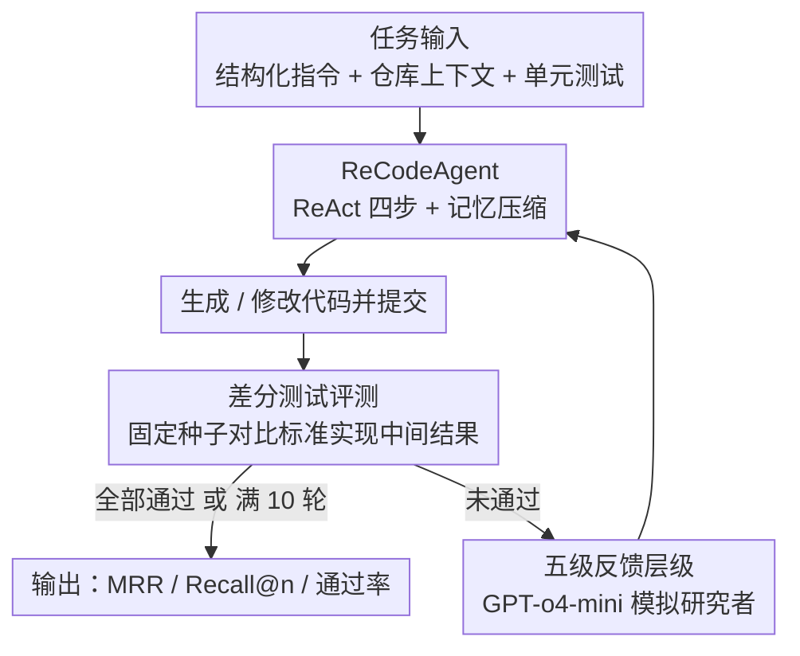

# RECODE-H: A Benchmark for Research Code Development with Interactive Human Feedback

**会议**: ICLR 2026  
**OpenReview**: [https://openreview.net/forum?id=IKnuyyPHCV](https://openreview.net/forum?id=IKnuyyPHCV)  
**代码**: 论文承诺开源（文中标注将公开 benchmark 与代码，暂未给出固定地址）  
**领域**: 代码智能 / Benchmark  
**关键词**: 研究代码生成、交互式人类反馈、多轮代码精炼、差分测试、LLM Agent  

## 一句话总结
RECODE-H 把"研究代码生成"从一次性出题改成多轮人机协作：102 个来自真实顶会论文+官方仓库的仓库级任务，配上单元测试和一套五级反馈层级，再用 ReCodeAgent（ReAct 多轮 + 记忆压缩）做强基线，系统量化"反馈越细、LLM 改得越对"——GPT-5 的 Recall 从无反馈 29.4% 一路升到最强反馈 71.6%。

## 研究背景与动机
**领域现状**：用 LLM 辅助科研落地（从 idea 到实现）正在普及，但"把论文方法写成能跑的代码"仍是最难的一环。已有的研究代码基准（MLE-bench、PaperBench、SciReplicate-Bench、ResearchCodeBench 等）几乎都是**一次性（one-shot）评测**：给模型一段描述，让它一发入魂地产出正确代码。

**现有痛点**：这种设定和真实科研脱节。一方面研究者很难一次把需求说全，论文往往用高层叙述、公式和领域惯例描述方法，把大量实现细节留作隐含；另一方面 LLM 也极少第一次就写对。真实的科研实现是**反复迭代**的：跑测试→看报错→人给反馈→改→再跑。现有基准只考"端到端是否正确"，完全没评测模型"在多轮反馈中迭代精炼"的能力。

**核心矛盾**：研究代码生成的难点不在语法，而在于**把碎片化、欠规范的论文描述对齐到具体实现**，而这恰恰需要人类反馈来逐步消歧——可现有评测把这条最关键的回路砍掉了。

**本文目标**：构建一个能在**反馈驱动的多轮交互**下评测研究代码生成的基准，并且要做到任务真实（来自真论文真仓库）、难度可控、评测可复现可扩展。

**切入角度**：作者观察到反馈的"信息量"主要由提供者的专业度和分析深度决定，于是把反馈本身**结构化成可控的层级**——既能模拟从"只说失败了"到"直接给标准答案代码"的不同协作强度，又能把它当作一个干净的难度旋钮来做细粒度评测。

**核心 idea**：用一套五级反馈层级 + 仓库级真实任务 + 差分单元测试，把研究代码生成重塑为"可量化的多轮人机协作"，并配 ReCodeAgent 把反馈真正吃进迭代生成里。

## 方法详解

### 整体框架
RECODE-H 由两部分组成：一个**基准**（102 个仓库级任务 + 五级反馈层级 + 差分测试评测）和一个**强基线 agent**（ReCodeAgent）。运行时是一个闭环：给 agent 一个任务（结构化指令 + 仓库上下文 + 单元测试），agent 用 ReAct 循环生成或修改代码并提交，系统跑差分单元测试得到执行日志；若没全过，就由一个模拟研究者按指定的反馈层级产出反馈，agent 据此进入下一轮，直到测试全过或达到 10 轮上限。整套任务由 26 位博士级标注者经"论文/代码选择 → 加解释性注释 → 写生成指令 → 开发单元测试"四步人机协作流水线构建。

### 关键设计

**1. 基准构建流水线：专家标注 + 差分测试锁住"可复现的正确性"**

研究代码任务最棘手的是"论文描述↔代码实现"的对应关系往往分散在多个函数/类里、且不显式。作者用四步人机协作流水线解决：（1）严格筛选 2023 年后、发表于 CVPR/ICML/NeurIPS/ICLR、有官方可执行仓库、且论文与代码结构清晰对应的论文，标注者实跑官方脚本确认目标组件能在 <24GB 显存内成功执行；（2）用 Gemini-2.5-Pro 生成解释性注释（标清代码与论文的对应、论文与实现的差异、代码里有而论文没写的细节）再人工校验；（3）写生成指令，明确目标函数名、功能、输入输出的名称/类型/语义；（4）开发单元测试。任务不是孤立的函数补全，而是要实现对应论文方法的若干函数乃至整个类，属于**仓库级生成**。

评测正确性的核心机制是**差分测试（differential testing）**：很多研究代码内部是训练更新、优化例程、数据预处理这类动态/有状态过程，没法简单看端到端输出。于是每个单元测试在**固定随机种子**下同时跑标准实现和模型实现，在数值容差内比对中间或最终输出，从而能逐个计算步骤地验证算法正确性。标注者还强制标准实现的单测覆盖率 ≥80%，保证测的是逻辑分支而非表面语法。

**2. 五级反馈层级：把"人类反馈的信息量"做成可控难度旋钮**

这是 RECODE-H 区别于一切 one-shot 基准的设计核心。代码执行后给 agent 的反馈，按引导强度递增分五级：Level 0 只告诉"执行失败、日志可看"；Level 1 加一句高层错误描述；Level 2 再加"为什么错"的诊断解释；Level 3 进一步给自然语言的修正指引（说清该做哪些算法修改/设计选择以对齐标准实现，但不给可执行代码）；Level 4 最详细，直接附上标准答案代码片段，相当于把任务退化为"能否把正确解正确地集成进现有仓库"，作为指令遵循与仓库集成能力的上界。反馈由 GPT-o4-mini 模拟专家在线生成——它基于执行结果、错误日志，并参考标准代码与标注注释来核对功能是否与论文描述对齐，从而在保持迭代真实感的同时让反馈标准化、可复现、可跨次运行扩展。评测指标用 MRR（按首次正确出现的轮次 $k$ 记 $\frac{1}{k}$）、Recall@n（n 轮内解出的任务比例）、平均测试通过率，外加 CodeBLEU / CodeBERTScore 衡量与标准实现的相似度。

**3. ReCodeAgent：把反馈真正吃进 ReAct 迭代回路，并用记忆压缩控住上下文**

光有基准还不够，作者要证明"反馈是可被利用的"，于是提供 ReCodeAgent 作强基线。它遵循 ReAct 框架，每轮分四步：观察（收集当前仓库状态、上轮提交的执行日志、研究者反馈）→ 反思（对照任务规格分析失败与差距，把反馈转成可执行的洞察并核对仓库约束）→ 规划（给出下一步的简洁结构化计划：目标、目标文件/区间、预期效果）→ 行动（从预定义动作空间 READ_FILE / WRITE_FILE / SEARCH / SUBMIT 中执行一个操作）。一个值得澄清的点：这里的"多轮"指**人机交互**轮次——已有基准只允许一次人类提示之后 agent 全自主，而 RECODE-H 让 agent 与（模拟）研究者多轮协作，内部 ReAct 推理-行动循环不变。为在多轮下控住上下文长度，agent 仿照 Reflexion 维护记忆并设阈值：当历史记忆超过阈值（实验设为 5）时，把先前的观察与动作压缩成保留"未解决失败、设计决策、生成上下文"的简洁摘要，既保持跨轮一致又避免上下文膨胀。

### 一个完整示例
以一个需要实现某论文 `forward` 前向过程的仓库级任务为例：第 1 轮 agent 只拿到任务提示（无反馈，对应单轮基线），写出的代码张量形状对不上，单测差分比对失败，执行日志报 shape mismatch。若处于 Level 1，研究者反馈只说"前向输出维度不符"；agent 反思后多半仍在表面修补。换成 Level 3，反馈会指出"应按论文公式先做某步归一化再投影"，agent 把这条算法级指引并进计划并改对的概率明显上升；到 Level 4 直接给出标准代码片段，任务退化为"正确集成"。实验里正是这种递进让 GPT-5 这类强模型在前 3–4 轮就快速爬到高通过率，而 Level 0 下只能缓慢平台化。

## 实验关键数据

评测 7 个主流 LLM（GPT-5 / GPT-5-mini / GPT-5-nano、Gemini-2.5-pro / flash、Claude-Sonnet-4、DeepSeek-V3.1），温度 0、top-p 1，每任务最多 10 轮反馈交互，单轮内 agent 最多 3 个动作后自动提交，记忆阈值 5。

### 主实验
不同反馈层级下的 Recall@n（10 轮，%），反馈越细、正确率越高，且强模型受益最大：

| 模型 | Level 0 | Level 2 | Level 4 | L0→L4 提升 |
|------|---------|---------|---------|-----------|
| GPT-5 | 29.4 | 55.9 | 71.6 | +42.2 |
| DeepSeek-V3.1 | 10.8 | 43.1 | 70.6 | +59.8 |
| GPT-5-mini | 19.6 | 47.1 | 66.7 | +47.1 |
| Gemini-2.5-pro | 12.7 | 37.3 | 58.8 | +46.1 |
| Claude-Sonnet-4 | 14.7 | 33.3 | 48.0 | +33.3 |

注：增益**非线性**，最大跳变常出现在 Level 0→1（多数模型 Recall 与测试通过率近乎翻倍），而 Level 2→3→4 边际递减，但最高级提供显式代码仍能给强模型带来可观提升。

### 错误分析（Table 3，错误类型占比 %）
用 GPT-5 分类错误成因，并在 100 例上人工核对达 98% 一致。四类错误：Type1 语法/运行时、Type2 论文与指令理解错误、Type3 缺失知识与上下文、Type4 仓库集成错误。

| 模型 | Type1 | Type2 | Type3 | Type4 |
|------|-------|-------|-------|-------|
| GPT-5 | 11.4 | 34.0 | 50.3 | 4.4 |
| Claude-Sonnet-4 | 26.5 | 32.3 | 33.8 | 7.5 |
| DeepSeek-chat | 20.6 | 31.6 | 40.3 | 7.5 |

失败主要由**高层语义问题（Type2 + Type3）主导**，语法/运行时错误较少、仓库集成错误最罕见——说明现代 LLM 基本攻克了基础编码，瓶颈在"忠实对齐论文描述"和"补齐隐含领域知识"。

### 关键发现
- **反馈采纳率决定一切**：几乎每个被成功修复的错误，都是模型明确采纳了反馈的结果；不采纳却修对的情况极罕见。GPT-5 的采纳率从 Level-1 的 80.2% 升到 Level-4 的 90.1%，DeepSeek-V3.1、GPT-5-mini 同趋势；而 Claude-Sonnet-4 反而随反馈变细**采纳率下降**、Gemini-2.5-pro 在约 70% 波动——这解释了它们为何受益有限。
- **越简单越具体的反馈越容易被采纳**：针对语法/仓库集成的反馈采纳率最高（DeepSeek-chat 对语法反馈采纳近 80%），而针对实现对齐（Type2）的反馈采纳率普遍偏低（GPT-5-nano 仅 56.1%），印证模型在"需要深层理解方法意图的逻辑错误"上最吃力。
- **反馈加速收敛**：富反馈不仅抬高终值，还让 GPT-5、DeepSeek-V3.1 在前 3–4 轮就快速爬升；弱模型（Claude、Gemini-flash）更早进入平台，对反馈丰富度敏感度低。
- **模型家族差异 > 单纯参数量**：GPT 系随反馈变细稳定提升；DeepSeek-V3.1 从 L0→L4 相对提升最大，显示极强的多轮适应力；Claude 即便体量大也只有中等增益，说明架构与训练方式比 size 更决定"能否吃进迭代反馈"。

## 亮点与洞察
- **把"反馈信息量"做成离散可控的五级旋钮**，是这篇最妙的设计：它既贴近真实协作的不同强度，又让"难度"变成可复现的实验变量，从而能干净地画出"反馈—正确率"曲线，这在 one-shot 基准里根本无法测量。
- **差分测试 + 固定种子**优雅地解决了"研究代码内部是动态/有状态过程、没法看端到端输出"的评测难题——逐步比对中间结果，既严格又可扩展，值得迁移到任何"算法正确性"难判定的代码基准。
- **错误分布给出反直觉结论**：当代 LLM 写研究代码的瓶颈已不是语法，而是"读懂论文意图"和"补领域常识"。这把研究重心从"会不会写代码"指向"会不会读论文"，对后续 agent 设计是强信号。
- **采纳率分析**把"模型为何受益不同"落到可量化机制：差距不在能不能改，而在愿不愿意/会不会采纳反馈，尤其对需要深层理解的对齐类反馈。

## 局限与展望
- 反馈由 GPT-o4-mini 模拟"专家研究者"生成，虽可复现可扩展，但与真实人类研究者的反馈在风格、错误诊断深度上可能有系统性差异，可能高估或低估某些反馈层级的效果。
- 任务仅来自 2023 年后、四个顶会、且仓库可在 <24GB 显存内执行的论文，对硬件需求大、工程更复杂的研究代码覆盖不足；102 个任务规模也限制了细分领域结论的统计强度。
- 错误分类与采纳率判定都用 GPT-5 当裁判，虽有 98% 人工一致性背书，但仍是 LLM-as-judge，可能在边界 case 上引入偏差。
- 评测以"对齐标准实现"为正确性标准（差分比对），对"另一种同样正确但实现不同"的解可能误判为错——这是仓库级、有唯一标准实现场景下的固有取舍。
- 展望：可把模拟研究者换成真实人类做小规模校准、扩展任务领域与规模、并探索让 agent 主动索取最有用层级的反馈（而非被动接收固定层级）。

## 相关工作与启发
- **vs SciReplicate-Bench / ResearchCodeBench / PaperBench**：它们同样面向研究代码，但都是非交互的一次性评测（端到端复现或单响应生成）；RECODE-H 的质变在于引入**多轮、反馈驱动**的评测范式，第一个系统性考"用结构化反馈层级迭代精炼代码"的能力。
- **vs InterCode / MINT / ConvCodeWorld（交互式代码生成）**：这些虽有多轮反馈（执行反馈/惰性用户反馈/口头反馈），但局限在软件工程域的函数级生成；RECODE-H 把交互搬到**研究代码的仓库级**任务，反馈的性质与复杂度（要对齐论文方法）显著不同。
- **vs SWE-bench 等仓库级基准**：同为仓库级但目标是修 bug/实现 issue，且多为 one-shot；本文聚焦"把论文方法忠实落地"并显式建模人机多轮协作。
- **启发**：ReCodeAgent 复用 ReAct + Reflexion 式记忆压缩，证明现成 agent 框架只要把反馈结构化地并进反思-规划环就能大幅提升，后续做"自适应反馈驱动科研 agent"可直接以此为起点。

## 评分
- 新颖性: ⭐⭐⭐⭐⭐ 首个把研究代码生成做成多轮反馈驱动评测、并将反馈信息量结构化成可控五级层级。
- 实验充分度: ⭐⭐⭐⭐ 7 个主流 LLM × 5 反馈层级 × 多指标，外加错误分析与采纳率分析，相当扎实；任务规模 102 略偏小。
- 写作质量: ⭐⭐⭐⭐ 动机清晰、层级设计与差分测试讲得透，表格信息密度高。
- 价值: ⭐⭐⭐⭐⭐ 把研究重心从"会写代码"拨向"会读论文+用反馈"，为反馈驱动科研 agent 立了可复现的基线与评测底座。

<!-- RELATED:START -->

## 相关论文

- [\[ICLR 2026\] WebGen-Agent: Enhancing Interactive Website Generation with Multi-Level Feedback and Step-Level Reinforcement Learning](webgen-agent_enhancing_interactive_website_generation_with_multi-level_feedback_.md)
- [\[ICLR 2026\] Ambig-SWE: Interactive Agents to Overcome Underspecificity in Software Engineering](ambig-swe_interactive_agents_to_overcome_underspecificity_in_software_engineerin.md)
- [\[ICLR 2026\] SWE-RM: Execution-Free Feedback for Software Engineering Agents](swe-rm_execution-free_feedback_for_software_engineering_agents.md)
- [\[ICLR 2026\] From Assistant to Independent Developer — Are GPTs Ready for Software Development?](from_assistant_to_independent_developer_are_gpts_ready_for_software_development.md)
- [\[ACL 2026\] ReCode: Reinforcing Code Generation with Reasoning-Process Rewards](../../ACL2026/code_intelligence/recode_reinforcing_code_generation_with_reasoning-process_rewards.md)

<!-- RELATED:END -->
