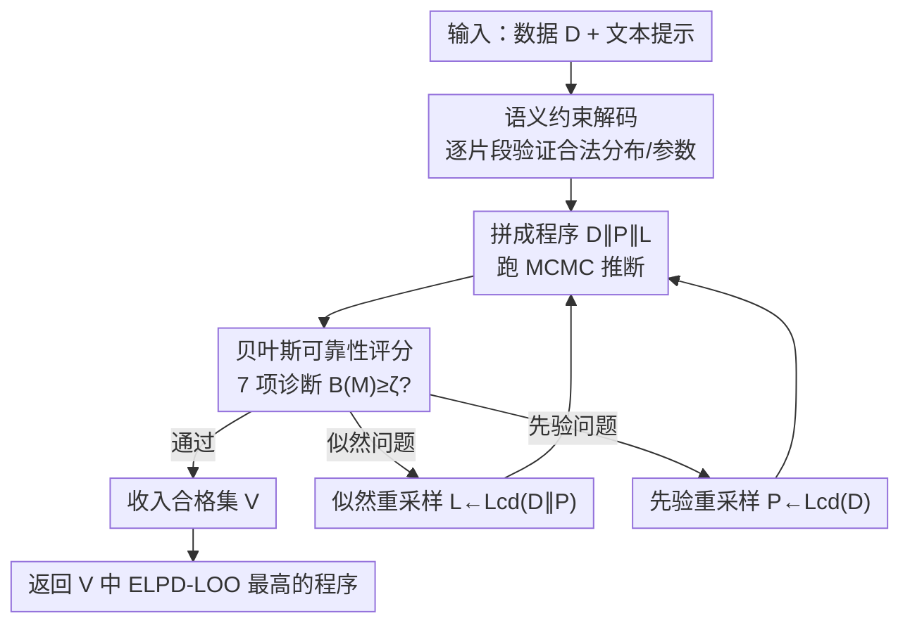

# RefineStat: Efficient Exploration for Probabilistic Program Synthesis

**会议**: ICLR 2026  
**OpenReview**: [https://openreview.net/forum?id=SAl337ZX5d](https://openreview.net/forum?id=SAl337ZX5d)  
**代码**: https://github.com/structuredllm/RefineStat  
**领域**: 代码智能 / 程序合成  
**关键词**: 概率程序合成、约束解码、贝叶斯工作流、小语言模型、诊断驱动精化

## 一句话总结
RefineStat 让 7~8B 的小语言模型也能可靠地合成概率程序（PyMC/NumPyro）：它在生成阶段用语义约束解码逐片段剪掉非法分布/参数，在精化阶段用贝叶斯诊断指标回溯重采样先验或似然，使得单个开源小模型产出的程序在统计可靠性上能追平甚至超过 GPT-4 / OpenAI o3 等闭源大模型。

## 研究背景与动机
**领域现状**：科学建模常需把系统写成统计模型，而概率编程语言（PPL，如 PyMC、NumPyro）正是描述这类联合分布 $p(x,z\mid\eta)$ 并自动做后验推断的工具。过去的「自动模型发现」要么靠专家手写 DSL + 定制搜索算法，要么直接用 LLM 把建模知识「写出来」，后者被寄望能省掉大量人工。

**现有痛点**：直接拿 LLM 生成概率程序会产出大量语义错误——程序能跑通却违背了统计本意。论文给的典型例子是 PyMC 里把方差写到了标准差的位置：`pm.Normal(..., sigma=sigma**2)` 而非 `pm.Normal(..., sigma=sigma)`，这会编码出错误模型、夸大不确定性甚至触发 `SamplingError`；又或者用了不存在的参数名 `sd` 取代 `sigma`，在构图阶段就抛 `TypeError`。大模型虽然好一些但 API 昂贵；小模型（SLM）便宜，却恰恰最容易犯这类语义 bug。

**核心矛盾**：概率程序的搜索空间巨大且受严格的领域约束，而小模型既无法稳定满足语法/语义约束，也没有判断「这个统计模型到底可不可信」的能力。语法对了不代表统计对，统计跑通了不代表收敛可信——纯生成式采样在这个空间里命中率极低。

**本文目标**：让无需微调的开源小模型，在标准贝叶斯工作流意义下产出**可靠**的概率程序，即满足足够的有效样本量、低 MCMC 发散数、良好的样本外拟合等一整套诊断检查。

**切入角度**：作者借鉴概率程序员的领域专长和调试策略——人类专家不会一次写对，而是「先保证语法语义合法，再看诊断指标，哪里不对就回去重写先验或似然」。把这套人类工作流自动化，就能把搜索约束在「合法且可信」的子空间里。

**核心 idea**：用「语义约束解码 + 诊断感知精化」两阶段，把模型的盲目采样改造成「逐片段剪枝合法化 + 按贝叶斯诊断回溯重采样」的引导式搜索。

## 方法详解

### 整体框架
RefineStat 接收用户给的数据 $D$ 和文本提示，目标是合成一个概率程序 $M=D\Vert P\Vert L$（数据块、先验块、似然块顺序拼接），使其在贝叶斯工作流下既语义正确又预测性能强。整条流水线分两大块：**第一块**在生成时用语义约束解码强制语法+语义合法（把验证规则映射到部分语法树的节点上，违反约束就回溯重采样出问题的片段）；**第二块**在程序跑出后用一套贝叶斯诊断指标打分，若不达标就选择性地重采样似然或先验，直到攒够 $\beta$ 个合格程序或耗尽预算 $R_{max}$，最后返回 ELPD-LOO 最高的那个程序。

整体可以理解成一个「生成→检查→（不合格则）回退重写→再检查」的闭环：合法性约束保证候选不会一上来就是垃圾，诊断分数则充当选择压力，把搜索推向统计可信的模型。

### 关键设计

**1. 语义约束解码：把「合法概率程序」的规则编进采样过程**

直接痛点是小模型频繁生成「分布名不存在 / 参数名拼错 / 参数取值越界 / 变量未定义先使用」这类语义 bug。RefineStat 在上下文无关文法 $G=(N,T,P,S_0)$ 的基础上，对部分解析树 $\kappa$ 的每个程序片段 $n\in F(\kappa)$（对应一条语法语句）施加一组验证谓词的合取 $\Phi(n,\pi)=\phi_1\wedge\phi_2\wedge\cdots\wedge\phi_m$。具体定义了六个谓词：$\phi_1$ 可解析性（符合文法），$\phi_2$ 分布合法性（调用的分布 $f$ 确实存在于 PPL 库 $M$ 中），$\phi_3$ 参数合法性（参数 $P(f)\subseteq P_{acc}(f)$，比如把 `sd` 纠正为 `sigma`），$\phi_4$ 依赖合法性（随机变量先声明后引用），$\phi_5$ 支撑合法性（参数值落在分布支撑内，如方差 $>0$、概率 $\in[0,1]$），$\phi_6$ 类型合法性（尺度参数是数值、计数是整数）。

生成采用对每条语句 $s\sim S_N$ 的局部拒绝采样：反复采样直到找到满足 $\Phi(s^*,\Pi)=1$ 的片段才接受，并维护一张全局符号表 $\Pi:A\to M$ 把每个别名映射到模块。关键之处在于它**只回溯重采样违反约束的那几个 token**，而不是整段重生成，因此 token 开销小；对 PyMC 这种变量作用域和依赖关系敏感的语言尤其有效。这一步把语法约束（来自 Syncode 思路）和语义验证结合，从源头剪掉了搜索空间里大片非法分支。

**2. 贝叶斯工作流可靠性评分：给「统计可不可信」一个可计算的分数**

光语义合法还不够——程序能跑通也可能后验根本没收敛。痛点是缺一个自动比较候选模型「统计可靠性」的标尺。作者把统计文献里的七个标准诊断打包成七个指示函数 $s_j(M)\in\{0,1\}$，相加得到可靠性分数 $B(M)=\sum_{j=1}^{7}s_j(M)$：包括 split-$\hat{R}\le\alpha_R$（链收敛）、$\text{BFMI}>\gamma$、bulk/tail 有效样本量 $\text{ESS}\ge\beta$、发散转移数为 0、PSIS-LOO 的 Pareto $\hat{k}_i\le L_{cd}$ 的比例足够高、以及 $\widehat{elpd}$ 可有限计算。当 $B(M)\ge\zeta$（取 $\zeta=5$，允许少量边缘诊断失败）即认为模型「可靠」，进入有效模型空间 $M_{valid}=\{M:B(M)\ge\zeta\}$。最终目标是在合法空间里挑出样本外预测最好的：$M^*=\arg\max_{M\in M_{valid}}\widehat{elpd}(M)$。

这里 ELPD-LOO（留一交叉验证下的期望对数逐点预测密度）衡量样本外预测精度，但精确 LOO 要重拟合 $n$ 次太贵，作者用 PSIS-LOO（Pareto 平滑重要性采样）只拟合一次全数据、再用广义 Pareto 拟合稳定尾部权重来近似，并以 $\hat{k}_i$ 判断近似是否可信（约 20% 的 $\hat{k}_i>0.7$ 即视为不可靠）。这个评分的妙处在于：它把「先收敛再谈预测」的纪律编码进了选择标准——只在通过收敛阈值的模型上信任 $\widehat{elpd}$，避免被「ELPD 虚高但 $\hat{R}=4.13$ 没收敛」的假赢家骗到。

**3. 诊断感知的回溯重采样：哪类诊断出问题就重写哪个程序块**

当一个程序语义合法却没通过可靠性检查时，盲目整段重生成既浪费又难定位错误。RefineStat 借助约束解码算子 $L_{CD}:C\to B$（对任意上下文 $C$ 返回满足 $\Phi(C\Vert B)=1$ 的新代码块），把精化拆成两种**定向**重采样：似然重采样 $L\leftarrow L_{cd}(D\Vert P)$（在数据+先验上下文下重写似然，针对收敛/采样器健康问题），先验重采样 $P\leftarrow L_{cd}(D)$（在数据上下文下重写先验，针对先验设定错误）。算法 1 给出完整循环：先用 $\Phi$ 查语义正确性，再算诊断 $d_1,\dots,d_L$，至少 $K$ 个阈值达标才收入合格集 $V$；否则在似然重采样预算 $\alpha$ 内优先重写似然，超预算则改重写先验，直到 $|V|$ 达到 $\beta$ 或重试次数到 $R_{max}$，返回 $V$ 中 $\widehat{elpd}$ 最大的程序。

这一步的关键是「对症下药」：先验问题和采样器问题需要修改的程序块不同，按诊断信号选择重写先验还是似然，比整体重生成更省 token、更快收敛到可靠模型。重采样出的新块仍经 $L_{CD}$ 保证语义合法，因此精化不会把程序改坏。整套机制让单个未微调的小模型，通过迭代逼近，达到接近大模型的统计可靠性。

### 损失函数 / 训练策略
RefineStat **不训练、不微调任何模型**，完全是推理期框架，作用在固定的开源小模型之上。关键超参为：可靠性阈值 $\zeta=5$、诊断达标个数下限 $K$、似然重采样预算 $\alpha$、目标合格程序数 $\beta$、总重试上限 $R_{max}$，以及各诊断阈值 $\{\tau_j\}$。推断后端用 PyMC（NUTS/HMC 采样）。

## 实验关键数据

### 主实验
评测在 Stan PosteriorDB 的五个代表性数据集（Eight Schools、Dugongs、Surgical、Peregrine、GP）上进行，模型用四个 ≤8B 的开源 LLM：Llama3-8B、CodeGemma-7B、Qwen2.5-Coder-7B、DeepSeek-R1-Distill-Qwen-7B（DQ-7B）。

**Run rate（能成功采出后验的程序比例）随温度对比**：

| 温度 | Standard（无约束） | Syncode（仅语法约束） | RefineStat |
|------|------|------|------|
| 0.2 | 0.10 | 0.21 | 0.45 |
| 0.3 | 0.11 | 0.21 | 0.50 |
| 0.4 | 0.11 | 0.21 | 0.50 |

RefineStat 比无约束基线高约 40 个百分点、比纯语法约束的 Syncode 高约 30 个百分点，说明语义约束+精化同时压制了语法和语义两类错误源。

**对比闭源大模型 / 专家程序（ELPD-LOO，越高越好）**：

| 数据集 | Expert | RefineStat (DQ-7B, mean±std) | BoxLM (w/ GPT-4) | OpenAI-o3 |
|--------|--------|------------------------------|------------------|-----------|
| Eight schools | -30.70 | -30.68 ± 0.11 | -30.42 | -30.74 ± 0.07 |
| Dugongs | 22.43 | 8.35 ± 0.06 | 23.40 | 22.83 ± 8.12 |
| Peregrine | -112.60 | -114.29 ± 2.76 | -173.11 | -133.29 ± 10.33 |
| Surgical | -39.73 | -46.51 ± 3.49 | -38.03 | -38.73 ± 0.51 |
| GP | -26.53 | -23.39 ± 1.14 | – | -34.95 ± 13.28 |

单个 7B 小模型在多数数据集上能逼近专家手写程序与 GPT-4 级方法；BoxLM 要用两个 GPT-4 实例迭代提议+精化，RefineStat 只用一个小模型就拿到可比结果。

### 消融实验
论文以「逐级加约束」的方式做对照（Standard → Syncode → RefineStat），等价于对两大组件的消融：

| 配置 | Run rate (T=0.3) | 说明 |
|------|------|------|
| Standard（无约束） | 0.11 | 既无语法也无语义约束，命中率最低 |
| Syncode（仅语法约束） | 0.21 | 加语法约束后翻倍，但仍受语义 bug 限制 |
| RefineStat（语义约束+诊断精化） | 0.50 | 补上语义验证与回溯重采样，再翻一倍多 |

### 关键发现
- 语义约束这一层贡献巨大：从 Syncode 的 0.21 跳到 0.50，说明语法对了远不够，语义/统计合法才是命中率瓶颈。
- 诊断评分能识破「虚假赢家」：Meta-Llama 在 GP 上 Standard 的 ELPD 看似更高，但 split-$\hat{R}=4.13\gg1$、可靠性分仅 3，属严重不收敛；RefineStat 的 ELPD 略低却保持 $\hat{R}\approx1$、可靠性分更高，是可信赖的后验。
- 对最弱的模型增益最显著：DQ-7B 在 Standard 下五个数据集**全部失败**，接上 RefineStat 后**全部成功**；Surgical 上 Meta-Llama 基线发散 >1000 次，RefineStat 降到 0。
- RefineStat 的诊断指标（$\hat{R}$、发散数）方差明显更小，稳定性和鲁棒性更强。
- 代价：RefineStat 约消耗基线 2 倍的 token（为公平比较，基线被允许跑 5 次 / 2.5 倍 token 取最优，仍未超过）。

## 亮点与洞察
- **把人类调试工作流编译成搜索算法**：「先合法、再看诊断、哪坏修哪」这套概率程序员的经验被形式化成约束谓词 + 可靠性评分 + 定向重采样，是「领域专长→算法」的漂亮范例。
- **token 级回溯重采样**：违反约束时只重采样涉事 token、不整段重生成，是约束解码里一个很实用的省钱 trick，可迁移到任何带语法/语义约束的代码生成任务。
- **用诊断分数当选择压力**：把「统计可信度」量化成 $B(M)$ 并设阈值 $\zeta$，让搜索天然避开「跑得通但不收敛」的陷阱——这个思路可推广到任何「能执行≠正确」的生成任务（如 SQL、数值仿真）。
- **小模型也能打大模型**：证明了在结构化、可验证的领域里，精心设计的约束+反馈循环可以替代模型规模，这对成本敏感的科研落地很有意义。

## 局限与展望
- **额外 token / 计算开销**：约束解码 + 多轮诊断重采样使 token 消耗约为基线 2 倍，且每次诊断都要跑一遍 MCMC，整体延迟不低。
- **依赖 PPL 诊断的可计算性**：可靠性评分建立在 $\hat{R}$、ESS、PSIS-LOO 等诊断之上，这些在 PyMC/NumPyro 里现成，但迁到诊断工具不完备的领域或语言时框架红利会缩水。
- **评测规模有限**：仅五个 PosteriorDB 数据集、四个 ≤8B 模型，多为经典中小规模统计模型；在更复杂的层级模型 / 高维隐变量上是否同样可靠尚未验证。
- **阈值需人工设定**：$\zeta=5$、$K$、$\alpha$、$\beta$ 等超参靠经验给定，跨数据集自适应调参是可改进方向。

## 相关工作与启发
- **vs Syncode（仅语法约束）**：Syncode 用文法引导保证语法合法，但管不了「分布不存在 / 参数语义错」这类语义 bug；RefineStat 在其上叠加 6 条语义验证谓词 + 诊断精化，Run rate 从 0.21 提到 0.50。
- **vs BoxLM（双 GPT-4 迭代）**：BoxLM 用两个 GPT-4 实例分别提议程序和精化，依赖闭源大模型且成本高；RefineStat 用单个未微调开源小模型，靠约束解码+贝叶斯诊断闭环取得可比 ELPD，成本和可复现性更优。
- **vs 直接查询 LLM（Standard）**：无约束生成命中率仅约 0.10、易产出不收敛后验；RefineStat 把盲采样换成「合法剪枝 + 诊断驱动回溯」，在最弱模型上甚至从全败逆转为全胜。

## 评分
- 新颖性: ⭐⭐⭐⭐ 首次证明开源小模型可在贝叶斯工作流意义下合成可靠概率程序，语义约束+诊断精化的组合切口新颖。
- 实验充分度: ⭐⭐⭐⭐ 五数据集×四模型，含温度扫描、对 GPT-4/o3/专家的对比、token 开销分析；规模偏中小但论证链完整。
- 写作质量: ⭐⭐⭐⭐ 形式化定义清晰（谓词、可靠性评分、算法 1 一气呵成），motivation 用具体 bug 举例很到位。
- 价值: ⭐⭐⭐⭐ 让低成本小模型替代昂贵大模型做概率程序合成，对自动化统计建模与科研落地有实际意义。

<!-- RELATED:START -->

## 相关论文

- [\[ICLR 2026\] Gradient-Based Program Synthesis with Neurally Interpreted Languages](gradient-based_program_synthesis_with_neurally_interpreted_languages.md)
- [\[ICLR 2026\] LLM-Guided Evolutionary Program Synthesis for Quasi-Monte Carlo Design](llm-guided_evolutionary_program_synthesis_for_quasi-monte_carlo_design.md)
- [\[NeurIPS 2025\] Program Synthesis via Test-Time Transduction](../../NeurIPS2025/code_intelligence/program_synthesis_via_test-time_transduction.md)
- [\[ACL 2025\] Program Synthesis Benchmark for Visual Programming in XLogoOnline Environment](../../ACL2025/code_intelligence/program_synthesis_benchmark_for_visual_programming_in_xlogoonline_environment.md)
- [\[NeurIPS 2025\] Once Upon an Input: Reasoning via Per-Instance Program Synthesis](../../NeurIPS2025/code_intelligence/once_upon_an_input_reasoning_via_per-instance_program_synthesis.md)

<!-- RELATED:END -->
