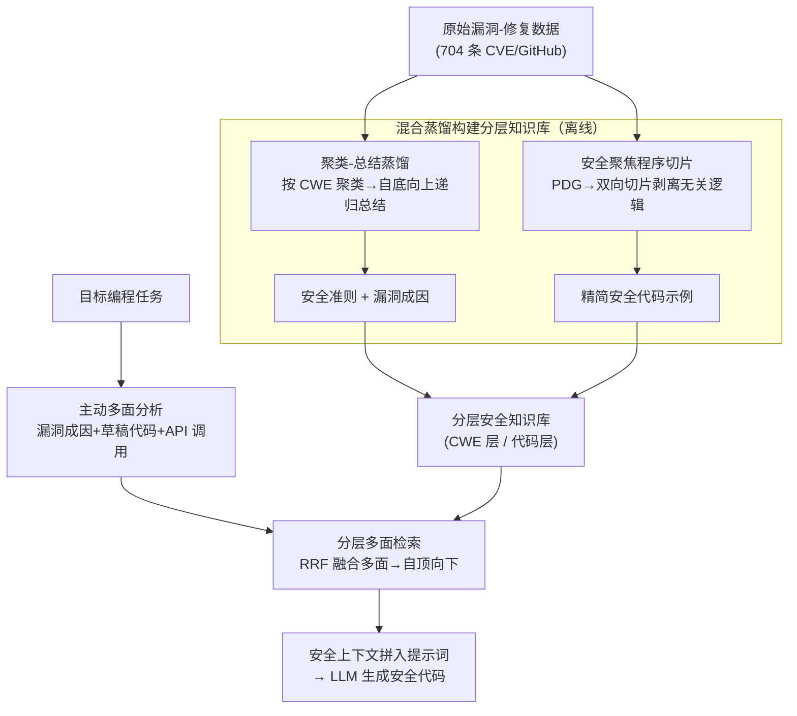

# RESCUE: Retrieval Augmented Secure Code Generation

**会议**: ICLR 2026  
**OpenReview**: [https://openreview.net/forum?id=gbxhesw4UH](https://openreview.net/forum?id=gbxhesw4UH)  
**代码**: https://github.com/steven1518/RESCUE  
**领域**: 代码智能 / 安全代码生成 / 检索增强生成  
**关键词**: 安全代码生成, RAG, 程序切片, 多面检索, CWE

## 一句话总结
RESCUE 针对"安全代码生成"提出一套新的 RAG 框架：离线用"聚类-总结 + 程序切片"把杂乱的漏洞修复数据蒸馏成分层安全知识库，在线用"分层多面检索"从漏洞成因、API 模式、代码三个安全视角主动分析任务并融合检索，在四个基准、六个 LLM 上把兼顾安全与功能的 SecurePass@1 指标平均提升 4.8 个点，刷新 SOTA。

## 研究背景与动机
**领域现状**：LLM 写代码已经很强，但经常生成带漏洞的代码。现有让代码更安全的路线大致三类——① 用安全目标微调模型（如 SafeCoder、SVEN），需要大量数据清洗和训练成本；② 约束解码（如 CoSec），需要额外训练一个安全小模型或人工规则当 oracle 去拦截不安全 token；③ 用 Bandit / SpotBugs / CodeQL 这类静态安全分析工具给出漏洞反馈再迭代修复（如 Codexity、INDICT），但工具依赖预定义的静态规则，难以纳入新漏洞知识，而且这些工具同时又被用来做评测，在生成阶段当 verifier 会造成数据泄漏隐患。

**现有痛点**：RAG 看似最灵活、免训练（直接把安全文档和代码示例检索进来），但现有工作只是把通用 RAG 套到安全领域，有两个硬伤。第一，安全相关文档里掺杂大量与目标任务无关的信息——一个演示安全实践的代码示例往往带着完全不同的示例任务逻辑（数据库连接、网页抓取等），这些噪声会把 LLM 带偏，干扰它为目标任务写出正确代码。第二，现有检索器把所有安全信息都当普通文本，靠文本相似度衡量"安全相关性"，根本没捕捉到任务描述里**隐式蕴含的安全语义**（比如某个任务隐含的安全要求），导致检索不准。

**核心矛盾**：安全知识的"原始形态"（漏洞-修复实例）既冗长又实例特定，直接喂给模型是噪声；而真正决定安全的语义又藏在任务描述的细节里，普通文本相似度看不见。

**本文目标**：拆成两个子问题——(1) 如何把原始安全数据蒸馏成"既泛化又精简、且无关逻辑被剥离"的知识；(2) 如何在检索时显式地从安全视角理解任务，把对的安全知识取出来。

**切入角度**：作者借鉴安全专家用"分类法（taxonomy）"推理漏洞的方式，把安全知识建成**分层结构**——高层放可泛化的安全准则，低层放精简的安全代码示例，并用 CWE 作为分类骨架；同时主张检索要"主动分析"任务的多个安全侧面，而非被动文本匹配。

**核心 idea**：用"混合蒸馏构建分层安全知识库 + 分层多面检索"替代"原始文档 + 文本相似度检索"，让安全知识既干净又能被精准取用。

## 方法详解

### 整体框架
RESCUE 分离线、在线两大阶段。**离线阶段**把原始安全数据（704 条来自 CVE/GitHub 的漏洞及其修复，取自 SafeCoder 训练集）构建成一个分层安全知识库：高层是 CWE 类别下的安全准则与漏洞成因，低层是经过切片的安全代码示例。**在线阶段**对给定编程任务，先做"主动多面分析"生成多组带安全语义的查询，再沿知识库自顶向下分层检索，融合多面结果得到精准的安全上下文，拼进提示词引导 LLM 生成安全代码。

### 关键设计

**1. 混合蒸馏构建分层安全知识库：把噪声大、实例特定的原始数据炼成可用知识**

原始漏洞-修复实例又长又"一事一议"，无法当通用指导；而 CWE 官方描述虽简洁却太抽象、缺乏可操作的修复策略（已有工作证明直接把 CWE 描述放进上下文几乎不提升安全性）。RESCUE 针对不同层级的知识用不同手段：高层用 **LLM 辅助的聚类-总结（cluster-then-summarize）** 流水线——先按所属 CWE 类型把数据聚类，再对每个簇做**自底向上的递归总结**（先总结固定大小的小批实例，再对上一轮总结结果继续递归总结，直到整簇收敛为一份连贯摘要），这样既能处理大体量数据又保证质量。每个 CWE 最终产出两份摘要：一份是定义"防止某类漏洞的可操作指令与最佳实践"的**安全准则（security guideline）**，例如"用 `yaml.safe_load()` 替换 `yaml.load()` 以防代码执行漏洞"；另一份是刻画"导致漏洞发生的根本条件与失败模式"的**漏洞成因（vulnerability cause）**，后者会直接作为检索阶段的一个关键安全侧面。由于这是一次性预处理，作者用 GPT-4o 离线完成。

**2. 安全聚焦的静态程序切片：剥掉示例代码里的无关逻辑，只留安全相关语句**

安全代码示例里常掺着与目标任务无关的逻辑（数据库连接、网页抓取等），既会在生成时干扰 LLM 写功能代码，也会让检索被噪声带偏。RESCUE 先对代码构建**程序依赖图（PDG）**，刻画语句间通过数据依赖和控制依赖的关联；把补丁影响的语句当作"兴趣点"——删除的语句视为漏洞代码指示、新增的语句视为安全代码指示；围绕这些点做**双向切片**：后向切片追踪影响漏洞/安全代码的语句，前向切片捕获被它们影响的语句。最后把漏洞版与安全版切出的子图对比、互补缺失上下文，得到两份"上下文完整、彼此平行"的精简代码变体（漏洞版 / 修复版）。这样既保留了安全语义又大幅缩短代码长度，消融里也证实它同时降低了输入 token 成本。

**3. 主动多面分析：从三个安全视角"读懂"任务，补齐任务描述里看不见的安全语义**

传统检索只靠任务的功能描述，缺乏显式安全语义；而漏洞往往藏在任务描述看不出的实现细节里。RESCUE 主动从三个安全关键侧面分析任务：(1) **漏洞成因分析（$V_{cause}$）**——让 LLM 分析任务、显式说明潜在攻击与安全要求；(2) **草稿代码生成（$C_{draft}$）**——用零样本提示先生成一份初始代码，因为漏洞常在编码过程中才显形；(3) **API 调用抽取**——用 visitor 模式遍历草稿代码的抽象语法树，提取所有 API 调用（因为安全漏洞常源于 API 误用）。这三个侧面把"任务隐含的安全画像"显式化，成为后续检索的多路查询。

**4. 分层多面检索：沿 CWE→代码两级自顶向下，用改进 RRF 融合多侧面分数**

检索结构与知识库分层对齐，分两步。**Step 1 CWE 级检索**用两个侧面定位 top-k 相关 CWE 类型：用稠密检索器 bge-base-en-v1.5 算任务漏洞成因与各 CWE 索引成因之间的 $\text{score}_{VCA}$；用稀疏检索 BM25 算草稿代码 API 与各 CWE 的 API 集合之间的 $\text{score}_{API}$（API 离散故用稀疏检索）。两个分数用**带阈值和秩过滤的改进 RRF** 融合：

$$\mathrm{RRF}(d) = \sum_{i=1}^{f} V_i(d) \cdot \frac{1}{r_i(d) + \alpha}, \quad V_i(d) = \mathbb{I}(s_i(d) > \tau_i) \cdot \mathbb{I}(r_i(d) \le 10)$$

其中 $s_i(d)$、$r_i(d)$ 是侧面 $i$ 下条目 $d$ 的分数与排名，$\tau_i$ 是置信阈值、$\alpha$ 是平滑参数。加阈值与秩过滤的动机是：只有部分场景才真正需要安全指导，这样能避免对无关任务硬塞安全知识。**Step 2 代码级检索**在选中的 CWE 内做细粒度搜索，在前两个侧面基础上再加第三个侧面**代码相似度 $\text{score}_C$**（稠密检索草稿代码与切片后安全代码示例的相似度），同样用改进 RRF 融合选出最相关的安全代码示例；最终把该示例对应 CWE 的安全准则与切片代码示例一起拼成提示词，引导 LLM 生成安全代码。

### 损失函数 / 训练策略
RESCUE 本身**免训练**，是一套即插即用的 RAG 流程。关键超参：切片做 2-hop；生成温度 0.2；top-k=4；API/漏洞成因/代码三个侧面的阈值分别设为 4.0、0.75、0.65；RRF 的 $\alpha$=60。离线蒸馏用 GPT-4o，在线检索用 bge-base-en-v1.5（稠密）+ BM25（稀疏），静态分析与 API 抽取用 tree-sitter。

## 实验关键数据

### 主实验
在 CodeGuard+（94 个安全敏感场景，带单测 + CodeQL 检查）、HumanEval+、BigCodeBench、LiveCodeBench 四个基准、六个 LLM 上评测。核心指标 SecurePass@1（SP@1）同时考量功能正确与安全，定义为：

$$\mathrm{SecurePass@}k := \mathbb{E}_{\text{Problems}}\left[1 - \frac{\binom{n-s_p}{k}}{\binom{n}{k}}\right]$$

其中 $n$ 为生成样本总数，$s_p$ 为同时通过单测和 CodeQL 安全检查的样本数。CodeGuard+ 上 SP@1 对比（节选）：

| 模型 | LLM alone | 次优 baseline | RESCUE |
|------|-----------|--------------|--------|
| DeepSeek-Coder-V2-Lite | 59.7 | 60.3 (SafeCoder) | **65.6** |
| Qwen2.5-Coder-7B | 51.2 | 56.5 (SafeCoder) | **64.8** |
| Qwen2.5-Coder-32B | 59.3 | 58.1 (SecCoder) | **65.1** |
| Llama3.1-8B | 53.7 | 53.9 (CoSec) | **56.2** |
| GPT-4o-mini | 58.2 | 57.8 (SecCoder) | **63.0** |
| DeepSeek-V3-0324 | 64.6 | 64.7 (SecCoder) | **69.7** |

RESCUE 在所有模型上 SP@1 均为最佳，平均比次优 baseline 绝对提升 4.8 个点，并保留原模型 98.7% 的功能正确能力。值得注意的是 INDICT 虽然 SecureRate（SR）常常很高（如 Qwen-7B 上 84.1），但 Pass@1 最低（48.5）——典型的"为安全牺牲功能"，正说明只看 SecureRate 会误导，需要 SecurePass@1 这种联合指标。相比之下另一个 RAG 方法 SecCoder 对 SP@1/SR 几乎没提升，说明简单套用通用 RAG 无法真正发挥安全知识。

### 消融实验（CodeGuard+，知识库构建部分）

| 配置 | SP@1 (DSC-V2-Lite) | SP@1 (Qwen-7B) | SP@1 (Llama-8B) | 说明 |
|------|------|------|------|------|
| RESCUE | 65.6 | 64.8 | 56.2 | 完整模型 |
| w/o construction | 55.6 | 53.9 | 45.3 | 不建知识库、直接用原始数据，全面大跌 |
| w/o guideline | 63.3 | 63.9 | 51.4 | 去掉安全准则，Llama 上掉 4.8 |
| w/o slicing | 61.0 | 62.6 | 52.7 | 完全不切片，且 token 数显著上升（503→661 等） |
| w/o psretrieval | 63.1 | 64.8 | 54.0 | 只在检索阶段用原始代码 |
| w/o psgeneration | 64.8 | 66.1 | 53.5 | 只在生成阶段用原始代码 |

### 关键发现
- **构建知识库是必需的**：w/o construction 直接用原始安全数据，三个模型 SP@1 全面大幅下滑（如 Llama 56.2→45.3），印证无关逻辑既干扰生成又拖累检索。
- **安全准则贡献明显**：去掉 guideline 后 Llama3.1-8B 的 SP@1 掉 4.8 点。
- **程序切片既提安全又省 token**：w/o slicing 不仅安全性下降，输入 token 还从 503 涨到 661；细粒度消融显示切片在检索和生成两个阶段都有益。

## 亮点与洞察
- **把"知识库结构"对齐"检索结构"**：知识库按 CWE→代码分层，检索就自顶向下两级走，结构一致让"粗筛漏洞类型→细选代码示例"非常自然，是可迁移到其他领域 RAG 的设计范式。
- **用程序切片给 RAG"降噪"**：把 PDG 双向切片引入安全代码示例，剥离与漏洞无关的逻辑，既提质又省 token，这种"用静态分析净化检索文档"的思路对代码类 RAG 普遍适用。
- **指标层面的"啊哈"**：作者点破 SecureRate 的漏洞——一段什么都不做的代码永远"安全"，于是提出 SecurePass@k 联合考量功能与安全，让"刷安全分却牺牲功能"的方法无所遁形。
- **主动多面分析**：不再被动靠文本相似度，而是主动让 LLM 把任务的漏洞成因、草稿代码、API 调用显式化再检索，把"任务里看不见的安全语义"挖出来。

## 局限与展望
- **依赖外部强模型做离线蒸馏**：聚类-总结用 GPT-4o，知识库质量与该模型能力强绑定，复现/迁移到无强模型场景时效果存疑。
- **知识来源受限于历史漏洞-修复数据**：只用了 SafeCoder 的 704 条数据，对未在 CWE/历史数据中出现的新型漏洞，泛化能力有待验证。
- **安全评测仍以 CodeQL/静态工具为准**：SecureRate/SP@1 的"安全"由 CodeQL 判定，工具本身的漏报/误报会传导到指标。
- **多侧面分析与两级检索带来额外开销**：每个任务要先生成草稿代码、做 AST 解析、多路检索再融合，相比单次检索的延迟更高。

## 相关工作与启发
- **vs SecCoder（RAG）**：SecCoder 只是检索最相似的安全代码示例做 in-context learning，用通用文本相似度；RESCUE 先把原始数据蒸馏+切片成干净的分层知识库，再从多安全侧面主动检索，故在 SP@1 上明显胜出（SecCoder 几乎不提升）。
- **vs SafeCoder（微调）**：SafeCoder 用安全目标指令微调模型，需训练成本且受限于可微调的开源模型；RESCUE 免训练、即插即用，且在多数模型上 SP@1 更高。
- **vs CoSec（约束解码）**：CoSec 需训练同 tokenizer 的安全小模型来操纵解码 logits，受模型族限制；RESCUE 不改解码、不需额外训练模型。
- **vs INDICT / Codexity（工具反馈迭代）**：它们靠静态安全工具迭代修复，难纳入新知识、且工具兼作评测有数据泄漏隐患，INDICT 还常为安全牺牲功能；RESCUE 以检索安全知识引导生成，兼顾安全与功能。

## 评分
- 新颖性: ⭐⭐⭐⭐ "蒸馏+切片建分层知识库 + 多面检索"组合在安全代码 RAG 上较新，单项技术多为已有组件
- 实验充分度: ⭐⭐⭐⭐⭐ 六模型四基准、五个 baseline，外加细粒度消融与 SP@1 新指标论证，充分
- 写作质量: ⭐⭐⭐⭐ 结构清晰、动机与设计对应明确
- 价值: ⭐⭐⭐⭐ 免训练即插即用、平均 +4.8 SP@1，对安全代码生成实用价值高

<!-- RELATED:START -->

## 相关论文

- [\[ACL 2026\] Across Programming Language Silos: A Study on Cross-Lingual Retrieval-Augmented Code Generation](../../ACL2026/code_intelligence/across_programming_language_silos_a_study_on_cross-lingual_retrieval-augmented_c.md)
- [\[ICLR 2026\] FHE-Coder: Benchmarking Secure Agentic Code Generation for Fully Homomorphic Encryption](fhe-coder_benchmarking_secure_agentic_code_generation_for_fully_homomorphic_encr.md)
- [\[ACL 2026\] DeepGuard: Secure Code Generation via Multi-Layer Semantic Aggregation](../../ACL2026/code_intelligence/deepguard_secure_code_generation_via_multi-layer_semantic_aggregation.md)
- [\[ICLR 2026\] VERINA: Benchmarking Verifiable Code Generation](verina_benchmarking_verifiable_code_generation.md)
- [\[ICLR 2026\] Paper2Code: Automating Code Generation from Scientific Papers in Machine Learning](paper2code_automating_code_generation_from_scientific_papers_in_machine_learning.md)

<!-- RELATED:END -->
