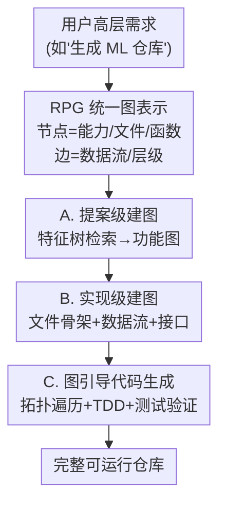

# RPG: A Repository Planning Graph for Unified and Scalable Codebase Generation

**会议**: ICLR 2026  
**OpenReview**: [https://openreview.net/forum?id=VAQq3Y8tIF](https://openreview.net/forum?id=VAQq3Y8tIF)  
**代码**: https://github.com/microsoft/RPG-ZeroRepo  
**领域**: 代码智能 / 仓库级代码生成 / LLM Agent  
**关键词**: 仓库级代码生成、规划图、结构化规划、ZeroRepo、test-driven 开发

## 一句话总结
本文提出 Repository Planning Graph（RPG），把"建什么功能（proposal）"和"怎么实现（implementation）"统一编码进一张显式的图（节点是能力/文件/函数，边是数据流与层级），并基于它构建 ZeroRepo 框架，按"提案级建图 → 实现级建图 → 图引导代码生成"三阶段从零生成整仓代码，在自建的 RepoCraft 基准上做到 81.5% 覆盖率、69.7% 通过率、平均 36K 行代码，规模是最强 baseline（Claude Code）的 3.9×。

## 研究背景与动机

**领域现状**：LLM 在函数级、文件级代码生成上已经很强，能从自然语言描述可靠地写出单个函数或单个文件。把这种能力从"函数/文件"放大到"从零生成整个大型仓库"，是实现自动化软件工程的关键一步，但仍是公开难题。从零生成一个仓库本质上需要两层规划：proposal 级（决定要建哪些功能、哪些模块）和 implementation 级（决定文件结构、接口、依赖、数据流怎么落地）。

**现有痛点**：已有工作分三类范式——分布式多 agent（MetaGPT、ChatDev 给经理/架构师/工程师分角色谈判）、固定工作流（Paper2Code 先搭骨架再填细节）、迭代式终端 agent（Claude Code、Gemini CLI 把中间计划写成 markdown 一步步改）。三者形态各异，但都共享同一个依赖：**用自然语言当规划的中间介质**。

**核心矛盾**：自然语言虽然灵活可读，但对大规模仓库规划并不高效。它天然有歧义，会把"意图"和"约束"混在一起；缺乏显式层级，让依赖追踪极难；并且静态计划在长程上会逐渐退化、漂移而无法自适应调整。落到从零生成仓库上，这会导致两个具体毛病：proposal 级规划不稳定（功能时而缺失、重叠、范围不均），implementation 级规划碎片化（计划在迭代间漂移，依赖、数据流、模块边界出现不一致）。

**本文目标**：用一种结构化、可持久、可演化的表示替换掉自然语言中间层，让 proposal 和 implementation 两级规划在同一介质里保持长程一致。

**切入角度**：既然自然语言的根本问题是"没有显式结构、无法追踪依赖"，那就直接把规划画成一张**图**——节点承载分层能力并对齐到文件/类/函数，边承载语义关系和数据流。图天然有层级和拓扑序，能把"全局语义"和"局部实现"绑在一起。

**核心 idea**：用一张统一的 Repository Planning Graph 代替 free-form 自然语言，作为可解释、可拓扑遍历的"仓库蓝图"，再用一个图驱动框架（ZeroRepo）逐步建图并按图生成代码。

## 方法详解

### 整体框架

整个系统要解决的是"给一句高层需求（如'请生成一个机器学习仓库'），从零产出一个完整、可运行、规模可观的代码仓库"。核心载体是 **RPG**：一张把功能与实现统一编码的图，节点具有双重语义——在功能层是逐层细化的能力（高层模块 → 中层组件 → 叶子=具体算法），在结构层则同构地对应仓库组织（根节点≈目录、中间节点≈文件、叶子≈函数/类）；边则编码模块间数据流（黑边，如 Data Loading 的输出喂给 ML Algorithms 再喂给 Evaluation）与模块内文件顺序（灰虚线，如 `load_data.py` 先于 `preprocess.py`），从而给出一个把功能分解和代码组织对齐的拓扑序。

围绕 RPG，ZeroRepo 分三阶段把图从无到有建起来再落地成代码：（A）**提案级建图**，把用户需求经"全局特征树检索 + 重构"变成功能图；（B）**实现级建图**，给功能图补上文件骨架、数据流、接口/基类，得到完整 RPG；（C）**图引导代码生成**，按拓扑序遍历 RPG，对每个叶子做 test-driven 实现，并配合图引导的定位/编辑与分级测试验证。

### 关键设计

**1. Repository Planning Graph：用一张双语义图替换自然语言蓝图**

针对"自然语言歧义大、无层级、追踪依赖难"这个根本痛点，RPG 把仓库规划编码成显式且机器可解释的图。它最关键的设计是**节点的双重语义**：同一个节点既表示一个功能能力（功能层，自顶向下逐级细化为模块→组件→叶子算法），又对齐到一个代码结构单元（结构层，根节点对应目录、中间节点对应文件、叶子对应具体函数或类）。这样功能分解和代码结构天生同构，不会出现"计划里说有这个功能、代码里却找不到对应文件"的脱节。

边则补上跨层依赖：模块间边（inter-module）编码类型化的数据流（如 Data Loading 输出一组训练数据流向 Algorithms），模块内边（intra-module）编码文件级顺序（如 `load_data.py` 先于 `preprocess.py`）。这些边共同施加一个拓扑序，让"全局语义"和"局部实现"始终对齐——后续代码生成正是靠这个拓扑序保证"依赖先于被依赖者"生成。相比自然语言计划随迭代漂移，RPG 是一个**持久、可演化**的衬底，规划信息不会在长程上退化。

**2. 提案级建图：用 150 万特征树的探索-利用检索稳住"建什么"**

针对"LLM 单独枚举能力时不稳定、有偏、覆盖不全"的痛点，本阶段不让 LLM 凭空想功能，而是引入 EpiCoder Feature Tree（一个含 150 万软件能力的本体）当知识库，把每个节点嵌入向量空间、层级路径存为元数据建索引。由于 150 万规模无法穷举，ZeroRepo 用**探索-利用**策略增量扩展出一棵"仓库对齐子树"：利用（exploitation）保证精度——检索与用户目标最对齐的 top-k 特征路径并用 LLM 提的关键词增广；探索（exploration）保证多样性——主动扩展到本体中未访问的区域以捕捉不那么显然但相关的功能。两路候选经 LLM 过滤后合并进演化中的子树。

得到的子树虽然功能相关，但还带着全局本体的通用组织方式，所以再做一步**目标对齐重构**：让 LLM 按软件工程的高内聚低耦合原则把功能重新划分进模块（如把 `silhouette_score` 这类指标从聚类算法里挪到 evaluation 模块下）。重构后的图就有了清晰的功能边界，等于把 proposal 级规划直接编码进了表示里。

**3. 实现级建图：把抽象功能图补成可执行的完整 RPG**

proposal 阶段产出的功能图还是抽象的、和实现脱节的，本设计负责把它补成"能落地"的完整 RPG，分两步。第一步**文件结构编码**：给根节点附上文件夹命名空间（如 `algos/`、`eval/`），让子图继承一致的目录命名；再给中间节点分配文件（如预处理工具统一进 `preprocess.py`、线性回归及变体归进 `linear_models.py`），得到 file-augmented graph，保住语义内聚、降低跨文件耦合。

第二步**数据流与函数编码**，最终敲定 RPG：先加数据流边，全局上用类型化输入-输出连接各子图根（如 data-loading 给 algorithms 提供一个训练数据数组），局部上给模块内文件排序，形成约束接口设计的层级顺序；再**抽象全局接口**，把跨模块反复出现的输入-输出模式抽成公共数据结构或基类（如把各算法统一到 `BaseEstimator` 下），当作强制一致性、减冗余的锚点；最后做**自适应接口设计**，把叶子特征按语义相关性聚成可执行接口——独立特征变独立函数，相互依赖的特征合成带方法的共享类（如 `load_json`/`load_csv` 合进 `DataLoader` 类，`elastic_net` 实现为 `ElasticNet` 类）。三步合起来在仓库尺度上同时保住了模块化和语义一致性。

**4. 图引导代码生成：按拓扑序 + TDD 把 RPG 翻译成稳定代码**

有了完整 RPG，本阶段按**拓扑序**遍历图（保证依赖先于被依赖者），在每个叶子节点应用 test-driven development：先从规范派生测试，再实现对应函数/类并验证，失败就触发修订直到通过或达迭代上限；只有通过全部测试的函数才被提交，从而在增量扩张的同时保住稳定性。

为支持实现与调试请求，还设计了**图引导的定位-编辑**两段式工作流：先在 RPG 里定位目标（靠三种工具——RPG 引导的模糊匹配搜索锁定候选函数、repository code view 取出完整接口体、依赖探索沿边追踪相关模块），再编辑对应代码。配套的**分级测试验证**则与图结构对齐：单个函数/类先用 docstring 里的单元测试隔离检查，修改后触发回归测试，子图层面跑集成测试以验证跨模块的数据流与契约；并用轻量级多数投票诊断把"真实现错误"和"环境/测试问题"分开，后者自动处理、前者送回定位-编辑流程修复。正是这套图引导的定位让 agent 的定位步数比无图时减少 30–50%。

### 一个完整示例

以"请生成一个机器学习仓库"为例走一遍：（A）系统拿用户 query 在 150 万特征树里做探索-利用检索，捞出 data loading、linear regression、lasso、elastic net、clustering metrics、visualization 等相关特征路径，过滤后重构成功能图——把 `silhouette_score` 归到 evaluation 而非聚类下。（B）给根节点配目录（`src/data_load`、`src/algos`、`src/eval`），中间节点配文件（`load_data.py`、`preprocess.py`、`linear.py`），加数据流边（训练数据从 data_load 流向 algos 再到 eval），把各算法抽象到 `BaseEstimator`，并把 `load_json`/`load_csv` 聚成 `DataLoader` 类。（C）按拓扑序先生成 `BaseEstimator` 等被依赖项，再生成 `DataLoader`、`LassoRegression(BaseEstimator)`、`ElasticNet(BaseEstimator)`，每个叶子写测试 → 实现 → 跑测试，通过才提交，最终长成一个目录清晰、模块间数据流贯通、接口有继承关系的完整仓库。

## 实验关键数据

### 主实验

RepoCraft 基准取 6 个真实 Python 项目（scikit-learn、pandas、sympy、statsmodels、requests、django）为参照，改名去预训练泄漏，共 1,052 个评测任务，从规模、功能覆盖、正确性三个维度评估。主结果（节选）：

| 方法 | 模型 | 覆盖率 Cov.% ↑ | 通过/投票 % ↑ | LOC ↑ | Tokens ↑ |
|------|------|------|------|------|------|
| Paper2Code | Qwen3-Coder | 30.2 | 4.9 / 15.9 | 1,365 | 14,555 |
| Gemini CLI | gemini 2.5 pro | 42.0 | 14.5 / 37.9 | 1,485 | 14,922 |
| Claude Code CLI | claude 4 sonnet | 54.2 | 33.9 / 52.5 | 10,587 | 105,236 |
| **ZeroRepo** | **o3-mini** | **81.5** | **69.7 / 75.0** | 23,977 | 260,761 |
| **ZeroRepo** | **Qwen3-Coder** | 75.1 | 57.3 / 68.0 | **36,941** | **445,512** |
| Gold Projects | 人类开发者 | – | 81.0 / 92.0 | 97,820 | 951,614 |

ZeroRepo（o3-mini）覆盖率 81.5%，比最强 baseline Claude Code 绝对高 27.3 个点；通过率 69.7%，绝对高 35.8 个点；Qwen3-Coder 版本生成 36K LOC / 445K tokens，是 Claude Code 的 3.9×、其他 baseline 的约 68×，在所有方法里最接近人类 Gold Projects。

### 消融实验

图引导定位的消融（MLKit-Py，o3-mini，数值=平均定位步数 ± 标准差，越小越好）：

| 配置 | 集成测试 IntTest | 增量开发 IncDev | 调试 Debug |
|------|------|------|------|
| ZeroRepo（完整） | 6.2 ± 2.1 | 6.8 ± 1.8 | 5.8 ± 2.8 |
| w/o Graph（去掉图引导） | 13.3 ± 11.1 | 10.8 ± 2.6 | 8.5 ± 2.9 |

去掉 RPG 图引导后，三类任务的定位步数都显著上升，图引导让定位努力减少约 30–50%，且方差更小（更稳定）。

### 关键发现

- **近线性扩展是 RPG 最突出的优势**：随迭代推进，ZeroRepo 的叶子特征数近线性增长到 1,100+，LOC 在 30 轮内超 30K；而自然语言 baseline 普遍停滞——Claude Code/Gemini CLI 的 LOC 在 3–4K 处趋平，Codex 4–5 轮后就不再加新功能、LOC 始终 <1K。根因是自然语言规划会累积不一致、产出碎片化规范、无法收敛成连贯代码。
- **覆盖率随迭代持续抬升**：MLKit-Py 上覆盖率从 Iter 5 的 70.2% 升到 Iter 30 的 95.7%，同时维持约 8% 的 novelty（100+ 个参照之外的新功能），而 baseline 覆盖率普遍卡在 60% 以下、novelty 不足 50 个。
- **自动评测可信**：在人类 Gold Projects 上自动流水线达 81.0% 通过率、92.0% 投票一致，给出了测试框架的天花板；且 o3-mini 评测器与人类的 Pearson 一致性在覆盖率/novelty 上达 0.89/0.96。

## 亮点与洞察

- **"图作为规划介质"是真正的范式切换**：本文最让人"啊哈"的地方是把仓库规划从"写自然语言计划"换成"建一张可拓扑遍历的图"，让 proposal 和 implementation 两级规划共享同一持久结构——歧义、依赖追踪、长程漂移这三个自然语言老问题被一次性按住。
- **节点双语义设计很巧**：同一节点既是功能能力又是代码结构单元，功能分解和文件组织天生同构，这是"计划和代码不脱节"的根本保障，可迁移到任何需要"规范↔产物对齐"的生成任务。
- **用大规模特征树当结构化先验**：不让 LLM 凭空枚举功能，而是在 150 万能力本体里做探索-利用检索，既稳住覆盖又留出 novelty，这套"检索 + LLM 过滤 + 重构"组合可复用到需求分析、API 设计等场景。
- **图不只是规划产物，还是运行期导航器**：RPG 在代码生成后继续充当全局结构表示，让 agent 从"功能全局视角"定位目标、追踪依赖，把定位步数砍掉 30–50%——规划图复用为开发期工具，这个二次价值很容易被忽视。

## 局限与展望

- **依赖外部知识库**：proposal 阶段强依赖 EpiCoder Feature Tree（150 万能力本体），对本体覆盖不到的新颖/小众领域，探索-利用检索的质量可能下降，作者未充分讨论本体缺失时的退化行为。
- **评测基准偏数据/科学计算与 Web 框架**：RepoCraft 的 6 个参照项目集中在 Python 生态的库类项目，对前端、系统级、强并发或非 Python 语言的仓库泛化性尚待验证。
- **成本未充分披露**：30 轮特征选择 + 每函数最多 8 次调试 + 20 次定位 + 5 轮多数投票，整体生成一个 36K 行仓库的 token/时间开销很可能很高，论文正文未给出清晰的成本-收益对比。
- **"规模大"不等于"质量高"**：LOC 和 token 数是规模指标，3.9×/68× 的领先主要说明能产出更大的仓库；通过率 69.7% 仍明显低于人类 81%，生成代码的实际工程可用性、可维护性还有差距。

## 相关工作与启发

- **vs 多 agent 框架（MetaGPT / ChatDev）**：它们给 agent 分角色（经理/架构师/工程师）用自然语言协商需求与实现，本文则用一张共享的结构化图取代角色间的自然语言谈判，规划信息持久且可拓扑遍历，避免角色交接时的语义丢失。
- **vs 工作流系统（Paper2Code / AutoP2C）**：它们走固定流水线先搭骨架再填细节，骨架仍是自然语言/markdown；本文的骨架是带数据流和接口约束的图，文件结构与功能分解同构，依赖可显式追踪。
- **vs 终端 agent（Claude Code / Gemini CLI / Codex CLI）**：它们把中间计划外化成 markdown 一步步改，长程上计划漂移、规模停滞（LOC 早早趋平）；本文用 RPG 作持久衬底，实现了功能和代码规模的近线性扩展，30 轮稳定增长到 30K+ LOC。

## 评分
- 新颖性: ⭐⭐⭐⭐⭐ "用统一规划图替换自然语言中间层"是仓库级生成的范式级切换，节点双语义 + 拓扑序设计干净有力。
- 实验充分度: ⭐⭐⭐⭐⭐ 自建 RepoCraft（6 项目 1052 任务）+ 多 baseline 多 backbone + 覆盖/正确/规模三维 + 近线性扩展与定位消融，且做了自动评测与人类的一致性验证。
- 写作质量: ⭐⭐⭐⭐ 结构清晰、图示丰富（RPG 结构图、pipeline 图、依赖可视化），少数表格符号/缩写略乱。
- 价值: ⭐⭐⭐⭐⭐ 直击"从零生成整仓"这一公开难题，开源代码与基准，对自动化软件工程有较强落地与后续研究价值。

<!-- RELATED:START -->

## 相关论文

- [\[ICLR 2026\] Gistify: Codebase-Level Understanding via Runtime Execution](gistify_codebase-level_understanding_via_runtime_execution.md)
- [\[ICLR 2026\] Evolving Graph Structured Programs for Circuit Generation with Large Language Models](evolving_graph_structured_programs_for_circuit_generation_with_large_language_mo.md)
- [\[ICLR 2026\] Improving Code Localization with Repository Memory](improving_code_localization_with_repository_memory.md)
- [\[ACL 2026\] OmniDiagram: Advancing Unified Diagram Code Generation via Visual Interrogation Reward](../../ACL2026/code_intelligence/omnidiagram_advancing_unified_diagram_code_generation_via_visual_interrogation_r.md)
- [\[ICLR 2026\] From Large to Small: Transferring CUDA Optimization Expertise via Reasoning Graph](from_large_to_small_transferring_cuda_optimization_expertise_via_reasoning_graph.md)

<!-- RELATED:END -->
