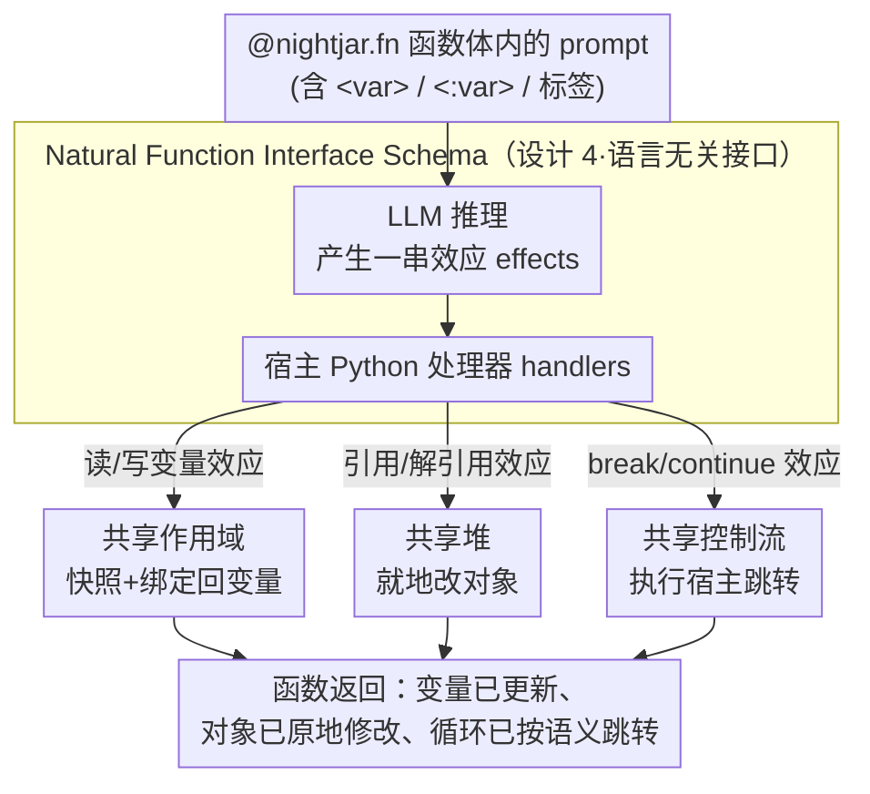

# Sharing State Between Prompts and Programs

**会议**: ICLR 2026  
**arXiv**: [2512.14805](https://arxiv.org/abs/2512.14805)  
**代码**: [https://github.com/psg-mit/nightjarpy](https://github.com/psg-mit/nightjarpy)  
**领域**: 编程语言 / LLM编程  
**关键词**: 共享程序状态, 自然语言编程, prompt-program互操作, Nightjar, 编程抽象  

## 一句话总结
提出共享程序状态（shared program state）抽象，让 prompt 直接读写程序变量、操作堆对象和控制程序流程，实现为 Nightjar 系统（Python + prompt 混合编程），在保持或提升准确率（+4-19%）的同时减少 39.6% 代码量。

## 研究背景与动机

**领域现状**：LLM 催生了自然语言编程——用 prompt 指示模型执行任务。现有系统（LangChain、DSPy、SGLang 等）支持 prompt 与程序的互操作，但采用隔离状态设计（isolated program state）：prompt 在独立环境中执行，开发者需要手动序列化/反序列化数据以传递程序状态。

**现有痛点**：隔离状态设计导致大量样板代码——需要定义 schema 类、序列化函数、反序列化函数来在 prompt 和程序之间传递数据。这增加了开发复杂度，也容易引入错误。

**核心矛盾**：prompt 本质上需要访问程序上下文才能做出合理决策（读取变量值、修改对象状态、控制分支/循环），但现有系统将 prompt 执行与程序状态严格隔离，开发者必须手写桥接代码。

**本文目标**：(a) 定义共享程序状态的编程抽象；(b) 设计 natural function interface 的形式化 schema；(c) 实现 Nightjar 系统验证其可行性和效益。

**切入角度**：借鉴编程语言中的 effects & handlers 范式，将 prompt 对程序状态的操作形式化为效应（effects），由宿主语言的处理器（handlers）实现。

**核心 idea**：让 prompt 像函数一样直接访问程序变量作用域、堆和控制流，消除手动状态传递的开发负担。

## 方法详解

### 整体框架
这篇论文想解决的，是现有自然语言编程系统里 prompt 与程序之间那道"隔离墙"——prompt 在独立环境执行，开发者得手写一堆 schema、序列化/反序列化代码才能把程序数据递进 prompt、再把结果取回来。Nightjar 的做法是把 prompt 当成 Python 程序里的一等代码：开发者用 `@nightjar.fn` 装饰一个函数，在函数体里直接用三引号字符串写 prompt。这个 prompt 能用 `<variable>` 读当前作用域里的局部变量、用 `<:variable>` 把 LLM 的输出写回变量、就地操作 Python 堆对象，甚至触发 break/continue 控制流。整条链路被形式化为 effects & handlers：prompt 想做的每一类操作都是一个"效应（effect）"，由宿主 Python 实现的"处理器（handler）"真正落地，于是 prompt 与程序共享同一份状态，而不是各跑各的。下面这张图把"prompt 发效应 → handler 落地到三种共享状态"这条主链路画出来，三种共享能力又统一在一套接口规范之下。

### 关键设计

**1. 共享作用域（Shared Scopes）：让 prompt 直接读写程序变量，省掉传参样板**

隔离状态设计最直接的负担，是每次都要手动把变量喂进 prompt、再把结果接出来。Nightjar 让 prompt 里的 `<graph>` 直接引用当前作用域中的 `graph` 变量，LLM 输出里的 `<:response>` 则把值绑定回名为 `response` 的变量。机制上，系统在 prompt 执行前对作用域拍一个快照，执行后再用 LLM 产生的写入效应更新对应变量。这样开发者不必再为"传入/传出"定义 schema 类或写序列化函数，prompt 真正变成了程序的一部分，而非一个需要桥接的外部黑盒。

**2. 共享堆（Shared Heap）：让 prompt 就地改复杂对象，而不是返回一个新副本**

光能读写变量还不够——很多任务要修改的是图、列表这类可变对象。难点在于 LLM 不能、也不应该直接去碰 Python 堆。Nightjar 的做法是引入 reference / dereference 两类效应：系统维护一张对象引用表，LLM 只发出"对某引用做某操作"的指令，handler 再把它翻译成对真实 Python 对象的属性修改、方法调用或就地更新。于是 prompt 可以原地改一张图、往列表里加元素，而不是被迫把整个数据结构序列化、返回一个全新版本——既省 token，也避免了大对象来回搬运时的信息丢失。

**3. 共享控制流（Shared Control State）：让 prompt 按语义决定循环何时停、何时跳**

有些分支判断本质上是语义问题（"这轮对话该结束了吗"），用传统条件代码很难写干净。Nightjar 让 prompt 通过标签（labels）引用程序里的控制流结构：当 LLM 输出一个 break 效应时，对应的 handler 就在宿主 Python 程序里执行那条 break，continue 同理。这样 prompt 能根据对话语义直接决定终止循环还是跳过当前迭代，把原本要写在程序里的一堆 `if` 判断收进了 prompt 的自然语言意图里。

**4. Natural Function Interface Schema：把上面三种共享统一成一套语言无关的规范**

前三点都是具体能力，第四点是把它们抽象成一套形式化接口，让"共享程序状态"不只属于 Python。它建立在 effects & handlers 范式之上：effects 一侧定义 prompt 可以发起哪些操作（读变量、写变量、引用/解引用对象、break 等），handlers 一侧定义这些操作在宿主语言里如何实现。读变量、写变量、改堆、控制流于是都被归一成同一类"效应—处理器"配对。因为接口只规定操作语义、不绑定具体语言，任何编程系统理论上都能照这套 schema 实现自己的共享状态，这也是论文强调"抽象比具体系统更重要"的底气所在。

### 一个完整示例：prompt 改一张图
设想一个函数接收图变量 `graph`，prompt 写成 `"在 <graph> 上找出孤立节点并连到中心节点，<:response> 给出改动说明"`。执行时，`<graph>` 触发一个读效应，handler 从作用域快照里取出真实的 `graph` 对象引用；LLM 决定加哪几条边后，发出若干堆操作效应，handler 通过引用表就地在 Python 的 `graph` 上调用加边方法（而不是返回一个序列化的新图）；最后 LLM 产生写效应把说明文字绑定到 `<:response>`，函数返回后 `graph` 已被原地修改、`response` 也已在作用域里就位。整个过程开发者没有写任何 schema、序列化或参数桥接代码。

### 训练策略
Nightjar 不涉及模型训练，贡献在编程系统层面。核心技术挑战是如何把 LLM 的自然语言输出可靠地映射到正确的程序操作——也就是上面 handler 把各类效应落地到宿主语言的那一步。

## 实验关键数据

### 主实验（Nightjar vs 手动实现）

| 任务 | Nightjar 准确率 | 手动实现准确率 | 代码行减少 | 运行时开销 |
|------|---------------|-------------|----------|-----------|
| 图操作 | +4-19% | 基线 | ~40% | 0.4-4.3x |
| 数据处理 | 持平或更高 | 基线 | ~40% | 中等 |
| 控制流任务 | 更高 | 基线 | 显著 | 略高 |

### 消融实验

| 配置 | 效果 | 说明 |
|------|------|------|
| 完整共享状态 | 最优 | 作用域+堆+控制流 |
| 仅共享作用域 | 可用但受限 | 不能修改可变对象 |
| 隔离状态（基线） | 需要大量样板代码 | 传统方式 |

### 关键发现
- 代码量平均减少 **39.6%**，主要来自消除 schema 定义和序列化/反序列化代码
- 准确率提升 **+4-19%**：因为共享状态避免了手动序列化引入的信息丢失和格式错误
- 运行时开销 0.4-4.3 倍：主要来自引用解析和效应处理的额外通信

## 亮点与洞察
- **编程抽象层面的贡献**比具体系统更重要：shared program state 是一个新的编程范式，不仅限于 Python。natural function interface schema 是语言无关的，任何编程系统都可以实现。
- **Effects & Handlers 在 LLM 编程中的应用**非常巧妙：将 prompt 对程序状态的操作抽象为效应，由宿主语言的处理器实现，是 PL 理论与实际 LLM 系统的优雅结合。
- 揭示了一个趋势：计算越来越多地被动态地、自适应地规划和执行，LLM 使得"运行时编程"成为现实。

## 局限与展望
- 运行时开销（0.4-4.3x）在延迟敏感场景下可能不可接受
- LLM 对复杂程序对象的操作可能出错（幻觉写入错误值）
- 目前仅实现了 Python 版本，需要验证在其他语言上的可移植性
- 安全性问题：prompt 直接操作程序状态可能带来意外的副作用

## 相关工作与启发
- **vs LangChain/DSPy**: 这些系统采用隔离状态，需要手动定义 schema 和序列化。Nightjar 消除了这一负担。
- **vs AskIt/ANPL**: 这些系统用 LLM 生成函数来替代 prompt，部分共享状态但不支持写变量和控制流。
- **vs tool use**: 工具使用要求开发者定义自定义函数，Nightjar 的共享状态不需要开发者定义任何额外函数。

## 评分
- 新颖性: ⭐⭐⭐⭐ 共享程序状态是新的编程抽象，effects & handlers 的应用创新
- 实验充分度: ⭐⭐⭐ 任务数量有限，缺少大规模应用验证
- 写作质量: ⭐⭐⭐⭐ PL 形式化规范与实际系统结合良好
- 价值: ⭐⭐⭐⭐ 对 LLM 编程系统的设计有启发意义

<!-- RELATED:START -->

## 相关论文

- [\[ICLR 2026\] Evolving Graph Structured Programs for Circuit Generation with Large Language Models](evolving_graph_structured_programs_for_circuit_generation_with_large_language_mo.md)
- [\[ICLR 2026\] Behavioral Embeddings of Programs: A Quasi-Dynamic Approach for Optimization Prediction](behavioral_embeddings_of_programs_a_quasi-dynamic_approach_for_optimization_pred.md)
- [\[NeurIPS 2025\] Learning From Design Procedure To Generate CAD Programs for Data Augmentation](../../NeurIPS2025/code_intelligence/learning_from_design_procedure_to_generate_cad_programs_for_data_augmentation.md)
- [\[ICLR 2026\] From Assistant to Independent Developer — Are GPTs Ready for Software Development?](from_assistant_to_independent_developer_are_gpts_ready_for_software_development.md)
- [\[ICLR 2026\] ShieldedCode: Learning Robust Representations for Virtual Machine Protected Code](shieldedcode_learning_robust_representations_for_virtual_machine_protected_code.md)

<!-- RELATED:END -->
