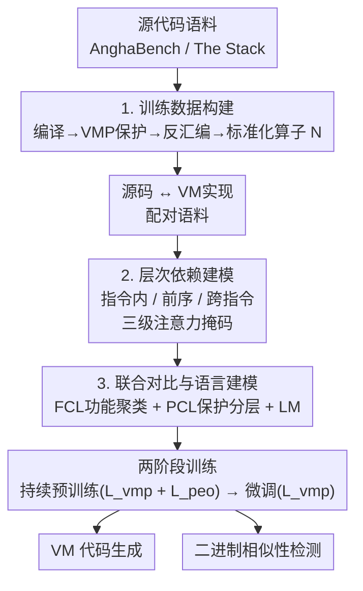

# ShieldedCode: Learning Robust Representations for Virtual Machine Protected Code

**会议**: ICLR 2026  
**arXiv**: [2601.20679](https://arxiv.org/abs/2601.20679)  
**代码**: 无  
**领域**: 代码智能  
**关键词**: 虚拟机保护, 代码表征学习, 对比学习, 多态生成, 软件安全

## 一句话总结

提出 ShieldedCode——首个保护感知的代码表征学习框架，通过层次依赖建模（指令内/前序/跨指令三层）和联合功能感知+保护感知对比学习，使 LLM 能够生成、比较和推理虚拟机保护代码，在 VM 代码生成（Pass@1 26.95% vs. GPT-4o 22.58%）和二进制相似性检测上均超越现有方法。

## 研究背景与动机

1. LLM 在代码生成领域取得显著进展，但在软件保护方面的潜力尚未被挖掘。
2. 逆向工程持续威胁软件安全，传统虚拟机保护（VMP）依赖刚性的规则变换，设计成本高且易被自动化分析攻破。
3. 传统 VMP 系统产生高度规律性的虚拟机结构和指令模式，成为规则和语义攻击的目标。
4. 机器学习在二进制相似性检测和神经反编译上的进展加速了语义恢复的自动化。
5. 现有为编译器级汇编设计的模型（如 Nova、LLMCompiler）处理的是结构稳定的 O0-O3 优化代码，而 VMP 字节码经历多态扩展、虚拟寄存器重命名和解释器驱动的语义变换，领域差距巨大。
6. 核心观点：保护机制需从固定变换规则进化为嵌入语义多样性和动态行为的机制，从而抵御人类和 AI 辅助的分析。

## 方法详解

### 整体框架

这篇论文要解决的是：让 LLM 真正"看懂"并能生成虚拟机保护（VMP）代码——这类代码经过多态扩展、虚拟寄存器重命名和解释器驱动的语义变换，和模型熟悉的 O0-O3 编译代码差距巨大，直接拿现成代码模型套根本学不动。ShieldedCode 的整体流程是：先把源代码经「编译 → VMP 保护 → 反汇编 → 标准化」做成「源码 ↔ VM 实现」的大规模配对语料；再以 CodeLlama 34B 为底座，一边用**层次依赖建模**（三级注意力掩码）把 VM 代码的结构化依赖写进归纳偏置，一边用**联合对比 + 语言建模**目标让嵌入既按功能聚类、又按保护强度分层；最后用「持续预训练（叠加保护效果优化 PEO 任务）→ 微调」的两阶段流水线把模型训出来，下游同时支撑 VM 代码生成与二进制相似性检测两类任务。

### 关键设计

**1. 训练数据构建：把源码和标准化的 VM 字节码配成对**

VMP 字节码经历多态扩展、虚拟寄存器重命名和解释器驱动的语义变换，和模型熟悉的 O0-O3 编译代码差距巨大，要让 LLM 学会它就得先有大规模的配对数据。作者从 AnghaBench 和 The Stack 的源代码出发，经编译（O0-O3）→ 商业 VMP 工具保护 → 反汇编提取 VM 实现，得到「源码 ↔ VM 实现」的成对样本。原始反汇编噪声很大，于是再过一道标准化算子 $\mathcal{N}$ 做四步规范化：移除调试符号、为稳定 tokenization 插入空格、把虚拟地址替换成符号、把标签规范成 `[VINST-1]`、`[VINST-2]`… 这样不同来源的 VM 代码被压到统一的表示形式，模型才能在干净一致的输入上学到保护代码的规律。

**2. 层次依赖建模：用三级注意力掩码对齐 VM 代码的结构化依赖**

标准 Transformer 的扁平因果掩码只知道「前面所有 token 都可见」，看不出 VM 字节码内部「指令是一个语义单元、相邻指令有寄存器复用、远处指令藏着多态控制流」这种层次结构。为此作者对 token $x_t^k$ 的可见上下文施加三级层次掩码：**指令内（intra）** 把每条虚拟指令的 tokens 加上 `[VINST]_t` 标记当作一个连贯语义单元；**前序指令（preceding）** 额外条件化于前一条指令的 `[VINST]_{t-1}`，捕获寄存器复用、操作数流等局部执行模式；**跨指令（inter）** 再连上所有更早的标记 $\{[\text{VINST}]_1, ..., [\text{VINST}]_{t-1}\}$，注入长程上下文以捕获多态变换和分散的控制流依赖。三者并起来就是这条 token 的可见集合：

$$\mathcal{M}(x_t^k) = \underbrace{\{x_t^1,...,x_t^m, [\text{VINST}]_t\}}_{\text{intra}} \cup \underbrace{\{[\text{VINST}]_{t-1}\}}_{\text{preceding}} \cup \underbrace{\{[\text{VINST}]_1,...,[\text{VINST}]_{t-1}\}}_{\text{inter}}$$

这等于把 VM 保护代码的结构化依赖直接写成归纳偏置，比让模型在扁平掩码下自己摸索要稳得多——消融里这一项贡献最大。

**3. 联合对比与语言建模：让嵌入既按功能聚类又按保护强度分层**

光会生成还不够，要做二进制相似性检测就得让同一函数的不同保护变体在嵌入空间里既能被认出是「同一个功能」、又能区分出「保护强度不同」。功能对比学习（FCL）负责前者：把同一函数在不同表征（源码 + L0-L3 保护级别）下的嵌入拉近，并用自适应权重 $w_{s,t} = \exp(-|s-t|/\tau_{\text{fcl}})$，保护级别越接近、拉得越紧。保护对比学习（PCL）负责后者：用一个软边界约束强制不同保护级别的嵌入按保护强度成比例地分开，$d(e_f^s, e_f^t) \geq \beta(t-s) - m$，级别差得越多、要求的距离越大。两者方向不冲突——一个收紧功能簇、一个按强度铺开层级——和语言建模损失一起构成总目标：

$$L_{\text{vmp}} = L_{\text{lm}} + \lambda(L_{\text{fcl}} + L_{\text{pcl}})$$

### 损失函数/训练策略

- **两阶段训练**：
  1. 持续预训练：交替优化对比+语言建模（$L_{\text{vmp}}$）和保护效果优化（$L_{\text{peo}}$），使用 AnghaBench + The Stack + VirtuCorp 3M
  2. 微调：仅优化 $L_{\text{vmp}}$，使用 2.5M 源码-VMP 配对（850M tokens）
- 多态生成应用于一半注意力头，平衡效果与预训练知识保留
- 保护效果优化（PEO）：hard negative mining 策略，$\kappa_i = 1 + \lambda_h \cdot \text{rank}_i$

## 实验关键数据

### 主实验

**VM 代码生成（HumanEval_compile）**：

| 模型 | Pass@1 (L0) | Pass@1 (L1) | Pass@1 (L2) | Pass@1 (L3) |
|------|------------|------------|------------|------------|
| CodeLlama | 7.84 | 3.26 | 5.19 | 2.79 |
| DeepSeekCoder-7B | 10.28 | 6.89 | 7.94 | 6.17 |
| GPT-4o | 22.58 | 17.43 | 15.26 | 11.89 |
| **ShieldedCode** | **26.95** | **18.47** | **19.23** | **14.71** |

**二进制相似性检测（BinaryCorp-VA）**：

| 模型 | Recall@1 O0+L1 | Recall@1 O0+L3 | MRR O0+L1 |
|------|-----------|-----------|-----------|
| jTrans (Linear Probe) | 0.333 | 0.404 | 0.245 |
| Trex | 0.118 | 0.148 | 0.073 |
| **ShieldedCode** | **0.488** | **0.272** | **0.575** |

### 消融实验

| 配置 | Pass@1 Avg. | Pass@10 Avg. |
|------|-----------|------------|
| ShieldedCode^{-CL-PG} (仅语言建模) | 15.78 | 27.41 |
| ShieldedCode^{-PG} (加对比学习) | 21.86 | 35.25 |
| **ShieldedCode** (全部组件) | **25.17** | **38.30** |

**Granite 128K 长输入消融**：

| 配置 | Pass@1 Avg. | Pass@10 Avg. |
|------|-----------|------------|
| Granite 3B 128K | 4.62 | 6.44 |
| + Standard Fine-Tuning | 12.84 | 19.41 |
| + ShieldedCode Approaches | **17.91** | **25.25** |

### 关键发现

1. **在 VM 代码生成上超越 GPT-4o**：L0 级别 Pass@1 提升 4.37 个百分点（26.95% vs. 22.58%），L2 级别提升更显著（19.23% vs. 15.26%）。
2. **层次依赖建模贡献最大**：从 ShieldedCode^{-PG} 到完整模型，Pass@1 平均提升 3.31 个百分点。
3. **逆向工程抵御力**: 人工逆向分析成功率仅 17%（vs. VMProtect 67%），平均耗时 14.7 小时（vs. 3.4 小时）；模式匹配攻击成功率 0%。
4. **与长输入技术正交互补**：ShieldedCode 方法应用于 Granite 128K 后额外提升 5.07% Pass@1。

## 亮点与洞察

1. 首次将软件保护形式化为表征学习问题，开辟了基于学习的软件防御新方向。
2. 设计巧妙的三层层次注意力掩码——与标准 Transformer 的扁平因果掩码不同，引入了与 VM 保护代码结构化依赖对齐的归纳偏置。
3. FCL 与 PCL 的数学兼容性——FCL 的指数衰减权重和 PCL 的线性缩放约束协同工作，在功能聚类和保护分层间实现稳定均衡（有定理证明）。
4. 逆向工程用户研究设计完善——12 名研究生 + 3 名专业逆向工程师交叉验证，提供了可信的安全评估。

## 局限与展望

1. 基于 CodeLlama 34B，模型规模大，实际部署的推理成本较高。
2. 训练数据仅覆盖 C 语言 x86-64 架构，对其他语言和 ISA（ARM、RISC-V）的泛化性未验证。
3. 仅使用单一商业 VMP 工具，不同 VMP 系统的保护风格差异可能影响模型泛化性。
4. PEO 任务的候选池大小（K=50~500）相对有限，更大规模检索场景需进一步评估。

## 相关工作与启发

- **jTrans**：基于 Transformer 的二进制代码相似性检测，通过线性探针微调，但未针对 VMP 设计。
- **Nova**：编译器级汇编的层次建模，但处理的是结构稳定的 O0-O3，VMP 字节码难度更高。
- **LLMCompiler**：Meta 的 LLVM IR/汇编预训练模型，401B tokens，但非 VMP 代码设计。
- **CodeArt**：正则化注意力用于汇编表征，但未涉及保护感知目标。
- 启发：LLM 不仅是代码生成器，更是重新思考程序表征和保护的催化剂；层次化注意力掩码思路可推广到其他具有层次结构的代码（如编译 IR、WebAssembly）。

## 评分

- ⭐ 新颖性: 4.5/5 — 首个保护感知代码表征学习框架，三层层次依赖建模 + FCL/PCL 联合优化均为原创
- ⭐ 实验充分度: 4/5 — 覆盖生成、检测、PEO 三个任务 + 消融 + 逆向工程用户研究，但部分基线为估计值
- ⭐ 写作质量: 3.5/5 — 技术内容扎实但论文较长，部分公式符号不统一
- ⭐ 价值: 4/5 — 开辟学习型软件保护新方向，对安全社区有重要启示

<!-- RELATED:START -->

## 相关论文

- [\[ICLR 2026\] Paper2Code: Automating Code Generation from Scientific Papers in Machine Learning](paper2code_automating_code_generation_from_scientific_papers_in_machine_learning.md)
- [\[ICML 2025\] Robust Learning of Diverse Code Edits (NextCoder)](../../ICML2025/code_intelligence/robust_learning_of_diverse_code_edits.md)
- [\[ICLR 2026\] Agnostics: Learning to Synthesize Code in Any Programming Language with a Universal Reinforcement Learning Environment](agnostics_learning_to_synthesize_code_in_any_programming_language_with_a_univers.md)
- [\[ICLR 2026\] The Natural Geometry of Code: Hyperbolic Representation Learning for Program Reasoning](the_natural_geometry_of_code_hyperbolic_representation_learning_for_program_reas.md)
- [\[ICLR 2026\] Learning to Reason without External Rewards](learning_to_reason_without_external_rewards.md)

<!-- RELATED:END -->
