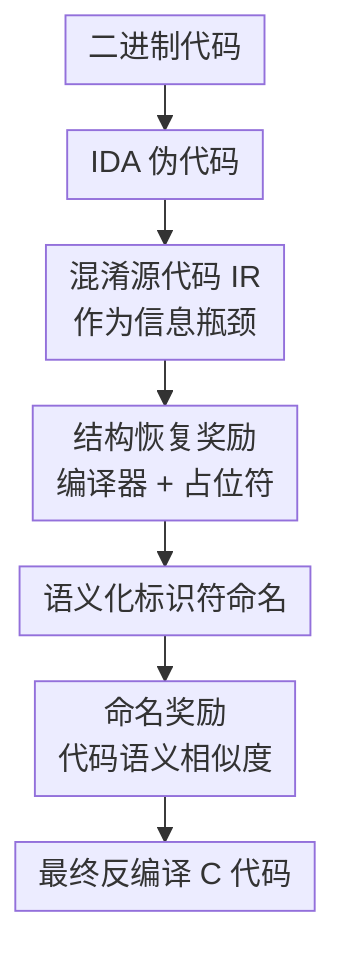

# SK2Decompile: LLM-based Two-Phase Binary Decompilation from Skeleton to Skin

**会议**: ICLR2026  
**OpenReview**: [https://openreview.net/forum?id=jSQPqdoidy](https://openreview.net/forum?id=jSQPqdoidy)  
**论文**: [OpenReview](https://openreview.net/forum?id=jSQPqdoidy)  
**代码**: https://github.com/albertan017/LLM4Decompile  
**领域**: 代码智能 / 二进制反编译  
**关键词**: 二进制反编译、代码大模型、结构恢复、标识符命名、强化学习  

## 一句话总结
SK2Decompile 把二进制反编译拆成“先恢复可编译的程序骨架、再补回语义化标识符”的两阶段 LLM 流程，并分别用编译器反馈和语义相似度奖励做强化学习，从而同时提升反编译代码的可执行性与可读性。

## 研究背景与动机
**领域现状**：二进制反编译希望把编译后的可执行文件还原成接近源代码的高级语言代码，常用于恶意软件分析、漏洞挖掘和遗失源码恢复。传统工具如 IDA、Ghidra 更擅长保留底层控制流和数据流，因此输出往往能辅助静态分析；近年的 LLM 反编译器则尝试把这些低层伪代码改写成更像人写的 C 代码，提升可读性。

**现有痛点**：真正困难的是“正确”和“好读”很难同时做到。传统反编译器常把变量、函数、结构体字段写成地址或占位名，逻辑虽能看出一点轮廓，但很难复用或重新编译；LLM 方法输出更自然，却容易在控制流、数据结构或指针访问上改错，导致代码无法重编译或无法通过原始测试。论文里的例子很典型：模型能把 `while(1)` 和 `goto` 改成更自然的循环，却把 `Table`、`Entry` 这类领域结构误还原成泛化的 `_glist`，后续变量和函数命名也随之失真。

**核心矛盾**：端到端从伪代码直接生成源代码时，模型必须同时推断控制流、数据布局、类型层次、函数语义和变量命名。这些信息在 stripped binary 中本来就不完整，放在一个生成阶段里会相互干扰：为了让代码看起来像源代码，模型可能“美化”掉底层约束；为了保留底层约束，又容易输出一堆不可读的低层名字。

**本文目标**：作者希望把反编译问题分解成两个相对独立的子问题。第一个子问题只追求结构正确：从 IDA 伪代码恢复出高层控制流、数据结构和字段访问，但暂时不要求真实变量名。第二个子问题只追求语义命名：在结构已经干净的中间表示上，为函数、类型、字段、变量补上更像源代码的名字。

**切入角度**：论文的关键观察是，标识符名在编译后基本丢失，但程序结构仍然以控制流、内存访问和类型约束的形式残留在伪代码中。与其让模型一次性猜所有东西，不如先构造一种“只有结构、没有真实名字”的中间表示（IR）：它足够接近源代码，能支撑后续命名；又去掉了标识符语义，能降低第一阶段恢复难度。

**核心 idea**：用“混淆源代码 IR”作为骨架，把二进制反编译建模为 $P(s|u) \approx \sum_i P(s|i)P(i|u)$，先学 $P(i|u)$ 恢复结构，再学 $P(s|i)$ 恢复名字，并为两个阶段设计不同的 RL 奖励。

## 方法详解

### 整体框架
SK2Decompile 的输入不是原始机器码直接到源代码，而是先由 IDA 等工具得到低层伪代码，再经过两个 LLM 模型逐步还原。第一阶段 Structure Recovery 把伪代码翻译成混淆后的源代码 IR，这个 IR 保留循环、分支、结构体访问和函数调用关系，但把用户自定义标识符替换成 `func1`、`type1`、`field1`、`var1` 之类占位符。第二阶段 Identifier Naming 在这个干净结构上预测语义化的函数名、类型名、字段名和变量名，输出最终可读源代码。

训练流程也和这个拆分一致。作者先从真实源代码自动生成 IR：保留标准库函数和基础类型等在伪代码与源代码中一致出现的名字，其余用户定义标识符都通过 AST 精确替换成按类别编号的占位符。随后，两个阶段都先做监督微调，再做强化学习：结构恢复阶段用编译器检查和占位符集合恢复质量作为奖励，命名阶段用生成代码与参考源代码的 embedding 余弦相似度作为奖励。

从概率视角看，直接最大化 $P(s|u)$ 很难，其中 $u$ 是伪代码，$s$ 是目标源代码。作者引入中间表示 $i$ 后，把问题拆成 $P(s|i,u)P(i|u)$；又基于 Markov 假设认为一旦结构化 IR 恢复完成，原始伪代码对命名帮助很小，于是近似成：

$$
P(s|u) \approx \sum_i P(s|i) \cdot P(i|u)
$$

这个近似并不是纯数学花活，它对应了一个很实用的工程判断：从 `*(uint8_t *)(v5 + 1)` 推断名字很难，但若第一阶段已经恢复成 `var3->field2->field3`，第二阶段就可以在更接近源代码的结构上判断它可能是 `entry->key->obj.markers`。

### 关键设计
**1. 混淆源代码 IR：把“能从二进制恢复的结构”和“编译后丢失的名字”切开**

这篇论文最重要的中间层不是传统编译器 IR，而是“把真实源代码里的用户标识符全部替换为占位符”的 obfuscated source code。它长得仍然像 C 源代码，有函数体、结构体字段访问、循环和条件分支；但变量名、函数名、类型名、字段名都变成按类别编号的中性符号。这样一来，第一阶段不再被要求凭空猜出 `tableRemoveWhite`、`Entry`、`markers` 这些编译后很可能消失的信息，只需要恢复“这里有一个迭代器、这里访问了嵌套字段、这里满足条件就删除元素”这种结构。

作者用信息瓶颈原则解释这个选择。理想 IR 要压缩伪代码中的低层噪声，同时保留足够多的源代码相关信息。形式上，目标可写成 $\mathcal{L}_{IB}=I(u;i)-\beta I(i;s)$：希望降低伪代码 $u$ 和 IR $i$ 之间不必要的互信息，又提高 IR $i$ 和源代码 $s$ 之间的相关性。混淆源代码正好适合这个目标，因为标识符语义被压掉了，但源级结构、控制流和数据访问还在。

**2. AST 级 IR 生成：用可控占位符构造稳定训练目标**

IR 的生成不是简单字符串替换，而是先解析伪代码和源代码，找出需要保留的名字，再用源代码 AST 定位所有可替换标识符。标准类型、库函数或在伪代码和源代码中完全匹配的 `[Category, Name]` 会进入保留集合 $F_P$，其余函数、类型、字段、变量分别维护重命名表 $R[\cdot]$ 和计数器，生成 `func1`、`type1`、`field1`、`var1` 这类类别化占位符。

这个做法的价值在于训练信号非常干净。若直接让模型从伪代码生成真实源代码，名字不同但语义相近会被交叉熵当作错误，结构错误和命名差异也混在一起；而 IR 让第一阶段有一个可编译、可比较、可自动生成的大规模监督目标。论文因此能从 ExeBench 和 Decompile-Bench 的 C 程序中构造约 500 万样本，形成约 2B tokens 伪代码、1.5B tokens IR 和 1.5B tokens 源代码的训练语料。

**3. 结构恢复奖励：用编译器反馈约束模型别生成“看起来像代码”的错代码**

监督微调的交叉熵只看 token 层面的局部匹配，很难区分“变量名不一样但还能编译”和“少了一个分号导致整段代码不可用”这两类错误。Structure Recovery 阶段因此在 SFT 后加入 RL，让模型偏向输出能被编译器接受、且占位符集合恢复正确的 IR。给定生成 IR 的占位符集合 $I_{gen}$ 和真值 IR 的占位符集合 $I_{IR}$，论文使用 Jaccard 相似度作为占位符恢复奖励：

$$
r_{placeholder}=\frac{|I_{gen}\cap I_{IR}|}{|I_{gen}\cup I_{IR}|}
$$

结构奖励则是一个很硬的门控：如果 IR 不能编译，奖励为 $0$；只有能编译时，才给 $1.0+r_{placeholder}$。也就是：

$$
r_{structure}=\begin{cases}
0.0, & \text{if IR cannot be compiled}\\
1.0+r_{placeholder}, & \text{if IR can be compiled}
\end{cases}
$$

这个设计很贴合反编译任务。真实项目里为每个函数写单元测试非常昂贵，但编译器检查相对便宜，而且能直接暴露类型、语法、声明和数据结构层面的错误。作者还用 Psyche-C 生成 header 辅助编译检查，让 RL 奖励能覆盖更多真实 C 代码情况。

**4. 标识符命名奖励：不追求字面完全一致，而追求人能读懂的语义相近**

Identifier Naming 阶段面对的问题和第一阶段不同：同一个含义可以有多个合理名字，例如 `available`、`free`、`avail` 都可能表达空闲指针。若继续只用交叉熵，模型会被迫模仿参考代码的字面名字，而不是学习“这个变量在程序里扮演什么角色”。因此作者为命名阶段设计了语义相似度奖励，把生成代码 embedding $e_{gen}$ 和参考源代码 embedding $e_{src}$ 的余弦相似度作为奖励：

$$
r_{identifier}=\cos(e_{gen}, e_{src})=\frac{e_{gen}\cdot e_{src}}{\|e_{gen}\|\|e_{src}\|}
$$

实验中这个 embedding 由 qwen-embedding-0.6B 计算。这样的奖励会鼓励模型输出语义上接近原程序意图的名字，而不是死抠完全相同的 token。它也解释了为什么论文把结构恢复和命名拆开：结构阶段需要编译器这种硬约束，命名阶段需要更贴近人类阅读体验的软语义约束，两者放在同一个奖励里反而容易互相稀释。

### 一个完整示例
以论文中的表迭代删除函数为例，IDA 伪代码里可能出现 `while(1)`、`goto LABEL_2`、`*(uint8_t *)(v5 + 1)` 这种低层控制流和指针偏移。端到端模型若直接生成源代码，需要同时判断循环边界、恢复字段访问、猜出结构体类型、再命名函数变量，任何一步错都会连锁影响。

SK2Decompile 的第一阶段先把它恢复成类似 `void func1(type1 *var1)` 的 IR：循环变回自然的 `while (func3(...))`，指针偏移变成 `var3->field1->field2.field3`，删除操作变成 `func4(&var2, var1)`。这个阶段的名字仍然很泛，但结构已经从“地址和跳转”变回“迭代器、条目、字段检查、条件删除”。

第二阶段再根据这个结构判断命名。`type1` 可以命名为 `Table`，`type3` 可以命名为 `Entry`，`field1->field2.field3` 可以变成 `key->obj.markers`，最终得到接近原始语义的 `tableRemoveWhite(Table *table)`。这个例子体现了“骨架到皮肤”的核心：先让代码站起来，再给它补上能被人理解的名字。

### 损失函数 / 训练策略
两个阶段都采用序列到序列训练范式，先用交叉熵损失做监督微调：

$$
\mathcal{L}_{CE}(\theta)=-\sum_{i=1}^{N}\log P_\theta(y_i|y_{<i},x)
$$

Structure Recovery 和 Identifier Naming 模型都从 LLM4Decompile-6.7B 初始化，使用 LLaMA-Factory 训练 1 个 epoch，batch size 为 128，学习率为 $3e^{-6}$。RL 阶段使用 veRL 中的 GRPO，在计算约束下从训练集中随机抽取 50,000 个样本。推理时使用 vLLM 加速，并采用 greedy decoding 减少随机性。

训练数据来自 ExeBench 和 Decompile-Bench 的 C 程序，编译目标为 x86 Linux，并使用 GCC 与 Clang 在 $-O0$ 到 $-O3$ 优化级别下生成二进制。作者还做了注释移除、clang-format、R2I 格式规范化、MinHash-LSH 去重，并使用 stripped binaries 和 IDA 伪代码模拟真实反编译场景。

## 实验关键数据

### 主实验
论文在 HumanEval、MBPP、ExeBench、GitHub2025 四个 benchmark 上评估，指标包括 re-executability、R2I 和 GPT-judge。HumanEval 与 MBPP 支持重新编译并跑测试，因此可直接衡量功能正确性；ExeBench 和 GitHub2025 更偏真实项目结构，主要用于可读性和命名质量评估。

| 数据集 | 指标 | SK2Decompile | 最强可比基线 | 提升 |
|--------|------|--------------|--------------|------|
| HumanEval | 平均 re-executability | 69.00 | GPT-5-mini 56.75 | +21.6% |
| MBPP | 平均 re-executability | 59.63 | Ref-Decompile 52.16 / GPT-5-mini 47.23 | +14.3% vs Ref-Decompile |
| ExeBench | 平均 R2I | 72.99 | Idioms 63.82 | +18.4% |
| GitHub2025 | 平均 R2I | 71.62 | Idioms 61.63 | +29.4% |
| GitHub2025 | 平均 GPT-judge | 3.06 | GPT-5-mini 2.87 | +6.7% |

从 re-executability 看，SK2Decompile 是论文中第一个在 HumanEval 达到约 70%、在 MBPP 达到约 60% 平均可重执行率的模型。优化级别越高，二进制越难反编译，但它在 $O3$ 下仍明显强于大多数基线：HumanEval $O3$ 为 57.52，MBPP $O3$ 为 51.58。

| 方法 | HumanEval AVG re-exec | MBPP AVG re-exec | HumanEval AVG R2I | GitHub2025 AVG R2I | GitHub2025 AVG GPT-judge |
|------|-----------------------|------------------|-------------------|--------------------|--------------------------|
| IDA | 40.95 | 39.64 | 39.45 | 39.26 | 2.28 |
| GPT-5-mini | 56.75 | 47.23 | 43.49 | 30.03 | 2.87 |
| LLM4Decompile | 41.71 | 43.05 | 72.87 | 49.47 | 2.62 |
| Idioms | 29.81 | 24.01 | 65.30 | 61.63 | 2.18 |
| SK2Decompile | 69.00 | 59.63 | 77.17 | 71.62 | 3.06 |

这个表更能看出不同方法的取舍。LLM4Decompile 在 HumanEval R2I 上不低，但可重执行率明显不足，说明结构看起来像源代码不代表行为正确；GPT-5-mini 的命名和综合生成能力强，但在真实二进制结构恢复上不稳定；SK2Decompile 的优势来自结构和命名分开优化，而不是单纯换了更大的模型。

### 消融实验
消融把方法拆成五个变体：`pseudo-src` 是端到端伪代码到源代码；`pseudo-ir` 只做结构恢复；`pseudo-ir-src` 是两阶段但只做 SFT；`pseudo-ir-rl` 给结构恢复加 RL；`pseudo-ir-src-rl` 是完整 SK2Decompile。

| 配置 | HumanEval AVG re-exec | MBPP AVG re-exec | 说明 |
|------|-----------------------|------------------|------|
| pseudo-src | 54.86 | 47.51 | 端到端 SFT，直接从伪代码生成源代码 |
| pseudo-ir | 62.56 | 47.25 | 只恢复 IR，验证结构恢复本身的价值 |
| pseudo-ir-rl | 68.84 | 57.06 | 结构恢复加编译器与占位符奖励 |
| pseudo-ir-src | 63.75 | 52.83 | 两阶段 SFT，无 RL |
| pseudo-ir-src-rl | 69.00 | 59.63 | 完整模型，结构与命名阶段均增强 |

最清楚的结论是：单纯拆两阶段已经有收益，`pseudo-ir-src` 比 `pseudo-src` 在 HumanEval 上从 54.86 提到 63.75，在 MBPP 上从 47.51 提到 52.83。加入 RL 后收益更明显，`pseudo-ir-rl` 相比 `pseudo-ir` 在 HumanEval 和 MBPP 上分别提升约 10.0% 和 20.8%，说明编译器反馈对结构正确性非常关键。

| 配置 | HumanEval AVG R2I | MBPP AVG R2I | ExeBench AVG R2I | GitHub2025 AVG R2I | 说明 |
|------|------------------|--------------|------------------|--------------------|------|
| pseudo-src | 56.47 | 55.83 | 55.15 | 53.17 | 端到端结构可读性基线 |
| pseudo-ir | 56.39 | 55.26 | 55.18 | 56.46 | 单独结构恢复已改善真实项目 R2I |
| pseudo-ir-rl | 57.53 | 57.36 | 60.92 | 57.15 | RL 后结构可读性同步提升 |
| pseudo-ir-src | 57.10 | 55.80 | 55.73 | 57.33 | 两阶段 SFT 带来稳定改善 |
| pseudo-ir-src-rl | 57.49 | 57.75 | 61.06 | 57.73 | 完整模型整体最好或接近最好 |

R2I 消融趋势和 re-executability 一致：结构恢复不是只为通过编译服务，它也能提升高层控制流和数据访问的可读性。GPT-judge 消融也显示完整模型命名质量最好，尤其在 HumanEval 和 MBPP 上达到 4.24 与 4.12。

### 关键发现
- SK2Decompile 的最大贡献不是“让 LLM 输出更漂亮的代码”，而是把反编译中的结构正确性与标识符可读性拆开优化，避免端到端生成时二者互相拖累。
- 编译器反馈是结构恢复阶段最有效的监督信号之一，因为它比 token-level loss 更接近“这段代码能不能作为 C 程序存在”的硬约束。
- 语义相似度奖励比 exact name match 更适合标识符命名，因为反编译场景里同义或近义命名很多，字面不同不一定代表可读性差。
- 在真实项目 benchmark 上，SK2Decompile 的 R2I 提升尤其明显，说明 IR 设计确实帮助模型从低层指针访问中恢复更自然的数据结构。
- 论文附录还显示，若把 SK2Decompile 输出交给后续 Codex 修复循环，起点越好，上限越高；无测试时从 SK2Decompile 开始的 HumanEval 平均可重执行率可到 79.60，而从 LLM4Decompile 开始为 54.16。

## 亮点与洞察
- **把 IR 设计成“混淆源代码”很务实**：它不像传统编译器 IR 那样离源代码太远，也不像真实源代码那样要求恢复丢失的名字。这个中间层让模型训练目标、自动数据生成和编译器反馈三件事同时变得可操作。
- **两种 RL 奖励分别对齐两种错误类型**：结构阶段用“能不能编译”惩罚硬错误，命名阶段用 embedding 相似度容忍合理同义命名。相比把所有目标揉成一个分数，这种分工更符合反编译任务的实际失败模式。
- **论文没有把传统工具当成对立面**：SK2Decompile 仍然依赖 IDA 伪代码作为输入，也用编译器和 Psyche-C 做验证。它更像是把传统反编译器的确定性分析与 LLM 的语义补全能力接起来。
- **信息瓶颈视角解释了为什么“先去名再命名”合理**：如果标识符在编译后本就不可直接观测，把它们先从结构目标里移除，反而能减少噪声，让模型先学更可恢复的部分。
- **案例分析很有说服力**：内存分配函数例子显示，端到端模型可能写出类型转换和字段名都别扭的代码；SK2Decompile 先恢复 `state->avail`、`state->limit` 这类结构，再命名，输出更接近可维护源代码。

## 局限与展望
- **单函数上下文仍然限制很大**：全局变量、跨函数类型、`.rodata` 常量和调用图信息往往不在当前函数伪代码里。论文也承认，未来若走 binary-level decompilation，需要处理平均每个函数调用 6.3 个其他函数带来的上下文长度和注意力计算成本。
- **对非典型低层模式仍可能被 IDA 伪代码误导**：附录里的数组初始化例子说明，当 IDA 把相邻栈变量和数组访问编码成很反常的别名模式时，模型可能沿着错误伪代码生成看似合理但语义偏移的结果。
- **精确算术反优化不是 LLM 强项**：编译器会把 `% 11`、`% 13` 这类取模变成 magic number 乘法和比较，SK2Decompile 能猜出这是取模，却可能恢复错常数。更可靠的路线可能是把 SMT solver、符号执行或反优化规则接入生成循环。
- **语言泛化仍受 C 训练数据约束**：论文展示了 Go 和 C++ 上的一些结构恢复能力，但也明确指出标准库抽象、模板、多态、Go runtime 等语言特性需要专门预处理和配对数据，不能指望 C 模型自然解决。
- **奖励仍依赖外部工具覆盖率**：编译器反馈和 Psyche-C header 生成很有用，但真实 C 项目里宏、平台依赖、复杂 build system 都可能让“能否编译”这个信号变得不完整。

## 相关工作与启发
- **vs IDA / Ghidra**: 传统反编译器擅长把二进制提升为可分析的伪代码，但标识符和高层抽象通常很弱。SK2Decompile 不替代它们，而是把它们的伪代码作为 LLM 输入，再恢复更接近源代码的结构和命名。
- **vs LLM4Decompile**: LLM4Decompile 证明了 LLM 可以从低层伪代码生成更自然的源代码，但端到端生成容易混淆结构和命名。SK2Decompile 继承其模型 checkpoint，却通过 IR 和阶段化奖励显著提升可重执行率。
- **vs Idioms**: Idioms 引入相邻函数和类型信息，重点是联合恢复代码与类型。SK2Decompile 的切入点不同，它先把当前函数恢复到可编译的混淆 IR，再做命名，因此在 GitHub2025 的 R2I 上提升明显。
- **vs D-LIFT / 反馈式 LLM 修复**: D-LIFT 和后处理修复都说明反馈能改进反编译代码。SK2Decompile 的启发是，反馈不一定只放在推理后修 bug，也可以在训练阶段变成结构恢复和命名恢复的分阶段奖励。
- **对代码生成研究的启发**: 很多代码任务也存在“结构正确”和“命名/风格自然”两类目标。SK2Decompile 的做法提示我们，可以先构造一个去语义名但保留结构的中间目标，再让模型在第二阶段补全更人类友好的表层信息。

## 评分
- 新颖性: ⭐⭐⭐⭐⭐ 把混淆源代码 IR、两阶段反编译和阶段化 RL 奖励组合得很自然，解决的是 LLM 反编译里非常核心的结构/命名耦合问题。
- 实验充分度: ⭐⭐⭐⭐⭐ 覆盖 HumanEval、MBPP、ExeBench、GitHub2025，并给出主实验、消融、case study、架构/语言鲁棒性和反馈循环分析，证据链很完整。
- 写作质量: ⭐⭐⭐⭐☆ 论文主线清楚，案例直观；但部分表述和附录有少量拼写与排版问题，个别 baseline 可复现性讨论略显冗长。
- 价值: ⭐⭐⭐⭐⭐ 对安全分析、逆向工程和代码大模型都很有参考价值，尤其是“可编译结构先行”的设计可以迁移到更广义的程序恢复任务。

<!-- RELATED:START -->

## 相关论文

- [\[ACL 2025\] Beyond Sequences: Two-dimensional Representation and Dependency Encoding for Code Generation](../../ACL2025/code_intelligence/beyond_sequences_two-dimensional_representation_and_dependency_encoding_for_code.md)
- [\[ICLR 2026\] KV Cache Transform Coding for Compact Storage in LLM Inference](kv_cache_transform_coding_for_compact_storage_in_llm_inference.md)
- [\[ICLR 2026\] LLM-Guided Evolutionary Program Synthesis for Quasi-Monte Carlo Design](llm-guided_evolutionary_program_synthesis_for_quasi-monte_carlo_design.md)
- [\[ICLR 2026\] HARDTESTGEN: A High-Quality RL Verifier Generation Pipeline for LLM Algorithmic Coding](hardtestgen_a_high-quality_rl_verifier_generation_pipeline_for_llm_algorithmic_c.md)
- [\[ICLR 2026\] EDIT-Bench: Evaluating LLM Abilities to Perform Real-World Instructed Code Edits](edit-bench_evaluating_llm_abilities_to_perform_real-world_instructed_code_edits.md)

<!-- RELATED:END -->
