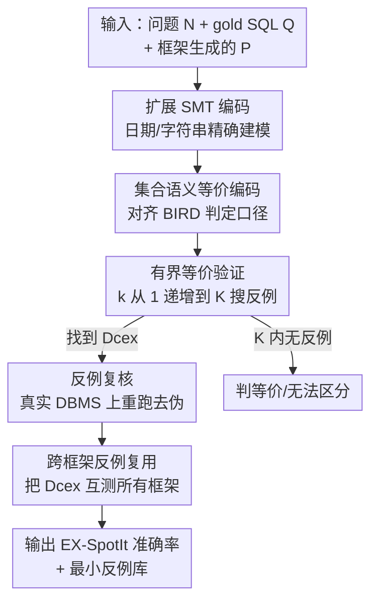

# SpotIt: Evaluating Text-to-SQL Evaluation with Formal Verification

**会议**: ICLR2026  
**OpenReview**: [https://openreview.net/forum?id=iMkvR2ICSE](https://openreview.net/forum?id=iMkvR2ICSE)  
**代码**: 待确认  
**领域**: 代码智能 / Text-to-SQL / 形式化验证  
**关键词**: Text-to-SQL评估, 有界等价验证, SMT编码, 反例数据库, BIRD基准

## 一句话总结
这篇论文指出当前 Text-to-SQL 评估"在单个测试库上比执行结果"的做法过于乐观，提出 SpotIt 用 SMT 有界等价验证主动搜索一个能区分生成 SQL 与 gold SQL 的数据库；在 BIRD 上把十个 SOTA 方法的准确率拉低了 9.8%–13.5%，还顺带发现"对不上时往往是 gold SQL 本身错了"。

## 研究背景与动机

**领域现状**：Text-to-SQL 是自然语言数据接口的基础组件，BIRD、Spider 这类社区评测平台几乎实时地给各家方法排名。这些榜单是领域进步的风向标，所以"怎么判一条生成 SQL 是否正确"直接决定了大家在优化什么。

**现有痛点**：主流评估方式是 **基于测试（test-based）** 的执行准确率（EX-TEST）——把生成的 SQL `P` 和人工标注的 gold SQL `Q` 都在**一个静态测试库** $D_{test}$ 上跑，结果集相同就判对。问题在于：两条语义并不等价的查询，完全可能因为这个测试库里恰好没有能把它们区分开的数据，而"碰巧"返回相同结果。于是 EX-TEST 是**乐观的**——它说对，不代表真的对。

**核心矛盾**：判断两条 SQL 是否在**所有**数据库上等价（无界等价）在一般情况下是不可判定的，所以大家退而求其次用单个测试库测一下；但"省事的测试库"和"真正的等价保证"之间存在根本落差。一旦测试库覆盖不到差异点，榜单上的绝对准确率和相对排名就可能失真。

**本文目标**：(1) 给出一个比 EX-TEST 更严格、能提供正确性保证的评估流程；(2) 量化现有榜单到底高估了多少、排名错了多少；(3) 借助验证结果反过来审视评估本身的缺陷（gold SQL 错没错、问题歧不歧义）。

**切入角度**：与其被动地相信一个测试库，不如**主动去搜一个能把 `P` 和 `Q` 区分开的数据库** $D_{cex}$。既然无界等价不可判定，就做**有界等价验证（bounded equivalence checking）**——只在"每张表至多 $K$ 行"的小规模数据库里搜反例，这是可判定的，而且小反例足够暴露问题。

**核心 idea**：把 Text-to-SQL 评估从"在固定库上比结果"换成"用 SMT 求解器主动搜反例库"，并把验证器扩展到 Text-to-SQL 真正用得到的字符串/日期算子上。

## 方法详解

### 整体框架

SpotIt 建立在有界等价验证器 VERIEQL 之上。VERIEQL 的核心思路是：把两条 SQL 的符号化执行、以及"结果不等价"这个条件，一起编码成一个 **SMT 公式**——公式可满足，就说明存在一个让两条查询结果不同的数据库（即反例 $D_{cex}$）；公式不可满足，则说明在当前规模上两条查询等价。

但原版 VERIEQL 缺了 Text-to-SQL 高频依赖的能力：精确的**日期/字符串**编码和隐式类型转换。所以 SpotIt 先在 §4.1 **扩展 SMT 编码**（贡献设计 1、2），再在 §4.2 把扩展后的验证器套进一个**三阶段评估流水线**，并加上**跨框架反例复用**（设计 3、4）。整条流程是：给定问题 `N`、gold SQL `Q`，让某个 Text-to-SQL 框架生成 `P`；逐步增大 bound `k` 做有界等价验证；找到反例后还要在真实 DBMS 上复核它不是"假反例"；最后把各框架攒下来的反例互相交叉测试以提效。

> 框架里点名的四个贡献组件——日期/字符串编码、集合语义编码、三阶段验证流水线、跨框架反例复用——下面四个关键设计逐一交代。

### 关键设计

**1. 日期与字符串的精确 SMT 编码：让验证器看得懂 Text-to-SQL 真实用到的算子**

原版 VERIEQL 把日期粗暴地编码成一个整数变量，这够做大小比较，但撑不起 Text-to-SQL 里常见的 `STRFTIME` 日期格式化、`SubStr`、`Like`/`PrefixOf`/`SuffixOf` 这类操作；字符串和隐式类型转换（如 `1 + "a"`、`date("2000-01-01") + "1"`）更是直接没法表达。SpotIt 把日期拆成 `(year, month, day)` 三个整数变量，并用约束公式精确刻画其取值——年份在引擎允许范围内（SQLite 是 0–9999），月份 $1\le m\le 12$，天数则随月份和闰年变化：

$$\Phi_3 = 1 \le d \;\wedge\; \big(\textstyle\bigvee_{c\in\{1,3,5,7,8,10,12\}} m=c \to d\le 31\big)\;\wedge\;\big(m=2 \to d\le 28+\mathrm{ite}(\mathrm{leap}(y),1,0)\big)\;\wedge\;\big(\textstyle\bigvee_{c\in\{4,6,9,11\}} m=c \to d\le 30\big)$$

其中 $\mathrm{leap}(y)=\big(y\%4=0 \wedge (y\%100\ne 0 \vee y\%400=0)\big)$。在此基础上又补齐了 `ToInt/ToDate/ToStr` 等类型转换和一批字符串谓词（语法见原文 Fig. 2，新增算子加粗标出）。这一步直接决定了验证器**能覆盖多少题**——没有它，大量含日期/字符串的题根本无法编码成 SMT，也就无从验证。

**2. 集合语义下的等价编码：对齐 BIRD 的判定口径，并保证编码正确性**

SQL 等价检查器通常支持 bag 语义和 list 语义，但 BIRD 默认用**集合语义（set semantics）**判等价（即 EX-TEST 比较两个结果表的行**集合**是否相同）。SpotIt 把"集合相等 = 互相包含"这件事写成 SMT 约束：对结果表 $R_1=[t_1,\dots,t_n]$ 与 $R_2=[r_1,\dots,r_m]$，要求每个未被删除（$\neg \mathrm{Del}(t)$，`Del` 是表示符号元组不存在的未解释函数）的元组都能在对方表里找到相等且未删除的对应元组，双向都成立才判等价。论文还给出并证明了两条正确性定理：Thm. 1 保证扩展表达式/谓词的**符号执行与具体执行一致**（即符号编码的满足解等于真实求值结果），Thm. 2 保证上述集合语义编码成立时两表确实集合等价。有了这两条，SpotIt 报出来的反例才是可信的、不是编码 bug。

**3. 三阶段搜索-验证-复核流水线：把"主动搜反例"落成可执行算法**

这是 SpotIt 的主干（原文 Fig. 3 + Alg. 1）。**① 输入阶段**：框架对问题 `N` 生成 `P`，与 gold `Q` 一起送入。**② 验证阶段**：对 bound `k` 从 1 递增到上限 `K` 反复做有界等价检查——若在某个 `k` 下证明等价就 `k++` 扩大规模继续搜（更大的库才可能藏住差异），若直到 `K` 都找不到反例就判"在 `K` 内验证等价/无法区分"，若某个 `k` 下证明非等价则拿到候选反例 $D_{cex}$ 进入下一阶段。**③ 复核阶段**：SMT 编码可能对某些算子做了**过近似**，或查询本身有非确定行为，导致出现**假反例（spurious CEX）**；所以把 `P`、`Q` 真的拿到 SQLite 等后端在 $D_{cex}$ 上跑一遍（即检查 $\neg\textsc{Ex-Test}(P,Q,D_{cex})$），结果确实不同才认这个反例为真，否则上报给开发者。这套"先 SMT 搜、再真库验"的双保险，既享受了形式化方法"能给出小反例"的好处，又避免被编码近似误导。

**4. 跨框架反例复用：用一个框架找到的反例去测其它所有框架，显著提效**

一个观察是：随着逐个框架地验证，会**攒下一批能把 gold `Q` 和各种生成 `P` 区分开的反例库**，而这些反例往往**能跨框架泛化**——同一个 gold SQL 的常见错误模式，不同框架可能都会犯。于是 SpotIt+（Alg. 2）先对所有框架各跑一遍 Alg. 1 收集反例集合 $D^*_{cexs}$，再二次遍历每个框架，把别的框架贡献的反例也拿来测自己的 `P`（只要 $\neg\textsc{Ex-Test}(P,Q,D)$ 成立就补进该框架的反例集）。这等于把每个框架辛苦搜到的反例当成"公共检查样例"复用，实测进一步提升了发现差异的能力（准确率再降最多约 1%）。

### 一个例子：gold SQL 自己错了

问题 N1 问"抗核糖核蛋白水平异常的最年轻患者的出生日期"。gold SQL 的 `WHERE` 写成 `T2.rnp != '-' OR '+-'`，在 BIRD 的开发库上和十个框架生成的 SQL 都返回 `1989-08-28`，EX-TEST 判全对。但 SpotIt 找到一个库让它们结果不同：原因是字符串字面量 `'+-'` 在布尔上下文里被当成 `FALSE`，于是整个条件退化为 `T2.rnp != '-' OR FALSE`，并非作者本意——**gold SQL 本身是错的**，十个框架反而都"对"了。这正是测试库永远暴露不了、却被 SpotIt 一搜就现形的那类问题。

## 实验关键数据

实验在 BIRD-dev 的全部 1,533 个"问题-SQL"对上进行，覆盖 11 个领域库；评测对象是 BIRD 榜单头部 10 个开源/可拿到预测的 SOTA 框架。bound 上限 $K=5$，每次验证给单核 8GB 内存、600 秒超时。

### 主实验：EX-TEST vs EX-SpotIt 准确率与排名

| 方法 | EX-TEST Acc.(%) | EX-TEST 排名 | EX-SpotIt+ Acc.(%) | EX-SpotIt+ 排名 |
|------|------|------|------|------|
| CSC-32B | 71.32 | 1 | 57.82 | 4 |
| GENA-2 | 70.53 | 2 | 59.13 | **1** |
| ALPHA | 69.36 | 3 | 55.02 | 6 |
| GENA-1 | 69.23 | 4 | 59.00 | 2 |
| CSC-7B | 69.17 | 5 | 57.95 | 3 |
| RSL | 67.67 | 6 | 55.80 | 5 |
| SLM | 63.43 | 10 | 50.98 | 10 |

换用 SpotIt 后所有方法准确率下降 9.8%–13.5%，跨框架复用（+）再降至多 1%。更关键的是**排名重排**：EX-TEST 第 1 的 CSC-32B 掉到第 4，原第 3 的 ALPHA 掉到第 6，而原第 2 的 GENA-2 升为第 1——说明测试库评估不仅高估绝对分，还扭曲了相对排名。以 CSC-32B 为例，有 $1533\times(71.32\%-57.82\%)\approx 207$ 条 SQL 通过了官方测试却被 SpotIt 区分出来。

### 验证引擎覆盖率（扩展 vs 未扩展）

| 方法 | SpotIt-（原版 %） | SpotIt（扩展后 %） | 平均耗时(s) | 反例有效率(%) |
|------|------|------|------|------|
| CSC-32B | 84.83 | 94.88 | 3.24 | 94.46 |
| CHESS | 87.40 | 97.13 | 1.40 | 93.34 |
| ALPHA | 84.87 | 93.89 | 3.10 | 96.15 |

日期/字符串编码扩展把可编码的 SQL 对覆盖率普遍抬升约 10 个百分点（CSC-32B 从 84.83% 到 94.88%，多支持约 110 题）；找反例平均耗时均 < 4 秒，且可并行，验证了实用性；反例有效率最高 96.15%，说明 SMT 编码在实践中足够精确（假反例少）。

### 关键发现

- **"对不上"时往往是 gold SQL 错，而非生成 SQL 错**：对 CSC-32B 随机抽 50 题人工复核，差异主因分布为 gold SQL 有问题占多数、生成 SQL 错占 26%、问题本身歧义占 10%——颠覆了"差异 = 模型错"的默认假设。
- **bound $K$ 的边际效应**：$K$ 从 1 到 2 能多找到大量反例，过了 $K=3$ 增益就很小，因此选 $K=5$ 兼顾覆盖与开销。
- **可泛化到更复杂基准**：在 Spider 2.0 的 135 道 SQLite 题上，SpotIt 给 OmniSQL 和 GPT-5 分别又揪出 16、8 条"测试通过但实际不等价"的题；主要瓶颈是窗口函数等算子尚未支持（52.6% 的不支持题涉及 `OVER`）。

## 亮点与洞察
- **把"评估"本身当成被验证对象**：大多数工作在卷 Text-to-SQL 模型，本文反过来质疑"我们用来给模型打分的尺子准不准"，并用形式化方法给出可证伪的答案——这种"评估的评估"视角很稀缺。
- **最小反例 = 可解释性工具**：有界验证保证反例库是最小的，于是每个反例都能直接定位差异根源（日期解释、`DISTINCT` 与否、布尔上下文里的字符串字面量等），让"为什么不等价"一眼可读。
- **跨框架反例复用**是个朴素却有效的工程 trick：把昂贵的 SMT 搜索结果当作可复用的公共测试样例，思路可迁移到任何"对同一参考答案验证多个候选"的场景（如多模型代码等价性检查）。

## 局限与展望
- **有界性的固有局限**：$K$ 内验证等价不等于全局等价，理论上仍可能漏掉只在更大规模库上才显现的差异；本文用 $K$ 的边际效应实验来论证 $K=5$ 够用，但这是经验性的。
- **算子覆盖仍不全**：窗口函数（`OVER`）等尚不支持，导致在 Spider 2.0 上支持率只有 50%–61%，复杂查询是主要短板。
- **依赖 gold SQL 作为语义锚点**：框架把生成 SQL 当作 `N` 的"尽力而为的正确形式化"来和 gold 比，但当问题本身歧义时（10% 的样本），"等价/不等价"的二分判定意义有限，需要人工介入解读。
- **改进方向**：把更多 SQL 算子纳入精确编码、探索无界验证与有界验证的混合策略、以及把 SpotIt 嵌入榜单作为标准复核环节。

## 相关工作与启发
- **vs 测试型评估（EX-TEST / BIRD、Spider 官方指标）**：他们在单个静态库上比结果、省事但乐观；本文主动搜区分库、提供有界正确性保证，代价是需要 SMT 验证、且受算子覆盖限制。
- **vs VERIEQL（He et al., 2024）**：VERIEQL 是本文的基座有界等价检查器，但缺日期/字符串精确编码和隐式类型转换；本文显著扩展其 SQL 子集（并证明扩展编码的正确性），才使其能服务于真实 Text-to-SQL 评测。
- **vs 无界等价检查**：无界等价一般不可判定、且支持的 SQL 子集更窄；有界检查牺牲完备性换来可判定性和"能找到小反例"，更适合大规模评测落地。

## 评分
- 新颖性: ⭐⭐⭐⭐⭐ 把形式化验证引入 Text-to-SQL 评估、并反向揭示 gold SQL 错误，视角独到。
- 实验充分度: ⭐⭐⭐⭐ 10 个 SOTA + BIRD 全量 + Spider 2.0 泛化 + 人工复核，较扎实；算子覆盖不全是已知缺口。
- 写作质量: ⭐⭐⭐⭐⭐ 动机-反例-方法-发现层层递进，例子贴切，正确性定理交代清楚。
- 价值: ⭐⭐⭐⭐⭐ 直接指向社区榜单可信度这一基础设施问题，可被各 Text-to-SQL 评测平台采纳。

<!-- RELATED:START -->

## 相关论文

- [\[ACL 2026\] PV-SQL: Synergizing Database Probing and Rule-based Verification for Text-to-SQL Agents](../../ACL2026/code_intelligence/pv-sql_synergizing_database_probing_and_rule-based_verification_for_text-to-sql_.md)
- [\[ACL 2026\] R$^3$-SQL: Ranking Reward and Resampling for Text-to-SQL](../../ACL2026/code_intelligence/r3-sql_ranking_reward_and_resampling_for_text-to-sql.md)
- [\[ICLR 2026\] Local Success Does Not Compose: Benchmarking Large Language Models for Compositional Formal Verification](local_success_does_not_compose_benchmarking_large_language_models_for_compositio.md)
- [\[ACL 2026\] PExA: Parallel Exploration Agent for Complex Text-to-SQL](../../ACL2026/code_intelligence/pexa_parallel_exploration_agent_for_complex_text-to-sql.md)
- [\[ACL 2025\] STaR-SQL: Self-Taught Reasoner for Text-to-SQL](../../ACL2025/code_intelligence/star-sql_self-taught_reasoner_for_text-to-sql.md)

<!-- RELATED:END -->
