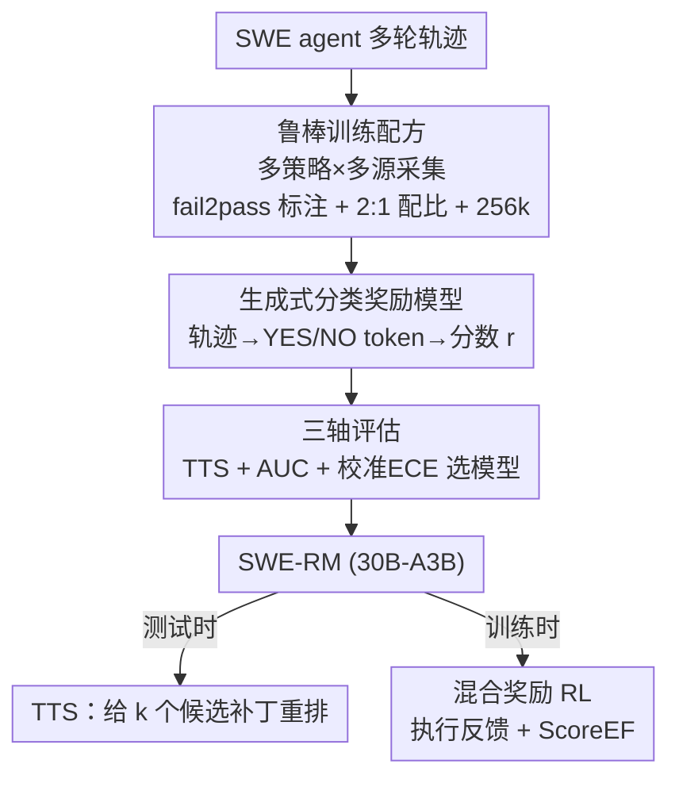

# SWE-RM: Execution-Free Feedback for Software Engineering Agents

**会议**: ICLR 2026  
**OpenReview**: [https://openreview.net/forum?id=H9wMe1G76j](https://openreview.net/forum?id=H9wMe1G76j)  
**代码**: 无  
**领域**: 代码智能 / Agent / 奖励模型 / 强化学习  
**关键词**: SWE Agent, 奖励模型, 免执行反馈, 校准, 测试时扩展

## 一句话总结
本文指出"测试时扩展（TTS）表现好"并不能保证一个奖励模型在强化学习（RL）里也好用，提出用 **TTS + 判别力（AUC）+ 校准（ECE）** 三个维度共同衡量奖励模型，并据此训练出 30B-A3B 的免执行奖励模型 SWE-RM，在 SWE-Bench Verified 的 TTS 上把 Qwen3-Coder-Max 从 67.0% 提到 74.6%（开源 SOTA），用作 RL 奖励时比纯执行反馈再涨 3 个点。

## 研究背景与动机
**领域现状**：训练软件工程（SWE）编码 agent 时，反馈信号主要来自两类。一类是**基于执行**的验证器——跑单元测试，按 pass/fail 给信号，被广泛用于 RL 和 TTS（如 Agentless、R2E-Gym、DeepSWE）。另一类是**免执行**的验证器，本质是模型打分的奖励模型，给一条轨迹打一个连续分，不需要沙箱（如 SWE-Gym Verifier、OpenHands Critic）。

**现有痛点**：基于执行的反馈有两个硬伤。其一是**信号稀疏且二值**：只有 0/1，无法区分两条都成功（或都失败）的轨迹谁更好，对 RL 的精细 reward shaping 极不友好。其二是**依赖高质量单元测试**：从真实 GitHub 仓库抽的测试常常过于特化、甚至和目标 issue 无关，而模型生成的测试又没经过严格校验，导致大量代码数据因为缺乏可靠测试而无法用于训练。

**核心矛盾**：免执行的奖励模型本可以提供连续、细粒度的分数来缓解上述问题，但它在 SWE 场景里**长期欠探索**——大家训练奖励模型时几乎只盯着一个指标：TTS（best-of-k 选出正确轨迹的能力）。作者却发现一个反直觉现象：**两个 TTS 几乎一样的验证器，拿去做 RL 奖励，结果天差地别**——一个平稳上升，另一个直接训崩（图 2）。这说明 TTS 只刻画了"top-1 排序能力"，遗漏了 RL 真正需要的性质。

**本文目标**：搞清楚到底是哪些性质决定了奖励模型在 RL 里好不好用，并据此训出一个 TTS 和 RL 都能打的"全能型"奖励模型。

**切入角度**：RL 中 agent 会产出大量近似正确、部分正确的轨迹，奖励模型必须在**整个分布上**都给对信号，而不只是把最好的那条排到第一；同时它的分数会被当成"正确概率"来塑造奖励，分数若没校准好（normalized score 0.9 实际只有 60% 概率对），就会毒化 reward shaping。

**核心 idea**：用**判别力（AUC）**和**校准（ECE）**补齐 TTS 的盲区，把这三轴当作训练目标导向，系统消融数据规模/正负比/策略混合/数据源/上下文长度，炼出 SWE-RM。

## 方法详解

### 整体框架
SWE-RM 的目标是产出一个"全能型"免执行奖励模型：输入是 SWE agent 跑出来的**完整多轮轨迹**（截图、命令、补丁等），输出是一个连续分数 $r\in[0,1]$，既能在测试时给一批候选补丁重排（TTS），又能在 RL 训练里当作密集奖励。整条管线可以拆成"怎么造数据、用什么形式训、用什么指标选模型、训出来怎么用"四段。

关键的方法论创新不在网络结构（直接用 Qwen3-30B-A3B 这个 MoE 当底座），而在**评估准则**：作者先证明只看 TTS 会选错奖励模型，于是引入 AUC（判别力）+ ECE（校准）组成三轴评估，再用这三轴去指导大规模消融，最终确定训练配方。训出的 SWE-RM 既用于 TTS 重排，也作为执行反馈的补充，组成**混合奖励**喂给 RL。

### 关键设计

**1. 生成式分类奖励模型：把"轨迹对不对"变成一个特殊 token 的概率**

针对"免执行验证器怎么给连续分"这个问题，本文沿用 SWE-Gym 的生成式分类范式，但用法很干净。模型吃进整条多轮轨迹，被提示输出**单个特殊 token**：`YES`（issue 已解决）或 `NO`（未解决），训练就是在这个 token 上做标准的 next-token 预测损失。推理时不取硬标签，而是读出两个 token 的对数概率 $l_y, l_n$，用 softmax 归一成连续奖励：

$$r = \frac{\exp(l_y)}{\exp(l_y) + \exp(l_n)} \in [0, 1].$$

这样一来，奖励模型天然给出"它有多确信这条轨迹是对的"，而不是僵硬的 0/1——这正是免执行反馈相对执行反馈的核心优势：**连续、细粒度**，能区分两条都成功或都失败的轨迹。

**2. 三轴评估：TTS + 判别力（AUC）+ 校准（ECE）一起看，才选得对 RL 奖励模型**

这是全文的灵魂。作者发现单看 TTS 会选错：图 2 里两个 TTS 几乎相同的验证器，RL 一个稳升一个崩。原因是 TTS 只测"把最好那条排第一"的 top-1 能力，漏掉了 RL 必需的两点。第一是**判别力**——RL 里 agent 产出大量 near-miss 轨迹，验证器要在整个分布上把"解决"和"未解决"分开，否则给的奖励全是噪声；用 **AUC** 度量（验证器分数对全体轨迹做"解决 vs 未解决"二分的 ROC 面积），AUC 越高判别越好。第二是**校准**——RL 把分数当正确概率来塑造奖励，分数若过/欠自信就会误导策略；用 **ECE（期望校准误差）** 度量分数与经验正确率的偏差，越低越好。

实证非常有说服力：两个 TTS 提升几乎相同（+4.7% vs +4.5%）的验证器，AUC 却差 0.095（0.764 vs 0.669，图 3）；校准上一个 ECE=0.077、另一个 0.210（图 4），后者对已解决轨迹频繁打低分、对未解决轨迹反而虚高，分布严重重叠。正是这种"判别差 + 没校准"解释了为什么 TTS 看着没问题却在 RL 里给误导信号。三个指标互补：TTS 管 top-1 排序，AUC 管整体判别，ECE 管置信可靠。

**3. 鲁棒训练配方：用数据规模、2:1 正负比、混合策略与数据源、256k 上下文撑起三轴**

有了三轴当指南针，作者做了大规模消融把"怎么训"落成可复用配方。**数据规模**：SWE 多轮交互的输出空间巨大、OOD 泛化难，超过 20k 样本 TTS 才随 k 稳定上升，少于 5k 反而会随 k 退化（一条被错误打高分的轨迹就能拖垮 resolve rate）；规模还显著改善校准——500 样本 ECE 高达 0.481，是 100k 样本（0.067）的七倍。**正负比**：固定总量调正负样本比，2:1 在 AUC/ECE/TTS 上综合最好（也最省，因为正样本本就稀缺、负样本池可以更小）。**策略与数据源**：on-policy（用 Flash/Max 自己采）有时某项更强，但 **Mix-Policy**（混 Claude-sonnet-4 的 off-policy）综合更稳、泛化更好；数据源上 SWE-rebench 单源质量最高，再补 SWE-smith、SWE-Gym 改善校准并放大数据规模效应。**上下文长度**：以往免执行验证器普遍只到 32k，本文首次扩到 **256k**——只有到 128k 才能让 99%+ 轨迹不超窗被成功打分，能打分的轨迹越多 TTS 越好（256k 时 RM@32 达 74.4%）。

**4. 混合奖励 RL：免执行的连续分 + 执行反馈的可靠性，互补取长**

训出 SWE-RM 后怎么用进 RL？作者用 GSPO（对 MoE RL 更稳）训练 Qwen3-30B-A3B，把免执行分数 $\text{Score}_{EF}\in[0,1]$ 叠加到执行结果上构成混合奖励：

$$r(q,\tau_i)=\begin{cases}1+\text{Score}_{EF}, & \text{issue 已解决}\\ -0.5+\text{Score}_{EF}, & \text{未完成}\\ 0+\text{Score}_{EF}, & \text{其他}\end{cases}$$

直觉是：执行反馈给"对/错"的可靠骨架（防止纯免执行后期因未校验信号而收敛差），免执行分数在每个区间内再给连续的细粒度梯度（缓解纯执行的稀疏/早停问题）。两者结合既加速训练又拔高上限——纯执行早期慢且早早 plateau，纯免执行早期快但后期收敛弱，混合反馈兼得两者之长。

### 损失函数 / 训练策略
奖励模型本身用标准 next-token 预测损失只监督那个 `YES`/`NO` 特殊 token；底座 Qwen3-30B-A3B（MoE，30B 总参 / 3B 激活）。RL 端用 GSPO + verl/Megatron + SGLang rollout，agent scaffold 用 OpenHands；RL 评测只贪心生成 1 条轨迹 1 个补丁作 pass@1，不做 TTS。

## 实验关键数据

### 主实验（TTS，SWE-Bench Verified，表 4）
EB=基于执行，EF=免执行；指标 AUC / ECE↓ / RM@32。

| 验证器 | 类型 | Flash AUC | Flash ECE | Flash RM@32 | Max RM@32 |
|--------|------|-----------|-----------|-------------|-----------|
| Agentless | EB | - | - | 52.6% | 65.0% |
| SWE-Gym | EF | 0.776 | 0.223 | 51.2% | 65.4% |
| DeepSWE-EF | EF | 0.758 | 0.124 | 53.2% | 66.2% |
| **SWE-RM-30A3B** | EF | **0.783** | **0.051** | **62.0%** | **74.6%** |

SWE-RM 在 AUC / ECE / RM@32 三项上全面领先：Qwen3-Coder-Flash 的 pass@1 从 51.6%→62.0%，Max 从 67.0%→74.6%，是开源模型新 SOTA；在 OpenHands-LM-32B 上也最好，说明跨策略泛化。

### RL 实验（pass@1，SWE-Bench Verified，图 7 + 表 5）

| 反馈类型 | SWE-Bench Verified | Live(Lite) | Multilingual | Terminal Bench |
|----------|--------------------|-----------|--------------|----------------|
| 混合（SWE-RM + 执行） | **54.8%** | **22.4** | **35.7** | **32.5** |
| 仅免执行 | - | 20.4 | 33.0 | 31.3 |
| 仅执行 | 51.8% | 20.0 | 33.3 | 30.0 |
| 校准差的 RM | 显著崩 | 12.0 | 21.0 | 15.0 |

混合反馈比纯执行高约 3 个点（54.8% vs 51.8%）且更快更稳；跨四个 SWE 任务都最好。**校准差的奖励模型在所有任务上大幅掉点**，反向印证了校准的重要性。

### 消融实验

| 配置 | 关键指标 | 说明 |
|------|---------|------|
| 数据 100k vs 500 | ECE 0.067 vs 0.481 | 规模放大 7 倍校准差距，<5k 还会随 k 退化 |
| 正负比 2:1 vs 1:1 | RM@32 62.0% vs 60.8% | 2:1 综合最好且更省正样本 |
| Mix-Policy vs On/Off | ECE 0.033 最低 | 混策略泛化与校准更稳 |
| 上下文 256k vs 32k | RM@32 74.4% vs 67.4% | 256k 让 100% 轨迹可打分 |

### 关键发现
- **TTS 是不充分指标**：TTS 几乎相同的两个验证器，AUC 差 0.095、ECE 差近 3 倍，RL 一稳一崩——这是全文最核心的"啊哈"。
- **校准比想象中关键**：把校准差的 RM 直接拿去做 RL 奖励，会在所有下游任务上显著掉点。
- **数据规模同时撑判别与校准**：不仅 TTS，AUC 和 ECE 也随数据量改善，但 25k→100k 收益递减。

## 亮点与洞察
- **重新定义"好的奖励模型"**：把"会选最好的"（TTS）和"能在全分布上给可靠信号"（AUC+ECE）分开，戳破了 TTS=验证器质量的普遍假设，这个洞察可迁移到任何"用奖励模型做 RL"的场景（数学、agent、多模态）。
- **校准被当成一等公民**：很多奖励模型工作只比排序/准确率，本文把 ECE 抬到和性能并列，并用 reliability diagram 直观展示——这是把"分数当概率"做 reward shaping 时最容易被忽视的坑。
- **混合奖励的设计很实用**：在执行结果给的离散区间内，用免执行连续分填梯度，等于"骨架 + 细粒度"，既防崩又加速，工程上容易复制。
- **256k 长上下文打分**：首次把免执行验证器扩到 256k，直接解决了难题轨迹超窗无法打分的瓶颈。

## 局限与展望
- **纯免执行后期收敛弱**：作者自己观察到纯 SWE-RM 反馈早期快但后期因未校验信号收敛差，所以仍需执行反馈兜底——免执行没能完全替代执行。
- **奖励模型底座成本**：30B-A3B 的 MoE 验证器在 RL 训练里要持续推理打分，算力开销不小，论文未深入讨论这部分代价。
- **评测集中在 SWE-Bench 系**：虽补了 Live/Multilingual/Terminal Bench，但仍以 Python issue-fixing 为主，对更广义软件工程任务（前端、配置、大型重构）的泛化未验证。
- **三轴之间的权衡**：AUC、ECE、TTS 偶尔不同向（如某些 on-policy 配置 TTS 高但校准差），如何在三者冲突时取舍仍靠经验配方，缺一个统一目标函数。

## 相关工作与启发
- **vs SWE-Gym Verifier**：同样是生成式分类的免执行验证器，但 SWE-Gym 只优化/评估 TTS、上下文 32k；本文指出 TTS 不够，补上 AUC+ECE 并扩到 256k，TTS 和校准全面反超。
- **vs DeepSWE（Hybrid-TTS）**：DeepSWE 用执行+免执行混合做测试时重排；本文不仅在 TTS 上更强，还**首次把免执行反馈接进 SWE agentic RL**，验证它能提供比 0/1 更细的奖励。
- **vs 数学 RLVR**：数学有 ground-truth 答案、规则化奖励干净；SWE 的执行反馈受噪声测试和稀疏信号拖累，本文用校准良好的免执行奖励补齐了这一差距。

## 评分
- 新颖性: ⭐⭐⭐⭐⭐ 把 TTS 不充分性讲透并提出 AUC+ECE 三轴评估，首次将免执行反馈引入 SWE RL，视角新颖。
- 实验充分度: ⭐⭐⭐⭐⭐ 数据规模/正负比/策略/数据源/上下文全维消融 + TTS/RL 双场景 + 多 benchmark 泛化。
- 写作质量: ⭐⭐⭐⭐ 动机层层递进、图表有力；个别小节文字略重复。
- 价值: ⭐⭐⭐⭐⭐ 给 SWE agent 的奖励建模提供了可复用的评估准则和训练配方，开源 SOTA。

<!-- RELATED:START -->

## 相关论文

- [\[ICLR 2026\] Ambig-SWE: Interactive Agents to Overcome Underspecificity in Software Engineering](ambig-swe_interactive_agents_to_overcome_underspecificity_in_software_engineerin.md)
- [\[ICLR 2026\] Process-Level Trajectory Evaluation for Environment Configuration in Software Engineering Agents](process-level_trajectory_evaluation_for_environment_configuration_in_software_en.md)
- [\[ICML 2025\] Training Software Engineering Agents and Verifiers with SWE-Gym](../../ICML2025/code_intelligence/training_software_engineering_agents_and_verifiers_with_swe-gym.md)
- [\[ICLR 2026\] BOAD: Discovering Hierarchical Software Engineering Agents via Bandit Optimization](boad_discovering_hierarchical_software_engineering_agents_via_bandit_optimizatio.md)
- [\[ICLR 2026\] Kimi-Dev: Agentless Training as Skill Prior for SWE-agents](kimi-dev_agentless_training_as_skill_prior_for_swe-agents.md)

<!-- RELATED:END -->
