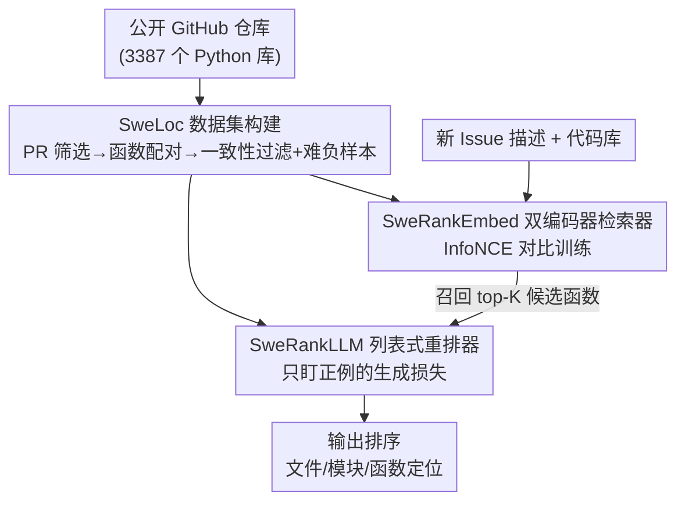

# SweRank：用代码排序做软件 Issue 定位

**会议**: ICLR 2026  
**OpenReview**: [https://openreview.net/forum?id=OnkRqbNhe3](https://openreview.net/forum?id=OnkRqbNhe3)  
**代码**: https://github.com/SalesforceAIResearch/SweRank  
**领域**: 代码智能 / 信息检索  
**关键词**: 软件 Issue 定位, 代码排序, 检索-重排, 对比学习, 列表式重排

## 一句话总结
SweRank 把"根据 bug 报告找到要改的函数"这件事从昂贵的 LLM agent 多步推理，重构成一次性的"检索 + 重排"排序问题：先用自建大规模数据集 SweLoc 训练一个双编码器检索器（SweRankEmbed）和一个列表式 LLM 重排器（SweRankLLM），在 SWE-Bench-Lite 和 LocBench 上以远低于 Claude-3.5 agent 的成本取得了文件/模块/函数三个粒度的 SOTA 定位准确率。

## 研究背景与动机
**领域现状**：软件 Issue 定位（issue localization）是自动修 bug 的第一步——给定一段自然语言的问题描述（bug 报告、功能请求），要在整个代码库里精准指出该改哪些文件、类、函数。这一步错了，后面再强的补丁生成也是白搭。目前最受关注的做法是把它当成一个 agent 推理问题：让一个基于闭源大模型（如 Claude-3.5）的 agent 反复发 `read-file`、`grep`、`traverse-graph` 等命令去爬代码库、读文件、分析依赖。

**现有痛点**：这类 agent 方法虽然准，但代价很重——平均要和大模型交互约 7–10 轮，单条样本 API 成本约 \$0.66，延迟高；而且 agent 轨迹很脆，依赖温度采样和复杂的工具编排，链条中任何一步（一个误导性的中间查询、一次不完整的代码观测）出错就可能把整个定位带偏。

**核心矛盾**：另一条更高效的路是把定位当成信息检索问题，直接用代码排序模型对候选代码片段按相关性打分排序，一次性出结果。但现成的代码排序模型几乎都是为"query-to-code"（按功能描述找实现）或"code-to-code"（找语义相似代码）训练的，而 Issue 定位的查询本质不同：它又长又啰嗦（SWE-Bench issue 平均约 460 token，而 CodeSearchNet 查询才约 12 token），描述的是"观察到的错误行为/系统故障"而不是"想要的功能"。用常规代码检索数据训练的模型，根本没对齐这种"故障描述 → 出错代码"的映射。

**本文目标**：造一个既高效（单次排序、可用开源模型）又准确（超过闭源 agent）的 Issue 定位框架；同时补上训练数据的缺口——一个专门刻画"啰嗦故障描述 ↔ 出错函数"的大规模数据集。

**核心 idea**：用"检索 + 重排"的经典排序架构替代 agent 的多步推理，并用一个专为 Issue 定位自动构建的数据集 SweLoc 来训练这套排序模型，让模型直接学会把冗长的 bug 描述对齐到真正出错的函数上。

## 方法详解

### 整体框架
SweRank 的核心是"先有数据、再有模型"两条线。数据线是 **SweLoc**：从公开 GitHub 仓库自动挖出"issue 描述 ↔ 被该 issue 对应 PR 修改的函数"配对，经过一致性过滤与难负样本挖掘后，得到高质量的 ⟨query, 正例, 负例集⟩ 三元组。模型线是 **SweRank 排序框架**，采用标准的两阶段 retrieve-and-rerank：第一阶段 **SweRankEmbed**（双编码器检索器）把整个代码库的函数和 issue 编码进同一向量空间，用余弦相似度快速召回 top-K 候选；第二阶段 **SweRankLLM**（列表式 LLM 重排器）读入 issue 加这 K 个候选，重新排出一个更准的顺序。两个组件都在 SweLoc 上微调，分别用对比损失和"只盯正例"的列表式生成损失。

### 关键设计

**1. SweLoc：把 GitHub 的"修复历史"自动炼成 Issue 定位训练数据**

针对"现成代码检索数据不匹配 Issue 定位"这个根本矛盾，作者构建了 SweLoc。它分三阶段：首先**筛 PR**——从 top 11000 个 PyPI 包对应的仓库出发，要求至少 80% Python 代码、剔除与 SWE-Bench / LocBench 重叠的仓库防止数据泄漏、再按源码重复度去重，得到 3387 个仓库；按 SWE-Bench 的方法挑出那些"解决了某个 linked issue 且改动了测试文件（说明修复被验证过）"的 PR，收集 issue 描述和 PR base commit 时的代码快照，共 67341 对 (PR, 代码库)。然后**做定位处理**——issue 描述当 query，PR 里被改的每个函数当一个正例（改了 N 个函数就产生 N 条训练样本），同代码库里没被改的函数当负例来源。

真正决定数据质量的是第三阶段的**一致性过滤 + 难负样本挖掘**。开源仓库的 issue 描述常常含糊，直接用会引入噪声标注。作者用预训练嵌入模型 CodeRankEmbed 算 issue $t_i$、正例函数 $c_i$ 与库内其他函数 $F_i$ 的相似度，只保留正例 $c_i$ 在 $F_i$ 中相似度排进 top-$K$（$K=20$）的样本——也就是说，如果按语义连正例函数都排不进前 20，这条样本多半是噪声，丢掉。同时用算好的相似度选难负样本 $B_i=\{c_j^-\}_{j=1}^{M}$（$M=15$）：取与 query 最相似但实际无关的函数当难负样本，逼模型学会区分"看起来像、其实不相干"。消融显示 $K=20$ 是质量与数量的平衡点，而完全不过滤（$K=\text{None}$）会让微调后性能反而低于预训练模型。

**2. SweRankEmbed：用对比学习把冗长 bug 描述对齐到出错函数**

这是检索阶段，针对"要在大代码库里快速召回少量候选"。它是个双编码器（bi-encoder），把 issue 和函数分别编码成稠密向量（取编码器最后一层隐状态），落到共享向量空间。训练用 InfoNCE 对比损失：对一个正例对 $(h_i, h_i^+)$，目标是让 issue 向量 $h_i$ 和它对应的正例代码向量 $h_i^+$ 的相似度，高于它与 batch 内其他正例 $h_k^+$（$k\neq i$）以及所有难负样本 $h_{kj}^-$ 的相似度：

$$\mathcal{L}_{CL} = -\log\frac{\exp(h_i\cdot h_i^+)}{\sum_{h_k\in(H_B\cup H)}\exp(h_i\cdot h_k)}$$

分母对正例自身和 $N(M{+}1)-1$ 个负例求和（$N$ 是 batch 内正例对数、$M$ 是每条 issue 挖的难负样本数），等于把"batch 内别人的正例"和"自己挖的难负样本"一起当负例，负样本既多又难。推理时按 issue 向量与候选函数向量的余弦相似度排序召回。小号 SweRankEmbed-Small（137M，由 CodeRankEmbed 初始化）就已经超过此前的 7B 嵌入模型，大号（7B，由 GTE-Qwen2-7B-Instruct 初始化）进一步把召回拉到接近 agent 的水平。

**3. SweRankLLM：用"只盯正例"的技巧训练列表式重排器**

这是重排阶段，针对"召回的 top-K 里再精排出最相关的"。列表式（listwise）重排比逐点（pointwise）打分更好，因为它能同时看所有候选的相对相关性。常规列表式 LLM 重排器训练时，需要模型生成一整串"从最相关到最不相关"的候选编号序列作为监督——但 SweLoc 只知道哪个是正例，并没有给负例之间排出完整顺序，凑不出完整的目标排列。

作者的解法很巧：给候选集 $c_i^+\cup\{c_{i,j}^-\}_{j=1}^{M}$ 里每个函数分配 1 到 $M{+}1$ 的数字编号，设正例编号为 $I_i^+$，**只训练模型正确生成排在第一位（即 top-ranked）的那个编号**，目标退化成

$$\mathcal{L}_{LM} = -\log\big(P_\theta(I_i^+\mid x)\big)$$

其中 $x$ 是由 issue 和带编号的候选函数拼成的输入。关键细节：训练时在预测出 $I_i^+$ 后**故意不加 EOS（句末）token**，从而保留模型在推理时继续生成完整排序列表的能力——这样既能只用"单正例"监督训练，又不破坏列表式输出格式。这个改造让任意列表式重排器都能在缺乏完整排序标注的 Issue 定位数据上微调。小号 SweRankLLM-Small（7B，由 CodeRankLLM 初始化）和大号（32B，由 Qwen-2.5-32B-Instruct 初始化）接在 SweRankEmbed-Large 之后，把三个粒度的定位准确率都推到新 SOTA。

## 实验关键数据

### 主实验
评测集为 SWE-Bench-Lite（保留 274 条有函数改动的样本）与 LocBench（560 条，含 bug 报告、功能请求、安全与性能 issue）。指标是 Acc@k——只有当 top-k 结果**完全覆盖**所有相关代码位置才算定位成功，文件/模块/函数三个粒度分别评测。

SWE-Bench-Lite 上的代表性数字（重排器均以 SweRankEmbed-Large 为检索器）：

| 类型 | 方法 | 模型 | File Acc@1 | Module Acc@5 | Function Acc@10 |
|------|------|------|-----------|--------------|-----------------|
| Agent | LocAgent | Claude-3.5 | 77.74 | 86.50 | 77.37 |
| 检索器 | CodeRankEmbed (137M) | — | 52.55 | 71.90 | 58.76 |
| 检索器 | GTE-Qwen2-7B (7B) | — | 65.33 | 76.28 | 70.44 |
| 检索器 | **SweRankEmbed-Small (137M)** | Ours | 66.42 | 79.56 | 74.45 |
| 检索器 | **SweRankEmbed-Large (7B)** | Ours | 72.63 | 84.31 | 82.12 |
| +重排 | **SweRankLLM-Small (7B)** | Ours | 78.10 | 89.05 | 86.13 |
| +重排 | **SweRankLLM-Large (32B)** | Ours | **83.21** | **90.88** | **88.69** |

仅 137M 的 SweRankEmbed-Small 就超过此前所有 7B 嵌入模型；SweRankEmbed-Large 的函数级 Acc@10 已高于用 Claude-3.5 的 LocAgent；接上 SweRankLLM 后三个粒度全面刷新 SOTA（开源模型，唯一超过它的只有闭源 GPT-4.1 重排）。LocBench 上呈现同样趋势，且 SweRank 虽主要用 bug 报告训练，却在安全/性能等其他类别上展现出不错的泛化。

### 消融与分析实验

| 配置 | 关键指标 | 说明 |
|------|---------|------|
| 一致性过滤 $K=20$ | 最佳 | 质量与数量的平衡点 |
| 放宽 $K$（更大） | 下降 | 样本更多但噪声更多 |
| 无过滤 $K=\text{None}$ | 低于预训练 | 噪声样本反而损害模型 |
| 数据量 5% → 100% | 单调上升 | 仅 5% 数据就有明显增益，越多越好 |

SweLoc 的"赋能"能力（用它微调各种现成模型，Func. Acc@10 前→后）：

| 基座检索器 | 预训练数据 | Acc@10 变化 |
|-----------|-----------|-------------|
| CodeRankEmbed | 英文+代码 | 59.5 → 72.3 (+12.8) |
| Arctic-Embed | 英文 | 53.7 → 71.9 (+17.4) |
| Arctic-Embed-v2.0 | 多语言 | 62.0 → 70.1 (+8.1) |

### 关键发现
- **数据质量比数量更关键**：一致性过滤是核心，完全不过滤会让微调后模型还不如预训练起点——光堆数据量、不控质量是有害的。
- **底子越弱、增益越大**：用 SweLoc 微调时，初始更差的 Arctic-Embed（纯英文）涨幅最大（+17.4），说明 SweLoc 几乎能拉起任意嵌入模型的 Issue 定位能力，是一份通用资源。
- **成本-性能比碾压 agent**：SWE-agent / OpenHands 用 Claude-3.5 单条样本要约 \$0.46–\$0.83，而 SweRank 用开源模型单次排序即可，在更低成本下取得更高准确率。
- **重排器的"单正例"训练有效**：只在第一个生成 token 上施加损失、且省略 EOS，就能把任意列表式重排器适配到没有完整排序标注的 Issue 定位任务上，各尺寸 Qwen2.5 重排器普遍受益。

## 亮点与洞察
- **范式回摆很有说服力**：在"什么都上 agent"的当下，本文证明对于 Issue 定位这种本质是排序的任务，一个训练得当的"检索+重排"反而又快又准又便宜——前提是有对口的数据。这提醒大家别把所有问题都套 agent。
- **"只盯正例"的列表式训练技巧可迁移**：当你只有正例、拿不到完整排序标注时，"只监督 top-1 编号 + 故意不加 EOS 保留生成能力"这套做法，可以用到任何缺少完整 ranking 标注的列表式重排场景。
- **用 PR + 测试改动当弱监督信号**：把"PR 改了测试文件"当作"修复被验证过"的代理信号来筛高质量样本，是从开源生态自动挖训练数据的好思路，可复用到其他代码任务。
- **一致性过滤的判据简洁有效**：用预训练嵌入模型先验地"自检"——正例排不进 top-K 就丢——是一种低成本去噪，对噪声标注的弱监督数据尤其管用。

## 局限与展望
- **主要用 bug 报告训练**：SweLoc 以 bug 报告为主，虽在 LocBench 的安全/性能类别上泛化尚可，但对这些非 bug 类 issue 的覆盖仍有限。
- **只限 Python**：数据来自 Python 仓库，跨语言（Java/C++/Rust 等）定位的迁移性未验证。
- **函数粒度的天花板**：评测以"是否定位到被改函数"为正确，但真实修复有时跨文件、跨多个函数协同改动，单次排序对这种分散定位（图 3 显示相当一部分 issue 跨多个代码单元）可能不如能多跳推理的 agent。
- **重排候选受检索召回上限约束**：重排只在检索召回的 top-K 内重排，若正确函数没被检索召回进来，重排无力回天——检索-重排的固有短板。

## 相关工作与启发
- **vs LocAgent / SWE-agent / OpenHands（agent 路线）**：它们靠 LLM 多轮发命令爬代码库做多跳推理，准但慢且贵、链条脆。SweRank 把定位拍平成一次性排序，去掉了多步编排，成本和延迟大降；优势是高效稳健、用开源模型，劣势是对需要跨文件多跳推理的分散定位不如 agent 灵活。
- **vs CodeRankEmbed / CodeRankLLM 等通用代码排序模型（Suresh et al., 2024）**：它们为 query-to-code / code-to-code 训练，没把又长又故障导向的 bug 报告纳入训练；SweRank 直接以这些模型为初始化，但在专门的 SweLoc 上微调，把"冗长 bug 描述 ↔ 出错代码"对齐，故而在 Issue 定位上显著超过它们。
- **vs 传统谱定位 / 程序分析（SFL、依赖分析、程序切片）**：传统方法靠测试覆盖与程序结构统计"可疑度"，需要精确程序模型，且用不上 bug 报告里的丰富自然语言上下文；SweRank 正是吃这份自然语言信号来定位。

## 评分
- 新颖性: ⭐⭐⭐⭐ 框架是经典 retrieve-and-rerank，但"为 Issue 定位专门造数据 + 单正例列表式训练技巧"组合得当，反 agent 潮流且有效。
- 实验充分度: ⭐⭐⭐⭐⭐ 两个 benchmark、三个粒度、与 agent 和多种排序模型全面对比，外加数据质量/数量/赋能性/成本多维消融。
- 写作质量: ⭐⭐⭐⭐ 动机清晰、数据与方法讲得明白，图表支撑充分。
- 价值: ⭐⭐⭐⭐⭐ SweLoc 数据集与开源模型对社区是实打实可复用资源，成本-性能比对工业落地有直接意义。

<!-- RELATED:START -->

## 相关论文

- [\[ICLR 2026\] ShieldedCode: Learning Robust Representations for Virtual Machine Protected Code](shieldedcode_learning_robust_representations_for_virtual_machine_protected_code.md)
- [\[ICLR 2026\] An Agentic Framework with LLMs for Solving Complex Vehicle Routing Problems](an_agentic_framework_with_llms_for_solving_complex_vehicle_routing_problems.md)
- [\[ICLR 2026\] VERINA: Benchmarking Verifiable Code Generation](verina_benchmarking_verifiable_code_generation.md)
- [\[ICLR 2026\] IMSE: Intrinsic Mixture of Spectral Experts Fine-tuning for Test-Time Adaptation](imse_intrinsic_mixture_of_spectral_experts_fine-tuning_for_test-time_adaptation.md)
- [\[ICLR 2026\] VisCoder2: Building Multi-Language Visualization Coding Agents](viscoder2_building_multi-language_visualization_coding_agents.md)

<!-- RELATED:END -->
