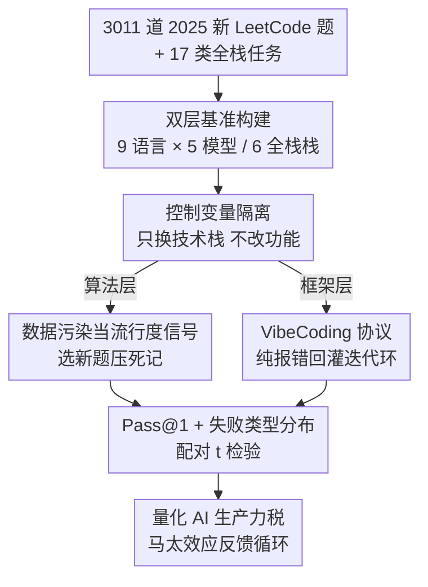

# The Matthew Effect of AI Programming Assistants: A Hidden Bias in Software Evolution

**会议**: ICLR 2026  
**OpenReview**: [https://openreview.net/forum?id=QjkJdcbSDe](https://openreview.net/forum?id=QjkJdcbSDe)  
**代码**: 无  
**领域**: 代码智能 / 实证研究 / AI 编程助手  
**关键词**: 马太效应, AI 编程助手, 语言流行度, 框架选择, 训练数据偏置

## 一句话总结
这篇论文用 13 万+ 次代码生成请求 + 数百个全栈框架任务做了一次大规模实证检验，量化出 AI 编程助手对主流语言/框架的成功率显著高于小众技术，揭示了一个与「马太效应」一致的反馈循环——数据丰富的生态获得更好的 AI 支持，从而进一步强化其统治地位。

## 研究背景与动机
**领域现状**：LLM 已经渗透到几乎所有程序员的日常开发中，催生了 vibe coding（用 prompt 迭代而非逐行敲码）和 agentic coding（自治 agent 端到端规划执行）两种新范式。学界普遍乐观地认为 LLM 会成为「伟大的均衡器」（Great Equalizer），抹平初级开发者的技能鸿沟，甚至让具体语法变得无关紧要。

**现有痛点**：以往工作几乎都聚焦在「短期、微观」的评测——在窄 benchmark 或单语言数据集上量模型性能，关注 prompt 设计与代码生成质量。但 LLM 驱动开发对软件工程「迭代动力学」的长期、生态级影响几乎无人系统研究。而已有零散观察提示问题严重：StarCoder 训练语料里 Python 独占近 40%，很多语言只占边角；AI 助手对 NumPy 的补全占比高达 48%、对 Python 的偏好在性能敏感任务里占 58%（哪怕 Rust 客观上更合适）。

**核心矛盾**：LLM 在公开代码大数据上训练，其能力天然正比于某语言/框架在语料中的曝光量。于是出现一个根本张力——AI 助手到底是「降低门槛、赋能创新」，还是「无意中强化既有的统治层级」？「让语法无关紧要」这个均衡器假设，从未在实证环境下被检验过。

**本文目标**：把这个问题拆成两层来量化——(1) 语言层：流行度是否预测 AI 代码生成的成功率？(2) 框架层：即便小众技术在某场景更合适，AI 是否仍偏向主流栈？

**切入角度**：作者用「控制变量法」隔离「流行度」这一个因子，并巧妙地把「数据污染」（测试任务与训练语料的重叠）反过来当作语言流行度的直接信号——故意选 2025 年新发布的 LeetCode 题，既压住「背题」式死记，又让污染差距对齐当代流行趋势，从而建立「流行度 → 训练覆盖 → AI 性能」的清晰因果链。

**核心 idea**：构建首个「算法任务 × 框架任务」双层 benchmark，证明 AI 编程助手存在「富者愈富」的马太效应——可测量的「AI 生产力税」与生态流行度高度相关。

## 方法详解

### 整体框架
这篇论文不是提出一个新模型，而是设计一套**双层实证评测管线**来回答「AI 助手是否放大流行度层级」。整体分两条平行链路：上层是**语言层算法任务**——爬取 3,011 道 LeetCode 题，跨 9 种语言、调 5 个商用 LLM 生成代码，清洗成纯可执行代码后提交到 LeetCode 评测系统，以 Pass@1 为主指标；下层是**框架层全栈任务**——用 Cursor / Copilot / CodeBuddy 三个真实 AI 编程工具，在严格控制的 VibeCoding 协议下，跨 6 个主流全栈组合和若干「技术路线分叉」场景实现 CRUD 与高并发等应用，以「完成所需迭代次数 / 是否完成」为指标。两层都靠「只换技术栈、不改功能需求」来把流行度孤立出来。

### 关键设计

**1. 双层基准构建：算法做「煤矿金丝雀」，框架测「架构判断力」**

单一评测层说不清生态偏置：纯算法题不涉及真实工程，纯框架题又混入太多噪声。作者因此构建首个双层 benchmark。算法层选 9 种语言（按 2025 年 6 月 TIOBE 指数横跨主流到小众：Python/C++/C/Java/JavaScript/Go/Rust/Erlang/Racket），从 LeetCode 爬 3,011 题（765 easy / 1,526 medium / 720 hard），跨 5 个模型共 $3011 \times 9 \times 5 = 135{,}495$ 次生成请求——把它定位成「语言能力的煤矿金丝雀」：连基本逻辑都编译不过，复杂工程更无从谈起。框架层则分两级：第一级「通用 CRUD」用 6 个主流全栈组合（Vue+Spring、React+Express、Django、Preact+Gin、Svelte+FastAPI、SolidJS+Actix）跑 17 个应用场景建立基线；第二级「技术路线分叉」故意制造架构权衡（如高并发场景 Go/Rust 本该更优、数据密集场景 Julia 更专），考验模型能否跳出流行度偏好选对小众框架。

**2. 控制变量法隔离流行度：只换技术栈，功能需求恒定**

要把「流行度」从「任务难度」「模型能力」中剥离出来，关键在于让其他变量全部固定。作者对两类任务用**同一套核心方法**：算法层把同一道题用一致的 prompt 模板格式化后，仅切换目标语言提交给每个模型；框架层让同一个功能需求（如「图书管理系统」）在 6 套栈上各实现一遍，prompt 只改技术栈、不给任何额外语法/架构指导。这样一来，跨语言/跨框架的成功率差异就只能归因于该技术在训练语料中的曝光量，而非题目本身或模型强弱。这种「受控对照」让结论超越了「总体准确率」这种聚合指标，能直接暴露结构性偏置。

**3. 数据污染当流行度的直接信号：故意选 2025 新题**

如何客观度量「流行度」？作者的巧思是把通常被视为评测污染源的「数据污染」反用为信号——一个语言/框架在训练语料里的代表性，恰恰可由「测试任务与训练数据的重叠度」来刻画。为此他们刻意只选 2025 年新发布的 LeetCode 题：新题最大限度压制模型对广泛流传旧题的「死记式背诵」（rote recall），使得观察到的「污染差距」对齐的是**当代**流行趋势而非历史残留。由此建立清晰因果链：语言流行度 → 决定训练数据覆盖 → 驱动 AI 性能。这一设计把「流行度→性能」从相关性推向了更可辩护的因果叙事。

**4. VibeCoding 协议：纯报错回灌的自治迭代环**

框架层要测的是「AI 自主把活干完的能力」，因此必须排除人类隐性纠错。作者设计了严格的 VibeCoding 协议：用 Cursor(Claude-4-Sonnet)、CodeBuddy(Claude-4-Sonnet)、Copilot(GPT-5) 的 Agent 模式与 Auto 模式，初始 prompt 只给功能需求和指定技术栈，不给任何上下文或语法提示；实验者全程**不手动写一行代码、不做架构输入、不纠错**，唯一允许的交互是把依赖安装/编译/运行/功能缺陷的**原始未编辑报错**原样回灌进对话，触发 agent 新一轮自动调试，循环直到所有核心功能满足、或达到预设迭代上限。这样「完成所需迭代次数」就纯粹反映 AI 在该技术语境下自主推理与实现的能力，把人的因素彻底剔除。

## 实验关键数据

### 主实验（语言层 Pass@1，部分模型/语言摘选）

| 模型 | Python | C++ | Java | Go | Rust | Erlang | Racket |
|------|--------|-----|------|-----|------|--------|--------|
| DeepSeek-V3 | 79.81% | 78.81% | 79.38% | 76.82% | 71.24% | 24.31% | 20.82% |
| Gemini-2.5-Flash | 67.92% | 68.65% | 68.65% | 50.22% | 51.81% | 1.26% | 17.10% |
| Gemini-2.0-Flash | 62.94% | 64.26% | 65.86% | 55.90% | 50.38% | 0% | 11.06% |
| GPT-4o-mini | 41.98% | 41.68% | 45.50% | 39.22% | 24.05% | 1.16% | 1.99% |
| Qwen3-Turbo | 37.00% | 30.22% | 32.55% | 33.15% | 2.19% | 0% | 3.25% |

主流语言（Python/JS/Java/C/C++）在头部模型上 Pass@1 普遍超 60%，而 Erlang/Racket 常低于 25%、甚至逼近 0。最强的 DeepSeek-V3 在 Python 上 79.81%，到 Erlang 仅 24.31%、Racket 20.82%。**语言流行度比模型能力本身更能预测成功率**。

### 统计显著性（主流 vs 小众语言 Pass@1 配对 t 检验）

| 模型 | 平均差值 | p 值 |
|------|---------|------|
| DeepSeek-V3 | +44.8% | < 0.001 |
| Gemini-2.5-Flash | +42.3% | < 0.001 |
| Gemini-2.0-Flash | +40.5% | < 0.001 |
| GPT-4o-mini | +33.1% | < 0.001 |
| Qwen3-Turbo | +28.9% | < 0.001 |

所有模型差异均 $p < 0.001$，证明性能鸿沟是系统性偏置而非随机波动。

### 关键发现
- **难度放大效应**：差距随题目难度非线性扩大。Easy 题主流 vs 小众差 45–82 个百分点，Hard 题扩到 58–95 个百分点；Hard 上主流语言 50–63%、小众仅 0–6%——更强的模型能力无法补偿语言不流行的劣势。
- **失败类型暴露机制**：主流语言的失败多为 Wrong Answer / Runtime Error（生成了语义看似合理但答案错的代码）；小众语言的失败由 **Compile Error** 主导——模型连语法正确的代码都产不出，说明训练曝光不足使其无法内化基本编码习语。
- **框架层同样马太**：Vue+Spring、React+Express、Django 常在 1–3 次尝试内解决多数任务；Svelte+FastAPI、SolidJS+Actix 失败率高得多，很多任务需 >5 次尝试或根本完不成。即便高并发场景 Go/Rust 本该更优，模型仍偏向 Python/JS 方案。
- **分叉路线收敛代价**：主流栈(A) 通常 1–2 轮纠正收敛，中间栈(B) 需 2–3 轮，小众/新兴栈(C) 常需 5–10 轮指导才能跑起来——即便控制任务类型，生态流行度仍主导 AI 生成代码的可靠性。

## 亮点与洞察
- **把「数据污染」反用为信号**：通常大家想方设法消除评测污染，作者却把它当成测量语言流行度的直接探针，并用「选 2025 新题」来锚定当代趋势——这是全文最「啊哈」的方法论巧思，把相关性叙事推向了因果叙事。
- **失败类型分布是真正的洞察**：Compile Error 主导小众语言、Wrong Answer 主导主流语言，这一对比比单看 Pass@1 更深刻——它定位到偏置的机制根源是「连语法都学不会」而非「逻辑不够强」。
- **双指标设计可迁移**：算法层用「金丝雀」逻辑做能力下界探测、框架层用「迭代次数」量自治能力，这套「下界探测 + 自治成本」组合可迁移到评测任何 agent 在长尾领域的可靠性。
- **VibeCoding 协议的纯净性**：全程零人工编码、只回灌原始报错，把「人的隐性纠错」这一最大混淆变量彻底剔除，使框架层结论格外可信。

## 局限与展望
- **作者承认**：把「AI 特异的放大」从「既有结构性偏置」中分离仍是开放问题——AI 不是采纳的唯一驱动，论文只能说测量到一个与流行度相关的「AI 生产力税」，无法断言 AI 是因。
- **LeetCode 的代表性有限**：算法题无法覆盖真实软件生态的全部复杂度，作者自己也承认它只是「煤矿金丝雀」，高编译错误率是「必要不充分」的能力缺陷信号。
- **框架层样本偏小且主观**：17 个任务 × 6 套栈、以「人工判断迭代次数」为主指标，规模与客观性都弱于算法层的十几万次请求；热力图与「分叉路线」结论更偏定性。
- **改进思路**：可引入真实开源项目的 issue/PR 级任务、自动化判定「功能完成」、并对同一语言做训练语料占比的定量回归，把「流行度→性能」的因果链做成可复现的统计模型。

## 相关工作与启发
- **vs HumanEval / 早期 Copilot 评测**：他们也发现正确率与语言流行度相关，但题目数量少、只覆盖少数主流语言；本文用 3,011 道标准化 LeetCode 题、跨 9 语言 × 5 模型做到十几万次请求规模，并刻意用新题控污染。
- **vs XCODEEVAL 等多语言 benchmark**：超大规模多语言评测也揭示小众语言的合成/翻译困难，但其自动采集数据缺人工校验、含噪；本文聚焦「流行度如何影响性能」这一受控变量。
- **vs AgentBench / CodeArena**：前者揭示闭源模型在 agent 推理上领先开源、后者揭示跨语言差距，都指向「AI 可能固化主流生态」；本文把这一担忧从语言层延伸到框架层，并给出反馈循环的实证证据。

## 评分
- 新颖性: ⭐⭐⭐⭐ 首个「算法×框架」双层生态级 benchmark，「数据污染当流行度信号」的方法论巧思突出。
- 实验充分度: ⭐⭐⭐⭐ 算法层十几万次请求 + 配对 t 检验扎实，但框架层样本偏小、判定偏主观。
- 写作质量: ⭐⭐⭐⭐ 因果链与机制分析（失败类型分布）讲得清楚，论证克制不夸大。
- 价值: ⭐⭐⭐⭐⭐ 把「AI 是否在悄悄扼杀编程生态多样性」这一长期被忽视的问题量化出来，对工具厂商与社区都有警示意义。

<!-- RELATED:START -->

## 相关论文

- [\[ICLR 2026\] InnoGym: Benchmarking the Innovation Potential of AI Agents](innogym_benchmarking_the_innovation_potential_of_ai_agents.md)
- [\[ICML 2026\] Physics Is All You Need? A Case Study in Physicist-Supervised AI Development of Scientific Software](../../ICML2026/code_intelligence/physics_is_all_you_need_a_case_study_in_physicist-supervised_ai_development_of_s.md)
- [\[ICLR 2026\] Multi-LCB: Extending LiveCodeBench to Multiple Programming Languages](multi-lcb_extending_livecodebench_to_multiple_programming_languages.md)
- [\[ACL 2025\] Tree-of-Evolution: Tree-Structured Instruction Evolution for Code Generation in Large Language Models](../../ACL2025/code_intelligence/tree_of_evolution_code_gen.md)
- [\[ACL 2026\] From If-Statements to ML Pipelines: Revisiting Bias in Code-Generation](../../ACL2026/code_intelligence/from_if-statements_to_ml_pipelines_revisiting_bias_in_code-generation.md)

<!-- RELATED:END -->
