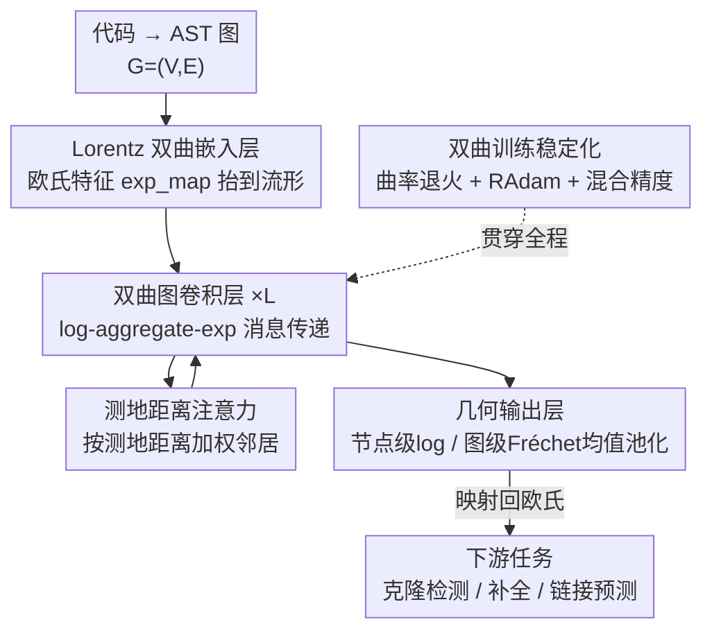

# The Natural Geometry of Code: Hyperbolic Representation Learning for Program Reasoning

**会议**: ICLR 2026  
**OpenReview**: [https://openreview.net/forum?id=oq4jXWaFyH](https://openreview.net/forum?id=oq4jXWaFyH)  
**代码**: 无  
**领域**: 代码智能 / 图表示学习 / 双曲几何  
**关键词**: 双曲表示学习, Lorentz 模型, 抽象语法树, 图神经网络, 程序推理

## 一句话总结
本文主张代码的「自然几何」是双曲空间，提出在数值稳定的 Lorentz 模型上原生运行的图神经网络 HypeCodeNet，用双曲嵌入层、tangent-space 消息传递和测地注意力为 AST 学习低失真的层次化表示，在克隆检测、代码补全、链接预测三类程序推理任务上全面超越欧氏模型，且只用 32 维就能追平 768 维的 SOTA。

## 研究背景与动机

**领域现状**：从 CodeBERT、CodeT5 这类序列模型，到 GraphCodeBERT、UniXcoder 这类引入数据流图的图感知模型，主流代码表示方法都把源代码的结构嵌入到**欧氏空间**里。引入结构信息确实涨了点，但这些模型骨子里都建立在「欧氏几何能忠实表示代码结构」这个假设之上。

**现有痛点**：源代码的抽象语法树（AST）本质上是**树状结构**，节点数随深度指数增长。而欧氏空间的体积只随半径**多项式增长**，把一棵指数膨胀的树塞进多项式膨胀的空间，必然产生很高的表示失真（distortion）。Bourgain 定理这类经典结果已经说明：这种失真会把树的层次「压扁」，让变量作用域、逻辑嵌套这些关键语义信息被掩盖。维度堆得再高也只是缓解，无法根除这个几何瓶颈。

**核心矛盾**：代码层次的**指数级增长** 与 欧氏空间体积的**多项式增长** 之间存在根本的几何错配。问题不在于网络结构不够强，而在于承载表示的**空间本身选错了**。

**本文目标**：找到一种与代码层次结构在几何上「天生匹配」的表示空间，并在其上构建端到端、可用于多种程序推理任务的通用代码表示框架。

**切入角度**：双曲空间（常负曲率流形）的体积随半径**指数增长**，恰好镜像了树中节点数随深度的指数增长。这一性质天然允许以极低失真嵌入层次结构——这在 NLP、CV 的层次数据建模中已被反复验证，但在源代码上几乎还是空白（已有工作只覆盖代码检索、软件演化等窄任务，缺一个通用的端到端框架）。

**核心 idea**：用**双曲几何代替欧氏几何**作为代码表示的底座，在数值稳定的 Lorentz 模型上构建一个原生的双曲 GNN（HypeCodeNet），让 AST 的层次结构以低失真的方式被保留下来。

## 方法详解

### 整体框架

HypeCodeNet 要解决的核心问题是：怎样让一个 GNN **全程在双曲流形上**对 AST 做表示学习，而不是先在欧氏空间算完再投影。整体流程是：把代码解析成 AST 图 $G=(V,E)$，先用一个**双曲嵌入层**把每个节点的欧氏初始特征「抬」到 Lorentz 流形上；然后堆叠若干**双曲图卷积层**，每层都遵循「log → 聚合 → exp」的范式在切空间里做消息传递与测地注意力；最后用一个**几何输出层**，按任务类型把流形上的表示（节点级直接 log 回切空间；图级先求 Fréchet 均值池化）映射回欧氏空间，喂给普通分类头。贯穿全程的还有一套**双曲训练稳定化**手段（曲率退火、Riemannian Adam、混合精度），否则双曲计算会因数值问题悄悄崩掉。

### 关键设计

**1. Lorentz 模型双曲嵌入层：把欧氏特征稳定地「抬」上负曲率流形**

要在双曲空间做深度学习，第一步是选一个数值稳定的模型并把输入搬上去。常用的 Poincaré 球模型在边界附近数值极不稳定，本文改用 **Lorentz 模型**：$d$ 维流形定义为 $\mathcal{L}^d_c = \{x \in \mathbb{R}^{d+1} \mid \langle x,x\rangle_{\mathcal{L}} = 1/c,\ x_0>0\}$，其中 $\langle x,y\rangle_{\mathcal{L}} = -x_0 y_0 + \sum_i x_i y_i$ 是 Lorentz 内积，曲率 $c<0$ 可变（为后面的曲率退火留接口）。两点测地距离为 $d_c(u,v) = \frac{1}{\sqrt{-c}}\,\mathrm{arcosh}(c\langle u,v\rangle_{\mathcal{L}})$。

嵌入层负责把 BPE 分词得到的欧氏特征 $x^E_v$ 搬上流形。先过一个 MLP 得到 $z^E_v = \mathrm{MLP}(x^E_v)$，再通过注入函数 $\iota_{o_c}$ 把它放进原点 $o_c=(1/\sqrt{-c},0,\dots,0)$ 处的切空间（该切空间与 $\mathbb{R}^d$ 同构），最后用原点处的指数映射 $\exp^c_{o_c}$ 把切向量送上流形，整个过程压缩成 $h^{(0)}_v = \exp^c_{o_c}(\gamma\cdot\iota_{o_c}(\mathrm{MLP}(x^E_v)))$。关键的小技巧是乘一个小系数 $\gamma\approx 10^{-2}$，让初始切向量范数很小、节点初始化在**靠近流形原点**的区域，避免一开始就被推到流形边缘——那正是双曲训练里梯度消失和数值爆炸的常见根源。

**2. log-aggregate-exp 双曲图卷积：在切空间里做线性代数，再送回流形**

弯曲流形上没有全局向量空间，邻居表示不能像欧氏 GNN 那样直接相加。本文的核心机制是「**log → 聚合 → exp**」三步范式：对中心节点 $v$，先用其表示 $h^{(l)}_v$ 处的对数映射，把每个邻居 $h^{(l)}_u$ 投影到 $v$ 的局部切空间，得到欧氏向量 $m^{(l)}_{u\to v} = \log^c_{h^{(l)}_v}(h^{(l)}_u)$——这个向量代表从 $v$ 到 $u$ 的测地路径，于是几何关系被转成了普通线性代数。聚合在同一切空间内安全完成后，再用指数映射 $h^{(l+1)}_v = \exp^c_{h^{(l)}_v}(\hat{m}^{(l)}_v)$ 把更新送回流形。

这一步还顺势把标准 GNN 组件以「几何正确」的方式集成了进来：聚合时把节点自身并入邻域 $N^+(v)=N(v)\cup\{v\}$ 实现 self-loop（自消息 $\log^c_{h_v}(h_v)=0$）；exp 映射本身因为是相对于原位置 $h^{(l)}_v$ 施加更新，天然充当了**残差连接**；映射前还对聚合消息做 LayerNorm 稳定幅度。单层复杂度 $O(|E|d + |V|d^2)$，其中 $|E|d$ 来自所有邻居消息的对数映射、$|V|d^2$ 来自注意力里的线性变换，全部可在 GPU 上批量并行。

**3. 测地距离注意力：用「结构上更近」作为天然的注意力归纳偏置**

切空间里聚合邻居消息时，怎么决定权重？本文用多头注意力，但把注意力打分直接建立在**测地距离**上：第 $k$ 头中节点 $u,v$ 的打分为 $e^{(k)}_{uv} = -\,d_c(h^{(l)}_u,h^{(l)}_v)^2/\sigma_k$，其中 $\sigma_k$ 是每头可学习的温度。打分经增广邻域上的 softmax 归一化为 $\alpha^{(k)}_{uv}$，再对线性变换后的消息加权求和 $m^{(l,k)}_v = \sum_{u\in N^+(v)}\alpha^{(k)}_{uv}\,(W^{(l)}_k m^{(l)}_{u\to v})$，多头拼接后过输出投影和 dropout。

这个设计的巧妙之处在于：注意力权重不再靠纯学习的相似度，而是直接编码了「**测地距离越近、结构上越相关**」这个归纳偏置。在双曲空间里，层次上邻近的 AST 节点测地距离本就更小，于是注意力自然偏向真正在结构上相关的节点——这正是欧氏注意力难以显式表达的层次先验。

**4. 双曲训练稳定化与几何池化：让深层双曲网络真的能稳定训起来、读得出图级表示**

双曲深网的数值精度和优化动力学很脆弱，本文打包了几项关键手段。**曲率退火**：把曲率 $c$ 设为可训练参数，初始化到接近零（如 $-10^{-6}$）让几何近似欧氏，先学基础模式，再在若干 epoch 内逐渐退火到目标 $-1$；其理论依据是当 $c\to 0^-$ 时 Lorentz 模型平滑收缩到欧氏空间（测地距离退化为欧氏距离、指数映射退化为向量加法），所以这是一条从欧氏到双曲的平滑学习轨迹，避免早期发散。**Riemannian Adam**：标准 Adam 不感知曲率会给出次优更新，RAdam 在正确的切空间内算梯度、并用平行移动在切空间间搬运动量，保证更新几何正确、收敛更快更稳。**混合精度**：exp/log 这类几何核心计算用 FP64 防止下溢/上溢悄悄毁掉梯度，线性变换等不敏感操作用 FP32 保效率。

输出端同样要「几何正确」。节点级任务（如掩码 token 预测）直接用原点对数映射 $z^{out}_v = \log^c_{o_c}(h^{(L)}_v)$ 把表示拉回欧氏；图级任务（如克隆检测）的简单平均在弯曲空间无定义，于是改用 **Fréchet 均值**——黎曼流形上「均值」的几何推广，定义为到所有节点测地距离平方和最小的点，迭代求解后再 log 回切空间。这样池化出来的图表示才不会被欧氏平均扭曲。

### 损失函数 / 训练策略
模型用 Geoopt（PyTorch）实现，隐藏维 768（对齐 BERT-base），优化器为 RAdam，学习率 $5\times10^{-5}$ 配线性 warmup。三类任务各有对应损失（克隆检测/补全/链接预测，原文 Appendix D 给出具体形式）。训练全程叠加曲率退火与 FP64/FP32 混合精度。

## 实验关键数据

### 主实验

三类程序推理任务上 HypeCodeNet 全面刷新 SOTA。**克隆检测**最考验深层语义理解，优势在含 Type-3/4 语义克隆的 BigCloneBench 上尤其明显：

| 任务 | 数据集 | 指标 | 本文 | 之前SOTA (CodeFORMER) | 提升 |
|------|--------|------|------|------|------|
| 克隆检测 | BigCloneBench (Java) | F1 | **0.940** | 0.928 | +0.012 |
| 克隆检测 | POJ-104 (C/C++) | Accuracy | **0.981** | 0.974 | +0.007 |
| 代码补全 | CodeXGLUE Python | Accuracy | **45.0** | 44.0 | +1.0 |
| 代码补全 | CodeXGLUE Java | Accuracy | **42.2** | 41.4 | +0.8 |
| 链接预测 | GitHub Java 调用图 | AUC | **0.965** | 0.915 | +0.050 |
| 链接预测 | GitHub Java 调用图 | Hits@10 | **0.820** | 0.768 | +0.052 |

最有说服力的是**链接预测**这个纯结构推理任务：函数调用图本身高度层次化且有强社区结构，欧氏模型必然扭曲它，而 HypeCodeNet 的 AUC 领先第二名达 5 个点——说明正确的几何归纳偏置在结构推理上不是「锦上添花」而是「质变」。

### 消融实验
在 BigCloneBench（F1）上拆解性能来源：

| 配置 | F1 | 说明 |
|------|----|----|
| Full Model | 0.940 | 完整模型 |
| HypeCodeNet-Euclidean | 0.923 | 把双曲算子换成欧氏，掉到顶级 baseline 水平 |
| w/o 双曲注意力 | 0.932 | 去掉测地注意力 |
| w/o 曲率退火 | 0.935 | 去掉退火策略 |
| dim=32 | 0.928 | 仅 32 维即追平 768 维的 CodeFORMER |
| dim=128 | 0.938 | 128 维已超越所有对手、逼近峰值 |
| dim=256 | 0.939 | 接近 768 维的 0.940 |

### 关键发现
- **几何本身才是主因**：把双曲算子换成欧氏（HypeCodeNet-Euclidean）F1 从 0.940 掉到 0.923，直接退回顶级 baseline 水平，说明涨点来自双曲几何而非花哨架构。
- **低维高效是双曲的理论红利兑现**：仅 32 维（0.928）就追平 768 维的 SOTA，128 维（0.938）已超越所有对手——双曲空间体积指数增长镜像了 AST 节点指数增长，所以能用远少的维度低失真地装下层次结构；欧氏模型必须靠堆维度来缓解失真。
- **稳定化组件都有用**：去掉测地注意力或曲率退火都会掉点（0.932 / 0.935），印证它们对弯曲空间里的稳定有效学习不可或缺。

## 亮点与洞察
- **「选对空间」比「设计更强网络」更根本**：本文把代码表示的瓶颈归因到几何错配（树的指数增长 vs 欧氏的多项式增长），而不是网络容量，这是个干净有力的思想切口，消融里 Euclidean 变体的大幅掉点把这个论点钉死了。
- **log-aggregate-exp 是把欧氏 GNN「移植」到流形的通用模板**：所有非线性聚合都在局部切空间里用普通线性代数完成，attention/self-loop/残差/LayerNorm 都能几何正确地复用——这套范式可迁移到任何层次化数据的 GNN。
- **测地距离当注意力打分**很优雅：它把「结构邻近=相关」这个先验显式写进了注意力，省掉了纯学习相似度的负担，可借鉴到任何带层次的图任务。
- **低维高效**有很强的工程价值：32 维追平 768 维意味着存储/检索代价数量级下降，对大规模代码检索特别有吸引力。

## 局限与展望
- **无开源代码**，且数值稳定高度依赖 FP64、曲率退火、小范数初始化等一系列工程技巧，复现门槛和训练成本（双曲算子常数因子更高）都不低。
- 多处关键细节（各任务损失、Fréchet 均值算法、超参）放在附录，正文只给主干，独立判断完整性需读附录。
- 所有任务都从 AST / 调用图出发，**强依赖可靠的解析器**；对不完整、跨语言或动态生成代码的鲁棒性未验证。
- baseline 里的 CodeFORMER 等模型名较新、文献可追溯性需以原文为准（⚠️ 以原文为准）；与最新大模型代码表示（如 decoder-only code LLM）的对比缺位。
- 改进方向：把双曲归纳偏置与序列大模型融合（而非二选一）、验证在更深更宽 AST 上的可扩展性、给出曲率退火与维度的更系统敏感性分析。

## 相关工作与启发
- **vs GraphCodeBERT / UniXcoder（欧氏图感知模型）**：它们靠引入数据流图等结构信息涨点，但仍困在欧氏底座、无法逃脱嵌入树时的高失真；本文换的是承载表示的空间本身，在链接预测上拉开 5 个点的差距。
- **vs CodeGNN（图原生但欧氏）**：同样用图结构，本文超越它说明「几何的选择和图结构的使用同等重要」——光有图不够，还得放在对的几何里。
- **vs Nickel & Kiela 等双曲嵌入工作**：那些工作奠定了双曲低失真树嵌入的基础，但在代码上的应用此前只覆盖代码检索、软件演化等窄任务；本文是首个通用的端到端双曲代码表示框架。

## 评分
- 新颖性: ⭐⭐⭐⭐⭐ 首个端到端双曲代码表示框架，把代码表示瓶颈重新归因到几何错配，切口干净。
- 实验充分度: ⭐⭐⭐⭐ 三类任务 + 强 baseline + 几何/维度消融较完整，但缺代码与最新 code LLM 对比。
- 写作质量: ⭐⭐⭐⭐ 几何动机讲得清晰、公式自洽；部分关键细节下放附录。
- 价值: ⭐⭐⭐⭐ 低维高效与几何归纳偏置的论证对代码表示和层次图学习都有迁移价值。

<!-- RELATED:START -->

## 相关论文

- [\[NeurIPS 2025\] CodeCrash: Exposing LLM Fragility to Misleading Natural Language in Code Reasoning](../../NeurIPS2025/code_intelligence/codecrash_exposing_llm_fragility_to_misleading_natural_language_in_code_reasonin.md)
- [\[ICLR 2026\] Agnostics: Learning to Synthesize Code in Any Programming Language with a Universal Reinforcement Learning Environment](agnostics_learning_to_synthesize_code_in_any_programming_language_with_a_univers.md)
- [\[ACL 2026\] The Path Not Taken: Duality in Reasoning about Program Execution](../../ACL2026/code_intelligence/the_path_not_taken_duality_in_reasoning_about_program_execution.md)
- [\[ICLR 2026\] RefineStat: Efficient Exploration for Probabilistic Program Synthesis](refinestat_efficient_exploration_for_probabilistic_program_synthesis.md)
- [\[ICLR 2026\] Paper2Code: Automating Code Generation from Scientific Papers in Machine Learning](paper2code_automating_code_generation_from_scientific_papers_in_machine_learning.md)

<!-- RELATED:END -->
