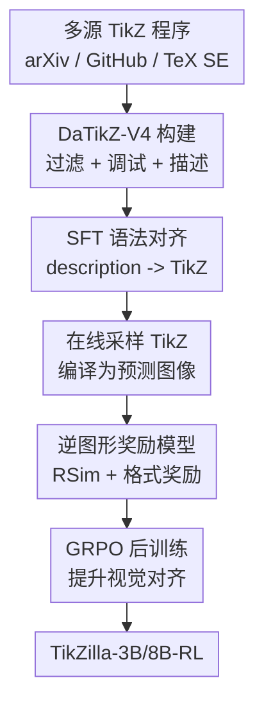

# TikZilla: Scaling Text-to-TikZ with High-Quality Data and Reinforcement Learning

**会议**: ICLR2026  
**OpenReview**: [https://openreview.net/forum?id=rJv2byEWA3](https://openreview.net/forum?id=rJv2byEWA3)  
**论文**: [OpenReview](https://openreview.net/forum?id=rJv2byEWA3)  
**代码**: https://huggingface.co/collections/nllg/tikzilla  
**领域**: 代码生成 / 科学图形生成  
**关键词**: Text-to-TikZ, 代码生成, 科学图形, 强化学习, 逆图形学奖励  

## 一句话总结
TikZilla 通过构建 200 万级高质量 TikZ 数据集 DaTikZ-V4，并在 SFT 后用基于逆图形学图像编码器的 GRPO 奖励继续训练小型 Qwen 模型，使 3B/8B 开源模型在 Text-to-TikZ 科学图形生成上超过 GPT-4o、自动指标上超过 GPT-5，并显著提高编译率与图形语义对齐。

## 研究背景与动机
**领域现状**：科学论文里的图形常常需要精确、可编辑、能和 LaTeX 无缝集成的矢量表示，TikZ 正是这个生态里的标准工具之一。Text-to-TikZ 任务希望模型根据自然语言描述直接生成完整 TikZ/LaTeX 程序，相当于把“文字说明”翻译成“可编译的图形代码”。已有方法多依赖 caption-TikZ 配对数据做监督微调，也有工作尝试用逆图形模型或跨模态适配器从图像侧补充监督。

**现有痛点**：这个任务难在两头都不干净：一头是数据，现有 DaTikZ-V3 规模只有几十万，原始 caption 经常缺少图形类型、组件、标签、空间关系等重建所需信息；另一头是训练信号，纯 SFT 只看到 token 层面的 TikZ 序列，不直接知道代码渲染出来是否像目标图。因此模型可能语法上像 TikZ，但视觉上出现循环、无关元素、位置关系错误，甚至因为包、环境和命令不匹配而无法编译。

**核心矛盾**：Text-to-TikZ 的质量不只是“代码像不像参考代码”，而是“渲染后的科学图形是否符合描述和目标图”。传统 caption 不能提供足够细的图形语义，BLEU/TED/CLIP 这类通用指标又不能可靠刻画科学图里的布局、标签、几何关系和公式元素。也就是说，模型训练需要更丰富的数据和更贴近渲染结果的反馈，但这两者在以往 TikZ 数据集中都不足。

**本文目标**：作者把问题拆成三个子目标：第一，扩展并清洗一个更大的 TikZ 程序库，覆盖 arXiv、GitHub、TeX StackExchange 和合成数据；第二，用 VLM 生成更适合重建图形的细粒度描述，替代粗糙 caption；第三，在 SFT 之后引入渲染感知的强化学习，让模型在在线采样中直接被“生成图像与目标图像是否语义一致”约束。

**切入角度**：论文的观察很直接：如果模型最终交付物是可渲染图形代码，那么训练反馈也应该经过渲染结果，而不是只停留在文本 token 或通用图文相似度上。作者因此重新训练 DeTikZify-V2 的图像编码器，让它通过 Image-to-TikZ 逆图形任务学习科学图形的结构表征，再把这个编码器冻结成 RL 奖励模型。

**核心 idea**：用“高质量 Text-to-TikZ 数据 + 渲染后图像语义奖励”替代“小而噪的 caption 数据 + 纯 SFT”，把科学图形代码生成从语言建模问题推进到可执行、可视化反馈驱动的程序生成问题。

## 方法详解

### 整体框架
TikZilla 的训练流程可以理解为一条从数据构建到后训练的闭环：先把大规模 TikZ 代码清洗成可编译、可描述、可训练的 DaTikZ-V4；再用 description-TikZ 对做监督微调，让小模型掌握 TikZ 语法和任务格式；最后把模型输出渲染成图像，用专门训练过的科学图形图像编码器打分，并通过 GRPO 继续优化。这里的 RL 不是为了解通用决策问题，而是把“渲染图是否像目标图”变成代码生成模型的训练信号。

从输入输出看，训练样本的输入是 VLM 生成的科学图形描述 $x_{desc}$，目标输出是完整 TikZ 序列 $x_{tikz}=(x_1,\ldots,x_T)$。SFT 阶段让模型学会在给定描述时生成合法的 TikZ 文档；RL 阶段则把模型当作策略 $p_\theta(\cdot|x_{desc})$，对同一描述采样多个候选程序，编译后和目标图像比较，再用奖励差异推动模型偏向更可编译、更贴合目标视觉结构的代码。

### 关键设计
**1. DaTikZ-V4：用规模和可编译性补齐 Text-to-TikZ 的数据地基**

现有 Text-to-TikZ 数据的瓶颈不是“没有 TikZ”，而是可用 TikZ 太少、太脏、描述太粗。DaTikZ-V4 先从 arXiv 扩展到 2025 年中，额外引入约 55K 个含 `.tex` 或 `.pgf` 的 GitHub 仓库，还保留 TeX SE、合成和 curated 数据，最终得到 2,000,880 个 unique TikZ graphics，比 DaTikZ-V3 的 456,407 个大约扩大四倍以上。这个规模增长很关键，因为 TikZ 语法高度多样，少量样本很难覆盖电路图、交换图、函数图、流程图、控制系统、数学结构图等不同科学图形。

数据质量上，作者没有只做简单去重，而是把代码统一包装到 `\documentclass[tikz]{standalone}` 环境中，动态检测需要的 LaTeX 包和 TikZ library，移除依赖外部文件的 `\input`、`\includegraphics`，递归拆分子图，并过滤过短或过长的异常样本。对 arXiv 中编译失败率很高的代码，论文进一步用 Qwen3-32B 读取 LaTeX 编译错误并修复 TikZ，第一轮就在 130 万不可编译样本中修复约 60 万。这一步把本来会被丢弃的真实科学图形重新变成训练数据，也让后续 SFT 学到更稳定的文档结构和包依赖模式。

**2. VLM 描述替代原始 caption：把“题注”变成可重建图形说明**

普通论文 caption 往往是给人读论文时看的，它会引用上下文，省略颜色、布局、节点标签和相对位置；但 Text-to-TikZ 需要的是接近绘图说明书的文本。作者先人工评估 DaTikZ-V3 的 200 个 caption，发现大量 caption 缺少图形类型、组件、OCR 标签和空间关系，多数 usefulness 评分只有 1-2。更量化地看，原始 caption 与人工描述的 BLEU-4 只有 0.003，而 GPT-4o 生成的描述达到 0.089，接近人和人之间描述的一致性 0.094；STS 也从 0.355 提升到 GPT-4o 的 0.777。

基于这个结果，DaTikZ-V4 对约 130 万个可编译样本使用 Qwen2.5-VL-7B-Instruct 生成连续、细粒度、面向重绘的图像描述。它强调几何位置、形状、颜色、箭头、标签和公式，而不是“这个图表达了什么”的语义摘要。这样训练时的输入就更接近模型实际需要遵循的绘图规格，减少了 caption 噪声把模型带向错误结构的风险。消融也支持这一点：同一 GPT-4o 推理时，用 VLM description 的 AVG 为 0.315，而用 caption 只有 0.270；SFT 训练中 description 版本同样优于 caption 版本。

**3. 逆图形学奖励模型：用科学图形表征评价渲染结果，而不是套通用相似度**

RL 阶段最关键的问题是奖励怎么定义。CLIPScore、DreamSIM 这类通用图像或图文相似度对自然图像有用，但科学图形里一个箭头方向、公式标签、节点对齐都可能决定正确性，通用视觉表征容易忽略这些细节，还可能被把文字塞进图里的投机行为欺骗。论文因此把 DeTikZify-V2 的图像编码器重新训练在 DaTikZ-V4 的 Image-to-TikZ 任务上：模型要从图像还原 TikZ，图像编码器自然必须捕捉科学图形的结构、文本和几何布局。

由于 DeTikZify-V2 输出的是 patch-level embedding，作者没有直接取 pooled cosine，而是用 Earth Mover's Distance 思路比较目标图像 patch 集合 $x=\{x_i\}$ 与预测图像 patch 集合 $y=\{y_j\}$。距离矩阵定义为 $D_{i,j}=1-\cos(x_i,y_j)$，最优流矩阵 $F$ 在两个 patch 分布之间搬运质量，最终相似度奖励写作 $R_{Sim}(x,y)=1-\frac{\sum_i\sum_j F_{i,j}D_{i,j}}{\sum_i\sum_j F_{i,j}}$。这个奖励落在 $[0,1]$，直觉上是在问：预测图和目标图的局部结构能否以较小代价对齐。论文还叠加格式奖励，要求输出以 standalone TikZ 文档开头和结尾；不符合基本文档格式的样本奖励为 0。

**4. 针对 TikZ 序列的 GRPO 细节：避免长代码偏置和不稳定探索**

SFT 让模型会写 TikZ，但不会因为渲染后图形错误而直接被纠正。TikZilla 在 SFT 模型 $p_{\theta_{SFT}}$ 上使用 GRPO：对每个描述采样 $G$ 个候选输出 $\{o_1,\ldots,o_G\}$，每个候选由奖励模型给出 $r_i$，再用组内相对优势推动高奖励输出概率上升。论文采用 Dr.GRPO 变体，用固定最大完成长度 $L$ 做 token-level normalization，替代 response-level normalization，以免 TikZ 里较长回复被不恰当地少惩罚。

此外，作者使用 DAPO 的 Clip-Higher 策略，把 clipping 阈值拆成 $\epsilon_{low}=0.2$ 和 $\epsilon_{high}=0.28$。这让低概率但可能有用的探索 token 有更大上升空间，同时限制高概率 token 继续塌缩。训练时还移除按组内奖励标准差缩放 advantage 的做法，避免不同难度 prompt 被重新加权；长度被截断的 completion 会被 mask 掉以提高稳定性。一个有趣选择是将 KL 系数设为 $\beta=0$，说明在这个任务里，格式奖励和科学图形奖励足以约束输出，不需要显式把策略拉回 SFT 模型附近。

### 一个完整示例
假设输入描述是一张控制系统图：“上方有 plant 方框，右侧输出 $y$，输出回路经过高通滤波、乘法节点、低通滤波和积分器，再反馈到求和节点。”SFT 模型通常能生成 `\node`、`\draw` 和若干箭头，但可能把 `\usepackage` 写进 `document` 环境、漏掉 `positioning` library，或者让反馈线方向和标签位置错乱。纯 token loss 只会惩罚它和参考代码不一致，却无法直接说明“这条线渲染后接错了”。

TikZilla 的 RL 过程会对同一个描述采样多个 TikZ 文档，先编译成图像；不可编译或不是 standalone 文档的输出直接因为格式奖励失败而得低分。可编译输出再送入冻结的 DeTikZify 图像编码器，与目标图像做 patch-level transport matching。如果某个候选保留了 plant、滤波器、乘法节点、求和节点和闭环结构，即使代码文本与参考代码不同，它仍会得到较高 $R_{Sim}$；如果另一个候选虽然 token 上有相似命令，却漏掉回路或错放箭头，patch 对齐代价更大，奖励更低。GRPO 用这种组内差异把模型推向“可编译且视觉结构对”的程序，而不是简单模仿参考字符串。

### 损失函数 / 训练策略
SFT 阶段的目标是标准自回归负对数似然：给定描述 $x_{desc}$ 和目标 TikZ 序列 $x_{tikz}$，最小化 $L_{SFT}(\theta)=\mathbb{E}_{(x_{desc},x_{tikz})\sim D}[-\sum_{t=1}^{T}\log p_\theta(x_t|x_{<t},x_{desc})]$。这个目标主要负责语法、常见绘图 token 分布和 prompt-following 格式。

RL 阶段使用 GRPO 对同一 prompt 的多个 rollout 做组内比较。论文实现里采样 temperature=1.0、top_p=0.9；TikZilla-3B 用学习率 $5e^{-6}$、batch size 144、8 个 rollout 训练 4,000 iterations，TikZilla-8B 用 $2e^{-6}$。训练集方面，SFT 用 DaTikZ-V4，RL 用 DaTikZ-V4-RL，这是一个 160K 样本子集，由第二轮 LLM debugging 修复不可编译图形并用 Qwen2.5-VL-7B 重新描述得到。

奖励由两部分组成：一是格式奖励，检查输出是否是完整 standalone TikZ 文档；二是图像相似度奖励 $R_{Sim}$，比较目标和预测渲染图的 DeTikZify patch embedding。图像编码器在 RL 中保持冻结，以减少 reward hacking。作者还重新训练 DeTikZify-V2：输入为 $448\times448$ 图像，最大输出长度 2048 tokens，使用 DaTikZ-V4 的 130 万 Image-TikZ 对训练两轮，学习率 $5e^{-5}$，batch size 128。

## 实验关键数据

### 主实验
论文构建了一个污染控制较严格的 DaTikZ-V4 测试集，共 1,047 个样本：只选 2025 年 5 月后的样本，每个来源限制唯一性，用 n-gram matching 排除训练重叠，并人工去掉 trivial 或损坏图形。测试描述统一由 GPT-4o 生成，以减少不同输入描述来源带来的偏差。自动指标包含 CLIP、DreamSIM、TeX Edit Distance、Compilation Rate 和 Average Tokens，AVG 是对对齐和代码相似度指标的聚合。

| 模型 | CLIP↑ | DSim↑ | TED↓ | AVG↑ | CR↑ | AT |
|------|-------|-------|------|------|-----|----|
| GPT-5 | 0.181 | 0.679 | 0.765 | 0.365 | 88% | 480 |
| GPT-4o | 0.147 | 0.580 | 0.767 | 0.320 | 78% | 404 |
| TikZero-Plus-10B | 0.104 | 0.397 | 0.807 | 0.231 | 61% | 742 |
| TikZilla-3B | 0.161 | 0.613 | 0.802 | 0.324 | 89% | 672 |
| TikZilla-3B-RL | 0.189 | 0.731 | 0.766 | 0.385 | 98% | 481 |
| TikZilla-8B | 0.158 | 0.602 | 0.793 | 0.322 | 86% | 729 |
| TikZilla-8B-RL | 0.185 | 0.727 | 0.761 | 0.384 | 95% | 459 |

最突出的结果是，TikZilla-3B-RL 的 AVG 达到 0.385，TikZilla-8B-RL 为 0.384，均高于 GPT-5 的 0.365。与 TikZero-Plus-10B 相比，TikZilla-3B-RL 的 CLIP 提升 0.085，DreamSIM 提升 0.334，编译率高 37 个百分点，而且平均 token 少 261 个。这说明高质量数据和渲染感知 RL 对 Text-to-TikZ 比单纯扩大通用模型更直接有效。

| 人类评测模型 | 文本对齐↑ | 图像对齐↑ | 综合↑ |
|--------------|----------|----------|------|
| GPT-4o | 3.27 | 2.85 | 3.06 |
| GPT-5 | 4.18 | 3.48 | 3.83 |
| Qwen2.5-3B | 1.61 | 1.50 | 1.56 |
| TikZilla-3B | 2.57 | 2.63 | 2.60 |
| TikZilla-3B-RL | 3.40 | 3.30 | 3.35 |
| Qwen3-8B | 2.03 | 1.89 | 1.96 |
| TikZilla-8B | 2.93 | 2.87 | 2.90 |
| TikZilla-8B-RL | 3.68 | 3.46 | 3.57 |

人类评测由 9 名专家完成，每人评估随机样本，按文本对齐和图像对齐两个维度给 1-5 分。GPT-5 在文本对齐上最高，但 TikZilla-8B-RL 在图像对齐上与 GPT-5 基本持平（3.46 vs. 3.48），TikZilla-3B-RL 也达到 3.30。更重要的是，RL 给两个模型都带来约 0.7 分以上的人类评分提升，说明奖励模型并非只在自动指标上“刷分”。

### 消融实验
论文的消融集中回答三个问题：描述质量是否重要、LLM debugging 是否真的贡献数据质量、奖励模型是否比通用指标更好。

| 配置 | CLIP↑ / DINO↑ | DSim↑ / LPIPS↑ | TED↓ | AVG↑ | CR↑ | AT |
|------|---------------|----------------|------|------|-----|----|
| GPT-4o with captions | 0.105 | 0.469 | 0.763 | 0.270 | 80% | 337 |
| GPT-4o with descriptions | 0.143 | 0.568 | 0.767 | 0.315 | 76% | 416 |
| Qwen2.5-3B SFT captions | 0.134 | 0.511 | 0.809 | 0.279 | 79% | 768 |
| Qwen2.5-3B SFT descriptions | 0.141 | 0.530 | 0.805 | 0.289 | 85% | 651 |
| Qwen2.5-3B SFT no debug | 0.138 | 0.534 | 0.809 | 0.288 | 79% | 762 |
| TikZilla-3B | 0.161 | 0.613 | 0.802 | 0.324 | 89% | 672 |
| SFT+RL with CLIP image reward | 0.751 | 0.418 | 0.779 | 0.463 | 97% | 537 |
| SFT+RL with DreamSIM reward | 0.759 | 0.439 | 0.777 | 0.474 | 99% | 494 |
| SFT+RL with RSim from DaTikZ-V3 | 0.789 | 0.440 | 0.768 | 0.487 | 97% | 496 |
| TikZilla-3B-RL with RSim from DaTikZ-V4 | 0.809 | 0.451 | 0.766 | 0.498 | 98% | 481 |

Caption 到 description 的替换在推理和训练两侧都有收益，说明问题不是简单“更多文本”而是“更可重建的文本”。只用 first-try compilable code 训练的 SFT no debug 比完整 TikZilla-3B 的 AVG 低 0.036，证明 LLM debugging 修复的大量真实样本不是噪声扩充，而是有效监督。奖励模型方面，CLIP 和 DreamSIM 都能提高编译率和图形质量，但用 DaTikZ-V4 训练出的 RSim 奖励最好，且与人类评分的 Spearman 相关达到 0.714，高于 DreamSIM 的 0.586、CLIP 的 0.260 和 $1-TED$ 的 0.307。

### 关键发现
- RL 对 Text-to-TikZ 的收益不仅是视觉相似度提高，也显著提升编译率。Qwen2.5-3B 做 RL-only 后 CR 可到 98%，TikZilla-3B-RL 也达到 98%，说明格式奖励和渲染反馈会强烈压制不可编译输出。
- 小模型的收益路径不同：Qwen2.5-3B baseline 很弱，必须先靠 SFT 建立 TikZ 语法基础；Qwen3-8B baseline 已有一定 TikZ 能力，RL-only 就能从 0.251 提升到 0.357。SFT 更像“教会语言和格式”，RL 更像“纠正视觉结构”。
- RL 还自然减少平均 token 数。作者没有显式设计 code efficiency reward，但 TikZilla-3B-RL 的 AT 从 SFT 的 672 降到 481，可能因为语义奖励会惩罚无关或幻觉元素，间接鼓励更简洁的代码。
- 在 SPIQA OOD 基准上，TikZilla-3B-RL 的 CLIP 0.193、DSim 0.637、CR 97%，明显超过 GPT-5 的 0.115、0.432、60%。这说明模型学到的不只是 DaTikZ 分布内模板，而是对更复杂科学图形也有一定迁移。

## 亮点与洞察
- 把数据质量问题讲得很实：论文没有把 Text-to-TikZ 失败简单归因于模型不够大，而是先证明 caption 本身不适合重建图形，再用 VLM description 替换输入监督。这对所有“从说明生成结构化程序”的任务都很有启发。
- 奖励模型设计贴近任务本质：TikZ 生成的最终目标不是参考代码字符串，而是渲染出来的图形。用逆图形学训练出来的图像编码器做奖励，比套通用 CLIP/DreamSIM 更能对齐科学图形里的标签、布局和结构。
- LLM debugging 是一个很实用的数据工程技巧。很多真实 TikZ 代码只差少量环境、包或语法修复就能用，直接丢弃会损失真实分布；用编译错误日志驱动修复，既扩充数据，也让模型看到更多经过标准化的可执行程序。
- 小模型超过强闭源模型的结论有实际价值。TikZilla-3B/8B 规模很小，部署和微调成本远低于 GPT-5/GPT-4o，却在这个专业任务上达到甚至超过它们，说明垂直领域的“数据 + 反馈”仍然可以胜过通用规模。
- 论文也展示了一个可迁移范式：对 LaTeX 表格、CAD、流程图、SVG、UI DSL 等结构化生成任务，都可以先构造可执行数据，再用执行/渲染结果训练专用奖励，而不是只做文本级 imitation。

## 局限与展望
- VLM description 仍然可能漏掉细节或产生幻觉。作者也承认，如果描述和真实图像不一致，模型可能学会满足错误描述，RL 也可能在错误监督下强化偏差。
- 奖励虽然比通用指标更相关，但仍是图像级语义相似度，未必能精确判断每个标签、公式、箭头方向和拓扑约束是否完全正确。未来可以引入 OCR、图结构解析、编译日志、元素级匹配等更细粒度 reward。
- DaTikZ-V4 的许可结构复杂，只有 35.55% 来自宽松 CC 许可，40.03% 是 Nonexclusive-Distribution，24.43% 没有显式许可信息。对开放发布、商业使用和再训练数据合规性需要更谨慎处理。
- 测试描述统一由 GPT-4o 生成，可以降低输入来源差异，但也可能让评测偏向某种 VLM 描述风格。真实用户提示可能更短、更模糊、更偏意图而非重绘说明，性能需要额外验证。
- TikZilla 的代码结构偏向基础 primitives，论文也观察到 GPT-5 在高层概念图和网络式布局上有时更强。后续可以结合 planner、layout solver 或可编辑图形中间表示，让模型既稳定又能处理更抽象的图形意图。

## 相关工作与启发
- **vs AutomaTikZ**: AutomaTikZ 主要在 caption-TikZ 配对数据上微调，重点是证明 LLM 可以从文本生成 TikZ；TikZilla 的区别在于把数据扩到 DaTikZ-V4，并用 VLM description 和渲染感知 RL 解决 caption 噪声与视觉反馈缺失。
- **vs TikZero / TikZero-Plus**: TikZero 利用 inverse graphics 和 modality bridging 从 text-image 数据中获得监督，但仍受 noisy captions 和 decoder 训练限制。TikZilla 直接构建 description-TikZ 大规模配对数据，并把逆图形编码器用作 RL 奖励，因此在 CLIP、DSim、CR 和 token 效率上显著超过 TikZero-Plus-10B。
- **vs StarVector / SVG 生成工作**: StarVector 面向 SVG 代码生成，更多关注通用矢量图形；TikZilla 面向科学论文里的 TikZ，语法、LaTeX 环境、数学标签和科学图形布局更强，奖励也专门为科学图形训练。
- **vs Rendering-aware RL for vector graphics**: RLRF 等工作也强调渲染反馈和复合奖励，但主要在 SVG 场景中评估代码效率、语义和视觉保真。TikZilla 的启发是：对 TikZ 这种 LaTeX 程序生成，领域专用图像编码器比直接复用通用视觉相似度更可靠。
- **vs 通用闭源 LLM**: GPT-5/GPT-4o 有更强的通用语言和推理能力，但在 TikZ 这种专门代码方言上容易出现缺包、宏嵌套、命令幻觉和不可编译输出。TikZilla 说明，垂直数据和执行反馈可以把小模型训练成更稳定的专业工具。

## 评分
- 新颖性: ⭐⭐⭐⭐☆ 数据扩展、VLM 描述和渲染感知 RL 都有前人脉络，但把逆图形图像编码器作为 Text-to-TikZ 专用奖励模型很有针对性。
- 实验充分度: ⭐⭐⭐⭐⭐ 自动指标、人类评测、caption/description、debugging、reward、数据规模和 OOD 都做了，结论链条比较扎实。
- 写作质量: ⭐⭐⭐⭐☆ 主文结构清晰，数据与训练细节充分；少数公式排版和奖励训练细节需要读 appendix 才完整。
- 价值: ⭐⭐⭐⭐⭐ 对科学图形代码生成非常实用，也为其他可执行结构化生成任务提供了清晰范式。

<!-- RELATED:START -->

## 相关论文

- [\[ACL 2026\] MARS2: Scaling Multi-Agent Tree Search via Reinforcement Learning for Code Generation](../../ACL2026/code_intelligence/mars2_scaling_multi-agent_tree_search_via_reinforcement_learning_for_code_genera.md)
- [\[ICLR 2026\] Critique-Coder: Enhancing Coder Models by Critique Reinforcement Learning](critique-coder_enhancing_coder_models_by_critique_reinforcement_learning.md)
- [\[ICLR 2026\] HARDTESTGEN: A High-Quality RL Verifier Generation Pipeline for LLM Algorithmic Coding](hardtestgen_a_high-quality_rl_verifier_generation_pipeline_for_llm_algorithmic_c.md)
- [\[AAAI 2026\] ReCode: Updating Code API Knowledge with Reinforcement Learning](../../AAAI2026/code_intelligence/recode_updating_code_api_knowledge_with_reinforcement_learning.md)
- [\[ICLR 2026\] ATGen: Adversarial Reinforcement Learning for Test Case Generation](atgen_adversarial_reinforcement_learning_for_test_case_generation.md)

<!-- RELATED:END -->
