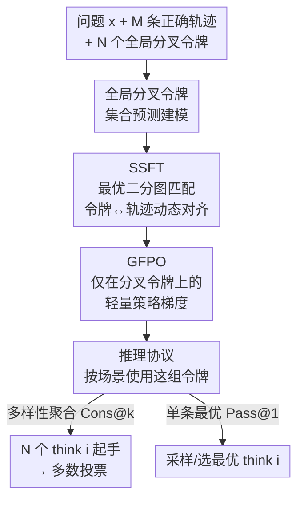

# Training Large Language Models To Reason In Parallel With Global Forking Tokens

**会议**: ICLR2026  
**arXiv**: [2510.05132](https://arxiv.org/abs/2510.05132)  
**代码**: [Sheng-J/SSFT](https://github.com/Sheng-J/SSFT)  
**领域**: 代码智能  
**关键词**: parallel reasoning, global forking tokens, set supervised fine-tuning, bipartite matching, test-time compute

## 一句话总结

提出 Set Supervised Fine-Tuning (SSFT)，通过二分图匹配将全局分叉令牌 (global forking tokens) 与多样推理轨迹对齐，使 LLM 能从单个控制令牌全局引导不同推理模式，在数学推理和代码生成任务上显著优于标准 SFT 和 GRPO。

## 背景与动机

- LLM 通过扩展测试时计算（生成更多 token）来提升推理能力，但**顺序扩展**存在"过度思考"(overthinking) 问题——超过一定序列长度后性能反而下降
- **并行采样**（如 self-consistency、Best-of-N）是另一扩展维度，但依赖模型生成**多样且正确**的解
- 研究表明 Chain-of-Thought 推理中只有少数 **forking tokens** 能导致不同推理路径，随着问题变难、生成变长，采样到这些关键 token 的概率大幅降低
- 常见的提升多样性手段（如温度缩放）面临**多样性-准确性 trade-off**：理论工作表明单纯提高温度不能保证更大的多样性，除非模型被显式训练以实现覆盖 (coverage)

## 核心问题

如何利用多样推理轨迹训练 LLM，使其通过一组**全局控制令牌**在生成开头就分叉进入不同推理模式，从而在不依赖采样中间 forking tokens 的情况下实现高多样性和高准确性的并行推理？

## 方法详解

### 整体框架

方法把"让一个 LLM 同时学会多种推理风格"重新表述成一个集合预测问题：在序列开头放一组全局分叉令牌 `<think 1>…<think N>`，让每个令牌唯一地"领走"一条推理轨迹。训练分两阶段——先用 SSFT 通过二分图匹配把令牌和轨迹对齐，再用 GFPO 这一极轻量的 RL 步骤微调令牌处的分布；推理时只要换不同的 `<think i>` 起手，模型就能从开头分叉进入不同推理模式。

### 关键设计

**1. 全局分叉令牌与集合预测建模：让多样性由开头的一个控制令牌全局决定**

并行推理过去依赖采样到 Chain-of-Thought 中间那些稀有的 forking tokens 来产生不同路径，问题越难、序列越长，采到这些关键 token 的概率越低。本文换了一个思路：定义一组全局分叉令牌 $\boldsymbol{g} = \{g^{(i)}\}_{i=1}^{N}$（实例化为 `<think 1>`, …, `<think N>`），把它们钉在生成序列的固定起始位置，让不同推理模式从开头就被这一个令牌全局引导，而不必指望中途采样到分叉点。给定问题 $\mathbf{x}$ 和 $M$ 条不同的正确推理轨迹 $\mathbf{R} = \{\mathbf{r}^{(j)}\}_{j=1}^{M}$，目标是让每个 $g^{(i)}$ 唯一触发一条轨迹。这要求把训练目标写成 set-of-next-token-prediction：损失要对 $\mathbf{R}$ 与 $\boldsymbol{g}$ 的排列顺序保持**置换不变**，同时**不同轨迹不能共享同一个 $g^{(i)}$**——否则多条轨迹挤在一个令牌上，模式就会坍缩。

**2. SSFT：用最优二分图匹配把令牌和轨迹对齐，避免模式坍缩**

直接把第 $j$ 条轨迹硬性指派给第 $j$ 个令牌会引入虚假的顺序偏置，所以 SSFT 借鉴 DETR 的集合损失，让"哪个令牌配哪条轨迹"在每个训练步动态决定。每步先做**最优匹配**：构建代价矩阵，元素是轨迹 $\mathbf{r}^{(j)}$ 在条件 $g^{(i)}$ 下经长度归一化、stop-gradient 的 NTP 损失，再用 Hungarian 算法求最小代价匹配 $\hat{\boldsymbol{\sigma}}$；然后做**优化**，只对匹配上的 $M$ 条序列反传，最小化 Hungarian 损失

$$\mathcal{L}_{\text{Hungarian}}(\boldsymbol{\theta}) = -\mathbb{E}_{\mathbf{x}, \mathbf{R}}\Big[\sum_{j=1}^{M}\sum_{t=1}^{T_\mathbf{r}} \log \pi_\theta\big(r_t^{(j)} \mid \mathbf{x}, g^{(\hat{\sigma}(j))}, \mathbf{r}_{<t}^{(j)}\big)\Big]$$

由于匹配在每个问题上独立求解，同一条教师轨迹面对不同问题可能落到不同的 forking token，模型因此学到的是令牌与"推理风格"而非具体样本的关联，并允许不同轨迹之间发生正迁移（相比独立训练 $N$ 个子模型）。实现上保留 $N > M$（论文用 $N=6, M=4$），多出来的令牌给相似轨迹留出区分空间。计算上一个关键技巧是：匹配代价只用每条轨迹的前 $L$ 个 token（$L \approx \lfloor \text{max\_seq\_len}/(MN) \rfloor$），于是所有 $M \times N$ 个代价能在单次前向里算完，几乎不增加训练开销——这也暗示轨迹前段已足以区分推理策略。

**3. GFPO：只在分叉令牌上施加策略梯度的轻量 RL**

SSFT 之后再用少量 RL 步骤进一步拉开各令牌的差异，但梯度只作用在全局分叉令牌的输出分布上。因为这些令牌始终在生成序列的固定位置，工程上只需在现成 GRPO 代码里加几行 Python slicing：完整生成照常 rollout 用来估计每个 $g^{(i)}$ 的优势，但反向传播只更新令牌位置的分布，不碰后续 token，因此代价远小于全序列 RL。

**4. 推理协议：按场景选择如何使用这组令牌**

测多样性聚合（Cons@k）时，用 $N$ 个不同的 `<think i>` 分别起手生成、再多数投票，把训练学到的多样性直接兑现成覆盖率。要单条最优输出（Pass@1）时，GFPO 模型可以自动采样最优 $g^{(i)}$，或退一步选训练中覆盖了最多不同轨迹的 $g^{(i^*)}$（按论文公式 4 的图启发式）。

## 实验关键数据

### 实验设置

- **基础模型**：Qwen2.5-32B-Instruct
- **训练数据**：s1k 的 1000 个问题，每个问题从 R1、Gemini Flash、Claude Opus 4.0/4.1、GPT-OSS-120B 蒸馏 4 条推理轨迹
- **评测**：AIME24/25、MATH-500、GPQA-Diamond、LiveCodeBench (OOD)

### 主要结果（Pass@1）

| 模型 | AIME24 | AIME25 | MATH-500 | LCB(OOD) |
|---|---|---|---|---|
| SFT-mixed-distill-32B | 58.23 | 51.96 | 88.49 | 32.34 |
| SSFT-32B (random σ) | 61.77 | 55.10 | 89.95 | 35.33 |
| **SSFT-32B** | **64.06** | **58.13** | **90.02** | **38.92** |
| **SSFT-32B-GFPO** | **64.22** | **58.80** | 89.90 | **42.10** |

- SSFT 在 AIME24/25 上比同数据 SFT 分别提升 **+5.83 / +6.17**
- Cons@32 在 AIME25 达到 **86.67%**，比 SFT 的 76.67% 提升 10 个百分点
- OOD 代码生成（LCB）上 SSFT-GFPO 达到 42.10%，提升 +9.76

### 多样性验证

- 不同 `<think i>` 触发**明显不同的推理长度分布和准确率**（Figure 4）
- 随机匹配训练的模型中，不同 `<think i>` 没有可辨识的差异（Figure 5）
- 训练过程中仅少数匹配配置持续获得权重，表明模型学到了 forking token 与推理模式的稳定关联

### 鲁棒性

- 在代码生成数据（code1k）上同样有效：SSFT-32B-code 在 LCB 上 52.07% vs SFT 47.13%
- 在公开数据集（OpenR1-93k）+ 小模型（Qwen2.5-Math-7B）上仍有一致提升
- 在 Qwen3-4B-Base 和 Llama3.1-8B-Instruct 上也观察到增益

## 亮点

- **优雅的问题建模**：将并行推理转化为集合预测问题，借鉴 DETR 的二分图匹配思想首次应用于语言建模，理论清晰
- **实用性强**：全局分叉令牌位于序列开头固定位置，推理时无需复杂搜索即可引导多样推理；GFPO 实现仅需几行代码
- **可解释的匹配可视化**：训练过程中匹配配置的演化清晰展示了 forking token 与推理模式的自动关联学习
- **计算开销极小**：匹配代价计算使用 stop-gradient 和仅前 $L$ 个 token，几乎不增加训练时间

## 局限与展望

- 当前实验中 $N=6, M=4$ 的设置规模较小，更大规模二分图的效果和计算负担有待探索
- 多样推理轨迹来源于多教师蒸馏，对教师模型质量和多样性有依赖
- GFPO 仅在 forking token 上施加策略梯度，是否可以拓展到更多可控位置未被讨论
- 评测以数学和代码为主，开放域推理任务（如常识推理、多跳QA）上的效果未知

## 与相关工作的对比

| 方法 | 特点 | 本文优势 |
|---|---|---|
| Temperature scaling | 通过调温增加多样性 | 无法保证覆盖；温度过高降低准确率 |
| Self-consistency / Best-of-N | 并行采样后聚合 | 不显式训练多样性，依赖中间 forking tokens |
| Multiverse (Yang et al., 2025b) | 将顺序 CoT 转为并行 CoT | 不含集合损失、无法避免模式坍缩 |
| 并发工作 (Wen et al., 2025) | 多轨迹蒸馏 + 随机 tag 分配 | 随机分配无法学到 forking token 与轨迹的关联 |
| DETR (Carion et al., 2020) | 物体检测中的集合全局损失 | 本文首次将其扩展到自回归语言建模 |

## 启发与关联

- **集合预测 + 语言建模**的结合范式有广泛推广潜力：可用于多答案生成、多风格写作、多策略搜索等场景
- 全局分叉令牌的思想可与 **Mixture of Experts** 结合——将不同推理模式路由到不同专家
- 匹配代价计算仅用前 $L$ 个 token 的技巧提示：推理轨迹的前段 token 已足以区分不同推理策略，这一观察可用于轨迹剪枝和快速评估

## 评分

- 新颖性: ⭐⭐⭐⭐⭐ (将集合预测引入语言建模，全局分叉令牌概念新颖)
- 实验充分度: ⭐⭐⭐⭐⭐ (多基准、多模型规模、多数据源、丰富消融实验)
- 写作质量: ⭐⭐⭐⭐⭐ (公式清晰、可视化丰富、实验逻辑严密)
- 价值: ⭐⭐⭐⭐⭐ (实用且理论优雅，对并行推理训练有重要指导意义)

<!-- RELATED:START -->

## 相关论文

- [\[ICML 2026\] Locally Coherent Parallel Decoding in Diffusion Language Models](../../ICML2026/code_intelligence/locally_coherent_parallel_decoding_in_diffusion_language_models.md)
- [\[ICLR 2026\] Evolving Graph Structured Programs for Circuit Generation with Large Language Models](evolving_graph_structured_programs_for_circuit_generation_with_large_language_mo.md)
- [\[ICLR 2026\] CrossPL: Systematic Evaluation of Large Language Models for Cross Programming Language Interoperating Code Generation](crosspl_systematic_evaluation_of_large_language_models_for_cross_programming_lan.md)
- [\[ICLR 2026\] LearNAT: Learning NL2SQL with AST-guided Task Decomposition for Large Language Models](learnat_learning_nl2sql_with_ast-guided_task_decomposition_for_large_language_mo.md)
- [\[ICLR 2026\] Learning to Reason without External Rewards](learning_to_reason_without_external_rewards.md)

<!-- RELATED:END -->
