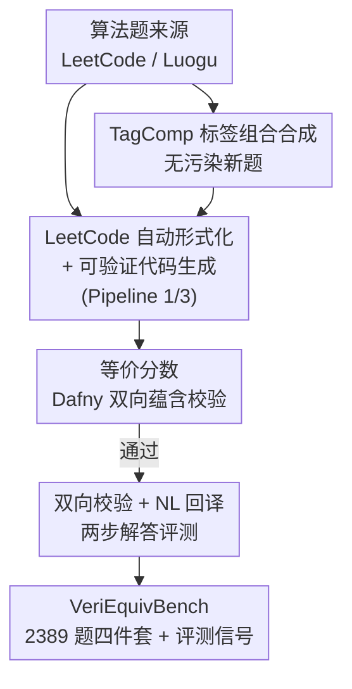

# VeriEquivBench: An Equivalence Score for Ground-Truth-Free Evaluation of Formally Verifiable Code

**会议**: ICLR 2026  
**OpenReview**: [https://openreview.net/forum?id=tRRHVUwP2B](https://openreview.net/forum?id=tRRHVUwP2B)  
**代码**: https://github.com/PunyGoood/VeriEquivBench  
**领域**: 代码智能 / 形式化验证 / LLM 评测  
**关键词**: 可验证代码生成, 形式化规约, 等价分数, Dafny, 无真值评测

## 一句话总结
针对「可验证代码生成」评测被人工标注的真值规约卡住规模、还有错的问题，本文提出**等价分数（equivalence score）**——用 Dafny 验证器自动检查代码与规约的**双向蕴含**，从而无需真值就能判定规约质量；并据此构建了含 2,389 道复杂算法题的 VeriEquivBench，结果显示连 Claude-4-sonnet 在 pass@4 下都全军覆没。

## 研究背景与动机
**领域现状**：让 LLM 生成可信代码的下一站是**形式化验证**——不只跑单元测试，而是让模型在生成代码的同时生成形式化规约（formal specification），再用定理证明器（如 Dafny，自带自动证明器，无需手写证明）证明「代码 ⟺ 用户意图」。这样能给出可证明的正确性保证，规避单元测试覆盖不足、漏掉关键错误的问题。

**现有痛点**：这条路线的瓶颈不在生成、而在**评测**。现有 Dafny benchmark（DafnySynthesis、CloverBench）都靠把模型生成的规约去**匹配人工写好的「真值规约」**打分。可形式化标注极其昂贵、又要深厚专业知识，导致这些数据集加起来只有 **215 道简单题**，远不够压测当今 LLM 的高级推理。更糟的是真值本身不可靠：CloverBench 已发现 DafnySynthesis 里 10% 的专家规约是错的，本文又查出额外 18% 含错误或歧义——靠这种真值打分，benchmark 的有效性从根上就被动摇。

**核心矛盾**：评测一个规约「好不好」，传统做法必须先有一个「标准答案规约」来比；但标准答案既稀缺又不可信，于是**规约评测同时被规模和可靠性双重锁死**。

**本文目标**：① 找到一个不依赖真值、又有形式化保证的规约质量度量；② 用它把 benchmark 在规模和难度上做大一个数量级；③ 用大模型实测，看清当今 LLM 在端到端可验证代码生成上的真实水平。

**切入角度**：作者注意到——判断规约「是否精确刻画了代码」，其实不需要任何外部标准答案，只需检查**规约与代码是否互相蕴含**。如果规约太弱（如二分查找只要求 `-1 <= idx < a.Length`），一个根本没找到 key 的错误实现也能通过验证器，这就是漏洞所在。

**核心 idea**：用 Dafny 验证器自动证明「代码 ⟹ 规约」与「规约 ⟹ 代码」的**双向蕴含**，把它定义为**等价分数**——只有双向都成立才记分，从而**无真值地、零假阳性地**判定规约是否完整无歧义。

## 方法详解

### 整体框架
本文本质是一套「评测度量 + 数据构造流水线 + 大模型实测」的 benchmark 工作。核心度量是**等价分数**，整条数据流水线则把原始算法题（来自 LeetCode / Luogu）逐步加工成「自然语言 query + Python/Dafny 实现 + 形式化规约 + 单元测试」的四件套标注，并用等价分数把关。

流水线分三段（论文 Figure 2 的 Pipeline 1/2/3）：**Pipeline 1** 把题目描述自动形式化成无语法错误的 Dafny 规约；**Pipeline 2** 校验自然语言 query 与规约是否一致（回译 + 跑单测）；**Pipeline 3** 在规约+描述+参考解的提示下产出可过验证器的标注 Dafny 代码。在此之上，作者还设计了**标签组合（TagComp）合成器**来批量造无污染的新题，以及**双向等价 + NL 回译**的两步解答评测协议。

### 关键设计

**1. 等价分数：用双向蕴含取代真值匹配**

这是全文的支点，直接针对「规约评测必须有真值」的痛点。作者把「规约是否精确刻画代码」拆成两个方向的蕴含，都交给 Dafny 验证器自动判定：① **代码 ⟹ 规约**（代码的行为落在规约描述的范围里），直接把带标注的 Dafny 程序提交验证器即可；② **规约 ⟹ 代码**（规约对任意输入都紧致地刻画了代码行为，不留松弛），需要额外构造一段验证脚本来证明「代码不会做出规约之外的行为」。只有**两个方向都通过**，这对 (代码, 规约) 才获得等价分数。

关键在于这套判定**零假阳性**：Dafny 的自动证明器只在蕴含真正成立时才放行，因此被接受的配对必然是精确匹配的。论文 Figure 3 给了个反例——`Max(a,b)` 的后置条件只写 `ensures max >= a`，漏了 `>= b`；构造 `Check_Max_Spec` 取一个仅满足规约的任意 `max`，再断言它等于真实方法输出，验证器必然判定该断言为假，于是这个欠规约（underspecified）的程序拿不到等价分数。相比之下，旧的 Clover 协议靠 LLM 判断自然语言等价，错误率高、不可靠；等价分数把判定权完全交给形式化证明器，既无需真值、又有可证明的可靠性。

**2. LeetCode 自动形式化 + 可验证代码生成流水线：把廉价题源加工成可验证四件套**

针对「人工标注规约太贵、数据上不去规模」，作者用 LLM 把经过社区验证的 LeetCode 题池自动转成形式化标注。规约生成阶段（Pipeline 1）把题目喂给 Claude-4-sonnet 产出初版 Dafny 规约，但初稿常有语法错误，于是**最多重试 10 次**直到没有 parse/resolution 错误，并发现给两个简单示例能借 in-context learning 显著降错；同时**强制规约只用一阶逻辑**、禁止递归或 DP 式定义，确保规约描述的是问题的声明式性质、而不泄露实现。代码生成阶段（Pipeline 3）则用**多阶段流水线**：强模型（Claude-4）在「规约 + 描述 + 参考 Python 解」提示下产出标注 Dafny 代码，轻模型（Claude-3.5）再打磨、**最多迭代 6 次**消语法错误，多数题在 3 轮内收敛。

这套流水线产出的不是单一答案，而是**两版规约**：一版「强规约」从 query 无损推导、信息完整到 Claude-4 仅凭它就能复现实现，但**过不了验证器**；一版「弱规约」可验证但不完整。两版恰好映射到两个辅助任务——强规约喂给「可验证代码精修」（补不变式/引理让代码过验证器），弱规约喂给「Code-to-Spec 生成」（用 spec-superior-score 衡量比弱基线强多少）。最终 LeetCode 侧成功转出 2,174 道 Dafny 程序。

**3. TagComp 标签组合合成：可扩展地造无污染新题**

为防止数据污染、并提供可无限扩展的训练题源，作者设计了**细粒度标签本体 + 随机组合**的合成器。每道题用三个正交维度打标——**领域（domain）**、**数据结构（data structure）**、**算法（algorithm）**；本体定义了 500+ 细粒度标签，是 LeetCode 69 个标签的 7 倍粒度，标签源自 Luogu 题库种子池并人工剔除幻觉/离题标签。合成时**从三个池各随机抽 12 个标签，再让 Claude-4 从中挑 3–8 个**，据此生成一道清晰算法题外加约 40 个单元测试。初版造了约 1,900 题，但**只保留通过率 ≥85% 单测的 300 题**，构成干净的 TagComp 集；其中 215 题通过弱基线流水线，与 LeetCode 侧合并得到 2,389 题。这样造出的题与等价分数信号完全兼容，且因标签随机组合而天然规避了与现有 benchmark 的重叠污染。

**4. 双向校验 + NL 回译：两步评估解答是否真对齐用户意图**

仅有等价分数还不够——它只能保证「代码与规约互相精确」，但无法保证规约本身对齐了用户真实意图（一对自洽但都跑偏的代码+规约也能拿等价分数）。因此解答评测分两步：① 用等价分数验证生成的代码与规约**双向等价**；② 把形式化规约**回译成自然语言**，再判断它是否忠实捕捉了原始 query 意图。回译这步在数据构造时用 Grok-4 改写、Claude-4 判等价并打分（实测翻译成功率 82.98%），并辅以「规约单独译成 Python 跑真值单测」交叉校验；最终实测中作者用 **Claude-4 当 judge** 代替人工来判断意图满足度。两步合起来才给出论文所谓的 **exact matching score**（同时过等价 + 意图对齐）。

## 实验关键数据

### 主实验
**数据规模与复杂度**：VeriEquivBench 在规模和难度上都碾压前作。平均圈复杂度（Cyclomatic Complexity）从 DafnySynthesis 的 2.44 升到 5.63，题目常含多个 method 而非单一方法。

| 数据集 | 平均圈复杂度 | 说明 |
|--------|------|------|
| MBPP-50 | 2.44 | DafnySynthesis 的来源 |
| MBPP | 2.78 | — |
| LeetCode（本文） | 5.38 | 控制流明显更复杂 |
| TagComp（本文） | 5.63 | 合成题甚至比 LeetCode 侧还难 0.25 |

**SOTA 大模型实测（pass@4）**：在旧的 CloverBench 上 Claude-4-sonnet 能解 75.81%，但搬到本文无污染的 TagComp 上性能直接崩塌——三个专有模型**全部题目失败**。即便单看「语法正确的 Dafny 代码」，Claude 能到 73.79%，但在「代码与规约互等价」上 GPT 拿到最高也仅 **2.65%**；进一步分析发现这些「等价」解多是简化实现、在 hack 奖励、并未真满足用户需求。

| Benchmark | 最强模型表现 | 结论 |
|-----------|------|------|
| CloverBench | Claude 解 75.81% | 太简单，掩盖了真实难度 |
| VeriEquivBench (TagComp) | 三模型 pass@4 全败 | 复杂算法题上的形式化推理仍是开放难题 |

### 消融实验
**等价分数作为度量的有效性验证**：作者用等价分数反过来审计前人 benchmark 的「真值规约」质量，暴露出严重问题——大量被宣称为真值的规约根本无法与代码建立等价。

| 配置 / 数据集 | 获得等价分数的比例 | 说明 |
|------|---------|------|
| DafnySynthesis | 76.22% | 近 1/4 真值规约不达等价 |
| CloverBench | 61.29% | 依赖 NL 的等价检查局限明显 |
| DafnyBench | 43.09% | 本就不为检查规约完整性而设，分最低 |

此外在 DafnySynthesis 的 50 个专家可验证代码上，等价分数又额外揪出 9 个含歧义/代码错误的样本（14 个失败里仅 8 个能手工修复，印证人工标注之难）。

### 关键发现
- **等价分数零假阳性是核心价值**：它不仅能给新解答打分，还能当「真值审计器」，反查出前人 benchmark 中 18%~57% 不等的劣质规约——这是单向验证（只查代码满足规约）根本做不到的。
- **旧 benchmark 的高分是假象**：CloverBench 上 75% 的成功率掩盖了任务真实难度，换到复杂题就归零，说明评测难度需要随模型能力同步抬升。
- **当前 LLM 的瓶颈在「形式推理 + 意图对齐」而非语法**：模型能写出语法正确的 Dafny（73.79%），但几乎写不出与规约互等价、又真对齐 query 的解（≤2.65%），且这点分还多是 reward hacking。
- **辅助任务也很难**：RL 基线在「可验证代码精修」上仅 17.68%、「规约生成」上 54%，且后者几乎没有样本能生成完整规约——疑因 SFT 起点模型在过简题上训练、探索能力不足。

## 亮点与洞察
- **把「无真值评测」转化为「双向蕴含证明」**：最漂亮的一招是认清——评判规约质量根本不需要标准答案，只需让验证器证两个方向的蕴含；这把一个数据标注问题变成了一个形式化证明问题，天然零假阳性。
- **用 benchmark 当「真值体检仪」**：等价分数不只是评新模型，还能回头给老 benchmark 的真值做体检（暴露 DafnySynthesis、CloverBench、DafnyBench 大量劣质规约），这种「度量反哺数据」的思路可迁移到任何依赖人工真值的评测领域。
- **标签组合做无污染数据引擎**：500+ 三维标签随机组合 + 单测过滤的合成管线，给「可持续造新题、防数据污染」提供了一个可复用范式，且产出的题与形式化评测信号原生兼容。
- **诚实地报告「全军覆没」**：作者没有粉饰，直接报告 SOTA 在 pass@4 下全败，把可验证代码生成的真实难度摆上台面，这种负向结论对领域定位很有价值。

## 局限与展望
- **流水线重度依赖少数专有大模型**：自动形式化、代码生成、回译判等价、当 judge 全靠 Claude-4 / Grok-4，模型的偏差或不一致会直接传导进数据质量与评测结论；judge 用 Claude-4 评 Claude 生成解也存在潜在自利偏置。
- **弱规约「可验证但不完整」的折中**：数据集主体用的是弱基线规约（强规约过不了验证器），意味着标注的形式化属性本身不完整，可能影响某些下游任务的上限。
- **辅助任务基线偏弱**：RL 基线的低分部分归因于 SFT 起点模型在过简题上训练、探索不足，尚不清楚是任务本身难还是基线没调好。
- **「全失败」结果信息量有限**：TagComp 上三模型 pass@4 全为 0，虽说明难，但难以据此区分模型间能力梯度；未来或需更细的分级指标或部分得分机制来拉开差异。

## 相关工作与启发
- **vs Clover (Sun et al., 2024)**：Clover 的等价检查依赖 LLM 对自然语言的判断，错误率高、不可靠；本文把等价判定交给 Dafny 验证器的双向蕴含证明，零假阳性、且无需真值规约。
- **vs Yan et al. (2025)（spec-superior-score）**：他们用偏序比较生成规约与真值规约的强弱，仍依赖可信真值的质量与可得性；本文的等价度量直接验证代码↔规约的双向对应，彻底摆脱真值依赖。
- **vs DafnyBench / DafnySynthesis / CloverBench**：前作要么不为检查规约完整性而设（DafnyBench 等价分数仅 43.09%），要么规模小（215 题）且真值含 10%~28% 错误；VeriEquivBench 规模大一个数量级（2,389 题）、圈复杂度翻倍，并自带可信的自动评测信号。

## 评分
- 新颖性: ⭐⭐⭐⭐⭐ 「双向蕴含 = 无真值等价分数」是对规约评测范式的根本性改写，并能反哺审计旧真值。
- 实验充分度: ⭐⭐⭐⭐ 多模型多 benchmark 实测 + 对前作真值的系统审计扎实，但辅助任务基线偏弱、全失败结果难分梯度。
- 写作质量: ⭐⭐⭐⭐ 动机层层递进、反例（Max/SwapFirstAndLast）讲得清楚；部分流水线细节散落在多个 Figure/附录。
- 价值: ⭐⭐⭐⭐⭐ 为可验证代码生成提供了可扩展、可信、防污染的评测底座与数据引擎，直击领域核心瓶颈。

<!-- RELATED:START -->

## 相关论文

- [\[ICLR 2026\] VERINA: Benchmarking Verifiable Code Generation](verina_benchmarking_verifiable_code_generation.md)
- [\[ICLR 2026\] SWE-RM: Execution-Free Feedback for Software Engineering Agents](swe-rm_execution-free_feedback_for_software_engineering_agents.md)
- [\[ICLR 2026\] CrossPL: Systematic Evaluation of Large Language Models for Cross Programming Language Interoperating Code Generation](crosspl_systematic_evaluation_of_large_language_models_for_cross_programming_lan.md)
- [\[ICLR 2026\] Process-Level Trajectory Evaluation for Environment Configuration in Software Engineering Agents](process-level_trajectory_evaluation_for_environment_configuration_in_software_en.md)
- [\[ICML 2026\] SWE-IF: Aligning Code Evaluation with Human Preference](../../ICML2026/code_intelligence/swe-if_aligning_code_evaluation_with_human_preference.md)

<!-- RELATED:END -->
