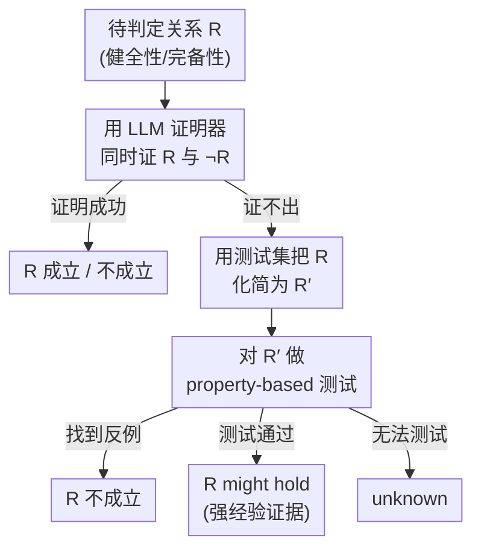

# VERINA: Benchmarking Verifiable Code Generation

**会议**: ICLR 2026  
**OpenReview**: [https://openreview.net/forum?id=0A4Uf88pog](https://openreview.net/forum?id=0A4Uf88pog)  
**代码**: https://github.com/sunblaze-ucb/verina （含 HuggingFace 数据集）  
**领域**: 代码智能 / 可验证代码生成 / Benchmark  
**关键词**: 可验证代码生成、Lean、形式化规约、定理证明、Benchmark

## 一句话总结
VERINA 用 189 道人工精修的 Lean 编程任务，把"可验证代码生成"拆成代码生成（CodeGen）、规约生成（SpecGen）、证明生成（ProofGen）三个可独立、可组合评测的基础任务，并给出一套"定理证明 + 全覆盖测试"的多阶段规约评估器，结果显示即便最强的 o3 也只有 72.6% 代码正确率、52.3% 规约合格率，证明成功率更是低到 4.9%。

## 研究背景与动机

**领域现状**：LLM 写代码已经在 Copilot、Cursor 等工具里大规模落地，但因为模型本质是概率生成，没法对生成代码给出形式化的正确性保证，bug 和安全漏洞只能靠人工 review 兜底。一条更有野心的路线叫"可验证代码生成"（verifiable code generation）——让模型**同时生成代码、形式化规约（specification）、以及证明代码满足规约的形式化证明**，从而把"对不对"这件事从人工判断变成机器可验证。

**现有痛点**：要推动这个范式，必须有 benchmark 来追踪进展，但现有评测体系几乎都只覆盖三件事里的一两件。HumanEval / MBPP 只管代码、不碰规约和证明；DafnyBench、miniCodeProps 只做证明生成；AutoSpec、SpecGen 只从已有代码里反推规约。少数同时覆盖三件事的工作（Dafny-Synthesis、Clover）又有两个硬伤：样本量很小（50、62 条），而且把规约生成和证明生成**揉成一个任务**，没法分开评测；自动化流水线产出的（如 FVAPPS 的 4715 条）则缺人工质控，规约质量没保证。

**核心矛盾**：可验证代码生成天然是三个**相互依赖**的子任务交织在一起，但好的 benchmark 既要对每个子任务单独给出鲁棒的评测指标，又要能把它们组合起来还原"从自然语言需求直接产出已验证软件"的端到端真实场景。现有工作要么覆盖不全、要么质量不过关、要么模块不可拆分，三者难以兼得。

**本文目标**：构造一个高质量、覆盖三大任务、且模块化可组合的可验证代码生成 benchmark，并配套一套即便当前 LLM 证明器还很弱也能可靠运行的规约评估方法。

**切入角度**：选用交互式定理证明（ITP）的 Lean 而非自动化定理证明（ATP）的 Dafny/Verus——Lean 的证明带显式中间步骤，模型可以诊断错误、从失败步骤里学习并迭代修正，而 SMT solver 是黑盒、证明脆弱难调试；同时 Lean 生态正在 AlphaProof、AWS 生产环境里快速壮大。

**核心 idea**：把可验证代码生成显式拆成 CodeGen / SpecGen / ProofGen 三个可独立也可组合的基础任务，用人工精修的 189 道 Lean 题 + 全覆盖正负测试套件做支撑，并为"规约对不对"这个最难自动判定的问题设计一套"先证明、证不出再测试"的多阶段评估器。

## 方法详解

### 整体框架
VERINA 不是一个模型，而是一套 benchmark + 评测协议。它的核心资产是 189 道独立的 Lean 编程任务，每道题都带齐自然语言描述、参考代码、形式化规约（前置条件 + 后置条件）、可选的形式化证明、以及一套同时含正例和负例的测试套件。在这套数据之上，VERINA 定义了三个**基础任务**——给定描述和函数签名，分别让模型产出代码（CodeGen）、规约（SpecGen）、证明（ProofGen）；再把这三个任务**组合**成规约引导的代码生成、从代码反推规约、端到端可验证代码生成等真实工作流。整条 pipeline 里最棘手的环节是"怎么自动判断模型生成的规约对不对"，VERINA 为此专门设计了一套基于定理证明和测试的多阶段评估器。

下面这张图描述了这套"先尝试形式化证明、证不出再回退到测试"的规约评估器（对应论文 Figure 3），它是 VERINA 区别于以往 benchmark 的核心机制：

### 关键设计

**1. 五要素数据格式与三源人工质控：把"高质量"做实**

针对以往 benchmark 要么样本少、要么自动生成无质控的痛点，VERINA 的每道题都由五个要素构成：自然语言描述（中位数 110 词，明确写清意图、输入参数类型、输出规约）、参考代码、形式化规约（前置条件 P 约束输入、后置条件 Q 约束输入输出关系）、可选证明（189 题里人工为 46 题写了证明，主要服务质检）、以及测试套件（中位数 5 个正例 + 12 个负例）。数据来自三个不同来源并逐一人工把关：49 题从 MBPP-DFY-50 手工翻译进 Lean，59 题从 CloverBench 用 o3-mini few-shot 翻译后人工校正，81 题来自一门定理证明课程的学生作业（题目源自 LeetCode / LiveCodeBench，普遍比 Dafny 翻译来的题更难）。

质控不是走过场而是一整套强约束：正例测试要在参考代码上达到 **100% 行覆盖**（Lean 缺覆盖工具，于是借 Python 参考实现 + coverage.py 验证后再人工确认迁移到 Lean）；每个正例都被变异出至少 3 个违反前置或后置条件的负例（布尔输出例外只能造 1 个），且负例按"违反 P 还是违反 Q"分类，以便分别精确评测规约的不同部件；参考代码和规约必须通过全部正例、且不通过任何负例。还有一个容易被忽略的细节——所有 ground-truth 规约都被刻意设计成**不能直接当代码用**，这样 CodeGen 任务给模型规约当参考时，模型必须真正理解规约语义、做非平凡推理才能写出实现，而不是把规约抄成代码蒙混过关。

**2. 三大基础任务 + 模块化可组合：既能单测也能端到端**

VERINA 把可验证代码生成显式拆成三个共享输入格式（都以自然语言描述 + 函数签名为输入）的基础任务：CodeGen 产代码、SpecGen 产规约、ProofGen 产证明。代码生成用全覆盖测试套件跑标准 $\text{pass}@k$；证明生成直接用 Lean 编译器验证，含 `sorry` 等占位符的证明判为错误。关键在于这三个任务**可以任意组合**，还原真实开发场景：规约引导的代码生成（给真规约，先写码再证它满足规约）、从代码反推规约（给真代码，标注规约并证明对齐）、以及最难的端到端可验证代码生成（只给自然语言，独立生成代码与规约，再证生成代码满足 **ground-truth 规约**）。

端到端任务里要求"证生成代码满足真规约"而非"满足自己生成的规约"是一处精心设计——否则模型可以生成定义上等价的代码和规约把证明 trivial 化，这一约束保证评测真正反映模型的验证能力。组合任务还能用来研究子任务间的依赖：比如真规约相对自然语言描述到底还能多带来多少信息增益、端到端里 CodeGen 和 SpecGen 谁先谁后或独立运行更好。这种模块化正是以往把 SpecGen 和 ProofGen 揉成单一任务的工作（Dafny-Synthesis、Clover）做不到的。

**3. 规约的健全性/完备性多阶段评估器：把"规约对不对"自动判出来**

规约评测是整个 benchmark 最难自动化的地方，因为"两个规约是否等价"本质是个不可判定问题。VERINA 先给出形式化定义：设 $\phi$ 是满足 ground-truth 规约的程序集合、$\hat{\phi}$ 是满足生成规约的集合，理想生成规约应满足 $\hat{\phi}=\phi$，它分解为**健全性**（$\hat{\phi}\subseteq\phi$，规约"足够小"只覆盖正确程序）和**完备性**（$\phi\subseteq\hat{\phi}$，规约"足够大"覆盖所有正确程序）。具体到前置条件 $\hat{P}$ 与后置条件 $\hat{Q}$，例如 $\hat{P}$ 健全当且仅当 $\forall x.\,P(x)\Rightarrow\hat{P}(x)$，$\hat{Q}$ 健全当且仅当 $\forall x,y.\,P(x)\wedge\hat{Q}(x,y)\Rightarrow Q(x,y)$，完备性对称定义。

要可靠判定这些关系 $R$ 是否成立，评估器走前面框架图里那条多阶段路线：先用 LLM 定理证明器尝试证明 $R$，证成则有形式化保证；证不出（当前 LLM 证明器能力有限时常发生）就回退到测试——把 $R$ 在具体测试值上化简成 $R'$，Lean 能自动判定就直接返回，判不了就用 Lean 的 `plausible` tactic 做 property-based testing，针对 $R'$ 里残留的全称/存在量化变量系统性地生成输入去找反例。证明成功可认证 $R$ 成立、找到反例可认证 $R$ 不成立、只过测试没证明则返回"$R$ might hold"（有全覆盖正负测试撑腰，是很强的经验证据）。为进一步提精度，评估器对 $R$ 和 $\neg R$ 都跑一遍，当一边返回 unknown 时取另一边的确定结论。最终 SpecGen 指标既报前置/后置条件各自健全性、完备性的 $\text{pass}@k$，也报"同时健全且完备"的聚合分；因为可能返回 unknown，结果用误差棒给出下界（unknown 当作不成立）和上界（unknown 当作成立）。

### 一个例子：判定生成的前置条件
拿 Figure 1 那道"按下标删数组元素"的题：真前置条件是 `k < s.size`。若模型生成 `k < s.size - 1`，评估器用正例 `(s : #[1,2,3,4,5]) (k : 4)`（合法但被这个更严的条件拒掉）就能判定它**不健全**；若模型生成 `k < s.size + 1`，则用负例 `(s : #[1,2,3,4,5]) (k : 5)`（非法输入却被这个更宽的条件接受）判定它**不完备**。整个过程不需要人工，靠测试套件里精心分类的正负例就能给规约的健全性/完备性下确定结论。

## 实验关键数据

评测了 10 个通用 LLM 和 3 个定理证明专用 LLM/agent 框架，2-shot prompting，主报 $\text{pass}@1$。

### 主实验：三大基础任务

| 任务 | 最佳模型 | pass@1 | 说明 |
|------|---------|--------|------|
| CodeGen（代码分） | o3 | 72.6% | 通用模型里最高 |
| SpecGen（规约健全且完备） | o3 | 52.3% | 比代码难 |
| ProofGen（证明分） | o3 | 4.9% | 所有通用模型都 <4.9%，极难 |

三大任务难度递增，证明生成是公认最难的一环：构造 Lean 证明、证明实现满足规约需要专门的定理证明能力，通用 LLM 普遍卡死在个位数。o4-mini、o3、Claude Sonnet 3.7、Claude Opus 4.0、Gemini 2.5 Flash 相对更强；后置条件的健全且完备一般比前置条件更难生成。

### 端到端与组合任务

| 任务 | 最佳模型 | pass@1 |
|------|---------|--------|
| Code&Spec（代码+规约都对） | o3 | 41.2% |
| End-to-End（再加证明对） | o4-mini / o3 | 3.2% |

端到端里同时生成对代码和规约就只有 41.2%，再要求证明正确直接掉到 3.2%——证明生成成为端到端可验证代码生成的绝对瓶颈，任何含 ProofGen 的组合任务性能都会被它拖死。

### 专用证明器与迭代修正

| 配置 | ProofGen pass@1 | 说明 |
|------|----------------|------|
| o3（通用） | 4.9% | 通用模型最佳 |
| Goedel Prover V2 32B | 11.2% | 专用证明器最佳 |
| DeepSeek Prover V2 7B | 8.6% | 专用证明器 |
| Copra (o4-mini, ≤64 query) | 7.9% | 树搜索 agent |

专用证明器和 agent 方法明显优于通用模型单次生成。进一步用迭代修正（模型读 Lean 报错后改证明），最强配置可把证明成功率从 4.9% 提到 **20.1%（64 步）**，且在相同 query 预算下**迭代修正稳定优于无反馈的直接生成**，印证 Lean verifier 反馈的价值；但代价是成本大涨、成功率仍然偏低。

### 关键发现
- **给真规约能帮 CodeGen，但给真代码帮不了 SpecGen**：提供 ground-truth 规约作上下文一致提升代码生成（且因规约不能直接当代码，提升全靠语义理解）；反过来给真代码做 SpecGen 却几乎没提升甚至变差——冗长的代码实现可能给规约生成引入噪声或过度约束，而形式化规约能有效约束和引导代码合成。
- **组合任务比单任务更难**：把 ground-truth 换成 LLM 生成的中间产物，性能普遍下降。
- **学生作业题更难**：源自 LeetCode/LiveCodeBench 的学生题在所有模型上都比 Dafny 翻译题更难。

## 亮点与洞察
- **把"可验证代码生成"做成可拆可组合的评测协议**：三大基础任务能单测、也能拼成端到端工作流，既能定位"模型到底弱在哪一环"，又能还原真实开发场景，这种模块化是以往把规约/证明揉一起的 benchmark 给不了的。
- **"先证明、证不出再测试"的规约评估器很巧**：直面"规约等价不可判定"这个硬骨头，用形式化证明拿确定性、用全覆盖正负测试 + property-based testing 兜底拿经验证据，还用 unknown 上下界把不确定性诚实地暴露在误差棒里，是一个可复用到任何形式化规约评测的范式。
- **一组冷峻的现实数字**：最强 o3 的证明成功率仅 4.9%、端到端仅 3.2%，清晰地把"LLM 写得出代码、却几乎证不出正确性"这个 gap 量化出来，为后续 LLM 定理证明研究指明方向。
- **"规约不能直接当代码"的反作弊设计**可迁移：任何给模型提供参考信息的评测，都应防止模型走捷径抄答案，这个约束逼出真正的语义理解。

## 局限与展望
- 规模仅 189 题，作者承认要扩到可用于微调的规模需要 LLM 辅助的自动标注。
- 题目偏简单、独立的编程问题，不能完全代表复杂的真实世界验证工程。
- 当前评估 pipeline 用全覆盖测试绕过了 LLM 证明器能力不足，未来证明器变强后可以提供更强的形式化保证（即评估器本身还带"might hold"这种非完全形式化的判定）。
- 只覆盖 ITP 的 Lean，扩展到 Dafny/Verus 这类 ATP 系统能增强泛化性但工作量大，留作未来工作。
- Lean 程序虽是新写的，但题目主题源自广泛使用的数据源，存在数据污染风险（作者在附录做了污染分析）。

## 相关工作与启发
- **vs Dafny-Synthesis / Clover**：它们同样覆盖三大任务，但用 Dafny 的自动定理证明、样本只有 50/62 条，且把 SpecGen 和 ProofGen 揉成单一任务无法分开评测；VERINA 用 Lean 的交互式证明、189 条人工精修样本、三任务完全模块化可组合。
- **vs DafnyBench / miniCodeProps**：它们只做证明生成单一任务；VERINA 覆盖代码、规约、证明三件事并支持组合。
- **vs FVAPPS**：它有 4715 条 Lean 程序但规约由全自动流水线生成、缺人工质控；VERINA 量小但每条人工验证、质量过硬。
- **vs CLEVER（并行工作）**：CLEVER 161 题源自 HumanEval、只支持 SpecGen 和规约引导的代码生成；VERINA 通过单任务 + 组合任务覆盖更完整的工作流谱系。

## 评分
- 新颖性: ⭐⭐⭐⭐ 首个模块化、可组合、覆盖三大任务的高质量 Lean 可验证代码生成 benchmark，规约评估器范式有原创性。
- 实验充分度: ⭐⭐⭐⭐⭐ 评了 13 个模型/框架，覆盖单任务、组合任务、端到端、专用证明器、迭代修正多维度。
- 写作质量: ⭐⭐⭐⭐ 任务定义、健全/完备性形式化、评估器流程都讲得清楚。
- 价值: ⭐⭐⭐⭐⭐ 把"LLM 能写码却证不出正确性"的 gap 量化出来，是推动可验证代码生成的关键基础设施。

<!-- RELATED:START -->

## 相关论文

- [\[ICLR 2026\] VeriEquivBench: An Equivalence Score for Ground-Truth-Free Evaluation of Formally Verifiable Code](veriequivbench_an_equivalence_score_for_ground-truth-free_evaluation_of_formally.md)
- [\[ICLR 2026\] FHE-Coder: Benchmarking Secure Agentic Code Generation for Fully Homomorphic Encryption](fhe-coder_benchmarking_secure_agentic_code_generation_for_fully_homomorphic_encr.md)
- [\[ICLR 2026\] InnoGym: Benchmarking the Innovation Potential of AI Agents](innogym_benchmarking_the_innovation_potential_of_ai_agents.md)
- [\[ICLR 2026\] Local Success Does Not Compose: Benchmarking Large Language Models for Compositional Formal Verification](local_success_does_not_compose_benchmarking_large_language_models_for_compositio.md)
- [\[ICML 2026\] MEnvAgent: Scalable Polyglot Environment Construction for Verifiable Software Engineering](../../ICML2026/code_intelligence/menvagent_scalable_polyglot_environment_construction_for_verifiable_software_eng.md)

<!-- RELATED:END -->
