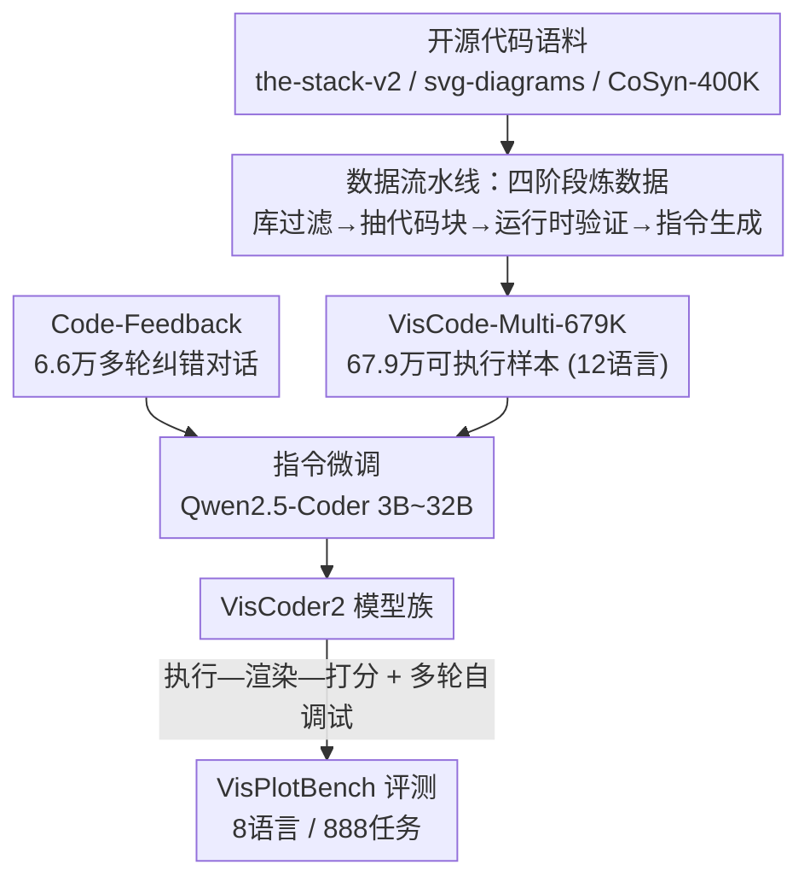

# VisCoder2: Building Multi-Language Visualization Coding Agents

**会议**: ICLR 2026  
**OpenReview**: [https://openreview.net/forum?id=4zoMnmZzh4](https://openreview.net/forum?id=4zoMnmZzh4)  
**代码**: https://tiger-ai-lab.github.io/VisCoder2  
**领域**: 代码智能 / 可视化代码生成 / 编程智能体  
**关键词**: 可视化编程、多语言代码生成、自调试、执行反馈、指令微调

## 一句话总结
针对现有可视化代码模型「语言覆盖窄、跑不通、不会迭代纠错」三大痛点，本文一次性给出数据集（VisCode-Multi-679K，12 种语言、67.9 万条可执行样本）、基准（VisPlotBench，8 种语言、888 个任务）和模型（VisCoder2，3B~32B），让开源模型在执行通过率上首次追平 GPT-4.1（32B 自调试后达 82.4%），尤其在 LilyPond/LaTeX/Asymptote 这类符号/编译型语言上大幅领先。

## 研究背景与动机

**领域现状**：LLM 驱动的编程智能体已经能「生成可视化代码 → 执行 → 看反馈再改」，被越来越多地用在数据分析与报告场景。可视化任务有个天然好处——执行结果和渲染出来的图本身就是强信号，立刻能判断代码跑没跑通、画出来对不对，因此特别适合训练「会自我纠错」的智能体。

**现有痛点**：但现有模型在真实工作流里频繁翻车，生成的代码要么直接崩溃、要么画出错误的图、要么换一门语言/库就不灵了。根子在于数据和基准都太窄——大多数数据集只盯着 Python 或 Vega-Lite 单一语言，且夹杂大量根本跑不起来的代码片段；现有基准也只考核「单轮生成」，既不支持跨语言系统评测，也没有多轮修复的协议。

**核心矛盾**：可视化的真实工作流本质是**迭代**的——分析师几乎不可能一次画对，都是看运行报错和视觉效果反复改。可现有训练资源全是「单轮、单语言、未验证」的，与真实的「多语言 + 运行时验证 + 反馈纠错」需求完全脱节。

**本文目标**：补齐三块短板——(1) 一个**经执行验证**、覆盖多语言、含多轮纠错对话的训练数据；(2) 一个能系统评测「初次生成 + 多轮自调试」的跨语言基准；(3) 一个真正可靠的多语言可视化编程模型。

**切入角度**：把「执行 + 渲染」当成可免费获取的监督信号——只保留能真正跑通、且渲染出有效图像的样本，用它构造大规模数据；并把「带执行反馈的多轮对话」混进指令微调，让模型学会读报错改代码。

**核心 idea**：用「严格执行验证筛出的多语言样本 + 多轮纠错对话」做指令微调，训练出能在 8+ 种语言上「执行—渲染—自调试」的可视化编程智能体。

## 方法详解

### 整体框架

本文不是单点改进，而是「数据集 + 基准 + 模型」三件套协同：先用一条四阶段流水线把开源代码语料炼成 67.9 万条可执行的可视化样本（VisCode-Multi-679K），再混入 6.6 万条带执行反馈的多轮纠错对话；用这批数据在 Qwen2.5-Coder 上做指令微调得到 VisCoder2；最后在自建的 VisPlotBench（8 语言、888 任务）上，用「执行—渲染—打分」协议 + 最多 3 轮自调试循环评测。输入是「自然语言指令 + 少量数据预览」，输出是可执行且渲染正确的可视化代码。

### 关键设计

**1. 四阶段数据流水线：用「能不能跑通」当过滤器**

可视化数据集长期被「样本跑不通」拖累，本文的解法是把执行本身做成硬筛选门槛。流水线分四步：**库过滤**（按各语言常用可视化库的调用关键词，从 the-stack-v2、svg-diagrams、CoSyn-400K 三个互补语料里捞候选，得到约 530 万 Python/JS/C++/TS/HTML/R 候选）；**代码块抽取**（多数代码嵌在大程序里，用 GPT-4.1-mini 抽出独立绘图块，缺数据时注入 mock 输入让它能独立运行）；**运行时验证**（在隔离的 Jupyter 环境跑，C++/JS/R 用专用 kernel、其余共用 Python kernel，`nbconvert` 配 `allow-error=False` 严格过滤，设固定超时杀死死循环，**只保留成功执行且生成非纯色、大于 10KB 有效图像**的样本）；**指令生成**（用 GPT-4.1 给每个验证过的样本写自然语言指令）。这套流程让监督信号天然「可执行」，三个语料分别产出 24.5 万 / 4.3 万 / 32.2 万条验证样本，每条都配渲染图。

**2. 五段式结构化指令：让监督同时覆盖语义与视觉风格**

如果只给一句话指令，模型学不到「数据长什么样、图该是什么风格」。本文把每条指令固定拆成五个组件：(1) Setup（说明编程语言和可视化库）；(2) 数据/视觉描述（数据驱动代码描述底层数据，非数据驱动代码描述图中可见元素）；(3) 数据块（一行数据生成语句或两行预览，非数据驱动时留空）；(4) 高层输出描述（这张图概念上想表达什么）；(5) 风格描述（颜色、网格布局等视觉属性）。五段按固定模板拼接，强制跨语料、跨语言的指令结构统一，让模型在一个一致的输入格式下同时拿到「画什么数据」和「画成什么样」两类监督。

**3. 多轮执行反馈对话：把「读报错改代码」直接灌进训练**

单轮样本教不会模型迭代纠错。本文额外混入 6.6 万条来自 Code-Feedback 的多轮对话，每条含用户指令、模型生成代码、以及携带执行反馈/修订提示的后续轮次。虽然这些对话不全是可视化主题，但它们提供了「基于运行时信号修复错误代码」的关键监督，让模型在指令微调阶段就同时练「初次生成」和「多轮修复」两种能力——这正是后面自调试能涨分的训练基础。

**4. VisPlotBench 的执行—渲染—打分协议 + 多轮自调试**

要公平评测「会不会纠错」，基准本身得支持多轮。VisPlotBench 覆盖 8 种语言、13 个视觉大类、116 个子类共 888 个任务，每个任务是「自然语言指令 + 可执行代码 + 渲染图」三元组。评测走标准化的 execute–render–score 管线，产出渲染图、执行日志、元数据三件产物，并报三个指标：**执行通过率**（代码能跑通且产出有效图）、**Task Score**（LLM 裁判按语义/结构规则打指令遵从度）、**Visual Score**（生成图与参考图的感知相似度）。对未解决的任务，模型最多再修 3 轮——每轮喂入指令、上一版代码和执行日志摘录，最终取最佳一次，模拟真实纠错循环。

### 一个完整示例

以一个 LilyPond 乐谱任务为例：指令要求「为 J.S. Bach 某乐曲生成钢琴乐谱」。VisCoder2-7B 初次生成代码后送入隔离 kernel 编译——LilyPond 这类符号语言语法脆弱，初版常因 `MarkupError`（标记错误）或结构错误编译失败。进入自调试：模型拿到报错日志摘录，把缺失的 token、错误的语法修掉，重新编译。在该语言上，基线 Qwen2.5-Coder-7B 只能跑通 5.5%，而 VisCoder2-7B 初次就达 69.1%、自调试后到 72.7%，task score ≥75 的样本比例提升十倍以上——直观说明「符号语法的针对性覆盖 + 反馈修复」如何把一门几乎做不出来的语言救回来。

## 实验关键数据

### 主实验

在 VisPlotBench（8 语言）上对比专有模型与开源基线，指标为执行通过率（%）：

| 模型 | Overall | Python | Vega-Lite | LilyPond | LaTeX | Asymptote |
|------|---------|--------|-----------|----------|-------|-----------|
| GPT-4.1 | 63.4 | 64.3 | 84.5 | 43.6 | 31.3 | 21.7 |
| GPT-4.1 + 自调试 | 82.4 | 84.2 | 96.1 | 63.6 | 66.1 | 46.7 |
| Qwen2.5-Coder-32B | 57.5 | 50.5 | 83.0 | 30.9 | 29.5 | 17.4 |
| **VisCoder2-32B** | **73.1** | 65.3 | 94.6 | 56.4 | 42.9 | 58.7 |
| **VisCoder2-32B + 自调试** | **82.4** | 81.6 | 96.1 | 69.1 | 61.6 | 71.7 |

VisCoder2-32B 比同规模 Qwen2.5-Coder 高约 15 个百分点，自调试后整体达 82.4%，追平 GPT-4.1 并超过 GPT-4.1-mini。小模型同样有效：VisCoder2-3B 达 67.7%，已超过更大的 DeepSeek-Coder-33B（54.3%）。

### 分语言 Task/Visual Score 分析

| 语言 | 模型 | Exec Pass | task Mean | 现象 |
|------|------|-----------|-----------|------|
| LaTeX | GPT-4.1 → +自调试 | 31.3 → 66.1 | ~50 | 语义对但编译常失败（执行—语义错位） |
| LilyPond | Qwen2.5-7B vs VisCoder2-7B | 5.5 → 69.1 | 3 → 52 | 符号语法收益最大 |
| SVG | VisCoder2-32B | 81.5 | task~68 / vis 低 | 执行高但视觉分受渲染库细节影响 |

### 错误分析（VisCoder2-32B，初次 → 自调试后）

| 错误类型 | LaTeX | Asymptote | Python |
|----------|-------|-----------|--------|
| 结构错误（语法/解析） | 10 → 4 | 9 → 3 | 1 → 1 |
| 类型&接口错误 | — | — | 13 → 3 |
| 语义/数据错误 | 28 → 23 | 15 → 11 | 19 → 8 |
| 运行时/环境错误 | 27 → 6 | 8 → 6 | — |

### 关键发现
- **自调试在符号/编译型语言上收益最大**：LilyPond、LaTeX、Asymptote 这类语法脆弱、易编译报错的语言，自调试能把大量「浅而频繁」的失败救回，32B 自调试后整体涨近 10 个点。
- **结构/接口错误好修，语义/运行时错误难治**：报错日志能直接定位的结构错误、类型错误下降明显（Python 接口错误 13→3）；而需要深层符号语法/运行时推理的语义错误（LaTeX 28→23）和渲染器错误（HTML 3→2）几乎修不动，是当前瓶颈。
- **唯一短板是 SVG**：VisCoder2 在 SVG 执行率上反而落后最强基线 10 多个点，原因是 SVG 评测强烈受库相关渲染细节影响，而非纯语义理解。
- **数据集的针对性覆盖直接转化为能力**：VisCode-Multi-679K 对符号语法的覆盖，让模型在 LilyPond 这类语言上从「几乎为零」跃升到可用水平。

## 亮点与洞察
- **把「可执行」当成数据质量的硬约束**：用 `allow-error=False` + 图像大小/纯色检查做严格过滤，从源头杜绝「跑不通的训练样本」，这是可视化数据相比通用代码数据可以白嫖的强监督信号，思路可迁移到任何「输出可自动验证」的代码生成任务。
- **数据集自带「纠错对话」让自调试不是空架子**：很多工作只在推理时套一个 self-debug 循环，但模型没在训练里见过「读报错改代码」就修不好。本文把多轮反馈对话灌进指令微调，训练-推理一致，是自调试涨分的真正基础。
- **基准设计与训练目标对齐**：VisPlotBench 的多轮自调试协议恰好对应训练数据里的多轮对话，避免了「训练单轮、评测多轮」的脱节，使评测能真实反映迭代纠错能力。
- **符号/编译型语言是多语言可视化的真·瓶颈**：连 GPT-4.1 在 LilyPond/Asymptote 上都低于 45%/25%，论文明确指出突破符号语法才是泛化关键——给后续工作指了方向。

## 局限与展望
- **训练语料语言不均衡**：Python、Vega-Lite 等高资源生态样本充足，符号/领域专用语言样本少得多，模型可能偏向主流语言。
- **基准语言覆盖仍有限**：VisPlotBench 目前只 8 种语言，扩到更多框架/语言才能更全面评测。
- **语义与运行时错误难解**：当前自调试协议靠日志反馈，对需要深层符号语法/运行时推理的语义错误几乎无能为力，作者指出需要「语法感知的训练目标」和更鲁棒的运行时集成。
- （自己看）**指令与 task/visual 分依赖 GPT-4.1 生成与裁判**：训练指令、Task/Visual Score 都由 GPT-4.1 产出/打分，可能引入对 GPT 风格的偏好，跨裁判稳健性未充分讨论。

## 相关工作与启发
- **vs VisCoder（前作）**: VisCoder 只在 Python（PandasPlotBench）上引入自调试，本文把它泛化到 8 种语言、13 个视觉大类，并把数据规模和语言覆盖（12 语言）大幅扩展，是「单语言可靠 → 多语言可靠」的升级。
- **vs 通用多语言代码模型（the-stack-v2 / Qwen2.5-Coder）**: 它们语言覆盖广但缺可视化专门知识，尤其在 LaTeX 数学图、LilyPond 乐谱这类领域语言上薄弱；本文用执行验证的可视化专用样本补上这块。
- **vs LIDA 等可视化系统**: 这类系统有一定反馈机制但缺系统化的多轮跨语言纠错能力，本文把「多语言生成 + 系统化自调试」统一起来，在符号语言上优势尤为突出。

## 评分
- 新颖性: ⭐⭐⭐⭐ 三件套本身非全新范式，但「执行验证 + 多语言 + 自调试一体化」的系统性整合扎实且填补空白。
- 实验充分度: ⭐⭐⭐⭐⭐ 4 个规模 × 8 语言 × 双评测模式 + 分语言 task/visual 分析 + 错误转移分析，覆盖很全。
- 写作质量: ⭐⭐⭐⭐ 结构清晰、动机-方法-实验闭环，图表充分。
- 价值: ⭐⭐⭐⭐⭐ 数据集/基准/模型全开源，让开源模型首次在可视化执行可靠性上追平 GPT-4.1，社区价值高。

<!-- RELATED:START -->

## 相关论文

- [\[ICLR 2026\] Multi-LCB: Extending LiveCodeBench to Multiple Programming Languages](multi-lcb_extending_livecodebench_to_multiple_programming_languages.md)
- [\[NeurIPS 2025\] Text-to-Code Generation for Modular Building Layouts in Building Information Modeling](../../NeurIPS2025/code_intelligence/text-to-code_generation_for_modular_building_layouts_in_building_information_mod.md)
- [\[ACL 2026\] CodeDistiller: Automatically Generating Code Libraries for Scientific Coding Agents](../../ACL2026/code_intelligence/codedistiller_automatically_generating_code_libraries_for_scientific_coding_agen.md)
- [\[ICML 2026\] NEMO: Execution-Aware Optimization Modeling via Autonomous Coding Agents](../../ICML2026/code_intelligence/nemo_execution-aware_optimization_modeling_via_autonomous_coding_agents.md)
- [\[ACL 2026\] RExBench: Can coding agents autonomously implement AI research extensions?](../../ACL2026/code_intelligence/rexbench_can_coding_agents_autonomously_implement_ai_research_extensions.md)

<!-- RELATED:END -->
