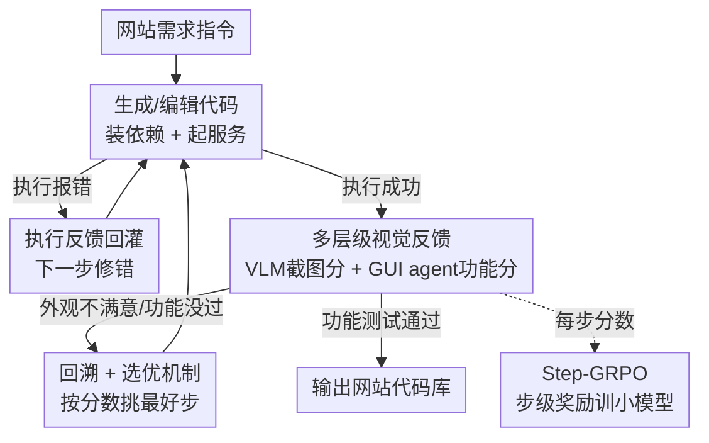

# WebGen-Agent: Enhancing Interactive Website Generation with Multi-Level Feedback and Step-Level Reinforcement Learning

**会议**: ICLR 2026  
**OpenReview**: [https://openreview.net/forum?id=fE14yWa68Z](https://openreview.net/forum?id=fE14yWa68Z)  
**代码**: 论文未在正文给出公开仓库链接（以 OpenReview 页面为准）  
**领域**: Agent / 代码生成 / 强化学习  
**关键词**: 网站生成、视觉反馈、GUI agent、Step-GRPO、过程监督

## 一句话总结
WebGen-Agent 让一个写代码的 LLM 在每一步迭代里都拿到「网页截图 + GUI agent 实测」的多层级视觉反馈来改网站代码，再把这两个反馈分数当成步级奖励做 Step-GRPO 强化训练，把 Claude-3.5-Sonnet 在 WebGen-Bench 上的准确率从 26.4% 拉到 51.9%、把 7B 小模型从 38.9% 训到 45.4%。

## 研究背景与动机

**领域现状**：基于 LLM 的代码 agent 在仓库级代码任务（修 GitHub issue、加新功能）上已经很能打，主流做法是「生成代码 → 跑一遍 → 看执行报错 → 再改」这样的执行反馈闭环。

**现有痛点**：网站生成这类任务**高度依赖视觉效果和交互流畅度**，而执行反馈只能告诉你「代码能不能跑起来、有没有抛异常」，根本看不出生成的网页长得好不好、按钮点不点得动。结果就是生成的网站经常出现组件错位、配色难看、按钮无响应、链接失效这类「能跑但很烂」的问题——代码层面零报错，但用户一看一用就垮。

**核心矛盾**：网站质量的真正信号在**渲染后的视觉层和交互层**，而现有 agent 的反馈只停留在**代码执行层**。这两层之间存在鸿沟：执行成功 ≠ 网站可用，agent 拿不到能反映真实质量的监督信号，自然也无从迭代改进。

**本文目标**：(1) 给网站生成 agent 接上能反映真实视觉/交互质量的反馈；(2) 进一步把这种昂贵闭环里产生的高质量信号，蒸馏进便宜的小模型，让 7B-8B 开源模型也能胜任。

**切入角度**：作者观察到，一个相对小的开源 VLM 就足以可靠地评判**页面级**的外观；而 GUI agent 可以真正去「点一遍」网站来检验功能是否实现。于是用 VLM 看截图打外观分、用 GUI agent 实测打功能分，这两个分数既是改进建议的来源，又天然是密集、可靠的过程奖励。

**核心 idea**：用「截图反馈 + GUI agent 测试反馈」这套多层级视觉信号替代单一的执行反馈来迭代改网站；再把每一步的两个分数之和当作步级奖励，用 Step-GRPO 做过程监督训练，把 VLM 的视觉判断力转化成 coding LLM 的编程能力。

## 方法详解

### 整体框架
WebGen-Agent 由两块组成：一个**推理时的迭代生成 workflow**，和一个**训练时的 Step-GRPO 强化方法**。

推理 workflow 是一个多步迭代过程，输入是一条自然语言网站需求（指定外观和功能），输出是一份满足需求的网站代码库。每一步包含三个动作：**生成/编辑代码 → 执行代码（装依赖、起服务）→ 收集反馈**。执行若报错，错误信息回灌给 agent 下一步去修；连续 5 步都报错就触发回溯。执行成功后先截一张落地页截图交给 VLM 打外观分、出建议；外观满意才启动 GUI agent 去实际操作网站、检验功能并打功能分。整条轨迹结束时，再按两个分数从所有步里挑出最好的一步，把代码库恢复到那一步的状态。

训练侧则复用 workflow 里天然产生的截图分 $\text{Score}_{shot}$ 和 GUI 分 $\text{Score}_{gui}$：对同一条指令采样多条轨迹，每一步的奖励取这两个分之和，做组内标准化得到步级 advantage，喂进 GRPO 训练小模型。

### 关键设计

**1. 多层级视觉反馈：让 agent 看见网站长什么样、用起来怎么样**

这是为了填上「执行成功 ≠ 网站可用」的鸿沟。WebGen-Agent 在每一步引入两层互补的视觉反馈。第一层是**截图反馈**：执行成功后截取落地页截图，交给一个独立的小 VLM（实验用 Qwen2.5-VL-32B-Instruct），让它产出三元组 $F_{shot} = (\text{Description}, \text{Score}_{shot}, \text{Suggestions}_{shot})$——描述网页内容、给一个外观分、并在有提升空间时给出具体改进建议。作者特意用一个比 coding LLM 小且独立的 VLM，因为看截图打分不需要强编程能力，这样更省成本；同时只聚焦页面级外观，因为这正是当前 VLM 最可靠的地方，跨页面一致性太主观就不碰。

第二层是 **GUI agent 测试反馈**：只有当 agent 判断外观已经满意，才启动一个 GUI agent 会话，由它生成一条覆盖需求里各项功能的测试指令，真去网站上点一遍、走一遍流程，最后由 LLM 判定测试是否通过并给出功能分，得到 $F_{gui} = (\text{Score}_{gui}, \text{Suggestions}_{gui})$；不通过就附带修复建议。作者人工抽检发现 98.3% 的自动生成测试指令能高覆盖需求。两层反馈一起追加进轨迹 $T = [I, \Delta C_1, O_1, F_1, \Delta C_2, O_2, F_2, \dots]$，agent 据此持续打磨外观与功能。消融显示截图反馈把外观分从 3.0 抬到 3.6，GUI agent 测试贡献了最大的 3.3% 准确率增益。

**2. 回溯 + 选优机制：防止「越改越差」**

迭代式编辑有个天然风险——后面的修改不一定比前面好，修功能可能把外观改坏、甚至引入新报错（消融里加 GUI agent 后外观分反而略降就是这个原因）。为此作者把每一步的代码状态 $C_i$、编辑 $\Delta C_i$ 以及 $\text{Score}_{shot,i}$、$\text{Score}_{gui,i}$ 都存进一个记忆列表。**回溯**：一旦连续 5 步都出现执行错误，就把轨迹和代码库回退到此前「最好的一步」。**选优**：在整条 workflow 结束时，同样从所有步里挑最好的一步并恢复代码库。

「最好的一步」的挑法是分层的：先选 $\text{Score}_{gui}$ 最高的那些步，再在其中选 $\text{Score}_{shot}$ 最高的，若还并列则取最晚的一步——功能优先、外观次之、新鲜度兜底。这套机制把视觉分数从「单纯的反馈建议」升级成了「轨迹级的选择信号」，消融表里回溯把准确率从 49.9% 抬到 51.2%、选优再抬到 52.6%。

**3. Step-GRPO with Screenshot and GUI-agent Feedback：把视觉分数当成密集的步级奖励**

强模型当引擎效果好但贵，作者想让 7B-8B 小开源模型也能胜任，于是把 workflow 里现成的可靠分数拿来做过程监督。流程是先用 DeepSeek-V3 生成约 700 条轨迹做一轮轻量 SFT 暖启动，再做 Step-GRPO。和把整条轨迹所有 token 设同一 advantage 的朴素 GRPO 不同，Step-GRPO 给**不同步的 token 设不同 advantage**，且 GRPO loss 只施加在模型真正输出的代码编辑 $\Delta C_1, \dots, \Delta C_K$ 上。第 $j$ 步的奖励就是该步两个视觉分之和：

$$r^{(i)}_j = \text{Score}^{(i)}_{shot,j} + \text{Score}^{(i)}_{gui,j}$$

把同一指令采样出的所有轨迹、所有步的奖励汇成集合 $R$，每一步的 advantage 用它对 $R$ 做标准化：$\hat{A}^{(i)}_j = \frac{r^{(i)}_j - \text{mean}(R)}{\text{std}(R)}$。作者特意**不像** GRPO 原版那样把未来步的归一化奖励累加进来，因为截图分和 GUI 分直接反映「当前这一步网站的质量」，用即时奖励更贴合当前代码的好坏。训练还去掉了 KL loss 以让模型更自由地向奖励信号靠拢。本质上，这一步把 VLM 的视觉判断力转写成了 coding LLM 的编程技能。

### 损失函数 / 训练策略
Step-GRPO 目标沿用 GRPO 的截断重要性采样形式（公式 3），但 advantage 按步赋值、loss 只作用于代码编辑 token，并移除 KL 正则。训练配置：SFT 用约 700 条 DeepSeek-V3 轨迹训 1 epoch（lr 4e-5、batch 32）暖启动；Step-GRPO 在 500 条随机采样指令上训 1 epoch（lr 1e-6、batch 16，每条指令采 5 个输出）。作者发现这种小规模高质量数据即可，得益于截图/GUI 反馈提供的可靠步级信号，加更多样本既贵又无明显增益。

## 实验关键数据

评测基准 WebGen-Bench：101 条自然语言网站生成指令 + 647 个 GUI 测试用例；功能测试用 Qwen2.5-VL-32B-Instruct，外观评估用 GPT-4o。准确率按加权分计（YES 计 1、PARTIAL 计 0.5，除以用例数）。

### 主实验

| 引擎模型 | 系统 | 准确率(%) | 外观分 |
|--------|------|---------|-------|
| Claude-3.5-Sonnet | Bolt.diy (前SOTA) | 26.4 | 3.0 |
| Claude-3.5-Sonnet | **WebGen-Agent** | **51.9** | **3.9** |
| DeepSeek-V3 | Bolt.diy | 20.8 | 2.0 |
| DeepSeek-V3 | **WebGen-Agent** | **52.6** | **3.8** |
| Qwen2.5-Coder-32B | Bolt.diy | 9.5 | 1.1 |
| Qwen2.5-Coder-32B | **WebGen-Agent** | **32.0** | **3.3** |
| Qwen3-Coder-480B-A35B | **WebGen-Agent** | **58.2** | **4.3** |

跨 5 个厂商的 7 个专有模型上 WebGen-Agent 全面超过 OpenHands / Aider / Bolt.diy；30B-72B 开源模型上对 Qwen2.5-Coder-32B、Qwen2.5-72B 分别比 Bolt.diy 高 22.5%、22.1% 准确率。

Step-GRPO 对小模型的提升（同在 WebGen-Agent pipeline 下）：

| 模型 | 准确率(%) | 外观分 |
|------|---------|-------|
| Qwen2.5-Coder-7B-Inst.（原始） | 12.4 | 1.6 |
| + SFT | 38.9 | 3.4 |
| + Step-GRPO | **45.4** | **3.7** |
| Qwen3-8B（原始） | 34.1 | 3.2 |
| + SFT | 38.6 | 3.4 |
| + Step-GRPO | **43.4** | **3.6** |

### 消融实验

WebGen-Agent workflow 增量消融（引擎为 DeepSeek-V3）：

| 配置 | 准确率(%) | 外观分 | 说明 |
|------|---------|-------|------|
| Execution-only | 45.9 | 3.0 | 仅执行反馈 |
| + Screenshot | 46.6 | 3.6 | 截图反馈把外观分从 3.0 抬到 3.6 |
| + GUI-agent | 49.9 | 3.4 | 功能上贡献最大 3.3% 准确率，但外观略降 |
| + Backtrack | 51.2 | 3.7 | 回溯缓解外观/报错副作用 |
| + Select-best (Full) | **52.6** | **3.8** | 完整 workflow |

训练策略消融（Qwen2.5-Coder-7B）：

| 配置 | 准确率(%) | 外观分 |
|------|---------|-------|
| Naive Outcome GRPO | 42.5 | 3.5 |
| Step-GRPO w/ Cumulative Advantage | 38.7 | 3.5 |
| Step-GRPO w/ Screenshot Reward Only | 40.2 | 3.5 |
| Step-GRPO w/ GUI-agent Reward Only | 40.4 | 3.4 |
| **Step-GRPO w/ Screenshot+GUI (ours)** | **45.4** | — |

### 关键发现
- **GUI agent 测试是功能增益的主力**（+3.3% 准确率），而截图反馈是外观增益的主力（外观分 3.0→3.6）；两者互补，缺一不可。
- **回溯 + 选优是必要的稳定器**：单加 GUI agent 会因为「修功能伤外观」让外观分回落，这两个机制把损失补回来并继续上探。
- **步级即时奖励优于累积奖励**：Step-GRPO 用即时奖励（45.4%）明显胜过累积 advantage 版本（38.7%）和朴素 outcome GRPO（42.5%），印证了「当前步分数直接反映当前网站质量」的假设；双反馈也优于任一单反馈（均约 40%）。
- **小数据足够**：500 条指令训 1 epoch 即可，得益于反馈信号可靠，加数据无明显收益。

## 亮点与洞察
- **把「评测器」变成「奖励器」**：workflow 里为了反馈而生成的截图分/GUI 分，被原样复用为 RL 的密集过程奖励——同一套视觉信号既驱动推理时迭代，又驱动训练时优化，零额外标注成本，这是最巧妙的一笔。
- **用小 VLM 给大 coding LLM 当眼睛**：解耦「看」和「写」两种能力，用便宜的开源 VLM 看截图、强 LLM 专注写码，既省钱又对得上各自擅长的事。
- **GUI agent 实测代替静态检查**：不靠规则或单元测试猜功能对不对，而是让 agent 真去点一遍网站，这种「行为级验证」可迁移到任何交互式产物（小程序、桌面 GUI、游戏）的生成。
- **分层选优 + 即时步级奖励**的组合，给「迭代式生成容易越改越差」这个通病提供了一套可复用的解法。

## 局限与展望
- 只聚焦**页面级、单页**外观；作者明确放弃多页输入，因为跨页一致性太主观——多页/复杂应用的视觉反馈仍是开放问题。
- 整条 workflow 依赖能跑起服务 + 截图 + GUI agent 操作的**重型环境**，最多迭代 20 步，推理成本和延迟都不低。
- 视觉分数由 VLM/GUI agent 给出，**奖励上限受这些评判模型的能力约束**；若 VLM 看走眼，错误信号会直接进入 RL，存在 reward hacking 风险（论文未深入讨论）。
- Step-GRPO 提升明显但小模型（45.4%）离强专有模型（58.2%）仍有差距，蒸馏尚未补齐能力鸿沟。

## 相关工作与启发
- **vs Bolt.diy**：同样做自然语言→网站，但 Bolt.diy 只靠执行反馈；WebGen-Agent 的代码生成/编辑范式借鉴了它，却补上了截图 + GUI agent 的视觉/交互反馈和回溯选优，全模型规模上准确率/外观分都大幅反超。
- **vs OpenHands / Aider**：通用仓库级代码 agent，反馈停留在执行层；本文针对网站这类视觉密集任务专门设计反馈信号，因此在 WebGen-Bench 上显著领先。
- **vs 朴素 GRPO / DeepSeek-R1 式累积奖励**：本文把轨迹级 outcome 奖励改成基于视觉分的步级即时奖励，并只在代码编辑 token 上施 loss，证明对「过程质量可被即时评估」的任务，步级过程监督比 outcome 监督更有效。

## 评分
- 新颖性: ⭐⭐⭐⭐ 「截图+GUI 反馈既当 agent 信号又当 RL 奖励」的复用思路干净且少见，但底层是 GRPO + 反馈循环的组合创新。
- 实验充分度: ⭐⭐⭐⭐⭐ 覆盖 5 厂商 7 专有模型 + 多个开源模型，workflow 与训练双消融完整，结论自洽。
- 写作质量: ⭐⭐⭐⭐ 方法与动机清晰，公式和反馈定义明确；部分细节散在附录。
- 价值: ⭐⭐⭐⭐⭐ 给「交互式产物生成」提供了可落地的反馈+RL范式，并显著提升小模型，实用性强。

<!-- RELATED:START -->

## 相关论文

- [\[ICLR 2026\] RECODE-H: A Benchmark for Research Code Development with Interactive Human Feedback](recode-h_a_benchmark_for_research_code_development_with_interactive_human_feedba.md)
- [\[ICLR 2026\] Critique-Coder: Enhancing Coder Models by Critique Reinforcement Learning](critique-coder_enhancing_coder_models_by_critique_reinforcement_learning.md)
- [\[ACL 2026\] MARS2: Scaling Multi-Agent Tree Search via Reinforcement Learning for Code Generation](../../ACL2026/code_intelligence/mars2_scaling_multi-agent_tree_search_via_reinforcement_learning_for_code_genera.md)
- [\[ICLR 2026\] Gistify: Codebase-Level Understanding via Runtime Execution](gistify_codebase-level_understanding_via_runtime_execution.md)
- [\[ICLR 2026\] CARD: Towards Conditional Design of Multi-agent Topological Structures](card_towards_conditional_design_of_multi-agent_topological_structures.md)

<!-- RELATED:END -->
