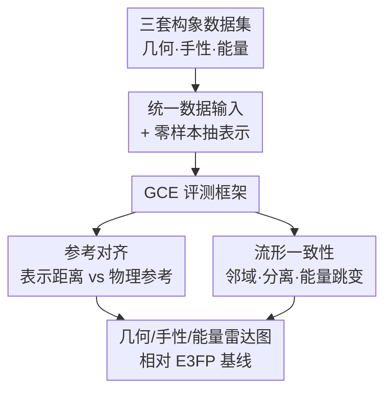

# 3DCS: Datasets and Benchmark for Evaluating Conformational Sensitivity in Molecular Representations

**会议**: ICLR2026  
**OpenReview**: [https://openreview.net/forum?id=JAb0y8lkqL](https://openreview.net/forum?id=JAb0y8lkqL)  
**代码**: https://github.com/ComDec/3DCS  
**领域**: 计算生物 / 分子表示 / Benchmark  
**关键词**: 分子表示、构象敏感性、手性、势能面、零样本评测

## 一句话总结
作者构建了首个专测「同一分子不同构象」表示敏感性的基准 3DCS：用 >1M 分子、~10M 构象覆盖几何/手性/能量三个维度，配一套 Geometry–Chirality–Energy（GCE）评测框架，揭示现代 3D 分子表示模型几何很敏感、但手性时好时坏、能量几乎对不上。

## 研究背景与动机
**领域现状**：药物设计、反应预测、材料发现都高度依赖分子的 3D 构象——配体能不能和蛋白口袋紧密结合、分子有什么量子性质，本质都由原子在空间里的摆放决定。于是分子表示（Molecular Representation, MR）从早期的 1D SMILES、2D 图，逐步走向直接编码原子坐标的 3D 模型（UniMol、MolAE）、基于球谐基的力场模型（GemNet、MACE）以及体素场模型（FMG），在各类性质预测榜上不断刷新 SOTA。

**现有痛点**：模型越做越强，却没有一个基准能回答「这些表示到底有没有把 3D 构象信息编进去」。现有分子基准（MoleculeNet、Molecule3D、MARCEL、GEOM）几乎都把分子当成**静态实体**，评测任务是跨分子的性质回归或分类——作者称之为 **inter-molecular（分子间）任务**。它们利用了构象信息，却从不检验「表示能否区分**同一个分子**的不同构象」。

**核心矛盾**：真实应用恰恰是 **intra-molecular（分子内）构象敏感**的——同一分子的不同构象与蛋白结合的亲和力可能天差地别，量子性质也各异；一对对映异构体（enantiomer，镜像手性分子）生物活性可能完全相反。如果表示把这些差异「压扁」成几乎相同的向量，下游任务再强也救不回来。这层敏感性，现有基准从未系统量化过。

**本文目标**：把评测焦点从「分子间」搬到「分子内构象」，并拆成三个可分别测量的子问题——表示能否（i）保留几何变化、（ii）捕捉手性、（iii）对齐能量面。

**切入角度**：与其新造一个端到端预测任务，不如直接在表示空间里测「表示距离」和「物理参考距离」对不对得上。给定同一分子的一堆构象，逐对算表示距离 $\Delta_{ij}$，再分别拿 RMSD、手性签名、能量差当参考，看两者排序是否一致、流形是否连贯。

**核心 idea**：用「表示距离 vs 物理参考距离」的对齐度 + 流形一致性，把 3D 分子表示拆成几何/手性/能量三条雷达轴打分，从而第一次让「这个模型弱在哪」一目了然。

## 方法详解

### 整体框架
3DCS 不是一个模型，而是「三套数据集 + 一套零样本评测框架」。整条流水线分四步：① 把三类构象数据统一成标准输入；② 选一个待测表示模型，对每个构象抽取**零样本**表示向量（不微调，直接拿预训练编码器输出）；③ 把表示喂进 GCE 评测管线，逐对算表示距离并与物理参考对齐；④ 输出每个维度的指标，画成一张以 E3FP 为基线的相对提升雷达图。

三套数据集各自盯住一个维度：**几何**用 Relaxed Scan 数据集（~150 万分子、~1009 万构象，绕环间单键做松弛二面角扫描）；**手性**用 ChEMBL 筛出的手性药物候选数据集（4057 个分子、52391 个构象，构造对映异构体对）；**能量**用 Revised MD17 的 AIMD 轨迹（10 个小分子、各 10 万构象，带 DFT 级能量与力）。GCE 框架本身又分两层：**Reference Alignment（参考对齐）** 测表示距离与物理量排序一致性，**Manifold Consistency（流形一致性）** 测表示空间结构是否连贯。

### 关键设计

**1. 三套构象数据集：把抽象的「构象敏感」落成可测的几何/手性/能量**

痛点是现有基准没有「同分子多构象」的高质量标注数据，三个维度都缺。作者分别造数据：**几何**走四步——先把杂环单元拼成多样骨架，再随机挂两套取代基库得到 1,559,779 个分子，然后对每个分子绕环间单键以 $2.5^\circ$ 步长做松弛二面角扫描（用 xTB 在最佳粗精度下优化几何并记录单点能），最后用 DBSCAN（eps=0.5）去冗余，得到 10,097,643 个带二面角和能量标注的构象。选 xTB 而非 DFT 是为了在 ~1000 万构象规模下平衡精度与算力——文中引系统性研究称 GFN-xTB 复现 DFT 优化几何的重原子 RMSD 与键角统计 $R^2 \ge 0.99$。**手性**从 ChEMBL 筛带立体中心标注的类药分子，对每个立体异构体用 xTB 优化，只保留优化后仍通过 R/S 一致性校验的对；再施加小幅扭转扰动让不同对映体的构象在几何空间**重叠**（防止模型靠粗几何差异而非真手性来分离），扰动并重新优化后重算每个立体中心的 R/S、丢掉构型改变的，最终得 52,391 个严格保手性的构象。**能量**直接采用 Revised MD17 的 AIMD 轨迹，带 DFT 级能量与力，专测表示与势能面（PES）一致性。

**2. GCE 第一层 — 参考对齐：表示距离要和物理量排序一致**

只有数据不够，得定义「对齐」。对同一分子的构象集 $C=\{c_1,\dots,c_n\}$，逐对算表示距离 $\Delta_{ij}$（学习表示用余弦距离，二进制指纹用 Tanimoto 距离），再与三个物理参考比：几何参考是最优对齐后的原子位置均方根偏差 $D^{(G)}_{ij}=\mathrm{RMSD}(c_i,c_j)$（单位 Å）；手性参考是失配立体中心的比例，对有 $m$ 个立体中心、签名 $\chi(c_i)=(s_1,\dots,s_m)\in\{\pm1\}^m$ 的分子，$D^{(C)}_{ij}=\frac{1}{m}\sum_{t=1}^{m}\mathbb{1}[s_t(c_i)\ne s_t(c_j)]$；能量参考是势能差 $D^{(E)}_{ij}=|E(c_i)-E(c_j)|$。对齐程度用 Spearman/Kendall 秩相关、RBF 核 CKA、保序回归 $R^2$（单调保真度）多角度量化。高相关 = 表示距离尊重物理参考。这层的价值是把「敏感性」变成无需训练、模型无关的可比数字，手工描述符和学习表示能放同一张表里。

**3. GCE 第二层 — 流形一致性：不只看逐对距离，还看表示空间的全局结构**

逐对对齐没法说明表示空间整体是否「连贯」，所以加第二层。针对几何：**Local Isometry Error（LIE）** 比对每个构象在 $D^{(G)}$ 和 $\Delta$ 下的邻域、算归一化距离 RMSD，越低说明局部几何邻域保得越好；还测**扭转平滑度 AS**（每度二面角旋转引起的表示变化中位数），适中的 AS 表示「既响应又稳定」。针对手性：用**对映体分离 AUC（ES–AUC）**、最近邻准确率（NN@1）、轮廓系数（SCI）以及无标签的 Hopkins 统计量来量化「能不能把对映体分成两簇」。针对能量：**能量跳变敏感度（EJS）** 测「大能量差是否对应大表示分离」的条件概率，再配阈值平滑度（只看能量显著跳变的片段）和表示距离/能量差分布之间的 KS 距离。这层让基准能区分「逐对相关高但流形乱」和「真正结构连贯」的表示。

**4. 零样本 + 微调双协议：既测预训练表示，又验证指标的下游预测力**

主评测是**零样本**——直接拿预训练编码器的输出向量评，不动权重，这样测的是表示「天生」编了什么。但只测零样本会被质疑「微调一下不就好了」，所以作者补两组监督实验：手性上用 Murcko 骨架划分（8:1:1）做监督对比学习，逼同一立体异构体的构象抱团、不同异构体推开；能量上在 RMD17 给每个编码器接小 MLP 头预测能量。关键发现不是「微调能涨点」，而是**指标的预测力**——3DCS 能量分高的模型（MACE、GemNet）微调后能量 MAE 也更低，且 3DCS 诱导的方法排序与下游排序一致。这说明 3DCS 的指标不只是诊断性的，还能预测「这个表示学能量的难度」。

## 实验关键数据

评测涵盖手工指纹 E3FP、坐标型 3D 编码器（UniMol、MolAE）、球谐力场模型（GemNet、MACE）、多模态模型（MolSpectra，融合光谱）和场型编码器（FMG，体素 + PCA 对齐、专门为手性设计）。

### 几何维度（主结果）
几乎所有学习表示都碾压手工指纹，且**直接用坐标的模型反超用球谐的 GemNet**——作者推测球谐由相对距离组成，用 RMSD 当参考时必然丢掉部分绝对几何信息。

| 指标 | E3FP | GemNet | MolAE | MolSpectra | UniMol |
|------|------|--------|-------|------------|--------|
| Spearman (↑) | 0.406 | 0.560 | 0.640 | 0.682 | **0.697** |
| Kendall (↑) | 0.272 | 0.336 | 0.483 | 0.506 | **0.563** |
| CKA (↑) | 0.757 | 0.813 | 0.862 | **0.904** | 0.889 |
| Isotonic $R^2$ (↑) | 0.521 | 0.667 | 0.734 | 0.770 | **0.782** |
| AS | 2.757 | 0.0018 | 0.0048 | 0.0214 | 0.006 |

AS 这一行很说明问题：指纹高达 2.757，因为它把子结构存/不存编成二进制，微小二面角变化就翻多个 bit，造成「构象只动一点、距离却暴涨」；学习表示把变化平滑摊开，AS 小得多。

### 手性维度
秩相关指标下几乎所有模型都差（因为手性参考本身是离散的，强求「失配越多距离越远」没意义），所以只看分离能力。MolAE 零样本最好——它和 UniMol 同是 SE(3)-不变框架，差别在目标：UniMol 去噪重建坐标，随机扰动容易诱发手性翻转、把训练信号搞反（把 R 构象映回 S）；MolAE 用 3D cloze（遮住含立体中心在内的部分原子再重建），天然逼模型抓住立体中心附近的细微差异。场型 FMG 虽未在大数据集预训练，ES–AUC 却追平甚至超过 MolAE。

| 指标 | E3FP | GemNet | MolAE | MolSpectra | UniMol | FMG | MACE |
|------|------|--------|-------|------------|--------|-----|------|
| ES–AUC (↑) | 0.486 | 0.577 | **0.782** | 0.545 | 0.622 | 0.706 | 0.485 |
| NN@1–Acc (↑) | 0.178 | 0.292 | **0.497** | 0.235 | 0.339 | 0.412 | 0.199 |
| SCIunsup* (↑) | 0.033 | 0.272 | 0.247 | 0.127 | 0.152 | **0.509** | 0.369 |

监督对比微调后所有模型手性指标都涨，但排序基本不变；FMG 微调后 ES–AUC 逼近 **0.999**，印证「手性感知架构」确实能吃透这个基准。

### 能量维度
对绝大多数模型，表示距离与能量差的相关性远弱于与几何距离的相关性——表示普遍编了几何、却几乎不编能量，除非训练时显式喂了能量/力。GemNet、MACE 是例外（球谐输入 + 能量/力监督），在能量跳变检测上明显领先。

| 指标 | E3FP | GemNet | MolAE | MolSpectra | UniMol | FMG | MACE |
|------|------|--------|-------|------------|--------|-----|------|
| Spearman (↑) | 0.026 | 0.078 | 0.039 | 0.023 | 0.043 | 0.015 | **0.236** |
| EJS (↑) | 0.184 | 0.356 | 0.294 | 0.271 | 0.301 | 0.269 | **0.578** |
| EJS-ROCAUC (↑) | 0.531 | 0.592 | 0.545 | 0.526 | 0.549 | 0.517 | **0.764** |

### 关键发现
- **几何强、手性飘、能量弱**是现代 3D 分子表示的普遍画像：零样本下对映体分离一律偏弱，因为多数模型预训练没有显式立体化学监督，坐标去噪还会反向鼓励翻手性的映射。
- **训练目标决定手性**：同框架的 MolAE 远超 UniMol，差别全在「cloze 重建 vs 坐标去噪」，说明任务设计比架构更关键。
- **3DCS 能量分能预测下游难度**：3DCS 能量分高的模型微调后 RMD17 能量 MAE 更低，指标不是纯诊断而是有下游预测力。
- **附带惊喜**：对学习表示做 PCA 取前两主成分当集体变量，常能还原出势能面的能垒和极小值，暗示这些表示或可用于分析过渡态和反应路径。

## 亮点与洞察
- **把「表示敏感性」做成无需训练、模型无关的可比基准**：用「表示距离 vs 物理参考」的对齐 + 流形一致性，让手工指纹和深度模型放同一把尺子上量，绕开了「再造一个预测任务」的循环论证。
- **三轴雷达图的诊断价值**：把新模型往几何–手性–能量雷达上一放，立刻知道它弱在几何平滑、对映体分离还是能量对齐，直接指向该投精力的方向，这种「可解释的失败定位」比单一榜单分数有用得多。
- **手性数据构造的巧思**：故意施加扭转扰动让不同对映体在几何空间重叠，逼模型只能靠真手性而非粗几何差异来分离——这个「反作弊」设计可迁移到任何需要把混淆因素剥离的基准构造。
- **AS 指标揭示指纹的脆弱本质**：二进制指纹一动就翻多 bit，量化出「为什么稀疏指纹对连续构象变化不友好」，这个视角对设计连续可微的分子表示有启发。

## 局限与展望
- **作者承认**：本工作只关注无条件、配体侧的构象能力；蛋白–配体对接、构象姿态预测、手性敏感的性质预测等**条件设定**是自然的下一步。
- 几何参考用 RMSD，对球谐类模型不利（球谐丢绝对几何信息），单一参考可能低估这类模型——能量维度上它们反而最强，说明「弱」是相对参考而言的，结论需带 caveat。
- 几何数据集用 xTB 而非全 DFT 优化，虽引文献称 $R^2\ge0.99$，但 ~1000 万构象的能量标注精度仍受半经验方法约束，可能影响能量维度的绝对结论。
- **改进方向（作者给的设计建议）**：（i）几何目标超越纯笛卡尔坐标恢复、纳入键角和扭转；（ii）数据构造和损失显式考虑立体化学完整性，用保手性增强 + 对映体感知目标；（iii）用球谐基替代裸坐标以减冗余、更兼容能量特征。

## 相关工作与启发
- **vs MoleculeNet / Molecule3D / MARCEL / GEOM**：这些都聚焦**分子间**任务（跨分子性质回归/分类、从 2D 图预测几何、构象集合提升性质预测），不检验「同一分子不同构象能否被区分」。3DCS 把焦点显式搬到**分子内构象敏感性**，补的是它们都没测的那块。
- **vs E3FP 等手工指纹**：指纹可解释、是强基线，但稀疏二进制本质让它对全局几何和能量不敏感（AS 暴涨即证据）。3DCS 用它当雷达图的相对基线。
- **vs 坐标型（UniMol/MolAE）与球谐型（GemNet/MACE）**：3DCS 揭示二者各有所长——坐标型几何更准、球谐型能量更准，没有全面赢家，进一步坐实「几何/手性/能量需联合考量」的结论。
- **vs FMG**：FMG 牺牲精确旋转不变性换来对反射（手性）的敏感，是论文里手性的最强基线，证明「想做对手性，架构得为手性留口子」。

## 评分
- 新颖性: ⭐⭐⭐⭐⭐ 首个专测分子内构象敏感性的基准，把抽象的「敏感性」拆成可测的几何/手性/能量三轴。
- 实验充分度: ⭐⭐⭐⭐⭐ 三套百万级数据 + 7 类代表性模型 + 零样本与微调双协议，结论自洽且有下游验证。
- 写作质量: ⭐⭐⭐⭐ 框架清晰、动机扎实；指标繁多需对照附录，主文略密。
- 价值: ⭐⭐⭐⭐⭐ 数据与代码全开源，雷达图诊断范式对设计下一代物理忠实的 3D 分子表示有直接指导意义。

<!-- RELATED:START -->

## 相关论文

- [\[ICLR 2026\] CAPSUL: A Comprehensive Human Protein Benchmark for Subcellular Localization](capsul_a_comprehensive_human_protein_benchmark_for_subcellular_localization.md)
- [\[NeurIPS 2025\] JAMUN: Bridging Smoothed Molecular Dynamics and Score-Based Learning for Conformational Ensembles](../../NeurIPS2025/computational_biology/jamun_bridging_smoothed_molecular_dynamics_and_score-based_learning_for_conforma.md)
- [\[ICLR 2026\] GeomMotif: A Benchmark for Arbitrary Geometric Preservation in Protein Generation](geommotif_a_benchmark_for_arbitrary_geometric_preservation_in_protein_generation.md)
- [\[ICLR 2026\] Towards Understanding the Shape of Representations in Protein Language Models](towards_understanding_the_shape_of_representations_in_protein_language_models.md)
- [\[ICLR 2026\] Learning Molecular Chirality via Chiral Determinant Kernels](learning_molecular_chirality_via_chiral_determinant_kernels.md)

<!-- RELATED:END -->
