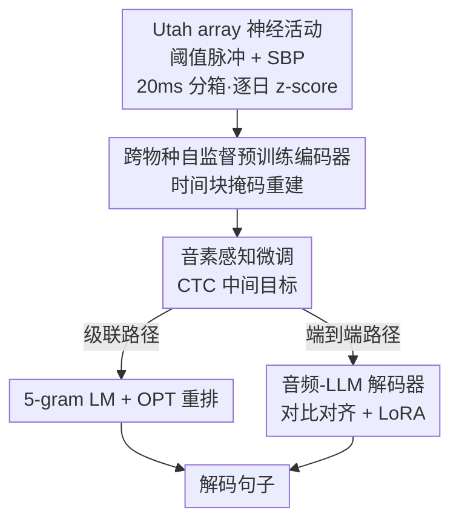

# A Cross-Species Neural Foundation Model for End-to-End Speech Decoding

**会议**: ICLR 2026  
**OpenReview**: [https://openreview.net/forum?id=Lp1noMpMUG](https://openreview.net/forum?id=Lp1noMpMUG)  
**领域**: 计算神经科学 / 脑机接口 / 多模态对齐  
**关键词**: 语音脑机接口, 神经基础模型, 跨物种预训练, 端到端解码, 音频大模型

## 一句话总结
本文提出 BIT，一个把皮层神经活动直接翻译成完整句子的端到端脑机接口：先用跨物种（人+猴）、跨任务的自监督掩码预训练得到一个 Transformer 神经编码器，再把它接到音频大模型上做对比对齐微调，把先前端到端方法的词错误率（WER）从 24.69% 压到 10.22%，同时在级联框架下刷新 Brain-to-Text '24/'25 榜单 SOTA。

## 研究背景与动机
**领域现状**：语音脑机接口（speech BCI）的目标是把瘫痪患者的神经活动翻译成文字，恢复其交流能力。当前主流系统几乎都是**级联框架**：先用 RNN 把神经活动映射成音素（phoneme），再用一个 n-gram 语言模型把音素拼成句子。

**现有痛点**：级联框架最大的问题是**各阶段无法联合优化**。RNN 和语言模型分开训练，导致两者性能脱节——RNN 的音素错误率（PER）降低，并不总能换来整体 WER 的降低。这种"局部最优不等于全局最优"的割裂，限制了系统上限。已有的端到端尝试（Feng et al. 2024）把 RNN 直接接到文本 LLM 上，但用的还是老旧的 RNN 编码器、没有预训练，性能远落后于级联方法（WER 24.69%）。

**核心矛盾**：Transformer 这类现代架构理论上更能捕捉复杂神经表征，但 Transformer 需要大数据才能发挥威力，而单个被试的有标注语音 BCI 数据极其稀缺（一个被试一万来句）。如何在"想用强架构"和"数据不够"之间破局，是端到端语音解码的关键瓶颈。

**本文目标**：构建一个真正可微、端到端可优化的语音解码框架，既要在级联设定下刷新 SOTA，又要把端到端 WER 大幅拉近级联水平。

**切入角度**：作者的关键观察是——神经探针（Utah array）的记录在不同被试、不同任务（说话 vs 伸手）之间共享底层结构。因此可以用大规模、跨物种、跨任务的**无标注**神经数据做自监督预训练，给数据稀缺的语音解码任务提供稳定、可迁移的表征底座。类比 LLaVA 给 LLM 装上"眼睛"（图像编码器），BIT 给 LLM 装上一个"大脑"。

**核心 idea**：用跨物种自监督预训练的 Transformer 神经编码器替代未预训练的 RNN，再借对比学习把神经表征对齐到音频 LLM 的语言空间，实现从神经活动到句子的端到端可微解码。

## 方法详解

### 整体框架
BIT 把"神经活动 → 句子"拆成一条三段式可微管线，并在编码器和解码器之间用对比学习做模态对齐。输入是 Utah array 采到的皮层神经活动（阈值化脉冲计数 + 脉冲频带功率 SBP，20ms 分箱、逐日 z-score 归一化以对抗探针漂移），输出是完整英文句子。

整条流程分三步训练：**①** 先用自监督掩码建模在 367 小时（人 ~98h + 猴 ~269h）跨物种、跨任务 Utah array 数据上预训练 Transformer 神经编码器；**②** 去掉掩码模块，用 CTC 损失把编码器微调成音素解码器，给表征注入语音学信息；**③** 把这个"懂音素"的编码器经浅层 MLP projector 接到音频 LLM，用交叉熵 + 对比损失端到端微调，直接自回归生成句子。微调时只更新神经编码器、projector，并对 LLM 注意力/前馈层加 LoRA，其余冻结。最终解码器有两条可选路径：级联（音素 logits → 5-gram LM → OPT 重排）或端到端（神经表征 → 音频 LLM）。

### 关键设计

**1. 跨物种、跨任务自监督掩码预训练：用别的脑、别的任务的数据喂饱数据饥饿的 Transformer**

这一设计直击"想用 Transformer 但单被试语音数据太少"的核心矛盾。作者把神经活动按 $T_{patch}$ 个时间箱打包成"时间块"（time patch），形状从 $(T, C)$ 变成 $(T/T_{patch}, C \times T_{patch})$，再经 patch embedding（LayerNorm-Linear-LayerNorm）送入带 RoPE 相对位置编码、双向注意力的 Transformer。用时间块而非单个 20ms 箱，是为了让神经记录的细时间分辨率对齐语音产生的慢节奏（30–60 词/分钟），同时缩短上下文长度、减少喂给 LLM 时的冗余。

预训练借鉴掩码自编码器（MAE）：随机把一部分时间块替换成可学习的 mask token（掩码段可变长、整体掩码率恒定），再通过"反向 patch embedding"把潜表征投回原始维度，用 MSE 重建被掩码的神经活动（因为脉冲计数和 SBP 都已归一化）。关键在于预训练语料**只用人和猴的 Utah array 数据**，跨越说话、伸手等不同任务和被试。这样编码器学到的是对电极位置、被试、行为任务都鲁棒的稳定探针表征，掩码本身又作为数据增强缓解过拟合和探针漂移。每个被试用独立的线性 read-in/read-out 层接入共享 Transformer，从而兼容不同电极数（128 vs 256）。

**2. 音素感知微调：把 CTC 当"中间目标"而非最终输出，给神经表征灌入语音学结构**

端到端模型最容易踩的坑是：神经编码器输出的表征和 LLM 的语言空间各说各话，对齐困难。作者的解法是先做一轮音素解码微调——去掉掩码模块（预训练的数据增强已经把过拟合压住了），在编码器输出上接一个线性层，对音素类别 + blank token + silence token 出 logits，用 CTC 损失（Graves et al. 2006）训练。

巧妙之处在于：在端到端模型里，这些音素 logits **并不会真的喂给 LLM**；它们只是作为中间监督目标，把音素级的语音学信息"烤"进神经表征里。也就是说，即便最终目标是直接预测句子，先让编码器学会"分辨音素"，能让它的输出天然携带 LLM 能听懂的语音结构，从而更好地引导后续的句子生成。这一步是连接"原始神经信号"和"语言模型"的关键桥梁。

**3. 端到端音频-LLM 解码器 + 对比跨模态对齐：给 LLM 装一个"大脑"，并把神经/文本嵌入拉到同一语义空间**

最后一步把音素感知编码器的输出经浅层 MLP projector（Linear-ReLU-Linear）映射进音频 LLM 的文本嵌入空间，并在神经嵌入和文本嵌入之间插入提示词"decode the above neural activity into an English sentence:"引导解码。训练时模型接收神经嵌入 + 提示/目标句子的文本嵌入，做 next-token 预测；推理时只凭神经嵌入和提示自回归生成。

为强化对齐，作者额外加了一个**模态对齐器（modality aligner）**：用各自的线性层把 mean-pooled 的神经"模态 token"和文本"模态 token"投到共享潜空间、做 L2 归一化，再用对比损失——同一 trial、同一句子的神经-文本嵌入为正样本，batch 内其余为负样本——把匹配嵌入拉近、不匹配嵌入推远。总损失 = 交叉熵 + 对比损失。一个反直觉但关键的发现是：**音频 LLM 显著优于同规模文本 LLM**（最佳为 Aero1-Audio 1.5B，即 Qwen2.5-1.5B 的音频扩展版），因为音频预训练赋予了更接近神经解码问题的归纳偏置，让浅层 MLP 就能对齐模态；且小模型（1–1.5B）反而比大模型（>7B）效果好，因为语音 BCI 任务只需英文翻译、不需高级推理。

### 损失函数 / 训练策略
三阶段目标依次为：① 预训练用 MSE 重建掩码神经活动；② 音素微调用 CTC 损失；③ 句子微调用交叉熵（对 ground-truth 句子做 next-token 预测）+ 对比损失（神经-文本模态对齐），两者相加。第三阶段只更新神经编码器、projector，并对音频 LLM 注意力/前馈层（以及音频路径的多模态 projector）施加 LoRA，其余参数冻结，从而在标注数据稀缺下高效微调。

## 实验关键数据

### 主实验
在 Brain-to-Text '24（T12，holdout 1200 句）和 '25（T15，holdout 1450 句）官方竞赛榜上评测，同框架内（级联 vs 端到端）对比保证公平。

| 数据集 | 方法 | WER | 说明 |
|--------|------|-----|------|
| BT '24 | Feng et al. 2024（先前端到端） | 24.69% | 端到端基线 |
| BT '24 | BIT 端到端 | 15.67% | 单模型 |
| BT '24 | BIT 端到端 + Ensemble | 10.22% | 端到端 SOTA，相对降 >50% |
| BT '24 | Feghhi et al. 2025（先前级联 SOTA） | 7.98% | 级联基线 |
| BT '24 | BIT 级联 | 6.35% | 非集成级联 SOTA |
| BT '24 | BIT 级联 + Ensemble | 5.10% | 榜单第一（先前最佳 5.68%） |
| BT '25 | BIT 端到端 + Ensemble | 7.76% | 公开榜领先 |
| BT '25 | BIT 级联 + Ensemble | 1.76% | 公开榜第一 |

端到端方向上，BIT 把 Feng et al. 2024 的 24.69% 一路压到 10.22%（相对下降逾 50%），大幅缩小端到端与级联之间长期存在的差距；级联方向上则在两个 benchmark 上同时夺冠。

### 消融实验
| 配置维度 | 关键发现 | 说明 |
|----------|---------|------|
| LLM 模态 | 音频 LLM > 文本 LLM | 同规模下音频预训练偏置更贴近神经解码，Aero1-Audio 1.5B 最佳 |
| 模型规模 | 小模型（1–1.5B）> 大模型（>7B） | 标注稀缺时，语音 BCI 只需翻译不需推理 |
| 神经嵌入处理方式 | 当作"神经模态" > 当作"音频模态" | 无需强行解释为音频，但仍受益于 LLM 的语音知识 |
| 对比学习 | 加对比对齐进一步降 WER | 模态对齐有效 |
| SSL 预训练（想象语音） | BIT-Human/All 比 BIT-TFS 低 39–45% WER | 低数据任务受益最大 |

### 关键发现
- **预训练在低数据任务上收益最大**：想象语音（imagined speech，50 词词表、标注极少）上，SSL 预训练带来 39–45% 的相对 WER 降低，远大于在数据较多的 attempted speech 上的收益。
- **自监督跨被试 > 监督跨任务**：BIT-All（人+猴无标注 SSL 预训练）超过 BIT-Cross-Task-Only（同被试、跨任务有监督预训练），说明无标注大规模 SSL 的迁移增益更大。
- **表征几何更"像语言"**：RSA 分析显示预训练编码器输出比 RNN/从头训 Transformer 更接近音频 LLM 的文本嵌入结构；PCA/LDA 可视化表明 BIT 把 attempted 与 imagined 语音嵌入对齐到同一语义空间（原始神经活动线性可分，对齐后不可分），实现跨任务泛化。
- **人类数据比跨物种更有用**：消融发现人类数据增益大于猴数据，因为人类语料含更多与语音相关的任务，而猴的伸手数据相关性较弱——跨物种迁移有用但非主力。

## 亮点与洞察
- **"给 LLM 装一个大脑"的类比落地**：把 LLaVA"图像编码器当眼睛"的范式迁移到 BCI——神经编码器当"脑"，音频 LLM 当语言中枢，是一个干净且可推广的多模态对齐思路。
- **音频 LLM 胜过文本 LLM 的发现很反直觉也很有用**：神经活动并非音频，却因为音频预训练的归纳偏置而更易对齐，提示"选对预训练模态比堆参数更重要"。
- **CTC 当中间目标而非最终输出**：用音素监督给表征"灌"语音结构、但不把音素 logits 喂给 LLM，是缝合"信号编码器"与"语言模型"的巧妙桥接，可迁移到其他"传感器信号 → 文本"任务。
- **小模型在标注稀缺场景反而更优**：挑战了"越大越好"的惯性，对资源受限、需要 on-device 部署的 BCI 尤其重要。

## 局限与展望
- **实时性不足**：端到端解码平均每句约 0.95 秒，慢于级联的 0.24 秒，对实时 BCI 仍不够快。
- **双向注意力 + 大模型不利于在线解码**：编码器用双向注意力换性能，无法在线流式；改成因果注意力可行但会掉点。1.5B 音频 LLM 已算紧凑，更大模型无法 on-device。
- **数据依赖重**：编码器需要大量无标注数据对抗传感器变异，LLM 需要大量标注数据才能超过级联，但私有人类数据获取受限。
- **跨物种迁移收益有限**：猴的伸手数据与语音相关性弱，主力增益来自人类数据，跨物种本身贡献偏辅助。
- **隐私/安全风险**：解码"内心语音"必须有明确知情同意和可靠防护机制。

## 相关工作与启发
- **vs Feng et al. 2024（先前端到端）**：他们用未预训练的 RNN 接文本 LLM，WER 24.69%；本文用跨物种 SSL 预训练 Transformer 接音频 LLM + 对比对齐，压到 10.22%，核心差异在"现代架构 + 大规模预训练 + 音频模态对齐"。
- **vs Feghhi et al. 2025（先前级联 SOTA）**：他们引入 Transformer + 时间掩码解码音素但无端到端 LLM、无大规模预训练；本文级联设定下用同样的预训练编码器把 SOTA 从 7.98% 推到 6.35%（集成后 5.10% vs 5.68%）。
- **vs LLaVA / BLIP 等 VLM 对齐路线**：从 cross-attention → Q-former → 简单 projection 的演进表明 LLM 越强、模态对齐越省算力；本文验证了这一趋势同样适用于语音神经信号，浅层 MLP + 对比学习即可对齐。
- **vs POSSM（脉冲数据跨物种迁移）**：POSSM 验证猴→人想象手写的跨物种迁移；本文把跨物种、跨任务 SSL 预训练推广到人类语音解码。

## 评分
- 新颖性: ⭐⭐⭐⭐⭐ 首个把跨物种神经基础模型 + 音频 LLM 端到端缝合用于语音 BCI，并刷新榜单
- 实验充分度: ⭐⭐⭐⭐⭐ 两个竞赛 benchmark + attempted/imagined 双任务 + LLM 模态/规模/对齐多维消融 + RSA/PCA 可解释性
- 写作质量: ⭐⭐⭐⭐ 动机清晰、类比生动，部分实验细节散落附录
- 价值: ⭐⭐⭐⭐⭐ 把端到端语音 BCI 的 WER 拉近级联水平，为大规模神经数据整合铺路，临床意义重大

<!-- RELATED:START -->

## 相关论文

- [\[ICLR 2026\] Optimal Transport Unlocks End-to-End Learning for Single-Molecule Localization](optimal_transport_unlocks_end-to-end_learning_for_single-molecule_localization.md)
- [\[ICCV 2025\] MolParser: End-to-end Visual Recognition of Molecule Structures in the Wild](../../ICCV2025/computational_biology/molparser_end-to-end_visual_recognition_of_molecule_structures_in_the_wild.md)
- [\[NeurIPS 2025\] UniSite: The First Cross-Structure Dataset and Learning Framework for End-to-End Ligand Binding Site Detection](../../NeurIPS2025/computational_biology/unisite_the_first_cross-structure_dataset_and_learning_framework_for_end-to-end_.md)
- [\[ICML 2025\] Protriever: End-to-End Differentiable Protein Homology Search for Fitness Prediction](../../ICML2025/computational_biology/protriever_end-to-end_differentiable_protein_homology_search_for_fitness_predict.md)
- [\[ICLR 2026\] Continuous Multinomial Logistic Regression for Neural Decoding](continuous_multinomial_logistic_regression_for_neural_decoding.md)

<!-- RELATED:END -->
