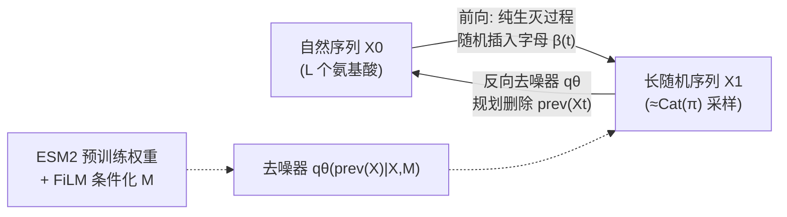

# A Diffusion Model to Shrink Proteins While Maintaining Their Function

**会议**: ICLR 2026  
**OpenReview**: [https://openreview.net/forum?id=quxeCxJwKm](https://openreview.net/forum?id=quxeCxJwKm)  
**代码**: 待确认  
**领域**: 计算生物学 / 蛋白质生成 / 离散扩散模型  
**关键词**: 蛋白质工程, 离散扩散, 序列删除, 进化序列建模, ESM2, ProteinGym  

## 一句话总结
提出 SCISOR——一个只学"删字母"的离散扩散模型：用纯生灭过程（随机插入）做前向加噪，训练去噪器反向规划删除，从而把长蛋白序列缩短成既"自然"又保功能的短序列，在 ProteinGym 删除效应预测上达到 SOTA。

## 研究背景与动机
**领域现状**：许多有医学/生物工程价值的蛋白因为序列太长，难以在实验室合成、难以与其他蛋白融合、也难以递送到组织。理想做法是用在海量自然序列上训练的大模型（ESM2、ProGen2、Tranception 等）学习"进化施加的约束"，从而提出既缩短又不破坏功能的短序列。

**现有痛点**：(1) 自回归/BERT 式大模型无法在 $\binom{L}{M}$ 这个组合爆炸的删除空间里高效搜索；(2) 它们没有针对"删除"这个任务的归纳偏置，不是显式训练来预测删除效应的；(3) 扩散模型（EvoDiff、DPLM）虽擅长规划一连串突变，但现有离散扩散框架只能做**替换**突变，根本生成不了删除。

**核心矛盾**："用扩散模型搜索删除空间"这条路最有希望，但扩散框架的前向噪声天然是替换/mask，而删除会改变序列长度（维度可变），缺一个能严格定义、能闭式求 ELBO、还能 scale 到 UniRef 规模的删除扩散框架。

**本文目标**：构造一个前向只做插入、反向只学删除的离散扩散模型，使去噪器天生具备"该删哪个字母"的归纳偏置，并能缩短真实长蛋白。

**核心 idea**（**反向噪声设计**）：既然要让模型学会删除，就让前向加噪过程**只插入随机字母**——把自然序列不断插入随机字母直到变成一条长随机序列；去噪器则反向地规划一系列删除，逐步回到形似自然蛋白的序列。

## 方法详解

### 整体框架
SCISOR（Sequence Contraction with InSertion-Only noising pRocess）把"缩短蛋白"重写成扩散模型的去噪问题：前向用**纯生灭过程**给自然序列随机插入字母（Sec 4.1），反向训练去噪器 $q_\theta$ 预测"上一步插入的是哪个字母"从而删除它（Sec 4.2），最后基于 ESM2 把模型 scale 到 UniRef 规模（Sec 4.3）。生成时从一条长随机序列出发，按 $q_\theta$ 迭代删除到目标长度。

### 关键设计

**1. 插入式前向过程 + 无需稳态分布的扩散：纯生灭过程让"删除"变成合法的去噪目标。** 前向噪声选用纯生灭过程（Kendall, 1948）：在 $L$ 个氨基酸序列的 $L+1$ 个空位上，每个位置以速率 $\beta(t)$ 独立长出一个新字母，插入字母从 $Y\sim\mathrm{Cat}(\pi)$ 采样，序列越长可插入的空位越多。作者证明 $X_t$ 可直接从 $X_0$ 一步采样（负二项分布决定插入总数 $M_t\sim\mathrm{NegBin}(L+1,\alpha(t))$，其中 $\alpha(t)=\exp(-\int_0^t\beta(s)ds)$），无需逐时刻模拟。关键难点是：标准扩散要求 $p(X_t|X_0)$ 收敛到一个易采样的稳态分布，但插入过程会让序列无限变长、根本不收敛。**Thm 4.1** 给出破局点：虽然不收敛，但当插入数 $M_1\to\infty$ 时 $X_1$ 可以被"每位独立从 $\mathrm{Cat}(\pi)$ 采样的长随机序列" $q$ 任意逼近——$\mathrm{KL}(p(X_1|X_0,M_1)\|q(X_1|L+M_1))\to 0$。这证明了**形式稳态分布并非定义扩散模型的必要条件**，从而第一次让"只学缩短"的扩散合法成立。

**2. Schedule-conditioned 闭式 ELBO：把去噪目标精确化为"删哪个字母"，并能条件化删除数 M。** 沿用 Amin et al. (2025) 的离散扩散框架，作者在 **Thm 4.2** 推出一个 schedule-conditioned 的负对数似然上界（即训练损失）：

$$-\log q_\theta(X_0|L)\le \mathbb{E}_{M_1}\mathrm{KL}\big(p(X_1|X_0,M_1)\|q(X_1|L+M_1)\big)+\mathbb{E}_{t,X_t,M_t}\frac{M_t\beta(t)}{1-\alpha(t)}\mathrm{KL}\big(p(\mathrm{prev}(X_t)|X_0,X_t,M_t)\|q_\theta(\mathrm{prev}(X_t)|X_t,M_t)\big)$$

第一项由 Thm 4.1 保证很小；第二项是真正训练去噪器的目标——$q_\theta$ 吃进噪声序列 $X_t$ 和它含有的插入数 $M_t$，去预测"最后被插入的那个字母"$\mathrm{prev}(X_t)$，等价于一个"该删哪个位置"的分布。相比经典离散扩散，这个损失更稳定，而且**显式条件化删除数 $M$**，让模型能为"未来还要删多少"提前规划。

**3. 通过序列比对做 Rao-Blackwell 化的目标分布：把对所有插入路径的积分变成可并行的对齐计数。** 第二项需要真值分布 $p(\mathrm{prev}(X_t)|X_0,X_t,M_t)$——即 $X_t$ 的哪个字母最可能是最后被插入的。难点是从 $X_0$ 到 $X_t$ 有多条插入路径，要对它们全部边缘化。**Prop 4.3** 给出优雅闭式：记 $\mathrm{ali}(X,Y)$ 为把 $X$ 对齐到 $Y$ 的方式数，被删字母为 $b$，则

$$p(\mathrm{prev}(X_t)|X_0,X_t,M_t)=\frac{\mathrm{ali}(X_0,\mathrm{prev}(X_t))}{M_t\cdot \mathrm{ali}(X_0,X_t)}$$

直觉是：与原序列 $X_0$ 对齐得越少的字母，越可能是后来插进去的（该删）。这相当于把梯度估计在所有插入路径上做了 Rao-Blackwell 化，方差更低；实践中用动态规划并行算出所有 $\mathrm{ali}(X_0,\mathrm{prev}(X_t))$。

**4. 复用 ESM2 + FiLM 条件化 + 长序列工程：让框架真正跑到 UniRef 规模。** 去噪器架构直接复用 BERT 式蛋白语言模型 ESM2 的预训练权重，替换最后一层为线性+softmax；为了条件化删除数 $M$，在注意力块之间插入 FiLM 层，对第 $\ell$ 层激活做仿射变换 $(1+A_{\theta,d}^\ell(M))\times a_d^\ell+B_{\theta,d}^\ell(M)$，其中 $A_\theta,B_\theta$ 是初始化为零的浅层全连接。工程上：(1) 速率函数 $\beta(t)$ 选得让 $X_t$ 与 $X_0$ 的互信息在 $t\in[0,1]$ 上近似线性下降；$\pi$ 取训练集氨基酸频率；(2) 因 $X_t$ 长度差异巨大，按长度排序后分小批+梯度累积以减少 padding 浪费；(3) 当 $|X_t|>2048$ 时随机取一个 2048 窗口并把模型预测按 $2048/|X_t|$ 重归一化、窗口外用均匀预测，保证 ELBO 仍是合法下界。生成时还可加 corrector 步（反复插入+删除）以逃离局部最优（Alg 2）。

## 实验关键数据

### 主实验：生成质量 + 删除效应预测
在 UniRef50 上对比扩散模型（EvoDiff、DPLM）与自回归参考（AR），测困惑度 Perplexity（越低越好）：

| 模型 | 规模 | Perplexity (↓) |
|------|------|----------------|
| Random | - | 18.03 |
| EvoDiff S | small | 14.61 |
| SCISOR S | small | 14.05 |
| DPLM M | 150M | 10.61 |
| EvoDiff L | large | 13.05 |
| **SCISOR L** | large | **12.19** |
| DPLM L | large | 9.15 |
| AR L（参考） | large | 10.41 |

SCISOR 在扩散模型中困惑度有竞争力，且样本质量（FPD 分布匹配、OmegaFold pLDDT 可折叠性）常优于同类扩散模型、逼近自回归参考——作者归因于 SCISOR 是连续时间模型。

ProteinGym 删除效应预测（62 个 assay、7000 条测量，Spearman 相关，越高越好）：

| 模型 | 单删除 (↑) | 多删除 (↑) |
|------|-----------|-----------|
| HMM | 0.45 | 0.45 |
| Tranception | 0.46 | 0.47 |
| ProGen2 | 0.51 | 0.47 |
| PoET（用 MSA） | 0.55 | 0.49 |
| **SCISOR** | **0.57** | **0.52** |

SCISOR 在单删除与多删除两个 benchmark 上均超过所有 baseline，甚至超过能访问蛋白家族额外信息的大模型 PoET。

### 缩短任务：保功能评估
取 200 条带结合位点/活性位点注释的 UniProt 序列，按 1%–50% 不同比例缩短，对比 ProGen2、Raygun：

| 指标 | SCISOR 表现 |
|------|-------------|
| pLDDT 结构置信度 (↑) | 各删除比例下持续最高 |
| TM-score 结构相似 (↑) | 优于 baseline |
| RMSD 结构偏差 (↓) | 优于 baseline |
| 功能位点保留富集 (↑) | 多数情况下最佳 |

仅在 50% 极端缩短时 ProGen2 功能位点保留更高，但其 pLDDT 偏低说明此时样本大概率已不可折叠（不具功能）。RalA（GTP 传感器）案例研究中，SCISOR 最好地保留了与 GTP 结合位点的预测结构。

### 消融实验

| 配置 | 关键发现 |
|------|----------|
| 去掉 Rao-Blackwell 化训练目标 | 性能明显下降，凸显 Prop 4.3 对齐积分目标是核心 |
| 连续时间 vs 离散时间 | 连续时间（SCISOR）样本质量更高 |
| corrector 步 K | 增大 K 提升样本质量但增加计算 |

### 关键发现
- 一个"只会删除"的扩散模型，居然能在生成质量上与"会替换"的成熟扩散模型平起平坐。
- 删除任务专属的归纳偏置，让小模型也能在删除效应预测上超过更大的通用模型。

## 亮点与洞察
- **把"缩短蛋白"重定义为扩散去噪**：核心创意是颠倒扩散的方向——前向插入、反向删除，让"删除"成为模型与生俱来的能力，而非事后启发式。
- **理论破除稳态分布迷思**：Thm 4.1 证明扩散不需要形式稳态分布，只需 $X_1$ 可被长随机序列逼近即可，这为"长度只减不增"的单向扩散打开了大门。
- **对齐 = 路径积分**：Prop 4.3 把"对所有插入路径边缘化"这个看似 intractable 的问题，转化为序列比对的方式计数，用动态规划并行求解，既闭式又低方差。
- **闭式 ELBO 带来可比性**：不同于多数插入/删除扩散（无闭式 ELBO），SCISOR 能做原则性的模型比较与困惑度评估。

## 局限与展望
- **分布偏移**：训练时 $X$ 是带噪插入的随机序列，推理缩短时 $X$ 是真实蛋白，二者分布不同，可能影响统计效率；作者建议未来用更"自然"的前向插入过程缓解，但难点在于既要保证 $p(X_1)$ 易逼近又要保留闭式路径积分。
- **"自然≠同功能"**：方法假设"形似自然序列 ⇒ likely 保功能"，但在功能多样的蛋白家族中不保证同功能；未来可引入显式的功能/结构 guidance。
- **多次模型评估开销**：缩短 $M$ 个位置需要 $M$ 次去噪器评估（Raygun 只需 1 次），corrector 步进一步增加成本。
- **依赖预测工具评估**：保功能性主要靠 OmegaFold/ESM2 等 in-silico 指标，缺少湿实验验证缩短后蛋白真实功能。

## 相关工作与启发
- **可变维度扩散**：TDDM（Campbell et al., 2023）、Patel et al. (2025) 用跳跃扩散处理维度变化、其前向是随机删除（学扩张）；Johnson et al. (2021)、Havasi et al. (2025) 用辅助 token 做插入/删除——SCISOR 与之相比专为"缩短"设计归纳偏置且有闭式 ELBO。
- **进化序列生成模型**：EvoDiff、DPLM（替换扩散）、ProGen2/Tranception（自回归）、ESM2（BERT 式）；SCISOR 复用 ESM2 权重并补上它们缺失的删除能力。
- **蛋白缩短**：Raygun（Devkota et al., 2024）用随机自编码器在任意长度上解码缩短，但无法强制短序列与原序列相似、也非专门训练缩短——SCISOR 在结构与功能保留上更优。
- **启发**：单向（只减不增）扩散 + 用对齐做路径积分的思路，可迁移到任何"维度单调变化"的离散生成问题（如代码压缩、文本摘要式删减、分子骨架精简）。

## 评分
- **新颖性**: ⭐⭐⭐⭐⭐ 首个"只学删除"的离散扩散框架，理论上破除稳态分布必要性、用对齐做路径积分，概念原创性强。
- **实验充分度**: ⭐⭐⭐⭐ 覆盖生成质量、ProteinGym 删除效应、缩短保功能三类任务，含消融与案例研究；略欠湿实验验证。
- **写作质量**: ⭐⭐⭐⭐ 动机清晰、定理与算法逐步推进、图示直观，理论部分较密集需一定背景。
- **价值**: ⭐⭐⭐⭐⭐ 直击蛋白工程"序列太长难合成/递送"的真实痛点，提供可 scale 的通用缩短工具，应用前景广。

<!-- RELATED:START -->

## 相关论文

- [\[ICLR 2026\] Pallatom-Ligand: an All-Atom Diffusion Model for Designing Ligand-Binding Proteins](pallatom-ligand_an_all-atom_diffusion_model_for_designing_ligand-binding_protein.md)
- [\[ICLR 2026\] SimpleFold: Folding Proteins is Simpler Than You Think](simplefold_folding_proteins_is_simpler_than_you_think.md)
- [\[ICLR 2026\] VenusX: Unlocking Fine-Grained Functional Understanding of Proteins](venusx_unlocking_fine-grained_functional_understanding_of_proteins.md)
- [\[ICLR 2026\] A Joint Diffusion Model with Pre-Trained Priors for RNA Sequence-Structure Co-Design](a_joint_diffusion_model_with_pre-trained_priors_for_rna_sequence-structure_co-de.md)
- [\[ICML 2026\] CountsDiff: A Diffusion Model on the Natural Numbers for Generation and Imputation of Count-Based Data](../../ICML2026/computational_biology/countsdiff_a_diffusion_model_on_the_natural_numbers_for_generation_and_imputatio.md)

<!-- RELATED:END -->
