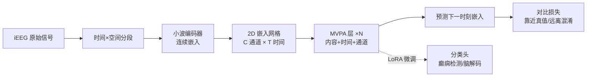

# A Foundation Model with Multi-Variate Parallel Attention to Generate Neuronal Activity

**会议**: ICLR 2026  
**OpenReview**: [https://openreview.net/forum?id=5M1YOW3bRq](https://openreview.net/forum?id=5M1YOW3bRq)  
**代码**: [https://github.com/IBM/multi-variate-parallel-transformer](https://github.com/IBM/multi-variate-parallel-transformer)  
**领域**: 计算神经科学 / 多变量时间序列基础模型  
**关键词**: iEEG, 脑电基础模型, 多变量注意力, 通道异质性, 癫痫检测, 生成式预训练  

## 一句话总结
本文提出多变量并行注意力（MVPA），把注意力解耦为内容、时间、通道三路并行分量，从而无视通道数量与排布的差异，并以此构建首个开源、开权重、开数据的颅内脑电（iEEG）基础模型 MVPFormer，在癫痫检测与脑活动解码上达到专家级 SOTA。

## 研究背景与动机
- **领域现状**：多变量时间序列（金融、传感器网络、临床记录）催生了对通用神经架构的需求，而颅内脑电（iEEG）是其中最难啃的一块——它能在毫秒级、神经元级别刻画大脑活动，是癫痫诊疗的金标准信号。
- **现有痛点**：每个病人的电极布局都是按临床需要量身定制的，**通道数量、空间位置、语义都因人而异**（channel heterogeneity）。vanilla attention 把 2D 时空信号拍扁成 1D 序列会丢掉空间结构；现有 iEEG 模型（Brant-2、BrainBERT）大多绑定固定通道数，必须做病人专属适配，跨被试几乎不能泛化。
- **核心矛盾**：要同时做到「通道无关（不依赖固定通道位置）」与「不牺牲时空局部性和泛化能力」——既要灵活地吞下任意通道配置，又要在注意力这一最底层计算单元上把时间与空间的交互建模清楚。
- **本文目标**：设计一种能原生处理异质多通道时间序列的注意力机制，并据此训练一个能跨被试零样本泛化、在临床任务上达到专家水平的 iEEG 基础模型，同时开放数据、代码、权重以推动社区。
- **核心 idea**：**【解耦注意力】** 不再用全局位置编码或拍扁，而是把注意力拆成内容、时间、通道三个相对编码的并行分量；**【生成式预训练】** 在连续嵌入空间用对比损失预测未来脑信号，让模型先学会"生成神经活动"，再微调到下游判别任务。

## 方法详解

### 整体框架
MVPFormer 把 iEEG 原始信号在时间和空间两个维度上切成段，经小波编码器映射成连续嵌入，排成一张 2D 嵌入网格；MVPA 注意力层在这张网格上同时建模时间、空间与内容依赖，并以"预测下一时刻嵌入、同时远离混淆样本"的对比目标做生成式预训练，最后用 LoRA + 线性分类头微调到癫痫检测与脑活动解码等下游任务。

### 关键设计

**1. 三路解耦的多变量并行注意力（MVPA）：把"内容/时间/空间"拆开各管一段。** 出发点是 2D 时空注意力的"双编码"形式 $a^{\text{dual}}_{c,t,c',t'} = (x_{c,t}+T_t+C_c)^T W_q^T W_k (x_{c',t'}+T_{t'}+C_{c'})$，其中 $T$、$C$ 是独立的时间码本与空间码本。直接展开会产生时间与空间的二阶交叉项，计算昂贵。本文借鉴 Transformer-XL 的相对编码思路，把绝对位置换成相对距离并引入可学习偏置 $u,v,w$，消去二阶交叉项后，注意力分数自然重排成三组并列：内容项 $x_{c,t}^T W_q^T W_{ke} x_{c',t'} + u^T W_{ke} x_{c',t'}$ 只看 query/key 的原始内容、不带任何位置；时间项 $x_{c,t}^T W_q^T W_{kt} T_{t-t'} + v^T W_{kt} T_{t-t'}$ 只看相对时间距离、且跨所有通道共享；通道项 $x_{c,t}^T W_q^T W_{kc} C_{c-c'} + w^T W_{kc} C_{c-c'}$ 只看相对空间距离、且跨所有时刻共享。最终注意力是三者之和 $a^{\text{MVPA}} = a^{\text{content}} + a^{\text{time}} + a^{\text{channel}}$，再做 $\text{softmax}(a^{\text{MVPA}})V/\sqrt{d}$。这样模型能分头学习信号语义、时间动态和通道间结构三种正交的信息。

**2. 相对通道编码 → 隐式连接图，天然适配异质电极布局。** 通道分量用的是相对空间距离而非电极绝对坐标，这正是处理通道异质性的关键：很多 iEEG 数据集根本不提供电极的脑内三维坐标（如本文开放的 SWEC 数据集因隐私原因不含位置信息）。MVPA 从随机初始化出发，**自主学出一张隐式的通道连接图**，自动发现空间位置之间的隐藏关联。文献也表明电极绝对位置未必必要——结果显示即便在显式给出电极坐标的 Brain TreeBank 上，MVPFormer 仍能超过依赖绝对坐标的 SOTA，证明相对编码在不牺牲性能的前提下换来了最大灵活性。

**3. 子二次复杂度的高效实现（FlashMVPA）。** 时间项对所有通道相同、通道项对所有时刻相同（Figure 1b/c 中绿色/蓝色分量分别相等），因此这两项只需在一个维度上算二次、另一维度上是常数，再沿正确维度复制即可，配合 Transformer-XL 的 shifting 一次性算出所有相对嵌入。内容项最贵，用局部注意力窗口只看最近 $L=10$ 段（50 秒），而时间项不受窗口限制仍覆盖全程。当 $L \ll T$ 时总复杂度为 $O(T^2 C + T C^2)$——每个维度二次但对上下文长度子二次。再叠加分组查询注意力（GQA）和基于 FlashAttention、用 Triton 写的 FlashMVPA，单张 A100-80GB 上有效上下文长度可推到 10,000 以上（如 100 通道 × 100 时间段）。

**4. 连续嵌入空间的生成式对比预训练。** iEEG 没有像语言那样的离散词表，本文顺应"连续潜表征"潮流，用小波编码器把信号映到连续嵌入，MVPFormer 被训练去预测未来时刻的嵌入。预训练用对比损失：把同批或其他被试的随机片段当作"混淆目标"（plausible 但错误的 $Z=\{z_1,...,z_n\}$），让预测嵌入靠近真值、远离混淆样本（训练后真值余弦相似度显著高于 random/two-step/average 混淆，见 Figure 2 右下）。这一生成式底座很关键——消融显示，去掉生成式预训练的纯判别版本只到 Kappa 0.52，而带预训练的 MVPFormer-S 达到 0.54，印证了基础模型范式在 iEEG 上同样成立。

## 实验关键数据

### 主实验：iEEG 癫痫检测（SWEC / MAYO / FNUSA）

| Model | Attention | SWEC Kappa | SWEC f1 | MAYO f1 | FNUSA f1 |
|---|---|---|---|---|---|
| **MVPFormer** | MVPA | **0.61** | **0.59** | **0.36** | 0.46 |
| MVPFormer-S | MVPA | 0.57 | 0.53 | 0.35 | 0.46 |
| MV-Llama | Vanilla | 0.11 | 0.01 | / | / |
| Brant-2 | Vanilla | 0.06 | 0.01 | 0.19 | 0.46 |
| BrainBERT | Vanilla | 0.00 | 0.00 | / | / |

> 在 50 个未见被试上零样本平均 Kappa 0.61，匹配/超过专家级阈值（0.53），假阳率仅 0.15 fp/h；vanilla 注意力的基线在 SWEC 上几乎全军覆没（BrainBERT 一个癫痫都检不出）。

### 主实验：Brain TreeBank 脑活动解码（4 任务 acc）

| Model | Attention | Pitch | Volume | Onset | Speech |
|---|---|---|---|---|---|
| **MVPFormer-S** | MVPA | **0.83** | **0.88** | 0.87 | 0.90 |
| MV-Llama | Vanilla | 0.63 | 0.77 | 0.80 | 0.81 |
| Brant | Vanilla | 0.61 | 0.74 | 0.80 | 0.80 |
| BrainBERT | Vanilla | 0.59 | 0.66 | 0.70 | 0.71 |
| PopT † (用电极坐标) | Vanilla | 0.74 | 0.87 | 0.90 | 0.93 |
| PopT (无坐标) | Vanilla | 0.62 | 0.76 | 0.81 | 0.83 |

> † 表示使用电极绝对坐标。MVPFormer 在 Pitch/Volume 上超过所有基线（含用坐标的 PopT），在 Onset/Speech 上仅次于用坐标的 PopT，但全面超越不用坐标的 PopT。

### 消融 / 验证实验
- **生成式预训练**：去掉对比预训练的纯判别模型 Kappa 0.52 < 带预训练的 MVPFormer-S 0.54，证明基础模型范式有效。
- **通用时间序列（forecasting，MSE/MAE 越低越好）**：MVPFormer 在 ETTh1/ETTh2/Weather 上始终 ≥ PatchTST、TimesFM、TimeMixer、WPMixer，而 vanilla Transformer 在 ETTh2 上 MSE 高达 3.37（MVPFormer 仅 0.38），说明 MVPA 不只服务 iEEG。

### 关键发现
- vanilla 注意力的 iEEG 模型一旦遇到通道异质 + 跨被试就崩，而 MVPA 的相对时空解耦让零样本泛化成为可能。
- 不依赖电极坐标反而更灵活——隐式连接图在大多数任务上胜过显式坐标方案。
- MVPA 是一个可迁移到通用多变量时间序列的注意力机制，而非 iEEG 专用 trick。

## 亮点与洞察
- **把"通道异质性"这一临床顽疾转化为架构设计**：用相对通道编码 + 隐式连接图，彻底摆脱固定通道数和绝对电极坐标的束缚，这是相对其他 iEEG 模型最本质的差异。
- **三路并行解耦 + 子二次实现兼得**：解耦不仅带来可解释的归纳偏置，还顺势把二阶交叉项消掉，配合 FlashMVPA 把上下文推到上万，工程与理论双赢。
- **数据开放价值巨大**：随论文开放的 SWEC iEEG（68 被试、9328 小时、704 次癫痫发作）是迄今最大的公开 iEEG 语料，加上开源代码与权重，构成首个"三开"iEEG 基础模型，对受隐私壁垒困扰的脑电社区是稀缺基础设施。

## 局限与展望
- SWEC 数据集因隐私原因**不含电极脑内坐标**，虽契合 MVPA 设计，但也意味着无法直接研究绝对空间先验能带来多少额外收益。
- 癫痫检测测试时仍需基于方差/峰度做通道筛选（固定 32 通道），真实临床部署中这部分人工选择仍是额外负担。
- 模型为单模态电生理基础模型，尚未融合影像、临床文本等多模态信息；在 Onset/Speech 等需精细空间定位的任务上仍略逊于显式用坐标的专用模型。
- 预训练成本高（8×A100 训两周、1.2M 步），可复现门槛偏高。

## 相关工作与启发
- **iEEG 基础模型**：Brant-2、BrainBERT、PopT 等多绑定固定通道或依赖电极坐标，本文以相对解耦注意力直击其泛化短板。
- **相对位置编码**：思路源自 Transformer-XL，但本文创新在于把它推广到 2D 时空信号、对两个维度区别对待并给出子二次解法。
- **连续表征 / 连续思维链**：呼应 LeCun 的 JEPA、continuous chain-of-thought 等"放弃离散词表、在连续潜空间预测"的趋势，为非语言模态的基础模型提供范例。
- **启发**：任何"实例间结构维度可变"的多变量信号（传感器网络、可变导联心电、多视角时序）都可借鉴"相对编码 + 解耦并行分量 + 隐式连接图"的配方来获得通道无关的泛化能力。

## 评分
- **新颖性**: ⭐⭐⭐⭐⭐ 把注意力解耦成内容/时间/通道三路相对分量来解决通道异质性，理论推导干净、归纳偏置清晰，且推广到通用时间序列，属机制级创新。
- **实验充分度**: ⭐⭐⭐⭐⭐ 覆盖 3 个癫痫数据集 + 4 个脑解码任务 + 通用 forecasting，含跨被试零样本、专家对照、生成式预训练消融与通道筛选鲁棒性，证据链完整。
- **写作质量**: ⭐⭐⭐⭐ 数学推导与图示（MVPA 三分量、架构前向）清楚，动机—方法—实验闭环，个别公式排版与符号偏密集。
- **价值**: ⭐⭐⭐⭐⭐ 首个开数据/开代码/开权重 iEEG 基础模型 + 最大公开 iEEG 数据集，临床达专家级且方法可迁移，对脑电社区与多变量时间序列研究都有长期价值。

<!-- RELATED:START -->

## 相关论文

- [\[ICLR 2026\] Low rank adaptation of chemical foundation models generate effective odorant representations](low_rank_adaptation_of_chemical_foundation_models_generate_effective_odorant_rep.md)
- [\[ICLR 2026\] SAVE: A Generalizable Framework for Multi-Condition Single-Cell Generation with Gene Block Attention](save_a_generalizable_framework_for_multi-condition_single-cell_generation_with_g.md)
- [\[ICML 2025\] SToFM: a Multi-scale Foundation Model for Spatial Transcriptomics](../../ICML2025/computational_biology/stofm_a_multi-scale_foundation_model_for_spatial_transcriptomics.md)
- [\[ICLR 2026\] ProTDyn: A Foundation Protein Language Model for Thermodynamics and Dynamics Generation](protdyn_a_foundation_protein_language_model_for_thermodynamics_and_dynamics_gene.md)
- [\[ICLR 2026\] HEIST: A Graph Foundation Model for Spatial Transcriptomics and Proteomics Data](heist_a_graph_foundation_model_for_spatial_transcriptomics_and_proteomics_data.md)

<!-- RELATED:END -->
