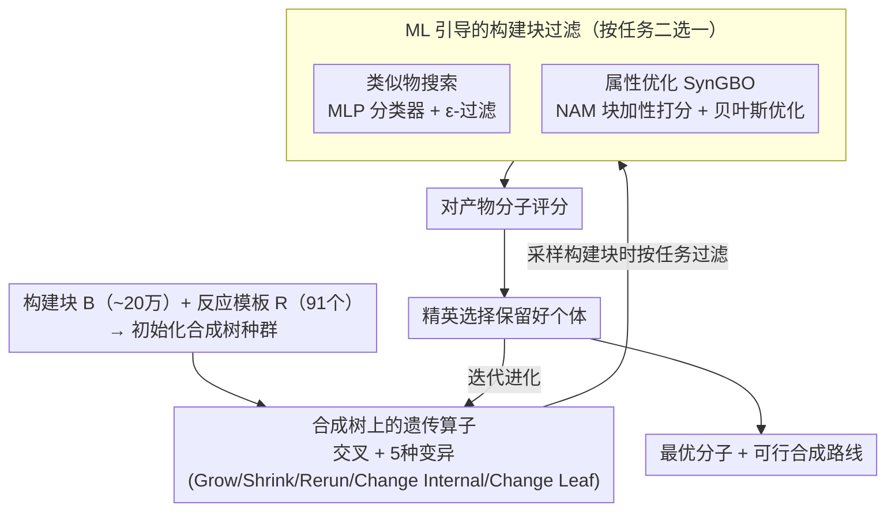

# A Genetic Algorithm for Navigating Synthesizable Molecular Spaces

**会议**: ICLR 2026  
**arXiv**: [2509.20719](https://arxiv.org/abs/2509.20719)  
**代码**: [https://github.com/alstonlo/synga](https://github.com/alstonlo/synga)  
**领域**: 分子设计 / 优化  
**关键词**: 遗传算法, 可合成分子设计, 合成路线, 贝叶斯优化, 构建块过滤  

## 一句话总结
提出 SynGA，一种直接在合成路线（合成树）上操作的遗传算法，通过自定义的交叉和变异算子将搜索严格约束在可合成分子空间内，结合 ML 驱动的构建块过滤实现 SOTA 的可合成类似物搜索和属性优化性能。

## 研究背景与动机

**领域现状**：分子设计中的生成模型 (VAE, RL, GFlowNet, LLM) 发展迅速，但经典的遗传算法因其简洁性、样本效率和探索能力仍然极具竞争力。

**现有痛点**：大多数分子生成模型不考虑可合成性，可能提出不稳定或无法合成的设计，这是实际应用的主要障碍。事后使用逆合成模型虽可缓解但计算开销大（每次评估需数分钟）。现有的合成约束 GA 方法需先训练 ML 投影模型将分子映射回合成空间，有前期训练成本且受限于投影质量。

**核心矛盾**：需要在庞大的离散组合分子空间中高效搜索，同时保证生成的分子有可行的合成路线。

**本文目标** 设计一个轻量级的、通过构造保证可合成性的遗传算法，作为独立基线和模块化组件使用。

**切入角度**：不是先生成再验证，而是直接在合成树上定义遗传算子，使搜索空间自始至终限制在可合成分子中。

**核心 idea**：通过在合成树上定义交叉/变异算子，让 GA 搜索天然受限于可合成空间，再用 ML 引导的构建块过滤加速聚焦。

## 方法详解

### 整体框架
SynGA 要解决的是"边搜索边保证可合成"：给定约 20 万个可购买构建块的集合 $\mathcal{B}$ 和 91 个反应模板的集合 $\mathcal{R}$，在某个优化目标下找出最优分子，并同时给出它的合成路线。它的关键设计是把搜索空间从"分子"换成"合成树"——一棵合成树 $T \in \mathcal{T}$ 的叶节点是构建块、内部节点是反应，根节点对应最终产物。GA 不再在分子图上做交叉变异，而是直接在合成树上迭代进化：每一代对种群里的合成树施加交叉和变异、对产物分子评分、用精英选择保留好的个体，循环至预算用尽。因为操作的对象自始至终是合法合成树，所以每个候选分子天然带着一条可行的合成路线，不需要任何事后的逆合成验证或投影。在变异采样构建块时，SynGA 再按任务接入一个过滤器把搜索引向相关区域：类似物搜索任务用 ML 分类器过滤，属性优化任务用块加性模型 + 贝叶斯优化（SynGBO）来排序构建块。

### 关键设计

**1. 合成树上的遗传算子：让"可合成"成为结构约束而非事后检查**

传统分子 GA 在图上随便改原子和键，搜出来的分子可能根本合不出来，只能事后跑昂贵的逆合成模型补救。SynGA 把约束直接焊进了操作对象：合成树的每个节点都满足"叶子是构建块、内部是有效反应"，于是任何不破坏这一结构的遗传操作，产物都自动是一条有效合成路线。**交叉**的做法是枚举两棵亲本树的子树，找出能被某个双分子反应连接的兼容子树对，再在新根节点处用一个随机的兼容反应把它们拼起来。**变异**则提供 5 种操作覆盖不同粒度的扰动：Grow（用一个新反应向外扩展）、Shrink（退回到某棵子树）、Rerun（保持树的结构不变、只重新采样产物）、Change Internal（替换某个内部反应）、Change Leaf（替换某个叶子构建块）。其中 Rerun 比较特别——它利用了合成路线的歧义性，同一条骨架路线可以产出不同分子，因此能在不动整体结构的情况下高效探索同一骨架的变体。

**2. ML 引导的构建块过滤：把 20 万构建块的搜索空间收缩到相关子集**

20 万个构建块意味着每一步变异的候选空间巨大，盲目采样效率很低。在类似物搜索任务里目标分子是已知的，于是可以训练一个轻量 MLP 分类器 $\pi_\theta: \mathcal{M} \times \mathcal{B} \to (0,1)$，预测每个构建块用于合成目标分子类似物的可能性，从而把全集过滤成一个相关子集。为了在聚焦和探索之间留余地，采样用 $\varepsilon$-过滤策略：以概率 $1-\varepsilon$ 从过滤后的子集采样、以概率 $\varepsilon$ 从全集采样，既把搜索压向相关区域、又不彻底放弃过滤器可能漏掉的构建块。

**3. 块加性模型 + 贝叶斯优化（SynGBO）：在目标分子未知时也能给构建块排序**

属性优化任务里没有现成的目标分子，无法像类似物搜索那样用分类器过滤，但仍然需要一种方式把搜索引向有希望的构建块。SynGBO 用一个神经加性模型（NAM）为每个构建块单独打分，再把这些分加起来给整棵树评分：

$$\rho_\theta(\mathcal{B}_M) = \left(\alpha + (1-\alpha)|\mathcal{B}_M|^{-1}\right)\sum_{B \in \mathcal{B}_M} s_\theta(B)$$

其中 $\mathcal{B}_M$ 是分子 $M$ 用到的构建块集合，$s_\theta(B)$ 是单个构建块的分。训练用排序损失而非回归损失，因为这里只需要"谁比谁更好"的相对序就够用来过滤。NAM 的可加结构带来可解释性——整体分能直接拆回到每个构建块上，于是可以直接按 $s_\theta(B)$ 给构建块排序做过滤。这个 SynGA 被嵌进一个贝叶斯优化外循环：用 GP 代理模型拟合已评估的分子，引导 SynGA 去最大化采集函数，从而在评估预算有限时更高效地逼近最优。

### 损失函数 / 训练策略
类似物搜索的过滤器用二元交叉熵训练；属性优化的 NAM 用 pairwise ranking loss 训练；外循环的 GP 代理用高斯过程标准训练。GA 本身采用精英选择策略，种群大小 500、后代大小 5。

## 实验关键数据

### 主实验

**可合成类似物搜索 (ChEMBL, 100 分子):**

| 方法 | Morgan Sim↑ | Scaffold Sim↑ | Gobbi Sim↑ | Subset Sim↑ |
|------|------------|--------------|-----------|-------------|
| SynGA (无过滤) | 0.313 | 0.372 | 0.536 | 0.397 |
| SynGA + MLP | 0.380 | 0.452 | 0.607 | 0.465 |
| SynGA + MLP+Mine | **0.393** | **0.465** | **0.617** | **0.475** |
| SynNet | 0.325 | 0.383 | 0.549 | 0.427 |
| Pasithea | 0.278 | 0.310 | 0.491 | 0.361 |

**属性优化 (PMO Benchmark, GuacaMol 子集):**

| 方法 | Top-10 AUC↑ | 合成可行性 |
|------|-----------|---------|
| SynGBO | SOTA | 保证可合成 |
| Graph GA | 高但无合成保证 | 不保证 |
| REINVENT | 较高 | 不保证 |

### 消融实验

| 配置 | Morgan Sim↑ | 说明 |
|------|------------|------|
| SynGA 无过滤 | 0.313 | 基线 |
| + Sim 启发式过滤 | 0.336 | 简单启发式有一定帮助 |
| + MLP 过滤 | 0.380 | ML 过滤显著提升 |
| + MLP + Hard Negative Mining | 0.393 | 难负样本挖掘进一步提升精度 |

### 关键发现
- SynGA 无需任何 ML 组件即可作为强基线，加入构建块过滤后达到 SOTA
- Rerun 变异是独特的设计——固定合成树结构但重新采样产物，能高效探索同一骨架的变体
- 20 万构建块的过滤可将有效搜索空间缩小数个数量级，对性能提升至关重要
- SynGBO 在属性优化中表现优异，NAM 的排序损失比回归损失更适合过滤用途

## 亮点与洞察
- **构造式可合成保证**：不是"生成-验证"范式，而是搜索空间本身就是可合成空间，这是方法论上的根本优势。搜索过程中生成的每个分子都自带合成路线
- **模块化设计哲学**：SynGA 是轻量级的无 ML 基础组件，可以方便地嵌入更大的工作流（如贝叶斯优化），体现了好的工程设计——简单核心 + 可选增强
- **Rerun 变异的巧妙**：在保持合成骨架不变的前提下探索化学空间，相当于"同一条合成路线可以产出不同的分子"，利用了合成路线中的歧义性

## 局限与展望
- 依赖预定义的反应模板库（91 个模板），可能错过模板外的合成路线
- 构建块集合固定为 Enamine 商业目录，限制了化学空间的覆盖范围
- NAM 的加性假设对复杂的非线性属性建模能力有限
- 合成路线最多 5 步，可能无法覆盖需要更长合成路线的复杂分子

## 相关工作与启发
- **vs Graph GA**: 传统分子图 GA 搜索能力强但不保证可合成性；SynGA 通过在合成树上操作自动保证可合成，性能相当
- **vs SynNet/Pasithea**: 这些基于 ML 的投影方法需要训练额外的投影模型；SynGA 核心是无 ML 的，更简单且可靠
- **vs RetroGNN (Gao et al., 2024)**: 也做合成感知 GA 但用训练好的投影网络做约束；SynGA 直接在合成空间中搜索，避免了投影误差

## 评分
- 新颖性: ⭐⭐⭐⭐ 在合成树上定义 GA 算子的想法虽非首创但实现精良，构建块过滤的 ML/GA 融合方式新颖
- 实验充分度: ⭐⭐⭐⭐⭐ 类似物搜索 + 属性优化 + 2D/3D 目标，全面覆盖分子设计任务，消融详尽
- 写作质量: ⭐⭐⭐⭐⭐ 方法描述清晰精确，形式化定义严谨，代码开源
- 价值: ⭐⭐⭐⭐ 为分子设计提供了实用的可合成搜索工具，开源代码可直接使用

<!-- RELATED:START -->

## 相关论文

- [\[ICLR 2026\] Exploring Synthesizable Chemical Space with Iterative Pathway Refinements](exploring_synthesizable_chemical_space_with_iterative_pathway_refinements.md)
- [\[ICLR 2026\] SynCoGen: Synthesizable 3D Molecule Generation via Joint Reaction and Coordinate Modeling](syncogen_synthesizable_3d_molecule_generation_via_joint_reaction_and_coordinate_.md)
- [\[ICLR 2026\] Adaptive Data-Knowledge Alignment in Genetic Perturbation Prediction](adaptive_data-knowledge_alignment_in_genetic_perturbation_prediction.md)
- [\[ICML 2025\] Reliable Algorithm Selection for Machine Learning-Guided Design](../../ICML2025/computational_biology/reliable_algorithm_selection_for_machine_learning-guided_design.md)
- [\[ICLR 2026\] Graph Diffusion Transformers are In-Context Molecular Designers](graph_diffusion_transformers_are_in-context_molecular_designers.md)

<!-- RELATED:END -->
