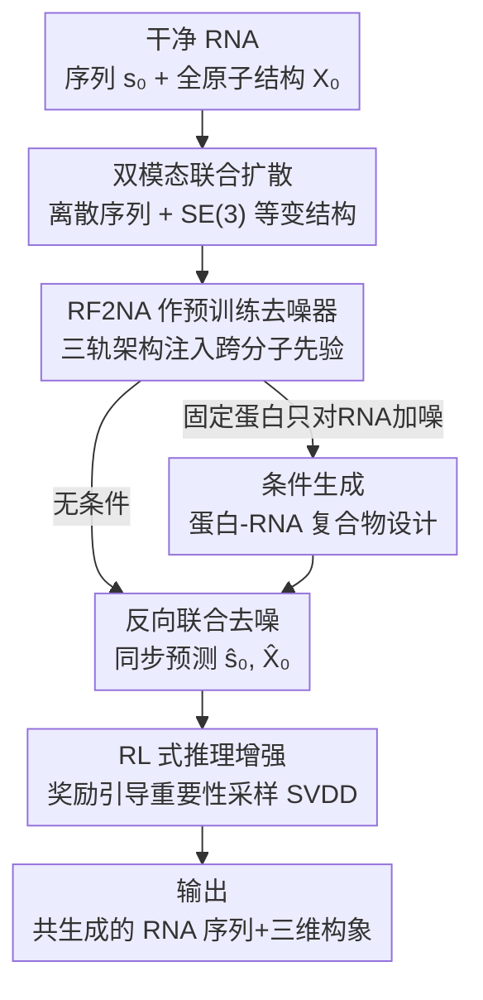

# A Joint Diffusion Model with Pre-Trained Priors for RNA Sequence-Structure Co-Design

**会议**: ICLR2026  
**OpenReview**: [https://openreview.net/forum?id=cpc63YrVWN](https://openreview.net/forum?id=cpc63YrVWN)  
**代码**: 待确认  
**领域**: 计算生物 / 扩散模型 / 生成式分子设计  
**关键词**: RNA 设计, 序列-结构协同生成, 预训练先验, 离散扩散, SE(3) 等变扩散

## 一句话总结
把预训练的生物大分子结构预测模型 RoseTTAFold2NA 直接当作扩散去噪器，套进一个「离散序列扩散 + SE(3) 等变结构扩散」的联合框架（RiboDiff），用极少的 RNA 三维数据就能同时生成 RNA 序列和全原子三维构象，在单链 RNA、RNA-蛋白复合物、蛋白条件结合三类任务上把自洽性指标拉到远超从零训练的扩散/流匹配基线。

## 研究背景与动机
**领域现状**：RNA 是细胞里负责催化、调控、信息传递的核心分子，能「从头设计」出折叠成指定三维结构的 RNA 序列，对合成生物学、RNA 药物、纳米技术都意义重大。但 RNA 的从头设计长期落后于蛋白设计：蛋白领域已经靠 RFdiffusion 这类工作把预训练的结构预测模型（RoseTTAFold）改造成扩散生成器，做得风生水起；RNA 这边却几乎都还停留在「在 RNA 专属小数据集上从零训扩散/流匹配」的阶段。

**现有痛点**：核心瓶颈是**实验解析的 RNA 三维结构极度稀缺**——作者过滤后能用的 RNASolo 数据也才约 15k 条。在这么小的数据上从零训生成模型，要么过拟合、要么覆盖不全。已有工作大致分三路，各有硬伤：(1) 逆折叠（gRNAde、RiboDiffusion）只优化序列、需要预先给定固定 3D 骨架，不能真正「从头长出形状」；(2) 联合生成（MMDiff、RiboGen）虽然能序列结构一起生，但都是在稀缺 RNA 数据上从零训的专用模型，RNA 设计精度普遍偏低；(3) 两阶段（RNA-FrameFlow 先生成骨架、再用 gRNAde 反折叠配序列）把序列和结构拆开，序列不在结构生成时协同优化，容易错过全局的序列-结构最优。

**核心矛盾**：RNA 的序列和结构是**双向强耦合**的（序列通过碱基配对/堆叠决定折叠，结构又反过来约束可行序列空间），但数据又少到无法让模型从零学会这套耦合规律。要么尊重耦合却没数据训，要么有方法却把耦合拆散——这是横在 RNA 从头设计面前的根本张力。

**本文目标**：在不增加 RNA 三维数据的前提下，做到「序列+全原子三维结构」的真·联合从头生成，并能灵活支持无条件生成、复合物生成、蛋白条件结合三种场景。

**切入角度**：作者借鉴 RFdiffusion 在蛋白上的成功范式——**判别式预训练 + 生成式精修**。关键观察是：RoseTTAFold2NA（RF2NA）已经在蛋白/RNA/DNA 及其复合物的大规模数据上统一预训练过，早就学会了 RNA 结构形成、蛋白-RNA 识别、序列-结构关系这些跨分子先验。既然这些知识已经被编码进权重里，何不直接把 RF2NA 当扩散去噪器，让它在生成时复用这些先验，从而绕过 RNA 数据稀缺的死结？

**核心 idea**：用预训练的 RF2NA 当去噪网络，嵌进一个离散（序列）+ 连续 SE(3) 等变（结构）的双扩散过程里，让跨分子先验直接驱动 RNA 的序列-结构联合生成——这是第一个建立在预训练生物大分子模型之上、针对 RNA 联合生成的扩散框架。

## 方法详解

### 整体框架
RiboDiff 要解决的是联合分布 $p(s, X)$ 的采样：$s \in \{A,C,G,U,N\}^L$ 是长度 $L$ 的核苷酸序列，$X \in \mathbb{R}^{L \times N_a \times 3}$ 是每个核苷酸最多 $N_a=27$ 个重原子的全原子三维坐标。整体思路是一个标准的「前向加噪 / 反向去噪」扩散闭环，但序列和结构走两条数学性质不同的噪声通道：序列走**离散吸收态扩散**（往均匀分布塌缩），结构走 **SE(3) 等变连续扩散**（平移走高斯、旋转走 SO(3) 上的各向同性高斯 IGSO(3)）。两条通道在每一步反向去噪时**共用同一个去噪器**——微调后的 RF2NA，它一次性吃进带噪的 $(s_t, X_t)$ 和时间步 $t$，同时吐出干净序列预测 $\hat{s}_0$ 和干净结构预测 $\hat{X}_0$，从而把序列-结构耦合显式建进每一步。

具体地，RNA 先被拆成「序列 one-hot/类别索引 + 每个核苷酸的局部坐标系 $F_i=(R_i, t_i)$」两套表示，局部坐标系由 C4'、C1'、糖苷氮 N1/N9 三个原子经 Gram-Schmidt 正交化构造，保证 SE(3) 等变。训练时随机对序列/结构做 Bernoulli 掩码，让同一个模型学会序列→结构预测、逆折叠、联合生成三种模式；推理时既能无条件生成，也能固定蛋白只对 RNA 加噪做条件生成，还能叠一层基于奖励的 RL 式重要性采样把样本往高质量推。

### 关键设计

**1. 预训练 RF2NA 充当扩散去噪器：用判别式先验补 RNA 数据的窟窿**

这一步直接针对「RNA 三维数据太少、从零训扩散学不动」的痛点。RF2NA 原本是个三轨（three-track）结构预测网络：序列轨处理 1D 特征 $h^{(1D)} \in \mathbb{R}^{L \times d_{seq}}$、配对轨维护残基间关系 $h^{(2D)} \in \mathbb{R}^{L \times L \times d_{pair}}$、结构轨在 SE(3) 等变特征 $h^{(3D)}$ 上配合坐标系 $\{F_i\}$ 迭代精修，三轨之间用注意力互通信息。作者不重新设计网络，而是**复用预训练的 RF2NA 主干当共享表示**，只额外挂三个扩散头：序列头输出类别 logits、平移头输出每残基平移噪声、旋转头输出 SO(3) 上的切向速度，再把时间步嵌入 $e(t)$ 注入所有轨。微调时连同主干一起以预训练权重初始化继续训，既保住了蛋白-RNA 相互作用、结构 motif、序列-结构关系这些跨分子先验，又在低数据 RNA 场景下显著提了样本效率。和 MMDiff/RiboGen「从零训专用模型」的本质区别就在这——它们的归纳偏置全靠那 15k 条 RNA 数据自己长，而 RiboDiff 把整个 RF2NA 预训练学到的物理合理性当成现成的先验拿来用。

**2. 离散序列扩散 + SE(3) 等变结构扩散的双模态联合过程：让两种数学性质各得其所**

序列是离散类别、结构是连续几何，硬塞进同一种噪声里会两头不讨好，所以作者给两条通道各配一套扩散。序列侧用吸收态离散扩散：前向转移矩阵 $Q_t = (1-\beta_t^{seq})I + \beta_t^{seq}U$（$U$ 为均匀转移、$\beta_t^{seq}$ 走余弦表 $\cos(\frac{\pi}{2}\cdot\frac{t}{T})^2$），把序列逐步腐蚀到核苷酸均匀分布，边际分布有闭式解 $q(s_t|s_0)=\text{Categorical}(s_t; \bar{Q}_t s_0)$。结构侧把每个原子位置拆成「坐标系 + 系内位置」$x_{i,a}=R_i r_{i,a}+t_i$，对平移走标准高斯 $q(t_t|t_0)=\mathcal{N}(t_t; \sqrt{\bar\alpha_t^{trans}}t_0, (1-\bar\alpha_t^{trans})I_3)$，对旋转走 SO(3) 上的各向同性高斯 IGSO(3)：$q(R_t|R_0)=\text{IGSO(3)}(R_t; R_0, \kappa_t)$，浓度参数 $\kappa_t$ 随时间衰减、最终塌成 SO(3) 上的均匀分布，采样时用轴角表示加 Rodrigues 公式算矩阵指数。反向过程的关键是 RF2NA 架构天然保证 SE(3) 等变性——对任意 $g=(R_g,t_g)\in\text{SE(3)}$ 有 $f_{\text{RF2NA}}(s_t, g\cdot X_t, t)=(\hat{s}_0, g\cdot\hat{X}_0)$，因为它只通过不变特征（距离、角度）和等变操作（坐标系变换）处理几何，于是整个生成过程都尊重分子的旋转平移对称性。两条通道虽然数学上各走各的，却**共用同一个去噪器、在每一步同时预测 $\hat{s}_0$ 和 $\hat{X}_0$**，这正是「联合」二字的落点——序列和结构在每个去噪步互相校准，避免两阶段方法那种序列结构脱节。

**3. 三轨配对表示天然支持蛋白条件生成：把复合物设计变成「只给 RNA 加噪」**

治疗性场景常需要设计能结合特定蛋白的 RNA（适配体、核糖开关等），RiboDiff 不用另起炉灶。它把体系拆成固定蛋白 $P$ 和待设计 RNA $R$，前向过程**只对 RNA 分量加噪、保持蛋白结构不动**：$q(X_t^{RNA}, s_t^{RNA}|X_0^{RNA}, s_0^{RNA}, X^{prot}, s^{prot})=q(X_t^{RNA}|X_0^{RNA})\cdot q(s_t^{RNA}|s_0^{RNA})$，反向则在蛋白上下文条件下去噪 RNA。能这么干的关键是 RF2NA 的**配对轨本就编码跨链相互作用**——蛋白残基和 RNA 残基之间的配对特征 $h_{ij}^{inter}=f_{bind}(h_i^{prot}, h_j^{RNA})+f_{geom}(X_i^{prot}, X_j^{RNA})$ 直接刻画了潜在结合界面，于是蛋白上下文会把 RNA 的去噪轨迹往「界面相容」的构象推。相比 RNAFlow 那种「GNN 提序列 + 外部 RF2NA 预测骨架」的多工具拼装管线，这里序列和结构在一个分布里一次出齐。

**4. RL 式推理增强（SVDD）：不更新参数也能把样本往高质量推**

为了在推理期再榨一点质量，作者引入基于价值的重要性采样 SVDD，把去噪过程看成序贯决策。在带噪样本 $(X_t, s_t)$ 处先按标准反向过程采 $M$ 个候选下一状态 $(X_{t-1}^{(m)}, s_{t-1}^{(m)})$，对每个候选算奖励 $r_m$（评估样本质量），再按 $m^*=\arg\max_m [r^{(m)} + \tau\log p_\theta(X_{t-1}^{(m)}, s_{t-1}^{(m)}|X_t, s_t, t)]$ 选最优，其中 $\tau$ 平衡「追奖励」和「别偏离学到的分布」。它完全不动模型参数，靠奖励引导的候选筛选就能把样本往更好的界面/结构推，条件生成时还能换成聚焦界面的奖励。代价是每步要采 $M$ 个候选，作者用较小的 $M$（如 10）控制开销，更多候选有边际收益递减。

### 损失函数 / 训练策略
总损失把序列准确、结构精度、物理合理性糅在一起：$L_{total}=\lambda_{seq}L_{seq}+\lambda_{str}L_{str}+\lambda_{rmsd}L_{rmsd}+\lambda_{geom}L_{geom}+\lambda_{lj}L_{lj}$。其中 $L_{seq}$ 是核苷酸交叉熵；$L_{str}$ 是帧对齐点误差 FAPE（把坐标变换到局部坐标系再比，保证局部几何）；$L_{rmsd}$ 在最优叠合后约束全局结构精度；$L_{geom}$ 用键长键角维持局部立体化学（$\sum_{bonds}(\|\hat{b}\|-b_0)^2+\sum_{angles}(\cos\hat\theta-\cos\theta_0)^2$）；$L_{lj}$ 是 Lennard-Jones 势防止原子撞车。训练时采样时间步 $t\sim U(1,T)$，并对序列/结构做 Bernoulli 随机掩码（$m_{seq}, m_{str}\sim\text{Bernoulli}(p_{mask})$），让一个模型同时学会序列→结构预测（$m_{seq}=0, m_{str}=1$）、逆折叠（$m_{seq}=1, m_{str}=0$）、联合生成（$m_{seq}=m_{str}=1$）三种模式。

## 实验关键数据

### 主实验
在三类任务上评测，自洽性指标为主：scRMSD（共设计结构 vs. 由生成序列重新预测的结构）、scTM-score、lDDT、序列自洽回收率 scSeqRec、qTMclust 多样性。

**单链 RNA 从头设计（RNASolo，scRMSD<5Å 算成功）：**

| 方法 | 成功率(%↑) | scRMSD(Å↓) | scTM(↑) | lDDT(↑) | scSeqRec(%↑) | 多样性(↑) |
|------|-----------|-----------|---------|---------|--------------|----------|
| 随机生成 | 0.00 | 39.74 | 0.05 | 0.23 | 1.06 | 0.99 |
| MMDiff | 8.86 | 35.77 | 0.12 | 0.33 | 23.90 | 1.00 |
| RNA-FrameFlow + gRNAde | 15.52 | 18.65 | 0.32 | 0.43 | 45.65 | 0.76 |
| **RiboDiff** | **97.38** | **3.43** | **0.71** | **0.74** | **48.57** | 1.00 |

scRMSD 从 MMDiff 的 35.7Å 降到 3.43Å（>10× 缩减），scTM 提升约 6×，lDDT 翻倍多，成功率直接拉到 97.38%，而多样性仍稳在 1.00——说明质量暴涨不是靠模式塌缩到少数几个折叠换来的。

**RNA-蛋白复合物联合设计：**

| 方法 | scRMSD(Å↓) | scTM(↑) | lDDT(↑) | scSeqRec(%↑) | 多样性(↑) |
|------|-----------|---------|---------|--------------|----------|
| 随机生成 | 43.51 | 0.002 | 0.26 | 0.59 | 1.00 |
| MMDiff | 30.84 | 0.015 | 0.38 | 17.46 | 0.96 |
| **RiboDiff** | **7.43** | **0.422** | **0.71** | **52.91** | 1.00 |

**蛋白条件 RNA 结合物设计（两种数据划分，对真值比较）：** 在 RF2NA 预训练划分上 RiboDiff 取得 GT-SeqRec 56.26%、GT-RMSD 13.20Å、lDDT 0.73，相比 RNAFlow-Base（27.98% / 15.39Å / 0.40）序列回收率几乎翻倍；在序列相似度划分上同样稳定（53.54% / 13.39Å / 0.71），表明能泛化到非近源同源序列。作者也诚实指出绝对 GT-RMSD 仍在十几埃量级，反映了恢复精确结合构象本身的固有难度。

### 消融实验

| 配置 | scRMSD(复合物,Å↓) | GT-RMSD(条件,Å↓) | ipTM(条件,↑) |
|------|-------------------|------------------|--------------|
| RiboDiff | 7.43 | 13.20 | 0.166 |
| RiboDiff + SVDD | **6.41** | **12.43** | **0.187** |

RL 式推理增强 SVDD（$M=10$）在不更新任何参数的情况下，复合物 scRMSD、条件 GT-RMSD、界面 ipTM 三项一致改善，说明奖励引导的候选筛选确实能在学好的扩散先验之上把样本往更好的界面推。

### 关键发现
- **预训练先验是涨点主力**：从零训的 MMDiff 在低数据 RNA 上 scRMSD 还在 35Å 量级，复用 RF2NA 先验后直接降到 3.43Å，印证了「判别式预训练 + 生成式精修」范式在数据稀缺的 RNA 域同样成立。
- **联合优化 vs. 两阶段**：两阶段的 RNA-FrameFlow+gRNAde 成功率仅 15.52% 且多样性掉到 0.76，而联合生成既高成功率又保多样性，验证了序列-结构协同优化的价值。
- **跨任务一致提升**：单链、复合物、蛋白条件三类任务全面领先，且在序列相似度划分（更严苛的泛化测试）上不崩，说明优势来自预训练先验而非过拟合测试分布。
- **SVDD 边际收益递减**：候选数 $M$ 增大能继续提升属性但收益递减，作者用小 $M$ 在质量和运行时间间取折中。

## 亮点与洞察
- **「把结构预测模型当扩散去噪器」从蛋白迁到 RNA**：RFdiffusion 在蛋白上验证了这条路，本文是第一个把这套范式落到 RNA 联合生成、并且用的是统一建模蛋白/RNA/DNA 复合物的 RF2NA——这意味着跨分子先验（尤其蛋白-RNA 界面知识）能被白嫖来做条件设计，比从零训省了海量数据。
- **三轨架构「顺手」支持条件生成**：条件生成不需要额外模块，靠 RF2NA 本就有的配对轨（编码跨链相互作用）就能让蛋白上下文塑形 RNA 去噪轨迹——这种「能力是预训练送的」是整篇最优雅的地方。
- **离散+连续双扩散共享去噪器**：序列走离散吸收态、结构走 SE(3) 等变连续扩散，却共用一个网络、每步同时预测序列和结构，把双向耦合显式建进采样过程，这个解耦-再耦合的设计可迁移到任何「离散标签+连续几何」的协同生成（如蛋白序列-结构、小分子图-构象）。
- **推理期 RL 增强零成本提质**：SVDD 不动参数、纯靠候选采样+奖励筛选就能涨点，是个可即插即用到其他扩散生成器上的实用 trick。

## 局限与展望
- **绝对结合构象精度仍有限**：蛋白条件任务的 GT-RMSD 还在十几埃，作者也承认恢复精确的结合态构象很难——对需要原子级精度的药物设计场景还不够。
- **依赖 RF2NA 的能力边界**：整个方法的先验全来自 RF2NA，若目标分子类型/相互作用超出 RF2NA 预训练覆盖范围，先验红利会打折；论文未充分讨论 RF2NA 本身的偏差会不会被继承进生成结果。
- **数据规模仍是天花板**：虽然靠预训练绕过了从零训的数据饥渴，但微调用的 RNASolo 仍只有约 15k 条、复合物数据更少，泛化到全新折叠拓扑的能力有待更大规模验证。
- **作者展望**：把学到的能量和物理能量（可微溶剂化/静电）更紧地结合、用 schedule-free 或流-扩散混合加速采样、引入不确定性校准与主动学习。

## 相关工作与启发
- **vs RFdiffusion（蛋白）**: 思路同源——都把预训练结构预测模型改成扩散生成器绕开数据稀缺。区别是 RFdiffusion 基于只管蛋白的 RoseTTAFold、且主要生结构，本文基于统一建模蛋白/RNA/DNA 的 RF2NA、做序列-结构联合生成，并把跨分子先验用于 RNA-蛋白条件设计。
- **vs MMDiff / RiboGen（联合生成）**: 都做序列-结构联合生成，但它们在稀缺 RNA 数据上从零训专用模型，精度受限；本文复用 RF2NA 预训练先验，样本效率和保真度大幅提升（scRMSD 从 35Å 到 3.4Å）。
- **vs RNA-FrameFlow + gRNAde（两阶段）**: 它先生骨架再外部反折叠配序列，序列不协同优化、易错过全局最优且多样性受损；本文一次联合出序列+结构，无需后处理外部工具。
- **vs gRNAde / RiboDiffusion（逆折叠）**: 它们只优化序列、需预先给定固定 3D 骨架，不能从头生成形状；本文真正做到序列和三维构象一起从噪声里长出来。
- **vs RNAFlow / RNA-EFM / RiboFlow（条件设计）**: 它们普遍需要复杂管线或外部工具，且各自只针对蛋白/小分子某一类条件；本文用同一框架、靠配对轨统一支持无条件与蛋白条件生成。

## 评分
- 新颖性: ⭐⭐⭐⭐⭐ 第一个把统一生物大分子预训练模型 RF2NA 嵌入扩散框架做 RNA 序列-结构联合生成，范式迁移干净有力
- 实验充分度: ⭐⭐⭐⭐ 三类任务 + 两种数据划分 + RL 消融，对比基线到位；但部分基线（如 RiboGen）只做了可视化对比、缺数值
- 写作质量: ⭐⭐⭐⭐ 问题动机和方法推导清晰，公式完整；少数符号略密集
- 价值: ⭐⭐⭐⭐⭐ 直击 RNA 从头设计的数据稀缺死结，对 RNA 药物/适配体设计有直接实用价值

<!-- RELATED:START -->

## 相关论文

- [\[ICLR 2026\] FlexRibbon: Joint Sequence and Structure Pretraining for Protein Modeling](flexribbon_joint_sequence_and_structure_pretraining_for_protein_modeling.md)
- [\[ICML 2025\] eccDNAMamba: A Pre-Trained Model for Ultra-Long eccDNA Sequence Analysis](../../ICML2025/computational_biology/eccdnamamba_a_pre-trained_model_for_ultra-long_eccdna_sequence_analysis.md)
- [\[ICLR 2026\] Constrained Diffusion for Protein Design with Hard Structural Constraints](constrained_diffusion_for_protein_design_with_hard_structural_constraints.md)
- [\[CVPR 2026\] HINGE: Adapting a Pre-trained Single-Cell Foundation Model to Spatial Gene Expression Generation from Histology Images](../../CVPR2026/computational_biology/adapting_a_pre-trained_single-cell_foundation_model_to_spatial_gene_expression_g.md)
- [\[ICLR 2026\] Multi-state Protein Sequence Design with DynamicMPNN](multi-state_protein_sequence_design_with_dynamicmpnn.md)

<!-- RELATED:END -->
