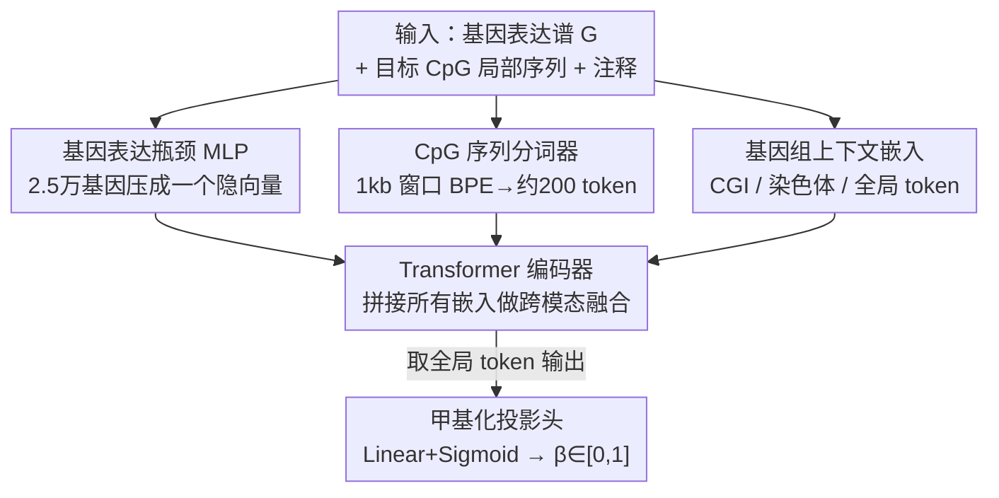

# A New Paradigm for Genome-wide DNA Methylation Prediction Without Methylation Input

**会议**: ICLR2026  
**OpenReview**: [https://openreview.net/forum?id=8wQ7Oc08vo](https://openreview.net/forum?id=8wQ7Oc08vo)  
**代码**: 待确认  
**领域**: 计算生物学 / 表观遗传基础模型  
**关键词**: DNA 甲基化, 基因表达上下文, Transformer, 全基因组预测, 基础模型

## 一句话总结
MethylProphet 是一个"基因上下文 + DNA 序列"驱动的 Transformer 基础模型，**完全不需要任何已测甲基化值作为输入**，仅凭一个样本的基因表达谱和每个 CpG 位点周围的局部 DNA 序列，就能推断全基因组（约 2800 万个 CpG）的甲基化水平，并能泛化到训练时从未见过的 CpG 位点和样本。

## 研究背景与动机
**领域现状**：DNA 甲基化（DNAm）是调控基因表达、细胞分化和疾病发生的核心表观遗传修饰，主要发生在 CpG 位点，可用 $\beta$ 值（$\in[0,1]$）量化。但全基因组测甲基化的代价极高：人类基因组约 2800 万个 CpG，常用的芯片平台（如 Illumina 450K/EPIC）只能测到其中 1–3%；能全覆盖的全基因组亚硫酸氢盐测序（WGBS）则贵得无法大规模铺开。结果是绝大多数 CpG 在任何数据集里都是"缺失"的，构成一个高维、海量缺失的稀疏矩阵问题。

**现有痛点**：近年的深度学习方法（DeepCpG、CpGPT、MethylGPT 等基于 mask 的生成式 Transformer）虽然能学甲基化的整体表示，但它们都属于"插补范式"——**推理时仍然需要喂进该样本部分已测的甲基化值**，靠观测到的位点去补未观测的位点。这带来两个硬伤：一是对一个完全没测过甲基化的新样本束手无策；二是它们的预训练只在约 $10^4$ 个 CpG（约 0.03% 基因组）上做，无法泛化到全新的 CpG 位点。另一类方法（MuLan-Methyl、MethylNet 等）只盯着芯片上那一小撮 CpG，覆盖面天然受限。

**核心矛盾**：要么覆盖全但贵到不可行（WGBS 全测），要么便宜但只能插补已知子集（插补范式必须先有部分观测）。问题的根源在于现有模型把"甲基化"既当输入又当输出，于是逃不出"必须先有甲基化"的循环。

**本文目标**：能不能彻底绕过"需要任何实测甲基化"这一步，直接从更易获取的信号推断整张甲基化图谱？子问题包括：(1) 用什么信号替代甲基化输入；(2) 如何在不给每个 CpG 分配独立参数的前提下泛化到上千万个、甚至训练时没见过的 CpG。

**切入角度**：作者抓住一个生物学事实——基因表达水平和 DNA 甲基化模式之间存在强相关，而基因表达数据在各种组织和条件下远比甲基化更易获得。于是把"甲基化的全局上下文"交给基因表达来提供，把"位点的局部特异性"交给 DNA 序列来提供。

**核心 idea**：用"基因表达谱（全局生物状态）+ CpG 局部 DNA 序列（位点特异）"作为上下文，让一个 Transformer 直接回归出每个 CpG 的甲基化值，**输入端不含任何甲基化**——从"插补范式"切换到"基因上下文预测范式"。

## 方法详解

### 整体框架
MethylProphet 要解决的是：给定一个样本的基因表达向量 $G\in\mathbb{R}^{N_g}$（$N_g\approx 25000$ 个基因）和某个目标 CpG 位点 $i$ 周围长度为 $L$ 的 DNA 序列 $S_i$ 及其注释 $a_i$，学习一个函数 $f_\theta:(G, S_i, a_i)\mapsto \hat{y}_i\in[0,1]$，输出该 CpG 在该样本里的甲基化水平。整条流水线由三组模块串成：**基因表达瓶颈 MLP**把 2.5 万维的表达谱压成一个紧凑向量；**CpG 序列分词器 + 上下文嵌入**把目标位点的局部序列和基因组注释编码成若干 token；最后所有嵌入拼成一条序列，喂进 **Transformer 编码器**做跨模态融合，由一个全局 token 携带最终预测。

为什么用 Transformer 当骨干？自注意力天然能捕捉 kb 级序列内远距离 CpG 的依赖，能无缝融合"序列 / 基因表达 / 基因组注释"这三类异构嵌入而不需要专门的跨模态模块，且有成熟的 scaling law——数据越多效果越好，正适合做全基因组规模的预测。

### 关键设计

**1. 基因表达瓶颈 MLP：用一个隐向量装下整张转录组**

痛点是基因表达谱有约 2.5 万维，直接把每个基因当 token 喂给 Transformer，自注意力的二次复杂度会爆炸；但又不能只挑几千个基因，否则丢掉全局生物状态。作者用一个瓶颈 MLP（Bottleneck MLP）把整张表达谱一次性压成紧凑嵌入：$x_{gene}=\phi(W_2\,\sigma(W_1 G + b_1)+b_2)$，其中 $\sigma$ 是 GeLU、$\phi$ 是 LayerNorm。这样做的好处是 (i) 高效压缩 2.5 万基因、(ii) 引入的归纳偏置最小、(iii) 保留转录组内的远距离依赖、(iv) 能泛化到没见过的样本——因为它学的是"表达模式如何映射到甲基化背景"，而不是记住某个具体样本。这正是替代"甲基化输入"的关键：全局生物状态由基因表达接管。

**2. CpG 序列分词器：不给位点分配 ID，而是用局部序列编码它**

如果给 2800 万个 CpG 每个分配一个可学习 embedding，光参数就要约 86GB，而且完全无法泛化到训练时没见过的 CpG。作者改用"序列上下文"来表示一个 CpG：取以该位点为中心约 1000bp 的窗口，借鉴 DNABERT-2 的可变长度 BPE 分词，把这段 ATCG 序列切成约 200 个 subword token（约 5× 压缩），每个 token 再映射到可学习嵌入 $x^{DNA}_j$。其妙处在于——序列模式相似的 CpG 会产生相似的 token 序列，于是模型能在共享 motif 的不同位点之间迁移知识，从而对"全新 CpG"也能给出合理预测。这是范式得以泛化到未测位点的根本机制。

**3. 基因组上下文嵌入：给序列补上"它在基因组哪儿"的先验**

光有局部序列还不够，相似的序列出现在不同区域时甲基化行为可能完全不同。作者叠加了三类可学习先验：**CpG 岛（CGI）上下文**——区分位点落在 island / shore / shelf / open sea（ocean）哪种区域，并给每个 CpG 岛一个索引 embedding，与区域类型 embedding 相加得到 $x_{CGI}$，注入局部 CpG 密度和调控区信息；**染色体指示符**——给 22 条染色体各一个 embedding $x_{chr}(k)$，编码染色体特异的甲基化基线和序列组成；**全局 token** $x_{GLB}$——类似 BERT 的 CLS，不对应任何具体输入，作为聚合节点 attend 到所有其他嵌入，最终它的输出状态被送进预测头。这组先验帮模型在"序列相似但语境不同"时消歧。

**4. Transformer 编码器与全局 token 预测：把异构信号拼成一条序列融合**

把上述所有嵌入拼成单条输入序列 $Z_i=[x_{GLB},\,x_{gene},\,\{x^{DNA}_j\}_{j=1}^L,\,x_{CGI},\,x_{chr}]$，喂进堆叠的双向自注意力层。双向注意力让每个 token 都能 attend 到其余全部 token，使"基因表达如何影响序列 token 的解读"这类复杂交互（如基因调控网络对局部甲基化的作用）自然涌现。融合后取全局 token 的最终状态 $x^{out}_{GLB}$，过一个简单投影头（Linear + Sigmoid）回归出该 CpG 的甲基化值。用全局 token 当预测载体，等价于 BERT 用 CLS 做下游回归，迫使网络把所有信息汇聚到这一个 token 上。

### 损失函数 / 训练策略
端到端训练，目标是预测值与真实甲基化值之间的均方误差（MSE），所有组件（基因 MLP、分词器嵌入、Transformer、投影头）一起反向传播更新。训练全程有监督，依赖大规模"基因表达–甲基化"配对数据；而推理时只需基因表达和序列，不需要任何甲基化。训练规模极大：ENCODE 用了约 16 亿个 CpG–样本对（约 3220 亿 token），TCGA（chr1）约 4.5 亿对（约 910 亿 token）。

## 实验关键数据

### 数据与评测设定
用 ENCODE（97 对匹配的 WGBS + RNA-seq，泛组织正常样本）评全基因组泛组织预测，用 TCGA（10,932 对匹配甲基化 + RNA-seq，含 WGBS/EPIC/450K）评泛癌预测。为同时考察分布内和分布外泛化，对**样本**和 **CpG 位点**两个维度都做划分，得到三个验证场景：Train CpG–Val Sample（新样本、老位点）、Val CpG–Train Sample（老样本、新位点）、Val CpG–Val Sample（新样本 + 新位点，最难的 OOD）。指标包括 MAS-PCC（跨样本中位 Pearson，衡量单个 CpG 跨个体的变异能否预测对）、MAC-PCC（跨 CpG 中位 Pearson，衡量样本整体甲基化轮廓）、MSE、MAE。

### 主实验
ENCODE 上对比 Levy-Jurgenson 的 CNN+attention 基线，MethylProphet 在三个划分上全面占优：

| ENCODE 划分 | 指标 | 基线 | MethylProphet |
|--------|------|------|------|
| Train CpG–Val Sample | MAS-PCC | 0.2878 | **0.3436** |
| Train CpG–Val Sample | MAC-PCC | 0.8355 | **0.9398** |
| Val CpG–Train Sample | MAS-PCC | 0.5453 | **0.7165** |
| Val CpG–Train Sample | MAC-PCC | 0.7959 | **0.9297** |
| Val CpG–Val Sample (OOD) | MAS-PCC | 0.1930 | **0.3411** |
| Val CpG–Val Sample (OOD) | MAC-PCC | 0.8037 | **0.9330** |

TCGA 泛癌上同样大幅领先（如 Train CpG–Val Sample 的 MAS-PCC 0.2630 → **0.5455**，MAC-PCC 0.6325 → **0.9320**）。

### 与插补范式模型对比（仅分布内）
即便 CpGPT、MethylGPT 走的是"需要观测甲基化"的不同范式、且不能预测未见样本，作者仍在它们能做的分布内（Val CpG–Train Sample）上对比：

| 模型 | ENCODE MAS-PCC | ENCODE MAC-PCC | TCGA chr1 MAS-PCC | TCGA chr1 MAC-PCC |
|------|------|------|------|------|
| DeepCpG | 0.0317 | 0.5560 | -0.0080 | 0.4237 |
| CpGPT | 0.3192 | **0.9401** | 0.4794 | 0.9250 |
| MethylGPT | 0.2964 | 0.8953 | 0.4358 | 0.8357 |
| **MethylProphet** | **0.3689** | 0.9400 | **0.5453** | **0.9253** |

即使是别人的主场（分布内），MethylProphet 的 MAS-PCC 也最高，MAC-PCC 与 CpGPT 持平——而它额外还能干别人干不了的"未见样本无甲基化输入"预测。

### 关键发现
- **跨 CpG（MAC-PCC）远比跨样本（MAS-PCC）好预测**：样本整体甲基化轮廓的全局趋势更容易学，MAC-PCC 普遍 0.9+；而预测"某个 CpG 在不同个体间的变异"（MAS-PCC）更难，方差也大，但这恰恰是识别治疗靶点最有价值的能力。
- **变异越大的 CpG 预测越准**：MAS-PCC 随 CpG 跨样本变异度升高而升高，说明模型抓住了真正有信息量的可变位点。
- **保留生物结构**：预测结果在同一 CGI 内能复现 CpG 共甲基化（co-methylation）动态；UMAP 显示预测与实测的同组织/同癌种样本聚在一起，说明推断出的甲基化图谱保留了组织与肿瘤差异。

## 亮点与洞察
- **范式级转变**：把"甲基化既当输入又当输出"的死循环打破，改成"基因表达提供全局状态 + 序列提供局部特异"，从此能给完全没测过甲基化的样本做全基因组推断——这是 CpGPT 类方法做不到的。
- **用序列上下文代替 CpG ID 是泛化到未见位点的钥匙**：给 2800 万 CpG 分配独立 embedding 要 86GB 且不可泛化，改用 BPE 分词的局部序列后，共享 motif 的位点自动知识迁移，参数和泛化两头都解决。可迁移到任何"实体数量爆炸、需对未见实体泛化"的场景。
- **瓶颈 MLP 压缩高维表达谱**：避开了把 2.5 万基因都当 token 的二次复杂度，又保住转录组全局依赖，是处理超高维生物组学输入的一个实用范式。
- **scaling 当卖点**：用 ENCODE 322B + TCGA 91B token 的规模训练，把表观遗传预测真正推到"基础模型"量级。

## 局限与展望
- **跨样本预测（MAS-PCC）整体仍偏低**（很多场景 0.3–0.5），即"预测某 CpG 在个体间的变异"这件最有临床价值的事还远未解决，方差也大。
- **TCGA 泛癌评测多聚焦 chr1**（受训练规模限制），全基因组泛癌的结论需更多染色体验证；ENCODE 测试样本数本身偏少（验证集仅 29 个样本），可能放大或缩小某些划分的表现差异。
- **依赖配对的基因表达–甲基化数据训练**：虽然推理只要表达，但训练阶段仍需大规模匹配数据，迁移到缺配对数据的物种/组织时如何扩展尚不明确。
- 改进方向：引入更强的序列编码器或基因模块、显式建模 CpG 之间的共甲基化结构、把跨样本变异预测作为专门优化目标。

## 相关工作与启发
- **vs CpGPT / MethylGPT（插补范式）**：它们用 mask 生成式预训练学甲基化表示，但推理必须喂入部分实测甲基化，且只在约 $10^4$ 个 CpG 上训练，无法泛化到新位点/新样本；MethylProphet 用基因表达 + 序列上下文直接回归，输入端不含甲基化，能覆盖全基因组并泛化到未见样本。优势是适用范围质变，代价是要海量配对训练数据。
- **vs DeepCpG**：早期 CNN 方法，依赖邻近已观测 CpG 做预测，分布内 PCC 都很低（甚至出现负相关），不具备无甲基化输入的能力。
- **vs Levy-Jurgenson et al. (2019)**：同样想从基因表达 + 序列预测甲基化，但只在数千个 CpG、小样本、癌症队列上验证；MethylProphet 把它推到全甲基化组规模 + 十亿级训练对的基础模型量级，全指标领先。
- **vs scGPT / Geneformer / scBERT 等基因组基础模型**：借鉴了它们"在海量生物数据上学通用表示"的思路，但目标从基因表达建模转向了跨模态的甲基化回归。

## 评分
- 新颖性: ⭐⭐⭐⭐⭐ 把甲基化预测从"插补范式"切换到"基因上下文范式"，去掉甲基化输入这一步是真正的范式转变。
- 实验充分度: ⭐⭐⭐⭐ 十亿级数据、多划分多指标、与四个基线对比都很扎实，但跨样本变异预测仍弱、泛癌多限于 chr1。
- 写作质量: ⭐⭐⭐⭐ 动机和三类生成场景讲得清楚，图表完整；个别表格标注有小笔误。
- 价值: ⭐⭐⭐⭐⭐ 让没测过甲基化的样本也能重建全基因组甲基化图谱，对表观遗传研究和精准医学是实打实的工具级贡献。

<!-- RELATED:START -->

## 相关论文

- [\[ICML 2025\] Latent Imputation before Prediction: A New Computational Paradigm for De Novo Peptide Sequencing](../../ICML2025/computational_biology/latent_imputation_before_prediction_a_new_computational_paradigm_for_de_novo_pep.md)
- [\[ICLR 2026\] Test-Time Adaptation without Source Data for Out-of-Domain Bioactivity Prediction](test-time_adaptation_without_source_data_for_out-of-domain_bioactivity_predictio.md)
- [\[ICLR 2026\] Adaptive Data-Knowledge Alignment in Genetic Perturbation Prediction](adaptive_data-knowledge_alignment_in_genetic_perturbation_prediction.md)
- [\[ICLR 2026\] AntigenLM: Structure-Aware DNA Language Modeling for Influenza](antigenlm_structure-aware_dna_language_modeling_for_influenza.md)
- [\[ICLR 2026\] PatchDNA: A Flexible and Biologically-Informed Alternative to Tokenization for DNA](patchdna_a_flexible_and_biologically-informed_alternative_to_tokenization_for_dn.md)

<!-- RELATED:END -->
