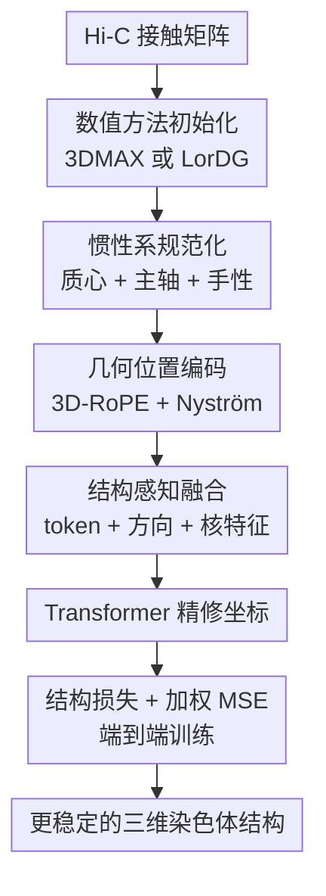

# A Resolution-Agnostic Geometric Transformer for Chromosome Modeling Using Inertial Frame

**会议**: ICLR2026  
**OpenReview**: [https://openreview.net/forum?id=OwLl8Xi6JG](https://openreview.net/forum?id=OwLl8Xi6JG)  
**代码**: https://github.com/yize1203/InertialGenome  
**领域**: 计算生物学  
**关键词**: 三维基因组重建, Hi-C, 染色体建模, 几何 Transformer, 跨分辨率迁移  

## 一句话总结
InertialGenome 用惯性系把初始染色体三维坐标先规范到稳定姿态，再用带 3D-RoPE 与 Nyström 结构编码的 Transformer 精修坐标，在两个单细胞 Hi-C 数据集、多个分辨率和生物功能验证上都优于传统优化方法与图神经网络基线。

## 研究背景与动机
**领域现状**：三维基因组研究希望从 Hi-C 等实验测到的染色质接触频率中恢复染色体在细胞核中的空间构象。标准流程通常先把基因组切成连续 bin，得到 bin 与 bin 之间的接触矩阵，再利用接触频率与空间距离之间的反比关系，把问题转化为三维坐标重建。早期方法多是 3DMAX、LorDG、miniMDS 这类数值优化或距离几何方法；近年的 HiC-GNN、HiCEGNN 则把 Hi-C 矩阵看成图，用 GNN 或等变 GNN 直接预测三维结构。

**现有痛点**：低分辨率 Hi-C 图更稠密、噪声相对小，但只能描述全局轮廓；高分辨率 Hi-C 图能看到局部环、TAD 等细节，却更稀疏、更 noisy，也更难优化。传统数值方法在高维非凸空间中搜索，计算代价大且容易受初始条件影响；深度模型虽然快，但很多方法只把 contact 当作图边，没有显式利用染色体三维点云本身的几何先验。HiCEGNN 这类强等变约束模型可以处理旋转平移对称性，却可能限制表达能力，尤其面对有方向性或锚定 loop 的非对称结构时不够灵活。

**核心矛盾**：三维染色体重建一方面需要对任意旋转、平移不敏感，因为同一个结构在坐标系中转一下仍然是同一个结构；另一方面又不能把几何方向、长程距离和链式空间组织全部抹掉。现有方法要么缺少稳定的姿态规范化，要么用过强的对称性约束牺牲表达，要么在不同分辨率之间泛化不好。

**本文目标**：作者想解决的是一个 resolution-agnostic 的三维染色体重建问题：给定由 Hi-C 矩阵和传统方法生成的初始坐标 $C^*$，模型输出更准确的坐标 $\hat{C}$；同时模型要能在 320kb、160kb、80kb、40kb 或 1MB、500KB、250KB、100KB 等不同分辨率上稳定工作，并能把低分辨率学到的全局结构迁移到高分辨率重建。

**切入角度**：作者观察到，染色体三维结构虽然没有绝对朝向，但它本身的点云形状可以定义一组主轴。若先把每个输入结构对齐到自己的惯性系，就能消除任意姿态带来的不必要变化；在这个规范化坐标系中，再让 Transformer 用几何位置编码建模相对距离和长程结构，模型就不必同时学习“怎么对齐姿态”和“怎么修正结构”。

**核心 idea**：用惯性系规范化替代硬性的 SE(3) 等变约束，再把 3D-RoPE 与 Nyström 核近似注入 Transformer，让模型在统一姿态下同时看到局部相对位置、全局低秩距离结构和跨分辨率几何规律。

## 方法详解

### 整体框架
InertialGenome 的输入不是原始 Hi-C 矩阵本身，而是由 3DMAX 或 LorDG 等数值方法先从 Hi-C 接触矩阵得到的一组初始三维坐标 $C^*=\{c_i\}_{i=1}^N$。模型先把这组点云平移到质心、对齐到惯性主轴，得到规范化坐标 $S=\{s_i\}_{i=1}^N$；随后把每个 genomic bin 的 token ID、规范化坐标、方向信息和 Nyström 结构嵌入融合成 Transformer 输入；最后预测修正后的三维坐标，并用结构保持损失与加权距离回归损失共同训练。

从数据流上看，论文的关键不是重新发明 Hi-C 到距离矩阵的第一步，而是在已有初始结构之上做一个几何精修器。这个定位很重要：它让 InertialGenome 可以接在 3DMAX 或 LorDG 后面形成 IG-3DMAX、IG-LorDG 两个变体，也解释了为什么输入初始化质量仍会影响上限，但模型能显著降低原始数值方法的尺度误差和姿态不稳定。

### 关键设计
**1. 惯性系规范化：把任意姿态的染色体点云转成可比较坐标**

三维染色体坐标的绝对旋转和平移没有生物意义，同一条染色体结构在空间中转一个角度，距离矩阵并不会变。若直接把这些坐标喂给普通 Transformer，模型会被迫学习大量与任务无关的姿态变化；若用强等变 GNN，又可能把模型限制在过窄的对称函数族里。InertialGenome 采用一个折中但很有针对性的办法：先用输入点云自身定义坐标系，再在这个坐标系里建模。

具体做法是先计算质心 $\bar{c}=\frac{1}{N}\sum_i c_i$，把每个点平移成 $c'_i=c_i-\bar{c}$；然后用点云估计归一化惯性张量 $\hat{I}=\frac{1}{N}\sum_i(\|c'_i\|^2 I_3-c'_i(c'_i)^T)$。对 $\hat{I}=L\Lambda L^T$ 做特征分解后，特征向量 $l_x,l_y,l_z$ 给出染色体点云的主轴。为了避免主轴符号翻转带来的镜像不一致，作者还取最远点 $c_{max}$，在主轴坐标中看它的符号，用 $\mathrm{sign}(p_x)$、$\mathrm{sign}(p_y)$ 修正前两根轴，并用 $l_z=l_x\times l_y$ 保证右手系。最终规范化坐标为 $s_i=Rc'_i$。

这个设计的价值在于，它把“姿态不变性”从网络结构里前置成一个确定性预处理。只要主轴稳定，模型看到的同一类染色体结构就会落在相近坐标系中，Transformer 可以把容量用在修正局部距离和全局拓扑上，而不是反复适配随机旋转。作者也分析了这一点的边界：如果输入点云的谱间隔 $\delta=\mu_1-\mu_2$ 很小，主轴会对扰动敏感；因此 Gram 矩阵嵌入这类近共面、谱退化输入并不适合惯性系对齐，而 3DMAX/LorDG 生成的点云更能从该步骤受益。

**2. 几何位置编码：让注意力同时感知相对方向和长程距离**

普通 Transformer 的位置编码通常服务于一维序列，而染色体重建中的 token 既有 bin 顺序，也有三维空间坐标。InertialGenome 将位置编码拆成两条互补路线：3D-RoPE 负责把相对空间位移写进 query-key 内积，Nyström 编码负责用低秩核特征表达全局距离关系。

3D-RoPE 的思路是把三维坐标 $s_i=(s_{x_i},s_{y_i},s_{z_i})$ 映射到三个独立的二维旋转子空间，对应 $x$、$y$、$z$ 三个轴的旋转。对 query 和 key 施加旋转算子 $R_{s_i}$ 后，内积满足 $(R_{s_1}q)^T(R_{s_2}k)=q^T R_{s_1-s_2}k$，也就是注意力分数天然依赖两点之间的相对位移。作者还实现了 Selective、Separate、Full 三种 RoPE 模式：Selective 只旋转空间半边特征并保留另一半语义特征，Separate 对两半分别投影但只旋转空间部分，Full 则对完整 embedding 做旋转。

不过轴向 RoPE 更擅长编码相对方向，并不等价于完整的全局距离矩阵。为此，论文加入 Nyström positional encoding：先在三维空间中固定 $m$ 个 anchor $u_k$，对每个尺度 $\sigma_g$ 构造 RBF 核 $\kappa_g(s_i,s_j)=\exp(-\|s_i-s_j\|^2/(2\sigma_g^2))$；再计算 token 到 anchor 的相似度向量 $V_{g,i}$，用 anchor-anchor Gram 矩阵的 Cholesky 因子做投影，得到低秩核嵌入 $\tilde{k}_{g,i}$。多尺度拼接后经过线性层得到 $E_{\text{nyström}}(s_i)$。这样模型不用显式计算全量 $N\times N$ 距离矩阵，也能把远距离 bin 之间的非局部几何模式压进 token 表示。

**3. 结构感知融合：把 bin 语义、方向和核结构放进同一个 Transformer 输入**

每个 genomic bin 不只是一个三维点，它还有沿染色体序列的位置身份。论文为 bin ID $t_i$ 学习 token embedding $E_{token}(t_i)$，并与规范化坐标 $s_i$ 拼接成基础表示 $x_i=[E_{token}(t_i);s_i]$。随后，模型再把三个几何组件拼到一起：基础位置表示 $x_i$、单位方向 $s_i/\|s_i\|$、以及 Nyström 结构嵌入 $E_{\text{nyström}}(s_i)$，形成 $h_i^0=\mathrm{Concat}(x_i,s_i/\|s_i\|,E_{\text{nyström}}(s_i))$。

这个融合方式的细节比“把坐标拼进去”更强。$x_i$ 保留了 bin 的序列身份和原始坐标；$s_i/\|s_i\|$ 把点相对质心的方向单独暴露出来，帮助模型区分同一半径上不同方向的结构；Nyström 分支则给出多尺度全局邻近关系。然后模型把 3D-RoPE 位置增强项加到融合表示上，经 dropout 后送入 $L$ 层 Transformer，最后输出每个 bin 的修正坐标。这样，Transformer 的自注意力既能使用序列 token，也能直接读取三维几何结构，而不需要把染色体硬编码成一个固定图拓扑。

**4. 混合训练目标：同时对齐局部拓扑和精确距离**

如果只用坐标 MSE，模型可能追求数值接近却破坏邻域拓扑；如果只用结构分布损失，又可能得到相对关系不错但实际距离不准的结构。InertialGenome 用 $L_{total}=\alpha L_{struct}+\beta L_{weighted\ mse}$ 组合两者，其中 $\beta=1-\alpha$。

结构损失先把输入距离矩阵 $D$ 转成每个 bin 的邻域概率 $p_{j|i}=\frac{\exp(-D_{ij})}{\sum_{k\neq i}\exp(-D_{ik})}$，再把预测坐标之间的欧氏距离转成 $q_{j|i}=\frac{\exp(-\|\hat{s}_i-\hat{s}_j\|^2)}{\sum_{k\neq i}\exp(-\|\hat{s}_i-\hat{s}_k\|^2)}$。模型最小化双向 KL：$L_{struct}=\lambda KL(P\|Q)+(1-\lambda)KL(Q\|P)$，默认 $\lambda=0.1$。这让预测结构保留“谁和谁更近”的局部拓扑，同时兼顾漏掉真实邻居和产生假邻居两类错误。

加权 MSE 则针对 Hi-C 的特点：高接触频率通常对应较短距离，而短距离约束在染色体空间结构中更可靠、更重要。论文按真实距离值的 rank 给不同距离赋权，对每个距离值集合计算 $(y_{ij}-\hat{y}_{ij})^2$ 的加权平均，其中 $\hat{y}_{ij}=\|\hat{s}_i-\hat{s}_j\|$。这使训练不会被大量长距离 pair 稀释掉，对 loop、TAD 内部紧密相互作用等局部结构更敏感。

### 一个完整示例
假设一条染色体在 320kb 分辨率下被切成 $N$ 个 bin，Hi-C 实验给出 $N\times N$ 接触矩阵。传统流程先用接触频率 $IF_{ij}$ 和 $D_{ij}=IF_{ij}^{-\gamma}$ 得到距离约束，再由 3DMAX 生成一个初始三维点云 $C^*$。这个点云的绝对朝向可能是任意的：今天的 3DMAX 输出把长轴朝向 $x$，另一次初始化可能把类似结构转到 $y$ 或 $z$，但它们表达的是同一条染色体的空间折叠。

InertialGenome 会先计算这个点云的质心，把所有点移到以质心为原点的位置；再根据惯性张量找到三根主轴，并用最远点决定轴符号，得到规范化坐标 $S$。接着，第 $i$ 个 bin 的 token ID 被映射成语义 embedding，规范化坐标 $s_i$ 同时用于 3D-RoPE 和 Nyström 核特征。进入 Transformer 后，一个 bin 可以通过注意力同时看到序列上相邻但空间上不一定近的 bin，以及序列上相隔很远但在三维空间中接触频繁的 bin。最后模型输出修正坐标 $\hat{s}_i$，训练时既要求预测距离矩阵接近目标，也要求每个 bin 的邻域概率分布接近由 Hi-C 距离推导出的分布。

这个例子说明了为什么论文强调 resolution-agnostic：当从 320kb 迁移到 80kb 或 40kb 时，bin 数量、局部噪声和稀疏性都变了，但“先规范姿态，再用相对几何和低秩距离结构建模”的逻辑仍然成立。低分辨率提供的全局主轴和长程组织，可以成为高分辨率坐标修正的结构先验。

### 损失函数 / 训练策略
模型训练目标为 $L_{total}=\alpha L_{struct}+\beta L_{weighted\ mse}$，其中 $\beta=1-\alpha$。主文默认讨论的结构损失里，$\lambda$ 设为 0.1，用于平衡 $KL(P\|Q)$ 与 $KL(Q\|P)$；附录中进一步比较了 $\alpha/\beta$ 取 $0/1$、$0.1/0.9$、$0.5/0.5$、$1/0$ 的效果。

实验中作者把模型接在不同数值初始化后形成 IG-3DMAX 和 IG-LorDG。训练、验证、测试按染色体编号划分，而不是随机打散 bin：Frontal cortex 数据中训练使用 chr 1、3、5、7、8、9、11、13、15、16、17、19、21、22，验证用 chr 2、6、10、12，测试用 chr 4、14、18、20；B-Lymphocyte 数据类似，但训练集中额外包含 chr 23。这样的划分更接近真实泛化场景，因为测试染色体在训练中没有出现。

## 实验关键数据

### 主实验
论文在两个单细胞 Hi-C 数据集上评估：human frontal cortex cell 和 B-Lymphocyte cell。评价指标包括 dSCC 和 dRMSE：dSCC 是预测距离与理想距离的 Spearman 相关，越高表示距离排序越一致；dRMSE 是距离均方根误差，越低表示绝对距离更准。基线包括 3DMAX、LorDG、HiC-GNN 和 HiCEGNN。

| 数据集 / 分辨率 | 指标 | 本文最好结果 | 强基线 | 提升或差异 |
|--------|------|------|----------|------|
| Frontal cortex 320KB | dSCC ↑ | IG-3DMAX 0.9006 | HiCEGNN 0.5804 | 相关性大幅提高，说明全局距离排序更稳定 |
| Frontal cortex 320KB | dRMSE ↓ | IG-LorDG 0.1544 / IG-3DMAX 0.1697 | HiCEGNN 0.2744 | 误差明显降低，传统 3DMAX 原始 dRMSE 为 23.1587 |
| Frontal cortex 40KB | dSCC ↑ | IG-3DMAX 0.7187 | HiCEGNN 0.2506 | 高分辨率下优势仍明显 |
| Frontal cortex 40KB | dRMSE ↓ | IG-3DMAX 0.2410 | HiCEGNN 0.4317 | 细粒度重建更准 |
| B-Lymphocyte 1MB | dSCC ↑ / dRMSE ↓ | IG-3DMAX 0.9209 / 0.0822 | HiCEGNN 0.8847 / 0.0839 | 在强基线已经较好的粗分辨率上仍小幅领先 |
| B-Lymphocyte 100KB | dSCC ↑ / dRMSE ↓ | IG-3DMAX 0.8708 / 0.0790 | HiCEGNN 0.8017 / 0.0795 | 细分辨率保持更高相关性 |

这张主结果表最关键的现象是：IG-3DMAX 在两个数据集的所有分辨率上都非常稳。Frontal cortex 上，传统数值方法的 dRMSE 是几十甚至上百量级，而 IG 变体把误差压到 0.1 到 0.25 左右；B-Lymphocyte 上，原始 3DMAX 的 dSCC 本来就不低，但 dRMSE 极大，经过 InertialGenome 后距离尺度被显著校准。

跨分辨率迁移实验从 320kb 迁移到 160kb、80kb、40kb。作者比较 HICEGNN-Transfer、HICEGNN-Original、IG-3DMAX 的三种 RoPE 模式以及 IG-3DMAX-Original。结果显示，IG-3DMAX 在高分辨率 dSCC 上持续优于原模型，尤其 40kb 从 Original 的 0.6132 提升到 Full 的 0.6528；HICEGNN 在 40kb transfer 反而低于 original 的 dSCC。这支持作者关于“几何编码 + 惯性系更利于跨尺度适配”的主张。

### 消融实验
| 配置 | 关键指标 | 说明 |
|------|---------|------|
| Full (Ours) | 320KB dSCC 0.9030 / dRMSE 0.1547；40KB dSCC 0.7297 / dRMSE 0.2382 | 完整 IG-3DMAX，在 Frontal cortex 消融表中总体最好 |
| w/o Inertial | 320KB dRMSE 0.1641；80KB dRMSE 0.2185 | 去掉惯性系后误差上升，说明姿态规范化确实稳定全局结构 |
| w/o RoPE | 320KB dSCC 0.8976；40KB dRMSE 0.2454 | 相对空间位置编码缺失后，距离相关和误差都变差 |
| w/o Nyström | 160KB dRMSE 0.1998；40KB dRMSE 0.2496 | 长程低秩核结构被移除后，细分辨率误差下降最明显 |
| $\alpha/\beta=0.1/0.9$ | 320KB dRMSE 0.1696；40KB dRMSE 0.2407 | 结构损失加少量权重能兼顾拓扑与距离 |
| $\alpha/\beta=1.0/0.0$ | 320KB dRMSE 0.1453；40KB dRMSE 0.2788 | 只用结构损失时粗分辨率误差低，但细分辨率坐标精度变差 |

组件消融说明三个模块不是装饰性的：惯性系主要减少全局姿态和输入扰动带来的不稳定；RoPE 让注意力能读取相对空间位置；Nyström 分支对细粒度、长程距离建模尤其重要。损失消融也很有信息量：只用结构 loss 并不是最稳的方案，它可能保住拓扑但牺牲实际距离，因此混合目标更合理。

### 关键发现
- IG-3DMAX 是整体最稳定的变体。IG-LorDG 有时 dSCC 也高，但受 LorDG 初始坐标质量限制，在 B-Lymphocyte 1MB 和 100KB 上不如 IG-3DMAX 稳。
- 惯性系对 3DMAX/LorDG 这类物理或正则化重建输入更有效，对 Gram 这类谱退化、近共面的输入帮助有限。作者用 Davis-Kahan 定理解释了这一点：谱间隔太小时，微小扰动会导致主轴大幅旋转。
- 生物功能验证比单纯 dSCC 更有说服力。IG-3DMAX 的 intra-TAD 距离相对 inter-TAD 更短，chr4/14/18/20 的 intra/inter ratio 为 0.760、0.796、0.814、0.800；HiCEGNN 的 ratio 更接近 1，chr20 甚至 p=0.159，说明 TAD 聚集不显著。
- A/B compartment 验证中，IG-3DMAX 能显著拉近同 compartment 内部距离，而 HICEGNN 对 A-A/A-B 的区分不显著。这说明模型输出不仅数学指标好，也更符合已知染色质空间组织。
- FISH 验证显示 L1-L2 loop anchor 预测距离小于 L2-L3 control，例如 chr11 上 L1-L2 距离 0.8、L2-L3 距离 3.3，且 Hi-C 接触概率也符合近距离高接触的趋势。

## 亮点与洞察
- **把姿态不变性做成确定性规范化，而不是全靠等变网络**：这点很巧妙，因为三维基因组重建只关心相对结构，不关心绝对坐标系。惯性系让模型输入更标准，同时保留 Transformer 的表达自由度。
- **3D-RoPE 与 Nyström 的组合比较契合染色体结构**：RoPE 适合相对位移，Nyström 适合长程低秩核关系，二者刚好对应染色体中局部邻域和远距离接触并存的特点。
- **跨分辨率视角有实际价值**：高分辨率 Hi-C 昂贵且噪声大，低分辨率结构更稳定。若模型能把低分辨率学到的全局组织迁移到高分辨率，就能减少对昂贵高质量实验数据的依赖。
- **作者没有只停留在几何指标**：TAD、A/B compartment 和 FISH 这些验证更贴近生物学意义，能回答“预测坐标是否像真实染色质组织”而不只是“距离矩阵是否拟合”。
- **谱稳定性分析补上了方法适用边界**：论文没有简单宣称惯性系总是有效，而是指出 Gram 输入谱间隔很小会导致主轴不稳定。这让方法解释更可信，也提醒后续工作要关注初始化点云的几何质量。

## 局限与展望
- **依赖初始重建质量**：InertialGenome 是 refinement 框架，需要先由 3DMAX、LorDG 等方法生成初始坐标。若初始点云严重退化、近共面或谱间隔很小，惯性系规范化会不稳定，IG-Gram 的差结果已经说明这一点。
- **仍以 Hi-C 单模态为核心**：论文未来工作提到要整合多模态基因组数据。现实中 3D genome 与 RNA-seq、表观修饰、CTCF/cohesin binding 等信号都有联系，单靠 contact matrix 和初始坐标可能限制对功能结构的解释。
- **跨细胞类型泛化还可以更系统**：实验覆盖 frontal cortex 和 B-Lymphocyte 两个数据集，但还没有展示更大规模跨物种、跨实验平台、跨测序深度的泛化。
- **计算复杂度细节还可更透明**：Nyström 降低了全量核矩阵代价，但 Transformer 处理高分辨率 bin 序列仍可能很重。若要扩展到全基因组更高分辨率，需要进一步说明内存、速度和分块策略。
- **评估依赖已有功能注释**：TAD、A/B compartment 和 FISH 验证很有用，但不同数据集的注释质量和 resolution 对齐会影响结论。后续可以加入更多直接实验验证或不确定性估计。

## 相关工作与启发
- **vs 3DMAX / LorDG**: 它们直接从 Hi-C 接触约束优化三维坐标，适合作为初始重建器，但容易有尺度误差和高分辨率不稳定。本文不是替代它们，而是把它们输出的点云作为输入，再用几何 Transformer 做坐标精修。
- **vs HiC-GNN**: HiC-GNN 把 Hi-C 看成接触图，用图卷积学习结构；本文显式使用三维坐标、惯性主轴和连续空间位置编码，因此更能利用点云几何。
- **vs HiCEGNN**: HiCEGNN 用 SO(3)-equivariant GNN 处理旋转平移对称性，优势是物理对称性清晰；InertialGenome 则先规范化姿态，再用普通 Transformer 表达复杂非对称结构，实验上在多个分辨率和生物验证中更强。
- **vs InertialAR**: InertialAR 把惯性系用于三维分子生成，本文把类似几何原则迁移到染色体建模。启发是：很多生物三维结构任务都可以先问“是否存在由对象自身定义的 canonical frame”，再决定是否需要重型等变架构。
- **对其他任务的启发**: 对蛋白复合物、细胞器形态、空间转录组 spot 结构等任务，也可以考虑“稳定姿态规范化 + 几何位置编码 + Transformer”的组合，尤其当绝对朝向无意义但长程空间关系很关键时。

## 评分
- 新颖性: ⭐⭐⭐⭐ 惯性系思想本身有来源，但把它与 3D-RoPE、Nyström 编码和跨分辨率染色体重建结合得比较新。
- 实验充分度: ⭐⭐⭐⭐ 两个单细胞数据集、四种分辨率、多个基线、消融和生物功能验证都覆盖到；更大规模跨平台泛化还可加强。
- 写作质量: ⭐⭐⭐⭐ 方法结构清楚，公式和图较完整；部分实验叙述对 dRMSE 尺度差异和复杂度分析还可以更细。
- 价值: ⭐⭐⭐⭐⭐ 这类方法有望降低高分辨率 3D genome 重建成本，并为 Hi-C 数据的结构解释提供更强的几何建模工具。

<!-- RELATED:START -->

## 相关论文

- [\[ICLR 2026\] Coupled Transformer Autoencoder for Disentangling Multi-Region Neural Latent Dynamics](coupled_transformer_autoencoder_for_disentangling_multi-region_neural_latent_dyn.md)
- [\[ICLR 2026\] FACET: A Fragment-Aware Conformer Ensemble Transformer](facet_a_fragment-aware_conformer_ensemble_transformer.md)
- [\[ICLR 2026\] Rigidity-Aware Geometric Pretraining for Protein Design and Conformational Ensembles](rigidity-aware_geometric_pretraining_for_protein_design_and_conformational_ensem.md)
- [\[ICML 2025\] Geometric Generative Modeling with Noise-Conditioned Graph Networks](../../ICML2025/computational_biology/geometric_generative_modeling_with_noise-conditioned_graph_networks.md)
- [\[ICLR 2026\] Animal behavioral analysis and neural encoding with transformer-based self-supervised pretraining](animal_behavioral_analysis_and_neural_encoding_with_transformer-based_self-super.md)

<!-- RELATED:END -->
