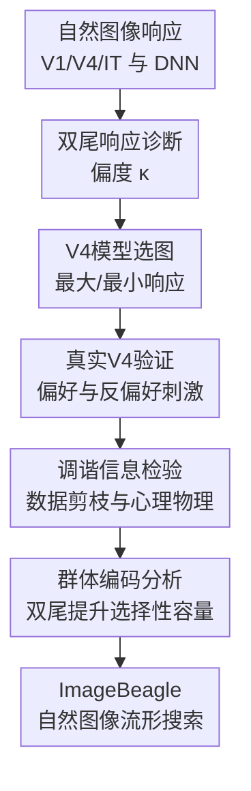

# A tale of two tails: Preferred and anti-preferred natural stimuli in visual cortex

**会议**: ICLR 2026  
**OpenReview**: [https://openreview.net/forum?id=RZ8esDBqMJ](https://openreview.net/forum?id=RZ8esDBqMJ)  
**代码**: https://github.com/cowleygroup/Gondur_et_al_2026.git；ImageBeagle: https://github.com/cowleygroup/ImageBeagle.git  
**领域**: 计算神经科学 / 视觉皮层  
**关键词**: V4视觉皮层, 反偏好刺激, 神经调谐, 双尾响应分布, ImageBeagle  

## 一句话总结
本文发现灵长类视觉皮层 V4 神经元对自然图像的响应不是只有“偏好刺激”一端，而是同时存在能增强放电的偏好图像和能压低基线放电的反偏好图像，并通过电生理验证、编码模型、心理物理实验和 ImageBeagle 搜索工具证明反偏好刺激是理解 V4 调谐不可缺的一半。

## 研究背景与动机
**领域现状**：视觉神经科学长期围绕“某个神经元喜欢什么刺激”来理解神经选择性。从 Hubel 和 Wiesel 的 V1 方向选择性，到高阶视觉皮层中对脸、形状、纹理或物体类别敏感的神经元，主流叙事都是寻找能最大化神经响应的 preferred stimulus。机器学习中的视觉 DNN 也继承了类似图景：卷积滤波器加 ReLU 形成稀疏激活，深层单元通常只对少数图像强响应。

**现有痛点**：这种叙事默认神经元的响应分布是“一尾”的：少量图像触发高响应，大多数图像只是低响应或接近静默。问题在于，这种假设很容易把低响应图像全部混成“没信息的背景”，从而忽略那些主动把神经元放电压到基线以下的自然图像。对于 V4 这样的中高阶视觉区，刺激空间是高维自然图像，不是单一方向、颜色或空间频率参数，反偏好刺激是否真实存在、是否有可解释特征、是否影响下游读出都没有被系统回答。

**核心矛盾**：如果 V4 神经元真像 ReLU 单元一样只编码一端偏好，那么只找最大响应图像就足够刻画调谐；但如果它们在基线附近有正负两侧的动态范围，那么最小响应图像就不是“无响应”，而是另一类可读出的特征。这个矛盾直接影响我们怎样建模视觉皮层，也影响 DNN 表征与生物神经表征的对齐方式。

**本文目标**：作者要回答四个层层递进的问题：第一，V4 以及其他视觉区的真实神经元是否呈现双尾响应分布；第二，模型预测的反偏好自然图像能否在真实猕猴 V4 记录中被因果验证；第三，反偏好图像是否真的帮助估计神经元对其他自然图像的调谐；第四，反偏好特征对群体编码和高效刺激搜索有什么计算价值。

**切入角度**：论文从一个反直觉观察出发：真实 V4 神经元对自然图像的响应分布不像 ResNet50 深层 ReLU 单元那样强烈右偏，而更接近两端都有极值的分布。作者没有停留在统计描述，而是把“反偏好”当成可实验检验的刺激类别，用数据驱动 V4 模型去挑选最小响应自然图像，再回到真实电生理记录中验证这些图像是否真的压低放电。

**核心 idea**：把 V4 调谐从“只寻找最大响应特征”的单尾问题，改写成“同时寻找增强和抑制基线响应的两端自然刺激”的双尾问题。

## 方法详解

### 整体框架
这篇论文不是提出一个单一神经网络模型，而是搭建了一条计算神经科学实验管线：先用响应分布的偏度识别双尾现象，再用数据驱动 V4 模型从大规模自然图像中选出偏好与反偏好图像，随后用真实 V4 记录、teacher-student 调谐估计、人类心理物理任务和群体读出分析验证反偏好刺激的功能意义。最后，作者把这一套需求落成 ImageBeagle，使实验室可以在千万级自然图像库里高效“猎取”目标刺激。

整个流程的关键是把“反偏好”从统计尾部变成可操作对象。论文先把每个神经元或 DNN 单元在大量自然图像上的响应看成一个分布，用偏度 $\kappa$ 区分单尾和双尾；随后训练或复用紧凑 V4 model neurons，在 50 万到 3000 万张自然图像中挑出响应最高和最低的样本；再把这些样本带回实验、建模和行为任务中，检查它们是否能压低真实 V4 响应、是否能帮助学习调谐、是否能被人类解释。

### 关键设计
**1. 双尾响应诊断：用偏度把“低响应背景”拆成真正的反偏好尾部**

论文首先避免直接凭几张示例图下结论，而是把每个单元对自然图像的响应分布量化为偏度 $\kappa$。直观上，ReLU 式单尾单元会有大量接近零的响应和少数极大响应，因此分布强烈右偏，$\kappa$ 接近或大于 2；如果神经元既有高响应图像也有低于基线的图像，两端都有极值，分布会更接近双尾，$\kappa$ 会靠近 0。作者在自己的 V4 数据、公开 V1/V4/IT 数据和多个 DNN 层之间比较这个指标，发现 V4 中位 $\kappa=0.87$，另一套 V4 数据甚至为 $0.41$，而 ResNet50 中层 post-ReLU 单元中位约 $2.06$，深层可到 $4.43$。

这个设计重要在于它把“反偏好刺激”从主观视觉印象变成了群体统计现象。更细的一点是，作者用图像呈现后 100 ms 的 spike count，并在图像之间插入灰屏，尽量排除长时间重复呈现导致的 adaptation。也就是说，低响应尾部不是因为神经元被上一张图拖累，而是新图像本身能够把 V4 响应压到基线以下。

**2. 模型选图与闭环验证：先让 V4 模型找尾部，再用真实神经元检验尾部**

只看响应分布仍然可能被质疑：低响应尾部是否只是噪声，或者只是空白、低对比度图像造成的被动沉默？作者因此复用 Cowley 等工作中的数据驱动紧凑 V4 模型，每个模型对应一个真实 V4 神经元的响应预测器。对每个 V4 model neuron，作者把约 50 万张自然图像输入模型，保留预测响应最高的 10 张作为 preferred images，最低的 10 张作为 anti-preferred images，然后在后续记录 session 中把这些图像真正呈现给清醒、注视任务中的猕猴。

实验验证的结果很关键：模型挑出的偏好图像让真实 V4 响应落在随机自然图像响应分布的上端，中位分位数 $q=0.985$；模型挑出的反偏好图像落在下端，中位分位数 $q=0.055$。更进一步，反偏好图像不是比随机图像“稍低”，而是在刺激呈现窗口内把响应压到灰屏基线以下。这个结果排除了“反偏好就是空白屏或无特征图像”的解释，因为许多 anti-preferred natural images 视觉上同样丰富、具体，而且比合成的最小响应图像更能压低真实 V4 响应。

**3. 调谐信息检验：用偏好和反偏好两端共同训练，测试它们是否能外推到普通图像**

作者没有把反偏好刺激停留在“存在”层面，而是问它们是否包含可泛化的调谐信息。为此，论文把 V4 model neurons 当作 teacher，每个 teacher 在 50 万张自然图像上给出响应；再训练 5 层 CNN student，用不同训练集估计这个 teacher 的调谐：只用 preferred images，只用 anti-preferred images，同时用两端图像，随机图像，或接近中位响应的 non-preferred images。评估时统一在 held-out 随机自然图像上算 $R^2$，所以能直接看训练样本选择对外推调谐的影响。

结果显示，在训练图像少于 5000 张时，同时使用偏好和反偏好图像优于随机选择；只用偏好或只用反偏好都不如随机。这说明两端不是互相替代的信息，而是共同给出了神经元的正负调谐边界。论文还用人类心理物理任务做了一个很漂亮的行为检验：被试要判断两张图哪张会让某个 V4 model neuron 响应更高。如果先看到该神经元的偏好和反偏好参考图，被试预测 V4 模型响应的平均准确率达到 80.5%，优于只看单端参考图或不看参考图；但对 ResNet50 单元，反偏好参考图并没有同样帮助。这说明 V4 的反偏好图像携带人类可解释的视觉特征，而 DNN 单元的低响应图像更像杂散的“不触发集合”。

**4. ImageBeagle 与容量分析：把双尾调谐转化为可搜索、可读出的群体编码资源**

论文最后把反偏好特征放到群体编码里看。作者比较 34 个可解释高层图像统计量，发现单个 V4 模型的偏好和反偏好图像可以有明显差异，但跨神经元平均后没有某个统计量稳定属于偏好或反偏好；邻居重叠分析也显示，两个神经元即使偏好图像相似，反偏好图像也未必相似。这支持一个很有意思的解释：V4 群体像是从同一个视觉特征分布中独立抽取了正端和负端特征，于是每个神经元携带两组可读出的选择性。

为了测试这种容量说法，作者让 adapter DNN 用 V4 model neuron 响应做 Caltech-101 物体识别，并比较原始双尾响应、只保留 preferred tail、只保留 anti-preferred tail、以及两端随机混合。原始响应在相同神经元数下明显更好；若只用 preferred-only 单元，要达到同等准确率需要约 $2.5\times$ 数量的模型神经元，而 pre-ReLU DNN 单元的压缩比只有 $1.6\times$。ImageBeagle 则解决实践问题：既然自然图像尾部很稀有，穷举 3000 万图像太贵，它用 ResNet50 特征构建近邻图，在自然图像流形上交替做 coreset 全局搜索和近邻局部爬山，常在约 1 万次评估内找到接近 3000 万图像最优的偏好或反偏好刺激。

### 一个完整示例
假设研究者手里有一个 V4 model neuron，想知道它“喜欢”和“讨厌”什么自然图像。传统做法可能只在图像库里找响应最高的几十张图，然后把这些图当成该神经元的调谐解释。本文流程会多走几步：先把 50 万张自然图像都喂给模型，得到一条响应分布；如果这条分布两端都有明显极值，就分别取 top 10 和 bottom 10。top 10 可能是某类纹理、颜色或局部形状，bottom 10 不是灰屏，而是另一组同样具体的自然图像。

接着，把这 20 张图和几百张随机自然图像插入下一次 V4 记录 session。若 top 10 的真实响应超过随机图像 90% 区间上界，而 bottom 10 的真实响应贴近甚至低于 90% 区间下界，同时在 PSTH 上低于灰屏后的基线，研究者就能说：这个神经元不只是“对某些图像兴奋”，还会被另一类自然图像主动抑制。再把这 20 张图作为训练样本的一部分训练 student model，如果“top + bottom”比“top only”更能预测 held-out 随机图像响应，就说明 bottom tail 不是孤立异常值，而是神经元调谐函数的一部分。

### 损失函数 / 训练策略
本文的核心不是训练一个新的端到端模型，因此没有单一的新损失函数；训练主要出现在三处。第一，V4 model neurons 来自既有数据驱动紧凑模型，用多 session V4 image-response pairs 训练并蒸馏，使每个模型对应一个真实神经元。第二，在 V4 响应预测中，作者比较常规线性映射和 LRL 映射：输入 ResNet50 pre-ReLU 或 post-ReLU 特征，LRL 先用 $1\times1$ convolution 线性混合通道，经过 LayerNorm 和 ReLU，再线性映射到 V4 响应，以减少 DNN 单元正负偏好与真实 V4 不匹配的问题。第三，data pruning 分析中，student 是 5 层 CNN，每层 100 个 filters，用 Adam、学习率 $10^{-4}$、early stopping 训练；训练集按照 preferred、anti-preferred、两端混合、random、non-preferred 或 synthesized 策略采样，并统一在 held-out 随机自然图像上评估 $R^2$。

## 实验关键数据

### 主实验
| 实验问题 | 数据 / 设置 | 关键指标 | 本文发现 | 说明 |
|--------|------|------|----------|------|
| V4 是否双尾 | 作者 V4 记录，$n=219$ | 响应偏度 $\kappa$ | V4 中位 $\kappa=0.87$ | 明显低于 post-ReLU ResNet50 中层单元 $\kappa=2.06$ |
| 其他视觉区是否类似 | 公开 V1/V4/IT 数据 | 响应偏度 $\kappa$ | V1 $1.17$，V4 $0.41$，IT $0.69$ | 生物视觉层级普遍比深层 DNN 更双尾 |
| DNN 深层趋势 | ResNet50 early/middle/late | 响应偏度 $\kappa$ | early $0.99$，late $4.43$ | 越深越单尾，和真实视觉皮层相反 |
| 闭环验证反偏好 | 500k 自然图像选 top/bottom，再记录真实 V4 | 随机响应分位数 $q$ | preferred $q=0.985$，anti-preferred $q=0.055$ | 模型选出的反偏好图像真实压低 V4 响应 |
| 人类是否能读懂 V4 调谐 | 心理物理任务，预测 V4 model neuron | 平均准确率 | pref.+anti-pref. 条件约 80.5% | 人类会利用两端参考图理解 V4 调谐 |
| 群体双尾容量 | Caltech-101 adapter 读出 | 等准确率所需单元比 | preferred-only 需约 $2.5\times$ V4 模型数 | 双尾响应相当于提升特征选择性容量 |

### 消融实验
| 配置 | 关键指标 | 说明 |
|------|---------|------|
| pre-ReLU 线性映射 | V4 response prediction 低于 post-ReLU | 虽然 pre-ReLU 更双尾，但其正负特征不一定和 V4 对齐 |
| post-ReLU 线性映射 | 常规方法中较好 | 单尾 DNN 特征库可被线性组合成类似 V4 的双尾响应 |
| negated ReLU | 预测最差 | DNN 中被 ReLU 截掉的负端特征并不自然匹配 V4 偏好 |
| LRL mapping | 显著优于常规线性映射 | 先混合通道再 ReLU，使模型对正负偏好错配更鲁棒 |
| 只用 preferred images 估计 V4 tuning | 低于 pref.+anti-pref. | 单端样本会过度关注强响应图像内部差异 |
| 只用 anti-preferred images 估计 V4 tuning | 低于 random 与 pref.+anti-pref. | 只有负端也不能完整约束调谐函数 |
| pref.+anti-pref. 训练 | 小样本下优于 random | 两端共同给出可泛化边界 |
| synthesized images | 表现较差 | 合成图偏离自然图像流形且多样性不足 |
| ImageBeagle vs random search | 约 10k 评估接近 30M 最优 | 近邻图上的流形爬山明显优于随机穷举 |

### 关键发现
- V4 反偏好刺激不是“没有特征的低对比度图像”，而是能在真实记录中把神经元响应压到灰屏基线以下的自然图像。
- V4 与 DNN 的差别不是简单的 pre-ReLU vs post-ReLU：pre-ReLU 单元虽然也有负端，但它们的反偏好特征未必和真实 V4 神经元对齐。
- 对 V4 tuning 的估计最需要的是两端样本共同出现；preferred-only 和 anti-preferred-only 都无法给出完整调谐。
- 人类能利用 V4 的偏好与反偏好参考图预测模型神经元响应，但对 ResNet50 单元不依赖反偏好图，说明 V4 的负端特征更可解释。
- V4 群体的偏好和反偏好特征似乎近似独立抽样，使同样数量神经元能提供更丰富的下游读出基底。

## 亮点与洞察
- 最有冲击力的亮点是把“anti-preferred stimulus”从传统单参数调谐中的低谷，提升为自然图像空间里的完整研究对象。它不是方向调谐曲线另一端的常规低响应，而是复杂自然图像中可搜索、可验证、可解释的特征集合。
- 论文对 DNN 与 V4 的比较很克制：post-ReLU DNN 更好预测 V4，并不意味着 ReLU 更生物真实，而可能只是大量单尾特征经线性组合后碰巧能拟合双尾神经响应。这对 neuroAI 很有启发，因为“预测分数高”不等于“内部机制对齐”。
- 数据剪枝实验把反偏好刺激的价值讲得很清楚：如果只拿最大响应图像学习调谐，模型会沉迷于强响应类内部的细小差异；加入最小响应图像，等于给调谐函数补上另一侧边界。
- ImageBeagle 的贡献不只是工程加速。它强调神经元最优刺激应该优先在自然图像流形上找，而不是只依赖梯度合成图，因为自然图像更容易被人类解释，也更可能在真实神经元上保持有效。
- “双尾响应提升容量”的解释很漂亮：一个 V4 神经元不只是一个 preferred-feature detector，还同时提供一个 anti-preferred-feature readout，从群体角度看相当于用更少神经元覆盖更多特征方向。

## 局限与展望
- 真实 V4 记录规模仍然有限，约 200 个神经元相对整个 V4 只是很小样本；跨个体、跨皮层层次、跨任务状态下反偏好特征是否稳定，还需要更大规模记录验证。
- Utah array 记录中可能混有 single-unit 和 multi-unit activity。作者在附录中论证 multi-unit 加和难以单独解释双尾分布，但最理想的证据仍然是更稳定、更大规模的单神经元隔离记录。
- V4 model neurons 是重要中介，许多后续分析把它们当作 surrogate ground truth。若模型本身对真实 V4 的反偏好端拟合不足，某些关于特征关系和容量的结论可能会受到影响。
- 34 个可解释视觉统计量和 CLIP embedding 都只是有限特征视角。论文发现跨神经元平均没有稳定偏好/反偏好差异，但这不代表更复杂的视觉语义或神经群体结构不存在。
- ImageBeagle 的 30M 图像库包含网络和公共数据集图像，存在数据覆盖、敏感内容和近邻图近似误差问题；实际闭环实验中还需要考虑刺激安全、显示设备约束和动物状态变化。
- 后续最自然的方向是沿视觉通路系统寻找反偏好刺激：V1、V2、V4、IT 的双尾机制是否相同？反偏好特征是否通过抑制性回路、树突非线性或群体归一化形成？这些问题会直接连接神经编码和 DNN 架构设计。

## 相关工作与启发
- **vs 经典 LN / ReLU 模型**: LN 模型把神经元看成单一滤波器加阈值，强调某个 preferred pattern 是否超过阈值；本文显示 V4 更像有动态基线的双向驱动单元，自然图像既可增强也可抑制响应。
- **vs preferred-stimulus optimization**: Ponce、Bashivan、Walker 等工作用生成模型或闭环优化寻找最大激活图像；本文把同样的优化思想扩展到最小激活自然图像，并证明最小端不是噪声而是调谐的一部分。
- **vs DNN brain-score / linear mapping**: 常规做法用 post-ReLU DNN 特征线性预测 V4；本文指出这种高预测力可能来自单尾特征库的组合灵活性，而不是 DNN 单元本身复现了 V4 的双尾选择性。
- **vs data pruning / active learning**: 数据剪枝通常问哪些训练样本最有价值；本文把这个问题转成神经调谐估计，发现最极端的正负样本在小样本下比随机样本更能约束响应函数。
- **vs explainable AI with natural exemplars**: 解释 CNN 单元时，自然图像 exemplar 往往比合成 feature visualization 更可读；本文在人类心理物理任务中给出类似证据，并进一步区分了 V4 与 DNN 反偏好图像的可解释性差异。

## 评分
- 新颖性: ⭐⭐⭐⭐⭐ 从“寻找偏好刺激”翻转到“同时寻找反偏好刺激”，问题定义本身很有开创性。
- 实验充分度: ⭐⭐⭐⭐⭐ 统计分析、真实 V4 记录、模型验证、人类行为、群体读出和搜索工具形成了比较完整的证据链。
- 写作质量: ⭐⭐⭐⭐⭐ 论文主线清晰，图 1 到图 6 基本按“现象存在 → 因果验证 → 功能意义 → 工具落地”推进。
- 价值: ⭐⭐⭐⭐⭐ 对视觉神经科学、neuroAI 表征对齐和闭环刺激优化都有直接启发，尤其适合推动后续实验室系统搜索 anti-preferred stimuli。

<!-- RELATED:START -->

## 相关论文

- [\[ICLR 2026\] Uncovering Semantic Selectivity of Latent Groups in Higher Visual Cortex with Mutual Information-Guided Diffusion](uncovering_semantic_selectivity_of_latent_groups_in_higher_visual_cortex_with_mu.md)
- [\[NeurIPS 2025\] MEIcoder: Decoding Visual Stimuli from Neural Activity by Leveraging Most Exciting Inputs](../../NeurIPS2025/computational_biology/meicoder_decoding_visual_stimuli_from_neural_activity_by_leveraging_most_excitin.md)
- [\[ICLR 2026\] Learning Brain Representation with Hierarchical Visual Embeddings](learning_brain_representation_with_hierarchical_visual_embeddings.md)
- [\[ICLR 2026\] Model-Guided Microstimulation Steers Primate Visual Behavior](model-guided_microstimulation_steers_primate_visual_behavior.md)
- [\[ICLR 2026\] MindPilot: Closed-loop Visual Stimulation Optimization for Brain Modulation with EEG-guided Diffusion](mindpilot_closed-loop_visual_stimulation_optimization_for_brain_modulation_with_.md)

<!-- RELATED:END -->
