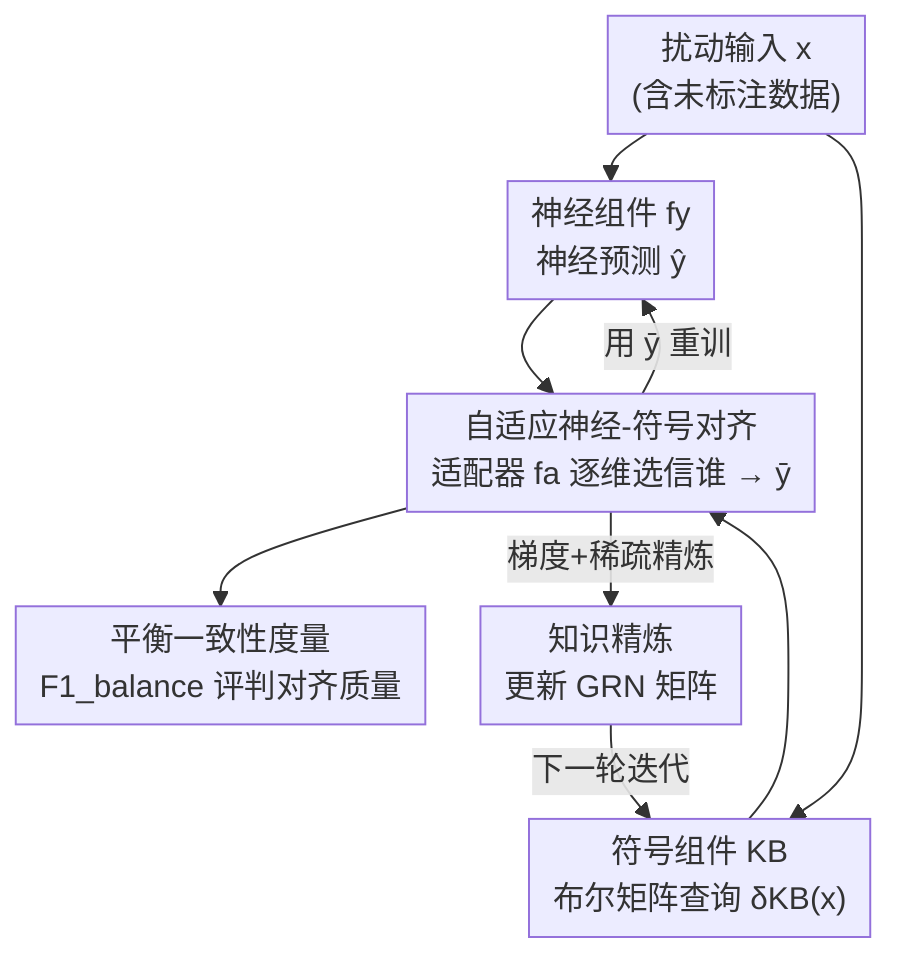

# Adaptive Data-Knowledge Alignment in Genetic Perturbation Prediction

**会议**: ICLR2026  
**OpenReview**: [https://openreview.net/forum?id=CxLaZWbUjc](https://openreview.net/forum?id=CxLaZWbUjc)  
**代码**: 待确认  
**领域**: 计算生物学 / 神经符号学习 / 可解释机器学习  
**关键词**: 基因扰动预测, 溯因学习, 神经符号对齐, 基因调控网络, 知识精炼

## 一句话总结
ALIGNED 把"数据驱动的神经网络"和"专家整理的基因调控知识库"放进同一个溯因学习（Abductive Learning）框架里，用一个无梯度训练的适配器逐基因决定该信谁，再反过来用预测去精炼调控知识库，在多个大规模扰动数据集上拿到了最高的"平衡一致性"，并且能重新发现有生物学意义的调控关系。

## 研究背景与动机
**领域现状**：预测"敲除/过表达某个基因后，全基因组的转录如何变化"是理解细胞系统、做药物发现的核心任务。目前主流有两条路：一条是纯数据驱动，在海量单细胞数据上训练大模型（scGPT、scFoundation 等）学潜在表示；另一条是混合方法，把先验的基因调控知识（如 GEARS 用 GO 图）当作归纳偏置塞进模型。

**现有痛点**：纯数据模型是黑箱，你说不清"为什么预测这个基因会上调"，背后是哪条调控关系在起作用；混合方法虽然用了知识，却把知识当成**静态约束**——只能单向地拿知识去帮预测，不能反过来用数据去修正、更新知识。两条路都给不出对生物机制的可解释、可演化的理解。

**核心矛盾**：要做端到端的"数据 ↔ 知识"双向整合，最大的拦路虎是两者天生不一致。论文实测发现：在常用知识库（OmniPath、GO、EcoCyc）和数据集（Norman、Precise1k）之间，**42%–71% 的数据侧调控关系在知识库里根本查不到**，还有至少 **14% 直接和知识库标注冲突**。知识库本身也有过时、覆盖偏向"研究得多的通路"等问题。如果天真地把这两个有噪声的来源直接拼起来，错误会**双向传播**，把神经学习和知识精炼一起带坏。

**本文目标**：在存在系统性不一致的前提下，既要预测准、又要让预测扎根于可解释的生物先验，还要能反向精炼知识库——这要求一个能"逐基因判断该信数据还是信知识"的自适应机制，以及一个评价"两边都照顾到"的指标。

**切入角度**：作者借用周志华提出的**溯因学习（ABL）**范式——它本就是为"神经预测和符号知识库不一致时，通过一致性优化把两者对齐"而生。把基因调控网络（GRN）编码成布尔矩阵做符号推理，神经网络和符号推理各出一份预测，再训练一个适配器去调和。

**核心 idea**：用一个**无梯度训练的适配器**逐输出维度（逐基因）地在神经预测和符号预测之间二选一，组成神经-符号融合预测；再用这个融合预测**反向、稀疏地精炼知识库**，让数据和知识在迭代中相互校正。

## 方法详解

### 整体框架
ALIGNED（Adaptive aLignment for Inconsistent Genetic kNowledgE and Data）把问题形式化成一个**三值分类**：学一个函数 $f:\{-1,0,1\}^n \to \{-1,0,1\}^n$，输入是每个基因的扰动状态（$-1$ 敲除 / $0$ 不扰动 / $1$ 过表达），输出是每个基因表达的变化方向（下调 / 不变 / 上调）。

框架由三个部件组成：**神经组件** $f_y$ 是个神经网络（MLP 或嵌入了 KB 的 GNN），从扰动输入直接预测响应；**符号组件** KB 是把 GRN 的激活($+$)/抑制($-$)关系编译成 $n\times n$ 布尔邻接矩阵 $\langle R^{(k)}_+, R^{(k)}_-\rangle$，通过矩阵运算 $\delta_{KB}(x)=(R^{(k)}_+-R^{(k)}_-)^\top x$ 做高效的演绎查询（$k$ 控制考虑多长的间接调控通路）；**适配器** $f_a$ 学习按可靠性逐维融合两者。

整条流程是：先在有标注数据上联合初始化 $f_y$ 和 $f_a$；对每个（含未标注的）输入，神经和符号各出一份预测；**自适应对齐**阶段适配器输出一个二值指示向量 $a$，逐维选择信谁，得到融合预测 $\bar y$；然后做多轮**双向更新**——用 $\bar y$ 重训神经组件，同时**精炼**符号组件的 GRN。整个对齐与精炼可以迭代（论文记作 A、R、A-R、A-R-A…）。三件事贯穿始终：一个评价指标、一个对齐机制、一个精炼机制。

### 关键设计

**1. 平衡一致性度量：让评价同时对数据和知识负责**

传统指标只看预测准不准（数据一致性），完全不管预测有没有违背生物先验，于是黑箱模型可以靠拟合噪声刷高分却说不出机制。ALIGNED 定义了**平衡一致性** $F1_{balance}$，把"对测试数据的 macro-F1"和"对知识库演绎结果 $\delta_{KB}(x)$ 的 macro-F1"用一个 $\gamma>1$ 的广义均值合起来：

$$F1_{balance}(f(x),x,y,KB)=\left(\tfrac{1}{2}F1(y,f(x))^{-\gamma}+\tfrac{1}{2}F1(\delta_{KB}(x),f(x))^{-\gamma}\right)^{-1/\gamma}$$

$\gamma>1$ 让这个均值偏向**惩罚短板**——任何一边的 F1 太低，整体分数都会被压下去，逼模型不能为了拟合数据而彻底背离知识，也不能死守知识而预测失准。这也是后续所有实验的主指标。其中数据-知识不一致量 $Inc(D_l,KB)=\sum_{x,y}\|\delta_{KB}(x)-y\|_0$ 用来量化图 1 里那些冲突，区别于只看局部的 Known Relationships Retrieval：演绎查询尊重整个 GRN 结构、保留基因互作的传递性。

**2. 自适应神经-符号对齐：用无梯度优化逐基因决定信数据还是信知识**

这是回应"逐基因该信谁"的核心。适配器输出二值指示向量 $a=f_a(x)$，融合预测逐维取 $\bar y_i=\hat y_i$（$a_i=0$ 信神经）或 $\bar y_i=\delta_{KB}(x)_i$（$a_i=1$ 信符号）。适配器的目标 $L_a$ 由三项构成：① **不一致项** $Inc(a,x,\hat y,KB)=\|\delta_{KB}(x)-\bar y\|_0$，鼓励融合结果别和知识库冲突；② **知识用量限制** $L_{len}(a)=\max\{\|a\|_0-\theta,0\}$，只在必要时才动用知识、防止过度依赖符号侧；③ **表征加权** $L_{weight}(a)=w^\top(1-a)+(1-w)^\top a$，权重 $w$ 综合"该基因在训练数据中与 KB 冲突的样本数"和"GO 注释量"——某基因在知识库里被刻画得越充分（$w_i$ 越大）就越倾向用符号预测，反之（知识稀疏或冲突多）就用神经预测。三项合为 $L_a=Inc+C_l L_{len}+C_w L_{weight}$（式 4）。

关键难点是：最小化 $L_a$ 要查询离散结构的符号 KB，是个**组合优化**问题，没法直接求梯度。作者用 **REINFORCE** 训练 $f_a$，并用 $w$ 初始化采样分布来降低采样复杂度；$f_a$ 还和 $f_y$ 共享输入与嵌入层以复用神经表示。整体目标 $\min_{f_y,f_a} L$（式 5）= 标注数据上的交叉熵 + 全部数据上的 $L_a(a,x,\hat y)\log f_a(x)$（policy-gradient 形式，$L_a$ 不传梯度）。

**3. 基于梯度的稀疏知识精炼：用预测反过来修知识库，且只做最小改动**

前两个设计让预测扎根于知识，这一步把方向反过来——用可靠的神经-符号预测去**更新 GRN**，补上缺失、纠正错误的调控关系。难点是布尔矩阵运算（式 1）不可微。作者引入近似函数 $\varepsilon_t(X)_{i,j}=1-\exp(-tX_{i,j})$（$X_{i,j}\ge0$）把布尔元素松弛成实数，使矩阵运算变得可梯度优化。精炼目标（式 6）是把松弛后的 GRN 拟合到神经-符号预测 $\langle X_u,\bar Y\rangle$ 上，再加一个 **$l_1$ 稀疏正则**：

$$\min_{\bar R^{(0)}_+,\bar R^{(0)}_-}\sum_{x,y}\big\|\varepsilon_{t_k}(\bar R^{(k)}_+-\bar R^{(k)}_-)^\top x-y\big\|_2^2+\lambda\big(\|\varepsilon_{t_0}(\bar R^{(0)}_+)-R^{(0)}_+\|_1+\|\varepsilon_{t_0}(\bar R^{(0)}_-)-R^{(0)}_-\|_1\big)$$

用近端梯度下降求解。$l_1$ 项相对原始 GRN 施加了"**最小修改**"的归纳偏置：只在证据足够时才改动调控关系，避免数据里的噪声/捷径模式把原本有结构、有生物学意义的 GRN 改乱。这正是它优于把 $l_1$ 换成 Frobenius 正则的 non-sparse 基线的原因。

### 损失函数 / 训练策略
训练同时用标注数据 $D_l$ 和未标注数据 $D_u$：先在 $D_l$ 上联合初始化 $f_y,f_a$；对齐阶段按式 5 用 REINFORCE 联合优化 $f_y,f_a$（$L_a$ 不回传梯度）；精炼阶段按式 6 用近端梯度下降更新 GRN 矩阵。对齐（A）与精炼（R）交替迭代直到收敛或达上限 $T$，实验中考察了 A、A-R、A-R-A、A-R-A-R 等渐进配置。

## 实验关键数据

### 主实验
在三个大规模扰动数据集（Norman 人类 K562、Dixit 小鼠 BDMC、Adamson 人类 K562）上，与 GEARS、scGPT、scFoundation、State、Linear 等 SOTA 比较三项指标。为公平比较，这一组实验中 ALIGNED **不做知识精炼**，只做对齐。

| 数据集 | 指标 | ALIGNED | 现有 SOTA | 结论 |
|--------|------|---------|----------|------|
| Norman / Dixit / Adamson | 知识一致性 | 显著最高 | 偏低 | 大幅领先 |
| 同上 | 数据一致性 | 略高 | 相当 | 不牺牲预测精度 |
| 同上 | 平衡一致性 | 最高 | 偏低 | 综合最优 |

E. coli 细菌基因组（EcoCyc KB，315 调控基因 / 3004 被调控基因）上的渐进迭代结果（Table 1，GNN 版）：

| 配置 | 数据一致性 | 知识一致性 | 平衡一致性 |
|------|-----------|-----------|-----------|
| GNN only | 0.3773 | 0.3605 | 0.3689 |
| A（仅对齐） | 0.3876 | 0.3714 | 0.3800 |
| A-R | 0.3876 | 0.4520 | 0.4130 |
| A-R-A-R | 0.3878 | 0.5348 | 0.4288 |

可见每加一轮"对齐+精炼"，知识一致性持续抬升（0.36→0.45→0.53），而数据一致性几乎不掉，平衡一致性稳步上涨。

### 消融实验

| 配置 | 影响 | 说明 |
|------|------|------|
| GNN only → A | 知识一致性↑ | 适配器有效吸收符号信息 |
| A → A-R | 知识一致性大幅↑ | 符号精炼提供额外提升，精度仍与神经基线相当 |
| 随机 GRN 当 KB | 退化为纯神经 | 没有有意义先验时适配器默认信神经 |
| 去掉 $Inc$ 项 | 与知识对齐变弱 | 该项是对齐知识的主力（代价是少量精度） |
| 去掉 $L_{len}$ 限制 | 过度依赖符号 | 用量限制防止滥用知识 |
| 随机权重 $w$ | 平衡变差 | $w$ 帮助权衡精度与知识用量 |

知识精炼的鲁棒性（合成数据，故意往 GRN 注噪）：在 **40% 噪声**下重建交互的 F1 仍 $>0.7$；**20% 噪声**内重建 GRN 的拓扑（模块度、度同配性）与原始 GRN 接近；多数 KEGG 通路上精炼前后富集分数无显著差异，说明能重新发现交叉数据库里有生物学意义的调控关系。

### 关键发现
- 贡献最大的是"对齐 + 精炼"的组合：单独对齐就能把知识一致性拉起来，精炼再叠加一大截，且**始终不以牺牲数据一致性为代价**——这正是 $F1_{balance}$ 设计想要的"两边都好"。
- 加权向量 $w$ 是适配器逐基因决策的关键信号：基因在 KB 中刻画越充分越信符号，越稀疏/冲突越信神经；换成随机 $w$ 平衡立刻变差。
- 稀疏精炼在高噪声下仍能恢复 GRN，靠的是 $l_1$ 带来的"最小改动"偏置；换成 Frobenius 的 non-sparse 基线明显更脆。

## 亮点与洞察
- **把"评价指标"也当成方法的一部分**：$F1_{balance}$ 用 $\gamma>1$ 的广义均值显式惩罚短板，把"既要准又要扎根知识"写进了优化与评测，避免黑箱靠拟合噪声刷分——这个"惩罚最弱一项"的思路可迁移到任何"多目标都不能崩"的场景。
- **双向而非单向用知识**：以往混合方法只把知识当静态约束，本文让数据反过来精炼知识库，并用 $l_1$ 稀疏强制"最小改动"，既能补缺纠错又不破坏 GRN 原有结构，让生物理解可以"演化"。
- **无梯度对齐 + 可微符号松弛的组合拳**：离散符号查询用 REINFORCE 绕过不可微，布尔矩阵用 $\varepsilon_t(\cdot)$ 松弛成可梯度，针对两类不可微障碍各用一招——这种"按问题性质选优化器"的拆解值得借鉴。

## 局限与展望
- 框架建立在**三值（-1/0/1）GRN 表示**上，丢掉了调控强度、剂量效应等连续信息，对需要定量动力学的场景可能不够。
- 知识精炼用合成数据（往 OmniPath 注噪再恢复）来验证"能重新发现知识"，是半人造设定；真实知识库的错误未必服从这种均匀加/删噪声的分布。
- 符号侧依赖把 GRN 编译成布尔矩阵、用有限 $k$ 近似间接调控的不动点，$k$、$\gamma$、$\theta$、$\lambda$ 等超参较多，迁移到新物种/新知识库时的调参成本和稳健性未充分讨论。
- REINFORCE 训练适配器在大基因组上的采样方差与收敛性是潜在隐患，作者用 $w$ 初始化采样分布缓解，但规模进一步上升时的可扩展性待考。

## 相关工作与启发
- **vs GEARS（GNN 数据-知识混合）**：GEARS 把知识当静态归纳偏置、单向辅助预测；ALIGNED 在同一框架里**双向**——既用知识纠预测，又用预测精炼知识，且逐基因自适应决定信谁。
- **vs scGPT / scFoundation（数据驱动大模型）**：它们靠海量数据学潜在表示但是黑箱，给不出机制解释；ALIGNED 的符号组件让预测可追溯到具体调控关系，知识一致性显著更高。
- **vs 经典溯因学习（ABL）**：标准 ABL 假设有一个相对可靠的知识库去修正神经预测；本文直面"数据和知识**都**不可靠且互相冲突"的现实，引入平衡一致性与加权适配器来双向调和，是 ABL 在噪声知识场景下的扩展。

## 评分
- 新颖性: ⭐⭐⭐⭐⭐ 把溯因学习落到基因扰动预测，并实现数据↔知识双向精炼，角度新颖
- 实验充分度: ⭐⭐⭐⭐ 覆盖人/鼠/细菌多数据集 + 合成噪声鲁棒性 + 充分消融，仅精炼验证偏合成
- 写作质量: ⭐⭐⭐⭐ 动机与方法逻辑清晰，公式完整，但符号与图较密集需要细读
- 价值: ⭐⭐⭐⭐⭐ 给"可解释且可演化的生物机制理解"提供了可操作框架，对药物发现/精准医学有实际意义

<!-- RELATED:START -->

## 相关论文

- [\[ACL 2026\] AROMA: Augmented Reasoning Over a Multimodal Architecture for Virtual Cell Genetic Perturbation Modeling](../../ACL2026/computational_biology/aroma_augmented_reasoning_over_a_multimodal_architecture_for_virtual_cell_geneti.md)
- [\[ICLR 2026\] Towards Knowledge-and-Data-Driven Organic Reaction Prediction: RAG-Enhanced and Reasoning-Powered Hybrid System with LLMs](towards_knowledgeanddatadriven_organic_reaction_prediction_ragenhanced_and_reaso.md)
- [\[ICLR 2026\] scDFM: Distributional Flow Matching for Robust Single-Cell Perturbation Prediction](scdfm_distributional_flow_matching_model_for_robust_single-cell_perturbation_pre.md)
- [\[ICML 2026\] What Makes a Representation Good for Single-Cell Perturbation Prediction?](../../ICML2026/computational_biology/what_makes_a_representation_good_for_single-cell_perturbation_prediction.md)
- [\[AAAI 2026\] Dual-Path Knowledge-Augmented Contrastive Alignment Network for Spatially Resolved Transcriptomics](../../AAAI2026/computational_biology/dual-path_knowledge-augmented_contrastive_alignment_network_for_spatially_resolv.md)

<!-- RELATED:END -->
