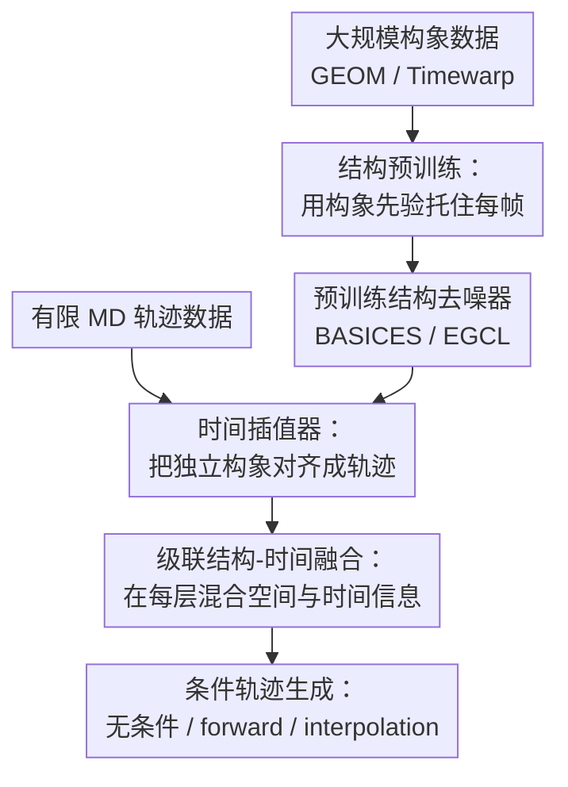

# Align Your Structures: Generating Trajectories with Structure Pretraining for Molecular Dynamics

**会议**: ICLR 2026  
**OpenReview**: [https://openreview.net/forum?id=OKQYMeWlGa](https://openreview.net/forum?id=OKQYMeWlGa)  
**代码**: https://github.com/ani11452/Align_Your_Structures  
**领域**: 计算生物学 / 分子动力学  
**关键词**: 分子动力学生成、结构预训练、等变扩散模型、时间插值器、构象生成  

## 一句话总结
这篇论文提出 EGINTERPOLATOR：先在大规模静态分子构象数据上训练等变扩散结构模型，再用时间插值器在少量 MD 轨迹上学习帧间相关性，从而在小分子、药物分子、四肽和蛋白单体上生成更接近真实分子动力学的轨迹。

## 研究背景与动机
**领域现状**：分子动力学（Molecular Dynamics, MD）用数值积分近似原子随时间的运动，是药物发现、材料模拟和生物物理里非常核心的工具。传统 MD 的优势是物理解释清楚，但要用很小的时间步长跑很长时间，尤其是显式溶剂和大分子系统时计算成本很高。近年来，几何扩散模型、等变图网络和轨迹生成模型开始被用作 MD 的学习型替代或加速器，希望直接从数据里学习轨迹分布。

**现有痛点**：真正高质量、覆盖大量分子类型的 MD 数据很难获得。现有生成式 MD 模型往往在少数分子或有限分子族上训练，模型容易记住特定体系的轨迹统计，而不是学到能迁移到任意分子的动力学规律。与此同时，MD 轨迹不是一帧静态结构，而是 $T \times N \times 3$ 的时空对象：每一帧要像合理构象，帧与帧之间还要有真实的时间相关性。

**核心矛盾**：静态构象数据相对丰富，能告诉模型“一个分子在三维空间里可能长什么样”；但 MD 轨迹数据昂贵，才包含“这些结构如何随时间连续演化”。如果直接用少量 MD 数据学习完整联合分布 $p_{md}(x^{[T]})$，模型既要补结构常识，又要学时间依赖，优化难度和数据需求都会被放大。

**本文目标**：作者希望把 MD 轨迹生成拆成两个更容易的问题：第一步从大规模构象数据中学每一帧的结构先验；第二步在有限 MD 数据上只重点补上帧间相关性。这个目标覆盖三类任务：无条件生成整段轨迹、给定初始帧的 forward simulation，以及给定起止帧的 interpolation / transition path sampling。

**切入角度**：论文借鉴了“从图像模型扩展到视频模型”的思路：静态结构类似图像，MD 轨迹类似视频。与其从零训练一个同时处理空间和时间的轨迹扩散模型，不如先训练一个强结构模型，再在其上叠加时间层，让时间模块负责把独立构象对齐成动态轨迹。

**核心 idea**：用大规模构象预训练提供每帧的化学合理性，再用等变时间插值器把“帧独立的结构分布”连续推向“帧相关的 MD 分布”。

## 方法详解
### 整体框架
EGINTERPOLATOR 的输入是分子图 $(h, E)$ 和一段待生成的原子坐标轨迹 $x^{[T]} \in \mathbb{R}^{T \times N \times 3}$，输出是符合分子结构约束且带有时间相关性的 MD 轨迹。整体分两阶段：先用 GEOM-QM9 / GEOM-Drugs 等构象数据训练 BASICES 结构扩散模型；再冻结或基本保留这个结构模型，在有限 MD 轨迹上训练额外的时间插值器。

第一阶段只看单帧构象，学习 $p_{cf}(x)$；第二阶段把每个时间帧都喂给同一个结构去噪器，得到一组帧级结构去噪预测，再用时间网络在这些预测和噪声轨迹之间建模时间一致性。这样模型不是直接从随机初始化去拟合 $p_{md}(x^{[T]})$，而是从帧独立分布 $\hat{p}_{md}(x^{[T]})=\prod_{t=0}^{T-1}p_{cf}(x^{(t)})$ 出发，逐步补上 MD 里的时间耦合。

图里的三个贡献节点对应下面的三个关键设计：结构预训练负责解决数据稀缺下的单帧化学合理性；时间插值器负责把独立帧变成有动态相关性的轨迹；级联结构-时间融合则把这种混合从输出层扩展到网络块内部，让空间和时间信息更密地交互。forward simulation 和 interpolation 是同一套生成器的条件化使用方式，不是额外独立方法。

### 关键设计
**1. 结构预训练：用构象先验托住每帧**

MD 轨迹中每一帧首先必须是合理分子构象，否则再像“时间序列”也没有物理意义。论文先训练一个几何扩散构象模型 $\epsilon^{cf}_{\theta}$，用等变图卷积层（EGCL）在单帧分子图上预测扩散噪声。构象训练目标是标准 DDPM 噪声回归：给定加噪构象 $x_{\tau}=\sqrt{\bar{\alpha}_{\tau}}x_0+\sqrt{1-\bar{\alpha}_{\tau}}\epsilon$，模型最小化 $\|\epsilon-\epsilon_{\theta}(x_{\tau},\tau)\|_2^2$。

这个预训练阶段的价值不只是“多用一点数据”。它把三维化学结构里的键长、键角、手性、环结构等强约束提前学进模型，使后续 MD 训练不必在少量轨迹上重新发现这些静态规律。作者把结构模型诱导出的帧独立轨迹分布写成 $\hat{p}_{md}(x^{[T]})=\prod_t p^{cf}_{\theta}(x^{(t)})$：它还不是 MD，因为没有时间相关性，但已经是一个比纯高斯噪声更接近目标的结构锚点。

**2. 时间插值器：把独立构象对齐成轨迹**

如果只把预训练结构模型复制到每一帧，生成结果会像把一堆合理构象随机排成视频：每帧看起来都对，但时间上可能乱跳。论文的核心模块是 temporal interpolator，它把结构模型输出 $\hat{\epsilon}^{md}=[\epsilon^{cf}_{\theta}(x^{(t)}_{\tau},\tau)]_{t=0}^{T-1}$ 和时间网络输出混合为最终轨迹去噪预测：

$$
\epsilon^{md}_{\theta,\phi}(x^{[T]}_{\tau},\tau)=\alpha\hat{\epsilon}^{md}+(1-\alpha)\epsilon^{tp}_{\phi}(x^{[T]}_{\tau},\hat{\epsilon}^{md},\tau)
$$

这里的 $\epsilon^{tp}_{\phi}$ 由等变时间注意力网络 $s^{tp}_{\phi}$ 参数化，并且显式接收结构模型的预测作为输入，而不是只看原始加噪轨迹。直观上，时间网络不是从零判断“这一整段轨迹该如何去噪”，而是在结构模型已经给出的每帧去噪方向上学习“哪些帧之间应该一起动、哪些构象转变应该更平滑”。论文还给出理论解释：插值规则让时间网络隐式学习一个中间分布 $\tilde{p}_{md}(x^{[T]}) \propto p_{md}(x^{[T]})^{\beta}\hat{p}_{md}(x^{[T]})^{1-\beta}$，其中 $\beta=1/(1-\alpha)$。这相当于把困难的 MD 联合分布拟合变成从帧独立结构分布到真实 MD 分布的过渡。

**3. 级联结构-时间融合：在每层混合空间与时间信息**

最简单的做法是在结构模型之后额外堆一个时间模块，但论文发现这样信息流仍然偏粗。CASC 版本把插值操作下沉到每个网络块：每个预训练 EGCL 空间层旁边初始化一个时间块，时间块内部由 ETLayer + EGCL + ETLayer 组成，并在空间输出、时间注意力输出和坐标 / invariant feature 更新之间都引入可学习的混合系数 $\alpha^{(l)}$。

这种设计有两个好处。第一，早期层可以更多依赖预训练结构信息，避免轨迹训练破坏基本几何；后期层可以逐渐让时间模块主导，学习扭转角松弛、慢变量转移和 metastate occupancy 这类真正的动力学统计。第二，线性插值保留 SE(3) 等变性：如果输入整体旋转，结构模型和时间网络的向量输出都会随之旋转，混合后的去噪方向也会一致旋转；如果输入整体平移，输出不会错误依赖绝对坐标。这对分子系统尤其关键，因为物理轨迹不应取决于坐标系摆放。

**4. 条件轨迹生成：同一扩散模型覆盖三种 MD 任务**

论文没有为无条件生成、forward simulation 和 interpolation 分别设计三套模型，而是通过 conditioning mask 控制哪些帧作为条件输入。无条件生成时所有帧都要去噪；forward simulation 把第 0 帧作为控制信号，只对后续帧计算损失；interpolation 同时固定起点和终点，只让中间帧去噪。

这种条件化方式使模型在训练和推理上都比较统一。特别是在 interpolation 里，模型实际生成的是跨越高势垒 metastate 的短路径，而不是盲目滚动普通 MD；在 forward simulation 里，模型可以用 block diffusion rollout 把 1.3 ns 片段连续拼成 5.2 ns 或更长轨迹。统一接口也让实验能比较不同任务下同一个结构预训练思想是否稳定有效。

### 一个完整示例
以 Drugs forward simulation 为例，可以把流程想成这样：给定某个药物分子的 2D 分子图和一帧真实初始构象，模型需要生成接下来约 1.3 ns 的 250 帧轨迹。训练时，初始帧被标记为条件帧，不参与损失；后续 250 帧被加噪，EGINTERPOLATOR 需要同时预测这些帧上的噪声。

在每个扩散步里，BASICES 先像“静态构象专家”一样逐帧判断每个 noisy frame 应该往哪个合理三维构象方向移动。然后时间插值器查看整段 noisy trajectory 和这些逐帧预测，用时间注意力判断相邻帧和远距离帧之间的关系，例如某个 torsion angle 是否应当连续翻转、某些 bond angle 是否应保持稳定。最后，模型输出一整段去噪方向，经过反向扩散得到 250 帧轨迹。推理时把这样的片段滚动 4 次，就得到约 5.2 ns 的生成轨迹，并用真实 MD 的四条参考轨迹来评估分布一致性。

### 损失函数 / 训练策略
构象预训练使用单帧扩散噪声预测损失：

$$
L_{conf}=\mathbb{E}_{x_0\sim D_{conf},\tau,\epsilon}\|\epsilon-\epsilon_{\theta}(x_{\tau},\tau)\|_2^2
$$

MD 微调阶段使用轨迹级噪声预测损失：

$$
L_{md}=\mathbb{E}_{x^{[T]}_0\sim D_{md},\tau,\epsilon^{[T]}}\|\epsilon^{[T]}-\epsilon^{md}_{\theta,\phi}(x^{[T]}_{\tau},\tau)\|_2^2
$$

训练中使用 1000 个扩散步和线性噪声 schedule。小分子任务里结构模型 BASICES 使用 6 层 EGCL，隐藏维度为 128；轨迹模型在每层结构模块旁边加时间注意力模块。论文还采用轨迹级 Kabsch alignment，把 noisy trajectory 和 clean trajectory 在全局旋转平移上对齐后再重算目标噪声，避免模型把坐标系差异误当成动力学信号。对 forward simulation 和 interpolation，条件帧通过 mask 进入网络，但损失只施加在需要生成的帧上。

## 实验关键数据

### 主实验
论文先在小分子上评估无条件生成和 forward simulation。指标使用 Jensen-Shannon Divergence（JSD），越低说明生成轨迹的键角、键长、扭转角和慢动力学分布越接近真实 MD。QM9 是无条件生成，Drugs 是给定起始帧的 forward simulation。

| 数据集 / 任务 | 方法 | Bond Angle JSD ↓ | Bond Length JSD ↓ | Torsion JSD ↓ | TICA 0,1 JSD ↓ |
|--------|------|------:|------:|------:|------:|
| QM9 / 无条件 | GeoTDM | 0.691 | 0.676 | 0.489 | 0.691 |
| QM9 / 无条件 | EGInterpolator-Simple | 0.357 | 0.263 | 0.381 | 0.652 |
| QM9 / 无条件 | EGInterpolator-CASC | 0.305 | 0.210 | 0.363 | 0.636 |
| Drugs / forward | GeoTDM | 0.640 | 0.643 | 0.498 | 0.712 |
| Drugs / forward | EGInterpolator-Simple | 0.208 | 0.258 | 0.385 | 0.660 |
| Drugs / forward | EGInterpolator-CASC | 0.173 | 0.142 | 0.377 | 0.650 |
| Drugs / forward | MD Oracle | 0.036 | 0.030 | 0.215 | 0.610 |

这些结果说明结构预训练对几何分布尤其有帮助。比如 Drugs forward simulation 中，CASC 的键长 JSD 从 GeoTDM 的 0.643 降到 0.142，说明生成结构更少偏离真实键长统计；扭转角和 TICA 指标也同步改善，说明它不只是生成“静态好看”的分子，而是能更接近慢动力学。

能量分析同样支持这一点。论文用 TorchANI2x 估计生成轨迹和真实轨迹的能量分布 Wasserstein-1 距离，结果如下：

| 数据集 | EGInterpolator vs GT W1 ↓ | GeoTDM vs GT W1 ↓ | 说明 |
|--------|------:|------:|------|
| QM9 | 0.8127 | 2.9201 | 本文能量分布更贴近真实轨迹 |
| Drugs | 0.7728 | 12.7664 | GeoTDM 在药物分子上能量偏差明显更大 |
| Tetrapeptide | 0.3806 | 12.8636 | 扩展到四肽后仍保持能量优势 |

### 消融实验
论文的核心消融比较了没有结构预训练的 Naive 版本、去掉插值 / 级联结构的 Stack 版本，以及完整模型。下表摘取主文 Table 2 的关键结果。

| 数据集 | 配置 | Bond Angle JSD ↓ | Bond Length JSD ↓ | Torsion JSD ↓ | TICA 0,1 JSD ↓ |
|------|------|------:|------:|------:|------:|
| QM9 | EGInterpolator-Naive | 0.538 | 0.583 | 0.441 | 0.680 |
| QM9 | EGInterpolator | 0.305 | 0.210 | 0.363 | 0.636 |
| Drugs | EGInterpolator-Stack | 0.325 | 0.330 | 0.414 | 0.673 |
| Drugs | EGInterpolator-Naive | 0.332 | 0.386 | 0.455 | 0.698 |
| Drugs | EGInterpolator | 0.173 | 0.142 | 0.377 | 0.650 |

这个消融非常直接：没有结构预训练时，模型在键长和键角这类强几何约束上明显变差；只堆时间模块而不用论文的插值 / 级联设计，也不能达到完整模型水平。附录里 $\alpha=1$ 的实验进一步说明，单靠独立构象生成不能学到非平凡时间相关性，shuffle 后 torsion decorrelation 会坍缩到 5.2 ps 的帧率基线，而完整模型在 Drugs 上能得到 185.64 ps 的平均 torsional decorrelation time。

### 关键发现
- 结构预训练主要提升几何和能量真实性：键长、键角、能量 W1 的改善最显著，这符合“先学每帧合理结构”的设计目标。
- 时间插值器确实学到非平凡动力学：TICA、MSM occupancy、torsion decorrelation 都比 GeoTDM 更接近参考 MD，而不是只把合理构象随机排列。
- CASC 通常优于 SIMPLE：把空间 / 时间混合放到每层之后，信息交互更密，QM9 和 Drugs 主实验里 CASC 都进一步降低 JSD。
- 插值任务上模型偏向生成高概率有效路径：在 Drugs transition path sampling 中，0.52 ns 生成轨迹取得最低 JSD 和最高 average path probability；长 MD oracle 的 valid path rate 更高，但本文模型能更集中地产生高概率转移。
- 扩展到四肽和蛋白单体后趋势仍成立，但 peptide torsion 任务上 MDGen 的扭转角专用表示仍有优势，说明坐标级模型和 torsion-centric 模型各有适用区间。

## 亮点与洞察
- 这篇论文最清楚的洞察是把 MD 轨迹生成拆成“结构合理性”和“时间相关性”两件事。这个拆法很自然地利用了构象数据比 MD 轨迹更便宜的事实，也避免了小数据下端到端轨迹模型同时学太多东西。
- temporal interpolator 不是简单 fine-tuning head，而是把结构模型输出当作时间模型输入，并用可学习 $\alpha$ 混合两者。这个设计让时间模块在数学上对应一个从 $\hat{p}_{md}$ 到 $p_{md}$ 的中间分布，解释性比“堆一层 temporal attention”强很多。
- 论文保留 SE(3) 等变性这一点很重要。对分子动力学来说，旋转和平移不该改变物理轨迹分布；把结构模块和时间模块都放在等变框架里，能提高数据效率，也减少模型学到坐标系偏差的风险。
- 多任务统一得比较干净。无条件生成、forward simulation 和 interpolation 都通过 conditioning mask 实现，说明这个框架更像一个通用轨迹扩散模型，而不是为单一 benchmark 特调。
- 实验没有只看几何分布，还看了 TICA、MSM、torsion decorrelation、能量 W1 和长 rollout block deterioration。这些指标覆盖了静态结构、慢动力学和能量合理性，比单纯展示几个生成分子图更有说服力。

## 局限与展望
- 生成轨迹仍没有达到真实 MD oracle 的物理精度。尤其在 QM9 的 torsional decorrelation 上，原始生成的平均值只有 13.59 ps，而真实 MD 是 101.0 ps，说明快慢过程的时间尺度仍可能被压缩或扭曲。
- 长时程 rollout 仍有误差累积。附录的 16-block 分析显示，模型不像 GeoTDM 那样出现严重能量崩坏，但中后段 W1 误差会上升，说明短片段扩散拼接还不能完全替代长时间积分。
- 对 peptide torsion 的建模不一定优于专门的扭转角表示。与 MDGen 比较时，本文在 bond angle / bond length 上有优势，但 backbone / side-chain torsion JSD 落后，提示大分子柔性运动可能需要更强的 internal coordinate 或 torsion-aware 机制。
- 结构预训练数据本身有偏差。GEOM、Timewarp 或从 MDGen / Timewarp 抽出的 conformer set 并不等于真实 Boltzmann 分布，预训练先验可能把非物理的采样偏好带入轨迹生成。
- 后续可以考虑把力、能量、Boltzmann weighting 或 force-field consistency 显式放入训练 / 推理。论文已经看到能量指标重要，但目前主要还是数据驱动的扩散损失，物理约束还有继续增强空间。

## 相关工作与启发
- **vs GeoTDM**: GeoTDM 是直接面向几何轨迹的扩散模型，强调等变轨迹建模；本文则先用构象扩散模型提供结构锚点，再用时间插值器学习动态相关性。在小分子和 Drugs 实验里，本文在键长、键角、扭转角、TICA 和能量分布上普遍优于 GeoTDM。
- **vs Timewarp / EquiJump**: 这些方法更偏 autoregressive 或 stochastic interpolant 式地学习时间推进，容易面对误差累积和任务条件化不灵活的问题。本文用块级扩散生成整段轨迹，可以同时支持无条件、forward 和 interpolation，但长 rollout 的误差累积仍然是共同难题。
- **vs MDGen**: MDGen 面向分子动力学轨迹生成，尤其在 peptide torsion 表示上很强。本文的坐标级等变扩散模型在 bond length / bond angle 和能量分布上更自然，但对肽链扭转角慢动力学还未必比 torsion-centric 表示更好。
- **vs 静态构象生成模型（GeoDiff / ConfGF / EDM）**: 静态构象模型只解决“合理三维结构”问题，不建模轨迹时间相关性。本文把这类模型变成 MD 生成器的结构底座，给构象预训练找到了一个很实际的下游用法。
- **启发**：类似思路可以迁移到其他科学时序生成任务。凡是“单帧 / 单状态数据丰富，但真实时间序列昂贵”的问题，都可以考虑先训练状态生成模型，再用轻量时间模块学习动态耦合，例如材料相变路径、蛋白构象转移、机器人接触动力学或气候局部过程模拟。

## 评分
- 新颖性: ⭐⭐⭐⭐☆ 结构预训练加时间插值器的组合很清晰，理论上也解释了插值中间分布；核心思想借鉴视频生成但落到 MD 上比较自然。
- 实验充分度: ⭐⭐⭐⭐⭐ 覆盖 QM9、Drugs、四肽和蛋白单体，并评估无条件、forward、interpolation、消融、能量和长 rollout，实验维度很完整。
- 写作质量: ⭐⭐⭐⭐☆ 主线明确，图和公式能支撑方法理解；但附录实验很多，部分细节如不同数据集预处理和评估子集需要读者仔细追踪。
- 价值: ⭐⭐⭐⭐⭐ 对数据稀缺的分子动力学生成很有参考价值，尤其展示了如何把大规模结构数据转化为轨迹生成能力。

<!-- RELATED:START -->

## 相关论文

- [\[ICLR 2026\] Take Note: Your Molecular Dataset Is Probably Aligned](take_note_your_molecular_dataset_is_probably_aligned.md)
- [\[ICLR 2026\] Learning Flexible Forward Trajectories for Masked Molecular Diffusion](learning_flexible_forward_trajectories_for_masked_molecular_diffusion.md)
- [\[ICLR 2026\] FlexRibbon: Joint Sequence and Structure Pretraining for Protein Modeling](flexribbon_joint_sequence_and_structure_pretraining_for_protein_modeling.md)
- [\[ICLR 2026\] MarS-FM: Generative Modeling of Molecular Dynamics via Markov State Models](mars-fm_generative_modeling_of_molecular_dynamics_via_markov_state_models.md)
- [\[ICLR 2026\] MolEditRL: Structure-Preserving Molecular Editing via Discrete Diffusion and Reinforcement Learning](moleditrl_structure-preserving_molecular_editing_via_discrete_diffusion_and_rein.md)

<!-- RELATED:END -->
